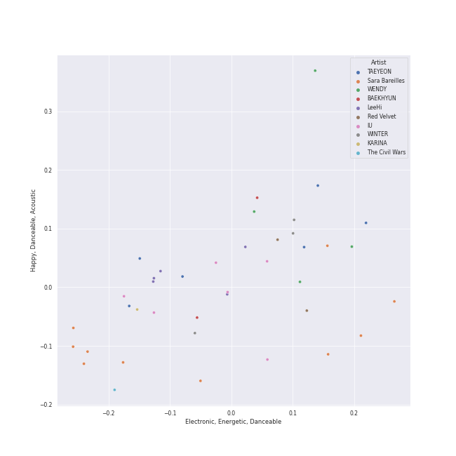
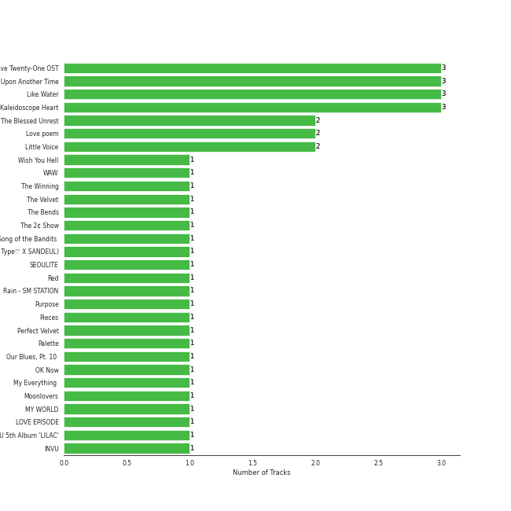
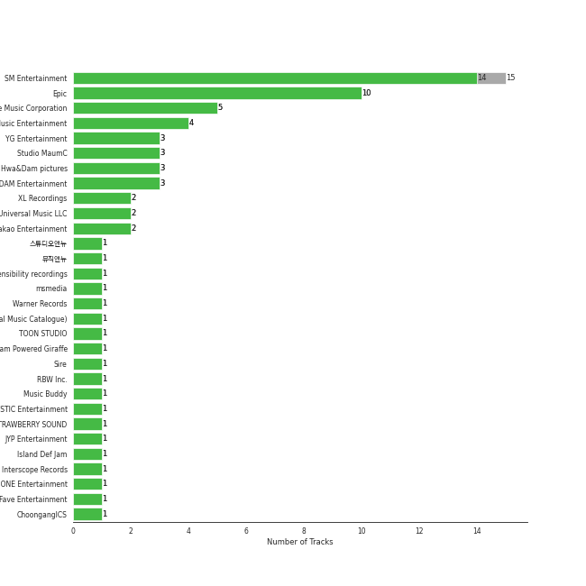
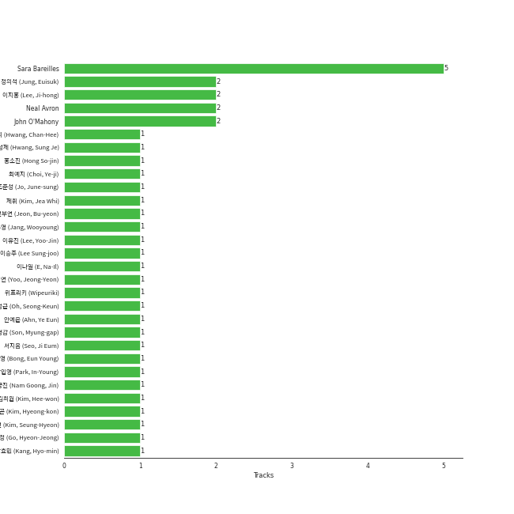
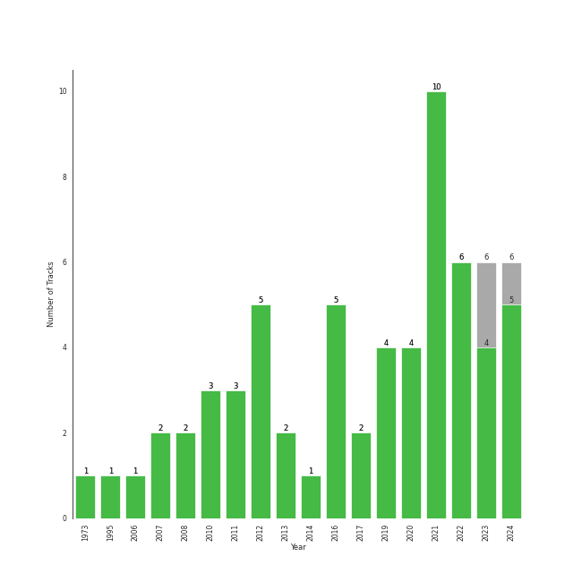

# Relax

[44 tracks (42 liked) 🔗](https://open.spotify.com/playlist/4rnlD7JdUQNdPCBhL69dCg)

[See Track Features](audio_features.md)

[See Clusters](clusters/overview.md)

## Top Artists

| Art | Tracks | 💚 | Artist | 🔗 |
|:---|---:|---:|:---|:---|
|  | 7 | 7 | [Sara Bareilles](../../artists/sara_bareilles/overview.md) | [🔗](https://open.spotify.com/artist/2Sqr0DXoaYABbjBo9HaMkM) |
|  | 6 | 6 | [IU](../../artists/iu/overview.md) | [🔗](https://open.spotify.com/artist/3HqSLMAZ3g3d5poNaI7GOU) |
|  | 6 | 4 | [TAEYEON](../../artists/taeyeon/overview.md) | [🔗](https://open.spotify.com/artist/3qNVuliS40BLgXGxhdBdqu) |
|  | 4 | 4 | [LeeHi](../../artists/leehi/overview.md) | [🔗](https://open.spotify.com/artist/7cVZApDoQZpS447nHTsNqu) |
|  | 3 | 3 | [Red Velvet](../../artists/red_velvet/overview.md) | [🔗](https://open.spotify.com/artist/1z4g3DjTBBZKhvAroFlhOM) |
|  | 3 | 3 | [WENDY](../../artists/wendy/overview.md) | [🔗](https://open.spotify.com/artist/0FRUZvZNPzM3YJMABJxf2K) |
|  | 2 | 2 | [BAEKHYUN](../../artists/baekhyun/overview.md) | [🔗](https://open.spotify.com/artist/4ufh0WuMZh6y4Dmdnklvdl) |
|  | 2 | 2 | [WINTER](../../artists/winter/overview.md) | [🔗](https://open.spotify.com/artist/3mPquBmMu97Iq9TpzQ6ayI) |
|  | 1 | 1 | [Crush](../../artists/crush/overview.md) | [🔗](https://open.spotify.com/artist/6aLdhHUqgdKE86xbtNmY8g) |
|  | 1 | 1 | [aespa](../../artists/aespa/overview.md) | [🔗](https://open.spotify.com/artist/6YVMFz59CuY7ngCxTxjpxE) |

See all 25 artists

| Art | Tracks | 💚 | Artist | 🔗 |
|:---|---:|---:|:---|:---|
|  | 1 | 1 | [Ariana Grande](../../artists/ariana_grande/overview.md) | [🔗](https://open.spotify.com/artist/66CXWjxzNUsdJxJ2JdwvnR) |
|  | 1 | 1 | NINGNING | [🔗](https://open.spotify.com/artist/5t1uryofgueHrjrryqX8vM) |
|  | 1 | 1 | YESUNG | [🔗](https://open.spotify.com/artist/4hyF8Vtc73RYJr3RgTE2Zf) |
|  | 1 | 1 | Adele | [🔗](https://open.spotify.com/artist/4dpARuHxo51G3z768sgnrY) |
|  | 1 | 1 | Suzy | [🔗](https://open.spotify.com/artist/4U80LJd8sG6U9YTFP5izka) |
|  | 1 | 1 | [BLACKPINK](../../artists/blackpink/overview.md) | [🔗](https://open.spotify.com/artist/41MozSoPIsD1dJM0CLPjZF) |
|  | 1 | 1 | KARINA | [🔗](https://open.spotify.com/artist/2qwDjeSYANOOBFU8jwtBXx) |
|  | 1 | 1 | Loco | [🔗](https://open.spotify.com/artist/2e4G04F77jxVuDYo44TCSm) |
|  | 1 | 1 | Birdy | [🔗](https://open.spotify.com/artist/2WX2uTcsvV5OnS0inACecP) |
|  | 1 | 1 | Sandeul | [🔗](https://open.spotify.com/artist/2QeJBmgBdpH4i3uJns5Rdx) |
|  | 1 | 1 | Punch | [🔗](https://open.spotify.com/artist/2FgZrgTMX6Sk0VNcOsEPmm) |
|  | 1 | 1 | nævis | [🔗](https://open.spotify.com/artist/2067CjQ2nC56cRZX8goeHg) |
|  | 1 | 1 | JOY | [🔗](https://open.spotify.com/artist/0sYpJ0nCC8AlDrZFeAA7ub) |
|  | 1 | 1 | [MAMAMOO](../../artists/mamamoo/overview.md) | [🔗](https://open.spotify.com/artist/0XATRDCYuuGhk0oE7C0o5G) |
|  | 1 | 1 | [Taylor Swift](../../artists/taylor_swift/overview.md) | [🔗](https://open.spotify.com/artist/06HL4z0CvFAxyc27GXpf02) |

## Top Albums

| Art | Tracks | 💚 | Album | Release Date | 🔗 |
|:---|---:|---:|:---|:---|:---|
|  | 3 | 3 | Like Water - The 1st Mini Album | 2021-04-05 | [🔗](https://open.spotify.com/album/1Ao5vWPO13f4l0ldwxOKL7) |
|  | 2 | 2 | The Blessed Unrest | 2013-07-16 | [🔗](https://open.spotify.com/album/7lpbyGc4fHsQkBTsfWVBhp) |
|  | 2 | 2 | Once Upon Another Time | 2012-05-22 | [🔗](https://open.spotify.com/album/1PrqYZJRzGNf8AsSOraxnZ) |
|  | 2 | 2 | Love poem | 2019-11-18 | [🔗](https://open.spotify.com/album/2xEH7SRzJq7LgA0fCtTlxH) |
|  | 2 | 2 | Kaleidoscope Heart | 2010-09-07 | [🔗](https://open.spotify.com/album/627ukPRwYxyBREHxBq0vGJ) |
|  | 1 | 1 | ‘The ReVe Festival 2022 - Feel My Rhythm’ | 2022-03-21 | [🔗](https://open.spotify.com/album/3HgoCO9wWuPcNhz8Ip4C46) |
|  | 1 | 1 | WAW | 2021-06-02 | [🔗](https://open.spotify.com/album/0gt7dy4ONFo6uc8D5w2WNi) |
|  | 1 | 1 | The Winning | 2024-02-20 | [🔗](https://open.spotify.com/album/08CvAj58nVMpq1Nw7T6maj) |
|  | 1 | 1 | The Velvet - The 2nd Mini Album | 2016-03-17 | [🔗](https://open.spotify.com/album/2qgl7dAgslqL1w2l2wQhMA) |
|  | 1 | 1 | Song of the Bandits (Original Soundtrack from the Netflix Series) | 2023-09-22 | [🔗](https://open.spotify.com/album/1TXOVlZGrd3KbphTcXN8vw) |

See all 38 albums

| Art | Tracks | 💚 | Album | Release Date | 🔗 |
|:---|---:|---:|:---|:---|:---|
|  | 1 | 1 | Slightly Tipsy (She is My Type♡ X SANDEUL) | 2020-07-20 | [🔗](https://open.spotify.com/album/2bal48tjyi26OAxY2KxwFL) |
|  | 1 | 1 | SEOULITE | 2016-03-09 | [🔗](https://open.spotify.com/album/2c41Flo2HQgy0A9P3xuSFf) |
|  | 1 | 1 | Red | 2012-10-22 | [🔗](https://open.spotify.com/album/1EoDsNmgTLtmwe1BDAVxV5) |
|  | 1 | 1 | Rain - SM STATION | 2016-02-03 | [🔗](https://open.spotify.com/album/5MgY1E2inbDcthAQEzwz8L) |
|  | 1 | 1 | Pieces | 2021-12-29 | [🔗](https://open.spotify.com/album/3ivhPVStd9RrtczBFwjkMQ) |
|  | 1 | 1 | Perfect Velvet - The 2nd Album | 2017-11-17 | [🔗](https://open.spotify.com/album/0rvrbZvaDX5S9ZBhwOwFfH) |
|  | 1 | 1 | Palette | 2017-04-21 | [🔗](https://open.spotify.com/album/5V8n6fqyAPxvFTibPhQVcp) |
|  | 1 | 1 | Our Blues, Pt. 10 (Original Television Soundtrack) | 2022-05-22 | [🔗](https://open.spotify.com/album/0mP330aRyX4P4ZjarRKnXO) |
|  | 1 | 1 | My Voice - The 1st Album (Deluxe Edition) | 2017-04-05 | [🔗](https://open.spotify.com/album/7MG0bxf0ZFsAyej9W3XzTO) |
|  | 1 | 1 | My Everything (Deluxe) | 2014-08-25 | [🔗](https://open.spotify.com/album/6EVYTRG1drKdO8OnIQBeEj) |
|  | 1 | 1 | Moonlovers - Scarlet Heart Ryeo (Original Television Soundtrack), Pt. 2 | 2016-08-29 | [🔗](https://open.spotify.com/album/68xTLBWjoRADRf86WYmTmy) |
|  | 1 | 1 | MY WORLD - The 3rd Mini Album | 2023-05-08 | [🔗](https://open.spotify.com/album/69xF8jTd0c4Zoo7DT3Rwrn) |
|  | 1 | 1 | Little Voice | 2007-07-03 | [🔗](https://open.spotify.com/album/2Z9WUERfMjOgQ6ze9TcGbF) |
|  | 1 | 1 | IU 5th Album 'LILAC' | 2021-03-25 | [🔗](https://open.spotify.com/album/01dPJcwyht77brL4JQiR8R) |
|  | 1 | 1 | Hotel del Luna (Original Television Soundtrack) Pt.3 | 2019-07-21 | [🔗](https://open.spotify.com/album/6nddI94g7zC5bbyNzRBO0Y) |
|  | 1 | 1 | Hong Gil Dong OST | 2008-01-23 | [🔗](https://open.spotify.com/album/5Efud8Wmo7vBQjSJI1WcJ7) |
|  | 1 | 1 | Hello - Special Album | 2021-05-31 | [🔗](https://open.spotify.com/album/37mRfTDwQzVbHihypYY8oE) |
|  | 1 | 1 | HOLO | 2020-07-23 | [🔗](https://open.spotify.com/album/5xq9sm0jGMMDu5LifpBBo1) |
|  | 1 | 1 | For You | 2020-12-16 | [🔗](https://open.spotify.com/album/6hiwkmlOoNm8F3UkAZJcEz) |
|  | 1 | 1 | Floral Sense - The 1st Album (Special Version) | 2023-02-27 | [🔗](https://open.spotify.com/album/3GiIDO4BTLwJuZWQszk4Tg) |
|  | 1 | 1 | Dream | 2016-01-07 | [🔗](https://open.spotify.com/album/7ciJtZ2tYXhKsndQ7bf7Vw) |
|  | 1 | 1 | Birdy | 2011-11-04 | [🔗](https://open.spotify.com/album/1WGjSVIw0TVfbp5KrOFiP0) |
|  | 1 | 1 | BORN PINK | 2022-09-16 | [🔗](https://open.spotify.com/album/7jaSNQUBJbvfbZHLNFrV7P) |
|  | 1 | 1 | Amusement Park | 2020-12-21 | [🔗](https://open.spotify.com/album/1azcqabc4kDgRNMWFA02wZ) |
|  | 1 | 1 | 4 ONLY | 2021-09-09 | [🔗](https://open.spotify.com/album/1DKgZeAYrjslAPZVMe6EFt) |
|  | 1 | 1 | 21 | 2011-01-24 | [🔗](https://open.spotify.com/album/0Lg1uZvI312TPqxNWShFXL) |
|  | 1 | 0 | To. X - The 5th Mini Album | 2023-11-27 | [🔗](https://open.spotify.com/album/0VciVDVU6NoqtQ0WAIlTmD) |
|  | 1 | 0 | Purpose - The 2nd Album | 2019-10-28 | [🔗](https://open.spotify.com/album/0h6wCpdgpSOAbYDDYJVuwr) |

## Top Record Labels

| Tracks | 💚 | Label |
|---:|---:|:---|
| 15 | 13 | [SM Entertainment](../../labels/sm_entertainment/overview.md) |
| 7 | 7 | [Epic](../../labels/epic/overview.md) |
| 5 | 5 | [Genie Music Corporation](../../labels/genie_music_corporation/overview.md) |
| 4 | 4 | [Stone Music Entertainment](../../labels/stone_music_entertainment/overview.md) |
| 3 | 3 | [EDAM Entertainment](../../labels/edam_entertainment/overview.md) |
| 2 | 2 | [YG Entertainment](../../labels/yg_entertainment/overview.md) |
| 2 | 2 | [Kakao Entertainment](../../labels/kakao_entertainment/overview.md) |
| 1 | 1 | msmedia |
| 1 | 1 | [XL Recordings](../../labels/xl_recordings/overview.md) |
| 1 | 1 | [Warner Records](../../labels/warner_records/overview.md) |

See all 22 labels

| Tracks | 💚 | Label |
|---:|---:|:---|
| 1 | 1 | [Universal Music LLC](../../labels/universal_music_llc/overview.md) |
| 1 | 1 | TOON STUDIO |
| 1 | 1 | [RBW Inc.](../../labels/rbw_inc_/overview.md) |
| 1 | 1 | MYSTIC Entertainment |
| 1 | 1 | [JYP Entertainment](../../labels/jyp_entertainment/overview.md) |
| 1 | 1 | [Interscope Records](../../labels/interscope_records/overview.md) |
| 1 | 1 | Fave Entertainment |
| 1 | 1 | ChoongangICS |
| 1 | 1 | [Big Machine Records](../../labels/big_machine_records/overview.md) |
| 1 | 1 | Beyond Music |
| 1 | 1 | Atlantic Records UK |
| 1 | 1 | AOMG |

## Genres

| Tracks | 💚 | Genre |
|---:|---:|:---|
| 29 | 27 | [k-pop](../../genres/k-pop/overview.md) |
| 10 | 10 | [pop](../../genres/pop/overview.md) |
| 8 | 8 | [neo mellow](../../genres/neo_mellow/overview.md) |
| 7 | 7 | [post-teen pop](../../genres/post-teen_pop/overview.md) |
| 7 | 7 | [pop rock](../../genres/pop_rock/overview.md) |
| 7 | 7 | [lilith](../../genres/lilith/overview.md) |
| 7 | 7 | [ectofolk](../../genres/ectofolk/overview.md) |
| 7 | 7 | [acoustic pop](../../genres/acoustic_pop/overview.md) |
| 6 | 6 | [k-pop girl group](../../genres/k-pop_girl_group/overview.md) |
| 4 | 4 | [korean pop](../../genres/korean_pop/overview.md) |

See all 16 genres

| Tracks | 💚 | Genre |
|---:|---:|:---|
| 2 | 2 | [uk pop](../../genres/uk_pop/overview.md) |
| 1 | 1 | [viral pop](../../genres/viral_pop/overview.md) |
| 1 | 1 | pop soul |
| 1 | 1 | [korean r&b](../../genres/korean_r_b/overview.md) |
| 1 | 1 | [k-rap](../../genres/k-rap/overview.md) |
| 1 | 1 | british soul |

## Top Producers

| Art | Producer | Tracks | Credit Types |
|:---|:---|---:|:---|
|  | [Sara Bareilles](../../artists/sara_bareilles/overview.md) | 4 | Lyricist, Songwriter, Producer |
| | Neal Avron | 2 | Arranger |
| | John O'Mahony | 2 | Producer |
| | Dann Huff | 1 | Producer |
| | 강효민 (Kang, Hyo-min) | 1 | Producer |
| | 제휘 (Kim, Jea Whi) | 1 | Arranger, Songwriter |
| | [서지음 (Seo, Ji Eum)](../../producers/서지음_(seo,_ji_eum)/overview.md) | 1 | Lyricist |
| | Willy Moon | 1 | Lyricist, Songwriter |
|  | [IU](../../artists/iu/overview.md) | 1 | Lyricist |
| | 봉은영 (Bong, Eun Young) | 1 | Lyricist |

View all

| Art | Producer | Tracks | Credit Types |
|:---|:---|---:|:---|
| | 이승주 (Lee Sung-joo) | 1 | Arranger |
| | [24](../../producers/24/overview.md) | 1 | Arranger, Songwriter |
| | Mafly | 1 | Lyricist |
| | Justin Niebank | 1 | Producer |
| | 황찬희 (Hwang, Chan-Hee) | 1 | Arranger, Producer, Songwriter |
| | TBHits | 1 | Producer, Songwriter |
|  | Adele | 1 | Songwriter |
| | Tayla Parx | 1 | Songwriter |
| | 남궁진 (Nam Goong, Jin) | 1 | Producer |
| | [John Hanes](../../producers/john_hanes/overview.md) | 1 | Producer |
| | [Serban Ghenea](../../producers/serban_ghenea/overview.md) | 1 | Producer |
| | 김희원 (Kim, Hee-won) | 1 | Songwriter |
| | Francis White | 1 | Songwriter |
| | Tommy Walter | 1 | Producer |
| | 황성제 (Hwang, Sung Je) | 1 | Arranger |
| | [Josh Gudwin](../../producers/josh_gudwin/overview.md) | 1 | Producer |
| | 정의석 (Jung, Euisuk) | 1 | Producer |
| | Kurt Uenala | 1 | Producer |
|  | [Ariana Grande](../../artists/ariana_grande/overview.md) | 1 | Songwriter |
| | 오성근 (Oh, Seong-Keun) | 1 | Producer |
| | [TEDDY](../../producers/teddy/overview.md) | 1 | Producer |
| | Nathan Chapman | 1 | Producer |
| | 위프리키 (Wipeuriki) | 1 | Songwriter |
| | Jeremy Darby | 1 | Producer |
| | YOUNGJU BANG | 1 | Producer |
| | Steve Marcantonio | 1 | Producer |
| | Justin Vernon | 1 | Lyricist, Songwriter |
| | 이나일 (E, Na-Il) | 1 | Arranger |
| | 김형곤 (Kim, Hyeong-kon) | 1 | Producer |
| | David Huff | 1 | Producer |
| | NOHC | 1 | Arranger |
| | Paul 'P Dub' Walton | 1 | Producer |
| | Jeff Gartenbaum | 1 | Producer |
| | Christian Vinten | 1 | Arranger, Songwriter |
| | Teddy Sinclair | 1 | Lyricist, Songwriter |
|  | [Taylor Swift](../../artists/taylor_swift/overview.md) | 1 | Lyricist, Producer, Songwriter |
| | [김이나 (Kim, Eana)](../../producers/김이나_(kim,_eana)/overview.md) | 1 | Lyricist |
| | Olivia Holt | 1 | Songwriter |
|  | Victoria Monét | 1 | Producer, Songwriter |
| | JONGHYUN | 1 | Lyricist, Songwriter |
| | 장우영 (Jang, Wooyoung) | 1 | Producer |
| | Aaron Benward | 1 | Songwriter |
| | Andreas Öberg (Öberg, Andreas) | 1 | Songwriter |
| | 손명갑 (Son, Myung-gap) | 1 | Producer |
| | 박인영 (Park, In-Young) | 1 | Arranger |
| | Maria Marcus | 1 | Songwriter |
| | 이지홍 (Lee, Ji-hong) | 1 | Producer |
| | Paro | 1 | Lyricist, Songwriter |
| | Matthew Tishler | 1 | Arranger, Songwriter |
| | Todor Kobakov | 1 | Arranger |
| | 조준성 (Jo, June-sung) | 1 | Producer |
| | Chelcee Grimes | 1 | Arranger, Songwriter |
| | Felicia Barton | 1 | Songwriter |
| | 유정연 (Yoo, Jeong-Yeon) | 1 | Songwriter |
| | Alex Gilbert | 1 | Producer |
| | 이유진 (Lee, Yoo-Jin) | 1 | Lyricist |
| | 홍소진 (Hong So-jin) | 1 | Arranger |

## Most and least listened tracks
| ​ | Most listened tracks | Score | ​​ | Least listened tracks | Score |
|:---|:---|---:|:---|:---|---:|
|  | [HOLO](../../artists/leehi/overview.md) | 51526 |  | [Breathe Again](../../artists/sara_bareilles/overview.md) | 0 |
|  | [My sea](../../artists/iu/overview.md) | 43449 |  | [Manhattan](../../artists/sara_bareilles/overview.md) | 0 |
|  | [When This Rain Stops](../../artists/wendy/overview.md) | 42246 |  | [Where Are We Now](../../artists/mamamoo/overview.md) | 0 |
|  | [Amusement Park](../../artists/baekhyun/overview.md) | 28068 |  | [Moonlight Melody](../../artists/red_velvet/overview.md) | 0 |
|  | [Welcome To MY World (feat. nævis)](../../artists/aespa/overview.md) | 25781 |  | [The Happiest Girl](../../artists/blackpink/overview.md) | 0 |
|  | Dream | 17853 |  | [Stay](../../artists/sara_bareilles/overview.md) | 0 |
|  | [Like Water](../../artists/wendy/overview.md) | 9186 |  | [Wine](../../artists/taeyeon/overview.md) | 0 |
|  | [ONLY](../../artists/leehi/overview.md) | 7502 |  | [Through the Night](../../artists/iu/overview.md) | 0 |
|  | [7월 7일 One Of These Nights](../../artists/red_velvet/overview.md) | 5874 |  | [Bluebird](../../artists/sara_bareilles/overview.md) | 0 |
|  | [Rain](../../artists/taeyeon/overview.md) | 361 |  | Skinny Love | 0 |

## Years

| ​ | 10 newest albums | ​​ | 10 oldest albums |
|:---|:---|:---|:---|
|  | The Winning (2024-02-20) |  | Little Voice (2007-07-03) |
|  | To. X - The 5th Mini Album (2023-11-27) |  | Hong Gil Dong OST (2008-01-23) |
|  | Song of the Bandits (Original Soundtrack from the Netflix Series) (2023-09-22) |  | Kaleidoscope Heart (2010-09-07) |
|  | MY WORLD - The 3rd Mini Album (2023-05-08) |  | 21 (2011-01-24) |
|  | Floral Sense - The 1st Album (Special Version) (2023-02-27) |  | Birdy (2011-11-04) |
|  | BORN PINK (2022-09-16) |  | Once Upon Another Time (2012-05-22) |
|  | Our Blues, Pt. 10 (Original Television Soundtrack) (2022-05-22) |  | Red (2012-10-22) |
|  | ‘The ReVe Festival 2022 - Feel My Rhythm’ (2022-03-21) |  | The Blessed Unrest (2013-07-16) |
|  | Pieces (2021-12-29) |  | My Everything (Deluxe) (2014-08-25) |
|  | 4 ONLY (2021-09-09) |  | Dream (2016-01-07) |