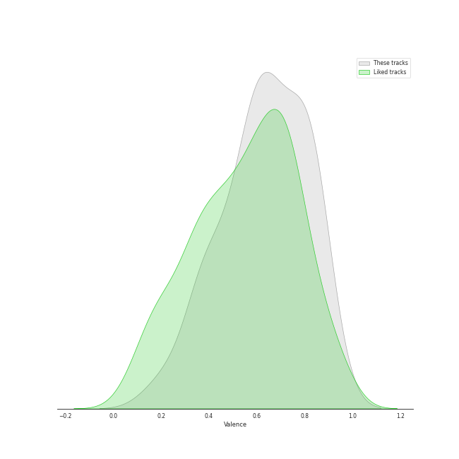

# Track Features for Repeat Rewind

## Danceability

| ​ | 10 most Danceable tracks | ​​ | 10 least Danceable tracks |
|:---|:---|:---|:---|
|  | BATTER UP (0.903) |  | Nightwalker (0.439) |
|  | Wife (0.899) |  | Nightmare (0.466) |
|  | Sugar Rush (0.874) |  | Chill Kill (0.531) |
|  | Soñar (Breaker) (0.86) |  | Bad News (0.581) |
|  | Rollie (0.837) |  | Hold On Tight (0.586) |
|  | I Want That (0.8) |  | Over You (feat. aespa & Chris Martin) (0.586) |
|  | Super Lady (0.795) |  | Underwater (0.59) |
|  | NO MORE (MA BOY) (0.785) |  | ONE SPARK (0.592) |
|  | Water (0.781) |  | Knock Knock (Who's There?) (0.612) |
|  | SET ME FREE (0.756) |  | MEGAVERSE (0.613) |

## Energy

| ​ | 10 most Energetic tracks | ​​ | 10 least Energetic tracks |
|:---|:---|:---|:---|
|  | I Want That (0.87) |  | Burn It Down (0.495) |
|  | Super Lady (0.869) |  | Sugar Rush (0.589) |
|  | Bad News (0.857) |  | Swan Song (0.628) |
|  | Trick or Trick (0.843) |  | Run Away (RYUJIN) (0.663) |
|  | SET ME FREE (0.831) |  | Water (0.667) |
|  | Wife (0.823) |  | Nightmare (0.682) |
|  | Hold On Tight (0.816) |  | BATTER UP (0.685) |
|  | Don't Blink (0.802) |  | Melt Away (0.698) |
|  | Over You (feat. aespa & Chris Martin) (0.798) |  | EASY (0.7) |
|  | Knock Knock (Who's There?) (0.795) |  | Underwater (0.703) |

## Speechiness

| ​ | 10 most Speechy tracks | ​​ | 10 least Speechy tracks |
|:---|:---|:---|:---|
|  | Hold On Tight (0.283) |  | Swan Song (0.0263) |
|  | Sugar Rush (0.247) |  | Melt Away (0.0353) |
|  | Bad News (0.233) |  | Run For Roses (0.0408) |
|  | Trick or Trick (0.143) |  | Illusion (0.0468) |
|  | SET ME FREE (0.141) |  | Nightmare (0.0496) |
|  | Soñar (Breaker) (0.123) |  | EASY (0.0507) |
|  | MEGAVERSE (0.122) |  | Over You (feat. aespa & Chris Martin) (0.0518) |
|  | Super Lady (0.116) |  | NO MORE (MA BOY) (0.0546) |
|  | Wife (0.114) |  | Burn It Down (0.0623) |
|  | Rollie (0.111) |  | Don't Blink (0.0698) |

## Acousticness

| ​ | 10 most Acoustic tracks | ​​ | 10 least Acoustic tracks |
|:---|:---|:---|:---|
|  | Melt Away (0.453) |  | MEGAVERSE (0.00875) |
|  | Burn It Down (0.364) |  | ONE SPARK (0.0151) |
|  | Run For Roses (0.356) |  | Wife (0.0264) |
|  | Knock Knock (Who's There?) (0.348) |  | Bulldozer (0.0529) |
|  | Swan Song (0.325) |  | Chill Kill (0.0549) |
|  | Over You (feat. aespa & Chris Martin) (0.306) |  | BATTER UP (0.069) |
|  | Underwater (0.281) |  | I Want That (0.0693) |
|  | Don't Blink (0.259) |  | Illusion (0.0814) |
|  | Bad News (0.249) |  | Hold On Tight (0.0911) |
|  | Nightmare (0.243) |  | Super Lady (0.0927) |

## Instrumentalness

| ​ | 10 most Instrumental tracks | ​​ | 10 least Instrumental tracks |
|:---|:---|:---|:---|
|  | Wife (0.00222) |  | Water (0.0) |
|  | I Want That (0.000584) |  | Nightmare (0.0) |
|  | Trick or Trick (4.23e-05) |  | Swan Song (0.0) |
|  | Nightwalker (3.28e-05) |  | Melt Away (0.0) |
|  | Illusion (1.75e-05) |  | Don't Blink (0.0) |
|  | BATTER UP (1.12e-05) |  | NO MORE (MA BOY) (0.0) |
|  | Sugar Rush (6.79e-06) |  | SET ME FREE (0.0) |
|  | Hold On Tight (2.81e-06) |  | Run For Roses (0.0) |
|  | EASY (2.74e-06) |  | Underwater (0.0) |
|  | Burn It Down (2.55e-06) |  | Knock Knock (Who's There?) (0.0) |

## Liveness

| ​ | 10 most Live tracks | ​​ | 10 least Live tracks |
|:---|:---|:---|:---|
|  | ONE SPARK (0.753) |  | Water (0.0451) |
|  | Don't Blink (0.384) |  | SET ME FREE (0.0499) |
|  | NO MORE (MA BOY) (0.359) |  | I Want That (0.0742) |
|  | Knock Knock (Who's There?) (0.356) |  | Burn It Down (0.0817) |
|  | Bulldozer (0.344) |  | Soñar (Breaker) (0.082) |
|  | Wife (0.342) |  | Rollie (0.0841) |
|  | Over You (feat. aespa & Chris Martin) (0.333) |  | Trick or Trick (0.0916) |
|  | Nightwalker (0.33) |  | Super Lady (0.109) |
|  | Illusion (0.322) |  | EASY (0.114) |
|  | MEGAVERSE (0.268) |  | Nightmare (0.119) |

## Valence

| ​ | 10 most Happy tracks | ​​ | 10 least Happy tracks |
|:---|:---|:---|:---|
|  | Bad News (0.879) |  | Hold On Tight (0.265) |
|  | Water (0.875) |  | Nightmare (0.321) |
|  | BATTER UP (0.873) |  | ONE SPARK (0.413) |
|  | Run Away (RYUJIN) (0.827) |  | Underwater (0.414) |
|  | Over You (feat. aespa & Chris Martin) (0.806) |  | I Want That (0.434) |
|  | Soñar (Breaker) (0.787) |  | Chill Kill (0.434) |
|  | Rollie (0.776) |  | Melt Away (0.484) |
|  | NO MORE (MA BOY) (0.747) |  | Super Lady (0.525) |
|  | Don't Blink (0.714) |  | Bulldozer (0.568) |
|  | SET ME FREE (0.703) |  | Nightwalker (0.576) |

## Tempo

| ​ | 10 most Fast tracks | ​​ | 10 least Fast tracks |
|:---|:---|:---|:---|
|  | ONE SPARK (169.005) |  | Over You (feat. aespa & Chris Martin) (80.044) |
|  | EASY (165.004) |  | Bad News (83.687) |
|  | Nightmare (162.0) |  | Illusion (90.027) |
|  | Run Away (RYUJIN) (160.09) |  | Swan Song (90.038) |
|  | MEGAVERSE (160.051) |  | Run For Roses (91.994) |
|  | Trick or Trick (159.0) |  | Don't Blink (93.027) |
|  | Bulldozer (152.022) |  | Burn It Down (93.877) |
|  | Chill Kill (148.039) |  | Water (100.0) |
|  | Knock Knock (Who's There?) (147.839) |  | Sugar Rush (109.963) |
|  | Rollie (142.021) |  | SET ME FREE (113.025) |
