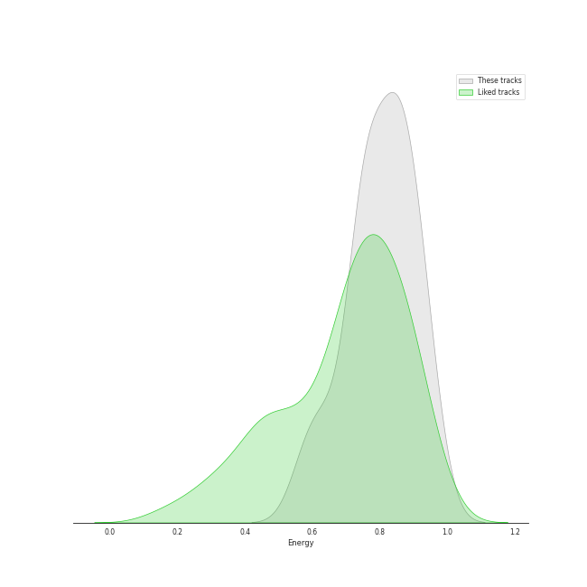

# Track Features for Repeat Rewind

## Danceability

| ​ | 10 most Danceable tracks | ​​ | 10 least Danceable tracks |
|:---|:---|:---|:---|
|  | Red Rover (0.909) |  | Honeybee (0.352) |
|  | SPOT! (0.875) |  | Daisy (0.563) |
|  | LIKE THAT (0.871) |  | Blues (0.567) |
|  | No Biggie (0.84) |  | Last Drop (0.611) |
|  | ELEVEN (0.828) |  | Little Things (0.626) |
|  | Ice Queen (0.82) |  | Cheese (0.654) |
|  | EENIE MEENIE (Feat. Hongjoong of ATEEZ) (0.819) |  | Nobody Knows (0.655) |
|  | Boom Boom Bass (0.807) |  | Sunflower (0.669) |
|  | Magnetic (0.797) |  | Teeth (0.674) |
|  | Algorhythm (0.792) |  | ABCD (0.682) |

## Energy

| ​ | 10 most Energetic tracks | ​​ | 10 least Energetic tracks |
|:---|:---|:---|:---|
|  | Little Things (0.948) |  | Honeybee (0.186) |
|  | Teeth (0.936) |  | LIKE THAT (0.5) |
|  | ABCD (0.926) |  | Sunflower (0.521) |
|  | Love seeker (0.9) |  | Mine (0.572) |
|  | Cheese (0.89) |  | Holssi (0.593) |
|  | I’m Ready (0.882) |  | Red Rover (0.598) |
|  | Live My Life (0.879) |  | Nobody Knows (0.646) |
|  | FANCY (0.874) |  | Ice Queen (0.65) |
|  | Daisy (0.869) |  | Blues (0.657) |
|  | Algorhythm (0.865) |  | Magnetic (0.668) |

## Speechiness

| ​ | 10 most Speechy tracks | ​​ | 10 least Speechy tracks |
|:---|:---|:---|:---|
|  | Blues (0.226) |  | Honeybee (0.0346) |
|  | EENIE MEENIE (Feat. Hongjoong of ATEEZ) (0.198) |  | Sunflower (0.0361) |
|  | No Biggie (0.178) |  | Live My Life (0.0378) |
|  | I’m Ready (0.163) |  | Teeth (0.0436) |
|  | Mine (0.135) |  | FANCY (0.0449) |
|  | Emptiness (0.121) |  | Licorice (0.0463) |
|  | Nobody Knows (0.116) |  | Boom Boom Bass (0.0529) |
|  | ELEVEN (0.111) |  | Daisy (0.0532) |
|  | Holssi (0.108) |  | Love seeker (0.0549) |
|  | LIKE THAT (0.103) |  | 해야 (HEYA) (0.0567) |

## Acousticness

| ​ | 10 most Acoustic tracks | ​​ | 10 least Acoustic tracks |
|:---|:---|:---|:---|
|  | Honeybee (0.871) |  | Little Things (0.00126) |
|  | Ice Queen (0.371) |  | Teeth (0.0029) |
|  | LIKE THAT (0.32) |  | FANCY (0.0122) |
|  | Nobody Knows (0.278) |  | Boom Boom Bass (0.0194) |
|  | Magnetic (0.257) |  | Love seeker (0.0254) |
|  | Blues (0.215) |  | I’m Ready (0.0272) |
|  | Live My Life (0.203) |  | 해야 (HEYA) (0.0297) |
|  | EENIE MEENIE (Feat. Hongjoong of ATEEZ) (0.176) |  | Daisy (0.0362) |
|  | Licorice (0.156) |  | ABCD (0.0404) |
|  | SPOT! (0.151) |  | Cheese (0.0476) |

## Instrumentalness

| ​ | 10 most Instrumental tracks | ​​ | 10 least Instrumental tracks |
|:---|:---|:---|:---|
|  | Teeth (0.0385) |  | ABCD (0.0) |
|  | Little Things (0.000348) |  | Daisy (0.0) |
|  | No Biggie (0.000319) |  | SPOT! (0.0) |
|  | Boom Boom Bass (9.1e-06) |  | Magnetic (0.0) |
|  | Holssi (8.54e-06) |  | Mine (0.0) |
|  | LIKE THAT (3.49e-06) |  | I’m Ready (0.0) |
|  | Live My Life (1.53e-06) |  | Licorice (0.0) |
|  | Honeybee (1.14e-06) |  | FANCY (0.0) |
|  | Sunflower (0.0) |  | EENIE MEENIE (Feat. Hongjoong of ATEEZ) (0.0) |
|  | ELEVEN (0.0) |  | Love seeker (0.0) |

## Liveness

| ​ | 10 most Live tracks | ​​ | 10 least Live tracks |
|:---|:---|:---|:---|
|  | FANCY (0.627) |  | Red Rover (0.0282) |
|  | Little Things (0.26) |  | Love seeker (0.0292) |
|  | Cheese (0.259) |  | ELEVEN (0.048) |
|  | Emptiness (0.258) |  | Holssi (0.0483) |
|  | Mine (0.257) |  | EENIE MEENIE (Feat. Hongjoong of ATEEZ) (0.0558) |
|  | 해야 (HEYA) (0.227) |  | No Biggie (0.0558) |
|  | Last Drop (0.192) |  | LIKE THAT (0.0672) |
|  | ABCD (0.19) |  | Algorhythm (0.0706) |
|  | Nobody Knows (0.156) |  | Live My Life (0.0814) |
|  | Boom Boom Bass (0.145) |  | Magnetic (0.0876) |

## Valence

| ​ | 10 most Happy tracks | ​​ | 10 least Happy tracks |
|:---|:---|:---|:---|
|  | Nobody Knows (0.927) |  | Honeybee (0.216) |
|  | SPOT! (0.906) |  | Little Things (0.357) |
|  | Licorice (0.896) |  | Teeth (0.373) |
|  | Red Rover (0.895) |  | Sunflower (0.378) |
|  | Love seeker (0.884) |  | Ice Queen (0.446) |
|  | ABCD (0.86) |  | Algorhythm (0.463) |
|  | No Biggie (0.835) |  | Daisy (0.48) |
|  | Boom Boom Bass (0.83) |  | Emptiness (0.496) |
|  | Live My Life (0.801) |  | Last Drop (0.506) |
|  | FANCY (0.775) |  | Blues (0.508) |

## Tempo

| ​ | 10 most Fast tracks | ​​ | 10 least Fast tracks |
|:---|:---|:---|:---|
|  | Blues (165.03) |  | Daisy (85.016) |
|  | No Biggie (150.033) |  | Holssi (86.949) |
|  | Mine (144.922) |  | Last Drop (87.03) |
|  | Live My Life (136.995) |  | Honeybee (87.919) |
|  | Sunny Side Up! (134.96) |  | Little Things (90.04) |
|  | FANCY (132.018) |  | Nobody Knows (90.055) |
|  | Magnetic (131.067) |  | Sunflower (90.136) |
|  | Licorice (130.04) |  | 해야 (HEYA) (91.986) |
|  | Algorhythm (126.027) |  | Ice Queen (98.027) |
|  | I’m Ready (125.07) |  | EENIE MEENIE (Feat. Hongjoong of ATEEZ) (99.892) |
