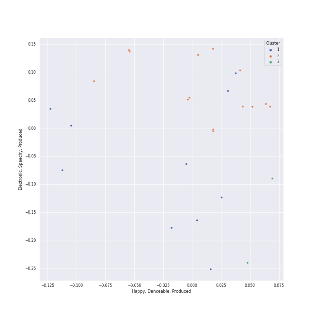

# Clusters in Repeat Rewind

## Cluster #1

10 tracks

| Art | Track | Album | Artists | Label | Rank | 💚 | 🔗 |
|:---|:---|:---|:---|:---|---:|:---|:---|
|  | ONE SPARK | With YOU-th | [TWICE](../../../../artists/twice/overview.md) | [Republic Records](../../../../labels/republic_records) | 284 | 💚 | [🔗](https://open.spotify.com/track/7cIn67LEvk16v6komC8znS) |
|  | Nightwalker | TEN - The 1st Mini Album | [TEN](../../../../artists/ten/overview.md) | [SM Entertainment](../../../../labels/sm_entertainment) | 416 | 💚 | [🔗](https://open.spotify.com/track/4RiudH8RehvLLrk8uNgIdR) |
|  | MEGAVERSE | ROCK-STAR | [Stray Kids](../../../../artists/stray_kids/overview.md) | [Republic Records](../../../../labels/republic_records) | 103 | 💚 | [🔗](https://open.spotify.com/track/5Q1tv4GTxP3IJeGMOKdrFO) |
|  | Bulldozer | Chill Kill - The 3rd Album | [Red Velvet](../../../../artists/red_velvet/overview.md) | [SM Entertainment](../../../../labels/sm_entertainment) | 105 | 💚 | [🔗](https://open.spotify.com/track/4Pp6Ql9wV7A6VqHrmjMFv4) |
|  | Knock Knock (Who's There?) | Chill Kill - The 3rd Album | [Red Velvet](../../../../artists/red_velvet/overview.md) | [SM Entertainment](../../../../labels/sm_entertainment) | 116 | 💚 | [🔗](https://open.spotify.com/track/5nTemr4PG8L9jQoqxsZu6w) |
|  | Chill Kill | Chill Kill - The 3rd Album | [Red Velvet](../../../../artists/red_velvet/overview.md) | [SM Entertainment](../../../../labels/sm_entertainment) | 67 | 💚 | [🔗](https://open.spotify.com/track/68gQG2HpRMxIRom4pCugMq) |
|  | Wife | 2 | [(G)I-DLE](../../../../artists/(g)i-dle/overview.md) | [Cube Entertainment](../../../../labels/cube_entertainment) | 398 | 💚 | [🔗](https://open.spotify.com/track/1j8jqwFpFQ8YqsIJAiYFLZ) |
|  | Illusion | Girls - The 2nd Mini Album | [aespa](../../../../artists/aespa/overview.md) | [SM Entertainment](../../../../labels/sm_entertainment), [Warner Records](../../../../labels/warner_records) | 20 | 💚 | [🔗](https://open.spotify.com/track/396FqjKmViUZ92Wmm4rx3i) |
|  | Don't Blink | Drama - The 4th Mini Album | [aespa](../../../../artists/aespa/overview.md) | [SM Entertainment](../../../../labels/sm_entertainment), [Warner Records](../../../../labels/warner_records) | 99 | 💚 | [🔗](https://open.spotify.com/track/2uJEnyojuGg31VVlLTQFpp) |
|  | NO MORE (MA BOY) | NO MORE (MA BOY) | SISTAR19 | Klap | 504 | 💚 | [🔗](https://open.spotify.com/track/3wdNXGxfzd1O6VBI1hg3pi) |
## Cluster #2

11 tracks

| Art | Track | Album | Artists | Label | Rank | 💚 | 🔗 |
|:---|:---|:---|:---|:---|---:|:---|:---|
|  | Melt Away | To. X - The 5th Mini Album | [TAEYEON](../../../../artists/taeyeon/overview.md) | [SM Entertainment](../../../../labels/sm_entertainment) | 151 | 💚 | [🔗](https://open.spotify.com/track/2cZtazNq0IRRFymK7UaRa0) |
|  | Swan Song | EASY | [LE SSERAFIM](../../../../artists/le_sserafim/overview.md) | [SOURCE MUSIC](../../../../labels/source_music) | 183 | 💚 | [🔗](https://open.spotify.com/track/2GquhrcHbl2zOnF5javAFp) |
|  | EASY | EASY | [LE SSERAFIM](../../../../artists/le_sserafim/overview.md) | [SOURCE MUSIC](../../../../labels/source_music) | 469 | 💚 | [🔗](https://open.spotify.com/track/2O4Bb2WCkjlTPO827OnBMI) |
|  | Nightmare | Chill Kill - The 3rd Album | [Red Velvet](../../../../artists/red_velvet/overview.md) | [SM Entertainment](../../../../labels/sm_entertainment) | 83 | 💚 | [🔗](https://open.spotify.com/track/0jUDrSASok8h2xUIWe4KOG) |
|  | Underwater | Chill Kill - The 3rd Album | [Red Velvet](../../../../artists/red_velvet/overview.md) | [SM Entertainment](../../../../labels/sm_entertainment) | 198 | 💚 | [🔗](https://open.spotify.com/track/58xqapN458N2VjibN3uVrY) |
|  | Super Lady | 2 | [(G)I-DLE](../../../../artists/(g)i-dle/overview.md) | [Cube Entertainment](../../../../labels/cube_entertainment) | 207 | 💚 | [🔗](https://open.spotify.com/track/5qI5EUqfDJpQ7w6sMECK7U) |
|  | I Want That | HEAT | [(G)I-DLE](../../../../artists/(g)i-dle/overview.md) | [88rising Music](../../../../labels/88rising_music), [CUBE ENTERTAINMENT](../../../../labels/cube_entertainment) | 95 | 💚 | [🔗](https://open.spotify.com/track/3F2BLyGt6zYLrHYpbdTw5L) |
|  | Trick or Trick | Drama - The 4th Mini Album | [aespa](../../../../artists/aespa/overview.md) | [SM Entertainment](../../../../labels/sm_entertainment), [Warner Records](../../../../labels/warner_records) | 52 | 💚 | [🔗](https://open.spotify.com/track/3EI3OLBeM89B0o0UsIGCOx) |
|  | Run For Roses | Fe3O4: BREAK | [NMIXX](../../../../artists/nmixx/overview.md) | [Republic Records](../../../../labels/republic_records) | 362 | 💚 | [🔗](https://open.spotify.com/track/4byr9TsXs4qtm8rG2FfwRW) |
|  | Sugar Rush | Bam Yang Gang | [BIBI](../../../../artists/bibi/overview.md) | FeelGhoodMusic | 323 | 💚 | [🔗](https://open.spotify.com/track/5FJqpWkacWPUrXtJ5waI1j) |
## Cluster #3

8 tracks

| Art | Track | Album | Artists | Label | Rank | 💚 | 🔗 |
|:---|:---|:---|:---|:---|---:|:---|:---|
|  | Burn It Down | To. X - The 5th Mini Album | [TAEYEON](../../../../artists/taeyeon/overview.md) | [SM Entertainment](../../../../labels/sm_entertainment) | 123 | 💚 | [🔗](https://open.spotify.com/track/1y8tPIOh9kR3eQE6TeBCwe) |
|  | SET ME FREE | READY TO BE | [TWICE](../../../../artists/twice/overview.md) | [Republic Records](../../../../labels/republic_records) | 97 | 💚 | [🔗](https://open.spotify.com/track/4OtVQ2ZxS7yigIjGz5yKg1) |
|  | Water | TEN - The 1st Mini Album | [TEN](../../../../artists/ten/overview.md) | [SM Entertainment](../../../../labels/sm_entertainment) | nan | 💚 | [🔗](https://open.spotify.com/track/0fl3T6cekhgAxYu5xLWefX) |
|  | Over You (feat. aespa & Chris Martin) | Djesse Vol. 4 | [Jacob Collier](../../../../artists/jacob_collier/overview.md), [aespa](../../../../artists/aespa/overview.md), Chris Martin | [Decca (UMO)](../../../../labels/decca_(umo)) | 335 | 💚 | [🔗](https://open.spotify.com/track/7MSZg4Km8CM7NRXTeJoANZ) |
|  | Run Away (RYUJIN) | BORN TO BE | [ITZY](../../../../artists/itzy/overview.md) | [Republic Records](../../../../labels/republic_records) | 240 | 💚 | [🔗](https://open.spotify.com/track/4e94KIas5maH8RixY26LiN) |
|  | Rollie | 2 | [(G)I-DLE](../../../../artists/(g)i-dle/overview.md) | [Cube Entertainment](../../../../labels/cube_entertainment) | 457 | 💚 | [🔗](https://open.spotify.com/track/71E2JcSbv1abMaua23RBSV) |
|  | Bad News | Born to be XX | [KISS OF LIFE](../../../../artists/kiss_of_life/overview.md) | [S2 ENTERTAINMENT INC.](../../../../labels/s2_entertainment_inc_) | 245 | 💚 | [🔗](https://open.spotify.com/track/7AGq5qaaF9awHDaKuCvVjj) |
|  | Soñar (Breaker) | Fe3O4: BREAK | [NMIXX](../../../../artists/nmixx/overview.md) | [Republic Records](../../../../labels/republic_records) | 193 | 💚 | [🔗](https://open.spotify.com/track/6UwrPxRaR5HPNLDDl7RcT9) |