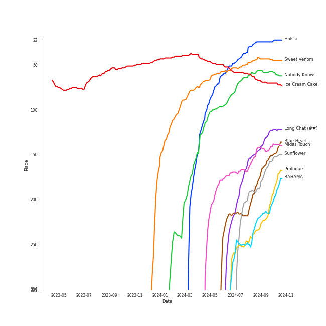
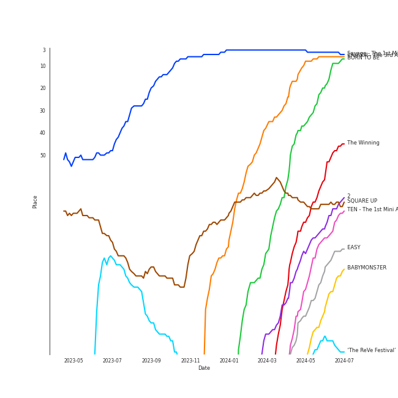

# Repeat Rewind

[30 tracks 🔗](https://open.spotify.com/playlist/37i9dQZF1EpOIeFxMXFVG6)

[See Track Features](audio_features.md)

[See Clusters](clusters/overview.md)

## Top Artists

| Art | Rank | Tracks | 💚 | Artist | 🔗 |
|:---|---:|---:|---:|:---|:---|
|  | 1 | 5 | 5 | [aespa](../../artists/aespa/overview.md) | [🔗](https://open.spotify.com/artist/6YVMFz59CuY7ngCxTxjpxE) |
|  | 17 | 2 | 2 | [IVE](../../artists/ive/overview.md) | [🔗](https://open.spotify.com/artist/6RHTUrRF63xao58xh9FXYJ) |
|  | 7 | 2 | 2 | [ENHYPEN](../../artists/enhypen/overview.md) | [🔗](https://open.spotify.com/artist/5t5FqBwTcgKTaWmfEbwQY9) |
|  | 65 | 2 | 2 | [Solar](../../artists/solar/overview.md) | [🔗](https://open.spotify.com/artist/5cYcI546S8Lf97m4mNdYLD) |
|  | 14 | 2 | 2 | [CHUNG HA](../../artists/chung_ha/overview.md) | [🔗](https://open.spotify.com/artist/2PSJ6YriU7JsFucxACpU7Y) |
|  | 5 | 2 | 2 | [ITZY](../../artists/itzy/overview.md) | [🔗](https://open.spotify.com/artist/2KC9Qb60EaY0kW4eH68vr3) |
|  | 2 | 2 | 2 | [Red Velvet](../../artists/red_velvet/overview.md) | [🔗](https://open.spotify.com/artist/1z4g3DjTBBZKhvAroFlhOM) |
|  | 9 | 1 | 1 | [TWICE](../../artists/twice/overview.md) | [🔗](https://open.spotify.com/artist/7n2Ycct7Beij7Dj7meI4X0) |
|  | 127 | 1 | 1 | ZICO | [🔗](https://open.spotify.com/artist/4XpUIb8uuNlIWVKmgKZXC0) |
|  | 50 | 1 | 1 | [KISS OF LIFE](../../artists/kiss_of_life/overview.md) | [🔗](https://open.spotify.com/artist/4TEK9tIkcoxib4GxT3O4ky) |

See all 22 artists

| Art | Rank | Tracks | 💚 | Artist | 🔗 |
|:---|---:|---:|---:|:---|:---|
|  | 15 | 1 | 1 | [LE SSERAFIM](../../artists/le_sserafim/overview.md) | [🔗](https://open.spotify.com/artist/4SpbR6yFEvexJuaBpgAU5p) |
|  | 3 | 1 | 1 | [BLACKPINK](../../artists/blackpink/overview.md) | [🔗](https://open.spotify.com/artist/41MozSoPIsD1dJM0CLPjZF) |
| | 236 | 1 | 1 | Hongjoong of ATEEZ | [🔗](https://open.spotify.com/artist/3MZLSgcd5kOdhrZasDMecx) |
|  | 4 | 1 | 1 | [IU](../../artists/iu/overview.md) | [🔗](https://open.spotify.com/artist/3HqSLMAZ3g3d5poNaI7GOU) |
|  | 156 | 1 | 1 | JO1 | [🔗](https://open.spotify.com/artist/2koP6FEfIEVk4l2Fe6jFhu) |
|  | 26 | 1 | 1 | [Sara Bareilles](../../artists/sara_bareilles/overview.md) | [🔗](https://open.spotify.com/artist/2Sqr0DXoaYABbjBo9HaMkM) |
|  | 110 | 1 | 1 | JENNIE | [🔗](https://open.spotify.com/artist/250b0Wlc5Vk0CoUsaCY84M) |
|  | 87 | 1 | 1 | [YUQI](../../artists/yuqi/overview.md) | [🔗](https://open.spotify.com/artist/22aCD8IrQZjcPgZw728QT6) |
|  | 130 | 1 | 1 | Steam Powered Giraffe | [🔗](https://open.spotify.com/artist/1yqs45BSh7457Flyhmdv7f) |
|  | 67 | 1 | 1 | [PENTAGON](../../artists/pentagon/overview.md) | [🔗](https://open.spotify.com/artist/1wKpMkucynaTfG8lyPprYV) |
|  | 377 | 1 | 1 | Xdinary Heroes | [🔗](https://open.spotify.com/artist/1khChLj7REGqjM043PlYyn) |
|  | 148 | 1 | 1 | NAYEON | [🔗](https://open.spotify.com/artist/1VwDG9aBflQupaFNjUru9A) |

## Top Tracks

Most and least listened tracks

| Rank | ​ | Most listened tracks | Rank | ​​ | Least listened tracks |
|---:|:---|:---|---:|:---|:---|
| 37 |  | [Holssi](../../artists/iu/overview.md) | 815 |  | Little Things |
| 65 |  | [Nobody Knows](../../artists/kiss_of_life/overview.md) | 480 |  | [ELEVEN](../../artists/ive/overview.md) |
| 69 |  | [DDU-DU DDU-DU](../../artists/blackpink/overview.md) | 411 |  | [Teeth](../../artists/enhypen/overview.md) |
| 134 |  | [Mine](../../artists/aespa/overview.md) | 383 |  | ABCD |
| 138 |  | [I'll Make You Cry](../../artists/aespa/overview.md) | 378 |  | [EENIE MEENIE (Feat. Hongjoong of ATEEZ)](../../artists/chung_ha/overview.md) |
| 182 |  | [Daisy](../../artists/pentagon/overview.md) | 350 |  | [Live My Life](../../artists/aespa/overview.md) |
| 198 |  | SPOT! | 328 |  | [I’m Ready](../../artists/chung_ha/overview.md) |
| 200 |  | [Sunflower](../../artists/red_velvet/overview.md) | 315 |  | [Honey Honey](../../artists/solar/overview.md) |
| 212 |  | Honeybee | 301 |  | [But I](../../artists/solar/overview.md) |
| 217 |  | [Red Rover](../../artists/yuqi/overview.md) | 291 |  | [Licorice](../../artists/aespa/overview.md) |

## Top Albums

| Art | Rank | Tracks | 💚 | Album | Release Date | 🔗 |
|:---|---:|---:|---:|:---|:---|:---|
|  | 44 | 4 | 4 | Armageddon - The 1st Album | 2024-05-27 | [🔗](https://open.spotify.com/album/058hCti9Bupb5CJc6bd3VB) |
|  | 193 | 2 | 2 | EENIE MEENIE | 2024-03-11 | [🔗](https://open.spotify.com/album/1q2RNzz09Vx3bOKK1yTyyg) |
|  | 126 | 2 | 2 | DARK MOON SPECIAL ALBUM <MEMORABILIA> | 2024-05-13 | [🔗](https://open.spotify.com/album/0OhJwEzXbK9Km6GQSPdmPU) |
|  | 109 | 2 | 2 | Cosmic | 2024-06-24 | [🔗](https://open.spotify.com/album/5E8apoFsaUFhZxGGSju6aW) |
|  | 160 | 2 | 2 | COLOURS | 2024-04-30 | [🔗](https://open.spotify.com/album/5Q1cKPuB4vPk8bIdfZH7Fm) |
|  | 156 | 2 | 2 | Algorhythm | 2024-05-15 | [🔗](https://open.spotify.com/album/7ji7zKkvRlYOsu3ehctQRx) |
|  | 131 | 1 | 1 | YUQ1 | 2024-04-23 | [🔗](https://open.spotify.com/album/7LYc8ngbhwha4aGJ5kVauc) |
|  | 138 | 1 | 1 | WE:TH | 2020-10-12 | [🔗](https://open.spotify.com/album/1ASYbBYBwV6Rcfc2ycqmlK) |
|  | 546 | 1 | 1 | Troubleshooting | 2024-04-30 | [🔗](https://open.spotify.com/album/26ogXm7X0kUSidtoaQVBei) |
|  | 30 | 1 | 1 | The Winning | 2024-02-20 | [🔗](https://open.spotify.com/album/08CvAj58nVMpq1Nw7T6maj) |

See all 22 albums

| Art | Rank | Tracks | 💚 | Album | Release Date | 🔗 |
|:---|---:|---:|---:|:---|:---|:---|
|  | 154 | 1 | 1 | The 2¢ Show | 2012-05-23 | [🔗](https://open.spotify.com/album/4DECRyKlhKJgjZLLuvfAI6) |
|  | 6 | 1 | 1 | Savage - The 1st Mini Album | 2021-10-05 | [🔗](https://open.spotify.com/album/3vyyDkvYWC36DwgZCYd3Wu) |
|  | 69 | 1 | 1 | SQUARE UP | 2018-06-15 | [🔗](https://open.spotify.com/album/0wOiWrujRbxlKEGWRQpKYc) |
|  | 146 | 1 | 1 | SPOT! | 2024-04-26 | [🔗](https://open.spotify.com/album/3K3C9JjwCGQAzj3Bu7BUaI) |
|  | 277 | 1 | 1 | NA | 2024-06-14 | [🔗](https://open.spotify.com/album/5zQI9dFbS9TrhvC9clgjz7) |
|  | 185 | 1 | 1 | Love seeker | 2024-05-11 | [🔗](https://open.spotify.com/album/0fcbyNShvGubuLdQqpMSbF) |
|  | 177 | 1 | 1 | Kaleidoscope Heart | 2010-09-07 | [🔗](https://open.spotify.com/album/627ukPRwYxyBREHxBq0vGJ) |
|  | 140 | 1 | 1 | IVE SWITCH | 2024-04-29 | [🔗](https://open.spotify.com/album/7z61DsZtWO2S4nC5xd0b9p) |
|  | 203 | 1 | 1 | FANCY YOU | 2019-04-22 | [🔗](https://open.spotify.com/album/3aLpWFejbsdyafODLXRqwF) |
|  | 336 | 1 | 1 | ELEVEN | 2021-12-01 | [🔗](https://open.spotify.com/album/1XMYvsHRt52sMi6wittWqI) |
|  | 88 | 1 | 1 | EASY | 2024-02-19 | [🔗](https://open.spotify.com/album/1YCj4PZi08G20y2ekGKY0C) |
|  | 62 | 1 | 1 | Born to be XX | 2023-11-08 | [🔗](https://open.spotify.com/album/6yDtQxvq1XRC7Y5qtS03Xx) |

## Top Record Labels

| Tracks | 💚 | Label |
|---:|---:|:---|
| 7 | 7 | [SM Entertainment](../../labels/sm_entertainment/overview.md) |
| 2 | 2 | [WM Japan](../../labels/wm_japan/overview.md) |
| 2 | 2 | [Starship Entertainment](../../labels/starship_entertainment/overview.md) |
| 2 | 2 | [Republic Records](../../labels/republic_records/overview.md) |
| 2 | 2 | [RBW Inc.](../../labels/rbw_inc_/overview.md) |
| 2 | 2 | MORE VISION |
| 2 | 2 | [BELIFT LAB](../../labels/belift_lab/overview.md) |
| 1 | 1 | [YG Entertainment](../../labels/yg_entertainment/overview.md) |
| 1 | 1 | [Universal Music LLC](../../labels/universal_music_llc/overview.md) |
| 1 | 1 | Steam Powered Giraffe |

See all 19 labels

| Tracks | 💚 | Label |
|---:|---:|:---|
| 1 | 1 | [SOURCE MUSIC](../../labels/source_music/overview.md) |
| 1 | 1 | [S2 ENTERTAINMENT INC.](../../labels/s2_entertainment_inc_/overview.md) |
| 1 | 1 | Republic Records – NAYEON (TWICE) |
| 1 | 1 | LAPONE Entertainment |
| 1 | 1 | KOZ Entertainment |
| 1 | 1 | [Interscope Records](../../labels/interscope_records/overview.md) |
| 1 | 1 | [Epic](../../labels/epic/overview.md) |
| 1 | 1 | [EDAM Entertainment](../../labels/edam_entertainment/overview.md) |
| 1 | 1 | [CUBE ENTERTAINMENT](../../labels/cube_entertainment/overview.md) |

## Genres

| Tracks | 💚 | Genre |
|---:|---:|:---|
| 15 | 15 | [k-pop girl group](../../genres/k-pop_girl_group/overview.md) |
| 14 | 14 | [k-pop](../../genres/k-pop/overview.md) |
| 4 | 4 | [k-pop boy group](../../genres/k-pop_boy_group/overview.md) |
| 3 | 3 | [pop](../../genres/pop/overview.md) |
| 2 | 2 | [anime](../../genres/anime/overview.md) |
| 1 | 1 | steampunk |
| 1 | 1 | [post-teen pop](../../genres/post-teen_pop/overview.md) |
| 1 | 1 | [pop rock](../../genres/pop_rock/overview.md) |
| 1 | 1 | [neo mellow](../../genres/neo_mellow/overview.md) |
| 1 | 1 | [lilith](../../genres/lilith/overview.md) |

See all 15 genres

| Tracks | 💚 | Genre |
|---:|---:|:---|
| 1 | 1 | [korean r&b](../../genres/korean_r_b/overview.md) |
| 1 | 1 | j-pop boy group |
| 1 | 1 | [ectofolk](../../genres/ectofolk/overview.md) |
| 1 | 1 | [acoustic pop](../../genres/acoustic_pop/overview.md) |
| 1 | 1 | [5th gen k-pop](../../genres/5th_gen_k-pop/overview.md) |

## Top Producers

| Art | Producer | Tracks | Credit Types |
|:---|:---|---:|:---|
| | [정은경 (Jung, Eun-Kyung)](../../producers/정은경_(jung,_eun-kyung)/overview.md) | 3 | Producer |
|  | [CHUNG HA](../../artists/chung_ha/overview.md) | 2 | Lyricist |
| | [조윤경 (Jo, Yoon Kyung)](../../producers/조윤경_(jo,_yoon_kyung)/overview.md) | 2 | Lyricist |
| | [구종필 (Koo, Jong-Pil)](../../producers/구종필_(koo,_jong-pil)/overview.md) | 2 | Producer |
| | 홍장미 (Hong, Jangmi) | 2 | Producer |
| | [Fuxxy](../../producers/fuxxy/overview.md) | 2 | Arranger |
| | [Kenzie](../../producers/kenzie/overview.md) | 1 | Lyricist, Songwriter |
| | PAPRIKAA | 1 | Arranger, Songwriter |
| | Jason Robert | 1 | Producer |
|  | Bekuh Boom | 1 | Songwriter |

View all

| Art | Producer | Tracks | Credit Types |
|:---|:---|---:|:---|
| | [24](../../producers/24/overview.md) | 1 | Arranger, Songwriter |
| | Joe Harvey | 1 | Arranger, Lyricist, Songwriter |
| | Tom Hollings | 1 | Songwriter |
| | [서지음 (Seo, Ji Eum)](../../producers/서지음_(seo,_ji_eum)/overview.md) | 1 | Lyricist |
| | Adam von Mentzer | 1 | Songwriter |
| | Brandon Green | 1 | Arranger, Songwriter |
| | Hautboi Rich | 1 | Songwriter |
| | Kirsten Collins | 1 | Songwriter |
|  | Anne-Marie | 1 | Songwriter |
|  | [Sara Bareilles](../../artists/sara_bareilles/overview.md) | 1 | Lyricist, Songwriter |
| | Digital Farm Animals | 1 | Arranger, Lyricist, Songwriter |
| | IMLAY | 1 | Arranger |
| | Jack Harvey | 1 | Arranger, Lyricist, Songwriter |
| | Rick Bridges | 1 | Lyricist |
| | [TEDDY](../../producers/teddy/overview.md) | 1 | Arranger, Lyricist, Songwriter |
| | 김철순 (Kim, Chul-Soon) | 1 | Producer |
| | 노민지 (Noh, Min-ji) | 1 | Producer |
| | [Kriz](../../producers/kriz/overview.md) | 1 | Arranger |
| | Alawn | 1 | Arranger, Producer |
| | Jeremy Stack | 1 | Arranger |
| | Samuel Brennan | 1 | Songwriter |
| | 이지홍 (Lee, Ji-hong) | 1 | Producer |
| | 장우영 (Jang, Woo-young) | 1 | Producer |
| | Julie Han | 1 | Lyricist |
| | Lauren Aquilina | 1 | Songwriter |
| | Billen Ted | 1 | Arranger |
| | 임정우 (Im, Jeong-u) | 1 | Songwriter |
| | [R.Tee](../../producers/r_tee/overview.md) | 1 | Arranger, Songwriter |
| | 김홍중 (Kim, Hong Joong) | 1 | Lyricist, Songwriter |
| | Sara Boe | 1 | Songwriter |
| | Timothy "Bos" Bullock | 1 | Arranger, Songwriter |
| | [양영은 (Yang, Young-eun)](../../producers/양영은_(yang,_young-eun)/overview.md) | 1 | Producer |
|  | ADORA | 1 | Songwriter |
| | [Ryan S. Jhun](../../producers/ryan_s__jhun/overview.md) | 1 | Arranger, Songwriter |
| | LOSTBOY | 1 | Arranger, Songwriter |
| | Conor Blake | 1 | Arranger, Songwriter |
| | Maryjane | 1 | Lyricist |
| | [라도 (Rado)](../../producers/라도_(rado)/overview.md) | 1 | Lyricist, Songwriter |
| | 최규성 (Choi, Kyu-sung) | 1 | Lyricist, Songwriter |

## Years

View all years

| Year | Number of Tracks |
|:---|---:|
| [2024](2024/overview.md) | 22 |
| 2023 | 1 |
| 2021 | 2 |
| 2020 | 1 |
| 2019 | 1 |
| 2018 | 1 |
| 2012 | 1 |
| 2010 | 1 |

| ​ | 10 newest albums | ​​ | 10 oldest albums |
|:---|:---|:---|:---|
|  | Cosmic (2024-06-24) |  | Kaleidoscope Heart (2010-09-07) |
|  | NA (2024-06-14) |  | The 2¢ Show (2012-05-23) |
|  | Armageddon - The 1st Album (2024-05-27) |  | SQUARE UP (2018-06-15) |
|  | Algorhythm (2024-05-15) |  | FANCY YOU (2019-04-22) |
|  | DARK MOON SPECIAL ALBUM <MEMORABILIA> (2024-05-13) |  | WE:TH (2020-10-12) |
|  | Love seeker (2024-05-11) |  | Savage - The 1st Mini Album (2021-10-05) |
|  | Troubleshooting (2024-04-30) |  | ELEVEN (2021-12-01) |
|  | COLOURS (2024-04-30) |  | Born to be XX (2023-11-08) |
|  | IVE SWITCH (2024-04-29) |  | EASY (2024-02-19) |
|  | SPOT! (2024-04-26) |  | The Winning (2024-02-20) |