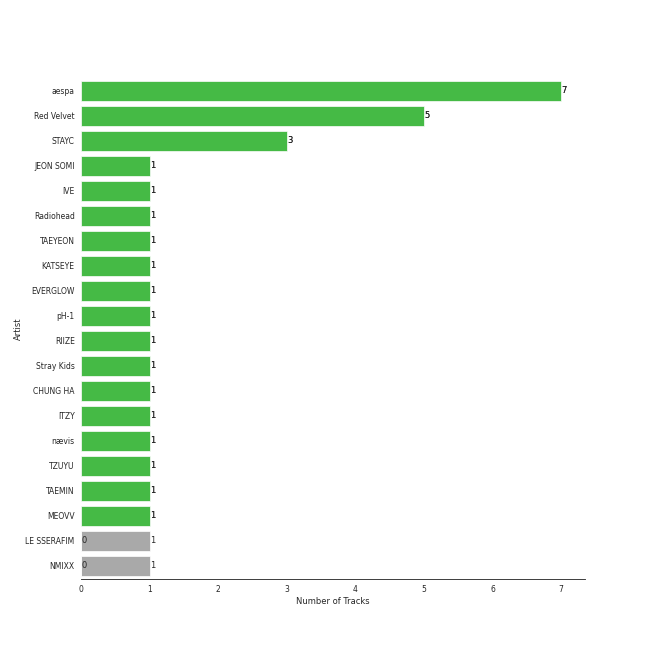

# Repeat Rewind

[30 tracks 🔗](https://open.spotify.com/playlist/37i9dQZF1EpOIeFxMXFVG6)

[See Track Features](audio_features.md)

[See Clusters](clusters/overview.md)

## Top Artists

| Art | Tracks | 💚 | Artist | 🔗 |
|:---|---:|---:|:---|:---|
|  | 5 | 5 | [aespa](../../artists/aespa/overview.md) | [🔗](https://open.spotify.com/artist/6YVMFz59CuY7ngCxTxjpxE) |
|  | 4 | 4 | [(G)I-DLE](../../artists/(g)i-dle/overview.md) | [🔗](https://open.spotify.com/artist/2AfmfGFbe0A0WsTYm0SDTx) |
|  | 3 | 3 | [Red Velvet](../../artists/red_velvet/overview.md) | [🔗](https://open.spotify.com/artist/1z4g3DjTBBZKhvAroFlhOM) |
|  | 2 | 2 | [LE SSERAFIM](../../artists/le_sserafim/overview.md) | [🔗](https://open.spotify.com/artist/4SpbR6yFEvexJuaBpgAU5p) |
|  | 2 | 2 | [ITZY](../../artists/itzy/overview.md) | [🔗](https://open.spotify.com/artist/2KC9Qb60EaY0kW4eH68vr3) |
|  | 1 | 1 | [TWICE](../../artists/twice/overview.md) | [🔗](https://open.spotify.com/artist/7n2Ycct7Beij7Dj7meI4X0) |
|  | 1 | 1 | [VIVIZ](../../artists/viviz/overview.md) | [🔗](https://open.spotify.com/artist/7Lq3yAtwi0Z7zpxEwbQQNZ) |
|  | 1 | 1 | JIHYO | [🔗](https://open.spotify.com/artist/7F1iAHRYxR3MY7yAEuFqgL) |
|  | 1 | 1 | [JEON SOYEON](../../artists/jeon_soyeon/overview.md) | [🔗](https://open.spotify.com/artist/6Xg22wJOAcnvPUfk5WvODH) |
|  | 1 | 1 | [BIBI](../../artists/bibi/overview.md) | [🔗](https://open.spotify.com/artist/6UbmqUEgjLA6jAcXwbM1Z9) |

See all 21 artists

| Art | Tracks | 💚 | Artist | 🔗 |
|:---|---:|---:|:---|:---|
|  | 1 | 1 | [IVE](../../artists/ive/overview.md) | [🔗](https://open.spotify.com/artist/6RHTUrRF63xao58xh9FXYJ) |
|  | 1 | 1 | SISTAR19 | [🔗](https://open.spotify.com/artist/5Q0U6ogBrMX2oxmxy5OTzU) |
|  | 1 | 1 | [TAEYEON](../../artists/taeyeon/overview.md) | [🔗](https://open.spotify.com/artist/3qNVuliS40BLgXGxhdBdqu) |
|  | 1 | 1 | [WINTER](../../artists/winter/overview.md) | [🔗](https://open.spotify.com/artist/3mPquBmMu97Iq9TpzQ6ayI) |
|  | 1 | 1 | [TEN](../../artists/ten/overview.md) | [🔗](https://open.spotify.com/artist/3Q5Qep7ytrjVleNnMnntgQ) |
|  | 1 | 1 | YOUHA | [🔗](https://open.spotify.com/artist/2lZFlNiQMLa2fuX3pkXcan) |
|  | 1 | 1 | RIIZE | [🔗](https://open.spotify.com/artist/2jOm3cYujQx6o1dxuiuqaX) |
|  | 1 | 1 | [Stray Kids](../../artists/stray_kids/overview.md) | [🔗](https://open.spotify.com/artist/2dIgFjalVxs4ThymZ67YCE) |
|  | 1 | 1 | LIZ (IVE) | [🔗](https://open.spotify.com/artist/2Cl2zS9nttS8xQeCp7zYT1) |
|  | 1 | 1 | [NMIXX](../../artists/nmixx/overview.md) | [🔗](https://open.spotify.com/artist/28ot3wh4oNmoFOdVajibBl) |
|  | 1 | 1 | BABYMONSTER | [🔗](https://open.spotify.com/artist/1SIocsqdEefUTE6XKGUiVS) |

## Top Albums

| Art | Tracks | 💚 | Album | Release Date | 🔗 |
|:---|---:|---:|:---|:---|:---|
|  | 3 | 3 | Chill Kill - The 3rd Album | 2023-11-13 | [🔗](https://open.spotify.com/album/4UUICitfodUVCNhzmDFbrO) |
|  | 3 | 3 | 2 | 2024-01-29 | [🔗](https://open.spotify.com/album/0mC9MXPddkzggVsOXh5gd3) |
|  | 2 | 2 | Drama - The 4th Mini Album | 2023-11-10 | [🔗](https://open.spotify.com/album/5NMtxQJy4wq3mpo3ERVnLs) |
|  | 1 | 1 | ZONE | 2023-08-18 | [🔗](https://open.spotify.com/album/1GIkapvyAw5lwdNw66hI44) |
|  | 1 | 1 | To. X - The 5th Mini Album | 2023-11-27 | [🔗](https://open.spotify.com/album/0VciVDVU6NoqtQ0WAIlTmD) |
|  | 1 | 1 | The 4th Mini Album 'VERSUS' | 2023-11-02 | [🔗](https://open.spotify.com/album/56EQPw5TQ6OPVYbbmuzw7y) |
|  | 1 | 1 | TEN - The 1st Mini Album | 2024-02-13 | [🔗](https://open.spotify.com/album/50Zo1vf3YCQtXLUZr2oBiQ) |
|  | 1 | 1 | ROCK-STAR | 2023-11-10 | [🔗](https://open.spotify.com/album/0aJnGEZWIc1VCYlZOXv05a) |
|  | 1 | 1 | RINGO | 2023-10-18 | [🔗](https://open.spotify.com/album/1kRAzoCTDLqwU6nX2I2Nmc) |
|  | 1 | 1 | READY TO BE | 2023-03-10 | [🔗](https://open.spotify.com/album/7hzP5i7StxYG4StECA0rrJ) |

See all 25 albums

| Art | Tracks | 💚 | Album | Release Date | 🔗 |
|:---|---:|---:|:---|:---|:---|
|  | 1 | 1 | Perfect Night | 2023-10-27 | [🔗](https://open.spotify.com/album/6Msc3BwzKZ5f5FXmKuUSu6) |
|  | 1 | 1 | NOBODY | 2023-11-16 | [🔗](https://open.spotify.com/album/1Y48ZHmfvedT16bNakv13v) |
|  | 1 | 1 | NO MORE (MA BOY) | 2024-01-16 | [🔗](https://open.spotify.com/album/3dmsztvqxTfUqTrsu0Z7Ke) |
|  | 1 | 1 | I'VE MINE | 2023-10-13 | [🔗](https://open.spotify.com/album/5J7VAdKdGZGme6wymgopbp) |
|  | 1 | 1 | Hold On Tight | 2023-03-30 | [🔗](https://open.spotify.com/album/4bWGRs1SqNwFXaRDXRAANN) |
|  | 1 | 1 | HEAT | 2023-10-04 | [🔗](https://open.spotify.com/album/5CZQfva4He8sG3DcU8eP5m) |
|  | 1 | 1 | Girls - The 2nd Mini Album | 2022-07-08 | [🔗](https://open.spotify.com/album/4w1dbvUy1crv0knXQvcSeY) |
|  | 1 | 1 | Get A Guitar | 2023-09-04 | [🔗](https://open.spotify.com/album/4QzCT76QtPCyLinchwVt8l) |
|  | 1 | 1 | Fe3O4: BREAK | 2024-01-15 | [🔗](https://open.spotify.com/album/5CCxLQgcI7cVwmgFDlicbP) |
|  | 1 | 1 | FLIGHT | 2023-10-17 | [🔗](https://open.spotify.com/album/079CeHOeWqD0AUwmPUIhXv) |
|  | 1 | 1 | EASY | 2024-02-19 | [🔗](https://open.spotify.com/album/1YCj4PZi08G20y2ekGKY0C) |
|  | 1 | 1 | Better Things | 2023-08-18 | [🔗](https://open.spotify.com/album/1SHLOv0DDdRecK60z86Lth) |
|  | 1 | 1 | Bam Yang Gang | 2024-02-13 | [🔗](https://open.spotify.com/album/4QJZzFdGz2YlPZEHAlAJ6O) |
|  | 1 | 1 | BORN TO BE | 2024-01-08 | [🔗](https://open.spotify.com/album/3cm3EkNQLpKu58btSJT7fz) |
|  | 1 | 1 | BABYMONSTER Debut Digital Single [BATTER UP] | 2023-11-27 | [🔗](https://open.spotify.com/album/2CSQuvvt3XHLDX36O3nRv7) |

## Top Record Labels

| Tracks | 💚 | Label |
|---:|---:|:---|
| 10 | 10 | [SM Entertainment](../../labels/sm_entertainment/overview.md) |
| 4 | 4 | [Warner Records](../../labels/warner_records/overview.md) |
| 4 | 4 | [Republic Records](../../labels/republic_records/overview.md) |
| 4 | 4 | [CUBE ENTERTAINMENT](../../labels/cube_entertainment/overview.md) |
| 2 | 2 | [SOURCE MUSIC](../../labels/source_music/overview.md) |
| 1 | 1 | [YG Entertainment](../../labels/yg_entertainment/overview.md) |
| 1 | 1 | [WM Japan](../../labels/wm_japan/overview.md) |
| 1 | 1 | [Universal Music LLC](../../labels/universal_music_llc/overview.md) |
| 1 | 1 | Studio Beyond |
| 1 | 1 | [Starship Entertainment](../../labels/starship_entertainment/overview.md) |

See all 17 labels

| Tracks | 💚 | Label |
|---:|---:|:---|
| 1 | 1 | Republic Records – JIHYO (TWICE) |
| 1 | 1 | [RCA Records Label](../../labels/rca_records_label/overview.md) |
| 1 | 1 | [Parlophone UK](../../labels/parlophone_uk/overview.md) |
| 1 | 1 | Klap |
| 1 | 1 | FeelGhoodMusic |
| 1 | 1 | BIGPLANETMADE |
| 1 | 1 | [88rising Music](../../labels/88rising_music/overview.md) |

## Genres

| Tracks | 💚 | Genre |
|---:|---:|:---|
| 21 | 21 | [k-pop girl group](../../genres/k-pop_girl_group/overview.md) |
| 14 | 14 | [k-pop](../../genres/k-pop/overview.md) |
| 2 | 2 | [pop](../../genres/pop/overview.md) |
| 1 | 1 | [korean r&b](../../genres/korean_r_b/overview.md) |
| 1 | 1 | [k-pop boy group](../../genres/k-pop_boy_group/overview.md) |
| 1 | 1 | k-indie |

## Top Producers

| Art | Producer | Tracks | Credit Types |
|:---|:---|---:|:---|
| | [Ryan S. Jhun](../../producers/ryan_s__jhun/overview.md) | 3 | Arranger, Songwriter, Lyricist |
| | Boytoy | 2 | Lyricist, Songwriter, Arranger |
| | Lauren Aquilina | 2 | Songwriter |
|  | YUQI | 2 | Lyricist, Songwriter |
| | MOJO | 2 | Lyricist, Songwriter, Arranger |
| | Ayushy | 1 | Arranger |
| | Elsa Curran | 1 | Songwriter |
|  | [JEON SOYEON](../../artists/jeon_soyeon/overview.md) | 1 | Arranger, Lyricist, Songwriter |
| | Greg Bonnick | 1 | Songwriter |
| | [서지음 (Seo, Ji Eum)](../../producers/서지음_(seo,_ji_eum)/overview.md) | 1 | Lyricist |

View all

| Art | Producer | Tracks | Credit Types |
|:---|:---|---:|:---|
| | Peter Wallevik | 1 | Songwriter |
| | Daniel Davidsen | 1 | Songwriter |
| | BlackSmith | 1 | Songwriter |
| | Chaz Mishan | 1 | Arranger, Songwriter |
| | [SCORE](../../producers/score/overview.md) | 1 | Songwriter |
| | 방혜현 (Bang, Hye Hyun) | 1 | Lyricist |
| | [LDN Noise](../../producers/ldn_noise/overview.md) | 1 | Arranger |
| | VENDORS | 1 | Arranger, Songwriter |
| | Ben Samama | 1 | Songwriter |
| | [정은경 (Jung, Eun-Kyung)](../../producers/정은경_(jung,_eun-kyung)/overview.md) | 1 | Producer |
| | Zikai | 1 | Songwriter |
|  | HUH YUNJIN | 1 | Songwriter |
| | 신나리 (Shin, Na Ri) | 1 | Lyricist |
| | 박근태 (Park, Keun-Tae) | 1 | Songwriter |
| | WHERE THE NOISE | 1 | Lyricist |
| | 우민정 (Umin, Je-ong) | 1 | Producer |
| | 페리 (Perrie) | 1 | Lyricist |
| | 최현석 | 1 | Lyricist |
| | 신재빈 (Shin, Jae Bin) | 1 | Producer |
| | BIG Naughty | 1 | Lyricist |
| | Ninos Hanna | 1 | Songwriter |
| | Taet Chesterton | 1 | Songwriter |
| | 정의석 (Jung, Euisuk) | 1 | Producer |
| | 서은일 (Seo, Eun-il) | 1 | Producer |
| | Frankie Day | 1 | Lyricist |
| | Jang Yi-jeong | 1 | Arranger, Songwriter |
| | [Pop Time](../../producers/pop_time/overview.md) | 1 | Arranger, Songwriter |
| | Lauren Elizabeth Baker | 1 | Songwriter |
| | BIGTONE | 1 | Lyricist |
| | アサ (Asa) | 1 | Lyricist, Songwriter |
| | 강영현 (Kang, Young-hyun) | 1 | Lyricist |
| | Pink Slip | 1 | Arranger, Songwriter |
| | 이승훈 (Lee, Seunghoon) | 1 | Arranger, Songwriter |
| | Jared Lee | 1 | Lyricist, Songwriter |
| | Starsmith | 1 | Arranger, Songwriter |
| | [김병석 (Kim, Byung-seok)](../../producers/김병석_(kim,_byung-seok)/overview.md) | 1 | Songwriter |
| | 이상엽 (Lee, Sang-yeob) | 1 | Producer |
| | 양현석 (Yang, Hyun Suk) | 1 | Arranger, Lyricist, Songwriter |
| | Maria Marcus | 1 | Songwriter |
| | SORANA | 1 | Songwriter |
| | [구혜진 (Gu, Hye-jin)](../../producers/구혜진_(gu,_hye-jin)/overview.md) | 1 | Producer |
| | Marcus Andersson | 1 | Songwriter |
| | Daily | 1 | Arranger, Songwriter |
| | 이스란 (Lee, Seran) | 1 | Lyricist |
| | Roland Spreckley | 1 | Songwriter |
| | Alawn | 1 | Arranger |
| | Kella Armitage | 1 | Songwriter |
| | [Kriz](../../producers/kriz/overview.md) | 1 | Arranger |
| | Milli Oshyun | 1 | Arranger, Songwriter |
| | Jorge Luis Perez, Jr. | 1 | Songwriter |
| | [엄세희 (Um, Se-Hee)](../../producers/엄세희_(um,_se-hee)/overview.md) | 1 | Producer |
| | 서정아 (Seo, Jung Ah) | 1 | Lyricist |
| | 제인스 (Jayins) | 1 | Lyricist, Songwriter |
| | Dee.P | 1 | Arranger, Songwriter |
| | David Arkwright | 1 | Songwriter |
| | 213 | 1 | Arranger, Lyricist, Songwriter |
| | Meez | 1 | Producer |
| | Amanda Ibanez | 1 | Songwriter |
| | PhD | 1 | Arranger |
| | [이태섭 (Lee, Tae-Sub)](../../producers/이태섭_(lee,_tae-sub)/overview.md) | 1 | Producer |
| | 이찬혁 (Lee, Chanhyeok) | 1 | Lyricist |
| | 장민 (Jang, Min) | 1 | Producer |
| | Lenno | 1 | Arranger, Songwriter |
| | RISC | 1 | Arranger |
|  | HYOLYN | 1 | Arranger, Songwriter |
| | 권유진 (Kwon, Eu-gene) | 1 | Producer |
| | Likey | 1 | Arranger, Songwriter |
| | 최우석 (Choi, Wooseok) | 1 | Producer |
| | Melli | 1 | Lyricist, Songwriter |
| | [방시혁 (Bang, Si-Hyuk)](../../producers/방시혁_(bang,_si-hyuk)/overview.md) | 1 | Songwriter |
| | Niklas Jarelius Persson | 1 | Songwriter |
| | Hayden Chapman | 1 | Songwriter |
| | Danny Shah | 1 | Songwriter |
| | inverness | 1 | Arranger, Songwriter |
| | Ellie Suh | 1 | Lyricist |

## Most and least listened tracks
| ​ | Most listened tracks | Score | ​​ | Least listened tracks | Score |
|:---|:---|---:|:---|:---|---:|
|  | [Illusion](../../artists/aespa/overview.md) | 39867 |  | [Wife](../../artists/(g)i-dle/overview.md) | 78 |
|  | [Hold On Tight](../../artists/aespa/overview.md) | 20247 |  | NO MORE (MA BOY) | 85 |
|  | [Trick or Trick](../../artists/aespa/overview.md) | 13613 |  | [Run For Roses](../../artists/nmixx/overview.md) | 88 |
|  | [Better Things](../../artists/aespa/overview.md) | 13500 |  | [Rollie](../../artists/(g)i-dle/overview.md) | 116 |
|  | Killin’ Me Good | 9879 |  | [Perfect Night](../../artists/le_sserafim/overview.md) | 123 |
|  | [Hot Air Balloon](../../artists/aespa/overview.md) | 7597 |  | [Sugar Rush](../../artists/bibi/overview.md) | 260 |
|  | [Nightmare](../../artists/red_velvet/overview.md) | 7346 |  | [Crown On My Head (YEJI)](../../artists/itzy/overview.md) | 269 |
|  | [I Want That](../../artists/(g)i-dle/overview.md) | 5770 |  | [Dangerous](../../artists/ten/overview.md) | 283 |
|  | [NOBODY](../../artists/jeon_soyeon/overview.md) | 5059 |  | [Untie](../../artists/viviz/overview.md) | 299 |
|  | [MEGAVERSE](../../artists/stray_kids/overview.md) | 4979 |  | [RINGO](../../artists/itzy/overview.md) | 303 |

## Years

View all years

| Year | Number of Tracks |
|:---|---:|
| 2024 | 9 |
| [2023](2023.md) | 20 |
| 2022 | 1 |

| ​ | 10 newest albums | ​​ | 10 oldest albums |
|:---|:---|:---|:---|
|  | EASY (2024-02-19) |  | Girls - The 2nd Mini Album (2022-07-08) |
|  | Bam Yang Gang (2024-02-13) |  | READY TO BE (2023-03-10) |
|  | TEN - The 1st Mini Album (2024-02-13) |  | Hold On Tight (2023-03-30) |
|  | 2 (2024-01-29) |  | ZONE (2023-08-18) |
|  | NO MORE (MA BOY) (2024-01-16) |  | Better Things (2023-08-18) |
|  | Fe3O4: BREAK (2024-01-15) |  | Get A Guitar (2023-09-04) |
|  | BORN TO BE (2024-01-08) |  | HEAT (2023-10-04) |
|  | BABYMONSTER Debut Digital Single [BATTER UP] (2023-11-27) |  | I'VE MINE (2023-10-13) |
|  | To. X - The 5th Mini Album (2023-11-27) |  | FLIGHT (2023-10-17) |
|  | NOBODY (2023-11-16) |  | RINGO (2023-10-18) |