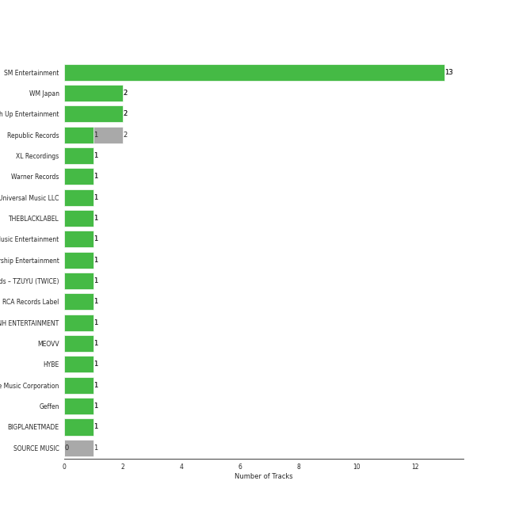

# Repeat Rewind

[30 tracks (28 liked) 🔗](https://open.spotify.com/playlist/37i9dQZF1EpOIeFxMXFVG6)

[See Track Features](audio_features.md)

[See Clusters](clusters/overview.md)

## Top Artists

| Art | Rank | Tracks | 💚 | Artist | 🔗 |
|:---|---:|---:|---:|:---|:---|
|  | 1 | 8 | 8 | [aespa](../../artists/aespa/overview.md) | [🔗](https://open.spotify.com/artist/6YVMFz59CuY7ngCxTxjpxE) |
|  | 2 | 3 | 3 | [Red Velvet](../../artists/red_velvet/overview.md) | [🔗](https://open.spotify.com/artist/1z4g3DjTBBZKhvAroFlhOM) |
|  | 36 | 2 | 2 | [KISS OF LIFE](../../artists/kiss_of_life/overview.md) | [🔗](https://open.spotify.com/artist/4TEK9tIkcoxib4GxT3O4ky) |
|  | 15 | 2 | 2 | [STAYC](../../artists/stayc/overview.md) | [🔗](https://open.spotify.com/artist/01XYiBYaoMJcNhPokrg0l0) |
|  | 69 | 1 | 1 | JEON SOMI | [🔗](https://open.spotify.com/artist/7zYj9S9SdIunYCfSm7vzAR) |
|  | 347 | 1 | 1 | ROSALÍA | [🔗](https://open.spotify.com/artist/7ltDVBr6mKbRvohxheJ9h1) |
|  | 17 | 1 | 1 | [IVE](../../artists/ive/overview.md) | [🔗](https://open.spotify.com/artist/6RHTUrRF63xao58xh9FXYJ) |
|  | 7 | 1 | 1 | [ENHYPEN](../../artists/enhypen/overview.md) | [🔗](https://open.spotify.com/artist/5t5FqBwTcgKTaWmfEbwQY9) |
|  | 29 | 1 | 1 | [Dreamcatcher](../../artists/dreamcatcher/overview.md) | [🔗](https://open.spotify.com/artist/5V1qsQHdXNm4ZEZHWvFnqQ) |
|  | 164 | 1 | 1 | LISA | [🔗](https://open.spotify.com/artist/5L1lO4eRHmJ7a0Q6csE5cT) |

See all 22 artists

| Art | Rank | Tracks | 💚 | Artist | 🔗 |
|:---|---:|---:|---:|:---|:---|
|  | 42 | 1 | 1 | [EVERGLOW](../../artists/everglow/overview.md) | [🔗](https://open.spotify.com/artist/3ZZzT0naD25RhY2uZvIKkJ) |
|  | 3 | 1 | 1 | [IU](../../artists/iu/overview.md) | [🔗](https://open.spotify.com/artist/3HqSLMAZ3g3d5poNaI7GOU) |
|  | 192 | 1 | 1 | pH-1 | [🔗](https://open.spotify.com/artist/2u7CP5T30c8ctenzXgEV1W) |
|  | 10 | 1 | 1 | [Stray Kids](../../artists/stray_kids/overview.md) | [🔗](https://open.spotify.com/artist/2dIgFjalVxs4ThymZ67YCE) |
|  | 105 | 1 | 1 | BADVILLAIN | [🔗](https://open.spotify.com/artist/2Y7fY3aflbCTxp6h5hw0CV) |
|  | 14 | 1 | 1 | [CHUNG HA](../../artists/chung_ha/overview.md) | [🔗](https://open.spotify.com/artist/2PSJ6YriU7JsFucxACpU7Y) |
|  | 6 | 1 | 1 | [(G)I-DLE](../../artists/(g)i-dle/overview.md) | [🔗](https://open.spotify.com/artist/2AfmfGFbe0A0WsTYm0SDTx) |
|  | 43 | 1 | 1 | nævis | [🔗](https://open.spotify.com/artist/2067CjQ2nC56cRZX8goeHg) |
|  | 134 | 1 | 1 | TZUYU | [🔗](https://open.spotify.com/artist/1arCVYXeStgCY2UazBNBLK) |
|  | 369 | 1 | 1 | MEOVV | [🔗](https://open.spotify.com/artist/08hHTBHlv0WRXWlyrsb6Kv) |
|  | 13 | 1 | 0 | [LE SSERAFIM](../../artists/le_sserafim/overview.md) | [🔗](https://open.spotify.com/artist/4SpbR6yFEvexJuaBpgAU5p) |
|  | 18 | 1 | 0 | [NMIXX](../../artists/nmixx/overview.md) | [🔗](https://open.spotify.com/artist/28ot3wh4oNmoFOdVajibBl) |

## Top Tracks

Most and least listened tracks

| Rank | ​ | Most listened tracks | Rank | ​​ | Least listened tracks |
|---:|:---|:---|---:|:---|:---|
| 1 |  | [Savage](../../artists/aespa/overview.md) | 805 |  | MEOW |
| 2 |  | [Welcome To MY World (feat. nævis)](../../artists/aespa/overview.md) | 721 |  | [Colourz](../../artists/everglow/overview.md) |
| 22 |  | [Holssi](../../artists/iu/overview.md) | 705 |  | New Woman (feat. ROSALÍA) |
| 45 |  | [Sweet Venom](../../artists/enhypen/overview.md) | 666 |  | [Pierrot](../../artists/le_sserafim/overview.md) |
| 78 |  | [Ice Cream Cake](../../artists/red_velvet/overview.md) | 663 |  | [Live My Life](../../artists/aespa/overview.md) |
| 83 |  | [Supernova](../../artists/aespa/overview.md) | 642 |  | [Red light sign, but we go](../../artists/nmixx/overview.md) |
| 113 |  | [Cosmic](../../artists/red_velvet/overview.md) | 441 |  | [2 Rings](../../artists/dreamcatcher/overview.md) |
| 120 |  | [Long Chat (#♥)](../../artists/aespa/overview.md) | 435 |  | [MEOW](../../artists/stayc/overview.md) |
| 130 |  | [Blue Heart](../../artists/ive/overview.md) | 354 |  | [Stay Tonight](../../artists/chung_ha/overview.md) |
| 137 |  | [Midas Touch](../../artists/kiss_of_life/overview.md) | 335 |  | Lazy Baby (Feat. pH-1) |

## Top Albums

| Art | Rank | Tracks | 💚 | Album | Release Date | 🔗 |
|:---|---:|---:|---:|:---|:---|:---|
|  | 8 | 5 | 5 | Armageddon - The 1st Album | 2024-05-26 | [🔗](https://open.spotify.com/album/4SboBpuYojDm02qS4iFeJC) |
|  | 67 | 2 | 2 | Cosmic | 2024-06-24 | [🔗](https://open.spotify.com/album/5E8apoFsaUFhZxGGSju6aW) |
|  | 169 | 1 | 1 | abouTZU | 2024-09-06 | [🔗](https://open.spotify.com/album/0Xj4fXPKV0h6KhGQbUkDvy) |
|  | 311 | 1 | 1 | [VirtuouS] | 2024-07-10 | [🔗](https://open.spotify.com/album/4PkR73YJKj5RGkC7QZVpM2) |
|  | 289 | 1 | 1 | ZOMBIE | 2024-06-10 | [🔗](https://open.spotify.com/album/6vGrWJmYXU9VqiqpOwPJ2r) |
|  | 18 | 1 | 1 | The Winning | 2024-02-20 | [🔗](https://open.spotify.com/album/08CvAj58nVMpq1Nw7T6maj) |
|  | 154 | 1 | 1 | Sticky | 2024-07-01 | [🔗](https://open.spotify.com/album/3p68B7ZhETVmNbOov8JcF5) |
|  | 4 | 1 | 1 | Savage - The 1st Mini Album | 2021-10-05 | [🔗](https://open.spotify.com/album/3vyyDkvYWC36DwgZCYd3Wu) |
|  | 162 | 1 | 1 | Querencia | 2021-02-15 | [🔗](https://open.spotify.com/album/3ZifpmJjOEkpYCNSIq352p) |
|  | 125 | 1 | 1 | OVERSTEP | 2024-06-03 | [🔗](https://open.spotify.com/album/15rdrWfjFtnMnzdZIemvoQ) |

See all 25 albums

| Art | Rank | Tracks | 💚 | Album | Release Date | 🔗 |
|:---|---:|---:|---:|:---|:---|:---|
|  | 46 | 1 | 1 | ORANGE BLOOD | 2023-11-17 | [🔗](https://open.spotify.com/album/7dsAlxH9cMgyREm8OLdWWT) |
|  | 467 | 1 | 1 | New Woman (feat. ROSALÍA) | 2024-08-15 | [🔗](https://open.spotify.com/album/2ha4ucrONN0cihLMkP02Ch) |
|  | 113 | 1 | 1 | Midas Touch | 2024-04-03 | [🔗](https://open.spotify.com/album/1HfTA0xDoZ0mswFO3GB3ef) |
|  | 151 | 1 | 1 | Metamorphic | 2024-07-01 | [🔗](https://open.spotify.com/album/6eTCq3XOz0rVJnelXro3Vk) |
|  | 2 | 1 | 1 | MY WORLD - The 3rd Mini Album | 2023-05-08 | [🔗](https://open.spotify.com/album/69xF8jTd0c4Zoo7DT3Rwrn) |
|  | 309 | 1 | 1 | MEOW / Cheeky Icy Thang (Japanese Ver.) | 2024-08-21 | [🔗](https://open.spotify.com/album/04zQRW9brhcUtaDHQ8SH9u) |
|  | 533 | 1 | 1 | MEOW | 2024-09-06 | [🔗](https://open.spotify.com/album/7mtt73Ch1hIRXT5qScF4s5) |
|  | 71 | 1 | 1 | Ice Cream Cake - The 1st Mini Album | 2015-03-17 | [🔗](https://open.spotify.com/album/27cBQ5FDqv0xLgiJ7qNpZr) |
|  | 160 | 1 | 1 | Ice Cream | 2024-08-02 | [🔗](https://open.spotify.com/album/5Q41ZTpaEpDVtgu1yAtAPR) |
|  | 99 | 1 | 1 | IVE SWITCH | 2024-04-29 | [🔗](https://open.spotify.com/album/7z61DsZtWO2S4nC5xd0b9p) |
|  | 215 | 1 | 1 | I SWAY | 2024-07-08 | [🔗](https://open.spotify.com/album/5WzUVTkKAvOayPui3DnsDz) |
|  | 180 | 1 | 1 | Hot Mess | 2024-07-03 | [🔗](https://open.spotify.com/album/2PvpuCui1GVO8DkFcCHzYU) |
|  | 176 | 1 | 1 | ATE | 2024-07-19 | [🔗](https://open.spotify.com/album/3WdsoMKRqtw5Sgg67YrpnY) |
|  | 107 | 1 | 0 | Fe3O4: STICK OUT | 2024-08-19 | [🔗](https://open.spotify.com/album/2pb2RscdByJ8pc7dPT1SY2) |
|  | 165 | 1 | 0 | CRAZY | 2024-08-30 | [🔗](https://open.spotify.com/album/538vEfAgLJ6g2I8ubuOlap) |

## Top Record Labels

| Tracks | 💚 | Label |
|---:|---:|:---|
| 10 | 10 | [SM Entertainment](../../labels/sm_entertainment/overview.md) |
| 2 | 2 | [S2 ENTERTAINMENT INC.](../../labels/s2_entertainment_inc_/overview.md) |
| 2 | 1 | [Republic Records](../../labels/republic_records/overview.md) |
| 1 | 1 | [Warner Records](../../labels/warner_records/overview.md) |
| 1 | 1 | [WM Japan](../../labels/wm_japan/overview.md) |
| 1 | 1 | [Universal Music LLC](../../labels/universal_music_llc/overview.md) |
| 1 | 1 | THEBLACKLABEL |
| 1 | 1 | [Stone Music Entertainment](../../labels/stone_music_entertainment/overview.md) |
| 1 | 1 | [Starship Entertainment](../../labels/starship_entertainment/overview.md) |
| 1 | 1 | Republic Records – TZUYU (TWICE) |

See all 22 labels

| Tracks | 💚 | Label |
|---:|---:|:---|
| 1 | 1 | [RCA Records Label](../../labels/rca_records_label/overview.md) |
| 1 | 1 | [MNH ENTERTAINMENT](../../labels/mnh_entertainment/overview.md) |
| 1 | 1 | MEOVV |
| 1 | 1 | Lloud Co. |
| 1 | 1 | [High Up Entertainment](../../labels/high_up_entertainment/overview.md) |
| 1 | 1 | [Genie Music Corporation](../../labels/genie_music_corporation/overview.md) |
| 1 | 1 | [EDAM Entertainment](../../labels/edam_entertainment/overview.md) |
| 1 | 1 | [DREAMCATCHER COMPANY](../../labels/dreamcatcher_company/overview.md) |
| 1 | 1 | [CUBE ENTERTAINMENT](../../labels/cube_entertainment/overview.md) |
| 1 | 1 | BIGPLANETMADE |
| 1 | 1 | [BELIFT LAB](../../labels/belift_lab/overview.md) |
| 1 | 0 | [SOURCE MUSIC](../../labels/source_music/overview.md) |

## Genres

| Tracks | 💚 | Genre |
|---:|---:|:---|
| 21 | 19 | [k-pop girl group](../../genres/k-pop_girl_group/overview.md) |
| 13 | 12 | [k-pop](../../genres/k-pop/overview.md) |
| 4 | 4 | [5th gen k-pop](../../genres/5th_gen_k-pop/overview.md) |
| 2 | 2 | [pop](../../genres/pop/overview.md) |
| 2 | 2 | [k-pop boy group](../../genres/k-pop_boy_group/overview.md) |
| 1 | 1 | [anime](../../genres/anime/overview.md) |

## Top Producers

| Art | Producer | Tracks | Credit Types |
|:---|:---|---:|:---|
| | [Kenzie](../../producers/kenzie/overview.md) | 2 | Lyricist, Songwriter, Arranger |
| | [조윤경 (Jo, Yoon Kyung)](../../producers/조윤경_(jo,_yoon_kyung)/overview.md) | 2 | Lyricist |
| | [정은경 (Jung, Eun-Kyung)](../../producers/정은경_(jung,_eun-kyung)/overview.md) | 2 | Producer |
| | Fredrik Häggstam (Häggstam, Fredrik) | 1 | Arranger, Songwriter |
| | [Fuxxy](../../producers/fuxxy/overview.md) | 1 | Lyricist, Songwriter |
| | Hayley Aitken | 1 | Arranger, Songwriter |
| | 이민규 (Lee, Min-kyu) | 1 | Producer |
| | Jia Lih | 1 | Arranger, Songwriter |
| | [VINCENZO](../../producers/vincenzo/overview.md) | 1 | Arranger, Lyricist, Songwriter |
| | Hautboi Rich | 1 | Songwriter |

View all

| Art | Producer | Tracks | Credit Types |
|:---|:---|---:|:---|
| | 남궁진 (Nam Goong, Jin) | 1 | Producer |
| | Johan Gustafsson | 1 | Arranger, Songwriter |
| | Dem Jointz | 1 | Songwriter |
| | Tay Jasper | 1 | Songwriter |
| | 김지현 (Kim, Ji Hyun) | 1 | Producer |
| | Kirsten Collins | 1 | Songwriter |
| | 김동현 (Kim, Dong-hyun) | 1 | Lyricist |
| | Bang Chan | 1 | Lyricist, Songwriter |
| | Dallas Koehike | 1 | Songwriter |
| | [유영진 (Yoo, Young-jin)](../../producers/유영진_(yoo,_young-jin)/overview.md) | 1 | Arranger, Lyricist, Producer, Songwriter |
| | 김재웅 (Kim, Jae-ung) | 1 | Arranger, Lyricist, Songwriter |
| | Paris Alexa | 1 | Songwriter |
| | [윤원권 (Yoon, Won-kwon)](../../producers/윤원권_(yoon,_won-kwon)/overview.md) | 1 | Producer |
| | [한 (Han)](../../producers/한_(han)/overview.md) | 1 | Lyricist, Songwriter |
| | 신지영 (Shin, Ji-young) | 1 | Producer |
| | Ronnie Icon | 1 | Songwriter |
| | BB ELLIOT | 1 | Songwriter |
| | 창빈 (Changbin) | 1 | Lyricist, Songwriter |
| | Anna Timgren | 1 | Lyricist, Songwriter |
| | Sebastian Lundberg | 1 | Arranger, Songwriter |
| | 김철순 (Kim, Chul-Soon) | 1 | Producer |

## Years

View all years

| Year | Number of Tracks |
|:---|---:|
| [2024](2024/overview.md) | 25 |
| 2023 | 2 |
| 2021 | 2 |
| 2015 | 1 |

| ​ | 10 newest albums | ​​ | 10 oldest albums |
|:---|:---|:---|:---|
|  | MEOW (2024-09-06) |  | Ice Cream Cake - The 1st Mini Album (2015-03-17) |
|  | abouTZU (2024-09-06) |  | Querencia (2021-02-15) |
|  | CRAZY (2024-08-30) |  | Savage - The 1st Mini Album (2021-10-05) |
|  | MEOW / Cheeky Icy Thang (Japanese Ver.) (2024-08-21) |  | MY WORLD - The 3rd Mini Album (2023-05-08) |
|  | Fe3O4: STICK OUT (2024-08-19) |  | ORANGE BLOOD (2023-11-17) |
|  | New Woman (feat. ROSALÍA) (2024-08-15) |  | The Winning (2024-02-20) |
|  | Ice Cream (2024-08-02) |  | Midas Touch (2024-04-03) |
|  | ATE (2024-07-19) |  | IVE SWITCH (2024-04-29) |
|  | [VirtuouS] (2024-07-10) |  | Armageddon - The 1st Album (2024-05-26) |
|  | I SWAY (2024-07-08) |  | OVERSTEP (2024-06-03) |