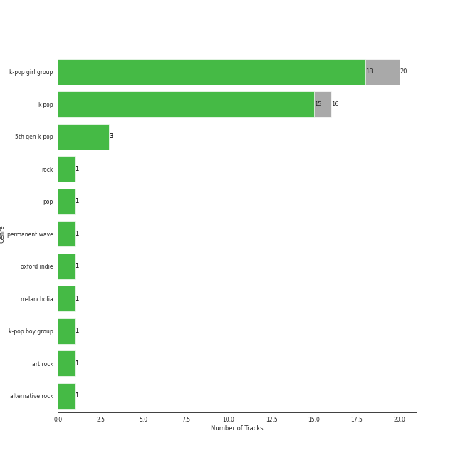

# Repeat Rewind

[30 tracks (29 liked) 🔗](https://open.spotify.com/playlist/37i9dQZF1EpOIeFxMXFVG6)

[See Track Features](audio_features.md)

[See Clusters](clusters/overview.md)

## Top Artists

| Art | Tracks | 💚 | Artist | 🔗 |
|:---|---:|---:|:---|:---|
|  | 4 | 4 | [aespa](../../artists/aespa/overview.md) | [🔗](https://open.spotify.com/artist/6YVMFz59CuY7ngCxTxjpxE) |
|  | 3 | 3 | [Radiohead](../../artists/radiohead/overview.md) | [🔗](https://open.spotify.com/artist/4Z8W4fKeB5YxbusRsdQVPb) |
|  | 3 | 3 | [IU](../../artists/iu/overview.md) | [🔗](https://open.spotify.com/artist/3HqSLMAZ3g3d5poNaI7GOU) |
|  | 3 | 3 | [Red Velvet](../../artists/red_velvet/overview.md) | [🔗](https://open.spotify.com/artist/1z4g3DjTBBZKhvAroFlhOM) |
|  | 2 | 2 | [TWICE](../../artists/twice/overview.md) | [🔗](https://open.spotify.com/artist/7n2Ycct7Beij7Dj7meI4X0) |
|  | 2 | 2 | [(G)I-DLE](../../artists/(g)i-dle/overview.md) | [🔗](https://open.spotify.com/artist/2AfmfGFbe0A0WsTYm0SDTx) |
|  | 2 | 2 | [NCT DREAM](../../artists/nct_dream/overview.md) | [🔗](https://open.spotify.com/artist/1gBUSTR3TyDdTVFIaQnc02) |
|  | 1 | 1 | TAEYONG | [🔗](https://open.spotify.com/artist/6SKusTjOAPsTZ6kareKQdm) |
|  | 1 | 1 | [KISS OF LIFE](../../artists/kiss_of_life/overview.md) | [🔗](https://open.spotify.com/artist/4TEK9tIkcoxib4GxT3O4ky) |
|  | 1 | 1 | [TAEYEON](../../artists/taeyeon/overview.md) | [🔗](https://open.spotify.com/artist/3qNVuliS40BLgXGxhdBdqu) |

See all 22 artists

| Art | Tracks | 💚 | Artist | 🔗 |
|:---|---:|---:|:---|:---|
|  | 1 | 1 | Sammy Rae & The Friends | [🔗](https://open.spotify.com/artist/3lFDsTyYNPQc8WzJExnQWn) |
|  | 1 | 1 | alt-J | [🔗](https://open.spotify.com/artist/3XHO7cRUPCLOr6jwp8vsx5) |
|  | 1 | 1 | TOKiMONSTA | [🔗](https://open.spotify.com/artist/3VwKSHAfgzV1DOHV0aANCI) |
|  | 1 | 1 | [TEN](../../artists/ten/overview.md) | [🔗](https://open.spotify.com/artist/3Q5Qep7ytrjVleNnMnntgQ) |
| | 1 | 1 | Hongjoong of ATEEZ | [🔗](https://open.spotify.com/artist/3MZLSgcd5kOdhrZasDMecx) |
|  | 1 | 1 | [Rilo Kiley](../../artists/rilo_kiley/overview.md) | [🔗](https://open.spotify.com/artist/2cevwbv7ISD92VMNLYLHZA) |
|  | 1 | 1 | [CHUNG HA](../../artists/chung_ha/overview.md) | [🔗](https://open.spotify.com/artist/2PSJ6YriU7JsFucxACpU7Y) |
|  | 1 | 1 | [YUQI](../../artists/yuqi/overview.md) | [🔗](https://open.spotify.com/artist/22aCD8IrQZjcPgZw728QT6) |
|  | 1 | 1 | [Jacob Collier](../../artists/jacob_collier/overview.md) | [🔗](https://open.spotify.com/artist/0QWrMNukfcVOmgEU0FEDyD) |
|  | 1 | 1 | Chris Martin | [🔗](https://open.spotify.com/artist/0LQoZQIV0mIs0y0XQb0Sw2) |
|  | 1 | 1 | [WENDY](../../artists/wendy/overview.md) | [🔗](https://open.spotify.com/artist/0FRUZvZNPzM3YJMABJxf2K) |
|  | 1 | 0 | YooA | [🔗](https://open.spotify.com/artist/4ur1jCwyNlhgd0viJkOtcQ) |

## Top Tracks

Most and least listened tracks

| ​ | Most listened tracks | Rank | ​​ | Least listened tracks | Rank |
|:---|:---|---:|:---|:---|---:|
|  | [My sea](../../artists/iu/overview.md) | 18 |  | [No Surprises](../../artists/radiohead/overview.md) | nan |
|  | [Drama](../../artists/aespa/overview.md) | 27 |  | [Beatbox](../../artists/nct_dream/overview.md) | 615 |
|  | [Uh-Oh](../../artists/(g)i-dle/overview.md) | 39 |  | Rooftop | 602 |
|  | [To. X](../../artists/taeyeon/overview.md) | 60 |  | [Bonnie & Clyde](../../artists/yuqi/overview.md) | 487 |
|  | [Feel My Rhythm](../../artists/red_velvet/overview.md) | 72 |  | [Wife](../../artists/(g)i-dle/overview.md) | 438 |
|  | [Bulldozer](../../artists/red_velvet/overview.md) | 94 |  | [EENIE MEENIE (Feat. Hongjoong of ATEEZ)](../../artists/chung_ha/overview.md) | 389 |
|  | [Nobody Knows](../../artists/kiss_of_life/overview.md) | 100 |  | [Over You (feat. aespa & Chris Martin)](../../artists/jacob_collier/overview.md) | 362 |
|  | [Dangerous](../../artists/ten/overview.md) | 109 |  | Breezeblocks | 320 |
|  | [Psycho](../../artists/red_velvet/overview.md) | 192 |  | [ONE SPARK](../../artists/twice/overview.md) | 283 |
|  | [Get Goin'](../../artists/aespa/overview.md) | 215 |  | [BLOOM](../../artists/twice/overview.md) | 271 |

## Top Albums

| Art | Tracks | 💚 | Album | Release Date | 🔗 |
|:---|---:|---:|:---|:---|:---|
|  | 2 | 2 | With YOU-th | 2024-02-23 | [🔗](https://open.spotify.com/album/575TQDOQqc0MAheeEeKWUR) |
|  | 2 | 2 | The Winning | 2024-02-20 | [🔗](https://open.spotify.com/album/08CvAj58nVMpq1Nw7T6maj) |
|  | 2 | 2 | OK Computer | 1997-05-28 | [🔗](https://open.spotify.com/album/6dVIqQ8qmQ5GBnJ9shOYGE) |
|  | 1 | 1 | ‘The ReVe Festival’ Finale | 2019-12-23 | [🔗](https://open.spotify.com/album/3rVtm00UfbuzWOewdm4iYM) |
|  | 1 | 1 | ‘The ReVe Festival 2022 - Feel My Rhythm’ | 2022-03-21 | [🔗](https://open.spotify.com/album/3HgoCO9wWuPcNhz8Ip4C46) |
|  | 1 | 1 | Wish You Hell - The 2nd Mini Album | 2024-03-12 | [🔗](https://open.spotify.com/album/3f8n88uX0tNvA8HTROgSkr) |
|  | 1 | 1 | Under The Blacklight (Standard Version) | 2007-08-20 | [🔗](https://open.spotify.com/album/2f9RsTZpsYMLRVZBtW7En8) |
|  | 1 | 1 | Uh-Oh | 2019-06-26 | [🔗](https://open.spotify.com/album/3PzrNuMGWGpp8WOfrmpkaU) |
|  | 1 | 1 | To. X - The 5th Mini Album | 2023-11-27 | [🔗](https://open.spotify.com/album/0VciVDVU6NoqtQ0WAIlTmD) |
|  | 1 | 1 | The Good Life | 2018-07-10 | [🔗](https://open.spotify.com/album/4s1igjt5YJe7s7BdCeX3DX) |

See all 27 albums

| Art | Tracks | 💚 | Album | Release Date | 🔗 |
|:---|---:|---:|:---|:---|:---|
|  | 1 | 1 | The Bends | 1995-03-13 | [🔗](https://open.spotify.com/album/35UJLpClj5EDrhpNIi4DFg) |
|  | 1 | 1 | TEN - The 1st Mini Album | 2024-02-13 | [🔗](https://open.spotify.com/album/50Zo1vf3YCQtXLUZr2oBiQ) |
|  | 1 | 1 | TAP - The 2nd Mini Album | 2024-02-26 | [🔗](https://open.spotify.com/album/5PliHwqYkEzdXHZnA6scC0) |
|  | 1 | 1 | IU 5th Album 'LILAC' | 2021-03-25 | [🔗](https://open.spotify.com/album/01dPJcwyht77brL4JQiR8R) |
|  | 1 | 1 | Fraggle Rock: Back To The Rock - Season 2 (Apple TV+ Original Series Soundtrack) | 2024-03-29 | [🔗](https://open.spotify.com/album/7ADS5WrhmIaFv9r1671yNh) |
|  | 1 | 1 | EENIE MEENIE | 2024-03-11 | [🔗](https://open.spotify.com/album/1q2RNzz09Vx3bOKK1yTyyg) |
|  | 1 | 1 | Drama - The 4th Mini Album | 2023-11-10 | [🔗](https://open.spotify.com/album/5NMtxQJy4wq3mpo3ERVnLs) |
|  | 1 | 1 | Djesse Vol. 4 | 2024-03-01 | [🔗](https://open.spotify.com/album/13r6eqjYlKELFQlNvVCBz1) |
|  | 1 | 1 | Die Trying | 2024-04-04 | [🔗](https://open.spotify.com/album/2Ov7bn3HyDgvAxtYPLosUR) |
|  | 1 | 1 | DREAM( )SCAPE | 2024-03-25 | [🔗](https://open.spotify.com/album/2urIpiAu1CySTyyNuQQxcz) |
|  | 1 | 1 | Chill Kill - The 3rd Album | 2023-11-13 | [🔗](https://open.spotify.com/album/4UUICitfodUVCNhzmDFbrO) |
|  | 1 | 1 | Born to be XX | 2023-11-08 | [🔗](https://open.spotify.com/album/6yDtQxvq1XRC7Y5qtS03Xx) |
|  | 1 | 1 | Beatbox - The 2nd Album Repackage | 2022-05-30 | [🔗](https://open.spotify.com/album/4sM1qNxjzxOvoH6jeFHx3W) |
|  | 1 | 1 | An Awesome Wave | 2012-09-18 | [🔗](https://open.spotify.com/album/6k3vC8nep1BfqAIJ81L6OL) |
|  | 1 | 1 | A Page | 2021-05-13 | [🔗](https://open.spotify.com/album/7jmRVFWYCVgx2OEC1ZQJH8) |
|  | 1 | 1 | 2 | 2024-01-29 | [🔗](https://open.spotify.com/album/0mC9MXPddkzggVsOXh5gd3) |
|  | 1 | 0 | Borderline | 2024-03-14 | [🔗](https://open.spotify.com/album/3oKhPahFFjuFVbZfWprIkB) |

## Top Record Labels

| Tracks | 💚 | Label |
|---:|---:|:---|
| 10 | 10 | [SM Entertainment](../../labels/sm_entertainment/overview.md) |
| 3 | 3 | [XL Recordings](../../labels/xl_recordings/overview.md) |
| 3 | 3 | [EDAM Entertainment](../../labels/edam_entertainment/overview.md) |
| 2 | 2 | [Warner Records](../../labels/warner_records/overview.md) |
| 2 | 2 | [Universal Music LLC](../../labels/universal_music_llc/overview.md) |
| 2 | 2 | [Republic Records](../../labels/republic_records/overview.md) |
| 1 | 1 | [S2 ENTERTAINMENT INC.](../../labels/s2_entertainment_inc_/overview.md) |
| 1 | 1 | [Nettwerk Music Group](../../labels/nettwerk_music_group/overview.md) |
| 1 | 1 | Netflix Music |
| 1 | 1 | MORE VISION |

See all 16 labels

| Tracks | 💚 | Label |
|---:|---:|:---|
| 1 | 1 | Lakeshore Records |
| 1 | 1 | [Decca (UMO)](../../labels/decca_(umo)/overview.md) |
| 1 | 1 | Canvasback |
| 1 | 1 | [CUBE ENTERTAINMENT](../../labels/cube_entertainment/overview.md) |
| 1 | 1 | ATL |
| 1 | 0 | [WM Entertainment](../../labels/wm_entertainment/overview.md) |

## Genres

| Tracks | 💚 | Genre |
|---:|---:|:---|
| 13 | 13 | [k-pop](../../genres/k-pop/overview.md) |
| 11 | 11 | [k-pop girl group](../../genres/k-pop_girl_group/overview.md) |
| 5 | 5 | [pop](../../genres/pop/overview.md) |
| 4 | 4 | [rock](../../genres/rock/overview.md) |
| 3 | 3 | [permanent wave](../../genres/permanent_wave/overview.md) |
| 3 | 3 | oxford indie |
| 3 | 3 | melancholia |
| 3 | 3 | [art rock](../../genres/art_rock/overview.md) |
| 3 | 3 | [alternative rock](../../genres/alternative_rock/overview.md) |
| 2 | 2 | [k-pop boy group](../../genres/k-pop_boy_group/overview.md) |

See all 23 genres

| Tracks | 💚 | Genre |
|---:|---:|:---|
| 2 | 2 | indie rock |
| 2 | 1 | [5th gen k-pop](../../genres/5th_gen_k-pop/overview.md) |
| 1 | 1 | [uk alternative pop](../../genres/uk_alternative_pop/overview.md) |
| 1 | 1 | nyc pop |
| 1 | 1 | [modern rock](../../genres/modern_rock/overview.md) |
| 1 | 1 | modern alternative rock |
| 1 | 1 | [lilith](../../genres/lilith/overview.md) |
| 1 | 1 | la indie |
| 1 | 1 | [korean pop](../../genres/korean_pop/overview.md) |
| 1 | 1 | indietronica |
| 1 | 1 | indie pop |
| 1 | 1 | funktronica |
| 1 | 1 | chamber pop |

## Top Producers

| Art | Producer | Tracks | Credit Types |
|:---|:---|---:|:---|
| | [Philip Selway](../../producers/philip_selway/overview.md) | 3 | Songwriter |
| | [Colin Greenwood](../../producers/colin_greenwood/overview.md) | 3 | Songwriter |
| | [Jonny Greenwood](../../producers/jonny_greenwood/overview.md) | 3 | Songwriter |
| | [Ed O'Brien](../../producers/ed_o_brien/overview.md) | 3 | Songwriter |
| | [Thom Yorke](../../producers/thom_yorke/overview.md) | 3 | Producer, Songwriter |
| | 임찬미 (Kim, Chan-mi) | 2 | Producer |
| | [조윤경 (Jo, Yoon Kyung)](../../producers/조윤경_(jo,_yoon_kyung)/overview.md) | 2 | Lyricist |
| | KayOne | 2 | Producer |
|  | [Radiohead](../../artists/radiohead/overview.md) | 2 | Arranger, Producer |
| | [Nigel Godrich](../../producers/nigel_godrich/overview.md) | 2 | Producer |

View all

| Art | Producer | Tracks | Credit Types |
|:---|:---|---:|:---|
| | Melanie Joy Fontana | 2 | Songwriter, Lyricist |
| | [earattack](../../producers/earattack/overview.md) | 2 | Arranger, Producer, Songwriter |
| | 홍장미 (Hong, Jangmi) | 2 | Producer |
| | 이우현 (Lee, Woo-hyun) | 2 | Arranger, Songwriter |
| | [구종필 (Koo, Jong-Pil)](../../producers/구종필_(koo,_jong-pil)/overview.md) | 2 | Producer |
|  | [JEON SOYEON](../../artists/jeon_soyeon/overview.md) | 2 | Arranger, Lyricist, Songwriter |
| | Thom Green | 1 | Songwriter |
| | Kyler Niko | 1 | Songwriter |
| | Tom Hollings | 1 | Songwriter |
| | Adam von Mentzer | 1 | Songwriter |
| | 제휘 (Kim, Jea Whi) | 1 | Arranger, Songwriter |
|  | [IU](../../artists/iu/overview.md) | 1 | Lyricist |
| | 강효민 (Kang, Hyo-min) | 1 | Producer |
| | MooF | 1 | Arranger, Songwriter |
| | 유정연 (Yoo, Jeong-yeon) | 1 | Lyricist |
| | Joe Newman | 1 | Songwriter |
| | Jason Lader | 1 | Producer |
| | 김희원 (Kim, Hee-won) | 1 | Songwriter |
| | PAPRIKAA | 1 | Arranger, Songwriter |
| | [Pop Time](../../producers/pop_time/overview.md) | 1 | Arranger, Songwriter |
| | Cazzi Opeia | 1 | Songwriter |
| | [Josh Gudwin](../../producers/josh_gudwin/overview.md) | 1 | Producer |
|  | Anne-Marie | 1 | Songwriter |
| | 서은일 (Seo, Eun-il) | 1 | Producer |
|  | [Rilo Kiley](../../artists/rilo_kiley/overview.md) | 1 | Producer |
| | 오성근 (Oh, Seong-Keun) | 1 | Producer |
| | Rick Bridges | 1 | Lyricist |
| | Charlie Andrew | 1 | Producer, Songwriter |
| | Sara Boe | 1 | Songwriter |
| | [Arschtritt Lindgren](../../producers/arschtritt_lindgren/overview.md) | 1 | Arranger, Songwriter |
| | Gus Unger-Hamilton | 1 | Songwriter |
| | EJAE | 1 | Songwriter |
| | 이나일 (E, Na-Il) | 1 | Arranger |
| | GG Ramirez | 1 | Songwriter |
| | [Kenzie](../../producers/kenzie/overview.md) | 1 | Songwriter |
| | JUNE | 1 | Arranger, Songwriter |
| | Daily | 1 | Arranger, Songwriter |
| | [구혜진 (Gu, Hye-jin)](../../producers/구혜진_(gu,_hye-jin)/overview.md) | 1 | Producer |
| | Samuel Brennan | 1 | Songwriter |
| | 손명갑 (Son, Myung-gap) | 1 | Producer |
| | Julie Han | 1 | Lyricist |
| | 조준성 (Jo, June-sung) | 1 | Producer |
| | Billen Ted | 1 | Arranger |
| | 임정우 (Im, Jeong-u) | 1 | Songwriter |
| | Jeremy Stack | 1 | Arranger |
| | 김홍중 (Kim, Hong Joong) | 1 | Lyricist, Songwriter |
| | Likey | 1 | Arranger, Songwriter |
|  | ADORA | 1 | Songwriter |
| | Druski | 1 | Producer |
| | Paulina Cerrilla | 1 | Songwriter |
| | Conor Blake | 1 | Arranger, Songwriter |
| | [심은지 (Sim, Eunjee)](../../producers/심은지_(sim,_eunjee)/overview.md) | 1 | Lyricist |
| | [Fuxxy](../../producers/fuxxy/overview.md) | 1 | Arranger |
|  | [CHUNG HA](../../artists/chung_ha/overview.md) | 1 | Lyricist |
| | [정은경 (Jung, Eun-Kyung)](../../producers/정은경_(jung,_eun-kyung)/overview.md) | 1 | Producer |
| | Jenny Lewis | 1 | Songwriter |
| | Gwil Sainsbury | 1 | Songwriter |

## Years

| ​ | 10 newest albums | ​​ | 10 oldest albums |
|:---|:---|:---|:---|
|  | Die Trying (2024-04-04) |  | The Bends (1995-03-13) |
|  | Fraggle Rock: Back To The Rock - Season 2 (Apple TV+ Original Series Soundtrack) (2024-03-29) |  | OK Computer (1997-05-28) |
|  | DREAM( )SCAPE (2024-03-25) |  | Under The Blacklight (Standard Version) (2007-08-20) |
|  | Borderline (2024-03-14) |  | An Awesome Wave (2012-09-18) |
|  | Wish You Hell - The 2nd Mini Album (2024-03-12) |  | The Good Life (2018-07-10) |
|  | EENIE MEENIE (2024-03-11) |  | Uh-Oh (2019-06-26) |
|  | Djesse Vol. 4 (2024-03-01) |  | ‘The ReVe Festival’ Finale (2019-12-23) |
|  | TAP - The 2nd Mini Album (2024-02-26) |  | IU 5th Album 'LILAC' (2021-03-25) |
|  | With YOU-th (2024-02-23) |  | A Page (2021-05-13) |
|  | The Winning (2024-02-20) |  | ‘The ReVe Festival 2022 - Feel My Rhythm’ (2022-03-21) |