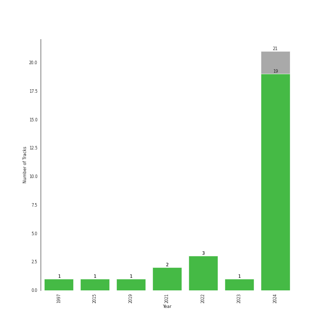

# Repeat Rewind

[30 tracks 🔗](https://open.spotify.com/playlist/37i9dQZF1EpOIeFxMXFVG6)

[See Track Features](audio_features.md)

[See Clusters](clusters/overview.md)

## Top Artists

| Art | Rank | Tracks | 💚 | Artist | 🔗 |
|:---|---:|---:|---:|:---|:---|
|  | 57 | 3 | 3 | [Billy Joel](../../artists/billy_joel/overview.md) | [🔗](https://open.spotify.com/artist/6zFYqv1mOsgBRQbae3JJ9e) |
|  | 2 | 3 | 3 | [Red Velvet](../../artists/red_velvet/overview.md) | [🔗](https://open.spotify.com/artist/1z4g3DjTBBZKhvAroFlhOM) |
|  | 1 | 2 | 2 | [aespa](../../artists/aespa/overview.md) | [🔗](https://open.spotify.com/artist/6YVMFz59CuY7ngCxTxjpxE) |
|  | 67 | 2 | 2 | [Solar](../../artists/solar/overview.md) | [🔗](https://open.spotify.com/artist/5cYcI546S8Lf97m4mNdYLD) |
|  | 5 | 2 | 2 | [ITZY](../../artists/itzy/overview.md) | [🔗](https://open.spotify.com/artist/2KC9Qb60EaY0kW4eH68vr3) |
|  | 101 | 2 | 2 | [YUQI](../../artists/yuqi/overview.md) | [🔗](https://open.spotify.com/artist/22aCD8IrQZjcPgZw728QT6) |
|  | 12 | 1 | 1 | [SEVENTEEN](../../artists/seventeen/overview.md) | [🔗](https://open.spotify.com/artist/7nqOGRxlXj7N2JYbgNEjYH) |
|  | 87 | 1 | 1 | [Kimbra](../../artists/kimbra/overview.md) | [🔗](https://open.spotify.com/artist/6hk7Yq1DU9QcCCrz9uc0Ti) |
|  | 149 | 1 | 1 | Lexie Liu | [🔗](https://open.spotify.com/artist/6fs2or0cKLEM2xohWq8SoX) |
|  | 18 | 1 | 1 | [IVE](../../artists/ive/overview.md) | [🔗](https://open.spotify.com/artist/6RHTUrRF63xao58xh9FXYJ) |

See all 24 artists

| Art | Rank | Tracks | 💚 | Artist | 🔗 |
|:---|---:|---:|---:|:---|:---|
|  | 7 | 1 | 1 | [ENHYPEN](../../artists/enhypen/overview.md) | [🔗](https://open.spotify.com/artist/5t5FqBwTcgKTaWmfEbwQY9) |
|  | 45 | 1 | 1 | [Radiohead](../../artists/radiohead/overview.md) | [🔗](https://open.spotify.com/artist/4Z8W4fKeB5YxbusRsdQVPb) |
|  | 15 | 1 | 1 | [LE SSERAFIM](../../artists/le_sserafim/overview.md) | [🔗](https://open.spotify.com/artist/4SpbR6yFEvexJuaBpgAU5p) |
|  | 3 | 1 | 1 | [BLACKPINK](../../artists/blackpink/overview.md) | [🔗](https://open.spotify.com/artist/41MozSoPIsD1dJM0CLPjZF) |
|  | 141 | 1 | 1 | Sammy Rae & The Friends | [🔗](https://open.spotify.com/artist/3lFDsTyYNPQc8WzJExnQWn) |
|  | 212 | 1 | 1 | alt-J | [🔗](https://open.spotify.com/artist/3XHO7cRUPCLOr6jwp8vsx5) |
|  | 161 | 1 | 1 | TOKiMONSTA | [🔗](https://open.spotify.com/artist/3VwKSHAfgzV1DOHV0aANCI) |
|  | 153 | 1 | 1 | JO1 | [🔗](https://open.spotify.com/artist/2koP6FEfIEVk4l2Fe6jFhu) |
|  | 193 | 1 | 1 | [Rilo Kiley](../../artists/rilo_kiley/overview.md) | [🔗](https://open.spotify.com/artist/2cevwbv7ISD92VMNLYLHZA) |
|  | 26 | 1 | 1 | [Sara Bareilles](../../artists/sara_bareilles/overview.md) | [🔗](https://open.spotify.com/artist/2Sqr0DXoaYABbjBo9HaMkM) |
|  | 14 | 1 | 1 | [CHUNG HA](../../artists/chung_ha/overview.md) | [🔗](https://open.spotify.com/artist/2PSJ6YriU7JsFucxACpU7Y) |
|  | 27 | 1 | 1 | [NMIXX](../../artists/nmixx/overview.md) | [🔗](https://open.spotify.com/artist/28ot3wh4oNmoFOdVajibBl) |
|  | 76 | 1 | 1 | [Florence + The Machine](../../artists/florence_+_the_machine/overview.md) | [🔗](https://open.spotify.com/artist/1moxjboGR7GNWYIMWsRjgG) |
|  | 86 | 1 | 1 | BABYMONSTER | [🔗](https://open.spotify.com/artist/1SIocsqdEefUTE6XKGUiVS) |

## Top Tracks

Most and least listened tracks

| Rank | ​ | Most listened tracks | Rank | ​​ | Least listened tracks |
|---:|:---|:---|---:|:---|:---|
| 45 |  | [One Kiss](../../artists/red_velvet/overview.md) | 735 |  | [FREAK](../../artists/yuqi/overview.md) |
| 70 |  | [DDU-DU DDU-DU](../../artists/blackpink/overview.md) | 524 |  | [I’m Ready](../../artists/chung_ha/overview.md) |
| 122 |  | SHEESH | 481 |  | [Only the Good Die Young](../../artists/billy_joel/overview.md) |
| 132 |  | [I'll Make You Cry](../../artists/aespa/overview.md) | 395 |  | [Teeth](../../artists/enhypen/overview.md) |
| 149 |  | [Sunny Side Up!](../../artists/red_velvet/overview.md) | 383 |  | [Blues](../../artists/solar/overview.md) |
| 196 |  | [Psycho](../../artists/red_velvet/overview.md) | 373 |  | [Movin' Out (Anthony's Song)](../../artists/billy_joel/overview.md) |
| 213 |  | [Never Let Me Go](../../artists/florence_+_the_machine/overview.md) | 359 |  | [Cheers to youth](../../artists/seventeen/overview.md) |
| 225 |  | [Settle Down](../../artists/kimbra/overview.md) | 345 |  | Breezeblocks |
| 238 |  | [Algorhythm](../../artists/itzy/overview.md) | 297 |  | [Silver Lining](../../artists/rilo_kiley/overview.md) |
| 241 |  | [On Clap](../../artists/yuqi/overview.md) | 292 |  | [But I](../../artists/solar/overview.md) |

## Top Albums

| Art | Rank | Tracks | 💚 | Album | Release Date | 🔗 |
|:---|---:|---:|---:|:---|:---|:---|
|  | 170 | 3 | 3 | The Stranger (Legacy Edition) | 1977 | [🔗](https://open.spotify.com/album/1Mhn9VosyjtWn4dMPFlna6) |
|  | 143 | 2 | 2 | YUQ1 | 2024-04-23 | [🔗](https://open.spotify.com/album/7LYc8ngbhwha4aGJ5kVauc) |
|  | 162 | 2 | 2 | COLOURS | 2024-04-30 | [🔗](https://open.spotify.com/album/5Q1cKPuB4vPk8bIdfZH7Fm) |
|  | 155 | 2 | 2 | Algorhythm | 2024-05-15 | [🔗](https://open.spotify.com/album/7ji7zKkvRlYOsu3ehctQRx) |
|  | 138 | 1 | 1 | ‘The ReVe Festival’ Finale | 2019-12-23 | [🔗](https://open.spotify.com/album/3rVtm00UfbuzWOewdm4iYM) |
|  | 114 | 1 | 1 | ‘The ReVe Festival’ Day 1 | 2019-06-19 | [🔗](https://open.spotify.com/album/2nLEiP268mSFZHW5dajM4R) |
|  | 166 | 1 | 1 | Vows (Deluxe Version) | 2011 | [🔗](https://open.spotify.com/album/6V9rvW05Um5bIHePPfeI8p) |
|  | 216 | 1 | 1 | Under The Blacklight (Standard Version) | 2007-08-20 | [🔗](https://open.spotify.com/album/2f9RsTZpsYMLRVZBtW7En8) |
|  | 209 | 1 | 1 | The Good Life | 2018-07-10 | [🔗](https://open.spotify.com/album/4s1igjt5YJe7s7BdCeX3DX) |
|  | 185 | 1 | 1 | The Bends | 1995-03-13 | [🔗](https://open.spotify.com/album/35UJLpClj5EDrhpNIi4DFg) |

See all 25 albums

| Art | Rank | Tracks | 💚 | Album | Release Date | 🔗 |
|:---|---:|---:|---:|:---|:---|:---|
|  | 5 | 1 | 1 | Savage - The 1st Mini Album | 2021-10-05 | [🔗](https://open.spotify.com/album/3vyyDkvYWC36DwgZCYd3Wu) |
|  | 71 | 1 | 1 | SQUARE UP | 2018-06-15 | [🔗](https://open.spotify.com/album/0wOiWrujRbxlKEGWRQpKYc) |
|  | 264 | 1 | 1 | SEVENTEEN BEST ALBUM '17 IS RIGHT HERE' | 2024-04-29 | [🔗](https://open.spotify.com/album/2Jrp37x38qZqtyrIrfxN4H) |
|  | 183 | 1 | 1 | Love seeker | 2024-05-11 | [🔗](https://open.spotify.com/album/0fcbyNShvGubuLdQqpMSbF) |
|  | 174 | 1 | 1 | Kaleidoscope Heart | 2010-09-07 | [🔗](https://open.spotify.com/album/627ukPRwYxyBREHxBq0vGJ) |
|  | 139 | 1 | 1 | IVE SWITCH | 2024-04-29 | [🔗](https://open.spotify.com/album/7z61DsZtWO2S4nC5xd0b9p) |
|  | 223 | 1 | 1 | EENIE MEENIE | 2024-03-11 | [🔗](https://open.spotify.com/album/1q2RNzz09Vx3bOKK1yTyyg) |
|  | 91 | 1 | 1 | EASY | 2024-02-19 | [🔗](https://open.spotify.com/album/1YCj4PZi08G20y2ekGKY0C) |
|  | 184 | 1 | 1 | Die Trying | 2024-04-04 | [🔗](https://open.spotify.com/album/2Ov7bn3HyDgvAxtYPLosUR) |
|  | 141 | 1 | 1 | DARK MOON SPECIAL ALBUM <MEMORABILIA> | 2024-05-13 | [🔗](https://open.spotify.com/album/0OhJwEzXbK9Km6GQSPdmPU) |
|  | 6 | 1 | 1 | Chill Kill - The 3rd Album | 2023-11-13 | [🔗](https://open.spotify.com/album/4UUICitfodUVCNhzmDFbrO) |
|  | 157 | 1 | 1 | Ceremonials (Deluxe Edition) | 2011-01-01 | [🔗](https://open.spotify.com/album/5SxudoALxEAVh9l83kSebx) |
|  | 97 | 1 | 1 | BABYMONS7ER | 2024-04-01 | [🔗](https://open.spotify.com/album/0eSbsl3j8jz96LC2NCLPc4) |
|  | 254 | 1 | 1 | An Awesome Wave | 2012-09-18 | [🔗](https://open.spotify.com/album/6k3vC8nep1BfqAIJ81L6OL) |
|  | 207 | 1 | 1 | AD MARE | 2022-02-22 | [🔗](https://open.spotify.com/album/2QbA97qjlAs81t6kVS6zBk) |

## Top Record Labels

| Tracks | 💚 | Label |
|---:|---:|:---|
| 4 | 4 | [SM Entertainment](../../labels/sm_entertainment/overview.md) |
| 3 | 3 | [Legacy](../../labels/legacy/overview.md) |
| 3 | 3 | [Columbia](../../labels/columbia/overview.md) |
| 2 | 2 | [YG Entertainment](../../labels/yg_entertainment/overview.md) |
| 2 | 2 | [Warner Records](../../labels/warner_records/overview.md) |
| 2 | 2 | [WM Japan](../../labels/wm_japan/overview.md) |
| 2 | 2 | [RBW Inc.](../../labels/rbw_inc_/overview.md) |
| 2 | 2 | [CUBE ENTERTAINMENT](../../labels/cube_entertainment/overview.md) |
| 1 | 1 | [XL Recordings](../../labels/xl_recordings/overview.md) |
| 1 | 1 | [Universal-Island Records Ltd.](../../labels/universal-island_records_ltd_/overview.md) |

See all 23 labels

| Tracks | 💚 | Label |
|---:|---:|:---|
| 1 | 1 | [Starship Entertainment](../../labels/starship_entertainment/overview.md) |
| 1 | 1 | [SOURCE MUSIC](../../labels/source_music/overview.md) |
| 1 | 1 | [Republic Records](../../labels/republic_records/overview.md) |
| 1 | 1 | [PLEDIS Entertainment](../../labels/pledis_entertainment/overview.md) |
| 1 | 1 | [Nettwerk Music Group](../../labels/nettwerk_music_group/overview.md) |
| 1 | 1 | Netflix Music |
| 1 | 1 | MORE VISION |
| 1 | 1 | LAPONE Entertainment |
| 1 | 1 | [Interscope Records](../../labels/interscope_records/overview.md) |
| 1 | 1 | [Epic](../../labels/epic/overview.md) |
| 1 | 1 | Canvasback |
| 1 | 1 | [BELIFT LAB](../../labels/belift_lab/overview.md) |
| 1 | 1 | ATL |

## Genres

| Tracks | 💚 | Genre |
|---:|---:|:---|
| 11 | 11 | [k-pop girl group](../../genres/k-pop_girl_group/overview.md) |
| 11 | 11 | [k-pop](../../genres/k-pop/overview.md) |
| 5 | 5 | [rock](../../genres/rock/overview.md) |
| 3 | 3 | [soft rock](../../genres/soft_rock/overview.md) |
| 3 | 3 | [singer-songwriter](../../genres/singer-songwriter/overview.md) |
| 3 | 3 | [piano rock](../../genres/piano_rock/overview.md) |
| 3 | 3 | [mellow gold](../../genres/mellow_gold/overview.md) |
| 3 | 3 | [classic rock](../../genres/classic_rock/overview.md) |
| 3 | 3 | [album rock](../../genres/album_rock/overview.md) |
| 3 | 3 | [5th gen k-pop](../../genres/5th_gen_k-pop/overview.md) |

See all 41 genres

| Tracks | 💚 | Genre |
|---:|---:|:---|
| 2 | 2 | [neo mellow](../../genres/neo_mellow/overview.md) |
| 2 | 2 | [modern rock](../../genres/modern_rock/overview.md) |
| 2 | 2 | [lilith](../../genres/lilith/overview.md) |
| 2 | 2 | [k-pop boy group](../../genres/k-pop_boy_group/overview.md) |
| 2 | 2 | indie rock |
| 1 | 1 | [uk alternative pop](../../genres/uk_alternative_pop/overview.md) |
| 1 | 1 | seattle indie |
| 1 | 1 | [post-teen pop](../../genres/post-teen_pop/overview.md) |
| 1 | 1 | [pop rock](../../genres/pop_rock/overview.md) |
| 1 | 1 | [pop](../../genres/pop/overview.md) |
| 1 | 1 | [permanent wave](../../genres/permanent_wave/overview.md) |
| 1 | 1 | oxford indie |
| 1 | 1 | nz pop |
| 1 | 1 | nyc pop |
| 1 | 1 | modern alternative rock |
| 1 | 1 | melancholia |
| 1 | 1 | la indie |
| 1 | 1 | j-pop boy group |
| 1 | 1 | indietronica |
| 1 | 1 | indie pop |
| 1 | 1 | funktronica |
| 1 | 1 | electropop |
| 1 | 1 | [ectofolk](../../genres/ectofolk/overview.md) |
| 1 | 1 | chamber pop |
| 1 | 1 | canadian indie |
| 1 | 1 | bergen indie |
| 1 | 1 | baroque pop |
| 1 | 1 | [art rock](../../genres/art_rock/overview.md) |
| 1 | 1 | [anime](../../genres/anime/overview.md) |
| 1 | 1 | [alternative rock](../../genres/alternative_rock/overview.md) |
| 1 | 1 | [acoustic pop](../../genres/acoustic_pop/overview.md) |

## Top Producers

| Art | Producer | Tracks | Credit Types |
|:---|:---|---:|:---|
|  | [Billy Joel](../../artists/billy_joel/overview.md) | 3 | Lyricist, Songwriter |
| | [Phil Ramone](../../producers/phil_ramone/overview.md) | 3 | Producer |
| | [Jim Boyer](../../producers/jim_boyer/overview.md) | 3 | Producer |
| | [Kenzie](../../producers/kenzie/overview.md) | 2 | Songwriter, Lyricist |
|  | [CHUNG HA](../../artists/chung_ha/overview.md) | 1 | Lyricist |
| | 오현선 (Oh, Hyun-sun) | 1 | Lyricist |
| | Joe Newman | 1 | Songwriter |
| | Thom Green | 1 | Songwriter |
| | Brandon Green | 1 | Arranger, Songwriter |
| | MJ | 1 | Producer |

View all

| Art | Producer | Tracks | Credit Types |
|:---|:---|---:|:---|
| | Charlie Andrew | 1 | Producer, Songwriter |
| | Tom Elmhirst | 1 | Producer |
| | Dem Jointz | 1 | Arranger, Songwriter |
| | [구종필 (Koo, Jong-Pil)](../../producers/구종필_(koo,_jong-pil)/overview.md) | 1 | Producer |
| | [24](../../producers/24/overview.md) | 1 | Arranger, Songwriter |
|  | Bekuh Boom | 1 | Songwriter |
| | Jason Robert | 1 | Producer |
| | Jason Lader | 1 | Producer |
| | Hautboi Rich | 1 | Songwriter |
| | Kirsten Collins | 1 | Songwriter |
| | Cazzi Opeia | 1 | Songwriter |
|  | [Sara Bareilles](../../artists/sara_bareilles/overview.md) | 1 | Lyricist, Songwriter |
| | Digital Farm Animals | 1 | Arranger, Lyricist, Songwriter |
| | [Jonny Greenwood](../../producers/jonny_greenwood/overview.md) | 1 | Songwriter |
|  | [Rilo Kiley](../../artists/rilo_kiley/overview.md) | 1 | Producer |
| | IMLAY | 1 | Arranger |
| | Jack Harvey | 1 | Arranger, Lyricist, Songwriter |
| | [Colin Greenwood](../../producers/colin_greenwood/overview.md) | 1 | Songwriter |
| | 오유원 (Oh, Yoo-won) | 1 | Lyricist |
| | 이경원 (Lee, Kyung-won) | 1 | Producer |
|  | [Kimbra](../../artists/kimbra/overview.md) | 1 | Lyricist, Songwriter |
| | Gwil Sainsbury | 1 | Songwriter |
| | [TEDDY](../../producers/teddy/overview.md) | 1 | Arranger, Lyricist, Songwriter |
| | 노민지 (Noh, Min-ji) | 1 | Producer |
| | Bullion | 1 | Producer |
| | Gus Unger-Hamilton | 1 | Songwriter |
| | [Paul Epworth](../../producers/paul_epworth/overview.md) | 1 | Lyricist, Producer, Songwriter |
| | EJAE | 1 | Songwriter |
| | Joe Harvey | 1 | Arranger, Lyricist, Songwriter |
| | 정준호 (Jung, Joon-ho) | 1 | Lyricist |
| | Alawn | 1 | Producer |
| | [Ed O'Brien](../../producers/ed_o_brien/overview.md) | 1 | Songwriter |
| | Dr.JO | 1 | Lyricist |
| | 이지홍 (Lee, Ji-hong) | 1 | Producer |
| | 장우영 (Jang, Woo-young) | 1 | Producer |
| | Matthew Jaragin | 1 | Songwriter |
| | [Philip Selway](../../producers/philip_selway/overview.md) | 1 | Songwriter |
| | M-Phazes | 1 | Producer |
| | [François Tétaz (Tétaz, François)](../../producers/françois_tétaz_(tétaz,_françois)/overview.md) | 1 | Lyricist, Producer, Songwriter |
| | [R.Tee](../../producers/r_tee/overview.md) | 1 | Arranger, Songwriter |
| | Maryjane | 1 | Lyricist |
| | Timothy "Bos" Bullock | 1 | Arranger, Songwriter |
| | Ericka Coulter | 1 | Songwriter |
| | Druski | 1 | Producer |
| | [Ryan S. Jhun](../../producers/ryan_s__jhun/overview.md) | 1 | Arranger, Songwriter |
| | [Kid Harpoon](../../producers/kid_harpoon/overview.md) | 1 | Songwriter |
| | Deanna | 1 | Songwriter |
| | [Florence Welch](../../producers/florence_welch/overview.md) | 1 | Lyricist, Songwriter |
| | [Thom Yorke](../../producers/thom_yorke/overview.md) | 1 | Songwriter |
| | [Fuxxy](../../producers/fuxxy/overview.md) | 1 | Arranger |
| | 홍장미 (Hong, Jangmi) | 1 | Producer |
| | [정은경 (Jung, Eun-Kyung)](../../producers/정은경_(jung,_eun-kyung)/overview.md) | 1 | Producer |
| | Jenny Lewis | 1 | Songwriter |
| | 김철순 (Kim, Chul-Soon) | 1 | Producer |

## Years

| ​ | 10 newest albums | ​​ | 10 oldest albums |
|:---|:---|:---|:---|
|  | Algorhythm (2024-05-15) |  | The Stranger (Legacy Edition) (1977) |
|  | DARK MOON SPECIAL ALBUM <MEMORABILIA> (2024-05-13) |  | The Bends (1995-03-13) |
|  | Love seeker (2024-05-11) |  | Under The Blacklight (Standard Version) (2007-08-20) |
|  | COLOURS (2024-04-30) |  | Kaleidoscope Heart (2010-09-07) |
|  | SEVENTEEN BEST ALBUM '17 IS RIGHT HERE' (2024-04-29) |  | Vows (Deluxe Version) (2011) |
|  | IVE SWITCH (2024-04-29) |  | Ceremonials (Deluxe Edition) (2011-01-01) |
|  | YUQ1 (2024-04-23) |  | An Awesome Wave (2012-09-18) |
|  | Die Trying (2024-04-04) |  | SQUARE UP (2018-06-15) |
|  | BABYMONS7ER (2024-04-01) |  | The Good Life (2018-07-10) |
|  | EENIE MEENIE (2024-03-11) |  | ‘The ReVe Festival’ Day 1 (2019-06-19) |