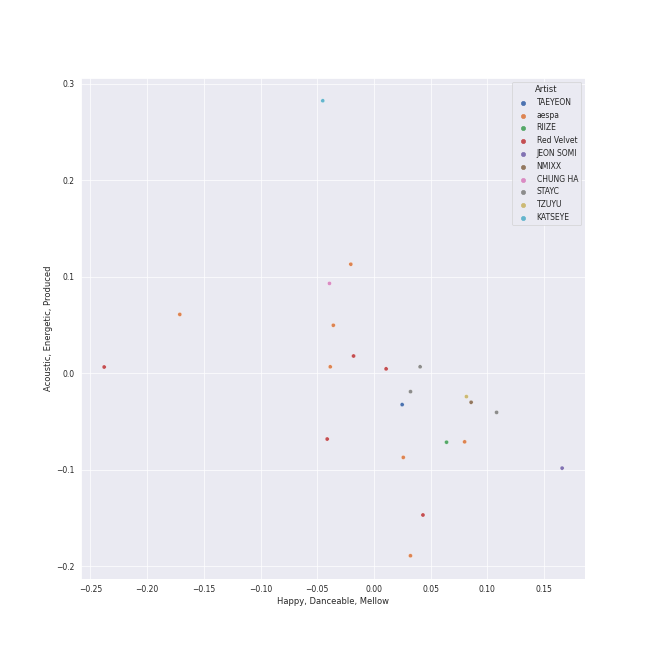

# Repeat Rewind

[30 tracks 🔗](https://open.spotify.com/playlist/37i9dQZF1EpOIeFxMXFVG6)

[See Track Features](audio_features.md)

[See Clusters](clusters/overview.md)

## Top Artists

| Art | Tracks | 💚 | Artist | 🔗 |
|:---|---:|---:|:---|:---|
|  | 5 | 5 | [aespa](../../artists/aespa/overview.md) | [🔗](https://open.spotify.com/artist/6YVMFz59CuY7ngCxTxjpxE) |
|  | 3 | 3 | [Billy Joel](../../artists/billy_joel/overview.md) | [🔗](https://open.spotify.com/artist/6zFYqv1mOsgBRQbae3JJ9e) |
|  | 3 | 3 | [Radiohead](../../artists/radiohead/overview.md) | [🔗](https://open.spotify.com/artist/4Z8W4fKeB5YxbusRsdQVPb) |
|  | 2 | 2 | [TWICE](../../artists/twice/overview.md) | [🔗](https://open.spotify.com/artist/7n2Ycct7Beij7Dj7meI4X0) |
|  | 2 | 2 | [NMIXX](../../artists/nmixx/overview.md) | [🔗](https://open.spotify.com/artist/28ot3wh4oNmoFOdVajibBl) |
|  | 2 | 2 | [WENDY](../../artists/wendy/overview.md) | [🔗](https://open.spotify.com/artist/0FRUZvZNPzM3YJMABJxf2K) |
|  | 1 | 1 | [Kimbra](../../artists/kimbra/overview.md) | [🔗](https://open.spotify.com/artist/6hk7Yq1DU9QcCCrz9uc0Ti) |
|  | 1 | 1 | TAEYONG | [🔗](https://open.spotify.com/artist/6SKusTjOAPsTZ6kareKQdm) |
|  | 1 | 1 | [KISS OF LIFE](../../artists/kiss_of_life/overview.md) | [🔗](https://open.spotify.com/artist/4TEK9tIkcoxib4GxT3O4ky) |
|  | 1 | 1 | Sammy Rae & The Friends | [🔗](https://open.spotify.com/artist/3lFDsTyYNPQc8WzJExnQWn) |

See all 21 artists

| Art | Tracks | 💚 | Artist | 🔗 |
|:---|---:|---:|:---|:---|
|  | 1 | 1 | alt-J | [🔗](https://open.spotify.com/artist/3XHO7cRUPCLOr6jwp8vsx5) |
|  | 1 | 1 | TOKiMONSTA | [🔗](https://open.spotify.com/artist/3VwKSHAfgzV1DOHV0aANCI) |
|  | 1 | 1 | [TEN](../../artists/ten/overview.md) | [🔗](https://open.spotify.com/artist/3Q5Qep7ytrjVleNnMnntgQ) |
| | 1 | 1 | Hongjoong of ATEEZ | [🔗](https://open.spotify.com/artist/3MZLSgcd5kOdhrZasDMecx) |
|  | 1 | 1 | [Rilo Kiley](../../artists/rilo_kiley/overview.md) | [🔗](https://open.spotify.com/artist/2cevwbv7ISD92VMNLYLHZA) |
|  | 1 | 1 | [CHUNG HA](../../artists/chung_ha/overview.md) | [🔗](https://open.spotify.com/artist/2PSJ6YriU7JsFucxACpU7Y) |
|  | 1 | 1 | [ITZY](../../artists/itzy/overview.md) | [🔗](https://open.spotify.com/artist/2KC9Qb60EaY0kW4eH68vr3) |
|  | 1 | 1 | [(G)I-DLE](../../artists/(g)i-dle/overview.md) | [🔗](https://open.spotify.com/artist/2AfmfGFbe0A0WsTYm0SDTx) |
|  | 1 | 1 | [Red Velvet](../../artists/red_velvet/overview.md) | [🔗](https://open.spotify.com/artist/1z4g3DjTBBZKhvAroFlhOM) |
|  | 1 | 1 | [Florence + The Machine](../../artists/florence_+_the_machine/overview.md) | [🔗](https://open.spotify.com/artist/1moxjboGR7GNWYIMWsRjgG) |
|  | 1 | 1 | [NCT DREAM](../../artists/nct_dream/overview.md) | [🔗](https://open.spotify.com/artist/1gBUSTR3TyDdTVFIaQnc02) |

## Top Tracks

Most and least listened tracks

| ​ | Most listened tracks | Rank | ​​ | Least listened tracks | Rank |
|:---|:---|---:|:---|:---|---:|
|  | [Drama](../../artists/aespa/overview.md) | 23 |  | [Creep](../../artists/radiohead/overview.md) | 529 |
|  | [One Kiss](../../artists/red_velvet/overview.md) | 50 |  | [Only the Good Die Young](../../artists/billy_joel/overview.md) | 462 |
|  | [Nobody Knows](../../artists/kiss_of_life/overview.md) | 97 |  | [Wife](../../artists/(g)i-dle/overview.md) | 453 |
|  | [Dangerous](../../artists/ten/overview.md) | 99 |  | [EENIE MEENIE (Feat. Hongjoong of ATEEZ)](../../artists/chung_ha/overview.md) | 359 |
|  | [Regret of the Times - 2024 aespa Remake Version](../../artists/aespa/overview.md) | 134 |  | [Movin' Out (Anthony's Song)](../../artists/billy_joel/overview.md) | 356 |
|  | [I'll Make You Cry](../../artists/aespa/overview.md) | 135 |  | Breezeblocks | 329 |
|  | [Soñar (Breaker)](../../artists/nmixx/overview.md) | 142 |  | [ONE SPARK](../../artists/twice/overview.md) | 291 |
|  | [UNTOUCHABLE](../../artists/itzy/overview.md) | 151 |  | [Silver Lining](../../artists/rilo_kiley/overview.md) | 278 |
|  | [Never Let Me Go](../../artists/florence_+_the_machine/overview.md) | 203 |  | Talk It Up | 273 |
|  | [Settle Down](../../artists/kimbra/overview.md) | 217 |  | [Smoothie](../../artists/nct_dream/overview.md) | 270 |

## Top Albums

| Art | Tracks | 💚 | Album | Release Date | 🔗 |
|:---|---:|---:|:---|:---|:---|
|  | 3 | 3 | The Stranger (Legacy Edition) | 1977 | [🔗](https://open.spotify.com/album/1Mhn9VosyjtWn4dMPFlna6) |
|  | 2 | 2 | With YOU-th | 2024-02-23 | [🔗](https://open.spotify.com/album/575TQDOQqc0MAheeEeKWUR) |
|  | 2 | 2 | Wish You Hell - The 2nd Mini Album | 2024-03-12 | [🔗](https://open.spotify.com/album/3f8n88uX0tNvA8HTROgSkr) |
|  | 1 | 1 | Vows (Deluxe Version) | 2011 | [🔗](https://open.spotify.com/album/6V9rvW05Um5bIHePPfeI8p) |
|  | 1 | 1 | Under The Blacklight (Standard Version) | 2007-08-20 | [🔗](https://open.spotify.com/album/2f9RsTZpsYMLRVZBtW7En8) |
|  | 1 | 1 | The Good Life | 2018-07-10 | [🔗](https://open.spotify.com/album/4s1igjt5YJe7s7BdCeX3DX) |
|  | 1 | 1 | The Bends | 1995-03-13 | [🔗](https://open.spotify.com/album/35UJLpClj5EDrhpNIi4DFg) |
|  | 1 | 1 | TEN - The 1st Mini Album | 2024-02-13 | [🔗](https://open.spotify.com/album/50Zo1vf3YCQtXLUZr2oBiQ) |
|  | 1 | 1 | TAP - The 2nd Mini Album | 2024-02-26 | [🔗](https://open.spotify.com/album/5PliHwqYkEzdXHZnA6scC0) |
|  | 1 | 1 | Savage - The 1st Mini Album | 2021-10-05 | [🔗](https://open.spotify.com/album/3vyyDkvYWC36DwgZCYd3Wu) |

See all 26 albums

| Art | Tracks | 💚 | Album | Release Date | 🔗 |
|:---|---:|---:|:---|:---|:---|
|  | 1 | 1 | Regret of the Times (2024 aespa Remake Version) - SM STATION | 2024-01-15 | [🔗](https://open.spotify.com/album/4Nav3JE8TIOFiuY5x95MIh) |
|  | 1 | 1 | Pablo Honey | 1993-02-22 | [🔗](https://open.spotify.com/album/3gBVdu4a1MMJVMy6vwPEb8) |
|  | 1 | 1 | OK Computer | 1997-05-28 | [🔗](https://open.spotify.com/album/6dVIqQ8qmQ5GBnJ9shOYGE) |
|  | 1 | 1 | Fraggle Rock: Back To The Rock - Season 2 (Apple TV+ Original Series Soundtrack) | 2024-03-29 | [🔗](https://open.spotify.com/album/7ADS5WrhmIaFv9r1671yNh) |
|  | 1 | 1 | Fe3O4: BREAK | 2024-01-15 | [🔗](https://open.spotify.com/album/5CCxLQgcI7cVwmgFDlicbP) |
|  | 1 | 1 | EENIE MEENIE | 2024-03-11 | [🔗](https://open.spotify.com/album/1q2RNzz09Vx3bOKK1yTyyg) |
|  | 1 | 1 | Drama - The 4th Mini Album | 2023-11-10 | [🔗](https://open.spotify.com/album/5NMtxQJy4wq3mpo3ERVnLs) |
|  | 1 | 1 | Die Trying | 2024-04-04 | [🔗](https://open.spotify.com/album/2Ov7bn3HyDgvAxtYPLosUR) |
|  | 1 | 1 | DREAM( )SCAPE | 2024-03-25 | [🔗](https://open.spotify.com/album/2urIpiAu1CySTyyNuQQxcz) |
|  | 1 | 1 | Chill Kill - The 3rd Album | 2023-11-13 | [🔗](https://open.spotify.com/album/4UUICitfodUVCNhzmDFbrO) |
|  | 1 | 1 | Ceremonials (Deluxe Edition) | 2011-01-01 | [🔗](https://open.spotify.com/album/5SxudoALxEAVh9l83kSebx) |
|  | 1 | 1 | Born to be XX | 2023-11-08 | [🔗](https://open.spotify.com/album/6yDtQxvq1XRC7Y5qtS03Xx) |
|  | 1 | 1 | BORN TO BE | 2024-01-08 | [🔗](https://open.spotify.com/album/3cm3EkNQLpKu58btSJT7fz) |
|  | 1 | 1 | An Awesome Wave | 2012-09-18 | [🔗](https://open.spotify.com/album/6k3vC8nep1BfqAIJ81L6OL) |
|  | 1 | 1 | AD MARE | 2022-02-22 | [🔗](https://open.spotify.com/album/2QbA97qjlAs81t6kVS6zBk) |
|  | 1 | 1 | 2 | 2024-01-29 | [🔗](https://open.spotify.com/album/0mC9MXPddkzggVsOXh5gd3) |

## Top Record Labels

| Tracks | 💚 | Label |
|---:|---:|:---|
| 9 | 9 | [SM Entertainment](../../labels/sm_entertainment/overview.md) |
| 5 | 5 | [Republic Records](../../labels/republic_records/overview.md) |
| 3 | 3 | [XL Recordings](../../labels/xl_recordings/overview.md) |
| 3 | 3 | [Warner Records](../../labels/warner_records/overview.md) |
| 3 | 3 | [Legacy](../../labels/legacy/overview.md) |
| 3 | 3 | [Columbia](../../labels/columbia/overview.md) |
| 1 | 1 | [Universal-Island Records Ltd.](../../labels/universal-island_records_ltd_/overview.md) |
| 1 | 1 | [S2 ENTERTAINMENT INC.](../../labels/s2_entertainment_inc_/overview.md) |
| 1 | 1 | [Nettwerk Music Group](../../labels/nettwerk_music_group/overview.md) |
| 1 | 1 | Netflix Music |

See all 15 labels

| Tracks | 💚 | Label |
|---:|---:|:---|
| 1 | 1 | MORE VISION |
| 1 | 1 | Lakeshore Records |
| 1 | 1 | Canvasback |
| 1 | 1 | [CUBE ENTERTAINMENT](../../labels/cube_entertainment/overview.md) |
| 1 | 1 | ATL |

## Genres

| Tracks | 💚 | Genre |
|---:|---:|:---|
| 13 | 13 | [k-pop girl group](../../genres/k-pop_girl_group/overview.md) |
| 11 | 11 | [k-pop](../../genres/k-pop/overview.md) |
| 7 | 7 | [rock](../../genres/rock/overview.md) |
| 3 | 3 | [soft rock](../../genres/soft_rock/overview.md) |
| 3 | 3 | [singer-songwriter](../../genres/singer-songwriter/overview.md) |
| 3 | 3 | [piano rock](../../genres/piano_rock/overview.md) |
| 3 | 3 | [permanent wave](../../genres/permanent_wave/overview.md) |
| 3 | 3 | oxford indie |
| 3 | 3 | [mellow gold](../../genres/mellow_gold/overview.md) |
| 3 | 3 | melancholia |

See all 35 genres

| Tracks | 💚 | Genre |
|---:|---:|:---|
| 3 | 3 | [classic rock](../../genres/classic_rock/overview.md) |
| 3 | 3 | [art rock](../../genres/art_rock/overview.md) |
| 3 | 3 | [alternative rock](../../genres/alternative_rock/overview.md) |
| 3 | 3 | [album rock](../../genres/album_rock/overview.md) |
| 2 | 2 | [pop](../../genres/pop/overview.md) |
| 2 | 2 | [modern rock](../../genres/modern_rock/overview.md) |
| 2 | 2 | [korean pop](../../genres/korean_pop/overview.md) |
| 2 | 2 | indie rock |
| 1 | 1 | [uk alternative pop](../../genres/uk_alternative_pop/overview.md) |
| 1 | 1 | nz pop |
| 1 | 1 | nyc pop |
| 1 | 1 | [neo mellow](../../genres/neo_mellow/overview.md) |
| 1 | 1 | modern alternative rock |
| 1 | 1 | [lilith](../../genres/lilith/overview.md) |
| 1 | 1 | la indie |
| 1 | 1 | [k-pop boy group](../../genres/k-pop_boy_group/overview.md) |
| 1 | 1 | indietronica |
| 1 | 1 | indie pop |
| 1 | 1 | funktronica |
| 1 | 1 | electropop |
| 1 | 1 | chamber pop |
| 1 | 1 | canadian indie |
| 1 | 1 | bergen indie |
| 1 | 1 | baroque pop |
| 1 | 1 | [5th gen k-pop](../../genres/5th_gen_k-pop/overview.md) |

## Top Producers

| Art | Producer | Tracks | Credit Types |
|:---|:---|---:|:---|
| | 임찬미 (Kim, Chan-mi) | 3 | Producer |
| | [Jonny Greenwood](../../producers/jonny_greenwood/overview.md) | 3 | Songwriter |
| | [Philip Selway](../../producers/philip_selway/overview.md) | 3 | Songwriter |
| | [구종필 (Koo, Jong-Pil)](../../producers/구종필_(koo,_jong-pil)/overview.md) | 3 | Producer |
| | [Phil Ramone](../../producers/phil_ramone/overview.md) | 3 | Producer |
| | [구혜진 (Gu, Hye-jin)](../../producers/구혜진_(gu,_hye-jin)/overview.md) | 3 | Producer |
| | [Ed O'Brien](../../producers/ed_o_brien/overview.md) | 3 | Songwriter |
| | [Jim Boyer](../../producers/jim_boyer/overview.md) | 3 | Producer |
|  | [Billy Joel](../../artists/billy_joel/overview.md) | 3 | Lyricist, Songwriter |
| | [Colin Greenwood](../../producers/colin_greenwood/overview.md) | 3 | Songwriter |

View all

| Art | Producer | Tracks | Credit Types |
|:---|:---|---:|:---|
| | [Thom Yorke](../../producers/thom_yorke/overview.md) | 3 | Lyricist, Songwriter, Producer |
| | [정은경 (Jung, Eun-Kyung)](../../producers/정은경_(jung,_eun-kyung)/overview.md) | 2 | Producer |
| | [조윤경 (Jo, Yoon Kyung)](../../producers/조윤경_(jo,_yoon_kyung)/overview.md) | 2 | Lyricist |
| | 이우현 (Lee, Woo-hyun) | 2 | Arranger, Songwriter |
| | 오현선 (Oh, Hyun-sun) | 2 | Lyricist |
| | 홍장미 (Hong, Jangmi) | 2 | Producer |
| | KayOne | 2 | Producer |
| | [earattack](../../producers/earattack/overview.md) | 2 | Arranger, Producer, Songwriter |
| | Melanie Joy Fontana | 2 | Songwriter, Lyricist |
| | Mike Hazlewood | 1 | Songwriter |
| | Tom Hollings | 1 | Songwriter |
| | Tom Elmhirst | 1 | Producer |
| | Dem Jointz | 1 | Arranger, Songwriter |
| | Sean Slade | 1 | Producer |
|  | [Radiohead](../../artists/radiohead/overview.md) | 1 | Arranger, Producer |
| | Zarah Christenson | 1 | Songwriter |
| | 방혜현 (Bang, Hye Hyun) | 1 | Lyricist |
| | Gus Unger-Hamilton | 1 | Songwriter |
| | Joseph K | 1 | Arranger, Songwriter |
| | [Arschtritt Lindgren](../../producers/arschtritt_lindgren/overview.md) | 1 | Arranger, Songwriter |
| | Kyler Niko | 1 | Songwriter |
| | 노민지 (Noh, Min-ji) | 1 | Producer |
| | Jenny Lewis | 1 | Songwriter |
| | Bullion | 1 | Producer |
| | Kirsten Collins | 1 | Songwriter |
| | 유정연 (Yoo, Jeong-yeon) | 1 | Lyricist |
|  | [JEON SOYEON](../../artists/jeon_soyeon/overview.md) | 1 | Arranger, Lyricist, Songwriter |
| | MJ | 1 | Producer |
|  | Anne-Marie | 1 | Songwriter |
| | Gwil Sainsbury | 1 | Songwriter |
| | Rick Bridges | 1 | Lyricist |
|  | [Kimbra](../../artists/kimbra/overview.md) | 1 | Lyricist, Songwriter |
| | 이경원 (Lee, Kyung-won) | 1 | Producer |
| | 오유원 (Oh, Yoo-won) | 1 | Lyricist |
| | IMLAY | 1 | Arranger |
|  | [Rilo Kiley](../../artists/rilo_kiley/overview.md) | 1 | Producer |
| | 서은일 (Seo, Eun-il) | 1 | Producer |
| | Frankie Day | 1 | Songwriter |
| | Brown Panda | 1 | Arranger, Songwriter |
| | [Josh Gudwin](../../producers/josh_gudwin/overview.md) | 1 | Producer |
| | Brian U | 1 | Arranger, Songwriter |
| | [Pop Time](../../producers/pop_time/overview.md) | 1 | Arranger, Songwriter |
| | Hautboi Rich | 1 | Songwriter |
| | PAPRIKAA | 1 | Arranger, Songwriter |
| | Charlie Andrew | 1 | Producer, Songwriter |
| | 김영현 (Kim, Young-hyun) | 1 | Producer |
| | Jason Lader | 1 | Producer |
| | Joe Newman | 1 | Songwriter |
| | Thom Green | 1 | Songwriter |
| | Brandon Green | 1 | Arranger, Songwriter |
| | Adam von Mentzer | 1 | Songwriter |
| | Sara Boe | 1 | Songwriter |
| | Conor Blake | 1 | Arranger, Songwriter |
| | [Fuxxy](../../producers/fuxxy/overview.md) | 1 | Arranger |
| | Daily | 1 | Arranger, Songwriter |
| | M-Phazes | 1 | Producer |
| | Matthew Jaragin | 1 | Songwriter |
| | Tobias Näslund (Näslund, Tobias) | 1 | Arranger, Producer, Songwriter |
| | 장우영 (Jang, Woo-young) | 1 | Producer |
| | AFTRSHOK | 1 | Arranger, Songwriter |
| | 이지홍 (Lee, Ji-hong) | 1 | Producer |
| | Maria Marcus | 1 | Songwriter |
| | Dr.JO | 1 | Lyricist |
| | Samuel Brennan | 1 | Songwriter |
| | Albert Hammond | 1 | Songwriter |
| | 이스란 (Lee, Seran) | 1 | Lyricist |
| | 여민수 (Yeo, Min Soo) | 1 | Producer |
| | Alawn | 1 | Producer |
| | 강선영 (강선영) | 1 | Producer |
| | [Kenzie](../../producers/kenzie/overview.md) | 1 | Lyricist, Songwriter |
| | GG Ramirez | 1 | Songwriter |
| | 정준호 (Jung, Joon-ho) | 1 | Lyricist |
| | LSY | 1 | Arranger, Songwriter |
| | HONEY NOISE | 1 | Arranger, Producer, Songwriter |
| | [엄세희 (Um, Se-Hee)](../../producers/엄세희_(um,_se-hee)/overview.md) | 1 | Producer |
| | 복주영 (Bok, Ju Young) | 1 | Lyricist |
|  | [CHUNG HA](../../artists/chung_ha/overview.md) | 1 | Lyricist |
| | Julie Han | 1 | Lyricist |
| | Kobee | 1 | Arranger |
| | [Nigel Godrich](../../producers/nigel_godrich/overview.md) | 1 | Producer |
| | [François Tétaz (Tétaz, François)](../../producers/françois_tétaz_(tétaz,_françois)/overview.md) | 1 | Lyricist, Producer, Songwriter |
| | [Florence Welch](../../producers/florence_welch/overview.md) | 1 | Lyricist, Songwriter |
| | [심은지 (Sim, Eunjee)](../../producers/심은지_(sim,_eunjee)/overview.md) | 1 | Lyricist |
| | Ayushy | 1 | Arranger, Songwriter |
| | Deanna | 1 | Songwriter |
| | Paulina Cerrilla | 1 | Songwriter |
| | [Kid Harpoon](../../producers/kid_harpoon/overview.md) | 1 | Songwriter |
| | [Tony Maserati](../../producers/tony_maserati/overview.md) | 1 | Producer |
| | NVR know | 1 | Arranger, Songwriter |
| | [Ryan S. Jhun](../../producers/ryan_s__jhun/overview.md) | 1 | Arranger, Songwriter |

## Years

| ​ | 10 newest albums | ​​ | 10 oldest albums |
|:---|:---|:---|:---|
|  | Die Trying (2024-04-04) |  | The Stranger (Legacy Edition) (1977) |
|  | Fraggle Rock: Back To The Rock - Season 2 (Apple TV+ Original Series Soundtrack) (2024-03-29) |  | Pablo Honey (1993-02-22) |
|  | DREAM( )SCAPE (2024-03-25) |  | The Bends (1995-03-13) |
|  | Wish You Hell - The 2nd Mini Album (2024-03-12) |  | OK Computer (1997-05-28) |
|  | EENIE MEENIE (2024-03-11) |  | Under The Blacklight (Standard Version) (2007-08-20) |
|  | TAP - The 2nd Mini Album (2024-02-26) |  | Vows (Deluxe Version) (2011) |
|  | With YOU-th (2024-02-23) |  | Ceremonials (Deluxe Edition) (2011-01-01) |
|  | TEN - The 1st Mini Album (2024-02-13) |  | An Awesome Wave (2012-09-18) |
|  | 2 (2024-01-29) |  | The Good Life (2018-07-10) |
|  | Fe3O4: BREAK (2024-01-15) |  | Savage - The 1st Mini Album (2021-10-05) |