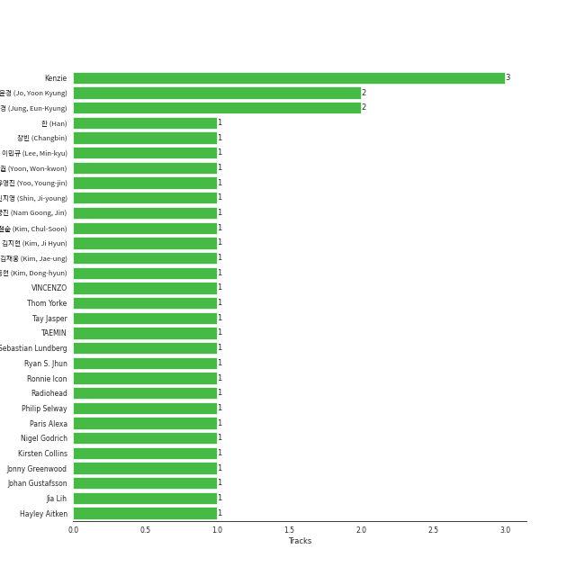

# Repeat Rewind

[30 tracks 🔗](https://open.spotify.com/playlist/37i9dQZF1EpOIeFxMXFVG6)

[See Track Features](audio_features.md)

[See Clusters](clusters/overview.md)

## Top Artists

| Art | Tracks | 💚 | Artist | 🔗 |
|:---|---:|---:|:---|:---|
|  | 4 | 4 | [aespa](../../artists/aespa/overview.md) | [🔗](https://open.spotify.com/artist/6YVMFz59CuY7ngCxTxjpxE) |
|  | 4 | 4 | [(G)I-DLE](../../artists/(g)i-dle/overview.md) | [🔗](https://open.spotify.com/artist/2AfmfGFbe0A0WsTYm0SDTx) |
|  | 4 | 4 | [Red Velvet](../../artists/red_velvet/overview.md) | [🔗](https://open.spotify.com/artist/1z4g3DjTBBZKhvAroFlhOM) |
|  | 3 | 3 | [ITZY](../../artists/itzy/overview.md) | [🔗](https://open.spotify.com/artist/2KC9Qb60EaY0kW4eH68vr3) |
|  | 2 | 2 | [TWICE](../../artists/twice/overview.md) | [🔗](https://open.spotify.com/artist/7n2Ycct7Beij7Dj7meI4X0) |
|  | 2 | 2 | [LE SSERAFIM](../../artists/le_sserafim/overview.md) | [🔗](https://open.spotify.com/artist/4SpbR6yFEvexJuaBpgAU5p) |
|  | 2 | 2 | [TAEYEON](../../artists/taeyeon/overview.md) | [🔗](https://open.spotify.com/artist/3qNVuliS40BLgXGxhdBdqu) |
|  | 2 | 2 | [NMIXX](../../artists/nmixx/overview.md) | [🔗](https://open.spotify.com/artist/28ot3wh4oNmoFOdVajibBl) |
|  | 1 | 1 | [BIBI](../../artists/bibi/overview.md) | [🔗](https://open.spotify.com/artist/6UbmqUEgjLA6jAcXwbM1Z9) |
|  | 1 | 1 | [ENHYPEN](../../artists/enhypen/overview.md) | [🔗](https://open.spotify.com/artist/5t5FqBwTcgKTaWmfEbwQY9) |

See all 17 artists

| Art | Tracks | 💚 | Artist | 🔗 |
|:---|---:|---:|:---|:---|
|  | 1 | 1 | SISTAR19 | [🔗](https://open.spotify.com/artist/5Q0U6ogBrMX2oxmxy5OTzU) |
|  | 1 | 1 | [KISS OF LIFE](../../artists/kiss_of_life/overview.md) | [🔗](https://open.spotify.com/artist/4TEK9tIkcoxib4GxT3O4ky) |
|  | 1 | 1 | [TEN](../../artists/ten/overview.md) | [🔗](https://open.spotify.com/artist/3Q5Qep7ytrjVleNnMnntgQ) |
|  | 1 | 1 | [Stray Kids](../../artists/stray_kids/overview.md) | [🔗](https://open.spotify.com/artist/2dIgFjalVxs4ThymZ67YCE) |
|  | 1 | 1 | BABYMONSTER | [🔗](https://open.spotify.com/artist/1SIocsqdEefUTE6XKGUiVS) |
|  | 1 | 1 | [Jacob Collier](../../artists/jacob_collier/overview.md) | [🔗](https://open.spotify.com/artist/0QWrMNukfcVOmgEU0FEDyD) |
|  | 1 | 1 | Chris Martin | [🔗](https://open.spotify.com/artist/0LQoZQIV0mIs0y0XQb0Sw2) |

## Top Tracks

Most and least listened tracks

| ​ | Most listened tracks | Rank | ​​ | Least listened tracks | Rank |
|:---|:---|---:|:---|:---|---:|
|  | [Illusion](../../artists/aespa/overview.md) | 19 |  | NO MORE (MA BOY) | 506 |
|  | [Trick or Trick](../../artists/aespa/overview.md) | 52 |  | [EASY](../../artists/le_sserafim/overview.md) | 469 |
|  | [Chill Kill](../../artists/red_velvet/overview.md) | 65 |  | [Rollie](../../artists/(g)i-dle/overview.md) | 458 |
|  | [Sweet Venom](../../artists/enhypen/overview.md) | 70 |  | [Nightwalker](../../artists/ten/overview.md) | 419 |
|  | [Nightmare](../../artists/red_velvet/overview.md) | 82 |  | [Wife](../../artists/(g)i-dle/overview.md) | 399 |
|  | [MEGAVERSE](../../artists/stray_kids/overview.md) | 99 |  | [Run For Roses](../../artists/nmixx/overview.md) | 350 |
|  | [Don't Blink](../../artists/aespa/overview.md) | 100 |  | [Over You (feat. aespa & Chris Martin)](../../artists/jacob_collier/overview.md) | 339 |
|  | [Knock Knock (Who's There?)](../../artists/red_velvet/overview.md) | 114 |  | [Sugar Rush](../../artists/bibi/overview.md) | 325 |
|  | [BORN TO BE](../../artists/itzy/overview.md) | 115 |  | [BLOOM](../../artists/twice/overview.md) | 318 |
|  | [Burn It Down](../../artists/taeyeon/overview.md) | 122 |  | [ONE SPARK](../../artists/twice/overview.md) | 284 |

## Top Albums

| Art | Tracks | 💚 | Album | Release Date | 🔗 |
|:---|---:|---:|:---|:---|:---|
|  | 4 | 4 | Chill Kill - The 3rd Album | 2023-11-13 | [🔗](https://open.spotify.com/album/4UUICitfodUVCNhzmDFbrO) |
|  | 4 | 4 | 2 | 2024-01-29 | [🔗](https://open.spotify.com/album/0mC9MXPddkzggVsOXh5gd3) |
|  | 3 | 3 | BORN TO BE | 2024-01-08 | [🔗](https://open.spotify.com/album/3cm3EkNQLpKu58btSJT7fz) |
|  | 2 | 2 | With YOU-th | 2024-02-23 | [🔗](https://open.spotify.com/album/575TQDOQqc0MAheeEeKWUR) |
|  | 2 | 2 | To. X - The 5th Mini Album | 2023-11-27 | [🔗](https://open.spotify.com/album/0VciVDVU6NoqtQ0WAIlTmD) |
|  | 2 | 2 | Fe3O4: BREAK | 2024-01-15 | [🔗](https://open.spotify.com/album/5CCxLQgcI7cVwmgFDlicbP) |
|  | 2 | 2 | EASY | 2024-02-19 | [🔗](https://open.spotify.com/album/1YCj4PZi08G20y2ekGKY0C) |
|  | 2 | 2 | Drama - The 4th Mini Album | 2023-11-10 | [🔗](https://open.spotify.com/album/5NMtxQJy4wq3mpo3ERVnLs) |
|  | 1 | 1 | TEN - The 1st Mini Album | 2024-02-13 | [🔗](https://open.spotify.com/album/50Zo1vf3YCQtXLUZr2oBiQ) |
|  | 1 | 1 | ROCK-STAR | 2023-11-10 | [🔗](https://open.spotify.com/album/0aJnGEZWIc1VCYlZOXv05a) |

See all 17 albums

| Art | Tracks | 💚 | Album | Release Date | 🔗 |
|:---|---:|---:|:---|:---|:---|
|  | 1 | 1 | ORANGE BLOOD | 2023-11-17 | [🔗](https://open.spotify.com/album/7dsAlxH9cMgyREm8OLdWWT) |
|  | 1 | 1 | NO MORE (MA BOY) | 2024-01-16 | [🔗](https://open.spotify.com/album/3dmsztvqxTfUqTrsu0Z7Ke) |
|  | 1 | 1 | Girls - The 2nd Mini Album | 2022-07-08 | [🔗](https://open.spotify.com/album/4w1dbvUy1crv0knXQvcSeY) |
|  | 1 | 1 | Djesse Vol. 4 | 2024-03-01 | [🔗](https://open.spotify.com/album/13r6eqjYlKELFQlNvVCBz1) |
|  | 1 | 1 | Born to be XX | 2023-11-08 | [🔗](https://open.spotify.com/album/6yDtQxvq1XRC7Y5qtS03Xx) |
|  | 1 | 1 | Bam Yang Gang | 2024-02-13 | [🔗](https://open.spotify.com/album/4QJZzFdGz2YlPZEHAlAJ6O) |
|  | 1 | 1 | BATTER UP | 2023-11-27 | [🔗](https://open.spotify.com/album/2CSQuvvt3XHLDX36O3nRv7) |

## Top Record Labels

| Tracks | 💚 | Label |
|---:|---:|:---|
| 10 | 10 | [SM Entertainment](../../labels/sm_entertainment/overview.md) |
| 8 | 8 | [Republic Records](../../labels/republic_records/overview.md) |
| 4 | 4 | [CUBE ENTERTAINMENT](../../labels/cube_entertainment/overview.md) |
| 3 | 3 | [Warner Records](../../labels/warner_records/overview.md) |
| 2 | 2 | [SOURCE MUSIC](../../labels/source_music/overview.md) |
| 1 | 1 | [YG Entertainment](../../labels/yg_entertainment/overview.md) |
| 1 | 1 | [S2 ENTERTAINMENT INC.](../../labels/s2_entertainment_inc_/overview.md) |
| 1 | 1 | Klap |
| 1 | 1 | FeelGhoodMusic |
| 1 | 1 | [Decca (UMO)](../../labels/decca_(umo)/overview.md) |

See all 11 labels

| Tracks | 💚 | Label |
|---:|---:|:---|
| 1 | 1 | [BELIFT LAB](../../labels/belift_lab/overview.md) |

## Genres

| Tracks | 💚 | Genre |
|---:|---:|:---|
| 22 | 22 | [k-pop girl group](../../genres/k-pop_girl_group/overview.md) |
| 17 | 17 | [k-pop](../../genres/k-pop/overview.md) |
| 3 | 3 | [pop](../../genres/pop/overview.md) |
| 2 | 2 | [k-pop boy group](../../genres/k-pop_boy_group/overview.md) |
| 1 | 1 | [uk alternative pop](../../genres/uk_alternative_pop/overview.md) |
| 1 | 1 | [korean r&b](../../genres/korean_r_b/overview.md) |
| 1 | 1 | [anime](../../genres/anime/overview.md) |

## Top Producers

| Art | Producer | Tracks | Credit Types |
|:---|:---|---:|:---|
| | [구혜진 (Gu, Hye-jin)](../../producers/구혜진_(gu,_hye-jin)/overview.md) | 5 | Producer |
| | 임찬미 (Kim, Chan-mi) | 3 | Producer |
|  | [JEON SOYEON](../../artists/jeon_soyeon/overview.md) | 2 | Arranger, Lyricist, Songwriter |
| | Boytoy | 2 | Lyricist, Songwriter, Arranger |
| | KayOne | 2 | Producer |
| | Melanie Joy Fontana | 2 | Songwriter, Lyricist |
| | MOJO | 2 | Lyricist, Songwriter, Arranger |
| | Likey | 2 | Arranger, Songwriter |
| | [earattack](../../producers/earattack/overview.md) | 2 | Arranger, Producer, Songwriter |
| | [정은경 (Jung, Eun-Kyung)](../../producers/정은경_(jung,_eun-kyung)/overview.md) | 2 | Producer |

View all

| Art | Producer | Tracks | Credit Types |
|:---|:---|---:|:---|
| | 이스란 (Lee, Seran) | 2 | Lyricist |
| | Daily | 2 | Arranger, Songwriter |
| | [엄세희 (Um, Se-Hee)](../../producers/엄세희_(um,_se-hee)/overview.md) | 2 | Producer |
| | Frankie Day | 2 | Songwriter, Lyricist |
| | [이태섭 (Lee, Tae-Sub)](../../producers/이태섭_(lee,_tae-sub)/overview.md) | 2 | Producer |
|  | YUQI | 2 | Lyricist, Songwriter |
| | 서은일 (Seo, Eun-il) | 2 | Producer |
| | [Pop Time](../../producers/pop_time/overview.md) | 2 | Arranger, Songwriter |
| | [구종필 (Koo, Jong-Pil)](../../producers/구종필_(koo,_jong-pil)/overview.md) | 2 | Producer |
| | 이우현 (Lee, Woo-hyun) | 2 | Arranger, Songwriter |
| | Ayushy | 2 | Arranger, Songwriter |
| | Joseph K | 1 | Arranger, Songwriter |
| | [LDN Noise](../../producers/ldn_noise/overview.md) | 1 | Arranger |
| | 홍장미 (Hong, Jangmi) | 1 | Producer |
| | Zarah Christenson | 1 | Songwriter |
| | Gusten Dahlqvist | 1 | Arranger, Producer, Songwriter |
| | [Arschtritt Lindgren](../../producers/arschtritt_lindgren/overview.md) | 1 | Arranger, Songwriter |
| | 방혜현 (Bang, Hye Hyun) | 1 | Lyricist |
| | Chaz Mishan | 1 | Arranger, Songwriter |
| | 이승훈 (Lee, Seunghoon) | 1 | Arranger, Songwriter |
| | 유정연 (Yoo, Jeong-yeon) | 1 | Lyricist |
| | Kyler Niko | 1 | Songwriter |
| | Brian U | 1 | Arranger, Songwriter |
| | 오현선 (Oh, Hyun-sun) | 1 | Lyricist |
| | Greg Bonnick | 1 | Songwriter |
| | 여민수 (Yeo, Min Soo) | 1 | Producer |
| | WHERE THE NOISE | 1 | Lyricist |
| | Pink Slip | 1 | Arranger, Songwriter |
| | 강영현 (Kang, Young-hyun) | 1 | Lyricist |
| | 김영현 (Kim, Young-hyun) | 1 | Producer |
| | アサ (Asa) | 1 | Lyricist, Songwriter |
| | BIGTONE | 1 | Lyricist |
| | [Josh Gudwin](../../producers/josh_gudwin/overview.md) | 1 | Producer |
| | Brown Panda | 1 | Arranger, Songwriter |
| | Taet Chesterton | 1 | Songwriter |
| | Arineh Karimi | 1 | Songwriter |
| | Jared Lee | 1 | Lyricist, Songwriter |
| | 장민 (Jang, Min) | 1 | Producer |
| | [심은지 (Sim, Eunjee)](../../producers/심은지_(sim,_eunjee)/overview.md) | 1 | Lyricist |
| | Paulina Cerrilla | 1 | Songwriter |
| | AFTRSHOK | 1 | Arranger, Songwriter |
| | 양현석 (Yang, Hyun Suk) | 1 | Arranger, Lyricist, Songwriter |
| | Maria Marcus | 1 | Songwriter |
| | SORANA | 1 | Songwriter |
| | Roland Spreckley | 1 | Songwriter |
| | 강선영 (강선영) | 1 | Producer |
| | GG Ramirez | 1 | Songwriter |
| | LSY | 1 | Arranger, Songwriter |
| | HONEY NOISE | 1 | Arranger, Producer, Songwriter |
| | [Kriz](../../producers/kriz/overview.md) | 1 | Arranger |
| | Milli Oshyun | 1 | Arranger, Songwriter |
| | 서정아 (Seo, Jung Ah) | 1 | Lyricist |
| | 제인스 (Jayins) | 1 | Lyricist, Songwriter |
| | 213 | 1 | Arranger, Lyricist, Songwriter |
| | 복주영 (Bok, Ju Young) | 1 | Lyricist |
| | Tobias Näslund (Näslund, Tobias) | 1 | Arranger, Producer, Songwriter |
| | 이상엽 (Lee, Sang-yeob) | 1 | Producer |
| | Dee.P | 1 | Arranger, Songwriter |
| | Melli | 1 | Lyricist, Songwriter |
| | 이찬혁 (Lee, Chanhyeok) | 1 | Lyricist |
| | [Tony Maserati](../../producers/tony_maserati/overview.md) | 1 | Producer |
| | NVR know | 1 | Arranger, Songwriter |
| | [Ryan S. Jhun](../../producers/ryan_s__jhun/overview.md) | 1 | Arranger, Songwriter |
|  | HYOLYN | 1 | Arranger, Songwriter |
| | Noday | 1 | Arranger, Lyricist |
| | Awrii | 1 | Arranger, Songwriter |
| | Kobee | 1 | Arranger |
| | Jacob Aaron | 1 | Songwriter |
| | YUE | 1 | Producer |
| | Hayden Chapman | 1 | Songwriter |
| | Danny Shah | 1 | Songwriter |
| | inverness | 1 | Arranger, Songwriter |
| | Meez | 1 | Producer |
| | 최현석 | 1 | Lyricist |

## Years

| ​ | 10 newest albums | ​​ | 10 oldest albums |
|:---|:---|:---|:---|
|  | Djesse Vol. 4 (2024-03-01) |  | Girls - The 2nd Mini Album (2022-07-08) |
|  | With YOU-th (2024-02-23) |  | Born to be XX (2023-11-08) |
|  | EASY (2024-02-19) |  | ROCK-STAR (2023-11-10) |
|  | Bam Yang Gang (2024-02-13) |  | Drama - The 4th Mini Album (2023-11-10) |
|  | TEN - The 1st Mini Album (2024-02-13) |  | Chill Kill - The 3rd Album (2023-11-13) |
|  | 2 (2024-01-29) |  | ORANGE BLOOD (2023-11-17) |
|  | NO MORE (MA BOY) (2024-01-16) |  | To. X - The 5th Mini Album (2023-11-27) |
|  | Fe3O4: BREAK (2024-01-15) |  | BATTER UP (2023-11-27) |
|  | BORN TO BE (2024-01-08) |  | BORN TO BE (2024-01-08) |
|  | To. X - The 5th Mini Album (2023-11-27) |  | Fe3O4: BREAK (2024-01-15) |