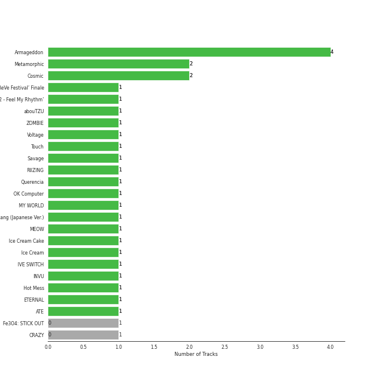

# Repeat Rewind

[30 tracks 🔗](https://open.spotify.com/playlist/37i9dQZF1EpOIeFxMXFVG6)

[See Track Features](audio_features.md)

[See Clusters](clusters/overview.md)

## Top Artists

| Art | Rank | Tracks | 💚 | Artist | 🔗 |
|:---|---:|---:|---:|:---|:---|
|  | 57 | 3 | 3 | [Billy Joel](../../artists/billy_joel/overview.md) | [🔗](https://open.spotify.com/artist/6zFYqv1mOsgBRQbae3JJ9e) |
|  | 1 | 3 | 3 | [aespa](../../artists/aespa/overview.md) | [🔗](https://open.spotify.com/artist/6YVMFz59CuY7ngCxTxjpxE) |
|  | 18 | 3 | 3 | [IVE](../../artists/ive/overview.md) | [🔗](https://open.spotify.com/artist/6RHTUrRF63xao58xh9FXYJ) |
|  | 66 | 3 | 3 | [Solar](../../artists/solar/overview.md) | [🔗](https://open.spotify.com/artist/5cYcI546S8Lf97m4mNdYLD) |
|  | 5 | 2 | 2 | [ITZY](../../artists/itzy/overview.md) | [🔗](https://open.spotify.com/artist/2KC9Qb60EaY0kW4eH68vr3) |
|  | 89 | 2 | 2 | [YUQI](../../artists/yuqi/overview.md) | [🔗](https://open.spotify.com/artist/22aCD8IrQZjcPgZw728QT6) |
|  | 2 | 2 | 2 | [Red Velvet](../../artists/red_velvet/overview.md) | [🔗](https://open.spotify.com/artist/1z4g3DjTBBZKhvAroFlhOM) |
|  | 9 | 1 | 1 | [TWICE](../../artists/twice/overview.md) | [🔗](https://open.spotify.com/artist/7n2Ycct7Beij7Dj7meI4X0) |
|  | 130 | 1 | 1 | Lexie Liu | [🔗](https://open.spotify.com/artist/6fs2or0cKLEM2xohWq8SoX) |
|  | 7 | 1 | 1 | [ENHYPEN](../../artists/enhypen/overview.md) | [🔗](https://open.spotify.com/artist/5t5FqBwTcgKTaWmfEbwQY9) |

See all 20 artists

| Art | Rank | Tracks | 💚 | Artist | 🔗 |
|:---|---:|---:|---:|:---|:---|
|  | 402 | 1 | 1 | Kep1er | [🔗](https://open.spotify.com/artist/5R7AMwDeroq6Ls0COQYpS4) |
|  | 15 | 1 | 1 | [LE SSERAFIM](../../artists/le_sserafim/overview.md) | [🔗](https://open.spotify.com/artist/4SpbR6yFEvexJuaBpgAU5p) |
|  | 3 | 1 | 1 | [BLACKPINK](../../artists/blackpink/overview.md) | [🔗](https://open.spotify.com/artist/41MozSoPIsD1dJM0CLPjZF) |
|  | 156 | 1 | 1 | JO1 | [🔗](https://open.spotify.com/artist/2koP6FEfIEVk4l2Fe6jFhu) |
|  | 25 | 1 | 1 | [Sara Bareilles](../../artists/sara_bareilles/overview.md) | [🔗](https://open.spotify.com/artist/2Sqr0DXoaYABbjBo9HaMkM) |
|  | 14 | 1 | 1 | [CHUNG HA](../../artists/chung_ha/overview.md) | [🔗](https://open.spotify.com/artist/2PSJ6YriU7JsFucxACpU7Y) |
|  | 26 | 1 | 1 | [NMIXX](../../artists/nmixx/overview.md) | [🔗](https://open.spotify.com/artist/28ot3wh4oNmoFOdVajibBl) |
|  | 129 | 1 | 1 | Steam Powered Giraffe | [🔗](https://open.spotify.com/artist/1yqs45BSh7457Flyhmdv7f) |
|  | 377 | 1 | 1 | Xdinary Heroes | [🔗](https://open.spotify.com/artist/1khChLj7REGqjM043PlYyn) |
|  | 86 | 1 | 1 | BABYMONSTER | [🔗](https://open.spotify.com/artist/1SIocsqdEefUTE6XKGUiVS) |

## Top Tracks

Most and least listened tracks

| Rank | ​ | Most listened tracks | Rank | ​​ | Least listened tracks |
|---:|:---|:---|---:|:---|:---|
| 70 |  | [DDU-DU DDU-DU](../../artists/blackpink/overview.md) | 866 |  | Straight Line |
| 115 |  | SHEESH | 806 |  | Little Things |
| 136 |  | [I'll Make You Cry](../../artists/aespa/overview.md) | 756 |  | [FREAK](../../artists/yuqi/overview.md) |
| 153 |  | [Sunny Side Up!](../../artists/red_velvet/overview.md) | 493 |  | [Only the Good Die Young](../../artists/billy_joel/overview.md) |
| 200 |  | [Psycho](../../artists/red_velvet/overview.md) | 471 |  | [ELEVEN](../../artists/ive/overview.md) |
| 209 |  | Honeybee | 406 |  | [Teeth](../../artists/enhypen/overview.md) |
| 216 |  | [On Clap](../../artists/yuqi/overview.md) | 383 |  | [Movin' Out (Anthony's Song)](../../artists/billy_joel/overview.md) |
| 227 |  | [Blue Heart](../../artists/ive/overview.md) | 355 |  | [I’m Ready](../../artists/chung_ha/overview.md) |
| 246 |  | [Algorhythm](../../artists/itzy/overview.md) | 320 |  | [Blues](../../artists/solar/overview.md) |
| 249 |  | [No Biggie](../../artists/itzy/overview.md) | 312 |  | [Honey Honey](../../artists/solar/overview.md) |

## Top Albums

| Art | Rank | Tracks | 💚 | Album | Release Date | 🔗 |
|:---|---:|---:|---:|:---|:---|:---|
|  | 172 | 3 | 3 | The Stranger (Legacy Edition) | 1977 | [🔗](https://open.spotify.com/album/1Mhn9VosyjtWn4dMPFlna6) |
|  | 162 | 3 | 3 | COLOURS | 2024-04-30 | [🔗](https://open.spotify.com/album/5Q1cKPuB4vPk8bIdfZH7Fm) |
|  | 135 | 2 | 2 | YUQ1 | 2024-04-23 | [🔗](https://open.spotify.com/album/7LYc8ngbhwha4aGJ5kVauc) |
|  | 139 | 2 | 2 | IVE SWITCH | 2024-04-29 | [🔗](https://open.spotify.com/album/7z61DsZtWO2S4nC5xd0b9p) |
|  | 48 | 2 | 2 | Armageddon - The 1st Album | 2024-05-27 | [🔗](https://open.spotify.com/album/058hCti9Bupb5CJc6bd3VB) |
|  | 155 | 2 | 2 | Algorhythm | 2024-05-15 | [🔗](https://open.spotify.com/album/7ji7zKkvRlYOsu3ehctQRx) |
|  | 144 | 1 | 1 | ‘The ReVe Festival’ Finale | 2019-12-23 | [🔗](https://open.spotify.com/album/3rVtm00UfbuzWOewdm4iYM) |
|  | 117 | 1 | 1 | ‘The ReVe Festival’ Day 1 | 2019-06-19 | [🔗](https://open.spotify.com/album/2nLEiP268mSFZHW5dajM4R) |
|  | 543 | 1 | 1 | Troubleshooting | 2024-04-30 | [🔗](https://open.spotify.com/album/26ogXm7X0kUSidtoaQVBei) |
|  | 153 | 1 | 1 | The 2¢ Show | 2012-05-23 | [🔗](https://open.spotify.com/album/4DECRyKlhKJgjZLLuvfAI6) |

See all 22 albums

| Art | Rank | Tracks | 💚 | Album | Release Date | 🔗 |
|:---|---:|---:|---:|:---|:---|:---|
|  | 582 | 1 | 1 | Straight Line | 2024-04-24 | [🔗](https://open.spotify.com/album/58nZRpRVzO9INTkg5Ystph) |
|  | 5 | 1 | 1 | Savage - The 1st Mini Album | 2021-10-05 | [🔗](https://open.spotify.com/album/3vyyDkvYWC36DwgZCYd3Wu) |
|  | 71 | 1 | 1 | SQUARE UP | 2018-06-15 | [🔗](https://open.spotify.com/album/0wOiWrujRbxlKEGWRQpKYc) |
|  | 183 | 1 | 1 | Love seeker | 2024-05-11 | [🔗](https://open.spotify.com/album/0fcbyNShvGubuLdQqpMSbF) |
|  | 176 | 1 | 1 | Kaleidoscope Heart | 2010-09-07 | [🔗](https://open.spotify.com/album/627ukPRwYxyBREHxBq0vGJ) |
|  | 199 | 1 | 1 | FANCY YOU | 2019-04-22 | [🔗](https://open.spotify.com/album/3aLpWFejbsdyafODLXRqwF) |
|  | 332 | 1 | 1 | ELEVEN | 2021-12-01 | [🔗](https://open.spotify.com/album/1XMYvsHRt52sMi6wittWqI) |
|  | 196 | 1 | 1 | EENIE MEENIE | 2024-03-11 | [🔗](https://open.spotify.com/album/1q2RNzz09Vx3bOKK1yTyyg) |
|  | 90 | 1 | 1 | EASY | 2024-02-19 | [🔗](https://open.spotify.com/album/1YCj4PZi08G20y2ekGKY0C) |
|  | 130 | 1 | 1 | DARK MOON SPECIAL ALBUM <MEMORABILIA> | 2024-05-13 | [🔗](https://open.spotify.com/album/0OhJwEzXbK9Km6GQSPdmPU) |
|  | 94 | 1 | 1 | BABYMONS7ER | 2024-04-01 | [🔗](https://open.spotify.com/album/0eSbsl3j8jz96LC2NCLPc4) |
|  | 213 | 1 | 1 | AD MARE | 2022-02-22 | [🔗](https://open.spotify.com/album/2QbA97qjlAs81t6kVS6zBk) |

## Top Record Labels

| Tracks | 💚 | Label |
|---:|---:|:---|
| 5 | 5 | [SM Entertainment](../../labels/sm_entertainment/overview.md) |
| 3 | 3 | [Starship Entertainment](../../labels/starship_entertainment/overview.md) |
| 3 | 3 | [Republic Records](../../labels/republic_records/overview.md) |
| 3 | 3 | [RBW Inc.](../../labels/rbw_inc_/overview.md) |
| 3 | 3 | [Legacy](../../labels/legacy/overview.md) |
| 3 | 3 | [Columbia](../../labels/columbia/overview.md) |
| 2 | 2 | [YG Entertainment](../../labels/yg_entertainment/overview.md) |
| 2 | 2 | [WM Japan](../../labels/wm_japan/overview.md) |
| 2 | 2 | [CUBE ENTERTAINMENT](../../labels/cube_entertainment/overview.md) |
| 1 | 1 | WAKEONE |

See all 17 labels

| Tracks | 💚 | Label |
|---:|---:|:---|
| 1 | 1 | Steam Powered Giraffe |
| 1 | 1 | [SOURCE MUSIC](../../labels/source_music/overview.md) |
| 1 | 1 | MORE VISION |
| 1 | 1 | LAPONE Entertainment |
| 1 | 1 | [Interscope Records](../../labels/interscope_records/overview.md) |
| 1 | 1 | [Epic](../../labels/epic/overview.md) |
| 1 | 1 | [BELIFT LAB](../../labels/belift_lab/overview.md) |

## Genres

| Tracks | 💚 | Genre |
|---:|---:|:---|
| 14 | 14 | [k-pop girl group](../../genres/k-pop_girl_group/overview.md) |
| 12 | 12 | [k-pop](../../genres/k-pop/overview.md) |
| 3 | 3 | [soft rock](../../genres/soft_rock/overview.md) |
| 3 | 3 | [singer-songwriter](../../genres/singer-songwriter/overview.md) |
| 3 | 3 | [rock](../../genres/rock/overview.md) |
| 3 | 3 | [piano rock](../../genres/piano_rock/overview.md) |
| 3 | 3 | [mellow gold](../../genres/mellow_gold/overview.md) |
| 3 | 3 | [classic rock](../../genres/classic_rock/overview.md) |
| 3 | 3 | [album rock](../../genres/album_rock/overview.md) |
| 2 | 2 | [pop](../../genres/pop/overview.md) |

See all 21 genres

| Tracks | 💚 | Genre |
|---:|---:|:---|
| 2 | 2 | [k-pop boy group](../../genres/k-pop_boy_group/overview.md) |
| 1 | 1 | steampunk |
| 1 | 1 | [post-teen pop](../../genres/post-teen_pop/overview.md) |
| 1 | 1 | [pop rock](../../genres/pop_rock/overview.md) |
| 1 | 1 | [neo mellow](../../genres/neo_mellow/overview.md) |
| 1 | 1 | [lilith](../../genres/lilith/overview.md) |
| 1 | 1 | j-pop boy group |
| 1 | 1 | [ectofolk](../../genres/ectofolk/overview.md) |
| 1 | 1 | [anime](../../genres/anime/overview.md) |
| 1 | 1 | [acoustic pop](../../genres/acoustic_pop/overview.md) |
| 1 | 1 | [5th gen k-pop](../../genres/5th_gen_k-pop/overview.md) |

## Top Producers

| Art | Producer | Tracks | Credit Types |
|:---|:---|---:|:---|
|  | [Billy Joel](../../artists/billy_joel/overview.md) | 3 | Lyricist, Songwriter |
| | [Jim Boyer](../../producers/jim_boyer/overview.md) | 3 | Producer |
| | [Phil Ramone](../../producers/phil_ramone/overview.md) | 3 | Producer |
| | [정은경 (Jung, Eun-Kyung)](../../producers/정은경_(jung,_eun-kyung)/overview.md) | 2 | Producer |
| | [Ryan S. Jhun](../../producers/ryan_s__jhun/overview.md) | 2 | Arranger, Songwriter |
| | [Kenzie](../../producers/kenzie/overview.md) | 2 | Songwriter, Lyricist |
| | Alawn | 2 | Producer, Arranger |
| | Jason Robert | 1 | Producer |
|  | Bekuh Boom | 1 | Songwriter |
| | [24](../../producers/24/overview.md) | 1 | Arranger, Songwriter |

View all

| Art | Producer | Tracks | Credit Types |
|:---|:---|---:|:---|
| | [구종필 (Koo, Jong-Pil)](../../producers/구종필_(koo,_jong-pil)/overview.md) | 1 | Producer |
| | Dem Jointz | 1 | Arranger, Songwriter |
| | MJ | 1 | Producer |
| | [서지음 (Seo, Ji Eum)](../../producers/서지음_(seo,_ji_eum)/overview.md) | 1 | Lyricist |
| | 오현선 (Oh, Hyun-sun) | 1 | Lyricist |
|  | [CHUNG HA](../../artists/chung_ha/overview.md) | 1 | Lyricist |
| | 노민지 (Noh, Min-ji) | 1 | Producer |
| | Hautboi Rich | 1 | Songwriter |
| | Cazzi Opeia | 1 | Songwriter |
|  | [Sara Bareilles](../../artists/sara_bareilles/overview.md) | 1 | Lyricist, Songwriter |
| | Digital Farm Animals | 1 | Arranger, Lyricist, Songwriter |
| | IMLAY | 1 | Arranger |
| | Jack Harvey | 1 | Arranger, Lyricist, Songwriter |
| | 오유원 (Oh, Yoo-won) | 1 | Lyricist |
| | 이경원 (Lee, Kyung-won) | 1 | Producer |
| | [TEDDY](../../producers/teddy/overview.md) | 1 | Arranger, Lyricist, Songwriter |
| | 김철순 (Kim, Chul-Soon) | 1 | Producer |
| | Brandon Green | 1 | Arranger, Songwriter |
| | [Fuxxy](../../producers/fuxxy/overview.md) | 1 | Arranger |
| | Kirsten Collins | 1 | Songwriter |
| | 장우영 (Jang, Woo-young) | 1 | Producer |
| | EJAE | 1 | Songwriter |
| | Joe Harvey | 1 | Arranger, Lyricist, Songwriter |
| | [Kriz](../../producers/kriz/overview.md) | 1 | Arranger |
| | 정준호 (Jung, Joon-ho) | 1 | Lyricist |
| | [라도 (Rado)](../../producers/라도_(rado)/overview.md) | 1 | Lyricist, Songwriter |
| | LOSTBOY | 1 | Arranger, Songwriter |
| | Dr.JO | 1 | Lyricist |
| | 이지홍 (Lee, Ji-hong) | 1 | Producer |
| | Matthew Jaragin | 1 | Songwriter |
| | 홍장미 (Hong, Jangmi) | 1 | Producer |
| | Lauren Aquilina | 1 | Songwriter |
| | [R.Tee](../../producers/r_tee/overview.md) | 1 | Arranger, Songwriter |
| | Timothy "Bos" Bullock | 1 | Arranger, Songwriter |
| | [양영은 (Yang, Young-eun)](../../producers/양영은_(yang,_young-eun)/overview.md) | 1 | Producer |
| | Ericka Coulter | 1 | Songwriter |
| | Druski | 1 | Producer |
| | Deanna | 1 | Songwriter |
| | Maryjane | 1 | Lyricist |
| | 최규성 (Choi, Kyu-sung) | 1 | Lyricist, Songwriter |

## Years

| ​ | 10 newest albums | ​​ | 10 oldest albums |
|:---|:---|:---|:---|
|  | Armageddon - The 1st Album (2024-05-27) |  | The Stranger (Legacy Edition) (1977) |
|  | Algorhythm (2024-05-15) |  | Kaleidoscope Heart (2010-09-07) |
|  | DARK MOON SPECIAL ALBUM <MEMORABILIA> (2024-05-13) |  | The 2¢ Show (2012-05-23) |
|  | Love seeker (2024-05-11) |  | SQUARE UP (2018-06-15) |
|  | Troubleshooting (2024-04-30) |  | FANCY YOU (2019-04-22) |
|  | COLOURS (2024-04-30) |  | ‘The ReVe Festival’ Day 1 (2019-06-19) |
|  | IVE SWITCH (2024-04-29) |  | ‘The ReVe Festival’ Finale (2019-12-23) |
|  | Straight Line (2024-04-24) |  | Savage - The 1st Mini Album (2021-10-05) |
|  | YUQ1 (2024-04-23) |  | ELEVEN (2021-12-01) |
|  | BABYMONS7ER (2024-04-01) |  | AD MARE (2022-02-22) |