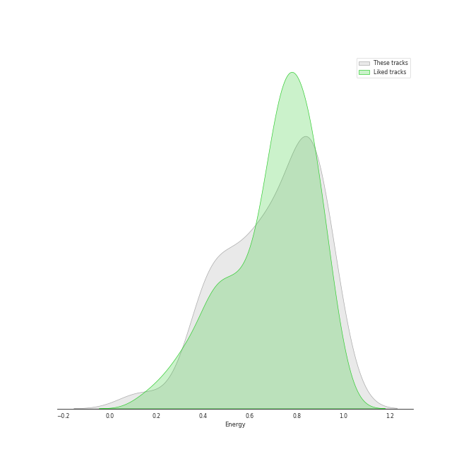
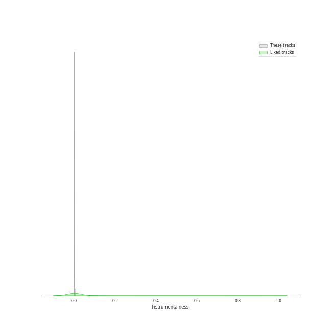
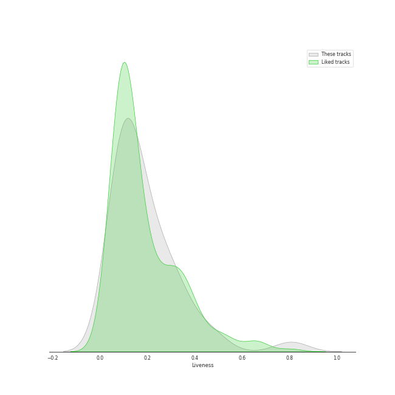
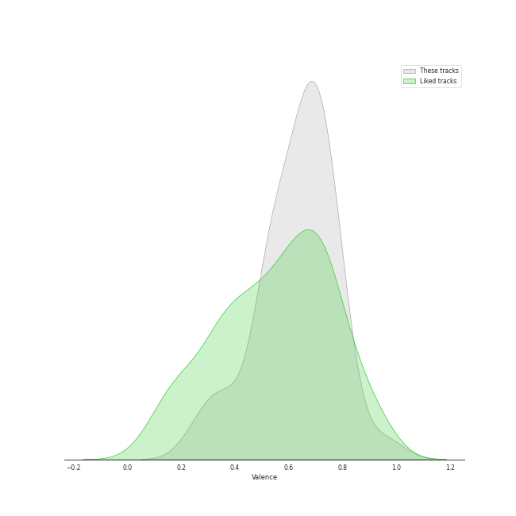

# Track Features for Retro Kpop

## Danceability

| ​ | 10 most Danceable tracks | ​​ | 10 least Danceable tracks |
|:---|:---|:---|:---|
|  | Villain (0.95) |  | L’Amour, Les Baguettes, Paris (0.369) |
|  | Cat (Feat. IU) (0.882) |  | Kiss Later (YeoJin) (0.378) |
|  | Love of B (0.855) |  | twilight (0.402) |
|  | SoulMate (feat. IU) (0.855) |  | Bam Yang Gang (0.455) |
|  | Pierrot laughs at us (0.824) |  | Obliviate (0.486) |
|  | Piano Man (0.783) |  | Modern Times (0.489) |
|  | Zezé (0.771) |  | unlucky (0.528) |
|  | Lion Heart (0.754) |  | BABY BABY (0.534) |
|  | Mr-Ambiguous (0.752) |  | Havana (0.539) |
|  | dlwlrma (0.738) |  | Blues (0.567) |

## Energy

| ​ | 10 most Energetic tracks | ​​ | 10 least Energetic tracks |
|:---|:---|:---|:---|
|  | HOME;RUN (0.942) |  | L’Amour, Les Baguettes, Paris (0.132) |
|  | The Red Shoes (0.922) |  | Cat (Feat. IU) (0.392) |
|  | Carnival (The Last Day) (0.913) |  | Between the lips (50cm) (0.399) |
|  | Nxde (0.91) |  | Villain (0.406) |
|  | YOU&I (0.9) |  | Bam Yang Gang (0.408) |
|  | Day 1 (0.884) |  | Hero (0.434) |
|  | Good day (0.882) |  | Under Caffeine (0.446) |
|  | Carrie (The First Day) (0.861) |  | Love of B (0.481) |
|  | Décalcomanie (0.859) |  | unlucky (0.482) |
|  | Piano Man (0.853) |  | BABY BABY (0.527) |

## Speechiness

| ​ | 10 most Speechy tracks | ​​ | 10 least Speechy tracks |
|:---|:---|:---|:---|
|  | twilight (0.266) |  | Between the lips (50cm) (0.0307) |
|  | Don't U Wait No More (0.235) |  | Obliviate (0.0322) |
|  | Blues (0.226) |  | Lion Heart (0.0322) |
|  | The Red Shoes (0.211) |  | It's not easy for you (0.0328) |
|  | Lucky Girl (0.207) |  | Havana (0.0353) |
|  | Nxde (0.179) |  | Pierrot laughs at us (0.0371) |
|  | Jazz Bar (0.142) |  | Hero (0.0382) |
|  | SoulMate (feat. IU) (0.141) |  | BABY BABY (0.0391) |
|  | Fool (0.109) |  | Carrie (The First Day) (0.0408) |
|  | Zezé (0.108) |  | L’Amour, Les Baguettes, Paris (0.0413) |

## Acousticness

| ​ | 10 most Acoustic tracks | ​​ | 10 least Acoustic tracks |
|:---|:---|:---|:---|
|  | L’Amour, Les Baguettes, Paris (0.954) |  | Lucky Girl (0.0299) |
|  | unlucky (0.836) |  | Nxde (0.0413) |
|  | Bam Yang Gang (0.771) |  | BABY BABY (0.048) |
|  | Pierrot laughs at us (0.752) |  | HOME;RUN (0.0613) |
|  | Havana (0.71) |  | Day 1 (0.112) |
|  | Love of B (0.707) |  | Décalcomanie (0.113) |
|  | Jazz Bar (0.704) |  | Lion Heart (0.129) |
|  | Obliviate (0.674) |  | Good day (0.165) |
|  | Villain (0.664) |  | Kiss Later (YeoJin) (0.177) |
|  | Modern Times (0.631) |  | Behind The Curtain (0.184) |

## Instrumentalness

| ​ | 10 most Instrumental tracks | ​​ | 10 least Instrumental tracks |
|:---|:---|:---|:---|
|  | Under Caffeine (0.00354) |  | Behind The Curtain (0.0) |
|  | Lion Heart (0.00274) |  | Good day (0.0) |
|  | Bam Yang Gang (6.55e-05) |  | twilight (0.0) |
|  | Fool (5.99e-05) |  | Zezé (0.0) |
|  | Nxde (7.81e-06) |  | Hero (0.0) |
|  | Love of B (5.05e-06) |  | unlucky (0.0) |
|  | L’Amour, Les Baguettes, Paris (4.69e-06) |  | SoulMate (feat. IU) (0.0) |
|  | Carnival (The Last Day) (4.38e-06) |  | It's not easy for you (0.0) |
|  | YOU&I (1.47e-06) |  | Lucky Girl (0.0) |
|  | Pierrot laughs at us (0.0) |  | Piano Man (0.0) |

## Liveness

| ​ | 10 most Live tracks | ​​ | 10 least Live tracks |
|:---|:---|:---|:---|
|  | Piano Man (0.807) |  | Pierrot laughs at us (0.0577) |
|  | Nxde (0.479) |  | Fool (0.0673) |
|  | Décalcomanie (0.448) |  | Don't U Wait No More (0.0731) |
|  | twilight (0.343) |  | Kiss Later (YeoJin) (0.0733) |
|  | Jazz Bar (0.335) |  | Lion Heart (0.0775) |
|  | Lucky Girl (0.334) |  | Zezé (0.0873) |
|  | BABY BABY (0.33) |  | The Red Shoes (0.0898) |
|  | Under Caffeine (0.28) |  | Villain (0.0932) |
|  | Behind The Curtain (0.28) |  | Bam Yang Gang (0.0958) |
|  | Mr-Ambiguous (0.233) |  | SoulMate (feat. IU) (0.0965) |

## Valence

| ​ | 10 most Happy tracks | ​​ | 10 least Happy tracks |
|:---|:---|:---|:---|
|  | Lion Heart (0.961) |  | twilight (0.258) |
|  | Piano Man (0.805) |  | BABY BABY (0.314) |
|  | Carrie (The First Day) (0.789) |  | L’Amour, Les Baguettes, Paris (0.367) |
|  | Mr-Ambiguous (0.784) |  | The Red Shoes (0.371) |
|  | Fool (0.774) |  | unlucky (0.505) |
|  | HOME;RUN (0.765) |  | Blues (0.508) |
|  | Don't U Wait No More (0.749) |  | Between the lips (50cm) (0.514) |
|  | Behind The Curtain (0.745) |  | SoulMate (feat. IU) (0.518) |
|  | Bam Yang Gang (0.743) |  | Havana (0.525) |
|  | Jazz Bar (0.725) |  | Décalcomanie (0.541) |

## Tempo

| ​ | 10 most Fast tracks | ​​ | 10 least Fast tracks |
|:---|:---|:---|:---|
|  | Kiss Later (YeoJin) (207.642) |  | twilight (64.893) |
|  | Modern Times (199.923) |  | L’Amour, Les Baguettes, Paris (78.412) |
|  | BABY BABY (179.908) |  | It's not easy for you (80.017) |
|  | Bam Yang Gang (178.047) |  | Behind The Curtain (82.449) |
|  | Fool (177.941) |  | Zezé (93.024) |
|  | Obliviate (173.738) |  | Jazz Bar (93.767) |
|  | Day 1 (171.93) |  | Between the lips (50cm) (95.884) |
|  | unlucky (169.907) |  | HOME;RUN (96.106) |
|  | Lucky Girl (169.758) |  | Under Caffeine (96.991) |
|  | Blues (165.03) |  | SoulMate (feat. IU) (96.998) |
