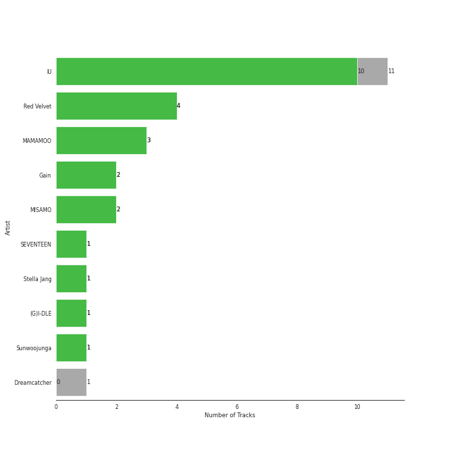
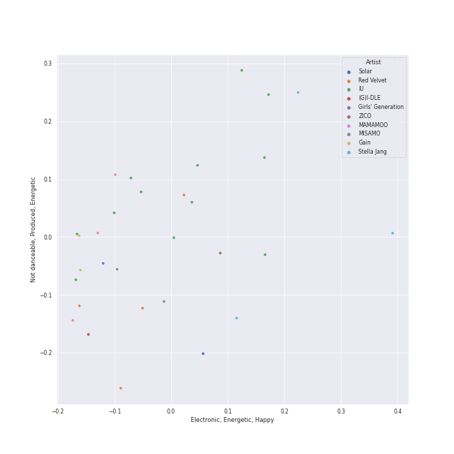
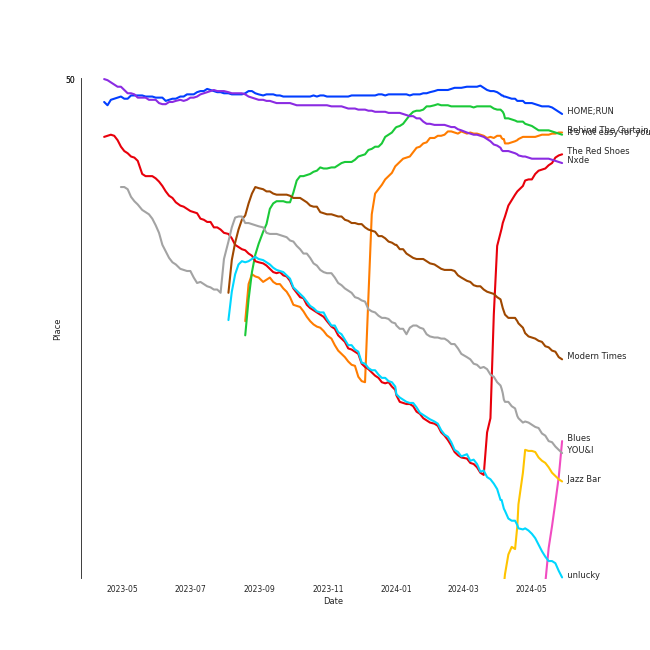
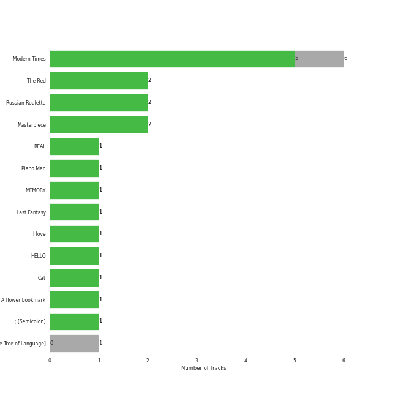
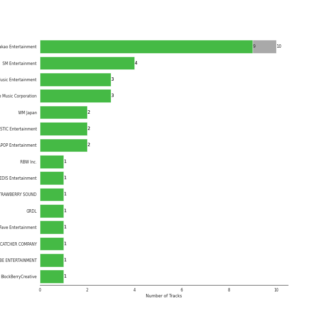
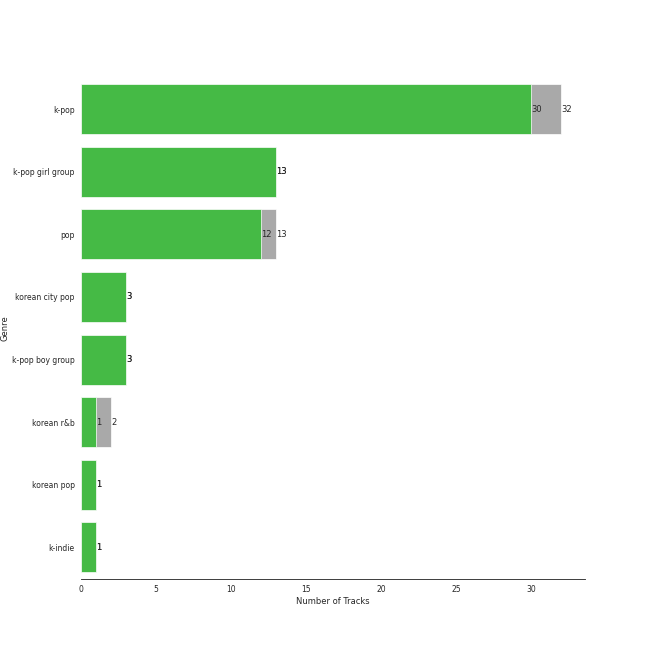
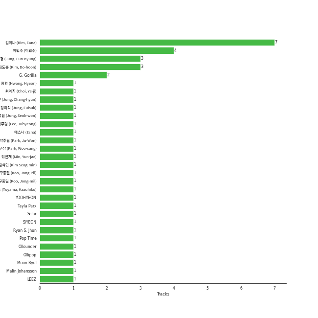
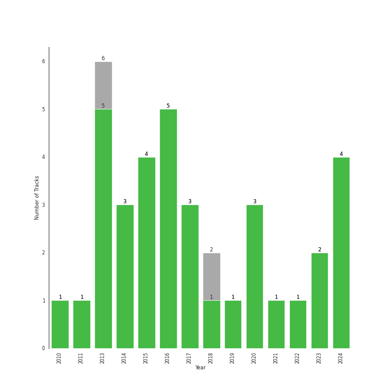

# Retro Kpop

[28 tracks (27 liked) 🔗](https://open.spotify.com/playlist/1MW4AAPq55U0XWvSeu1jU5)

[See Track Features](audio_features.md)

[See Clusters](clusters/overview.md)

## Top Artists

| Art | Tracks | 💚 | Artist | 🔗 |
|:---|---:|---:|:---|:---|
|  | 12 | 11 | [IU](../../artists/iu/overview.md) | [🔗](https://open.spotify.com/artist/3HqSLMAZ3g3d5poNaI7GOU) |
|  | 4 | 4 | [Red Velvet](../../artists/red_velvet/overview.md) | [🔗](https://open.spotify.com/artist/1z4g3DjTBBZKhvAroFlhOM) |
|  | 3 | 3 | [MAMAMOO](../../artists/mamamoo/overview.md) | [🔗](https://open.spotify.com/artist/0XATRDCYuuGhk0oE7C0o5G) |
|  | 2 | 2 | [Gain](../../artists/gain/overview.md) | [🔗](https://open.spotify.com/artist/4R60A85t9mTZzCqJlVswuo) |
|  | 2 | 2 | MISAMO | [🔗](https://open.spotify.com/artist/0IwZVmMMGE7nNXS7vN9SIo) |
|  | 1 | 1 | [SEVENTEEN](../../artists/seventeen/overview.md) | [🔗](https://open.spotify.com/artist/7nqOGRxlXj7N2JYbgNEjYH) |
|  | 1 | 1 | [Dreamcatcher](../../artists/dreamcatcher/overview.md) | [🔗](https://open.spotify.com/artist/5V1qsQHdXNm4ZEZHWvFnqQ) |
|  | 1 | 1 | [LOONA](../../artists/loona/overview.md) | [🔗](https://open.spotify.com/artist/52zMTJCKluDlFwMQWmccY7) |
|  | 1 | 1 | Stella Jang | [🔗](https://open.spotify.com/artist/2Y9AUayH5pyZpVfkDYDfJV) |
|  | 1 | 1 | [(G)I-DLE](../../artists/(g)i-dle/overview.md) | [🔗](https://open.spotify.com/artist/2AfmfGFbe0A0WsTYm0SDTx) |

See all 11 artists

| Art | Tracks | 💚 | Artist | 🔗 |
|:---|---:|---:|:---|:---|
|  | 1 | 1 | Sunwoojunga | [🔗](https://open.spotify.com/artist/04L3elxyr0XFua2Ek3domW) |

## Top Tracks

Most and least listened tracks

| ​ | Most listened tracks | Rank | ​​ | Least listened tracks | Rank |
|:---|:---|---:|:---|:---|---:|
|  | [HOME;RUN](../../artists/seventeen/overview.md) | 70 |  | [Good day](../../artists/iu/overview.md) | nan |
|  | It's not easy for you | 89 |  | [Carnival (The Last Day)](../../artists/gain/overview.md) | nan |
|  | Behind The Curtain | 105 |  | [Fool](../../artists/red_velvet/overview.md) | nan |
|  | [Nxde](../../artists/(g)i-dle/overview.md) | 120 |  | [Obliviate](../../artists/iu/overview.md) | nan |
|  | [The Red Shoes](../../artists/iu/overview.md) | 152 |  | Cat (Feat. IU) | nan |
|  | [Modern Times](../../artists/iu/overview.md) | 274 |  | [dlwlrma](../../artists/iu/overview.md) | nan |
|  | [YOU&I](../../artists/iu/overview.md) | 363 |  | [Between the lips (50cm)](../../artists/iu/overview.md) | nan |
|  | [Jazz Bar](../../artists/dreamcatcher/overview.md) | 441 |  | [Décalcomanie](../../artists/mamamoo/overview.md) | nan |
|  | [unlucky](../../artists/iu/overview.md) | 463 |  | [Carrie (The First Day)](../../artists/gain/overview.md) | nan |
|  | [Lucky Girl](../../artists/red_velvet/overview.md) | 467 |  | [Havana](../../artists/iu/overview.md) | nan |

## Top Albums

| Art | Tracks | 💚 | Album | Release Date | 🔗 |
|:---|---:|---:|:---|:---|:---|
|  | 6 | 5 | Modern Times | 2013-10-08 | [🔗](https://open.spotify.com/album/2QcuXvQBWv1ZKyQtEhLbFe) |
|  | 2 | 2 | The Red - The 1st Album | 2015-09-09 | [🔗](https://open.spotify.com/album/6YL9J0E6PGtYzkhyMxnmXd) |
|  | 2 | 2 | Russian Roulette - The 3rd Mini Album | 2016-09-07 | [🔗](https://open.spotify.com/album/6MNlcai3skKLKv5syzFwC3) |
|  | 2 | 2 | Masterpiece | 2023-07-26 | [🔗](https://open.spotify.com/album/3qmO83vO1SsdmP1Y0ljhSQ) |
|  | 2 | 2 | End Again | 2016-09-09 | [🔗](https://open.spotify.com/album/1Lb5NVfPBTadR5jl6Vpkdq) |
|  | 1 | 1 | YeoJin | 2017-01-16 | [🔗](https://open.spotify.com/album/0AdyZlYZJ852kcSTOhVkyi) |
|  | 1 | 1 | STELLA I | 2020-04-07 | [🔗](https://open.spotify.com/album/1TCX395u7CaSsCLtiwsMAN) |
|  | 1 | 1 | REAL | 2010-12-09 | [🔗](https://open.spotify.com/album/4WY1pPvmP9sBlVICuPxBQh) |
|  | 1 | 1 | Piano Man | 2014-11-21 | [🔗](https://open.spotify.com/album/1kdURRaOTpDCQqsVIU5CiT) |
|  | 1 | 1 | Palette | 2017-04-21 | [🔗](https://open.spotify.com/album/5V8n6fqyAPxvFTibPhQVcp) |

See all 19 albums

| Art | Tracks | 💚 | Album | Release Date | 🔗 |
|:---|---:|---:|:---|:---|:---|
|  | 1 | 1 | MEMORY | 2016-11-07 | [🔗](https://open.spotify.com/album/3Q34hV5fBbMpRpADmlptr7) |
|  | 1 | 1 | Love poem | 2019-11-18 | [🔗](https://open.spotify.com/album/2xEH7SRzJq7LgA0fCtTlxH) |
|  | 1 | 1 | Last Fantasy | 2011-11-29 | [🔗](https://open.spotify.com/album/149BHv6qAyMgJ483vPi77C) |
|  | 1 | 1 | I love | 2022-10-17 | [🔗](https://open.spotify.com/album/2Hyuin3i1cSZ1FlQFeCPZH) |
|  | 1 | 1 | HELLO | 2014-06-18 | [🔗](https://open.spotify.com/album/3Z9cZon6ukg4rvGYu7i4NA) |
|  | 1 | 1 | Cat | 2017-12-28 | [🔗](https://open.spotify.com/album/3b8iQhtbLD0Vn4EqQzMC3N) |
|  | 1 | 1 | A flower bookmark | 2014-05-16 | [🔗](https://open.spotify.com/album/460uGpon2JwPfRgDohV2bP) |
|  | 1 | 1 | ; [Semicolon] | 2020-10-19 | [🔗](https://open.spotify.com/album/1EMYSiKKTSKLZrOC2nTStL) |
|  | 1 | 1 | 1st Album [Dystopia : The Tree of Language] | 2020-02-18 | [🔗](https://open.spotify.com/album/6m5pDOafdvIKxNRxx5hVbr) |

## Top Record Labels

| Tracks | 💚 | Label |
|---:|---:|:---|
| 10 | 9 | [Kakao Entertainment](../../labels/kakao_entertainment/overview.md) |
| 4 | 4 | [SM Entertainment](../../labels/sm_entertainment/overview.md) |
| 3 | 3 | [Stone Music Entertainment](../../labels/stone_music_entertainment/overview.md) |
| 3 | 3 | [Genie Music Corporation](../../labels/genie_music_corporation/overview.md) |
| 2 | 2 | [WM Japan](../../labels/wm_japan/overview.md) |
| 2 | 2 | MYSTIC Entertainment |
| 2 | 2 | APOP Entertainment |
| 1 | 1 | [PLEDIS Entertainment](../../labels/pledis_entertainment/overview.md) |
| 1 | 1 | MAGIC STRAWBERRY SOUND |
| 1 | 1 | GRDL |

See all 14 labels

| Tracks | 💚 | Label |
|---:|---:|:---|
| 1 | 1 | Fave Entertainment |
| 1 | 1 | [DREAMCATCHER COMPANY](../../labels/dreamcatcher_company/overview.md) |
| 1 | 1 | [CUBE ENTERTAINMENT](../../labels/cube_entertainment/overview.md) |
| 1 | 1 | BlockBerryCreative |

## Genres

| Tracks | 💚 | Genre |
|---:|---:|:---|
| 23 | 22 | [k-pop](../../genres/k-pop/overview.md) |
| 12 | 12 | [k-pop girl group](../../genres/k-pop_girl_group/overview.md) |
| 11 | 10 | [pop](../../genres/pop/overview.md) |
| 1 | 1 | [korean pop](../../genres/korean_pop/overview.md) |
| 1 | 1 | korean city pop |
| 1 | 1 | [k-pop boy group](../../genres/k-pop_boy_group/overview.md) |
| 1 | 1 | k-indie |

## Top Producers

| Art | Producer | Tracks | Credit Types |
|:---|:---|---:|:---|
| | [김이나 (Kim, Eana)](../../producers/김이나_(kim,_eana)/overview.md) | 7 | Lyricist |
| | [이민수 (이민수)](../../producers/이민수_(이민수)/overview.md) | 4 | Arranger, Songwriter |
| | [김도훈 (Kim, Do-hoon)](../../producers/김도훈_(kim,_do-hoon)/overview.md) | 3 | Arranger, Lyricist, Songwriter |
| | [정은경 (Jung, Eun-Kyung)](../../producers/정은경_(jung,_eun-kyung)/overview.md) | 3 | Producer |
| | G. Gorilla | 2 | Arranger, Lyricist, Songwriter |
| | 최예지 (Choi, Ye-ji) | 1 | Producer |
| | DAMI | 1 | Lyricist |
| | [구종필 (Koo, Jong-Pil)](../../producers/구종필_(koo,_jong-pil)/overview.md) | 1 | Producer |
| | Dem Jointz | 1 | Arranger, Songwriter |
|  | [IU](../../artists/iu/overview.md) | 1 | Lyricist |

View all

| Art | Producer | Tracks | Credit Types |
|:---|:---|---:|:---|
| | [LEEZ](../../producers/leez/overview.md) | 1 | Arranger, Lyricist, Producer, Songwriter |
| | YOOHYEON | 1 | Lyricist |
|  | [JEON SOYEON](../../artists/jeon_soyeon/overview.md) | 1 | Arranger, Lyricist, Songwriter |
| | SIYEON | 1 | Lyricist |
| | 정의석 (Jung, Euisuk) | 1 | Producer |
|  | [HWASA](../../artists/hwasa/overview.md) | 1 | Lyricist |
| | JI U | 1 | Lyricist |
| | Kako | 1 | Arranger, Songwriter |
| | [Pop Time](../../producers/pop_time/overview.md) | 1 | Arranger, Songwriter |
| | 이주형 (Lee, Juhyeong) | 1 | Arranger, Producer |
| | 정창현 (Jung, Chang-hyun) | 1 | Producer |
| | Tayla Parx | 1 | Songwriter |
| | 김석민 (Kim Seog-min) | 1 | Producer |
|  | Moon Byul | 1 | Lyricist |
| | [Ollounder](../../producers/ollounder/overview.md) | 1 | Arranger, Lyricist, Songwriter |
| | 에스나 (Esna) | 1 | Songwriter |
| | Josef Melin | 1 | Arranger, Songwriter |
| | Ollipop | 1 | Arranger, Songwriter |
| | 100%서정 (100%Seojung) | 1 | Lyricist |
| | 박주원 (Park, Ju-Won) | 1 | Arranger, Songwriter |
| | [Kenzie](../../producers/kenzie/overview.md) | 1 | Arranger, Lyricist |
| | Malin Johansson | 1 | Arranger, Songwriter |
| | 민연재 (Min, Yun-jae) | 1 | Lyricist |
| | 外山和彦 (Toyama, Kazuhiko) | 1 | Arranger |
| | 구종밀 (Koo, Jong-mil) | 1 | Producer |
| | 황현 (Hwang, Hyeon) | 1 | Arranger, Lyricist, Producer, Songwriter |
| | 박우상 (Park, Woo-sang) | 1 | Arranger |
| | [Ryan S. Jhun](../../producers/ryan_s__jhun/overview.md) | 1 | Songwriter |
| | 1월 8일 (1월 8일) | 1 | Lyricist |
|  | Solar | 1 | Lyricist |
| | 정석원 (Jung, Seok-won) | 1 | Arranger, Songwriter |
| | Hayley Aitken | 1 | Arranger, Songwriter |

## Years

| ​ | 10 newest albums | ​​ | 10 oldest albums |
|:---|:---|:---|:---|
|  | Masterpiece (2023-07-26) |  | REAL (2010-12-09) |
|  | I love (2022-10-17) |  | Last Fantasy (2011-11-29) |
|  | ; [Semicolon] (2020-10-19) |  | Modern Times (2013-10-08) |
|  | STELLA I (2020-04-07) |  | A flower bookmark (2014-05-16) |
|  | 1st Album [Dystopia : The Tree of Language] (2020-02-18) |  | HELLO (2014-06-18) |
|  | Love poem (2019-11-18) |  | Piano Man (2014-11-21) |
|  | Cat (2017-12-28) |  | The Red - The 1st Album (2015-09-09) |
|  | Palette (2017-04-21) |  | Russian Roulette - The 3rd Mini Album (2016-09-07) |
|  | YeoJin (2017-01-16) |  | End Again (2016-09-09) |
|  | MEMORY (2016-11-07) |  | MEMORY (2016-11-07) |