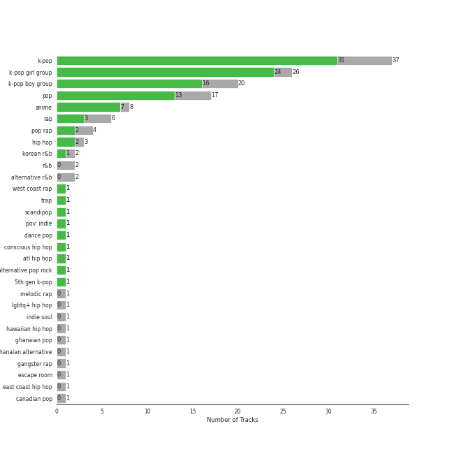

# Sharon RPD

[45 songs](tracks.md)

## Top Artists

See all 34 artists

| Number of Tracks | Art | Artist | 🔗 |
|---:|:---|:---|:---|
| 6 |  | [BLACKPINK](../../artists/blackpink.md) | [🔗](https://open.spotify.com/artist/41MozSoPIsD1dJM0CLPjZF) |
| 5 |  | [BTS](../../artists/bts.md) | [🔗](https://open.spotify.com/artist/3Nrfpe0tUJi4K4DXYWgMUX) |
| 4 |  | NewJeans | [🔗](https://open.spotify.com/artist/6HvZYsbFfjnjFrWF950C9d) |
| 2 |  | [aespa](../../artists/aespa.md) | [🔗](https://open.spotify.com/artist/6YVMFz59CuY7ngCxTxjpxE) |
| 2 |  | IVE | [🔗](https://open.spotify.com/artist/6RHTUrRF63xao58xh9FXYJ) |
| 2 |  | [ENHYPEN](../../artists/enhypen.md) | [🔗](https://open.spotify.com/artist/5t5FqBwTcgKTaWmfEbwQY9) |
| 2 |  | LE SSERAFIM | [🔗](https://open.spotify.com/artist/4SpbR6yFEvexJuaBpgAU5p) |
| 2 |  | [Red Velvet](../../artists/red_velvet.md) | [🔗](https://open.spotify.com/artist/1z4g3DjTBBZKhvAroFlhOM) |
| 2 |  | [STAYC](../../artists/stayc.md) | [🔗](https://open.spotify.com/artist/01XYiBYaoMJcNhPokrg0l0) |
| 1 |  | JEON SOMI | [🔗](https://open.spotify.com/artist/7zYj9S9SdIunYCfSm7vzAR) |
| 1 |  | [SEVENTEEN](../../artists/seventeen.md) | [🔗](https://open.spotify.com/artist/7nqOGRxlXj7N2JYbgNEjYH) |
| 1 |  | [TWICE](../../artists/twice.md) | [🔗](https://open.spotify.com/artist/7n2Ycct7Beij7Dj7meI4X0) |
| 1 |  | [NCT 127](../../artists/nct_127.md) | [🔗](https://open.spotify.com/artist/7f4ignuCJhLXfZ9giKT7rH) |
| 1 |  | Chris Brown | [🔗](https://open.spotify.com/artist/7bXgB6jMjp9ATFy66eO08Z) |
| 1 |  | Steve Aoki | [🔗](https://open.spotify.com/artist/77AiFEVeAVj2ORpC85QVJs) |
| 1 |  | Weeekly | [🔗](https://open.spotify.com/artist/73B9bjqS2Z5KLXNGqXf64m) |
| 1 |  | TAEYANG | [🔗](https://open.spotify.com/artist/6udveWUgX4vu75FF0DTrXV) |
| 1 |  | GOT the beat | [🔗](https://open.spotify.com/artist/6uNxlIP5lzPFf0BHuELOuX) |
| 1 |  | LISA | [🔗](https://open.spotify.com/artist/5L1lO4eRHmJ7a0Q6csE5cT) |
| 1 |  | Young Thug | [🔗](https://open.spotify.com/artist/50co4Is1HCEo8bhOyUWKpn) |
| 1 |  | MONSTA X | [🔗](https://open.spotify.com/artist/4TnGh5PKbSjpYqpIdlW5nz) |
| 1 |  | NCT | [🔗](https://open.spotify.com/artist/48eO052eSDcn8aTxiv6QaG) |
| 1 |  | NCT U | [🔗](https://open.spotify.com/artist/3paGCCtX1Xr4Gx53mSeZuQ) |
| 1 |  | P1Harmony | [🔗](https://open.spotify.com/artist/3JjvsPeGMbDJqsphe2z8xU) |
| 1 |  | BTOB | [🔗](https://open.spotify.com/artist/2hcsKca6hCfFMwwdbFvenJ) |
| 1 |  | [Stray Kids](../../artists/stray_kids.md) | [🔗](https://open.spotify.com/artist/2dIgFjalVxs4ThymZ67YCE) |
| 1 |  | SEULGI | [🔗](https://open.spotify.com/artist/2QM5S4yO6xHgnNvF0nbZZq) |
| 1 |  | [CHUNG HA](../../artists/chung_ha.md) | [🔗](https://open.spotify.com/artist/2PSJ6YriU7JsFucxACpU7Y) |
| 1 |  | [ITZY](../../artists/itzy.md) | [🔗](https://open.spotify.com/artist/2KC9Qb60EaY0kW4eH68vr3) |
| 1 |  | Halsey | [🔗](https://open.spotify.com/artist/26VFTg2z8YR0cCuwLzESi2) |
| 1 |  | Jimin | [🔗](https://open.spotify.com/artist/1oSPZhvZMIrWW5I41kPkkY) |
| 1 |  | Jackson Wang | [🔗](https://open.spotify.com/artist/1kfWoWgCugPkyxQP8lkRlY) |
| 1 |  | LACHICA | [🔗](https://open.spotify.com/artist/0vqjEQRfmE1Sov92UQRJMp) |
| 1 |  | Selena Gomez | [🔗](https://open.spotify.com/artist/0C8ZW7ezQVs4URX5aX7Kqx) |

## Top Albums

See all 42 albums

| Number of Tracks | Art | Album | Release Date | 🔗 |
|---:|:---|:---|:---|:---|
| 2 |  | THE ALBUM | 2020-10-02 | [🔗](https://open.spotify.com/album/71O60S5gIJSIAhdnrDIh3N) |
| 2 |  | NewJeans 1st EP 'New Jeans' | 2022-08-01 | [🔗](https://open.spotify.com/album/1HMLpmZAnNyl9pxvOnTovV) |
| 2 |  | BORN PINK | 2022-09-16 | [🔗](https://open.spotify.com/album/7jaSNQUBJbvfbZHLNFrV7P) |
| 1 |  | ‘The ReVe Festival’ Finale | 2019-12-23 | [🔗](https://open.spotify.com/album/3rVtm00UfbuzWOewdm4iYM) |
| 1 |  | YOUNG-LUV.COM | 2022-02-21 | [🔗](https://open.spotify.com/album/2xPdgNkM4yIQmP7axJ1T1o) |
| 1 |  | VIBE (feat. Jimin of BTS) | 2023-01-13 | [🔗](https://open.spotify.com/album/3qUOk1Se3Oopu5pUlHTjVJ) |
| 1 |  | The Most Beautiful Moment in Life: Young Forever | 2016-05-02 | [🔗](https://open.spotify.com/album/1k5bJ8l5oL5xxVBVHjil09) |
| 1 |  | Taste of Love | 2021-06-11 | [🔗](https://open.spotify.com/album/00vb6sViDbJLmLLchfbRh4) |
| 1 |  | Street Woman Fighter(SWF) Special | 2021-10-27 | [🔗](https://open.spotify.com/album/3iW6rZmhiSLNveTOrX26z6) |
| 1 |  | Step Back | 2022-01-03 | [🔗](https://open.spotify.com/album/3gwL04bGAX4Kc2D5Wd7NMk) |
| 1 |  | Slime & B | 2020-05-08 | [🔗](https://open.spotify.com/album/7fZKtzZAsfH0kzeTivu5TG) |
| 1 |  | STAYDOM | 2021-04-08 | [🔗](https://open.spotify.com/album/71hjsg660uio3Z8bnbB6fS) |
| 1 |  | SQUARE TWO | 2016-11-01 | [🔗](https://open.spotify.com/album/2Fna4Tb7fme5aHsNMJtVtp) |
| 1 |  | SQUARE ONE | 2016-08-08 | [🔗](https://open.spotify.com/album/0FOOodYRlj7gzh7q7IjmNZ) |
| 1 |  | SEVENTEEN 4th Album 'Face the Sun' | 2022-05-27 | [🔗](https://open.spotify.com/album/4lfFgz2rD1irxf7dZhNJht) |
| 1 |  | Queendom - The 6th Mini Album | 2021-08-16 | [🔗](https://open.spotify.com/album/6Pe5LGQgU3mmvuRjFMsACV) |
| 1 |  | Proof | 2022-06-10 | [🔗](https://open.spotify.com/album/6al2VdKbb6FIz9d7lU7WRB) |
| 1 |  | Play Game : Holiday | 2021-08-04 | [🔗](https://open.spotify.com/album/1FDlvA1PdZujiEhbXihIPJ) |
| 1 |  | One of a Kind | 2021-06-01 | [🔗](https://open.spotify.com/album/2Zuovdo5g1RhfbHniwZ8yI) |
| 1 |  | NewJeans 'OMG' | 2023-01-02 | [🔗](https://open.spotify.com/album/45ozep8uHHnj5CCittuyXj) |
| 1 |  | NOEASY | 2021-08-23 | [🔗](https://open.spotify.com/album/558tpdCejjVQNFAumRAeQj) |
| 1 |  | NCT 2018 EMPATHY | 2018-03-14 | [🔗](https://open.spotify.com/album/3KAJvo62RNQEtXwIyB5rzX) |
| 1 |  | MAP OF THE SOUL : PERSONA | 2019-04-12 | [🔗](https://open.spotify.com/album/2KqlAl1Kl5fZvbFgJ0qFB6) |
| 1 |  | MAGIC MAN | 2022-09-09 | [🔗](https://open.spotify.com/album/2VZ4og2ZbwyTQ3X1rbgCe1) |
| 1 |  | Love Yourself 結 'Answer' | 2018-08-24 | [🔗](https://open.spotify.com/album/43wFM1HquliY3iwKWzPN4y) |
| 1 |  | LOVE DIVE | 2022-04-05 | [🔗](https://open.spotify.com/album/1AFVTHHm7kKoQ6Rgb25x3p) |
| 1 |  | LALISA | 2021-09-10 | [🔗](https://open.spotify.com/album/66OYt73mqan1hWa78BhfPd) |
| 1 |  | HARMONY : ZERO IN | 2022-07-20 | [🔗](https://open.spotify.com/album/73CTPjApMDvFsycjbbROji) |
| 1 |  | Girls - The 2nd Mini Album | 2022-07-08 | [🔗](https://open.spotify.com/album/4w1dbvUy1crv0knXQvcSeY) |
| 1 |  | FEARLESS | 2022-05-02 | [🔗](https://open.spotify.com/album/4Mc7WwYH41hgUWeKX25Sot) |
| 1 |  | ELEVEN | 2021-12-01 | [🔗](https://open.spotify.com/album/1XMYvsHRt52sMi6wittWqI) |
| 1 |  | Ditto | 2022-12-19 | [🔗](https://open.spotify.com/album/7bnqo1fdJU9nSfXQd3bSMe) |
| 1 |  | DUMB DUMB | 2021-08-02 | [🔗](https://open.spotify.com/album/24sFioeGsPtxa5fD6VzL8b) |
| 1 |  | DIMENSION : DILEMMA | 2021-10-12 | [🔗](https://open.spotify.com/album/5jGRqioNCSWZGBl3QmyuFI) |
| 1 |  | CRAZY IN LOVE | 2021-09-24 | [🔗](https://open.spotify.com/album/4U7rGOkJgtxs27H9L93Xli) |
| 1 |  | Brother Act. | 2017-10-16 | [🔗](https://open.spotify.com/album/3oXEVu3gwToJRkE2xAW44a) |
| 1 |  | Black Mamba | 2020-11-17 | [🔗](https://open.spotify.com/album/3syEYrKIsgxaZMB5t1dVG7) |
| 1 |  | BORDER : CARNIVAL | 2021-04-26 | [🔗](https://open.spotify.com/album/4LGYBcRsteiXjcPD4QQvxv) |
| 1 |  | BE | 2020-11-20 | [🔗](https://open.spotify.com/album/6nYfHQnvkvOTNHnOhDT3sr) |
| 1 |  | Ay-Yo - The 4th Album Repackage | 2023-01-30 | [🔗](https://open.spotify.com/album/3VjW3uIc8WG4tXF2wKW9BJ) |
| 1 |  | ANTIFRAGILE | 2022-10-17 | [🔗](https://open.spotify.com/album/3u0ggfmK0vjuHMNdUbtaa9) |
| 1 |  | 28 Reasons - The 1st Mini Album | 2022-10-04 | [🔗](https://open.spotify.com/album/1t5a29WYbJj83iy3RNICHw) |

## Top Record Labels

See all 23 labels

| Number of Tracks | Label |
|---:|:---|
| 7 | [YG Entertainment](../../labels/yg_entertainment.md) |
| 7 | [SM Entertainment](../../labels/sm_entertainment.md) |
| 7 | [Interscope Records](../../labels/interscope_records.md) |
| 5 | [BIGHIT MUSIC](../../labels/bighit_music.md) |
| 4 | ADOR |
| 3 | [Starship Entertainment](../../labels/starship_entertainment.md) |
| 3 | [Republic Records](../../labels/republic_records.md) |
| 2 | [Warner Records](../../labels/warner_records.md) |
| 2 | [SOURCE MUSIC](../../labels/source_music.md) |
| 2 | [High Up Entertainment](../../labels/high_up_entertainment.md) |
| 2 | [BELIFT LAB](../../labels/belift_lab.md) |
| 1 | THEBLACKLABEL |
| 1 | THE BLACK LABEL |
| 1 | TEAM WANG records |
| 1 | [RCA Records Label](../../labels/rca_records_label.md) |
| 1 | [PLEDIS Entertainment](../../labels/pledis_entertainment.md) |
| 1 | PLAY M ENTERTAINMENT CORP. |
| 1 | [Genie Music Corporation](../../labels/genie_music_corporation.md) |
| 1 | [FNC ENTERTAINMENT](../../labels/fnc_entertainment.md) |
| 1 | Chris Brown Entertainment |
| 1 | [CUBE ENTERTAINMENT](../../labels/cube_entertainment.md) |
| 1 | 88rising Music |
| 1 | 300 Entertainment |

## Genres

See all 8 genres

| Number of Tracks | Genre |
|---:|:---|
| 32 | [k-pop](../../genres/k_pop.md) |
| 20 | [k-pop girl group](../../genres/k_pop_girl_group.md) |
| 14 | [k-pop boy group](../../genres/k_pop_boy_group.md) |
| 2 | anime |
| 1 | [r&b](../../genres/r_b.md) |
| 1 | [pop](../../genres/pop.md) |
| 1 | korean r&b |
| 1 | [dance pop](../../genres/dance_pop.md) |

## Years

| 10 newest albums | 10 oldest albums |
|:---|:---|
| 
 Ay-Yo - The 4th Album Repackage (2023-01-30)
 | 
 The Most Beautiful Moment in Life: Young Forever (2016-05-02)
 |
| 
 VIBE (feat. Jimin of BTS) (2023-01-13)
 | 
 SQUARE ONE (2016-08-08)
 |
| 
 NewJeans 'OMG' (2023-01-02)
 | 
 SQUARE TWO (2016-11-01)
 |
| 
 Ditto (2022-12-19)
 | 
 Brother Act. (2017-10-16)
 |
| 
 ANTIFRAGILE (2022-10-17)
 | 
 NCT 2018 EMPATHY (2018-03-14)
 |
| 
 28 Reasons - The 1st Mini Album (2022-10-04)
 | 
 Love Yourself 結 'Answer' (2018-08-24)
 |
| 
 BORN PINK (2022-09-16)
 | 
 MAP OF THE SOUL : PERSONA (2019-04-12)
 |
| 
 MAGIC MAN (2022-09-09)
 | 
 ‘The ReVe Festival’ Finale (2019-12-23)
 |
| 
 NewJeans 1st EP 'New Jeans' (2022-08-01)
 | 
 Slime & B (2020-05-08)
 |
| 
 HARMONY : ZERO IN (2022-07-20)
 | 
 THE ALBUM (2020-10-02)
 |
## Audio Features

| 10 most Danceable tracks | 10 least Danceable tracks |
|:---|:---|
| ANTIFRAGILE (0.882) | Black Mamba (0.52) |
| FEARLESS (0.863) | Blow (0.535) |
| DUMB DUMB (0.851) | Dope (0.579) |
| ELEVEN (0.828) | Hype Boy (0.593) |
| Holiday Party (0.825) | FEVER (0.6) |
| Shut Down (0.82) | Thunderous (0.601) |
| WHISTLE (0.818) | MIC Drop (Steve Aoki Remix) - Full Length Edition (0.606) |
| Ditto (0.814) | Missing You (0.633) |
| Attention (0.811) | Step Back (0.636) |
| LALISA (0.806) | Boy With Luv (feat. Halsey) (0.645) |

| 10 most Energetic tracks | 10 least Energetic tracks |
|:---|:---|
| Hype Boy (0.935) | BOSS (0.543) |
| Black Mamba (0.915) | Pretty Savage (0.556) |
| Alcohol-Free (0.909) | City Girls (0.586) |
| Queendom (0.896) | Blow (0.586) |
| Dope (0.896) | FEARLESS (0.62) |
| LOCO (0.886) | Ditto (0.641) |
| Boy With Luv (feat. Halsey) (0.862) | Attention (0.648) |
| GAMBLER (0.861) | 28 Reasons (0.651) |
| MIC Drop (Steve Aoki Remix) - Full Length Edition (0.85) | LALISA (0.653) |
| Ay-Yo (0.845) | Psycho (0.666) |

| 10 most Speechy tracks | 10 least Speechy tracks |
|:---|:---|
| Ice Cream (with Selena Gomez) (0.365) | ASAP (0.0351) |
| Thunderous (0.234) | Attention (0.0368) |
| Dope (0.225) | BOSS (0.037) |
| Hype Boy (0.225) | Shut Down (0.038) |
| LOCO (0.187) | HOT (0.0399) |
| MIC Drop (Steve Aoki Remix) - Full Length Edition (0.183) | Pretty Savage (0.0414) |
| Run BTS (0.168) | LOVE DIVE (0.0433) |
| GAMBLER (0.152) | OMG (0.0433) |
| Pink Venom (0.145) | Psycho (0.0446) |
| FEARLESS (0.135) | Illusion (0.0468) |

| 10 most Acoustic tracks | 10 least Acoustic tracks |
|:---|:---|
| Missing You (0.65) | RUN2U (0.000835) |
| OMG (0.357) | Doom Du Doom (0.00356) |
| Hype Boy (0.268) | LOVE DIVE (0.00379) |
| Attention (0.236) | Shut Down (0.00412) |
| Thunderous (0.213) | Blow (0.00437) |
| 28 Reasons (0.211) | GAMBLER (0.00458) |
| Psycho (0.193) | WHISTLE (0.00561) |
| Queendom (0.179) | Ay-Yo (0.00629) |
| ASAP (0.102) | Holiday Party (0.00846) |
| Boy With Luv (feat. Halsey) (0.0933) | Pretty Savage (0.00886) |

| 10 most Instrumental tracks | 10 least Instrumental tracks |
|:---|:---|
| FEARLESS (0.00324) | Shut Down (0.0) |
| Black Mamba (0.000946) | BOSS (0.0) |
| LALISA (0.000784) | FEVER (0.0) |
| DUMB DUMB (0.000149) | Hype Boy (0.0) |
| Pretty Savage (0.000122) | Thunderous (0.0) |
| Ice Cream (with Selena Gomez) (8.06e-05) | City Girls (0.0) |
| LOVE DIVE (5.43e-05) | Ay-Yo (0.0) |
| Doom Du Doom (4.82e-05) | Attention (0.0) |
| LOCO (2.04e-05) | Missing You (0.0) |
| Illusion (1.75e-05) | Psycho (0.0) |

| 10 most Live tracks | 10 least Live tracks |
|:---|:---|
| Step Back (0.596) | Holiday Party (0.0294) |
| Dope (0.352) | Ice Cream (with Selena Gomez) (0.0311) |
| LOCO (0.342) | Run BTS (0.0358) |
| HOT (0.338) | ELEVEN (0.048) |
| LOVE DIVE (0.333) | City Girls (0.0554) |
| Illusion (0.322) | Queendom (0.0626) |
| RUN2U (0.321) | Alcohol-Free (0.0674) |
| Ay-Yo (0.317) | Blow (0.0745) |
| Hype Boy (0.286) | Attention (0.0761) |
| Go Big or Go Home (0.269) | Doom Du Doom (0.0811) |

| 10 most Happy tracks | 10 least Happy tracks |
|:---|:---|
| Ice Cream (with Selena Gomez) (0.91) | Ditto (0.183) |
| LALISA (0.85) | ASAP (0.323) |
| Doom Du Doom (0.846) | BOSS (0.332) |
| BAD GIRL (Prod. Czaer) (0.829) | Pretty Savage (0.333) |
| ANTIFRAGILE (0.824) | RUN2U (0.362) |
| Go Big or Go Home (0.823) | Psycho (0.405) |
| Blow (0.823) | Ay-Yo (0.413) |
| City Girls (0.815) | Holiday Party (0.417) |
| Boy With Luv (feat. Halsey) (0.803) | DUMB DUMB (0.424) |
| Thunderous (0.79) | FEARLESS (0.432) |
