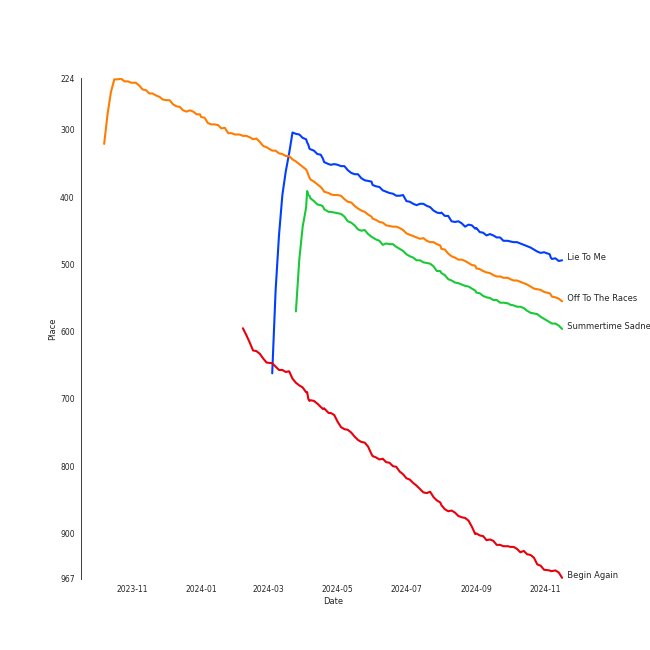

# Tracks in Singer-Songwriter from 2012

## Artists

| Art | Tracks | 💚 | Artist | 🔗 |
|:---|---:|---:|:---|:---|
|  | 7 | 7 | [Lana Del Rey](../../../artists/lana_del_rey/overview.md) | [🔗](https://open.spotify.com/artist/00FQb4jTyendYWaN8pK0wa) |
|  | 5 | 4 | [Sara Bareilles](../../../artists/sara_bareilles/overview.md) | [🔗](https://open.spotify.com/artist/2Sqr0DXoaYABbjBo9HaMkM) |
|  | 6 | 3 | [Taylor Swift](../../../artists/taylor_swift/overview.md) | [🔗](https://open.spotify.com/artist/06HL4z0CvFAxyc27GXpf02) |
|  | 4 | 3 | Elizaveta | [🔗](https://open.spotify.com/artist/2a9bCkqCkLvXM0s3uPvR7M) |
|  | 1 | 0 | A Fine Frenzy | [🔗](https://open.spotify.com/artist/5dTYaRzOn4rXGBLH052EeQ) |
|  | 1 | 0 | Brandi Carlile | [🔗](https://open.spotify.com/artist/2sG4zTOLvjKG1PSoOyf5Ej) |
|  | 1 | 0 | Carrie Manolakos | [🔗](https://open.spotify.com/artist/15ptZqEJWDBnhVx6fqaCWV) |

## Albums

| Art | Tracks | 💚 | Album | Release Date | 🔗 |
|:---|---:|---:|:---|:---|:---|
|  | 6 | 6 | Born To Die | 2012-01-30 | [🔗](https://open.spotify.com/album/4X8hAqIWpQyQks2yRhyqs4) |
|  | 6 | 3 | Red | 2012-10-22 | [🔗](https://open.spotify.com/album/1EoDsNmgTLtmwe1BDAVxV5) |
|  | 5 | 4 | Once Upon Another Time | 2012-05-22 | [🔗](https://open.spotify.com/album/1PrqYZJRzGNf8AsSOraxnZ) |
|  | 4 | 3 | Beatrix Runs | 2012 | [🔗](https://open.spotify.com/album/7HsPaYQbCYnxosF5WiSlEA) |
|  | 1 | 1 | Paradise | 2012-11-09 | [🔗](https://open.spotify.com/album/1JnjcAIKQ9TSJFVFierTB8) |
|  | 1 | 0 | PINES | 2012-01-01 | [🔗](https://open.spotify.com/album/1876e9QcHkJ3Hgo4NqKXBN) |
|  | 1 | 0 | Creep Live At (Le)Poisson Rouge | 2012-09-09 | [🔗](https://open.spotify.com/album/3tzHjGnv1WpG78SzgRKFIi) |
|  | 1 | 0 | Bear Creek | 2012-06-04 | [🔗](https://open.spotify.com/album/5b8YTIrc88vdnfRguZqvVE) |

## Tracks

| Art | Track | Album | Artists | Label | Rank | 💚 | 🔗 |
|:---|:---|:---|:---|:---|---:|:---|:---|
|  | Lie To Me | Once Upon Another Time | [Sara Bareilles](../../../artists/sara_bareilles/overview.md) | [Epic](../../../labels/epic) | 318 | 💚 | [🔗](https://open.spotify.com/track/15zarGPJkaG3btC3Co7Luo) |
|  | Off To The Races | Born To Die | [Lana Del Rey](../../../artists/lana_del_rey/overview.md) | [Polydor Records](../../../labels/polydor_records) | 360 | 💚 | [🔗](https://open.spotify.com/track/7grzMnF1FHponm2aJBWj8E) |
|  | Summertime Sadness | Born To Die | [Lana Del Rey](../../../artists/lana_del_rey/overview.md) | [Polydor Records](../../../labels/polydor_records) | 418 | 💚 | [🔗](https://open.spotify.com/track/4cKtn8Shw999egpwBmWQmp) |
|  | Begin Again | Red | [Taylor Swift](../../../artists/taylor_swift/overview.md) | [Big Machine Records, LLC](../../../labels/big_machine_records) | 694 | 💚 | [🔗](https://open.spotify.com/track/0L4YCNRfXAoTvdpWeH2RGj) |
|  | Dreamer | Beatrix Runs | Elizaveta | [Universal Records](../../../labels/universal_music_llc) | nan | 💚 | [🔗](https://open.spotify.com/track/6Rod4YnyLthZqnvInGlPKI) |
|  | Meant | Beatrix Runs | Elizaveta | [Universal Records](../../../labels/universal_music_llc) | nan | 💚 | [🔗](https://open.spotify.com/track/0HEA0fIQiqOCQBcHd8PdXo) |
|  | Nightflyers | Beatrix Runs | Elizaveta | [Universal Records](../../../labels/universal_music_llc) | nan | | [🔗](https://open.spotify.com/track/2IJIZnAmBgkbohDRZDIMl5) |
|  | Odi Et Amo | Beatrix Runs | Elizaveta | [Universal Records](../../../labels/universal_music_llc) | nan | 💚 | [🔗](https://open.spotify.com/track/24wPBY34rV79iESLYdpsRH) |
|  | Now Is The Start | PINES | A Fine Frenzy | [Virgin Records](../../../labels/virgin_records) | nan | | [🔗](https://open.spotify.com/track/3gEyA6UtRSk1058sev61D6) |
|  | Born To Die | Born To Die | [Lana Del Rey](../../../artists/lana_del_rey/overview.md) | [Polydor Records](../../../labels/polydor_records) | nan | 💚 | [🔗](https://open.spotify.com/track/3eRZZ4d2RJSqFKzP7tSdFE) |

View all

| Art | Track | Album | Artists | Label | Rank | 💚 | 🔗 |
|:---|:---|:---|:---|:---|---:|:---|:---|
|  | Dark Paradise | Born To Die | [Lana Del Rey](../../../artists/lana_del_rey/overview.md) | [Polydor Records](../../../labels/polydor_records) | nan | 💚 | [🔗](https://open.spotify.com/track/0rbuGVyW18IpX0bhA3P4Oh) |
|  | Radio | Born To Die | [Lana Del Rey](../../../artists/lana_del_rey/overview.md) | [Polydor Records](../../../labels/polydor_records) | nan | 💚 | [🔗](https://open.spotify.com/track/45dAw6GXEsogcDF3NUgj3O) |
|  | Video Games | Born To Die | [Lana Del Rey](../../../artists/lana_del_rey/overview.md) | [Polydor Records](../../../labels/polydor_records) | nan | 💚 | [🔗](https://open.spotify.com/track/5by7gtiDrxe4n2qQQunL8S) |
|  | Bright Lights and Cityscapes | Once Upon Another Time | [Sara Bareilles](../../../artists/sara_bareilles/overview.md) | [Epic](../../../labels/epic) | nan | | [🔗](https://open.spotify.com/track/7CEWZ0h4rez5BqMQwx4QXf) |
|  | Once Upon Another Time | Once Upon Another Time | [Sara Bareilles](../../../artists/sara_bareilles/overview.md) | [Epic](../../../labels/epic) | nan | 💚 | [🔗](https://open.spotify.com/track/7KG9zriC6iP8F1CNihtR8Y) |
|  | Stay | Once Upon Another Time | [Sara Bareilles](../../../artists/sara_bareilles/overview.md) | [Epic](../../../labels/epic) | nan | 💚 | [🔗](https://open.spotify.com/track/24xqELXbmKDFLKkR3271jb) |
|  | Sweet As Whole | Once Upon Another Time | [Sara Bareilles](../../../artists/sara_bareilles/overview.md) | [Epic](../../../labels/epic) | nan | 💚 | [🔗](https://open.spotify.com/track/04BcODyhCDTV7SBFeJHOXe) |
|  | That Wasn't Me | Bear Creek | Brandi Carlile | [Columbia](../../../labels/columbia) | nan | | [🔗](https://open.spotify.com/track/6iqAJh3X8bf94eo4reme5L) |
|  | Creep Live At (Le)Poisson Rouge | Creep Live At (Le)Poisson Rouge | Carrie Manolakos | Carrie Manolakos | nan | | [🔗](https://open.spotify.com/track/4u3lSdRyniEtEY0eoLGTih) |
|  | 22 | Red | [Taylor Swift](../../../artists/taylor_swift/overview.md) | [Big Machine Records, LLC](../../../labels/big_machine_records) | nan | | [🔗](https://open.spotify.com/track/2ULNeSomDxVNmdDy8VxEBU) |
|  | All Too Well | Red | [Taylor Swift](../../../artists/taylor_swift/overview.md) | [Big Machine Records, LLC](../../../labels/big_machine_records) | nan | 💚 | [🔗](https://open.spotify.com/track/4XMP3zVxrnr58T0tjIHvpR) |
|  | I Knew You Were Trouble. | Red | [Taylor Swift](../../../artists/taylor_swift/overview.md) | [Big Machine Records, LLC](../../../labels/big_machine_records) | nan | | [🔗](https://open.spotify.com/track/72jCZdH0Lhg93z6Z4hBjgj) |
|  | Red | Red | [Taylor Swift](../../../artists/taylor_swift/overview.md) | [Big Machine Records, LLC](../../../labels/big_machine_records) | nan | 💚 | [🔗](https://open.spotify.com/track/0cITLOYn1Sv4q27zZPqlNK) |
|  | We Are Never Ever Getting Back Together | Red | [Taylor Swift](../../../artists/taylor_swift/overview.md) | [Big Machine Records, LLC](../../../labels/big_machine_records) | nan | | [🔗](https://open.spotify.com/track/7AEAGTc8cReDqcbPoY9gwo) |
|  | Bel Air | Paradise | [Lana Del Rey](../../../artists/lana_del_rey/overview.md) | [Polydor Records](../../../labels/polydor_records) | nan | 💚 | [🔗](https://open.spotify.com/track/1OI3ZMcABE1U7hnhf9BENL) |

