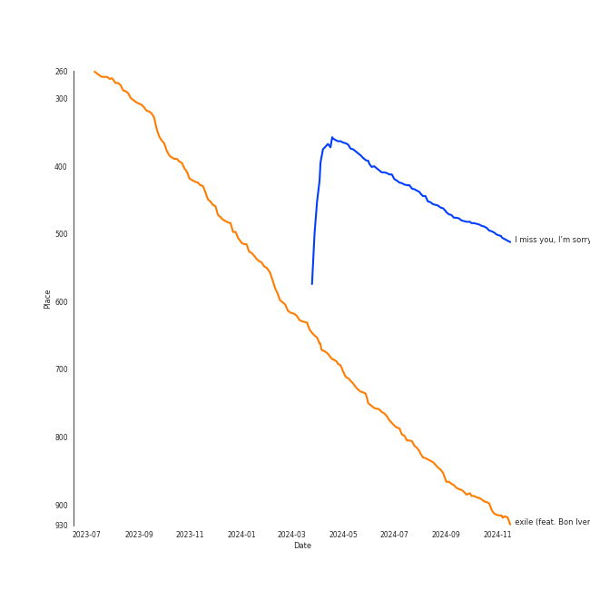

# Tracks in Singer-Songwriter from 2020

## Artists

| Art | Tracks | 💚 | Artist | 🔗 |
|:---|---:|---:|:---|:---|
|  | 13 | 8 | [Taylor Swift](../../../artists/taylor_swift/overview.md) | [🔗](https://open.spotify.com/artist/06HL4z0CvFAxyc27GXpf02) |
|  | 1 | 1 | Soccer Mommy | [🔗](https://open.spotify.com/artist/4wXchxfTTggLtzkoUhO86Q) |
|  | 1 | 1 | Gracie Abrams | [🔗](https://open.spotify.com/artist/4tuJ0bMpJh08umKkEXKUI5) |
|  | 1 | 1 | Bon Iver | [🔗](https://open.spotify.com/artist/4LEiUm1SRbFMgfqnQTwUbQ) |
|  | 1 | 1 | Phoebe Bridgers | [🔗](https://open.spotify.com/artist/1r1uxoy19fzMxunt3ONAkG) |
|  | 1 | 1 | Melt | [🔗](https://open.spotify.com/artist/0G7KI9I5BApiXc5Sqpyil9) |
|  | 2 | 0 | Sammy Rae & The Friends | [🔗](https://open.spotify.com/artist/3lFDsTyYNPQc8WzJExnQWn) |
|  | 2 | 0 | [Sara Bareilles](../../../artists/sara_bareilles/overview.md) | [🔗](https://open.spotify.com/artist/2Sqr0DXoaYABbjBo9HaMkM) |
|  | 1 | 0 | Emily King | [🔗](https://open.spotify.com/artist/6jlWj6y00bMQt8XoKuCjyZ) |
|  | 1 | 0 | HAIM | [🔗](https://open.spotify.com/artist/4Ui2kfOqGujY81UcPrb5KE) |

View all

| Art | Tracks | 💚 | Artist | 🔗 |
|:---|---:|---:|:---|:---|
|  | 1 | 0 | Fiona Apple | [🔗](https://open.spotify.com/artist/3g2kUQ6tHLLbmkV7T4GPtL) |

## Albums

| Art | Tracks | 💚 | Album | Release Date | 🔗 |
|:---|---:|---:|:---|:---|:---|
|  | 10 | 6 | folklore | 2020-07-24 | [🔗](https://open.spotify.com/album/2fenSS68JI1h4Fo296JfGr) |
|  | 3 | 2 | evermore | 2020-12-11 | [🔗](https://open.spotify.com/album/2Xoteh7uEpea4TohMxjtaq) |
|  | 1 | 1 | minor | 2020-07-14 | [🔗](https://open.spotify.com/album/2UZw04wDxLVceADw2Gi1Qy) |
|  | 1 | 1 | color theory | 2020-02-28 | [🔗](https://open.spotify.com/album/2CISL0rSGzbO0MbQMlqBez) |
|  | 1 | 1 | Waves | 2020-10-09 | [🔗](https://open.spotify.com/album/4J4lVYyekfRZXTlAukqGw4) |
|  | 1 | 1 | Punisher | 2020-06-18 | [🔗](https://open.spotify.com/album/6Pp6qGEywDdofgFC1oFbSH) |
|  | 1 | 0 | Whatever We Feel | 2020-04-03 | [🔗](https://open.spotify.com/album/4Qcemk272gcxq9D6ca40Xz) |
|  | 1 | 0 | Sides | 2020-01-17 | [🔗](https://open.spotify.com/album/5alIr9JGPvOQwPLphm0beJ) |
|  | 1 | 0 | More Love - Songs from Little Voice Season One | 2020-09-04 | [🔗](https://open.spotify.com/album/52fzvqGSm991mT6pBgAS6g) |
|  | 1 | 0 | Jackie Onassis | 2020-06-05 | [🔗](https://open.spotify.com/album/0E8rl16O1VgYyRMRzff3r6) |

View all

| Art | Tracks | 💚 | Album | Release Date | 🔗 |
|:---|---:|---:|:---|:---|:---|
|  | 1 | 0 | Fetch The Bolt Cutters | 2020-04-17 | [🔗](https://open.spotify.com/album/0fO1KemWL2uCCQmM22iKlj) |

## Tracks

| Art | Track | Album | Artists | Label | Rank | 💚 | 🔗 |
|:---|:---|:---|:---|:---|---:|:---|:---|
|  | I miss you, I’m sorry | minor | Gracie Abrams | Gracie Abrams, under exclusive license to Interscope Records | 361 | 💚 | [🔗](https://open.spotify.com/track/4nyF5lmSziBAt7ESAUjpbx) |
|  | exile (feat. Bon Iver) | folklore | [Taylor Swift](../../../artists/taylor_swift/overview.md), Bon Iver | [Taylor Swift](../../../labels/taylor_swift) | 686 | 💚 | [🔗](https://open.spotify.com/track/4pvb0WLRcMtbPGmtejJJ6y) |
|  | Teach You - Acoustic | Sides | Emily King, [Sara Bareilles](../../../artists/sara_bareilles/overview.md) | ATO Records | nan | | [🔗](https://open.spotify.com/track/6Esc0Q4YRbnlJHb3dy6MdS) |
|  | yellow is the color of her eyes | color theory | Soccer Mommy | Loma Vista Recordings | nan | 💚 | [🔗](https://open.spotify.com/track/5EDBVVqd2ogoG89XVQOvsn) |
|  | Whatever We Feel | Whatever We Feel | Sammy Rae & The Friends | [Nettwerk Music Group](../../../labels/nettwerk_music_group) | nan | | [🔗](https://open.spotify.com/track/4H9jGVkfJkjc6pWFfn2KSN) |
|  | I Want You To Love Me | Fetch The Bolt Cutters | Fiona Apple | [Epic](../../../labels/epic) | nan | | [🔗](https://open.spotify.com/track/73SBAGI4fPFm4VkB3NjXq8) |
|  | Jackie Onassis | Jackie Onassis | Sammy Rae & The Friends | [Nettwerk Music Group](../../../labels/nettwerk_music_group) | nan | | [🔗](https://open.spotify.com/track/7GPBA8xjMJyN6SjoKd4O9E) |
|  | Punisher | Punisher | Phoebe Bridgers | Dead Oceans | nan | 💚 | [🔗](https://open.spotify.com/track/5LJ4ig9cMvjui3li1mrNRl) |
|  | august | folklore | [Taylor Swift](../../../artists/taylor_swift/overview.md) | [Taylor Swift](../../../labels/taylor_swift) | nan | 💚 | [🔗](https://open.spotify.com/track/3hUxzQpSfdDqwM3ZTFQY0K) |
|  | cardigan | folklore | [Taylor Swift](../../../artists/taylor_swift/overview.md) | [Taylor Swift](../../../labels/taylor_swift) | nan | 💚 | [🔗](https://open.spotify.com/track/4R2kfaDFhslZEMJqAFNpdd) |

View all

| Art | Track | Album | Artists | Label | Rank | 💚 | 🔗 |
|:---|:---|:---|:---|:---|---:|:---|:---|
|  | epiphany | folklore | [Taylor Swift](../../../artists/taylor_swift/overview.md) | [Taylor Swift](../../../labels/taylor_swift) | nan | | [🔗](https://open.spotify.com/track/08fa9LFcFBTcilB3iq2e2A) |
|  | illicit affairs | folklore | [Taylor Swift](../../../artists/taylor_swift/overview.md) | [Taylor Swift](../../../labels/taylor_swift) | nan | | [🔗](https://open.spotify.com/track/2NmsngXHeC1GQ9wWrzhOMf) |
|  | invisible string | folklore | [Taylor Swift](../../../artists/taylor_swift/overview.md) | [Taylor Swift](../../../labels/taylor_swift) | nan | 💚 | [🔗](https://open.spotify.com/track/6VsvKPJ4xjVNKpI8VVZ3SV) |
|  | mad woman | folklore | [Taylor Swift](../../../artists/taylor_swift/overview.md) | [Taylor Swift](../../../labels/taylor_swift) | nan | | [🔗](https://open.spotify.com/track/2QDyYdZyhlP2fp79KZX8Bi) |
|  | peace | folklore | [Taylor Swift](../../../artists/taylor_swift/overview.md) | [Taylor Swift](../../../labels/taylor_swift) | nan | | [🔗](https://open.spotify.com/track/7MbT4I8qGntX4fMdqMQgke) |
|  | the 1 | folklore | [Taylor Swift](../../../artists/taylor_swift/overview.md) | [Taylor Swift](../../../labels/taylor_swift) | nan | 💚 | [🔗](https://open.spotify.com/track/0Jlcvv8IykzHaSmj49uNW8) |
|  | the last great american dynasty | folklore | [Taylor Swift](../../../artists/taylor_swift/overview.md) | [Taylor Swift](../../../labels/taylor_swift) | nan | 💚 | [🔗](https://open.spotify.com/track/2Eeur20xVqfUoM3Q7EFPFt) |
|  | Little Voice | More Love - Songs from Little Voice Season One | [Sara Bareilles](../../../artists/sara_bareilles/overview.md) | [Epic](../../../labels/epic) | nan | | [🔗](https://open.spotify.com/track/6bbmyaEU6k26teJfCsIKNb) |
|  | Waves | Waves | Melt | Melt Records | nan | 💚 | [🔗](https://open.spotify.com/track/1xAIGZZpBcGU3eaXspeUh8) |
|  | no body, no crime (feat. HAIM) | evermore | [Taylor Swift](../../../artists/taylor_swift/overview.md), HAIM | [Taylor Swift](../../../labels/taylor_swift) | nan | | [🔗](https://open.spotify.com/track/3RaT22zZsxVYxxKR7TAaYF) |
|  | tolerate it | evermore | [Taylor Swift](../../../artists/taylor_swift/overview.md) | [Taylor Swift](../../../labels/taylor_swift) | nan | 💚 | [🔗](https://open.spotify.com/track/0PurA4JVJ8YQgSVopY8fn6) |
|  | willow | evermore | [Taylor Swift](../../../artists/taylor_swift/overview.md) | [Taylor Swift](../../../labels/taylor_swift) | nan | 💚 | [🔗](https://open.spotify.com/track/0lx2cLdOt3piJbcaXIV74f) |

