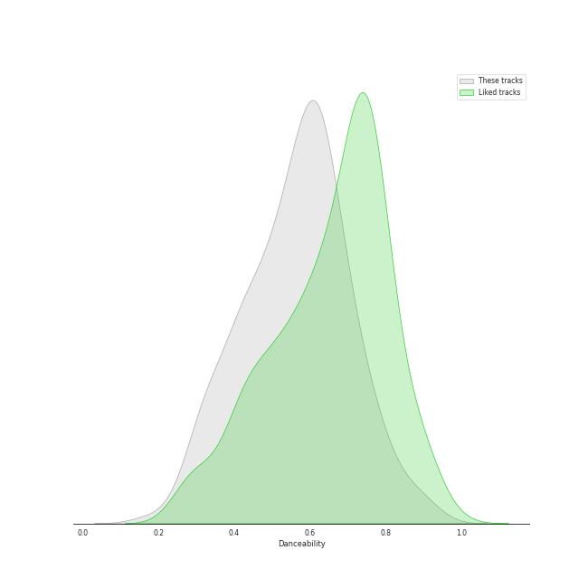
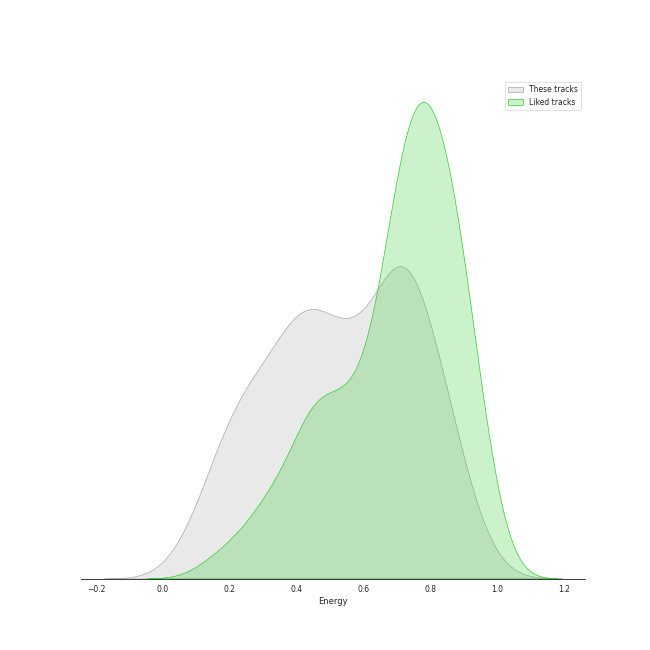
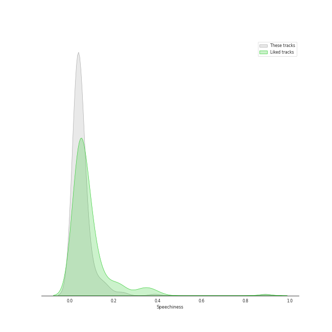
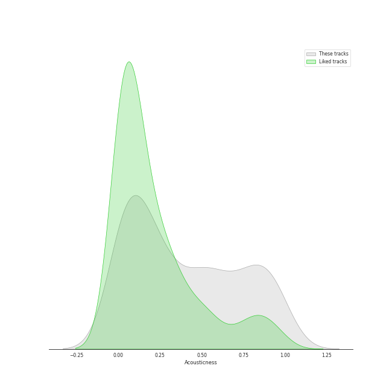
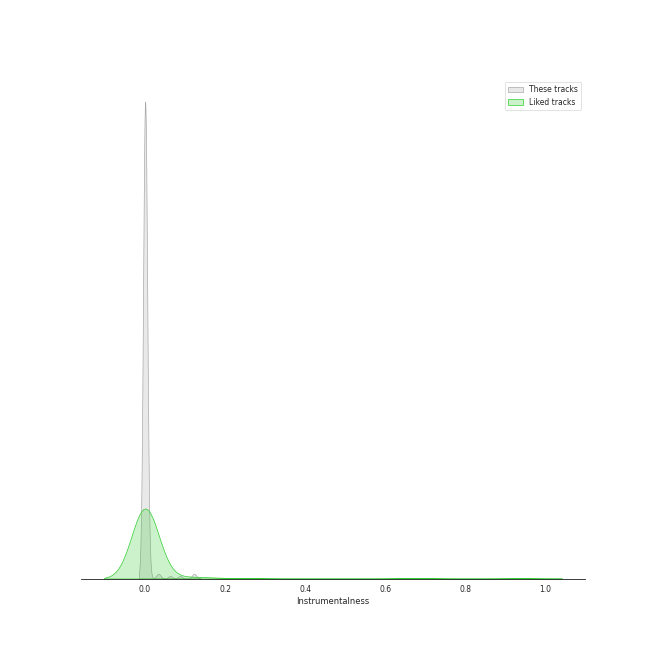
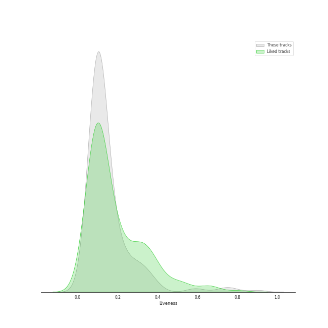
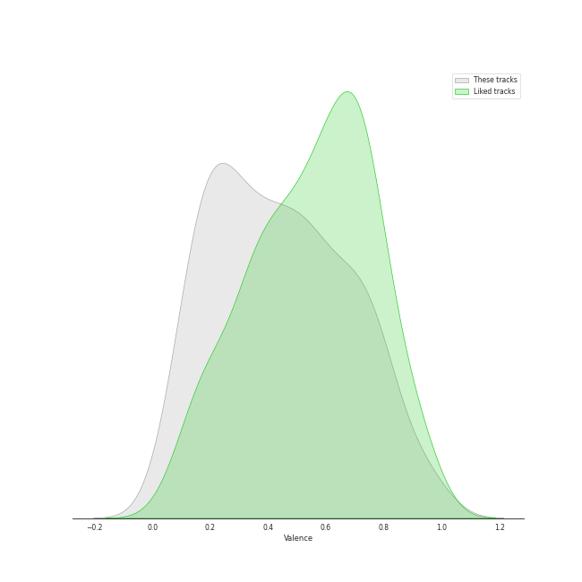
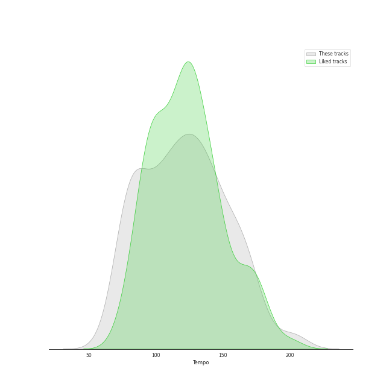

# Track Features for Singer-Songwriter

## Danceability

| ​ | 10 most Danceable tracks | ​​ | 10 least Danceable tracks |
|:---|:---|:---|:---|
|  | Fidelity (0.923) |  | Born To Die (0.18) |
|  | I Think He Knows (0.897) |  | Norman fucking Rockwell (0.215) |
|  | On the Radio (0.88) |  | Stay (0.262) |
|  | Good Intent (0.851) |  | Shades Of Cool (0.262) |
|  | Cornelia Street (0.824) |  | Gravity (0.27) |
|  | Paper Rings (0.811) |  | Once Upon Another Time (0.275) |
|  | Clean (0.81) |  | Creep Live At (Le)Poisson Rouge (0.277) |
|  | Dreamer (0.802) |  | She's Always a Woman (0.292) |
|  | Gorgeous (0.8) |  | Shadowboxer (0.298) |
|  | Vigilante Shit (0.798) |  | exile (feat. Bon Iver) (0.298) |

## Energy

| ​ | 10 most Energetic tracks | ​​ | 10 least Energetic tracks |
|:---|:---|:---|:---|
|  | We Didn't Start the Fire (0.967) |  | Kaleidoscope Heart (0.0516) |
|  | Uptown Girl (0.944) |  | And So It Goes (0.0871) |
|  | Scenes from an Italian Restaurant (0.931) |  | Used (0.0938) |
|  | Cameo Lover (0.922) |  | Blue (0.102) |
|  | Red (0.896) |  | The Dawntreader (0.103) |
|  | Hello/Goodbye (0.893) |  | Goodbye Yellow Brick Road - Live at the Variety Playhouse, Atlanta, GA - May 2013 (0.114) |
|  | Bad Idea (feat. Jason Mraz) (0.889) |  | She's Got a Way (0.142) |
|  | Movin' Out (Anthony's Song) (0.88) |  | I Had a King (0.151) |
|  | Morningside (0.88) |  | Sweet Nothing (0.156) |
|  | The Stranger (0.878) |  | Lullabye (Goodnight, My Angel) (0.157) |

## Speechiness

| ​ | 10 most Speechy tracks | ​​ | 10 least Speechy tracks |
|:---|:---|:---|:---|
|  | Vigilante Shit (0.39) |  | Satellite Call (0.0241) |
|  | False God (0.239) |  | All Too Well (0.0243) |
|  | Dancing With Our Hands Tied (0.196) |  | Lemon Love (0.0244) |
|  | willow (0.17) |  | Speeding Cars (0.0247) |
|  | Question...? (0.167) |  | Whisper (0.0252) |
|  | Shake It Off (0.165) |  | Pitter-Pat (0.0256) |
|  | I Did Something Bad (0.159) |  | October Sky (0.0261) |
|  | Only the Good Die Young (0.159) |  | The Longest Time (0.0262) |
|  | Cruel Summer (0.157) |  | Begin Again (0.0263) |
|  | Sit Down, You’re Rockin’ The Boat (0.148) |  | Turn the Lights Back On (0.0264) |

## Acousticness

| ​ | 10 most Acoustic tracks | ​​ | 10 least Acoustic tracks |
|:---|:---|:---|:---|
|  | Blue (0.989) |  | Out Of The Woods (0.00103) |
|  | Punisher (0.986) |  | Now Is The Start (0.00124) |
|  | Bright Lights and Cityscapes (0.977) |  | 22 (0.00215) |
|  | The Pirate of Penance (0.973) |  | Style (0.00253) |
|  | Manhattan (0.972) |  | I Knew You Were Trouble. (0.00454) |
|  | She's Got a Way (0.97) |  | Brave (0.00502) |
|  | I Had a King (0.968) |  | Many the Miles (0.00796) |
|  | Norman fucking Rockwell (0.968) |  | Nightflyers (0.00834) |
|  | Sweet Nothing (0.964) |  | Vegas (0.00881) |
|  | Goodbye Yellow Brick Road - Live at the Variety Playhouse, Atlanta, GA - May 2013 (0.959) |  | I Think He Knows (0.00889) |

## Instrumentalness

| ​ | 10 most Instrumental tracks | ​​ | 10 least Instrumental tracks |
|:---|:---|:---|:---|
|  | Swan Song (0.421) |  | Say You're Sorry (0.0) |
|  | yellow is the color of her eyes (0.125) |  | Sweet As Whole (0.0) |
|  | Meant (0.124) |  | Clean (0.0) |
|  | This One's Gonna Hurt (0.121) |  | This Is Why We Can't Have Nice Things (0.0) |
|  | Bel Air (0.0875) |  | Lucky (0.0) |
|  | Top of the World (0.0626) |  | The Eye (0.0) |
|  | Norman fucking Rockwell (0.0585) |  | Shadowboxer (0.0) |
|  | I Want You To Love Me (0.0414) |  | Flesh & Bone (0.0) |
|  | Now Is The Start (0.0353) |  | Question...? (0.0) |
|  | Satellite Call (0.0318) |  | Come Round Soon (0.0) |

## Liveness

| ​ | 10 most Live tracks | ​​ | 10 least Live tracks |
|:---|:---|:---|:---|
|  | Bel Air (0.901) |  | Uncharted (0.0343) |
|  | Goodbye Yellow Brick Road - Live at the Variety Playhouse, Atlanta, GA - May 2013 (0.781) |  | I Knew You Were Trouble. (0.0398) |
|  | Whatever We Feel (0.75) |  | Brave (0.0425) |
|  | Creep Live At (Le)Poisson Rouge (0.722) |  | Eden (0.0456) |
|  | Uptown Girl (0.601) |  | Chasing The Sun (0.0497) |
|  | Big Yellow Taxi (0.581) |  | I Feel the Earth Move (0.0528) |
|  | Karma (0.483) |  | My Life (0.0555) |
|  | Saw It Coming (0.456) |  | King of Anything (0.0574) |
|  | Off To The Races (0.4) |  | The Wire (0.0585) |
|  | i'm confident that i'm insecure (0.387) |  | Movin' Out (Anthony's Song) (0.0591) |

## Valence

| ​ | 10 most Happy tracks | ​​ | 10 least Happy tracks |
|:---|:---|:---|:---|
|  | Big Yellow Taxi (0.97) |  | Maroon (0.0374) |
|  | Crocodile Rock (0.968) |  | Swan Song (0.0392) |
|  | Mercy (0.964) |  | Delicate (0.0499) |
|  | I Choose You (0.947) |  | Once Upon Another Time (0.0551) |
|  | Shake It Off (0.943) |  | Waltz Me to the Grave (0.0748) |
|  | Earth (0.938) |  | Creep Live At (Le)Poisson Rouge (0.0795) |
|  | Movin' Out (Anthony's Song) (0.895) |  | Dress (0.0851) |
|  | We Didn't Start the Fire (0.895) |  | Islands (0.0863) |
|  | Blow Away (0.891) |  | Shades Of Cool (0.0878) |
|  | A Matter of Trust (0.88) |  | Hide and Seek (0.0901) |

## Tempo

| ​ | 10 most Fast tracks | ​​ | 10 least Fast tracks |
|:---|:---|:---|:---|
|  | Uncharted (203.962) |  | What's Inside (63.218) |
|  | Little Voice (203.518) |  | Bright Lights and Cityscapes (66.509) |
|  | Caroline (199.225) |  | Lover (68.534) |
|  | Brave (185.063) |  | Shadowboxer (74.131) |
|  | Wicked Love (179.894) |  | We All Need Saving (74.717) |
|  | Piano Man (179.239) |  | Come Round Soon (74.751) |
|  | Sweet Nothing (176.655) |  | tolerate it (74.952) |
|  | She's Always a Woman (176.631) |  | Radio (75.112) |
|  | I Feel It All (172.046) |  | Carey (75.368) |
|  | Bobble Head (171.94) |  | exile (feat. Bon Iver) (75.602) |
