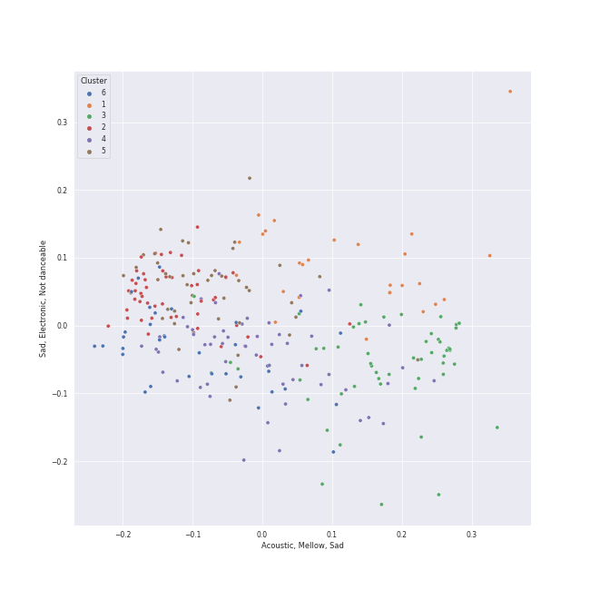

# Clusters in Singer-Songwriter

## Cluster #1

28 tracks

| Art | Track | Album | Artists | Label | Rank | 💚 | 🔗 |
|:---|:---|:---|:---|:---|---:|:---|:---|
|  | Stay | Once Upon Another Time | [Sara Bareilles](../../../../artists/sara_bareilles/overview.md) | [Epic](../../../../labels/epic) | 938 | 💚 | [🔗](https://open.spotify.com/track/24xqELXbmKDFLKkR3271jb) |
|  | Everything Changes | What's Inside: Songs from Waitress | [Sara Bareilles](../../../../artists/sara_bareilles/overview.md) | [Epic](../../../../labels/epic) | 938 | | [🔗](https://open.spotify.com/track/11R6SmSuzXE8ftk1vlPEKP) |
|  | She Used To Be Mine | What's Inside: Songs from Waitress | [Sara Bareilles](../../../../artists/sara_bareilles/overview.md) | [Epic](../../../../labels/epic) | 938 | 💚 | [🔗](https://open.spotify.com/track/2D4BSm5Z8Hq5zYbSgJwEOh) |
|  | exile (feat. Bon Iver) | folklore | [Taylor Swift](../../../../artists/taylor_swift/overview.md), Bon Iver | [Taylor Swift](../../../../labels/taylor_swift) | 851 | 💚 | [🔗](https://open.spotify.com/track/4pvb0WLRcMtbPGmtejJJ6y) |
|  | Waltz Me to the Grave | The Golden Echo | [Kimbra](../../../../artists/kimbra/overview.md) | [Warner Records](../../../../labels/warner_records) | 938 | 💚 | [🔗](https://open.spotify.com/track/2p7QlaQFpB2YFwdvt2ArtD) |
|  | Brooklyn Baby | Ultraviolence (Deluxe) | [Lana Del Rey](../../../../artists/lana_del_rey/overview.md) | [Polydor Records](../../../../labels/polydor_records) | 938 | | [🔗](https://open.spotify.com/track/1NZs6n6hl8UuMaX0UC0YTz) |
|  | Young And Beautiful | Young And Beautiful | [Lana Del Rey](../../../../artists/lana_del_rey/overview.md) | [Polydor Records](../../../../labels/polydor_records) | 938 | | [🔗](https://open.spotify.com/track/2nMeu6UenVvwUktBCpLMK9) |
|  | We All Need Saving | OK Now | Jon McLaughlin | Island Def Jam | 938 | 💚 | [🔗](https://open.spotify.com/track/4Q9lPZNK2RB3ytuU1tCc1J) |
|  | I miss you, I’m sorry | minor | Gracie Abrams | Gracie Abrams, under exclusive license to Interscope Records | 463 | 💚 | [🔗](https://open.spotify.com/track/4nyF5lmSziBAt7ESAUjpbx) |
|  | yellow is the color of her eyes | color theory | Soccer Mommy | Loma Vista Recordings | 938 | 💚 | [🔗](https://open.spotify.com/track/5EDBVVqd2ogoG89XVQOvsn) |
## Cluster #2

61 tracks

| Art | Track | Album | Artists | Label | Rank | 💚 | 🔗 |
|:---|:---|:---|:---|:---|---:|:---|:---|
|  | King of Anything | Kaleidoscope Heart | [Sara Bareilles](../../../../artists/sara_bareilles/overview.md) | [Epic](../../../../labels/epic) | 938 | 💚 | [🔗](https://open.spotify.com/track/3VA8T3rNy5V24AXxNK5u9E) |
|  | Bottle It Up | Little Voice | [Sara Bareilles](../../../../artists/sara_bareilles/overview.md) | [Epic](../../../../labels/epic) | 938 | 💚 | [🔗](https://open.spotify.com/track/3kfHdr2sYF2EeWEmBHquVj) |
|  | Love On the Rocks | Little Voice | [Sara Bareilles](../../../../artists/sara_bareilles/overview.md) | [Epic](../../../../labels/epic) | 938 | 💚 | [🔗](https://open.spotify.com/track/45bHK5dR8PeWcuMJqmpsP1) |
|  | Lie To Me | Once Upon Another Time | [Sara Bareilles](../../../../artists/sara_bareilles/overview.md) | [Epic](../../../../labels/epic) | 446 | 💚 | [🔗](https://open.spotify.com/track/15zarGPJkaG3btC3Co7Luo) |
|  | I Didn't Plan It | What's Inside: Songs from Waitress | [Sara Bareilles](../../../../artists/sara_bareilles/overview.md) | [Epic](../../../../labels/epic) | 938 | | [🔗](https://open.spotify.com/track/5EPytk5jah5T1EqOmu1QfP) |
|  | the last great american dynasty | folklore | [Taylor Swift](../../../../artists/taylor_swift/overview.md) | [Taylor Swift](../../../../labels/taylor_swift) | 938 | 💚 | [🔗](https://open.spotify.com/track/2Eeur20xVqfUoM3Q7EFPFt) |
|  | We Are Never Ever Getting Back Together | Red | [Taylor Swift](../../../../artists/taylor_swift/overview.md) | [Big Machine Records, LLC](../../../../labels/big_machine_records) | 938 | | [🔗](https://open.spotify.com/track/7AEAGTc8cReDqcbPoY9gwo) |
|  | Free Man in Paris | Court and Spark | [Joni Mitchell](../../../../artists/joni_mitchell/overview.md) | [Rhino](../../../../labels/rhino) | 938 | 💚 | [🔗](https://open.spotify.com/track/2by5mqpQ1ZP2G5FOIccMnu) |
|  | Don't Ask Me Why | Glass Houses | [Billy Joel](../../../../artists/billy_joel/overview.md) | [Columbia](../../../../labels/columbia) | 938 | 💚 | [🔗](https://open.spotify.com/track/6g4vHtdGqD5eEgpf7nKISk) |
|  | Hammer And A Nail | Nomads · Indians · Saints (Expanded Edition) | Indigo Girls | [Epic](../../../../labels/epic) | 938 | 💚 | [🔗](https://open.spotify.com/track/2OV25P5lmVqnjKnWfj0FeP) |
## Cluster #3

61 tracks

| Art | Track | Album | Artists | Label | Rank | 💚 | 🔗 |
|:---|:---|:---|:---|:---|---:|:---|:---|
|  | Hold My Heart | Kaleidoscope Heart | [Sara Bareilles](../../../../artists/sara_bareilles/overview.md) | [Epic](../../../../labels/epic) | 938 | | [🔗](https://open.spotify.com/track/46QrTPAuu0iJHnECJKIWWH) |
|  | Cassiopeia | The Blessed Unrest | [Sara Bareilles](../../../../artists/sara_bareilles/overview.md) | [Epic](../../../../labels/epic) | 938 | 💚 | [🔗](https://open.spotify.com/track/4XGet6CWBb9QoZSHGGT0NM) |
|  | December | The Blessed Unrest | [Sara Bareilles](../../../../artists/sara_bareilles/overview.md) | [Epic](../../../../labels/epic) | 938 | 💚 | [🔗](https://open.spotify.com/track/5I6exXg95LKzq9Eb0hCFXM) |
|  | Poetry by Dead Men | Amidst the Chaos (Bonus Version) | [Sara Bareilles](../../../../artists/sara_bareilles/overview.md) | [Epic](../../../../labels/epic) | 727 | | [🔗](https://open.spotify.com/track/1rY7zvbYYWaj1OVa3YlwLv) |
|  | Wildest Dreams | 1989 | [Taylor Swift](../../../../artists/taylor_swift/overview.md) | [Big Machine Records, LLC](../../../../labels/big_machine_records) | 938 | 💚 | [🔗](https://open.spotify.com/track/59HjlYCeBsxdI0fcm3zglw) |
|  | ...Ready For It? | reputation | [Taylor Swift](../../../../artists/taylor_swift/overview.md) | [Big Machine Records, LLC](../../../../labels/big_machine_records) | 456 | 💚 | [🔗](https://open.spotify.com/track/2yLa0QULdQr0qAIvVwN6B5) |
|  | Dark Paradise | Born To Die | [Lana Del Rey](../../../../artists/lana_del_rey/overview.md) | [Polydor Records](../../../../labels/polydor_records) | 938 | 💚 | [🔗](https://open.spotify.com/track/0rbuGVyW18IpX0bhA3P4Oh) |
|  | West Coast | Ultraviolence (Deluxe) | [Lana Del Rey](../../../../artists/lana_del_rey/overview.md) | [Polydor Records](../../../../labels/polydor_records) | 938 | | [🔗](https://open.spotify.com/track/5Y6nVaayzitvsD5F7nr3DV) |
|  | The River of Dreams | River Of Dreams | [Billy Joel](../../../../artists/billy_joel/overview.md) | [Columbia](../../../../labels/columbia) | 938 | | [🔗](https://open.spotify.com/track/30qVCFYKBtAENjTIBA8FPZ) |
|  | What I Wouldn't Do | Bomb In A Birdcage | A Fine Frenzy | [Virgin Records](../../../../labels/virgin_records) | 938 | | [🔗](https://open.spotify.com/track/54qVDnyXbaYeXSjF8cxFLs) |
## Cluster #4

41 tracks

| Art | Track | Album | Artists | Label | Rank | 💚 | 🔗 |
|:---|:---|:---|:---|:---|---:|:---|:---|
|  | Vegas | Little Voice | [Sara Bareilles](../../../../artists/sara_bareilles/overview.md) | [Epic](../../../../labels/epic) | 938 | | [🔗](https://open.spotify.com/track/1NcGrbn2dbx6VQOPQeKhjl) |
|  | Fire | Amidst the Chaos (Bonus Version) | [Sara Bareilles](../../../../artists/sara_bareilles/overview.md) | [Epic](../../../../labels/epic) | 938 | 💚 | [🔗](https://open.spotify.com/track/3Zx5ylimOCecAT0yai8sPK) |
|  | If I Can't Have You | Amidst the Chaos (Bonus Version) | [Sara Bareilles](../../../../artists/sara_bareilles/overview.md) | [Epic](../../../../labels/epic) | 938 | 💚 | [🔗](https://open.spotify.com/track/3n5MOB82LKPL14eBEmodTd) |
|  | I Know Places | 1989 | [Taylor Swift](../../../../artists/taylor_swift/overview.md) | [Big Machine Records, LLC](../../../../labels/big_machine_records) | 938 | 💚 | [🔗](https://open.spotify.com/track/3jBMHD19RZdAqG9iFQh7xc) |
|  | cardigan | folklore | [Taylor Swift](../../../../artists/taylor_swift/overview.md) | [Taylor Swift](../../../../labels/taylor_swift) | 938 | 💚 | [🔗](https://open.spotify.com/track/4R2kfaDFhslZEMJqAFNpdd) |
|  | Anti-Hero | Midnights | [Taylor Swift](../../../../artists/taylor_swift/overview.md) | [Taylor Swift](../../../../labels/taylor_swift) | 938 | 💚 | [🔗](https://open.spotify.com/track/0V3wPSX9ygBnCm8psDIegu) |
|  | London Boy | Lover | [Taylor Swift](../../../../artists/taylor_swift/overview.md) | [Taylor Swift](../../../../labels/taylor_swift) | 938 | 💚 | [🔗](https://open.spotify.com/track/1LLXZFeAHK9R4xUramtUKw) |
|  | Limbo | Vows (Deluxe Version) | [Kimbra](../../../../artists/kimbra/overview.md) | [Warner Records](../../../../labels/warner_records) | 899 | 💚 | [🔗](https://open.spotify.com/track/6go4VH47IaXtYlTGHizjhm) |
|  | Two Way Street | Vows (Deluxe Version) | [Kimbra](../../../../artists/kimbra/overview.md) | [Warner Records](../../../../labels/warner_records) | 938 | 💚 | [🔗](https://open.spotify.com/track/7ptSTFAis4UckLAfUrMfM0) |
|  | Turn the Lights Back On | Turn the Lights Back On | [Billy Joel](../../../../artists/billy_joel/overview.md) | [Columbia](../../../../labels/columbia) | 938 | 💚 | [🔗](https://open.spotify.com/track/1KTemUlHzS0SvVtTjY1NTw) |
## Cluster #5

49 tracks

| Art | Track | Album | Artists | Label | Rank | 💚 | 🔗 |
|:---|:---|:---|:---|:---|---:|:---|:---|
|  | Manhattan | The Blessed Unrest | [Sara Bareilles](../../../../artists/sara_bareilles/overview.md) | [Epic](../../../../labels/epic) | 579 | 💚 | [🔗](https://open.spotify.com/track/0aSgzAUObtmSSwh1yO6shv) |
|  | The Dawntreader | Song to a Seagull | [Joni Mitchell](../../../../artists/joni_mitchell/overview.md) | [Rhino](../../../../labels/rhino) | 852 | | [🔗](https://open.spotify.com/track/0KE9YElZqPumrpm9ovtXlN) |
|  | The Eye | The Firewatcher's Daughter | Brandi Carlile | ATO Records | 938 | 💚 | [🔗](https://open.spotify.com/track/0Plf9mewMoYkwEvncCjfxS) |
|  | That Wasn't Me | Bear Creek | Brandi Carlile | [Columbia](../../../../labels/columbia) | 938 | 💚 | [🔗](https://open.spotify.com/track/6iqAJh3X8bf94eo4reme5L) |
|  | Wait It Out | Ellipse | [Imogen Heap](../../../../artists/imogen_heap/overview.md) | [RCA Records Label](../../../../labels/rca_records_label) | 938 | 💚 | [🔗](https://open.spotify.com/track/4xszw2YraekWIpj0SZ6Lp6) |
|  | And So It Goes | Storm Front | [Billy Joel](../../../../artists/billy_joel/overview.md) | [Columbia](../../../../labels/columbia) | 938 | 💚 | [🔗](https://open.spotify.com/track/1u7kQUb3lQcpHaYRfia13A) |
|  | So Far Away | Tapestry | Carole King | Ode, [Epic](../../../../labels/epic), [Legacy](../../../../labels/legacy) | 938 | | [🔗](https://open.spotify.com/track/4HHge4zAyIw3pkrtFzmwCl) |
|  | Your Song | Elton John | Elton John | [UMC (Universal Music Catalogue)](../../../../labels/umc_(universal_music_catalogue)) | 383 | 💚 | [🔗](https://open.spotify.com/track/38zsOOcu31XbbYj9BIPUF1) |
|  | Just The Way You Are | Little Love - EP | James Smith | [EMI](../../../../labels/emi) | 938 | | [🔗](https://open.spotify.com/track/1YwbObIsxLhBTjSI5lwJz6) |
|  | Daylight | Daylight | David Kushner | Miserable Music Group, LLC | 938 | 💚 | [🔗](https://open.spotify.com/track/1odExI7RdWc4BT515LTAwj) |
## Cluster #6

30 tracks

| Art | Track | Album | Artists | Label | Rank | 💚 | 🔗 |
|:---|:---|:---|:---|:---|---:|:---|:---|
|  | I Did Something Bad | reputation | [Taylor Swift](../../../../artists/taylor_swift/overview.md) | [Big Machine Records, LLC](../../../../labels/big_machine_records) | 938 | 💚 | [🔗](https://open.spotify.com/track/4svZDCRz4cJoneBpjpx8DJ) |
|  | Dress | reputation | [Taylor Swift](../../../../artists/taylor_swift/overview.md) | [Big Machine Records, LLC](../../../../labels/big_machine_records) | 938 | 💚 | [🔗](https://open.spotify.com/track/6oVxXO5oQ4pTpO8RSnkzvv) |
|  | Snow On The Beach (feat. Lana Del Rey) | Midnights | [Taylor Swift](../../../../artists/taylor_swift/overview.md), [Lana Del Rey](../../../../artists/lana_del_rey/overview.md) | [Taylor Swift](../../../../labels/taylor_swift) | 938 | 💚 | [🔗](https://open.spotify.com/track/1wtOxkiel43cVs0Yux5Q4h) |
|  | Lavender Haze | Midnights | [Taylor Swift](../../../../artists/taylor_swift/overview.md) | [Taylor Swift](../../../../labels/taylor_swift) | 938 | 💚 | [🔗](https://open.spotify.com/track/5jQI2r1RdgtuT8S3iG8zFC) |
|  | Down Bad | THE TORTURED POETS DEPARTMENT: THE ANTHOLOGY | [Taylor Swift](../../../../artists/taylor_swift/overview.md) | [Taylor Swift](../../../../labels/taylor_swift) | 938 | | [🔗](https://open.spotify.com/track/1kbEbBdEgQdQeLXCJh28pJ) |
|  | The Tortured Poets Department | THE TORTURED POETS DEPARTMENT: THE ANTHOLOGY | [Taylor Swift](../../../../artists/taylor_swift/overview.md) | [Taylor Swift](../../../../labels/taylor_swift) | 938 | | [🔗](https://open.spotify.com/track/4PdLaGZubp4lghChqp8erB) |
|  | Eet | Far | Regina Spektor | Sire | 938 | 💚 | [🔗](https://open.spotify.com/track/0N9WhEz6DiBDvBxa6uJCTY) |
|  | Love | Lust For Life | [Lana Del Rey](../../../../artists/lana_del_rey/overview.md) | [Polydor Records](../../../../labels/polydor_records) | 938 | | [🔗](https://open.spotify.com/track/2Kerz9H9IejzeIpjhDJoYG) |
|  | New York State of Mind | Turnstiles | [Billy Joel](../../../../artists/billy_joel/overview.md) | [Columbia](../../../../labels/columbia) | 938 | 💚 | [🔗](https://open.spotify.com/track/6yjKlmm7vOszkXEUku1EM1) |
|  | Pitter-Pat | Love, Save The Empty | Erin McCarley | Universal (MT) | 938 | | [🔗](https://open.spotify.com/track/4M42eBvwzyntEiqcq1nfp5) |