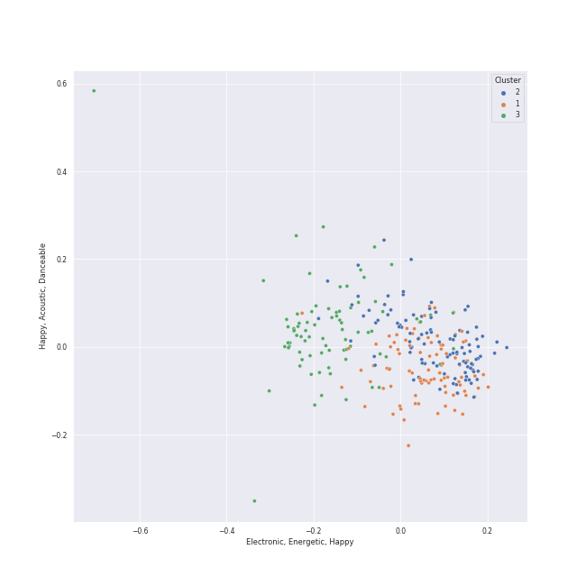

# Clusters in Singer-Songwriter

## Cluster #1

24 tracks

| Art | Track | Album | Artists | Label | Rank | 💚 | 🔗 |
|:---|:---|:---|:---|:---|---:|:---|:---|
|  | Just the Way You Are | The Stranger | [Billy Joel](../../../../artists/billy_joel/overview.md) | [Columbia](../../../../labels/columbia) | 735 | 💚 | [🔗](https://open.spotify.com/track/06RdYCp0UxsBtWsonHfSZz) |
|  | the last great american dynasty | folklore | [Taylor Swift](../../../../artists/taylor_swift/overview.md) | [Taylor Swift](../../../../labels/taylor_swift) | nan | 💚 | [🔗](https://open.spotify.com/track/2Eeur20xVqfUoM3Q7EFPFt) |
|  | I'm Yours | We Sing. We Dance. We Steal Things. | Jason Mraz | [Atlantic Records/ATG](../../../../labels/atlantic_records) | nan | 💚 | [🔗](https://open.spotify.com/track/1EzrEOXmMH3G43AXT1y7pA) |
|  | Carey | Blue | [Joni Mitchell](../../../../artists/joni_mitchell/overview.md) | [Rhino](../../../../labels/rhino) | nan | 💚 | [🔗](https://open.spotify.com/track/11dUk8E2z8Oj1JURwl7GJd) |
|  | Free Man in Paris | Court and Spark | [Joni Mitchell](../../../../artists/joni_mitchell/overview.md) | [Rhino](../../../../labels/rhino) | nan | 💚 | [🔗](https://open.spotify.com/track/2by5mqpQ1ZP2G5FOIccMnu) |
|  | I Want You To Love Me | Fetch The Bolt Cutters | Fiona Apple | [Epic](../../../../labels/epic) | nan | | [🔗](https://open.spotify.com/track/73SBAGI4fPFm4VkB3NjXq8) |
|  | Aha! | Ellipse | [Imogen Heap](../../../../artists/imogen_heap/overview.md) | [RCA Records Label](../../../../labels/rca_records_label) | nan | 💚 | [🔗](https://open.spotify.com/track/42itRd5WoYb42RSYOloJvD) |
|  | First Train Home | Ellipse | [Imogen Heap](../../../../artists/imogen_heap/overview.md) | [RCA Records Label](../../../../labels/rca_records_label) | nan | | [🔗](https://open.spotify.com/track/504gJcwsW5n0s3Zj5uAedr) |
|  | Speeding Cars | Goodnight And Go | [Imogen Heap](../../../../artists/imogen_heap/overview.md) | RCA Victor | nan | | [🔗](https://open.spotify.com/track/5qeh0TEQCFdmUVnSRKG9md) |
|  | I Feel the Earth Move | Tapestry | Carole King | Ode, [Epic](../../../../labels/epic), [Legacy](../../../../labels/legacy) | nan | | [🔗](https://open.spotify.com/track/1BWsOxeMx83OrKGCV4gxly) |
## Cluster #2

46 tracks

| Art | Track | Album | Artists | Label | Rank | 💚 | 🔗 |
|:---|:---|:---|:---|:---|---:|:---|:---|
|  | Breathe Again | Kaleidoscope Heart | [Sara Bareilles](../../../../artists/sara_bareilles/overview.md) | [Epic](../../../../labels/epic) | nan | 💚 | [🔗](https://open.spotify.com/track/0UgmLwOrTeOCUNwV07a5AD) |
|  | Between the Lines | Little Voice | [Sara Bareilles](../../../../artists/sara_bareilles/overview.md) | [Epic](../../../../labels/epic) | 482 | 💚 | [🔗](https://open.spotify.com/track/2t3b5MZMzsArvQflOUo804) |
|  | Begin Again | Red | [Taylor Swift](../../../../artists/taylor_swift/overview.md) | [Big Machine Records, LLC](../../../../labels/big_machine_records) | 717 | 💚 | [🔗](https://open.spotify.com/track/0L4YCNRfXAoTvdpWeH2RGj) |
|  | Back To December | Speak Now | [Taylor Swift](../../../../artists/taylor_swift/overview.md) | [Big Machine Records, LLC](../../../../labels/big_machine_records) | nan | | [🔗](https://open.spotify.com/track/3DrjZArsPsoqbLzUZZV1Id) |
|  | Top of the World | Primal Heart | [Kimbra](../../../../artists/kimbra/overview.md) | [Warner Records](../../../../labels/warner_records) | nan | | [🔗](https://open.spotify.com/track/1Gbdx88ElOui7lczwxGX6m) |
|  | Shadowboxer | Tidal | Fiona Apple | Clean Slate/Work | nan | | [🔗](https://open.spotify.com/track/0XMzFZgFvEqH2nEa3iwNUD) |
|  | Closing In | Speak for Yourself | [Imogen Heap](../../../../artists/imogen_heap/overview.md) | Sony BMG Music UK | nan | 💚 | [🔗](https://open.spotify.com/track/3wKRHAG6IvErggsniF1a3j) |
|  | Lemon Love | Lemon Love | Aslyn | [Capitol Records](../../../../labels/capitol_records) | nan | | [🔗](https://open.spotify.com/track/4SQ5SNqVPo00s7aVRoMYjN) |
|  | Tiny Dancer | Madman Across The Water | Elton John | [EMI](../../../../labels/emi) | nan | | [🔗](https://open.spotify.com/track/2TVxnKdb3tqe1nhQWwwZCO) |
|  | Pitter-Pat | Love, Save The Empty | Erin McCarley | Universal (MT) | nan | | [🔗](https://open.spotify.com/track/4M42eBvwzyntEiqcq1nfp5) |
## Cluster #3

48 tracks

| Art | Track | Album | Artists | Label | Rank | 💚 | 🔗 |
|:---|:---|:---|:---|:---|---:|:---|:---|
|  | Say You're Sorry | Kaleidoscope Heart | [Sara Bareilles](../../../../artists/sara_bareilles/overview.md) | [Epic](../../../../labels/epic) | nan | | [🔗](https://open.spotify.com/track/011Dg8Hkelamb0hAuaijWd) |
|  | Morningside | Little Voice | [Sara Bareilles](../../../../artists/sara_bareilles/overview.md) | [Epic](../../../../labels/epic) | nan | | [🔗](https://open.spotify.com/track/3cqJzS1U23zElTJyXcacm6) |
|  | Bottle It Up | Little Voice | [Sara Bareilles](../../../../artists/sara_bareilles/overview.md) | [Epic](../../../../labels/epic) | nan | 💚 | [🔗](https://open.spotify.com/track/3kfHdr2sYF2EeWEmBHquVj) |
|  | Love On the Rocks | Little Voice | [Sara Bareilles](../../../../artists/sara_bareilles/overview.md) | [Epic](../../../../labels/epic) | nan | 💚 | [🔗](https://open.spotify.com/track/45bHK5dR8PeWcuMJqmpsP1) |
|  | Lie To Me | Once Upon Another Time | [Sara Bareilles](../../../../artists/sara_bareilles/overview.md) | [Epic](../../../../labels/epic) | 350 | 💚 | [🔗](https://open.spotify.com/track/15zarGPJkaG3btC3Co7Luo) |
|  | I Didn't Plan It | What's Inside: Songs from Waitress | [Sara Bareilles](../../../../artists/sara_bareilles/overview.md) | [Epic](../../../../labels/epic) | nan | | [🔗](https://open.spotify.com/track/5EPytk5jah5T1EqOmu1QfP) |
|  | Pressure | The Nylon Curtain | [Billy Joel](../../../../artists/billy_joel/overview.md) | [Columbia](../../../../labels/columbia) | nan | | [🔗](https://open.spotify.com/track/3LqvmDtXWXjF7fg8mh8iZh) |
|  | Don't Ask Me Why | Glass Houses | [Billy Joel](../../../../artists/billy_joel/overview.md) | [Columbia](../../../../labels/columbia) | nan | 💚 | [🔗](https://open.spotify.com/track/6g4vHtdGqD5eEgpf7nKISk) |
|  | We Are Never Ever Getting Back Together | Red | [Taylor Swift](../../../../artists/taylor_swift/overview.md) | [Big Machine Records, LLC](../../../../labels/big_machine_records) | nan | | [🔗](https://open.spotify.com/track/7AEAGTc8cReDqcbPoY9gwo) |
|  | Hammer And A Nail | Nomads · Indians · Saints (Expanded Edition) | Indigo Girls | [Epic](../../../../labels/epic) | nan | 💚 | [🔗](https://open.spotify.com/track/2OV25P5lmVqnjKnWfj0FeP) |
## Cluster #4

51 tracks

| Art | Track | Album | Artists | Label | Rank | 💚 | 🔗 |
|:---|:---|:---|:---|:---|---:|:---|:---|
|  | Bluebird | Kaleidoscope Heart | [Sara Bareilles](../../../../artists/sara_bareilles/overview.md) | [Epic](../../../../labels/epic) | nan | 💚 | [🔗](https://open.spotify.com/track/4LIFyLAf6BCfgLi5Xq62mh) |
|  | Sweet As Whole | Once Upon Another Time | [Sara Bareilles](../../../../artists/sara_bareilles/overview.md) | [Epic](../../../../labels/epic) | nan | 💚 | [🔗](https://open.spotify.com/track/04BcODyhCDTV7SBFeJHOXe) |
|  | Bright Lights and Cityscapes | Once Upon Another Time | [Sara Bareilles](../../../../artists/sara_bareilles/overview.md) | [Epic](../../../../labels/epic) | nan | 💚 | [🔗](https://open.spotify.com/track/7CEWZ0h4rez5BqMQwx4QXf) |
|  | Manhattan | The Blessed Unrest | [Sara Bareilles](../../../../artists/sara_bareilles/overview.md) | [Epic](../../../../labels/epic) | 527 | 💚 | [🔗](https://open.spotify.com/track/0aSgzAUObtmSSwh1yO6shv) |
|  | What's Inside | What's Inside: Songs from Waitress | [Sara Bareilles](../../../../artists/sara_bareilles/overview.md) | [Epic](../../../../labels/epic) | nan | | [🔗](https://open.spotify.com/track/2t0P8YsXXHVLs7e95rwZbt) |
|  | Icarus | Messenger | Elizaveta | Flower Army Records | nan | | [🔗](https://open.spotify.com/track/08Bp5AoOyjDsTNBlSkWTgI) |
|  | The Pirate of Penance | Song to a Seagull | [Joni Mitchell](../../../../artists/joni_mitchell/overview.md) | [Rhino](../../../../labels/rhino) | nan | | [🔗](https://open.spotify.com/track/53QbBfo0PTUKfOBM0YoPU7) |
|  | Samson | Begin to Hope | Regina Spektor | Sire | nan | 💚 | [🔗](https://open.spotify.com/track/2JAUBPBVkimRLc5BGhAkfJ) |
|  | Video Games | Born To Die | [Lana Del Rey](../../../../artists/lana_del_rey/overview.md) | [Polydor Records](../../../../labels/polydor_records) | nan | 💚 | [🔗](https://open.spotify.com/track/5by7gtiDrxe4n2qQQunL8S) |
|  | Skinny Love | Birdy | Birdy | Atlantic Records UK | nan | 💚 | [🔗](https://open.spotify.com/track/4RL77hMWUq35NYnPLXBpih) |
## Cluster #5

58 tracks

| Art | Track | Album | Artists | Label | Rank | 💚 | 🔗 |
|:---|:---|:---|:---|:---|---:|:---|:---|
|  | Opening Up | What's Inside: Songs from Waitress | [Sara Bareilles](../../../../artists/sara_bareilles/overview.md) | [Epic](../../../../labels/epic) | nan | | [🔗](https://open.spotify.com/track/24VwpFC93affqIkztFIIic) |
|  | I Know Places | 1989 | [Taylor Swift](../../../../artists/taylor_swift/overview.md) | [Big Machine Records, LLC](../../../../labels/big_machine_records) | nan | 💚 | [🔗](https://open.spotify.com/track/3jBMHD19RZdAqG9iFQh7xc) |
|  | Wildest Dreams | 1989 | [Taylor Swift](../../../../artists/taylor_swift/overview.md) | [Big Machine Records, LLC](../../../../labels/big_machine_records) | nan | 💚 | [🔗](https://open.spotify.com/track/59HjlYCeBsxdI0fcm3zglw) |
|  | no body, no crime (feat. HAIM) | evermore | [Taylor Swift](../../../../artists/taylor_swift/overview.md), HAIM | [Taylor Swift](../../../../labels/taylor_swift) | nan | | [🔗](https://open.spotify.com/track/3RaT22zZsxVYxxKR7TAaYF) |
|  | Anti-Hero | Midnights | [Taylor Swift](../../../../artists/taylor_swift/overview.md) | [Taylor Swift](../../../../labels/taylor_swift) | nan | 💚 | [🔗](https://open.spotify.com/track/0V3wPSX9ygBnCm8psDIegu) |
|  | Cruel Summer | Lover | [Taylor Swift](../../../../artists/taylor_swift/overview.md) | [Taylor Swift](../../../../labels/taylor_swift) | nan | 💚 | [🔗](https://open.spotify.com/track/1BxfuPKGuaTgP7aM0Bbdwr) |
|  | West Coast | Ultraviolence (Deluxe) | [Lana Del Rey](../../../../artists/lana_del_rey/overview.md) | [Polydor Records](../../../../labels/polydor_records) | nan | | [🔗](https://open.spotify.com/track/5Y6nVaayzitvsD5F7nr3DV) |
|  | Goodnight and Go | Speak for Yourself | [Imogen Heap](../../../../artists/imogen_heap/overview.md) | Sony BMG Music UK | nan | 💚 | [🔗](https://open.spotify.com/track/0vfWzo75MKGYiQSiT5jEzt) |
|  | Cat's in the Cradle | Verities & Balderdash | Harry Chapin | [Rhino/Elektra](../../../../labels/rhino) | nan | 💚 | [🔗](https://open.spotify.com/track/2obblQ6tcePeOEVJV6nEGD) |
|  | The Wire | Days Are Gone | HAIM | [Columbia](../../../../labels/columbia) | nan | 💚 | [🔗](https://open.spotify.com/track/6golelYKuy85o3u0cxIxFK) |
## Cluster #6

29 tracks

| Art | Track | Album | Artists | Label | Rank | 💚 | 🔗 |
|:---|:---|:---|:---|:---|---:|:---|:---|
|  | Satellite Call | The Blessed Unrest | [Sara Bareilles](../../../../artists/sara_bareilles/overview.md) | [Epic](../../../../labels/epic) | nan | 💚 | [🔗](https://open.spotify.com/track/0Jab895fPkyyQdNkMl6nYi) |
|  | Hercules | The Blessed Unrest | [Sara Bareilles](../../../../artists/sara_bareilles/overview.md) | [Epic](../../../../labels/epic) | 636 | 💚 | [🔗](https://open.spotify.com/track/1Ng4tk8lYfiwXbw4t8gdA2) |
|  | Orpheus | Amidst the Chaos (Bonus Version) | [Sara Bareilles](../../../../artists/sara_bareilles/overview.md) | [Epic](../../../../labels/epic) | nan | | [🔗](https://open.spotify.com/track/3sC62j1Cjeea5tAhcyGcs8) |
|  | Clean | 1989 | [Taylor Swift](../../../../artists/taylor_swift/overview.md) | [Big Machine Records, LLC](../../../../labels/big_machine_records) | nan | 💚 | [🔗](https://open.spotify.com/track/06WgOCf0LV2h4keYXDRnuh) |
|  | I Did Something Bad | reputation | [Taylor Swift](../../../../artists/taylor_swift/overview.md) | [Big Machine Records, LLC](../../../../labels/big_machine_records) | nan | 💚 | [🔗](https://open.spotify.com/track/4svZDCRz4cJoneBpjpx8DJ) |
|  | Snow On The Beach (feat. Lana Del Rey) | Midnights | [Taylor Swift](../../../../artists/taylor_swift/overview.md), [Lana Del Rey](../../../../artists/lana_del_rey/overview.md) | [Taylor Swift](../../../../labels/taylor_swift) | nan | 💚 | [🔗](https://open.spotify.com/track/1wtOxkiel43cVs0Yux5Q4h) |
|  | Eet | Far | Regina Spektor | Sire | nan | 💚 | [🔗](https://open.spotify.com/track/0N9WhEz6DiBDvBxa6uJCTY) |
|  | Love | Lust For Life | [Lana Del Rey](../../../../artists/lana_del_rey/overview.md) | [Polydor Records](../../../../labels/polydor_records) | nan | | [🔗](https://open.spotify.com/track/2Kerz9H9IejzeIpjhDJoYG) |
|  | Rocket Man (I Think It's Going To Be A Long, Long Time) | Honky Chateau | Elton John | [EMI](../../../../labels/emi) | nan | | [🔗](https://open.spotify.com/track/3gdewACMIVMEWVbyb8O9sY) |
|  | Whisper | One Cell In The Sea | A Fine Frenzy | [Virgin Records](../../../../labels/virgin_records) | nan | 💚 | [🔗](https://open.spotify.com/track/3yUJDAcGYn66tg752ErDyC) |