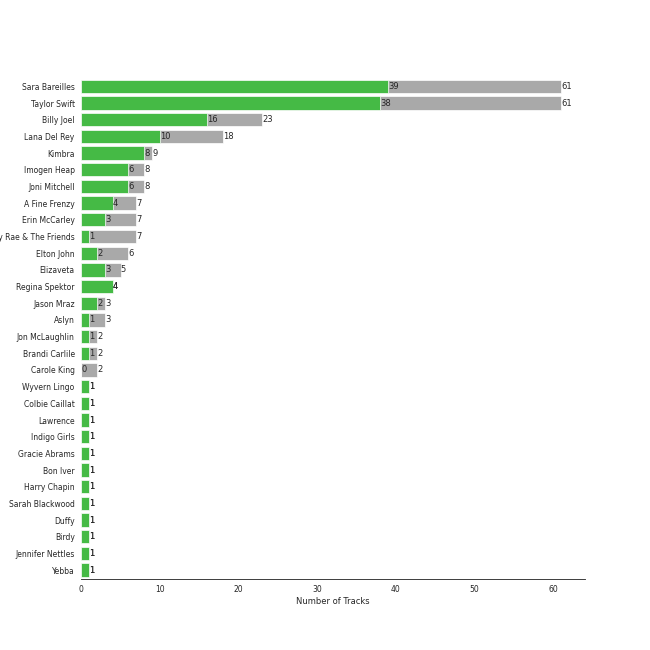
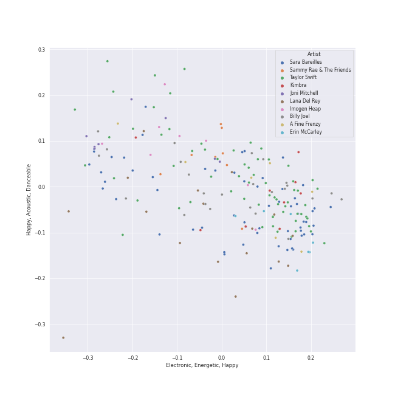
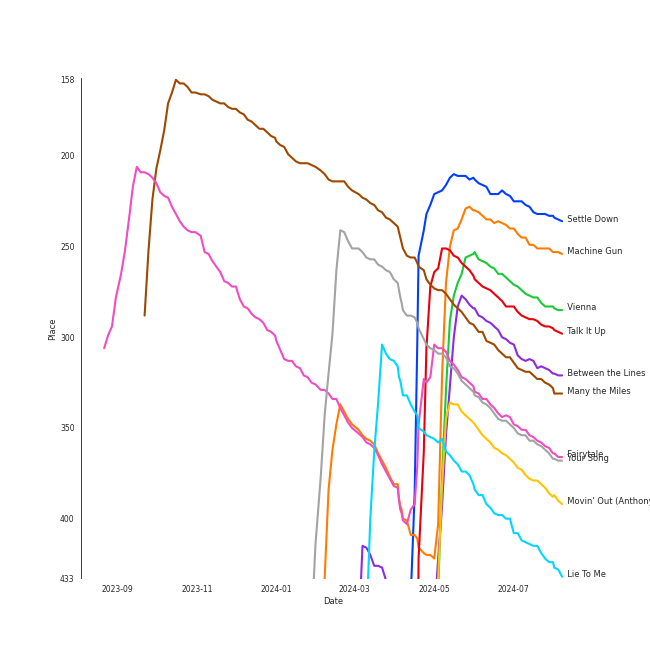
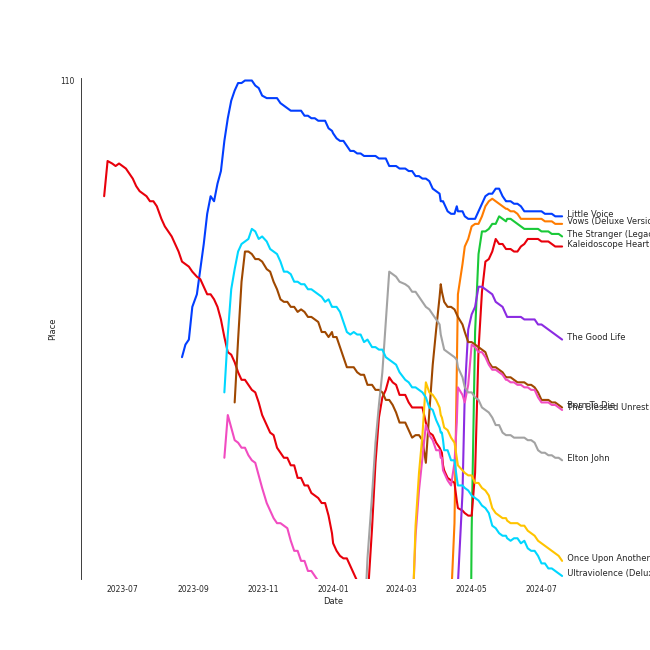
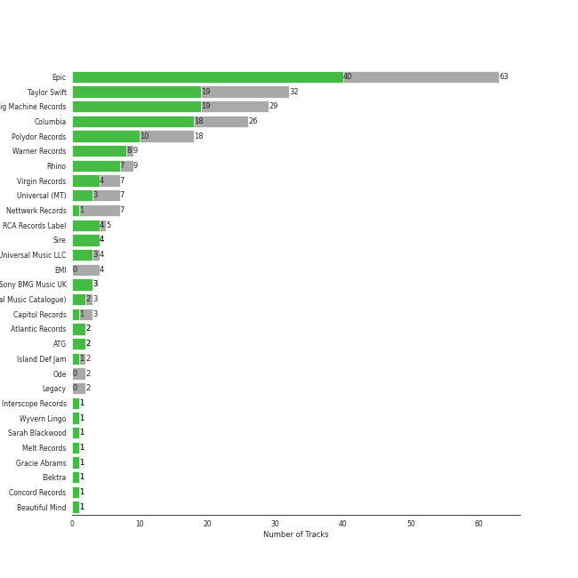
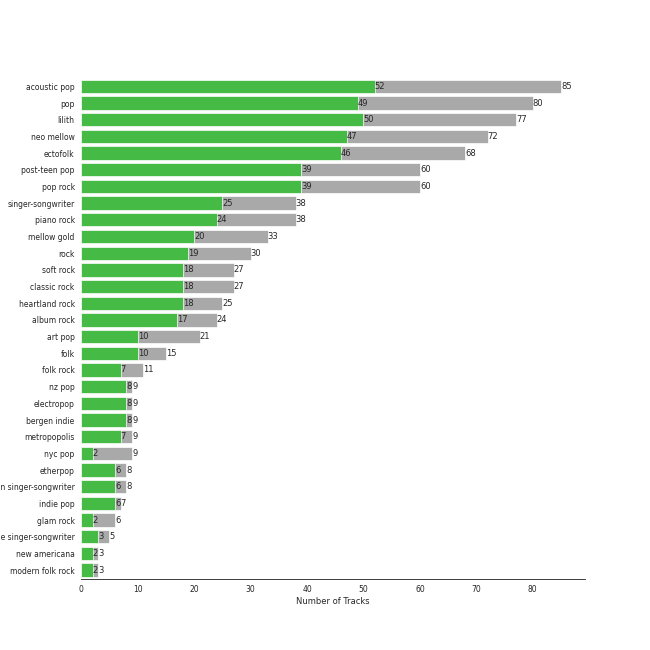
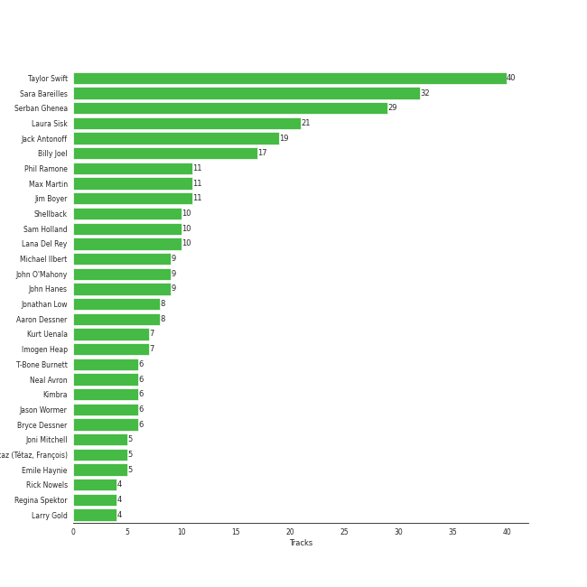
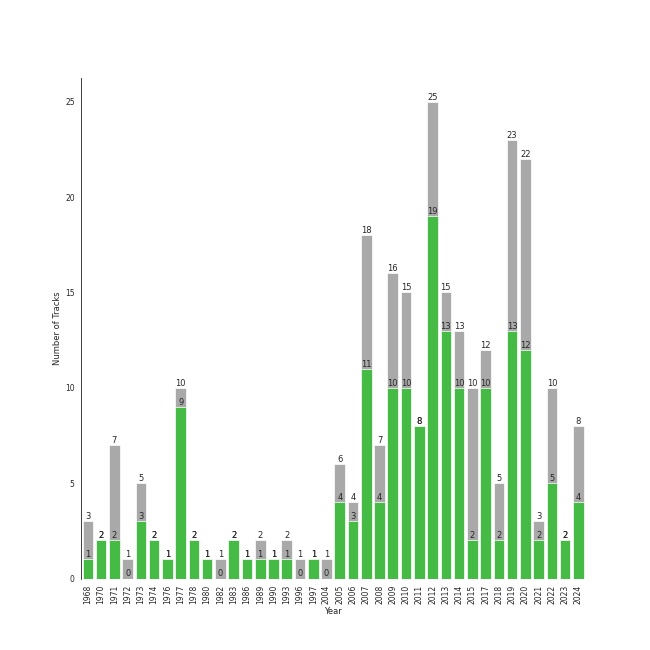

# Singer-Songwriter

[272 tracks (179 liked) 🔗](https://open.spotify.com/playlist/3aNr3GFiAvm1utXDyFOpAR)

[See Track Features](audio_features.md)

[See Clusters](clusters/overview.md)

## Top Artists

| Art | Rank | Tracks | 💚 | Artist | 🔗 |
|:---|---:|---:|---:|:---|:---|
|  | 26 | 61 | 42 | [Sara Bareilles](../../artists/sara_bareilles/overview.md) | [🔗](https://open.spotify.com/artist/2Sqr0DXoaYABbjBo9HaMkM) |
|  | 19 | 66 | 40 | [Taylor Swift](../../artists/taylor_swift/overview.md) | [🔗](https://open.spotify.com/artist/06HL4z0CvFAxyc27GXpf02) |
|  | 56 | 25 | 21 | [Billy Joel](../../artists/billy_joel/overview.md) | [🔗](https://open.spotify.com/artist/6zFYqv1mOsgBRQbae3JJ9e) |
|  | 116 | 18 | 10 | [Lana Del Rey](../../artists/lana_del_rey/overview.md) | [🔗](https://open.spotify.com/artist/00FQb4jTyendYWaN8pK0wa) |
|  | 89 | 9 | 8 | [Kimbra](../../artists/kimbra/overview.md) | [🔗](https://open.spotify.com/artist/6hk7Yq1DU9QcCCrz9uc0Ti) |
|  | 410 | 8 | 6 | [Imogen Heap](../../artists/imogen_heap/overview.md) | [🔗](https://open.spotify.com/artist/6Xb4ezwoAQC4516kI89nWz) |
|  | 379 | 8 | 5 | [Joni Mitchell](../../artists/joni_mitchell/overview.md) | [🔗](https://open.spotify.com/artist/5hW4L92KnC6dX9t7tYM4Ve) |
|  | 297 | 7 | 4 | A Fine Frenzy | [🔗](https://open.spotify.com/artist/5dTYaRzOn4rXGBLH052EeQ) |
|  | 410 | 4 | 4 | Regina Spektor | [🔗](https://open.spotify.com/artist/3z6Gk257P9jNcZbBXJNX5i) |
|  | 194 | 4 | 4 | Stella Jang | [🔗](https://open.spotify.com/artist/2Y9AUayH5pyZpVfkDYDfJV) |

See all 44 artists

| Art | Rank | Tracks | 💚 | Artist | 🔗 |
|:---|---:|---:|---:|:---|:---|
|  | 143 | 8 | 3 | Sammy Rae & The Friends | [🔗](https://open.spotify.com/artist/3lFDsTyYNPQc8WzJExnQWn) |
|  | 402 | 7 | 3 | Erin McCarley | [🔗](https://open.spotify.com/artist/6Y4bCmUNPDKqc7dHkVvgim) |
|  | 205 | 7 | 3 | Elton John | [🔗](https://open.spotify.com/artist/3PhoLpVuITZKcymswpck5b) |
|  | 410 | 5 | 3 | Elizaveta | [🔗](https://open.spotify.com/artist/2a9bCkqCkLvXM0s3uPvR7M) |
|  | 410 | 3 | 3 | Brandi Carlile | [🔗](https://open.spotify.com/artist/2sG4zTOLvjKG1PSoOyf5Ej) |
|  | 359 | 3 | 2 | Jason Mraz | [🔗](https://open.spotify.com/artist/4phGZZrJZRo4ElhRtViYdl) |
|  | 275 | 2 | 2 | Chappell Roan | [🔗](https://open.spotify.com/artist/7GlBOeep6PqTfFi59PTUUN) |
|  | 410 | 3 | 1 | Aslyn | [🔗](https://open.spotify.com/artist/6seR0G84QQq1NIW844E7Qq) |
|  | 410 | 2 | 1 | Jon McLaughlin | [🔗](https://open.spotify.com/artist/6z29S0IoiBJpSMP8plyCj7) |
|  | 410 | 2 | 1 | Feist | [🔗](https://open.spotify.com/artist/6CWTBjOJK75cTE8Xv8u1kj) |
|  | 369 | 2 | 1 | HAIM | [🔗](https://open.spotify.com/artist/4Ui2kfOqGujY81UcPrb5KE) |
|  | 410 | 1 | 1 | Wyvern Lingo | [🔗](https://open.spotify.com/artist/7etzKNDxaZ1LefgbGrexsN) |
|  | 360 | 1 | 1 | Colbie Caillat | [🔗](https://open.spotify.com/artist/6aZyMrc4doVtZyKNilOmwu) |
|  | 183 | 1 | 1 | Lawrence | [🔗](https://open.spotify.com/artist/5rwUYLyUq8gBsVaOUcUxpE) |
|  | 410 | 1 | 1 | Soccer Mommy | [🔗](https://open.spotify.com/artist/4wXchxfTTggLtzkoUhO86Q) |
|  | 410 | 1 | 1 | Indigo Girls | [🔗](https://open.spotify.com/artist/4wM29TDTr3HI0qFY3KoSFG) |
|  | 260 | 1 | 1 | Gracie Abrams | [🔗](https://open.spotify.com/artist/4tuJ0bMpJh08umKkEXKUI5) |
|  | 378 | 1 | 1 | Bon Iver | [🔗](https://open.spotify.com/artist/4LEiUm1SRbFMgfqnQTwUbQ) |
|  | 410 | 1 | 1 | Harry Chapin | [🔗](https://open.spotify.com/artist/42q4Ivs7tAiCZ5C7eG5q4c) |
|  | 410 | 1 | 1 | Sarah Blackwood | [🔗](https://open.spotify.com/artist/3ibZ40zQBPva1PoxXe8bdR) |
|  | 410 | 1 | 1 | Duffy | [🔗](https://open.spotify.com/artist/37NqXwtb6nIEqRt4EJSoIO) |
|  | 410 | 1 | 1 | David Kushner | [🔗](https://open.spotify.com/artist/33NVpKoXjItPwUJTMZIOiY) |
|  | 410 | 1 | 1 | Birdy | [🔗](https://open.spotify.com/artist/2WX2uTcsvV5OnS0inACecP) |
|  | 361 | 1 | 1 | Jennifer Nettles | [🔗](https://open.spotify.com/artist/2WV4xLQooFalR2cit0XSKp) |
|  | 277 | 1 | 1 | Phoebe Bridgers | [🔗](https://open.spotify.com/artist/1r1uxoy19fzMxunt3ONAkG) |
|  | 410 | 1 | 1 | Yebba | [🔗](https://open.spotify.com/artist/1ooV8YZC1KbpEcrmI8WH0F) |
|  | 410 | 1 | 1 | Melt | [🔗](https://open.spotify.com/artist/0G7KI9I5BApiXc5Sqpyil9) |
|  | 351 | 2 | 0 | Fiona Apple | [🔗](https://open.spotify.com/artist/3g2kUQ6tHLLbmkV7T4GPtL) |
|  | 410 | 2 | 0 | Carole King | [🔗](https://open.spotify.com/artist/319yZVtYM9MBGqmSQnMyY6) |
|  | 410 | 1 | 0 | Rachael Yamagata | [🔗](https://open.spotify.com/artist/7w0qj2HiAPIeUcoPogvOZ6) |
|  | 410 | 1 | 0 | Emily King | [🔗](https://open.spotify.com/artist/6jlWj6y00bMQt8XoKuCjyZ) |
|  | 410 | 1 | 0 | James Smith | [🔗](https://open.spotify.com/artist/543ccHFPnZfJMD8tRGPtu7) |
|  | 410 | 1 | 0 | Reina del Cid | [🔗](https://open.spotify.com/artist/1yJfLNqiKRBSdaQZco6EDR) |
|  | 410 | 1 | 0 | Carrie Manolakos | [🔗](https://open.spotify.com/artist/15ptZqEJWDBnhVx6fqaCWV) |

## Top Tracks

Most and least listened tracks

| Rank | ​ | Most listened tracks | Rank | ​​ | Least listened tracks |
|---:|:---|:---|---:|:---|:---|
| 233 |  | [Settle Down](../../artists/kimbra/overview.md) | 909 |  | [So Long, London](../../artists/taylor_swift/overview.md) |
| 253 |  | [Machine Gun](../../artists/sara_bareilles/overview.md) | 909 |  | [A Case of You](../../artists/joni_mitchell/overview.md) |
| 283 |  | [Vienna](../../artists/billy_joel/overview.md) | 909 |  | [Two Way Street](../../artists/kimbra/overview.md) |
| 295 |  | Talk It Up | 909 |  | [Hide and Seek](../../artists/imogen_heap/overview.md) |
| 319 |  | [Between the Lines](../../artists/sara_bareilles/overview.md) | 909 |  | [Uncharted](../../artists/sara_bareilles/overview.md) |
| 328 |  | [Many the Miles](../../artists/sara_bareilles/overview.md) | 909 |  | [Fuck it I love you](../../artists/lana_del_rey/overview.md) |
| 365 |  | [Fairytale](../../artists/sara_bareilles/overview.md) | 909 |  | [peace](../../artists/taylor_swift/overview.md) |
| 367 |  | Your Song | 909 |  | [Karma](../../artists/taylor_swift/overview.md) |
| 388 |  | [Movin' Out (Anthony's Song)](../../artists/billy_joel/overview.md) | 909 |  | [Once Upon Another Time](../../artists/sara_bareilles/overview.md) |
| 426 |  | [Lie To Me](../../artists/sara_bareilles/overview.md) | 909 |  | Bobble Head |

## Top Albums

| Art | Rank | Tracks | 💚 | Album | Release Date | 🔗 |
|:---|---:|---:|---:|:---|:---|:---|
|  | 177 | 13 | 10 | Kaleidoscope Heart | 2010-09-07 | [🔗](https://open.spotify.com/album/627ukPRwYxyBREHxBq0vGJ) |
|  | 245 | 12 | 12 | The Blessed Unrest | 2013-07-16 | [🔗](https://open.spotify.com/album/7lpbyGc4fHsQkBTsfWVBhp) |
|  | 164 | 12 | 8 | Little Voice | 2007-07-03 | [🔗](https://open.spotify.com/album/2Z9WUERfMjOgQ6ze9TcGbF) |
|  | 313 | 10 | 9 | reputation | 2017-11-10 | [🔗](https://open.spotify.com/album/6DEjYFkNZh67HP7R9PSZvv) |
|  | 545 | 10 | 6 | folklore | 2020-07-24 | [🔗](https://open.spotify.com/album/2fenSS68JI1h4Fo296JfGr) |
|  | 467 | 10 | 6 | Amidst the Chaos (Bonus Version) | 2019-05-10 | [🔗](https://open.spotify.com/album/5x2sDapUIdq0qk1ezff3gm) |
|  | 604 | 10 | 5 | Midnights | 2022-10-21 | [🔗](https://open.spotify.com/album/151w1FgRZfnKZA9FEcg9Z3) |
|  | 604 | 8 | 7 | 1989 | 2014-10-27 | [🔗](https://open.spotify.com/album/2QJmrSgbdM35R67eoGQo4j) |
|  | 536 | 8 | 6 | Lover | 2019-08-23 | [🔗](https://open.spotify.com/album/1NAmidJlEaVgA3MpcPFYGq) |
|  | 167 | 7 | 7 | Vows (Deluxe Version) | 2011 | [🔗](https://open.spotify.com/album/6V9rvW05Um5bIHePPfeI8p) |

See top 100 albums

| Art | Rank | Tracks | 💚 | Album | Release Date | 🔗 |
|:---|---:|---:|---:|:---|:---|:---|
|  | 173 | 7 | 7 | The Stranger (Legacy Edition) | 1977 | [🔗](https://open.spotify.com/album/1Mhn9VosyjtWn4dMPFlna6) |
|  | 580 | 7 | 3 | Love, Save The Empty | 2009 | [🔗](https://open.spotify.com/album/1tF7625TFqvfzMbappj1pQ) |
|  | 244 | 6 | 6 | Born To Die | 2012-01-30 | [🔗](https://open.spotify.com/album/4X8hAqIWpQyQks2yRhyqs4) |
|  | 568 | 6 | 3 | Red | 2012-10-22 | [🔗](https://open.spotify.com/album/1EoDsNmgTLtmwe1BDAVxV5) |
|  | 604 | 6 | 1 | What's Inside: Songs from Waitress | 2015-11-06 | [🔗](https://open.spotify.com/album/1s6codM2ZAB008t9GTyaEk) |
|  | 304 | 5 | 5 | Once Upon Another Time | 2012-05-22 | [🔗](https://open.spotify.com/album/1PrqYZJRzGNf8AsSOraxnZ) |
|  | 604 | 5 | 2 | THE TORTURED POETS DEPARTMENT: THE ANTHOLOGY | 2024-04-19 | [🔗](https://open.spotify.com/album/5H7ixXZfsNMGbIE5OBSpcb) |
|  | 604 | 4 | 3 | Ellipse | 2009-08-25 | [🔗](https://open.spotify.com/album/5AYKGPzPBJNHeKehCxMaq0) |
|  | 604 | 4 | 3 | Beatrix Runs | 2012 | [🔗](https://open.spotify.com/album/7HsPaYQbCYnxosF5WiSlEA) |
|  | 604 | 3 | 3 | Speak for Yourself | 2005-07-18 | [🔗](https://open.spotify.com/album/0t0Cr8jA63wlm8nWj7qfvJ) |
|  | 604 | 3 | 3 | Begin to Hope | 2006-06-13 | [🔗](https://open.spotify.com/album/4L4tcx3itXbtx5kuchKhFE) |
|  | 604 | 3 | 2 | evermore | 2020-12-11 | [🔗](https://open.spotify.com/album/2Xoteh7uEpea4TohMxjtaq) |
|  | 216 | 3 | 2 | The Good Life | 2018-07-10 | [🔗](https://open.spotify.com/album/4s1igjt5YJe7s7BdCeX3DX) |
|  | 594 | 3 | 2 | One Cell In The Sea | 2007 | [🔗](https://open.spotify.com/album/0Ot7MEgreG2R93aN42M9iK) |
|  | 377 | 3 | 2 | Bomb In A Birdcage | 2009-01-01 | [🔗](https://open.spotify.com/album/07IV5RxLvAUeZbcPm4zOzn) |
|  | 604 | 3 | 2 | Blue | 1971-06-22 | [🔗](https://open.spotify.com/album/1vz94WpXDVYIEGja8cjFNa) |
|  | 311 | 3 | 1 | Ultraviolence (Deluxe) | 2014-01-01 | [🔗](https://open.spotify.com/album/1ORxRsK3MrSLvh7VQTF01F) |
|  | 546 | 3 | 1 | Song to a Seagull | 1968-03-01 | [🔗](https://open.spotify.com/album/6rg3WTvmv68Vd6tgR0yS0E) |
|  | 604 | 3 | 1 | Lemon Love | 2005-01-01 | [🔗](https://open.spotify.com/album/5YToJrWwzdA6W2NxxDoteE) |
|  | 604 | 3 | 0 | Norman Fucking Rockwell! | 2019-08-30 | [🔗](https://open.spotify.com/album/5XpEKORZ4y6OrCZSKsi46A) |
|  | 604 | 3 | 0 | Fearless | 2008-11-11 | [🔗](https://open.spotify.com/album/2dqn5yOQWdyGwOpOIi9O4x) |
|  | 509 | 2 | 2 | We Sing. We Dance. We Steal Things. | 2008-05-12 | [🔗](https://open.spotify.com/album/04G0YylSjvDQZrjOfE5jA5) |
|  | 604 | 2 | 2 | Glass Houses | 1980-03-12 | [🔗](https://open.spotify.com/album/5sztejERqpktXEdemlUvU5) |
|  | 603 | 2 | 2 | An Innocent Man | 1983-08-08 | [🔗](https://open.spotify.com/album/3R3x4zIabsvpD3yxqLaUpc) |
|  | 604 | 2 | 2 | 52nd Street | 1978-10-13 | [🔗](https://open.spotify.com/album/1HmCO8VK98AU6EXPOjGYyI) |
|  | 604 | 2 | 1 | The Reminder | 2007-01-01 | [🔗](https://open.spotify.com/album/7bTdGfczXffzzNE9ssJj4Z) |
|  | 604 | 2 | 1 | Storm Front | 1989-10-17 | [🔗](https://open.spotify.com/album/1Vw2uoVkLAJFVViJ1QyK1D) |
|  | 604 | 2 | 1 | River Of Dreams | 1993-08-10 | [🔗](https://open.spotify.com/album/4HPnwQJAEvTY910q4RNeOu) |
|  | 604 | 2 | 1 | Lust For Life | 2017-07-21 | [🔗](https://open.spotify.com/album/7xYiTrbTL57QO0bb4hXIKo) |
|  | 538 | 2 | 1 | I Get It Now | 2024-04-12 | [🔗](https://open.spotify.com/album/5zZHAGHasjwkR9B1xX3Xq6) |
|  | 604 | 2 | 1 | Goodbye Yellow Brick Road (Remastered) | 1973-10-05 | [🔗](https://open.spotify.com/album/5WupqgR68HfuHt3BMJtgun) |
|  | 604 | 2 | 0 | Tapestry | 1971 | [🔗](https://open.spotify.com/album/12n11cgnpjXKLeqrnIERoS) |
|  | 604 | 2 | 0 | Speak Now | 2010-10-25 | [🔗](https://open.spotify.com/album/5MfAxS5zz8MlfROjGQVXhy) |
|  | 314 | 1 | 1 | minor | 2020-07-14 | [🔗](https://open.spotify.com/album/2UZw04wDxLVceADw2Gi1Qy) |
|  | 604 | 1 | 1 | i'm confident that i'm insecure | 2023-08-11 | [🔗](https://open.spotify.com/album/3BOQyggLEixg4CLYgheD3X) |
|  | 604 | 1 | 1 | color theory | 2020-02-28 | [🔗](https://open.spotify.com/album/2CISL0rSGzbO0MbQMlqBez) |
|  | 604 | 1 | 1 | Waves | 2020-10-09 | [🔗](https://open.spotify.com/album/4J4lVYyekfRZXTlAukqGw4) |
|  | 604 | 1 | 1 | Verities & Balderdash | 1974 | [🔗](https://open.spotify.com/album/3nta4nhqWoWjc6LmHIB0kT) |
|  | 604 | 1 | 1 | Under Caffeine | 2018-09-01 | [🔗](https://open.spotify.com/album/0xx0aVmnZiiqsFfKRTXOJp) |
|  | 604 | 1 | 1 | Turnstiles | 1976-05-19 | [🔗](https://open.spotify.com/album/7GiLfxL1su3MSqz7pmKMZi) |
|  | 604 | 1 | 1 | Turn the Lights Back On | 2024-02-01 | [🔗](https://open.spotify.com/album/4csPGLYTb7kt85U377UCuC) |
|  | 604 | 1 | 1 | The Widow Knows E.P. | 2014-08-14 | [🔗](https://open.spotify.com/album/548WnictHrfJKj2u6tXqFe) |
|  | 604 | 1 | 1 | The Rise and Fall of a Midwest Princess | 2023-09-22 | [🔗](https://open.spotify.com/album/0EiI8ylL0FmWWpgHVTsZjZ) |
|  | 604 | 1 | 1 | The Golden Echo | 2014-08-15 | [🔗](https://open.spotify.com/album/66hoUkjxM7tVQwu7bZocwP) |
|  | 604 | 1 | 1 | The Firewatcher's Daughter | 2015-03-06 | [🔗](https://open.spotify.com/album/5ZpxRLVRkCZ2BXXW1KYbTB) |
|  | 444 | 1 | 1 | The Bridge | 1986-07-28 | [🔗](https://open.spotify.com/album/2fRxSC6FtiAkhEDVZr2seH) |
|  | 604 | 1 | 1 | Stairs | 2021-10-15 | [🔗](https://open.spotify.com/album/0s3ME19b7uNfrBvKXBFwM7) |
|  | 604 | 1 | 1 | STELLA I | 2020-04-07 | [🔗](https://open.spotify.com/album/1TCX395u7CaSsCLtiwsMAN) |
|  | 604 | 1 | 1 | Rockferry | 2008-01-01 | [🔗](https://open.spotify.com/album/6freV6eqxuFjSr3E93Oqtz) |
|  | 604 | 1 | 1 | Punisher | 2020-06-18 | [🔗](https://open.spotify.com/album/6Pp6qGEywDdofgFC1oFbSH) |
|  | 575 | 1 | 1 | Piano Man (Legacy Edition) | 1973-11-07 | [🔗](https://open.spotify.com/album/69wjSAZXZiD2EBia3b3gxL) |
|  | 604 | 1 | 1 | Piano Man | 1973-11-09 | [🔗](https://open.spotify.com/album/77ErLrVvYETIlQJHAwhfIH) |
|  | 604 | 1 | 1 | Paradise | 2012-11-09 | [🔗](https://open.spotify.com/album/1JnjcAIKQ9TSJFVFierTB8) |
|  | 604 | 1 | 1 | October Sky | 2021-06-11 | [🔗](https://open.spotify.com/album/6w7gENsq0E5THRxQZkA1D0) |
|  | 604 | 1 | 1 | OK Now | 2008-01-01 | [🔗](https://open.spotify.com/album/3fKJJQFV6a61fnKYDDj2LU) |
|  | 604 | 1 | 1 | Nomads · Indians · Saints (Expanded Edition) | 1990-09-21 | [🔗](https://open.spotify.com/album/1KpKdn4HLsD9OAN6GEYAIb) |
|  | 604 | 1 | 1 | Ladies of the Canyon | 1970-03-01 | [🔗](https://open.spotify.com/album/7JOdtLDLyXJIppDRB7kxr9) |
|  | 604 | 1 | 1 | Howling at Nothing (Live) | 2019-11-25 | [🔗](https://open.spotify.com/album/54mdEMyT4S1DYytRgXMvg4) |
|  | 604 | 1 | 1 | Greatest Hits Vol. III | 1997-06-13 | [🔗](https://open.spotify.com/album/3cJ6ZymbUcNGe1T8YZtGyE) |
|  | 333 | 1 | 1 | Good Luck, Babe! | 2024-04-05 | [🔗](https://open.spotify.com/album/1WAjjRMfZjEXtB0lQrAw6Q) |
|  | 604 | 1 | 1 | Give Up The Ghost | 2009-10-05 | [🔗](https://open.spotify.com/album/1NhFksWs1Nsz6wQI8ysTkv) |
|  | 604 | 1 | 1 | Far | 2009-06-09 | [🔗](https://open.spotify.com/album/5t0lQDPLF22wmWCtSZkIVv) |
|  | 264 | 1 | 1 | Elton John | 1970-04-10 | [🔗](https://open.spotify.com/album/69P9Ro0W286yLFgYwrGVN0) |
|  | 604 | 1 | 1 | Days Are Gone | 2013-09-30 | [🔗](https://open.spotify.com/album/729Vh0HApsm7hGDVjbmtrf) |
|  | 604 | 1 | 1 | Daylight | 2023-04-14 | [🔗](https://open.spotify.com/album/6NcI39WPu4kY6Tul11nhSv) |
|  | 604 | 1 | 1 | Court and Spark | 1974-01-17 | [🔗](https://open.spotify.com/album/2akjxkzFolkeV72Yyv5KrM) |
|  | 604 | 1 | 1 | Colors | 2016-10-06 | [🔗](https://open.spotify.com/album/419WgjPNItZIDgjd1GSgrO) |
|  | 604 | 1 | 1 | Birdy | 2011-11-04 | [🔗](https://open.spotify.com/album/1WGjSVIw0TVfbp5KrOFiP0) |
|  | 604 | 1 | 1 | Bear Creek | 2012-06-04 | [🔗](https://open.spotify.com/album/5b8YTIrc88vdnfRguZqvVE) |
|  | 512 | 1 | 1 | Always Like New | 2021-06-25 | [🔗](https://open.spotify.com/album/1mDOfTvqqstiKHpmjNjYdU) |
|  | 604 | 1 | 0 | Young And Beautiful | 2013-01-01 | [🔗](https://open.spotify.com/album/1D92WOHWUI2AGQCCdplcXL) |
|  | 604 | 1 | 0 | Whatever We Feel | 2020-04-03 | [🔗](https://open.spotify.com/album/4Qcemk272gcxq9D6ca40Xz) |
|  | 604 | 1 | 0 | Tidal | 1996-07-23 | [🔗](https://open.spotify.com/album/5gVBXH8MT6zfdRkjp7qT18) |
|  | 604 | 1 | 0 | The Nylon Curtain | 1982-06-23 | [🔗](https://open.spotify.com/album/50bajZpetfL5T0iRCOR74J) |
|  | 604 | 1 | 0 | The Cooling | 2015-06-15 | [🔗](https://open.spotify.com/album/2mvXcm5iWkQqOVzilYzgqh) |
|  | 604 | 1 | 0 | Sides | 2020-01-17 | [🔗](https://open.spotify.com/album/5alIr9JGPvOQwPLphm0beJ) |
|  | 604 | 1 | 0 | Saw It Coming | 2019-05-10 | [🔗](https://open.spotify.com/album/1rMlFYPvk8FFDQYIJ8pudV) |
|  | 604 | 1 | 0 | Primal Heart | 2018-04-20 | [🔗](https://open.spotify.com/album/4pj0BkJ7u39i009oqe8V79) |
|  | 604 | 1 | 0 | PINES | 2012-01-01 | [🔗](https://open.spotify.com/album/1876e9QcHkJ3Hgo4NqKXBN) |
|  | 604 | 1 | 0 | More Love - Songs from Little Voice Season One | 2020-09-04 | [🔗](https://open.spotify.com/album/52fzvqGSm991mT6pBgAS6g) |
|  | 604 | 1 | 0 | Messenger | 2015-06-29 | [🔗](https://open.spotify.com/album/3yQJY0tg0M2rQwWYUgkVQp) |
|  | 604 | 1 | 0 | Madman Across The Water | 1971-11-05 | [🔗](https://open.spotify.com/album/2OZbaW9tgO62ndm375lFZr) |
|  | 604 | 1 | 0 | Little Love - EP | 2018-06-01 | [🔗](https://open.spotify.com/album/2PLM1yTphJeFZg01Xiaumc) |
|  | 604 | 1 | 0 | Jackie Onassis | 2020-06-05 | [🔗](https://open.spotify.com/album/0E8rl16O1VgYyRMRzff3r6) |
|  | 604 | 1 | 0 | Indiana | 2007-01-01 | [🔗](https://open.spotify.com/album/2UpO4j1Zpptiwk3wbUIWmU) |
|  | 604 | 1 | 0 | Honky Chateau | 1972-05-19 | [🔗](https://open.spotify.com/album/2ei2X6ghPnw7YRwQtAH075) |
|  | 604 | 1 | 0 | Honeymoon | 2015-09-18 | [🔗](https://open.spotify.com/album/2DpEBrjCur1ythIZ10gJWw) |
|  | 604 | 1 | 0 | Happenstance (Deluxe Version) | 2004-06-08 | [🔗](https://open.spotify.com/album/66p6CIMdxQFO3Igg9xo14a) |
|  | 604 | 1 | 0 | Goodnight And Go | 2006-05-02 | [🔗](https://open.spotify.com/album/3JYjYjUAoBjxXr1W8eDVLV) |
|  | 604 | 1 | 0 | Fetch The Bolt Cutters | 2020-04-17 | [🔗](https://open.spotify.com/album/0fO1KemWL2uCCQmM22iKlj) |

## Top Record Labels

| Tracks | 💚 | Label |
|---:|---:|:---|
| 64 | 43 | [Epic](../../labels/epic/overview.md) |
| 28 | 24 | [Columbia](../../labels/columbia/overview.md) |
| 37 | 21 | [Taylor Swift](../../labels/taylor_swift/overview.md) |
| 29 | 19 | [Big Machine Records](../../labels/big_machine_records/overview.md) |
| 18 | 10 | [Polydor Records](../../labels/polydor_records/overview.md) |
| 10 | 8 | [Legacy](../../labels/legacy/overview.md) |
| 9 | 8 | [Warner Records](../../labels/warner_records/overview.md) |
| 9 | 6 | [Rhino](../../labels/rhino/overview.md) |
| 7 | 4 | [Virgin Records](../../labels/virgin_records/overview.md) |
| 5 | 4 | [RCA Records Label](../../labels/rca_records_label/overview.md) |

See all 48 labels

| Tracks | 💚 | Label |
|---:|---:|:---|
| 4 | 4 | Sire |
| 8 | 3 | [Nettwerk Music Group](../../labels/nettwerk_music_group/overview.md) |
| 7 | 3 | Universal (MT) |
| 4 | 3 | [Universal Music LLC](../../labels/universal_music_llc/overview.md) |
| 3 | 3 | Sony BMG Music UK |
| 3 | 2 | [UMC (Universal Music Catalogue)](../../labels/umc_(universal_music_catalogue)/overview.md) |
| 2 | 2 | [Island Records](../../labels/island_records/overview.md) |
| 2 | 2 | GRDL |
| 2 | 2 | Chappell Roan PS |
| 2 | 2 | [Atlantic Records](../../labels/atlantic_records/overview.md) |
| 2 | 2 | ATG |
| 3 | 1 | [Capitol Records](../../labels/capitol_records/overview.md) |
| 2 | 1 | Universal Music Division Decca Records France |
| 2 | 1 | Island Def Jam |
| 2 | 1 | ATO Records |
| 1 | 1 | under exclusive license to Interscope Records |
| 1 | 1 | Wyvern Lingo |
| 1 | 1 | Sarah Blackwood |
| 1 | 1 | Miserable Music Group |
| 1 | 1 | Melt Records |
| 1 | 1 | Loma Vista Recordings |
| 1 | 1 | Gracie Abrams |
| 1 | 1 | GRANDLINE |
| 1 | 1 | GLG |
| 1 | 1 | Elektra |
| 1 | 1 | Dead Oceans |
| 1 | 1 | Concord Records |
| 1 | 1 | Beautiful Mind |
| 1 | 1 | Atlantic Records UK |
| 4 | 0 | [EMI](../../labels/emi/overview.md) |
| 2 | 0 | Ode |
| 1 | 0 | Work |
| 1 | 0 | Reina Del Cid |
| 1 | 0 | RCA Victor |
| 1 | 0 | Private Music |
| 1 | 0 | Flower Army Records |
| 1 | 0 | Clean Slate |
| 1 | 0 | Carrie Manolakos |

## Genres

| Tracks | 💚 | Genre |
|---:|---:|:---|
| 85 | 56 | [acoustic pop](../../genres/acoustic_pop/overview.md) |
| 77 | 54 | [lilith](../../genres/lilith/overview.md) |
| 85 | 51 | [pop](../../genres/pop/overview.md) |
| 72 | 50 | [neo mellow](../../genres/neo_mellow/overview.md) |
| 64 | 46 | [ectofolk](../../genres/ectofolk/overview.md) |
| 60 | 42 | [post-teen pop](../../genres/post-teen_pop/overview.md) |
| 60 | 42 | [pop rock](../../genres/pop_rock/overview.md) |
| 39 | 28 | [singer-songwriter](../../genres/singer-songwriter/overview.md) |
| 39 | 28 | [piano rock](../../genres/piano_rock/overview.md) |
| 34 | 24 | [mellow gold](../../genres/mellow_gold/overview.md) |

See all 62 genres

| Tracks | 💚 | Genre |
|---:|---:|:---|
| 31 | 23 | [rock](../../genres/rock/overview.md) |
| 28 | 22 | [soft rock](../../genres/soft_rock/overview.md) |
| 28 | 22 | [classic rock](../../genres/classic_rock/overview.md) |
| 25 | 21 | [album rock](../../genres/album_rock/overview.md) |
| 22 | 11 | [art pop](../../genres/art_pop/overview.md) |
| 15 | 10 | [folk](../../genres/folk/overview.md) |
| 10 | 9 | indie pop |
| 9 | 8 | nz pop |
| 9 | 8 | electropop |
| 9 | 8 | bergen indie |
| 9 | 7 | metropopolis |
| 11 | 6 | folk rock |
| 8 | 6 | etherpop |
| 8 | 5 | canadian singer-songwriter |
| 10 | 4 | nyc pop |
| 4 | 4 | korean city pop |
| 5 | 3 | deep indie singer-songwriter |
| 3 | 3 | pov: indie |
| 3 | 3 | new americana |
| 3 | 3 | modern folk rock |
| 3 | 3 | indie folk |
| 6 | 2 | glam rock |
| 3 | 2 | indie rock |
| 2 | 2 | [dance pop](../../genres/dance_pop/overview.md) |
| 4 | 1 | chamber pop |
| 2 | 1 | [uk pop](../../genres/uk_pop/overview.md) |
| 2 | 1 | pop soul |
| 2 | 1 | indy indie |
| 2 | 1 | [canadian pop](../../genres/canadian_pop/overview.md) |
| 2 | 1 | canadian indie |
| 1 | 1 | women's music |
| 1 | 1 | [viral pop](../../genres/viral_pop/overview.md) |
| 1 | 1 | small room |
| 1 | 1 | singer-songwriter pop |
| 1 | 1 | retro soul |
| 1 | 1 | la indie |
| 1 | 1 | irish pop |
| 1 | 1 | indietronica |
| 1 | 1 | indie soul |
| 1 | 1 | gen z singer-songwriter |
| 1 | 1 | country rock |
| 1 | 1 | country road |
| 1 | 1 | country dawn |
| 1 | 1 | country |
| 1 | 1 | contemporary country |
| 1 | 1 | bubblegrunge |
| 1 | 1 | british soul |
| 1 | 1 | alt z |
| 2 | 0 | [permanent wave](../../genres/permanent_wave/overview.md) |
| 2 | 0 | dark pop |
| 2 | 0 | brill building pop |
| 1 | 0 | minneapolis indie |

## Top Producers

| Art | Producer | Tracks | Credit Types |
|:---|:---|---:|:---|
|  | [Taylor Swift](../../artists/taylor_swift/overview.md) | 40 | Producer, Songwriter, Lyricist |
|  | [Sara Bareilles](../../artists/sara_bareilles/overview.md) | 32 | Lyricist, Songwriter, Producer |
| | [Serban Ghenea](../../producers/serban_ghenea/overview.md) | 30 | Producer |
| | [Laura Sisk](../../producers/laura_sisk/overview.md) | 21 | Producer |
|  | [Billy Joel](../../artists/billy_joel/overview.md) | 19 | Lyricist, Producer, Songwriter, Arranger |
| | [Jack Antonoff](../../producers/jack_antonoff/overview.md) | 19 | Producer, Songwriter |
| | [Phil Ramone](../../producers/phil_ramone/overview.md) | 13 | Producer |
| | [Jim Boyer](../../producers/jim_boyer/overview.md) | 13 | Producer |
| | [Max Martin](../../producers/max_martin/overview.md) | 11 | Producer, Songwriter, Lyricist |
| | [Sam Holland](../../producers/sam_holland/overview.md) | 10 | Producer |

View all

| Art | Producer | Tracks | Credit Types |
|:---|:---|---:|:---|
| | [Shellback](../../producers/shellback/overview.md) | 10 | Producer, Songwriter, Lyricist |
|  | [Lana Del Rey](../../artists/lana_del_rey/overview.md) | 10 | Songwriter, Lyricist, Producer |
| | John O'Mahony | 9 | Producer |
| | Michael Ilbert | 9 | Producer |
| | [John Hanes](../../producers/john_hanes/overview.md) | 9 | Producer |
| | [Aaron Dessner](../../producers/aaron_dessner/overview.md) | 8 | Producer, Songwriter |
| | Jonathan Low | 8 | Producer |
|  | [Imogen Heap](../../artists/imogen_heap/overview.md) | 7 | Lyricist, Producer, Songwriter |
| | Kurt Uenala | 7 | Producer |
| | Jason Wormer | 6 | Producer |
|  | [Kimbra](../../artists/kimbra/overview.md) | 6 | Lyricist, Producer, Songwriter |
| | T-Bone Burnett | 6 | Producer |
| | Neal Avron | 6 | Arranger, Producer |
| | Bryce Dessner | 6 | Arranger |
| | [François Tétaz (Tétaz, François)](../../producers/françois_tétaz_(tétaz,_françois)/overview.md) | 5 | Lyricist, Producer, Songwriter |
|  | [Joni Mitchell](../../artists/joni_mitchell/overview.md) | 5 | Lyricist, Songwriter, Producer |
| | Emile Haynie | 5 | Producer |
| | Rick Nowels | 4 | Producer, Songwriter, Lyricist |
| | Dan Grech-Marguerat | 4 | Producer |
| | Larry Gold | 4 | Arranger |
| | Justin Niebank | 4 | Producer |
|  | Regina Spektor | 4 | Lyricist, Producer, Songwriter |
| | Kyle Resnick | 4 | Producer |
| | Craig Bishop | 3 | Producer |
| | Nathan Chapman | 3 | Producer |
| | Mark Endert | 3 | Producer |
| | David Kahne | 3 | Producer |
| | [Sounwave](../../producers/sounwave/overview.md) | 3 | Producer, Songwriter |
| | Justin Parker | 3 | Producer, Songwriter |
| | James McAlister | 3 | Producer |
|  | Brandi Carlile | 2 | Songwriter, Lyricist, Producer |
| | Justin Tranter | 2 | Songwriter |
| | Zoë Kravitz (Kravitz, Zoë) | 2 | Songwriter |
| | Todor Kobakov | 2 | Arranger |
| | Alison Sudol | 2 | Lyricist, Songwriter |
| | Michael Brauer | 2 | Producer |
| | Bella Blasko | 2 | Producer |
| | Thomas Bartlett | 2 | Producer |
| | [Daniel Nigro](../../producers/daniel_nigro/overview.md) | 2 | Producer, Songwriter |
| | Martin Terefe | 2 | Producer |
| | Michael Omartian | 2 | Arranger |
| | Joseph Lorge | 2 | Producer |
| | Clarice Jensen | 2 | Producer |
| | M-Phazes | 2 | Producer |
| | Lukas Burton | 2 | Producer, Songwriter |
| | Rob Moose | 2 | Arranger, Producer |
|  | Chappell Roan | 2 | Songwriter |
| | Dann Huff | 2 | Producer |
|  | Elton John | 2 | Songwriter |
| | Jeremy Darby | 2 | Producer |
| | Jahaan Sweet | 2 | Producer, Songwriter |
| | Tim Hanseroth | 2 | Songwriter, Producer |
| | David Huff | 2 | Producer |
| | Hal Cragin | 2 | Producer, Songwriter |
|  | Jason Mraz | 2 | Lyricist, Songwriter, Producer |
| | Mike Piersante | 2 | Producer |
| | Bernie Taupin | 2 | Lyricist |
| | Justin Vernon | 2 | Lyricist, Songwriter, Producer |
| | Ali Payami | 2 | Lyricist, Producer, Songwriter |
| | Steve Marcantonio | 2 | Producer |
| | Bryce Bordone | 2 | Producer |
| | Ron Malo | 2 | Producer |
| | Jonathan Gautier | 2 | Producer |
| | Tim Larcombe | 2 | Songwriter, Producer |
| | Matt Hales | 2 | Songwriter |
| | Michael Stewart | 2 | Producer |
| | Collin Dupuis | 1 | Producer |
| | Chilly Gonzales | 1 | Producer |
| | John Hendrickson | 1 | Producer |
| | Renaud Letang | 1 | Producer |
| | Amy Kuney | 1 | Songwriter |
| | Braxton Cook | 1 | Producer |
| | Steve Lindsey | 1 | Arranger, Producer |
| | Brent Kolatalo | 1 | Producer |
|  | Feist | 1 | Producer, Songwriter |
| | Fred Tenny | 1 | Producer |
| | Zachary Dawes | 1 | Producer |
| | Scott Litt | 1 | Producer |
| | Dave Nelson | 1 | Producer |
|  | Harry Chapin | 1 | Songwriter |
| | Suzie Katayama | 1 | Arranger |
| | Gabe Wax | 1 | Producer |
| | Tony Berg | 1 | Producer |
| | Phil Hanseroth | 1 | Producer |
| | Gus Dudgeon | 1 | Producer |
| | Brian David Willis | 1 | Producer |
| | Aaron Sterling | 1 | Songwriter |
| | David Schiffman | 1 | Producer |
| | Fagan Wilcox | 1 | Producer |
| | Fred Fairbrass | 1 | Songwriter |

## Years

View all years

| Year | Number of Tracks |
|:---|---:|
| 2024 | 9 |
| 2023 | 3 |
| 2022 | 10 |
| 2021 | 4 |
| [2020](2020/overview.md) | 23 |
| [2019](2019/overview.md) | 23 |
| 2018 | 6 |
| 2017 | 12 |
| 2016 | 1 |
| 2015 | 10 |
| 2014 | 13 |
| 2013 | 15 |
| [2012](2012/overview.md) | 25 |
| 2011 | 8 |
| 2010 | 15 |
| 2009 | 16 |
| 2008 | 7 |
| 2007 | 18 |
| 2006 | 4 |
| 2005 | 6 |
| 2004 | 1 |
| 1997 | 1 |
| 1996 | 1 |
| 1993 | 2 |
| 1990 | 1 |
| 1989 | 2 |
| 1986 | 1 |
| 1983 | 2 |
| 1982 | 1 |
| 1980 | 2 |
| 1978 | 2 |
| 1977 | 7 |
| 1976 | 1 |
| 1974 | 2 |
| 1973 | 5 |
| 1972 | 1 |
| 1971 | 7 |
| 1970 | 2 |
| 1968 | 3 |

| ​ | 10 newest albums | ​​ | 10 oldest albums |
|:---|:---|:---|:---|
|  | THE TORTURED POETS DEPARTMENT: THE ANTHOLOGY (2024-04-19) |  | Song to a Seagull (1968-03-01) |
|  | I Get It Now (2024-04-12) |  | Ladies of the Canyon (1970-03-01) |
|  | Good Luck, Babe! (2024-04-05) |  | Elton John (1970-04-10) |
|  | Turn the Lights Back On (2024-02-01) |  | Tapestry (1971) |
|  | The Rise and Fall of a Midwest Princess (2023-09-22) |  | Blue (1971-06-22) |
|  | i'm confident that i'm insecure (2023-08-11) |  | Cold Spring Harbor (1971-11-01) |
|  | Daylight (2023-04-14) |  | Madman Across The Water (1971-11-05) |
|  | Midnights (2022-10-21) |  | Honky Chateau (1972-05-19) |
|  | Stairs (2021-10-15) |  | Don't Shoot Me I'm Only The Piano Player (1973-01-22) |
|  | Always Like New (2021-06-25) |  | Goodbye Yellow Brick Road (Remastered) (1973-10-05) |