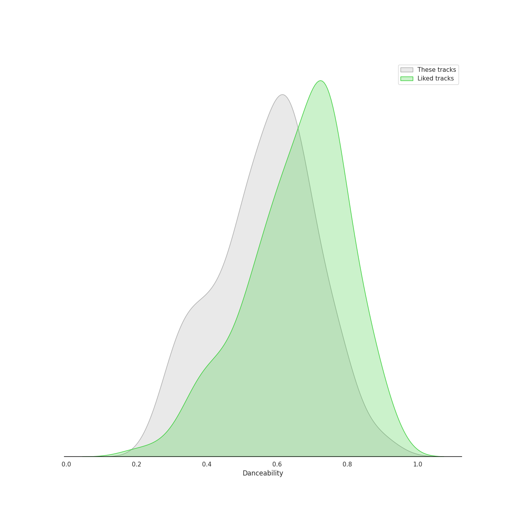
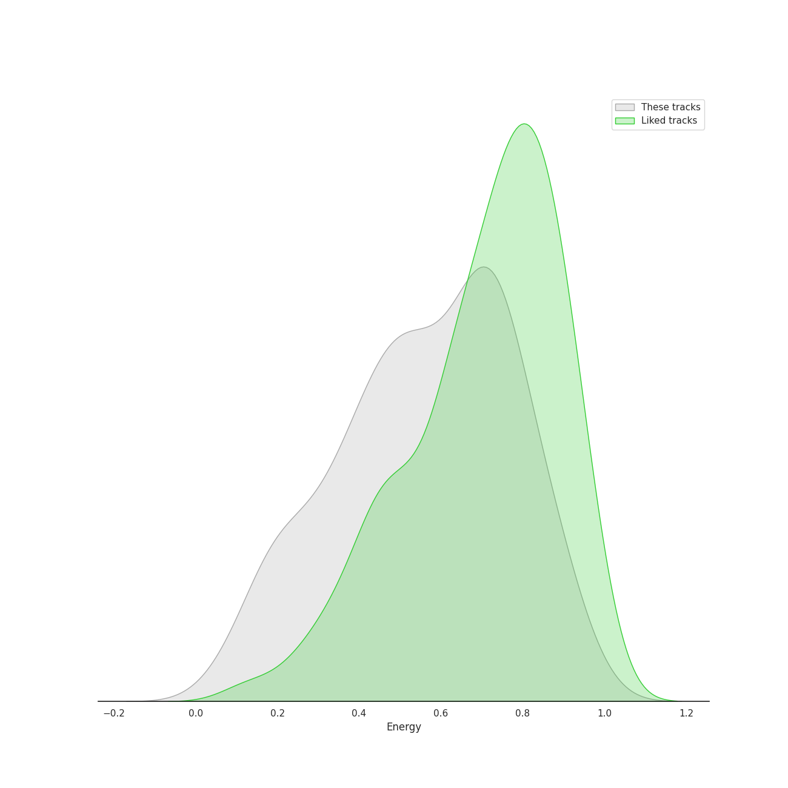
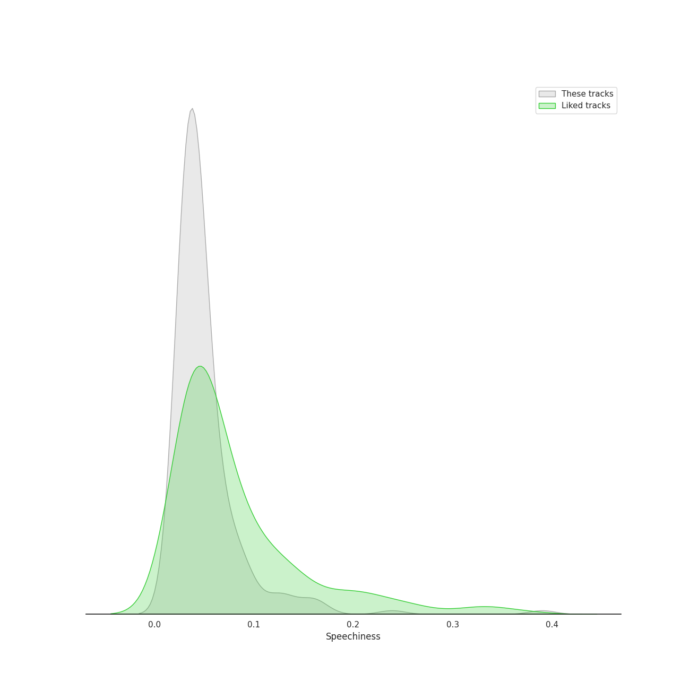
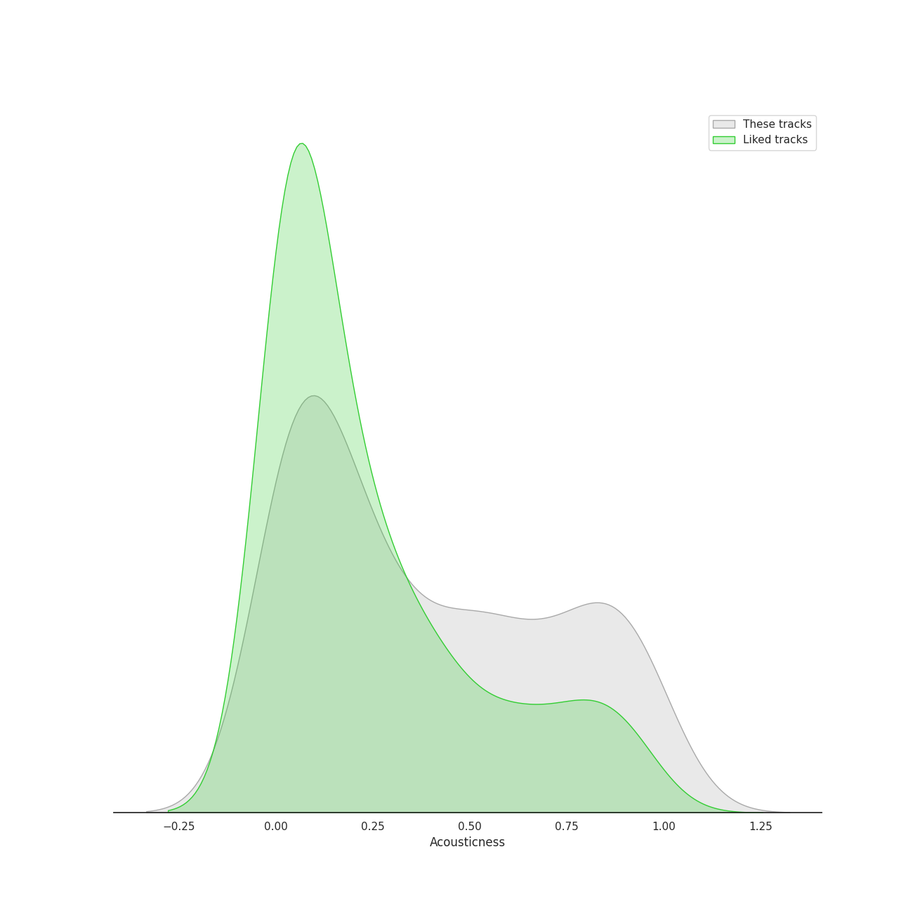
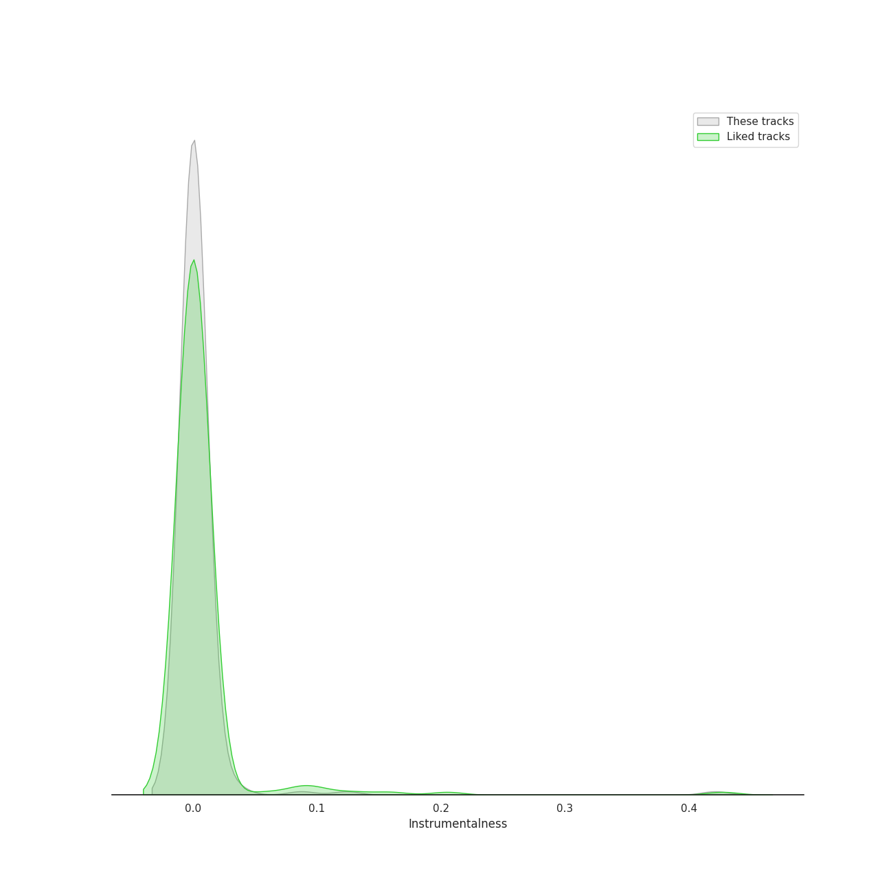
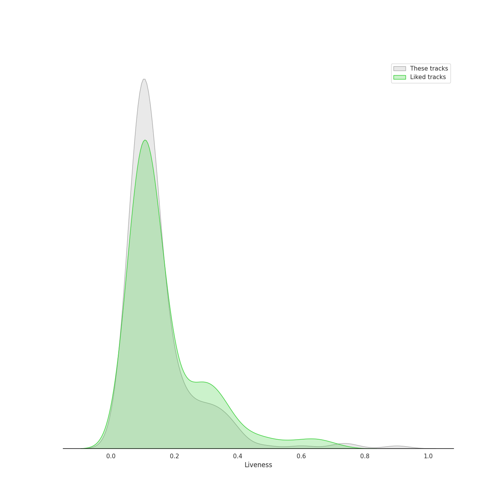
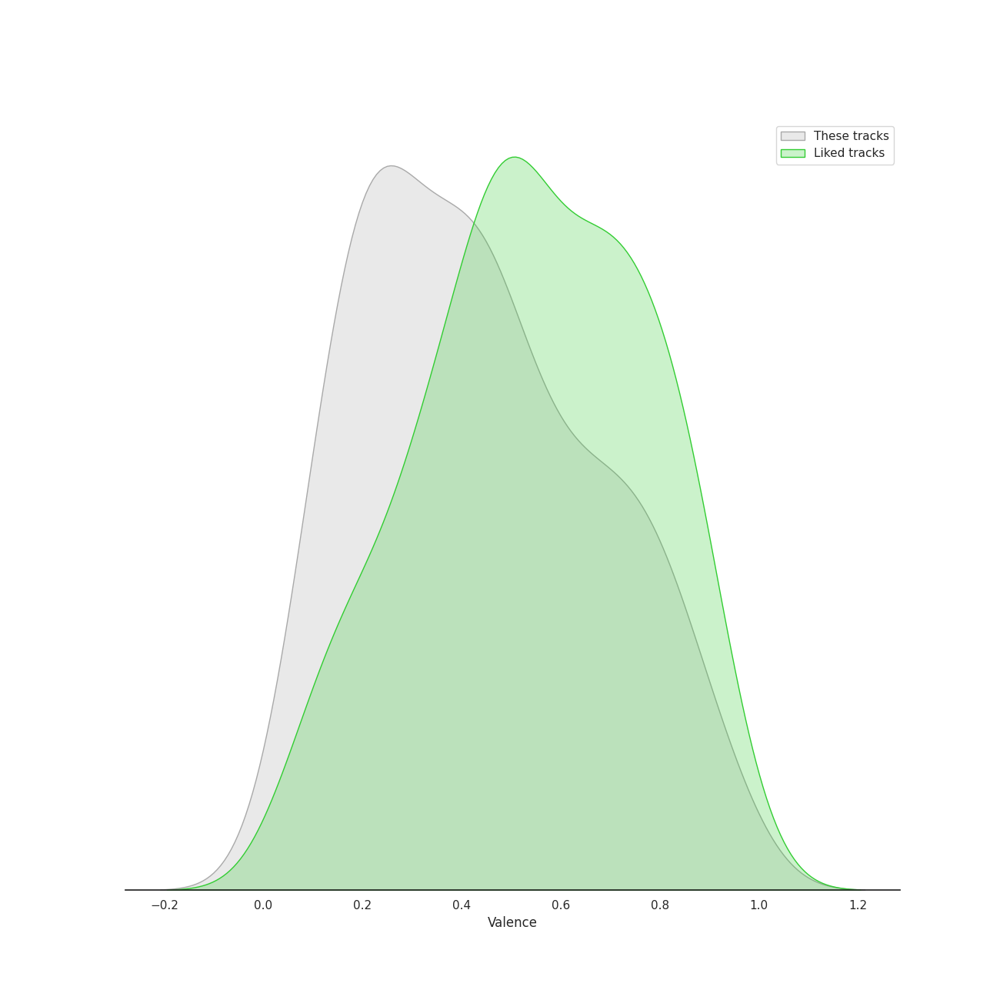
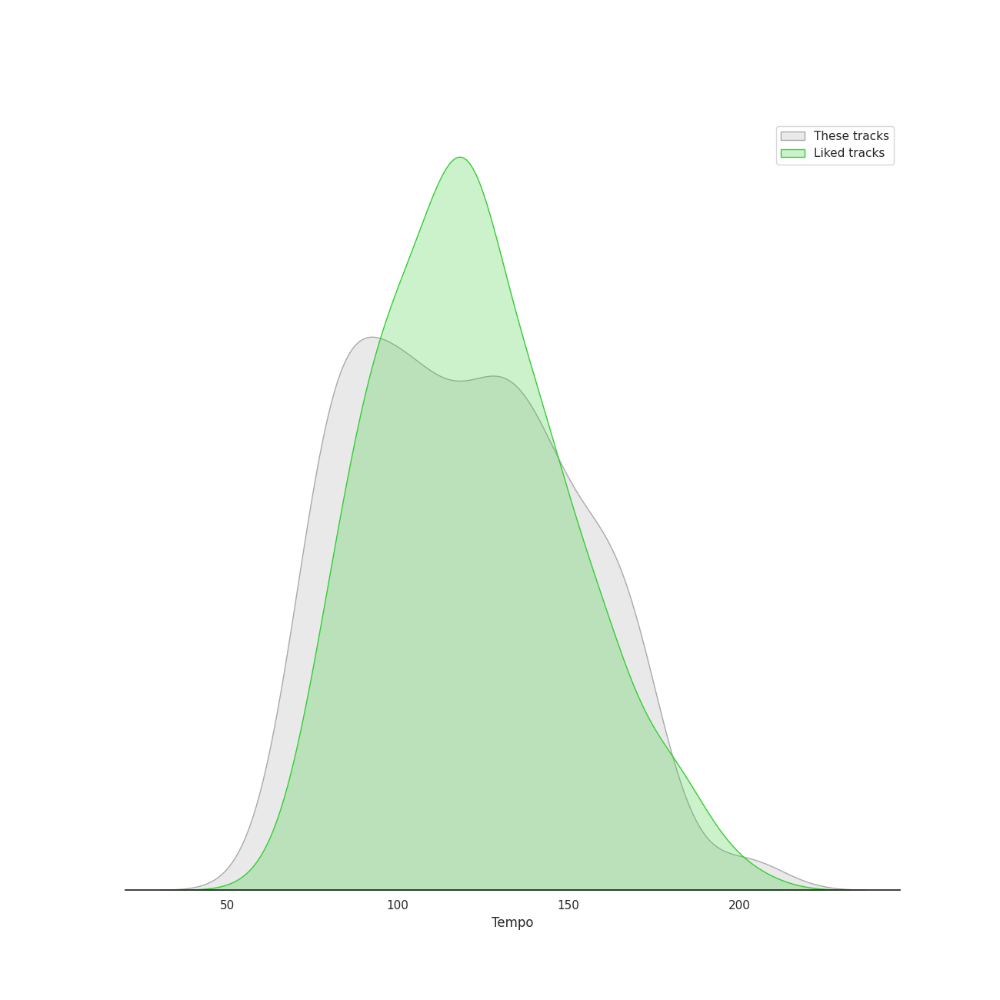

# Audio Features for Singer-Songwriter

## Danceability

| 10 most Danceable tracks | 10 least Danceable tracks |
|:---|:---|
| Fidelity (0.923) | Born To Die (0.18) |
| I Think He Knows (0.897) | Norman fucking Rockwell (0.215) |
| On the Radio (0.88) | Stay (0.262) |
| Good Intent (0.851) | Shades Of Cool (0.262) |
| Cornelia Street (0.824) | Gravity (0.27) |
| Paper Rings (0.811) | Once Upon Another Time (0.275) |
| Clean (0.81) | Creep Live At (Le)Poisson Rouge (0.277) |
| Dreamer (0.802) | She's Always a Woman (0.292) |
| Gorgeous (0.8) | Shadowboxer (0.298) |
| Vigilante Shit (0.798) | exile (feat. Bon Iver) (0.298) |

## Energy

| 10 most Energetic tracks | 10 least Energetic tracks |
|:---|:---|
| We Didn't Start the Fire (0.967) | Kaleidoscope Heart (0.0516) |
| Uptown Girl (0.944) | And So It Goes (0.0871) |
| Scenes from an Italian Restaurant (0.931) | Used (0.0938) |
| Cameo Lover (0.922) | Blue (0.102) |
| Red (0.896) | The Dawntreader (0.103) |
| Hello/Goodbye (0.893) | Goodbye Yellow Brick Road - Live at the Variety Playhouse, Atlanta, GA - May 2013 (0.114) |
| Bad Idea (feat. Jason Mraz) (0.889) | She's Got a Way (0.142) |
| Movin' Out (Anthony's Song) (0.88) | I Had a King (0.151) |
| Morningside (0.88) | Sweet Nothing (0.156) |
| The Stranger (0.878) | Lullabye (Goodnight, My Angel) (0.157) |

## Speechiness

| 10 most Speechy tracks | 10 least Speechy tracks |
|:---|:---|
| Vigilante Shit (0.39) | Satellite Call (0.0241) |
| False God (0.239) | All Too Well (0.0243) |
| Dancing With Our Hands Tied (0.196) | Lemon Love (0.0244) |
| willow (0.17) | Speeding Cars (0.0247) |
| Question...? (0.167) | Whisper (0.0252) |
| Shake It Off (0.165) | Pitter-Pat (0.0256) |
| I Did Something Bad (0.159) | The Longest Time (0.0262) |
| Only the Good Die Young (0.159) | Begin Again (0.0263) |
| Cruel Summer (0.157) | no body, no crime (feat. HAIM) (0.0264) |
| ...Ready For It? (0.136) | Meant (0.0267) |

## Acousticness

| 10 most Acoustic tracks | 10 least Acoustic tracks |
|:---|:---|
| Blue (0.989) | Out Of The Woods (0.00103) |
| Bright Lights and Cityscapes (0.977) | Now Is The Start (0.00124) |
| The Pirate of Penance (0.973) | Style (0.00253) |
| Manhattan (0.972) | I Knew You Were Trouble. (0.00454) |
| She's Got a Way (0.97) | Brave (0.00502) |
| I Had a King (0.968) | Many the Miles (0.00796) |
| Norman fucking Rockwell (0.968) | Nightflyers (0.00834) |
| Sweet Nothing (0.964) | Vegas (0.00881) |
| Goodbye Yellow Brick Road - Live at the Variety Playhouse, Atlanta, GA - May 2013 (0.959) | I Think He Knows (0.00889) |
| The Dawntreader (0.957) | We Are Never Ever Getting Back Together (0.00957) |

## Instrumentalness

| 10 most Instrumental tracks | 10 least Instrumental tracks |
|:---|:---|
| Swan Song (0.421) | Say You're Sorry (0.0) |
| Meant (0.124) | Sweet As Whole (0.0) |
| Bel Air (0.0875) | Clean (0.0) |
| Top of the World (0.0626) | This Is Why We Can't Have Nice Things (0.0) |
| Norman fucking Rockwell (0.0585) | Lucky (0.0) |
| Now Is The Start (0.0353) | Shadowboxer (0.0) |
| Satellite Call (0.0318) | Flesh & Bone (0.0) |
| Islands (0.0261) | Question...? (0.0) |
| West Coast (0.0194) | Come Round Soon (0.0) |
| Shades Of Cool (0.0161) | Dark Paradise (0.0) |

## Liveness

| 10 most Live tracks | 10 least Live tracks |
|:---|:---|
| Bel Air (0.901) | Uncharted (0.0343) |
| Goodbye Yellow Brick Road - Live at the Variety Playhouse, Atlanta, GA - May 2013 (0.781) | I Knew You Were Trouble. (0.0398) |
| Whatever We Feel (0.75) | Brave (0.0425) |
| Creep Live At (Le)Poisson Rouge (0.722) | Eden (0.0456) |
| Uptown Girl (0.601) | Chasing The Sun (0.0497) |
| Big Yellow Taxi (0.581) | I Feel the Earth Move (0.0528) |
| Karma (0.483) | My Life (0.0555) |
| Saw It Coming (0.456) | King of Anything (0.0574) |
| Off To The Races (0.4) | Movin' Out (Anthony's Song) (0.0591) |
| Cherry (0.384) | Crocodile Rock (0.0591) |

## Valence

| 10 most Happy tracks | 10 least Happy tracks |
|:---|:---|
| Big Yellow Taxi (0.97) | Maroon (0.0374) |
| Crocodile Rock (0.968) | Swan Song (0.0392) |
| Mercy (0.964) | Delicate (0.0499) |
| I Choose You (0.947) | Once Upon Another Time (0.0551) |
| Shake It Off (0.943) | Waltz Me to the Grave (0.0748) |
| Earth (0.938) | Creep Live At (Le)Poisson Rouge (0.0795) |
| Movin' Out (Anthony's Song) (0.895) | Dress (0.0851) |
| We Didn't Start the Fire (0.895) | Islands (0.0863) |
| Blow Away (0.891) | Shades Of Cool (0.0878) |
| A Matter of Trust (0.88) | Hide and Seek (0.0901) |

## Tempo

| 10 most Fast tracks | 10 least Fast tracks |
|:---|:---|
| Uncharted (203.962) | What's Inside (63.218) |
| Brave (185.063) | Bright Lights and Cityscapes (66.509) |
| Wicked Love (179.894) | Lover (68.534) |
| Piano Man (179.239) | Shadowboxer (74.131) |
| Sweet Nothing (176.655) | We All Need Saving (74.717) |
| She's Always a Woman (176.631) | Come Round Soon (74.751) |
| I Feel It All (172.046) | tolerate it (74.952) |
| Bobble Head (171.94) | Radio (75.112) |
| Say You're Sorry (170.016) | Carey (75.368) |
| Cruel Summer (169.994) | exile (feat. Bon Iver) (75.602) |
