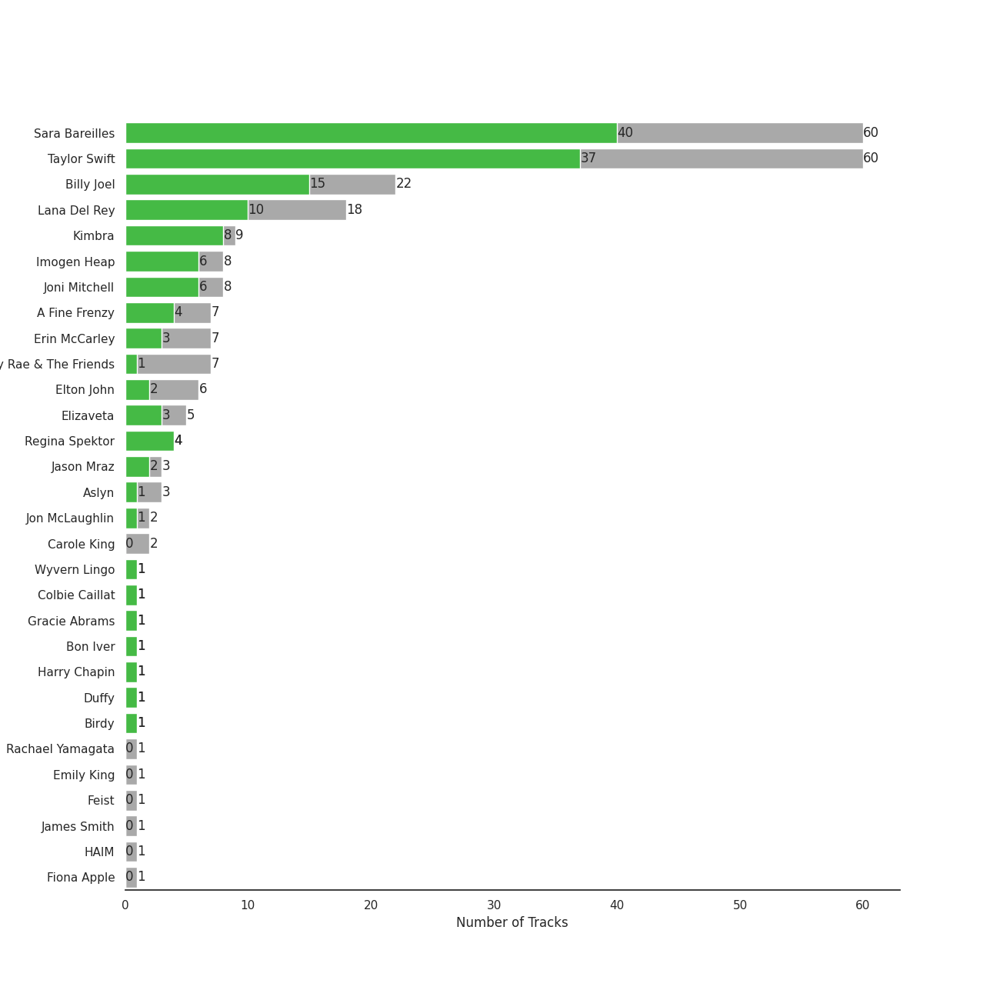
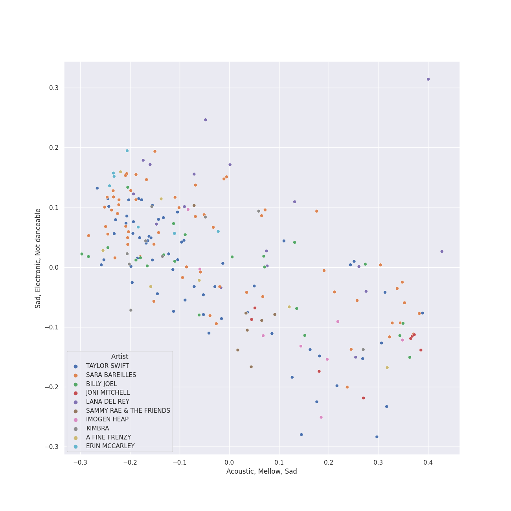
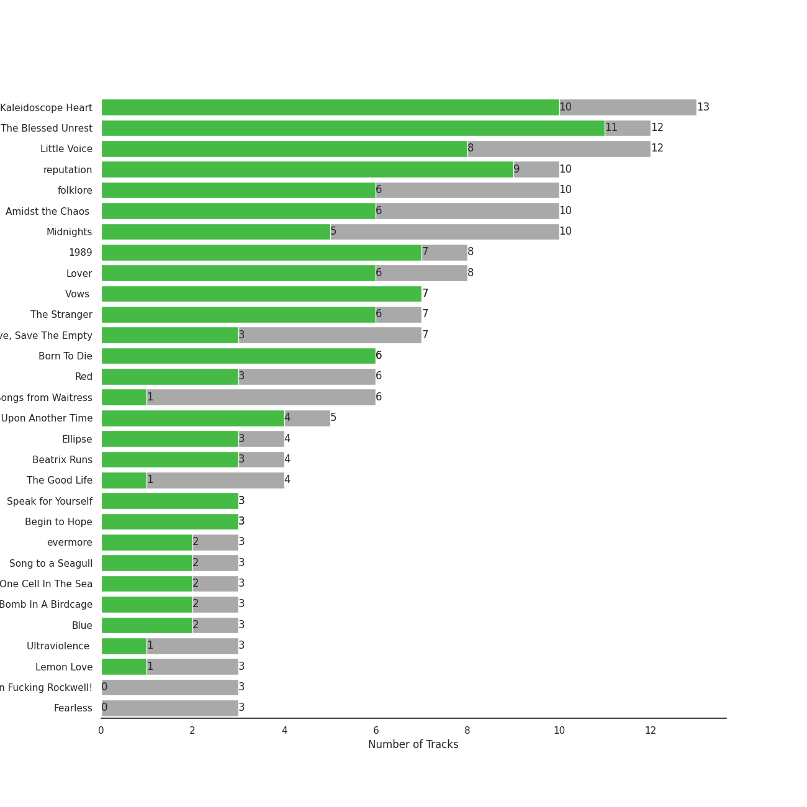
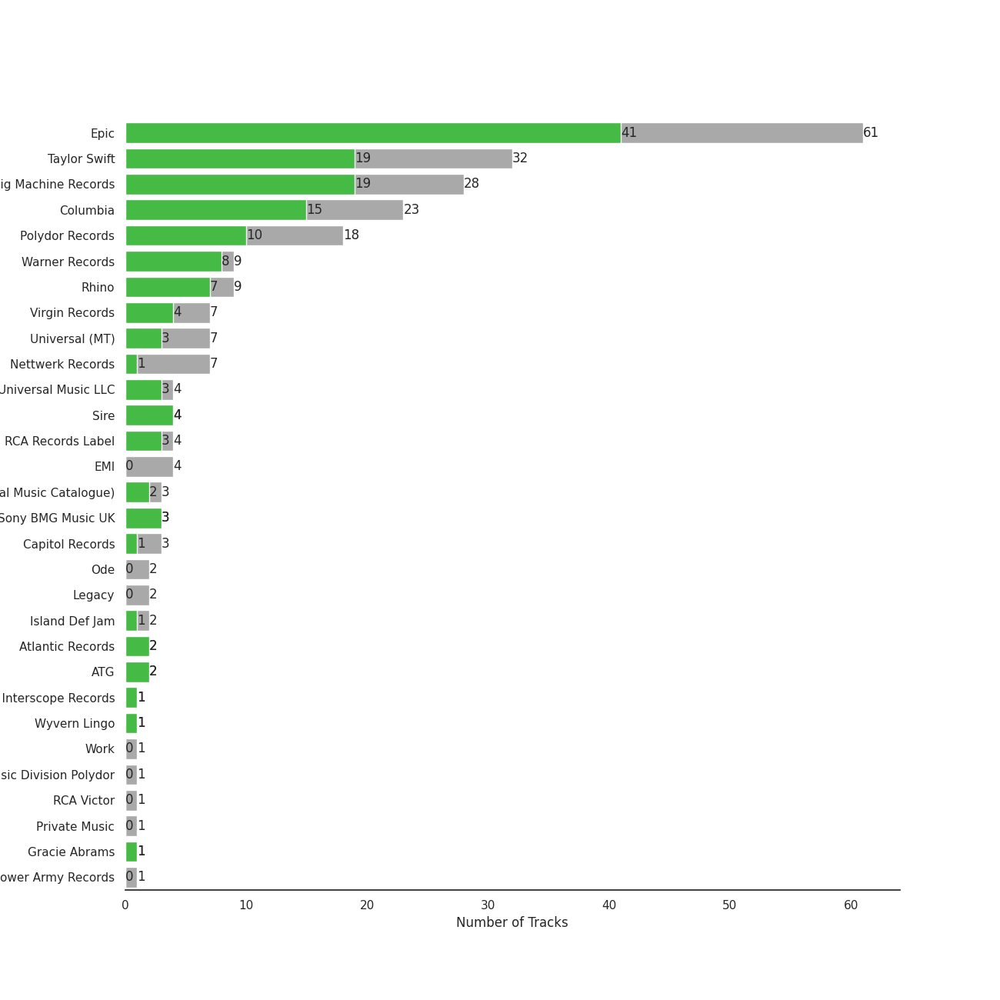
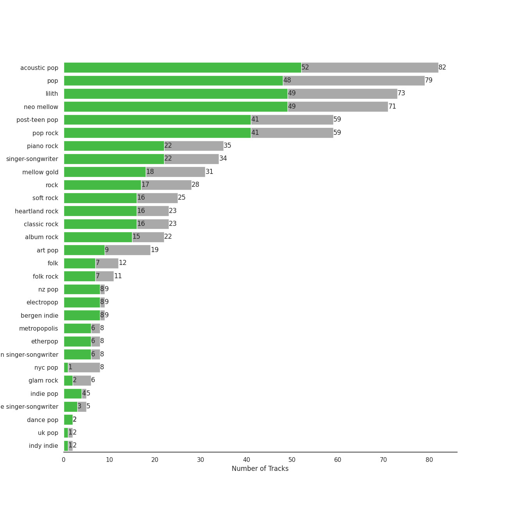
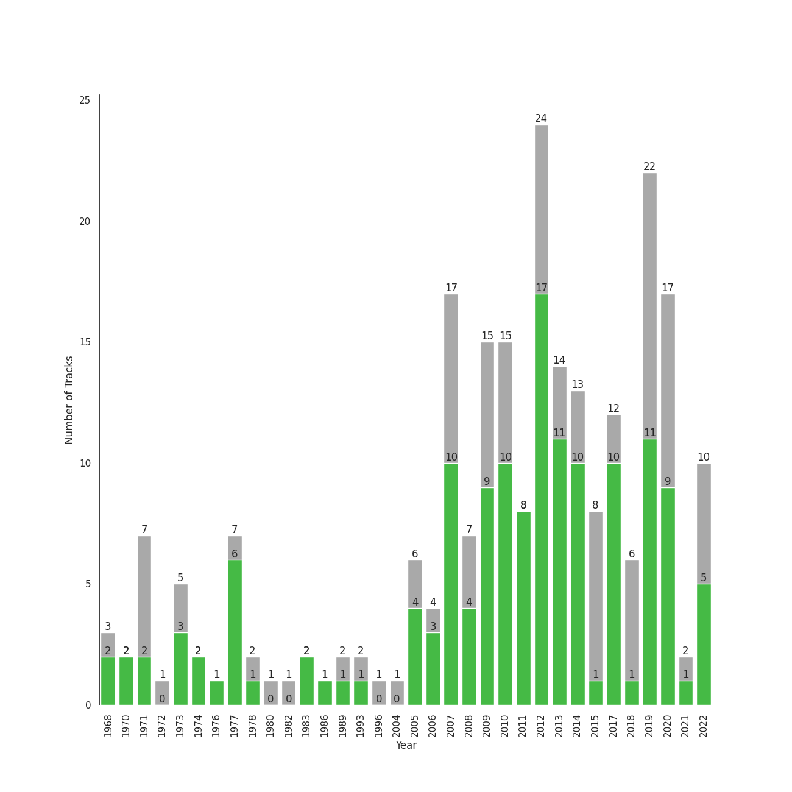

# Singer-Songwriter

[240 songs](tracks.md)

## Top Artists

See all 32 artists

| Number of Tracks | Art | Artist | 🔗 |
|---:|:---|:---|:---|
| 60 |  | [Sara Bareilles](../../artists/sara_bareilles.md) | [🔗](https://open.spotify.com/artist/2Sqr0DXoaYABbjBo9HaMkM) |
| 60 |  | [Taylor Swift](../../artists/taylor_swift.md) | [🔗](https://open.spotify.com/artist/06HL4z0CvFAxyc27GXpf02) |
| 22 |  | [Billy Joel](../../artists/billy_joel.md) | [🔗](https://open.spotify.com/artist/6zFYqv1mOsgBRQbae3JJ9e) |
| 18 |  | [Lana Del Rey](../../artists/lana_del_rey.md) | [🔗](https://open.spotify.com/artist/00FQb4jTyendYWaN8pK0wa) |
| 9 |  | [Kimbra](../../artists/kimbra.md) | [🔗](https://open.spotify.com/artist/6hk7Yq1DU9QcCCrz9uc0Ti) |
| 8 |  | Imogen Heap | [🔗](https://open.spotify.com/artist/6Xb4ezwoAQC4516kI89nWz) |
| 8 |  | Joni Mitchell | [🔗](https://open.spotify.com/artist/5hW4L92KnC6dX9t7tYM4Ve) |
| 7 |  | Erin McCarley | [🔗](https://open.spotify.com/artist/6Y4bCmUNPDKqc7dHkVvgim) |
| 7 |  | A Fine Frenzy | [🔗](https://open.spotify.com/artist/5dTYaRzOn4rXGBLH052EeQ) |
| 7 |  | Sammy Rae & The Friends | [🔗](https://open.spotify.com/artist/3lFDsTyYNPQc8WzJExnQWn) |
| 6 |  | Elton John | [🔗](https://open.spotify.com/artist/3PhoLpVuITZKcymswpck5b) |
| 5 |  | Elizaveta | [🔗](https://open.spotify.com/artist/2a9bCkqCkLvXM0s3uPvR7M) |
| 4 |  | Regina Spektor | [🔗](https://open.spotify.com/artist/3z6Gk257P9jNcZbBXJNX5i) |
| 3 |  | Aslyn | [🔗](https://open.spotify.com/artist/6seR0G84QQq1NIW844E7Qq) |
| 3 |  | Jason Mraz | [🔗](https://open.spotify.com/artist/4phGZZrJZRo4ElhRtViYdl) |
| 2 |  | Jon McLaughlin | [🔗](https://open.spotify.com/artist/6z29S0IoiBJpSMP8plyCj7) |
| 2 |  | Carole King | [🔗](https://open.spotify.com/artist/319yZVtYM9MBGqmSQnMyY6) |
| 1 |  | Rachael Yamagata | [🔗](https://open.spotify.com/artist/7w0qj2HiAPIeUcoPogvOZ6) |
| 1 |  | Wyvern Lingo | [🔗](https://open.spotify.com/artist/7etzKNDxaZ1LefgbGrexsN) |
| 1 |  | Emily King | [🔗](https://open.spotify.com/artist/6jlWj6y00bMQt8XoKuCjyZ) |
| 1 |  | Colbie Caillat | [🔗](https://open.spotify.com/artist/6aZyMrc4doVtZyKNilOmwu) |
| 1 |  | Feist | [🔗](https://open.spotify.com/artist/6CWTBjOJK75cTE8Xv8u1kj) |
| 1 |  | James Smith | [🔗](https://open.spotify.com/artist/543ccHFPnZfJMD8tRGPtu7) |
| 1 |  | Gracie Abrams | [🔗](https://open.spotify.com/artist/4tuJ0bMpJh08umKkEXKUI5) |
| 1 |  | HAIM | [🔗](https://open.spotify.com/artist/4Ui2kfOqGujY81UcPrb5KE) |
| 1 |  | Bon Iver | [🔗](https://open.spotify.com/artist/4LEiUm1SRbFMgfqnQTwUbQ) |
| 1 |  | Harry Chapin | [🔗](https://open.spotify.com/artist/42q4Ivs7tAiCZ5C7eG5q4c) |
| 1 |  | Fiona Apple | [🔗](https://open.spotify.com/artist/3g2kUQ6tHLLbmkV7T4GPtL) |
| 1 |  | Duffy | [🔗](https://open.spotify.com/artist/37NqXwtb6nIEqRt4EJSoIO) |
| 1 |  | Brandi Carlile | [🔗](https://open.spotify.com/artist/2sG4zTOLvjKG1PSoOyf5Ej) |
| 1 |  | Birdy | [🔗](https://open.spotify.com/artist/2WX2uTcsvV5OnS0inACecP) |
| 1 |  | Carrie Manolakos | [🔗](https://open.spotify.com/artist/15ptZqEJWDBnhVx6fqaCWV) |

## Top Albums

See all 80 albums

| Number of Tracks | Art | Album | Release Date | 🔗 |
|---:|:---|:---|:---|:---|
| 13 |  | Kaleidoscope Heart | 2010-09-07 | [🔗](https://open.spotify.com/album/627ukPRwYxyBREHxBq0vGJ) |
| 12 |  | The Blessed Unrest | 2013-07-16 | [🔗](https://open.spotify.com/album/7lpbyGc4fHsQkBTsfWVBhp) |
| 12 |  | Little Voice | 2007-07-03 | [🔗](https://open.spotify.com/album/2Z9WUERfMjOgQ6ze9TcGbF) |
| 10 |  | reputation | 2017-11-10 | [🔗](https://open.spotify.com/album/6DEjYFkNZh67HP7R9PSZvv) |
| 10 |  | folklore | 2020-07-24 | [🔗](https://open.spotify.com/album/2fenSS68JI1h4Fo296JfGr) |
| 10 |  | Midnights | 2022-10-21 | [🔗](https://open.spotify.com/album/151w1FgRZfnKZA9FEcg9Z3) |
| 10 |  | Amidst the Chaos (Bonus Version) | 2019-05-10 | [🔗](https://open.spotify.com/album/5x2sDapUIdq0qk1ezff3gm) |
| 8 |  | Lover | 2019-08-23 | [🔗](https://open.spotify.com/album/1NAmidJlEaVgA3MpcPFYGq) |
| 8 |  | 1989 | 2014-10-27 | [🔗](https://open.spotify.com/album/2QJmrSgbdM35R67eoGQo4j) |
| 7 |  | Vows (Deluxe Version) | 2011 | [🔗](https://open.spotify.com/album/6V9rvW05Um5bIHePPfeI8p) |
| 7 |  | The Stranger | 1977-09-29 | [🔗](https://open.spotify.com/album/3IILMjMMnoN2sKzgesX8KV) |
| 7 |  | Love, Save The Empty | 2009 | [🔗](https://open.spotify.com/album/1tF7625TFqvfzMbappj1pQ) |
| 6 |  | What's Inside: Songs from Waitress | 2015-11-06 | [🔗](https://open.spotify.com/album/1s6codM2ZAB008t9GTyaEk) |
| 6 |  | Born To Die | 2012-01-30 | [🔗](https://open.spotify.com/album/4X8hAqIWpQyQks2yRhyqs4) |
| 5 |  | Once Upon Another Time | 2012-05-22 | [🔗](https://open.spotify.com/album/1PrqYZJRzGNf8AsSOraxnZ) |
| 4 |  | The Good Life | 2018-07-10 | [🔗](https://open.spotify.com/album/2xCZSSa0kfIJFDhQR8bYar) |
| 4 |  | Red | 2012-10-22 | [🔗](https://open.spotify.com/album/1EoDsNmgTLtmwe1BDAVxV5) |
| 4 |  | Ellipse | 2009-08-25 | [🔗](https://open.spotify.com/album/5AYKGPzPBJNHeKehCxMaq0) |
| 4 |  | Beatrix Runs | 2012 | [🔗](https://open.spotify.com/album/7HsPaYQbCYnxosF5WiSlEA) |
| 3 |  | evermore | 2020-12-11 | [🔗](https://open.spotify.com/album/2Xoteh7uEpea4TohMxjtaq) |
| 3 |  | Ultraviolence (Deluxe) | 2014-01-01 | [🔗](https://open.spotify.com/album/1ORxRsK3MrSLvh7VQTF01F) |
| 3 |  | Speak for Yourself | 2005-07-18 | [🔗](https://open.spotify.com/album/0t0Cr8jA63wlm8nWj7qfvJ) |
| 3 |  | Song to a Seagull | 1968-03-01 | [🔗](https://open.spotify.com/album/6rg3WTvmv68Vd6tgR0yS0E) |
| 3 |  | One Cell In The Sea | 2007 | [🔗](https://open.spotify.com/album/0Ot7MEgreG2R93aN42M9iK) |
| 3 |  | Norman Fucking Rockwell! | 2019-08-30 | [🔗](https://open.spotify.com/album/5XpEKORZ4y6OrCZSKsi46A) |
| 3 |  | Lemon Love | 2005-01-01 | [🔗](https://open.spotify.com/album/5YToJrWwzdA6W2NxxDoteE) |
| 3 |  | Fearless | 2008-11-11 | [🔗](https://open.spotify.com/album/2dqn5yOQWdyGwOpOIi9O4x) |
| 3 |  | Bomb In A Birdcage | 2009-01-01 | [🔗](https://open.spotify.com/album/07IV5RxLvAUeZbcPm4zOzn) |
| 3 |  | Blue | 1971-06-22 | [🔗](https://open.spotify.com/album/1vz94WpXDVYIEGja8cjFNa) |
| 3 |  | Begin to Hope | 2006-06-13 | [🔗](https://open.spotify.com/album/4L4tcx3itXbtx5kuchKhFE) |
| 2 |  | We Sing. We Dance. We Steal Things. | 2008-05-12 | [🔗](https://open.spotify.com/album/04G0YylSjvDQZrjOfE5jA5) |
| 2 |  | Tapestry | 1971 | [🔗](https://open.spotify.com/album/12n11cgnpjXKLeqrnIERoS) |
| 2 |  | Storm Front | 1989-10-17 | [🔗](https://open.spotify.com/album/1Vw2uoVkLAJFVViJ1QyK1D) |
| 2 |  | Speak Now | 2010-10-25 | [🔗](https://open.spotify.com/album/5MfAxS5zz8MlfROjGQVXhy) |
| 2 |  | River Of Dreams | 1993-08-10 | [🔗](https://open.spotify.com/album/4HPnwQJAEvTY910q4RNeOu) |
| 2 |  | Piano Man | 1973-11-09 | [🔗](https://open.spotify.com/album/77ErLrVvYETIlQJHAwhfIH) |
| 2 |  | Lust For Life | 2017-07-21 | [🔗](https://open.spotify.com/album/7xYiTrbTL57QO0bb4hXIKo) |
| 2 |  | Goodbye Yellow Brick Road (Remastered) | 1973-10-05 | [🔗](https://open.spotify.com/album/5WupqgR68HfuHt3BMJtgun) |
| 2 |  | An Innocent Man | 1983-08-08 | [🔗](https://open.spotify.com/album/3R3x4zIabsvpD3yxqLaUpc) |
| 2 |  | 52nd Street | 1978-10-13 | [🔗](https://open.spotify.com/album/1HmCO8VK98AU6EXPOjGYyI) |
| 1 |  | minor | 2020-07-14 | [🔗](https://open.spotify.com/album/2UZw04wDxLVceADw2Gi1Qy) |
| 1 |  | Young And Beautiful | 2013-01-01 | [🔗](https://open.spotify.com/album/1D92WOHWUI2AGQCCdplcXL) |
| 1 |  | Whatever We Feel | 2020-04-03 | [🔗](https://open.spotify.com/album/5Lg9bnBTPSu0Xg7MRERveZ) |
| 1 |  | Verities & Balderdash | 1974 | [🔗](https://open.spotify.com/album/3nta4nhqWoWjc6LmHIB0kT) |
| 1 |  | Turnstiles | 1976-05-19 | [🔗](https://open.spotify.com/album/7GiLfxL1su3MSqz7pmKMZi) |
| 1 |  | Tidal | 1996-07-23 | [🔗](https://open.spotify.com/album/5gVBXH8MT6zfdRkjp7qT18) |
| 1 |  | The Widow Knows E.P. | 2014-08-14 | [🔗](https://open.spotify.com/album/548WnictHrfJKj2u6tXqFe) |
| 1 |  | The Reminder | 2007-01-01 | [🔗](https://open.spotify.com/album/7bTdGfczXffzzNE9ssJj4Z) |
| 1 |  | The Nylon Curtain | 1982-06-23 | [🔗](https://open.spotify.com/album/50bajZpetfL5T0iRCOR74J) |
| 1 |  | The Golden Echo | 2014-08-15 | [🔗](https://open.spotify.com/album/66hoUkjxM7tVQwu7bZocwP) |
| 1 |  | The Bridge | 1986-07-28 | [🔗](https://open.spotify.com/album/2fRxSC6FtiAkhEDVZr2seH) |
| 1 |  | Sides | 2020-01-17 | [🔗](https://open.spotify.com/album/5alIr9JGPvOQwPLphm0beJ) |
| 1 |  | Saw It Coming | 2019-05-10 | [🔗](https://open.spotify.com/album/0SPZ4equvZdVOPzOYrS8pJ) |
| 1 |  | Rockferry | 2008-01-01 | [🔗](https://open.spotify.com/album/6freV6eqxuFjSr3E93Oqtz) |
| 1 |  | Red (Deluxe Edition) | 2012-10-22 | [🔗](https://open.spotify.com/album/1KlU96Hw9nlvqpBPlSqcTV) |
| 1 |  | Primal Heart | 2018-04-20 | [🔗](https://open.spotify.com/album/4pj0BkJ7u39i009oqe8V79) |
| 1 |  | Paradise | 2012-11-09 | [🔗](https://open.spotify.com/album/1JnjcAIKQ9TSJFVFierTB8) |
| 1 |  | PINES | 2012-01-01 | [🔗](https://open.spotify.com/album/1876e9QcHkJ3Hgo4NqKXBN) |
| 1 |  | OK Now | 2008-01-01 | [🔗](https://open.spotify.com/album/3fKJJQFV6a61fnKYDDj2LU) |
| 1 |  | Messenger | 2015-06-29 | [🔗](https://open.spotify.com/album/3yQJY0tg0M2rQwWYUgkVQp) |
| 1 |  | Madman Across The Water | 1971-11-05 | [🔗](https://open.spotify.com/album/2OZbaW9tgO62ndm375lFZr) |
| 1 |  | Little Love - EP | 2018-06-01 | [🔗](https://open.spotify.com/album/2PLM1yTphJeFZg01Xiaumc) |
| 1 |  | Ladies of the Canyon | 1970-03-01 | [🔗](https://open.spotify.com/album/7JOdtLDLyXJIppDRB7kxr9) |
| 1 |  | Jackie Onassis | 2020-06-05 | [🔗](https://open.spotify.com/album/3RaVt6xWjSVMFrMdLqoDrN) |
| 1 |  | Indiana | 2007-01-01 | [🔗](https://open.spotify.com/album/2UpO4j1Zpptiwk3wbUIWmU) |
| 1 |  | Honky Chateau | 1972-05-19 | [🔗](https://open.spotify.com/album/2ei2X6ghPnw7YRwQtAH075) |
| 1 |  | Honeymoon | 2015-09-18 | [🔗](https://open.spotify.com/album/2DpEBrjCur1ythIZ10gJWw) |
| 1 |  | Happenstance (Deluxe Version) | 2004-06-08 | [🔗](https://open.spotify.com/album/66p6CIMdxQFO3Igg9xo14a) |
| 1 |  | Goodnight And Go | 2006-05-02 | [🔗](https://open.spotify.com/album/3JYjYjUAoBjxXr1W8eDVLV) |
| 1 |  | Glass Houses | 1980-03-12 | [🔗](https://open.spotify.com/album/5sztejERqpktXEdemlUvU5) |
| 1 |  | Fearless (Taylor's Version) | 2021-04-09 | [🔗](https://open.spotify.com/album/4hDok0OAJd57SGIT8xuWJH) |
| 1 |  | Far | 2009-06-09 | [🔗](https://open.spotify.com/album/5t0lQDPLF22wmWCtSZkIVv) |
| 1 |  | Elton John | 1970-04-10 | [🔗](https://open.spotify.com/album/69P9Ro0W286yLFgYwrGVN0) |
| 1 |  | Don't Shoot Me I'm Only The Piano Player | 1973-01-22 | [🔗](https://open.spotify.com/album/1reJ8DttK5EGwdyf7y9FBR) |
| 1 |  | Creep Live At (Le)Poisson Rouge | 2012-09-09 | [🔗](https://open.spotify.com/album/3tzHjGnv1WpG78SzgRKFIi) |
| 1 |  | Court and Spark | 1974-01-17 | [🔗](https://open.spotify.com/album/2akjxkzFolkeV72Yyv5KrM) |
| 1 |  | Cold Spring Harbor | 1971-11-01 | [🔗](https://open.spotify.com/album/274rMlKrr22086ohmwAJZA) |
| 1 |  | Brave Enough: Live at the Variety Playhouse | 2013-10-22 | [🔗](https://open.spotify.com/album/7L4ZgnQqEhCEsV9GnMeXtE) |
| 1 |  | Birdy | 2011-11-04 | [🔗](https://open.spotify.com/album/1WGjSVIw0TVfbp5KrOFiP0) |
| 1 |  | Bear Creek | 2012-06-01 | [🔗](https://open.spotify.com/album/5b8YTIrc88vdnfRguZqvVE) |

## Top Record Labels

See all 35 labels

| Number of Tracks | Label |
|---:|:---|
| 61 | [Epic](../../labels/epic.md) |
| 32 | [Taylor Swift](../../labels/taylor_swift.md) |
| 28 | [Big Machine Records](../../labels/big_machine_records.md) |
| 23 | [Columbia](../../labels/columbia.md) |
| 18 | [Polydor Records](../../labels/polydor_records.md) |
| 9 | [Warner Records](../../labels/warner_records.md) |
| 9 | [Rhino](../../labels/rhino.md) |
| 7 | [Virgin Records](../../labels/virgin_records.md) |
| 7 | Universal (MT) |
| 7 | Nettwerk Records |
| 4 | [Universal Music LLC](../../labels/universal_music_llc.md) |
| 4 | Sire |
| 4 | [RCA Records Label](../../labels/rca_records_label.md) |
| 4 | EMI |
| 3 | [UMC (Universal Music Catalogue)](../../labels/umc__universal_music_catalogue_.md) |
| 3 | Sony BMG Music UK |
| 3 | [Capitol Records](../../labels/capitol_records.md) |
| 2 | Ode |
| 2 | [Legacy](../../labels/legacy.md) |
| 2 | Island Def Jam |
| 2 | [Atlantic Records](../../labels/atlantic_records.md) |
| 2 | ATG |
| 1 | under exclusive license to Interscope Records |
| 1 | Wyvern Lingo |
| 1 | Work |
| 1 | Universal Music Division Polydor |
| 1 | RCA Victor |
| 1 | Private Music |
| 1 | Gracie Abrams |
| 1 | Flower Army Records |
| 1 | Elektra |
| 1 | Clean Slate |
| 1 | Carrie Manolakos |
| 1 | Atlantic Records UK |
| 1 | ATO Records |

## Genres

See all 51 genres

| Number of Tracks | Genre |
|---:|:---|
| 141 | [pop](../../genres/pop.md) |
| 82 | [acoustic pop](../../genres/acoustic_pop.md) |
| 79 | [neo mellow](../../genres/neo_mellow.md) |
| 79 | [lilith](../../genres/lilith.md) |
| 61 | [pop rock](../../genres/pop_rock.md) |
| 59 | [hollywood](../../genres/hollywood.md) |
| 36 | [singer-songwriter](../../genres/singer_songwriter.md) |
| 35 | piano rock |
| 33 | [folk rock](../../genres/folk_rock.md) |
| 31 | [mellow gold](../../genres/mellow_gold.md) |
| 25 | [soft rock](../../genres/soft_rock.md) |
| 25 | [classic rock](../../genres/classic_rock.md) |
| 24 | [rock](../../genres/rock.md) |
| 18 | [art pop](../../genres/art_pop.md) |
| 14 | indie pop |
| 12 | folk |
| 9 | nz pop |
| 9 | [electropop](../../genres/electropop.md) |
| 9 | bergen indie |
| 8 | nyc pop |
| 8 | metropopolis |
| 8 | etherpop |
| 8 | canadian singer-songwriter |
| 6 | glam rock |
| 5 | deep indie singer-songwriter |
| 3 | viral pop |
| 2 | neo soul |
| 2 | indy indie |
| 2 | indiecoustica |
| 2 | chamber pop |
| 2 | brill building pop |
| 2 | [adult standards](../../genres/adult_standards.md) |
| 1 | urban contemporary |
| 1 | uk pop |
| 1 | [r&b](../../genres/r_b.md) |
| 1 | pop soul |
| 1 | permanent wave |
| 1 | new americana |
| 1 | modern folk rock |
| 1 | irish pop |
| 1 | indie soul |
| 1 | funk |
| 1 | europop |
| 1 | dark pop |
| 1 | [dance pop](../../genres/dance_pop.md) |
| 1 | country rock |
| 1 | canadian pop |
| 1 | canadian indie |
| 1 | british soul |
| 1 | alternative r&b |
| 1 | alt z |

## Years

View all years

| Year | Number of Tracks |
|:---|---:|
| 2022 | 10 |
| 2021 | 1 |
| 2020 | 17 |
| [2019](2019.md) | 22 |
| 2018 | 6 |
| 2017 | 12 |
| 2015 | 8 |
| 2014 | 13 |
| 2013 | 14 |
| [2012](2012.md) | 24 |
| 2011 | 8 |
| 2010 | 15 |
| 2009 | 15 |
| 2008 | 7 |
| 2007 | 17 |
| 2006 | 4 |
| 2005 | 6 |
| 2004 | 1 |
| 1996 | 1 |
| 1993 | 2 |
| 1989 | 2 |
| 1986 | 1 |
| 1983 | 2 |
| 1982 | 1 |
| 1980 | 1 |
| 1978 | 2 |
| 1977 | 7 |
| 1976 | 1 |
| 1974 | 2 |
| 1973 | 5 |
| 1972 | 1 |
| 1971 | 7 |
| 1970 | 2 |
| 1968 | 3 |

| 10 newest albums | 10 oldest albums |
|:---|:---|
| 
 Midnights (2022-10-21)
 | 
 Song to a Seagull (1968-03-01)
 |
| 
 Fearless (Taylor's Version) (2021-04-09)
 | 
 Ladies of the Canyon (1970-03-01)
 |
| 
 evermore (2020-12-11)
 | 
 Elton John (1970-04-10)
 |
| 
 folklore (2020-07-24)
 | 
 Tapestry (1971)
 |
| 
 minor (2020-07-14)
 | 
 Blue (1971-06-22)
 |
| 
 Jackie Onassis (2020-06-05)
 | 
 Cold Spring Harbor (1971-11-01)
 |
| 
 Whatever We Feel (2020-04-03)
 | 
 Madman Across The Water (1971-11-05)
 |
| 
 Sides (2020-01-17)
 | 
 Honky Chateau (1972-05-19)
 |
| 
 Norman Fucking Rockwell! (2019-08-30)
 | 
 Don't Shoot Me I'm Only The Piano Player (1973-01-22)
 |
| 
 Lover (2019-08-23)
 | 
 Goodbye Yellow Brick Road (Remastered) (1973-10-05)
 |
## Audio Features

| 10 most Danceable tracks | 10 least Danceable tracks |
|:---|:---|
| Fidelity (0.923) | Born To Die (0.18) |
| I Think He Knows (0.897) | Norman fucking Rockwell (0.215) |
| On the Radio (0.88) | Stay (0.262) |
| Good Intent (0.851) | Shades Of Cool (0.262) |
| Cornelia Street (0.824) | Gravity (0.27) |
| Paper Rings (0.811) | Once Upon Another Time (0.275) |
| Clean (0.81) | Creep Live At (Le)Poisson Rouge (0.277) |
| Dreamer (0.802) | She's Always a Woman (0.292) |
| Gorgeous (0.8) | Shadowboxer (0.298) |
| Vigilante Shit (0.798) | exile (feat. Bon Iver) (0.298) |

| 10 most Energetic tracks | 10 least Energetic tracks |
|:---|:---|
| We Didn't Start the Fire (0.967) | Kaleidoscope Heart (0.0516) |
| Uptown Girl (0.944) | And So It Goes (0.0871) |
| Scenes from an Italian Restaurant (0.931) | Used (0.0938) |
| Cameo Lover (0.922) | Blue (0.102) |
| Red (0.896) | The Dawntreader (0.103) |
| Hello/Goodbye (0.893) | Goodbye Yellow Brick Road - Live at the Variety Playhouse, Atlanta, GA - May 2013 (0.114) |
| Bad Idea (feat. Jason Mraz) (0.889) | She's Got a Way (0.142) |
| Movin' Out (Anthony's Song) (0.88) | I Had a King (0.151) |
| Morningside (0.88) | Sweet Nothing (0.156) |
| The Stranger (0.878) | Lullabye (Goodnight, My Angel) (0.157) |

| 10 most Speechy tracks | 10 least Speechy tracks |
|:---|:---|
| Vigilante Shit (0.39) | Satellite Call (0.0241) |
| False God (0.239) | All Too Well (0.0243) |
| Dancing With Our Hands Tied (0.196) | Lemon Love (0.0244) |
| willow (0.17) | Speeding Cars (0.0247) |
| Question...? (0.167) | Whisper (0.0252) |
| Shake It Off (0.165) | Pitter-Pat (0.0256) |
| I Did Something Bad (0.159) | The Longest Time (0.0262) |
| Only the Good Die Young (0.159) | Begin Again (0.0263) |
| Cruel Summer (0.157) | no body, no crime (feat. HAIM) (0.0264) |
| ...Ready For It? (0.136) | Meant (0.0267) |

| 10 most Acoustic tracks | 10 least Acoustic tracks |
|:---|:---|
| Blue (0.989) | Out Of The Woods (0.00103) |
| Bright Lights and Cityscapes (0.977) | Now Is The Start (0.00124) |
| The Pirate of Penance (0.973) | Style (0.00253) |
| Manhattan (0.972) | I Knew You Were Trouble. (0.00454) |
| She's Got a Way (0.97) | Brave (0.00502) |
| I Had a King (0.968) | Many the Miles (0.00796) |
| Norman fucking Rockwell (0.968) | Nightflyers (0.00834) |
| Sweet Nothing (0.964) | Vegas (0.00881) |
| Goodbye Yellow Brick Road - Live at the Variety Playhouse, Atlanta, GA - May 2013 (0.959) | I Think He Knows (0.00889) |
| The Dawntreader (0.957) | We Are Never Ever Getting Back Together (0.00957) |

| 10 most Instrumental tracks | 10 least Instrumental tracks |
|:---|:---|
| Swan Song (0.421) | Say You're Sorry (0.0) |
| Meant (0.124) | Sweet As Whole (0.0) |
| Bel Air (0.0875) | Clean (0.0) |
| Top of the World (0.0626) | This Is Why We Can't Have Nice Things (0.0) |
| Norman fucking Rockwell (0.0585) | Lucky (0.0) |
| Now Is The Start (0.0353) | Shadowboxer (0.0) |
| Satellite Call (0.0318) | Flesh & Bone (0.0) |
| Islands (0.0261) | Question...? (0.0) |
| West Coast (0.0194) | Come Round Soon (0.0) |
| Shades Of Cool (0.0161) | Dark Paradise (0.0) |

| 10 most Live tracks | 10 least Live tracks |
|:---|:---|
| Bel Air (0.901) | Uncharted (0.0343) |
| Goodbye Yellow Brick Road - Live at the Variety Playhouse, Atlanta, GA - May 2013 (0.781) | I Knew You Were Trouble. (0.0398) |
| Whatever We Feel (0.75) | Brave (0.0425) |
| Creep Live At (Le)Poisson Rouge (0.722) | Eden (0.0456) |
| Uptown Girl (0.601) | Chasing The Sun (0.0497) |
| Big Yellow Taxi (0.581) | I Feel the Earth Move (0.0528) |
| Karma (0.483) | My Life (0.0555) |
| Saw It Coming (0.456) | King of Anything (0.0574) |
| Off To The Races (0.4) | Movin' Out (Anthony's Song) (0.0591) |
| Cherry (0.384) | Crocodile Rock (0.0591) |

| 10 most Happy tracks | 10 least Happy tracks |
|:---|:---|
| Big Yellow Taxi (0.97) | Maroon (0.0374) |
| Crocodile Rock (0.968) | Swan Song (0.0392) |
| Mercy (0.964) | Delicate (0.0499) |
| I Choose You (0.947) | Once Upon Another Time (0.0551) |
| Shake It Off (0.943) | Waltz Me to the Grave (0.0748) |
| Earth (0.938) | Creep Live At (Le)Poisson Rouge (0.0795) |
| Movin' Out (Anthony's Song) (0.895) | Dress (0.0851) |
| We Didn't Start the Fire (0.895) | Islands (0.0863) |
| Blow Away (0.891) | Shades Of Cool (0.0878) |
| A Matter of Trust (0.88) | Hide and Seek (0.0901) |
