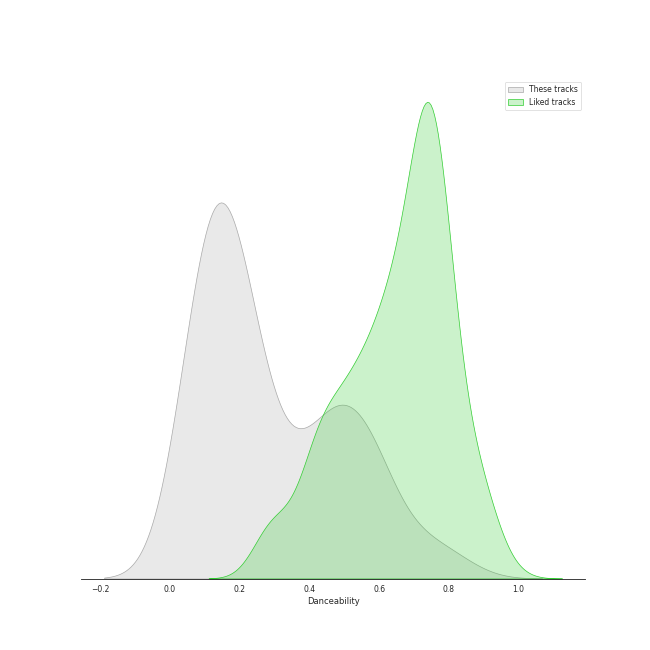
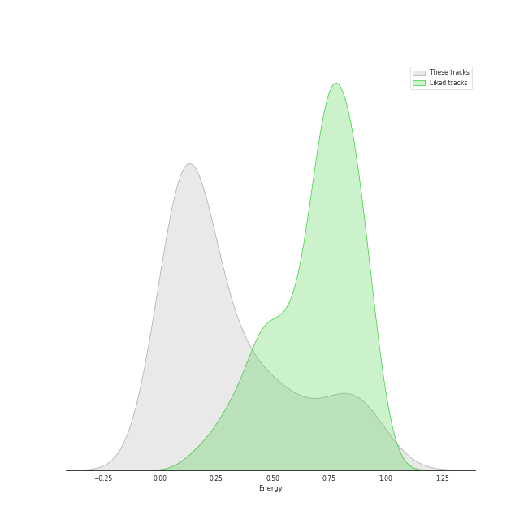
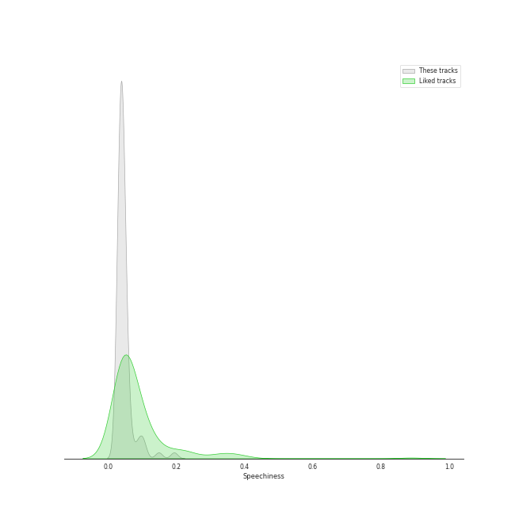
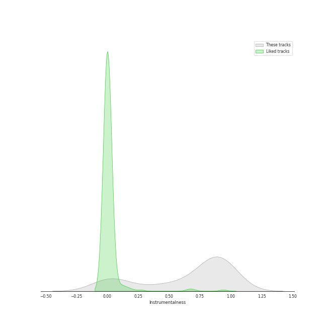
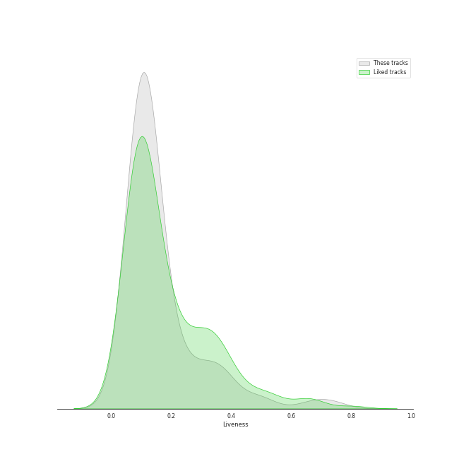

# Track Features for Soundtracks

## Danceability

| ​ | 10 most Danceable tracks | ​​ | 10 least Danceable tracks |
|:---|:---|:---|:---|
|  | Pokerap (0.819) |  | Anduril (0.0607) |
|  | Still Alive (0.776) |  | Many Meetings (0.0623) |
|  | Luigi's Mansion Theme (From "Luigi's Mansion") (0.734) |  | The Grey Havens (feat. Sir James Galway) (0.0633) |
|  | Cantina Band (0.688) |  | Samwise the Brave (0.0646) |
|  | Delfino Plaza (From "Super Mario Sunshine") (0.629) |  | Twilight and Shadow (feat. Renee Fleming) (0.0693) |
|  | Lost Woods (0.599) |  | The White Tree (0.0699) |
|  | Pallet Town (From "Pokémon Red and Blue") (0.585) |  | The Prophecy (0.0735) |
|  | Tetris Game Boy A Theme (0.584) |  | The Return of the King (feat. Sir James Galway, Viggo Mortensen and Renee Fleming) (0.0754) |
|  | Pokemon Red & Blue Theme (0.582) |  | Rose, Dragon (0.0808) |
|  | Still Alive (From "Portal") (0.575) |  | The Labyrinth (0.0813) |

## Energy

| ​ | 10 most Energetic tracks | ​​ | 10 least Energetic tracks |
|:---|:---|:---|:---|
|  | Hyrule Field (0.967) |  | The Passing of the Elves (0.0146) |
|  | Trainer Battle (0.952) |  | Into the West (0.031) |
|  | Pokerap (0.951) |  | A Tale (0.0316) |
|  | Pokemon Theme (0.907) |  | Evenstar (0.0407) |
|  | Final Rival Battle (0.873) |  | The Grey Havens (feat. Sir James Galway) (0.0427) |
|  | Pokémon Theme (0.855) |  | Breath of Life (0.044) |
|  | Fairy's Fountain (0.847) |  | Hope and Memory (0.0586) |
|  | Gerudo Valley (0.821) |  | Mercedes Lullaby (0.0621) |
|  | Pokemon Red & Blue Theme (0.818) |  | Concerning Hobbits (0.0629) |
|  | Trainer Battle Music (From "Pokémon") (0.8) |  | The Prophecy (0.0657) |

## Speechiness

| ​ | 10 most Speechy tracks | ​​ | 10 least Speechy tracks |
|:---|:---|:---|:---|
|  | Pokerap (0.194) |  | A Tale (0.0291) |
|  | Cantina Band (0.149) |  | Pokemon Red & Blue Theme (0.0292) |
|  | Still Alive (From "Portal") (0.105) |  | The Imperial March (Darth Vader's Theme) (0.0301) |
|  | Hyrule Field (0.101) |  | The Legend Of Zelda: Twilight Princess - Midna's Desperate Hour (0.0304) |
|  | Trainer Battle Music (From "Pokémon") (0.0997) |  | Pallet Town (From "Pokémon Red and Blue") (0.0305) |
|  | Luigi's Mansion Theme (From "Luigi's Mansion") (0.0885) |  | Tetris Game Boy A Theme (0.0327) |
|  | Delfino Plaza (From "Super Mario Sunshine") (0.0848) |  | Fairy's Fountain (0.0329) |
|  | Lost Woods (0.0643) |  | Theme From Jurassic Park (0.0333) |
|  | Jaws: Title Theme (0.0605) |  | Theme From Jurassic Park - From "Jurassic Park" Soundtrack (0.0333) |
|  | Main Theme (From "Jaws") (0.0581) |  | Still Alive (0.0341) |

## Acousticness

| ​ | 10 most Acoustic tracks | ​​ | 10 least Acoustic tracks |
|:---|:---|:---|:---|
|  | Lost Woods (0.994) |  | Trainer Battle (3.12e-05) |
|  | Zelda's Lullaby (0.988) |  | Tetris Game Boy A Theme (7.3e-05) |
|  | Many Meetings (0.982) |  | Final Rival Battle (0.000146) |
|  | The Council of Elrond (feat. "Aniron") [Theme for Aragorn and Arwen] (0.979) |  | Trainer Battle Music (From "Pokémon") (0.00213) |
|  | Midna's Theme (Twilight Princess) [Instrumental Remix] (0.978) |  | Hyrule Field (0.00293) |
|  | May It Be (0.974) |  | Lost Woods (0.0107) |
|  | Twilight and Shadow (feat. Renee Fleming) (0.97) |  | Pokemon Red & Blue Theme (0.0209) |
|  | Midna's Lament (Twilight Princess) [Instrumental Remix] (0.968) |  | Pokemon Theme (0.122) |
|  | Long, Long Time Ago (0.968) |  | Fairy's Fountain (0.127) |
|  | Yoda's Theme (0.963) |  | Cantina Band (0.161) |

## Instrumentalness

| ​ | 10 most Instrumental tracks | ​​ | 10 least Instrumental tracks |
|:---|:---|:---|:---|
|  | The Grey Havens (feat. Sir James Galway) (0.976) |  | Still Alive (From "Portal") (0.0) |
|  | A Tale (0.971) |  | Pokerap (0.0) |
|  | Forth Eorlingas (0.962) |  | Pokémon Theme (0.0) |
|  | Hope and Memory (0.962) |  | Pokemon Theme (0.0) |
|  | Main Theme (From "Jaws") (0.959) |  | The Passing of the Elves (7.77e-06) |
|  | The Prophecy (0.958) |  | Into the West (8.81e-06) |
|  | The White Rider (0.955) |  | Still Alive (8.1e-05) |
|  | Helm's Deep (0.953) |  | Song Of Storms (8.25e-05) |
|  | Star Trek Main Theme (0.952) |  | Cantina Band (0.00147) |
|  | Twilight and Shadow (feat. Renee Fleming) (0.948) |  | Fairy's Fountain (0.00486) |

## Liveness

| ​ | 10 most Live tracks | ​​ | 10 least Live tracks |
|:---|:---|:---|:---|
|  | Pokerap (0.735) |  | Foundations of Stone (0.0507) |
|  | Anduril (0.669) |  | Cantina Band (0.0532) |
|  | Main Theme (From "Jaws") (0.5) |  | The White Tree (0.064) |
|  | Star Trek Main Theme (0.481) |  | A Tale (0.0703) |
|  | Trainer Battle (0.382) |  | Pokemon Red & Blue Theme (0.0709) |
|  | Pokemon Theme (0.381) |  | Mercedes Lullaby (0.0745) |
|  | Trainer Battle Music (From "Pokémon") (0.367) |  | Welcome To Jurassic Park (0.0764) |
|  | The Return of the King (feat. Sir James Galway, Viggo Mortensen and Renee Fleming) (0.363) |  | Mischief Managed! (0.0772) |
|  | Final Rival Battle (0.359) |  | Raiders March (0.0785) |
|  | Jaws: Title Theme (0.327) |  | Pan's Labyrinth Lullaby (0.0803) |

## Valence

| ​ | 10 most Happy tracks | ​​ | 10 least Happy tracks |
|:---|:---|:---|:---|
|  | Still Alive (0.871) |  | Princess Leia's Theme (0.031) |
|  | Pokemon Red & Blue Theme (0.842) |  | Anduril (0.0315) |
|  | Final Rival Battle (0.833) |  | The Prophecy (0.0317) |
|  | Lost Woods (0.822) |  | Lothlorien (feat. "Lament for Gandalf") (0.0328) |
|  | Luigi's Mansion Theme (From "Luigi's Mansion") (0.806) |  | Rose, Dragon (0.033) |
|  | Cantina Band (0.754) |  | Evenstar (0.0342) |
|  | Gerudo Valley (0.738) |  | The Grey Havens (feat. Sir James Galway) (0.0345) |
|  | Tetris Theme A (From "Tetris") (0.734) |  | The King of the Golden Hall (0.0346) |
|  | Trainer Battle (0.698) |  | The Shadow of the Past (0.0353) |
|  | Delfino Plaza (From "Super Mario Sunshine") (0.685) |  | Many Meetings (0.0359) |

## Tempo

| ​ | 10 most Fast tracks | ​​ | 10 least Fast tracks |
|:---|:---|:---|:---|
|  | The Prophecy (177.549) |  | Anduril (43.741) |
|  | Song Of Storms (174.99) |  | The Grey Havens (feat. Sir James Galway) (57.72) |
|  | Trainer Battle (174.972) |  | Many Meetings (64.791) |
|  | Helm's Deep (174.453) |  | Samwise the Brave (65.689) |
|  | Rose, Dragon (172.532) |  | The Labyrinth (66.051) |
|  | Final Rival Battle (171.964) |  | Hope and Memory (69.165) |
|  | Trainer Battle Music (From "Pokémon") (164.969) |  | A Tale (69.955) |
|  | Fairy's Fountain (159.996) |  | Pan's Labyrinth Lullaby (70.79) |
|  | Hyrule Field (149.966) |  | A Storm Is Coming (72.277) |
|  | The Legend Of Zelda: Twilight Princess - Midna's Desperate Hour (148.318) |  | The White Tree (72.355) |
