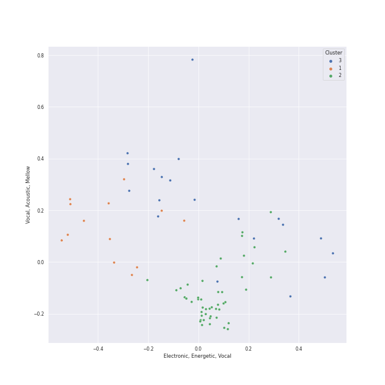

# Clusters in Soundtracks

## Cluster #1

13 tracks

| Art | Track | Album | Artists | Label | Score | 💚 | 🔗 |
|:---|:---|:---|:---|:---|---:|:---|:---|
|  | The Passing of the Elves | The Lord of the Rings: The Fellowship of the Ring - the Complete Recordings | Howard Shore | [Rhino](../../../../labels/rhino), [Warner Records](../../../../labels/warner_records) | 0 | | [🔗](https://open.spotify.com/track/05q7lfYerRkqqNDua3vJOL) |
|  | The Steward of Gondor (feat. Billy Boyd) | The Lord of the Rings: The Return of the King (Original Motion Picture Soundtrack) | Howard Shore, Billy Boyd | [Reprise](../../../../labels/reprise) | 12 | | [🔗](https://open.spotify.com/track/227hmntzKpN4CsYt3RVKcC) |
|  | Into the West | The Lord of the Rings: The Return of the King (Original Motion Picture Soundtrack) | Annie Lennox | [Reprise](../../../../labels/reprise) | 0 | | [🔗](https://open.spotify.com/track/0gSEyG7pOFuHM05433EibX) |
|  | Gollum's Song | The Lord of the Rings: The Two Towers (Original Motion Picture Soundtrack) | Emilíana Torrini | [Reprise](../../../../labels/reprise) | 0 | | [🔗](https://open.spotify.com/track/0mQ1btcyqFDvTpaCFs04cR) |
|  | May It Be | The Lord of the Rings: The Fellowship of the Ring (Original Motion Picture Soundtrack) | Enya | [Reprise](../../../../labels/reprise) | 0 | | [🔗](https://open.spotify.com/track/7LAJWSKK8JMIZAcblgUMS6) |
|  | The Knight Bus | Harry Potter and the Prisoner of Azkaban / Original Motion Picture Soundtrack | John Williams | [Warner Sunset/Nonesuch/Atlantic](../../../../labels/atlantic_records) | 0 | | [🔗](https://open.spotify.com/track/2owMaKos8aeNx0usmPCVmy) |
|  | Mischief Managed! | Harry Potter and the Prisoner of Azkaban / Original Motion Picture Soundtrack | John Williams | [Warner Sunset/Nonesuch/Atlantic](../../../../labels/atlantic_records) | 0 | | [🔗](https://open.spotify.com/track/3NrAMPb3hlWCmw9kepqBmM) |
|  | Pan's Labyrinth Lullaby | Pan's Labyrinth (Original Motion Picture Soundtrack) | Javier Navarrete | Milan Records | 0 | | [🔗](https://open.spotify.com/track/4lKFXSXc1ZpavjZpcR42GC) |
|  | Rose, Dragon | Pan's Labyrinth (Original Motion Picture Soundtrack) | Javier Navarrete | Milan Records | 0 | | [🔗](https://open.spotify.com/track/60L7jskv8r6sACQLrK8tEN) |
|  | Midna's Lament (Twilight Princess) [Instrumental Remix] | The Legend of Zelda: Twilight Princess Instrumental Remix | Monsalve | Monsalve | 0 | | [🔗](https://open.spotify.com/track/4MgRRAK1FSJ0ugHeG53zOp) |
## Cluster #2

50 tracks

| Art | Track | Album | Artists | Label | Score | 💚 | 🔗 |
|:---|:---|:---|:---|:---|---:|:---|:---|
|  | A Storm Is Coming | The Lord of the Rings: The Return of the King (Original Motion Picture Soundtrack) | Howard Shore | [Reprise](../../../../labels/reprise) | 0 | | [🔗](https://open.spotify.com/track/0wicJTv0Jv3xLp37FLb8Eh) |
|  | The Ride of the Rohirrim | The Lord of the Rings: The Return of the King (Original Motion Picture Soundtrack) | Howard Shore | [Reprise](../../../../labels/reprise) | 0 | | [🔗](https://open.spotify.com/track/2l0xjJ6Fj72Bw4ReAJBrAo) |
|  | Treebeard | The Lord of the Rings: The Two Towers (Original Motion Picture Soundtrack) | Howard Shore | [Reprise](../../../../labels/reprise) | 0 | | [🔗](https://open.spotify.com/track/1ssKMFrOyRUa0hn2nFvRnR) |
|  | The White Rider | The Lord of the Rings: The Two Towers (Original Motion Picture Soundtrack) | Howard Shore | [Reprise](../../../../labels/reprise) | 0 | | [🔗](https://open.spotify.com/track/4cnKkXvh0WiFvk0tibAgRW) |
|  | Lothlorien (feat. "Lament for Gandalf") | The Lord of the Rings: The Fellowship of the Ring (Original Motion Picture Soundtrack) | Howard Shore, Elizabeth Fraser | [Reprise](../../../../labels/reprise) | 0 | | [🔗](https://open.spotify.com/track/63CXPpiEiW7JnXvZ1cUXcp) |
|  | The Ring Goes South | The Lord of the Rings: The Fellowship of the Ring (Original Motion Picture Soundtrack) | Howard Shore | [Reprise](../../../../labels/reprise) | 0 | | [🔗](https://open.spotify.com/track/6IQY3GEMC2B3mchMvi4NZj) |
|  | The Flying Sequence | Superman: The Movie (Original Motion Picture Soundtrack) | John Williams | [Rhino](../../../../labels/rhino), [Warner Records](../../../../labels/warner_records) | 0 | | [🔗](https://open.spotify.com/track/5dPcPWdK2V25QKIV7deqfL) |
|  | Flying Theme (From "E.T. the Extra-Terrestrial") | John Williams - Greatest Hits 1969-1999 | John Williams, [London Symphony Orchestra](../../../../artists/london_symphony_orchestra/overview.md) | [Sony Classical](../../../../labels/sony_classical) | 0 | | [🔗](https://open.spotify.com/track/4J9mulgiRlkkgdAONNVGQv) |
|  | Sayuri's Theme | Memoirs of a Geisha | John Williams, Yo-Yo Ma, Itzhak Perlman | [Sony Classical](../../../../labels/sony_classical) | 0 | | [🔗](https://open.spotify.com/track/66EIPOdC3UZZCJdiUSRo92) |
|  | Zelda's Lullaby | Zelda: Link's Ocarina Orchestrated | The Marcus Hedges Trend Orchestra | Joypad Records | 0 | | [🔗](https://open.spotify.com/track/54IIC4P2liSgiufLNuVvuG) |
## Cluster #3

20 tracks

| Art | Track | Album | Artists | Label | Score | 💚 | 🔗 |
|:---|:---|:---|:---|:---|---:|:---|:---|
|  | Lost Woods | The Legend of Zelda: Ocarina of Time | The Greatest Bits | The Greatest Bits | 0 | | [🔗](https://open.spotify.com/track/01KhuD2VJqjUCV6s3ZktkA) |
|  | Ganondorf's Battle | The Legend of Zelda: Ocarina of Time | The Greatest Bits | The Greatest Bits | 0 | | [🔗](https://open.spotify.com/track/6HDZp11vrZH1kBtkAzKj71) |
|  | Fairy's Fountain | The Legend of Zelda: Ocarina of Time | The Greatest Bits | The Greatest Bits | 0 | | [🔗](https://open.spotify.com/track/7e6IhqFPpRdfgD09cCiace) |
|  | Trainer Battle | Pokemon Red & Blue Game Boy Classics | The Greatest Bits | The Greatest Bits | 0 | | [🔗](https://open.spotify.com/track/0ZY6855mwUlQ7FeUBltJpR) |
|  | Tetris Theme A (From "Tetris") | Choose Your Character! | [The 8-Bit Big Band](../../../../artists/the_8-bit_big_band/overview.md) | The 8-Bit Big Band | 244 | 💚 | [🔗](https://open.spotify.com/track/1Am7PA2PBSqXyiByhm3jao) |
|  | Delfino Plaza (From "Super Mario Sunshine") | Choose Your Character! | [The 8-Bit Big Band](../../../../artists/the_8-bit_big_band/overview.md) | The 8-Bit Big Band | 0 | 💚 | [🔗](https://open.spotify.com/track/2gnqOaI0TpTOg8FufLil3Y) |
|  | Luigi's Mansion Theme (From "Luigi's Mansion") | Choose Your Character! | [The 8-Bit Big Band](../../../../artists/the_8-bit_big_band/overview.md) | The 8-Bit Big Band | 0 | 💚 | [🔗](https://open.spotify.com/track/49IoPNyh5U5rTvegOawXqr) |
|  | Cantina Band | Star Wars Episode IV: A New Hope (Original Motion Picture Soundtrack) | John Williams, [London Symphony Orchestra](../../../../artists/london_symphony_orchestra/overview.md) | [Sony Classical](../../../../labels/sony_classical) | 0 | | [🔗](https://open.spotify.com/track/1jUPOeAOtsjjV1jUWc2H1g) |
|  | Pokemon Theme | Pokemon X - Ten Years Of Pokemon | Pokémon | eOne Music | 0 | | [🔗](https://open.spotify.com/track/6xG2ZGudUgtV235xvDlSEt) |
|  | Pokémon Theme | Pokemon - 2.b.a. Master - Music From The Hit Tv Series | Pokémon | eOne Music | 0 | | [🔗](https://open.spotify.com/track/5m5uvPjQT3Md5GKK3qyaXy) |