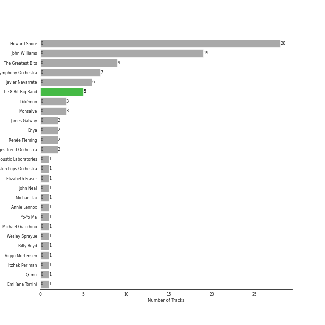
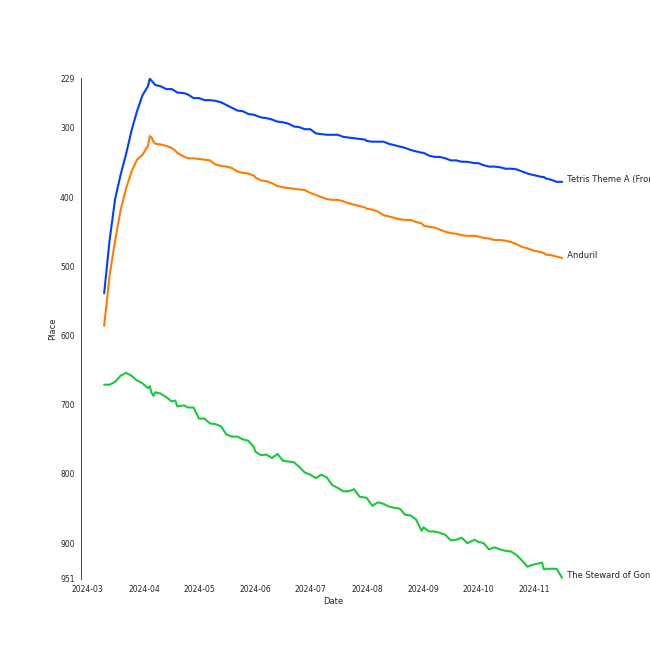
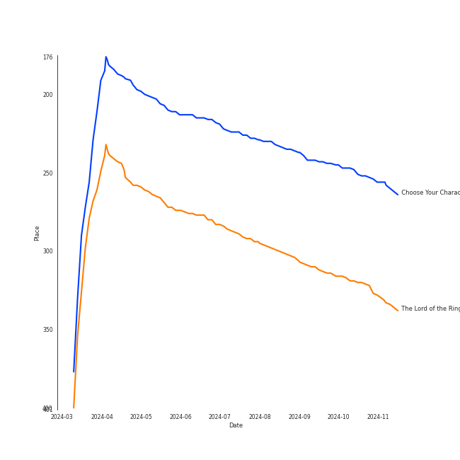
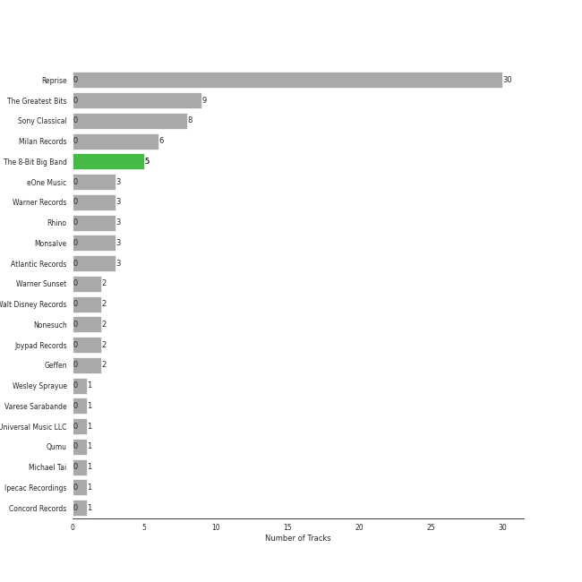

# Soundtracks

[83 tracks (5 liked) 🔗](https://open.spotify.com/playlist/4KUbAosEwUeOuYQ4gRIxCA)

[See Track Features](audio_features.md)

[See Clusters](clusters/overview.md)

## Top Artists

| Art | Rank | Tracks | 💚 | Artist | 🔗 |
|:---|---:|---:|---:|:---|:---|
|  | 149 | 5 | 5 | [The 8-Bit Big Band](../../artists/the_8-bit_big_band/overview.md) | [🔗](https://open.spotify.com/artist/5d1sgs6DwqUcHqQsvwStt2) |
|  | 48 | 28 | 0 | Howard Shore | [🔗](https://open.spotify.com/artist/0OcclcP5o8VKH2TRqSY2A7) |
|  | 361 | 19 | 0 | John Williams | [🔗](https://open.spotify.com/artist/3dRfiJ2650SZu6GbydcHNb) |
|  | 216 | 9 | 0 | The Greatest Bits | [🔗](https://open.spotify.com/artist/2dB3VxAmEw5Dqewiha1oO1) |
|  | 431 | 7 | 0 | [London Symphony Orchestra](../../artists/london_symphony_orchestra/overview.md) | [🔗](https://open.spotify.com/artist/5yxyJsFanEAuwSM5kOuZKc) |
|  | 97 | 6 | 0 | Javier Navarrete | [🔗](https://open.spotify.com/artist/6Ayc7FBYR3HjkGQb7SZrzQ) |
|  | 431 | 3 | 0 | Pokémon | [🔗](https://open.spotify.com/artist/6goK4KMSdP4A8lw8jk4ADk) |
|  | 431 | 3 | 0 | Monsalve | [🔗](https://open.spotify.com/artist/0fagNxnyvy6FDvkNPt6X29) |
|  | 431 | 2 | 0 | James Galway | [🔗](https://open.spotify.com/artist/774mHr909NkDVeyyXQBQfZ) |
|  | 431 | 2 | 0 | Enya | [🔗](https://open.spotify.com/artist/6uothxMWeLWIhsGeF7cyo4) |

See all 26 artists

| Art | Rank | Tracks | 💚 | Artist | 🔗 |
|:---|---:|---:|---:|:---|:---|
|  | 431 | 2 | 0 | Renée Fleming | [🔗](https://open.spotify.com/artist/3SK3gLBgy1jRuA4VnLlcs8) |
|  | 431 | 2 | 0 | The Marcus Hedges Trend Orchestra | [🔗](https://open.spotify.com/artist/123epI2OFu37F7VsnOBn9F) |
|  | 431 | 1 | 0 | Aperture Science Psychoacoustic Laboratories | [🔗](https://open.spotify.com/artist/7d58WZ8qQHy2Sm5p52V2NP) |
|  | 431 | 1 | 0 | Boston Pops Orchestra | [🔗](https://open.spotify.com/artist/7CIcEIOiWaZcEH35cpsdZq) |
|  | 431 | 1 | 0 | Elizabeth Fraser | [🔗](https://open.spotify.com/artist/791Z3924aa619hZ3xsOJEx) |
|  | 431 | 1 | 0 | John Neal | [🔗](https://open.spotify.com/artist/5zMZofgPVYk9IVibwopcbY) |
|  | 431 | 1 | 0 | Michael Tai | [🔗](https://open.spotify.com/artist/5NLlq8IzOUuqDYGPxoPkSC) |
|  | 431 | 1 | 0 | Annie Lennox | [🔗](https://open.spotify.com/artist/5MspMQqdVbdwP6ax3GXqum) |
|  | 431 | 1 | 0 | Yo-Yo Ma | [🔗](https://open.spotify.com/artist/5Dl3HXZjG6ZOWT5cV375lk) |
|  | 431 | 1 | 0 | Michael Giacchino | [🔗](https://open.spotify.com/artist/4kLvhMAuCloLxoP1aVM7Lr) |
|  | 431 | 1 | 0 | Wesley Sprayue | [🔗](https://open.spotify.com/artist/2WC05LNhYfprewGa72WQhP) |
|  | 406 | 1 | 0 | Billy Boyd | [🔗](https://open.spotify.com/artist/1wTKlkGklPb1JMTVUIwAoj) |
|  | 431 | 1 | 0 | Viggo Mortensen | [🔗](https://open.spotify.com/artist/11habIRpXVkScDFp3rJrgu) |
|  | 431 | 1 | 0 | Itzhak Perlman | [🔗](https://open.spotify.com/artist/0hIG9FXgjQxT8fKaYceFbA) |
|  | 431 | 1 | 0 | Qumu | [🔗](https://open.spotify.com/artist/0LzeyDrlLtuyBqMSBN4z3U) |
|  | 431 | 1 | 0 | Emilíana Torrini | [🔗](https://open.spotify.com/artist/08j69Ndyx1P7RLO3Janb5P) |

## Top Tracks

Most and least listened tracks

| Rank | ​ | Most listened tracks | Rank | ​​ | Least listened tracks |
|---:|:---|:---|---:|:---|:---|
| 359 |  | [Tetris Theme A (From "Tetris")](../../artists/the_8-bit_big_band/overview.md) | 989 |  | Helm's Deep |
| 464 |  | Anduril | 989 |  | Lost Woods |
| 912 |  | The Steward of Gondor (feat. Billy Boyd) | 989 |  | Fairy's Fountain |
| 989 |  | Lost Woods | 989 |  | Welcome To Jurassic Park |
| 989 |  | The Passing of the Elves | 989 |  | May It Be |
| 989 |  | Gerudo Valley | 989 |  | Song Of Storms |
| 989 |  | The Return of the King (feat. Sir James Galway, Viggo Mortensen and Renee Fleming) | 989 |  | Theme From Jurassic Park - From "Jurassic Park" Soundtrack |
| 989 |  | [Still Alive (From "Portal")](../../artists/the_8-bit_big_band/overview.md) | 989 |  | Breath of Life |
| 989 |  | Samwise the Brave | 989 |  | Pokemon Theme |
| 989 |  | Many Meetings | 989 |  | Star Trek Main Theme |

## Top Albums

| Art | Rank | Tracks | 💚 | Album | Release Date | 🔗 |
|:---|---:|---:|---:|:---|:---|:---|
|  | 320 | 11 | 0 | The Lord of the Rings: The Return of the King (Original Motion Picture Soundtrack) | 2003-11-24 | [🔗](https://open.spotify.com/album/38x0H9PdY1fHh8EdfPUXqa) |
|  | 651 | 10 | 0 | The Lord of the Rings: The Two Towers (Original Motion Picture Soundtrack) | 2002-12-02 | [🔗](https://open.spotify.com/album/1zIoYLpYOq8d4HFzHJ7vc8) |
|  | 651 | 9 | 0 | The Lord of the Rings: The Fellowship of the Ring (Original Motion Picture Soundtrack) | 2001-11-19 | [🔗](https://open.spotify.com/album/04rz93AqGy9JduzV3K81Dh) |
|  | 651 | 6 | 0 | Pan's Labyrinth (Original Motion Picture Soundtrack) | 2006-12-19 | [🔗](https://open.spotify.com/album/5b5tWFo32wYBLMweeiL8vE) |
|  | 251 | 5 | 5 | Choose Your Character! | 2019-06-24 | [🔗](https://open.spotify.com/album/2d3PcBi2ID1sLe8ZRTmxIi) |
|  | 651 | 5 | 0 | The Legend of Zelda: Ocarina of Time | 2014-03-14 | [🔗](https://open.spotify.com/album/76y1I6Pm58uMMrwk5ep1Z3) |
|  | 651 | 3 | 0 | The Legend of Zelda: Twilight Princess Instrumental Remix | 2016-08-01 | [🔗](https://open.spotify.com/album/3HMKaMmIqDLvbbZ7PVDW9z) |
|  | 651 | 3 | 0 | Star Wars Episode IV: A New Hope (Original Motion Picture Soundtrack) | 1997 | [🔗](https://open.spotify.com/album/39vpWS7vrC4Pz33bNafjva) |
|  | 651 | 3 | 0 | Pokemon Red & Blue Game Boy Classics | 2014-03-26 | [🔗](https://open.spotify.com/album/4p3rHiPRhDwt1PgqWsk3D7) |
|  | 651 | 2 | 0 | Zelda: Link's Ocarina Orchestrated | 2013-08-26 | [🔗](https://open.spotify.com/album/6CN9dnwE7EzSZfjYEtUx5r) |

See all 31 albums

| Art | Rank | Tracks | 💚 | Album | Release Date | 🔗 |
|:---|---:|---:|---:|:---|:---|:---|
|  | 651 | 2 | 0 | Superman: The Movie (Original Motion Picture Soundtrack) | 2005-03-15 | [🔗](https://open.spotify.com/album/7Hlfql6zSPcQGyZZ6TY5jO) |
|  | 651 | 2 | 0 | Pokemon X - Ten Years Of Pokemon | 2007-03-27 | [🔗](https://open.spotify.com/album/3qW0KwoP8BdFzqZSDh1ScI) |
|  | 651 | 2 | 0 | Jurassic Park | 1993-05-25 | [🔗](https://open.spotify.com/album/1yyFmCMeNtuLWsLZAXPStf) |
|  | 651 | 2 | 0 | John Williams - Greatest Hits 1969-1999 | 2014-08-18 | [🔗](https://open.spotify.com/album/3xeo92ykCYWfe32si3I6zF) |
|  | 651 | 2 | 0 | Harry Potter and the Prisoner of Azkaban / Original Motion Picture Soundtrack | 2004-05-25 | [🔗](https://open.spotify.com/album/7DDls7RWrCLvZgTVCJgfcq) |
|  | 651 | 1 | 0 | Zelda: Ocarina of Time - Piano | 2014-06-20 | [🔗](https://open.spotify.com/album/2nVR3QSwlsV6G5DsmtVThj) |
|  | 651 | 1 | 0 | The Lord of the Rings: The Fellowship of the Ring - the Complete Recordings | 2001 | [🔗](https://open.spotify.com/album/55RTkgUCP7t80hiTUhATMH) |
|  | 651 | 1 | 0 | Tetris | 2011-05-20 | [🔗](https://open.spotify.com/album/71XXg2JEWScmpAFwIh71gV) |
|  | 651 | 1 | 0 | Star Wars: The Phantom Menace (Original Motion Picture Soundtrack) | 1999-05-04 | [🔗](https://open.spotify.com/album/45EFycwtfRhnDPWbc2mClK) |
|  | 651 | 1 | 0 | Star Wars: The Empire Strikes Back (Original Motion Picture Soundtrack) | 1980-01-01 | [🔗](https://open.spotify.com/album/669tU9gpisLy8EM6qlKrdL) |
|  | 651 | 1 | 0 | Star Wars Episode V: The Empire Strikes Back (Original Motion Picture Soundtrack) | 1997 | [🔗](https://open.spotify.com/album/0a5t6HeElUsxiFrdocSlBM) |
|  | 651 | 1 | 0 | Star Trek Into Darkness - Music From The Motion Picture | 2013-01-01 | [🔗](https://open.spotify.com/album/0dst3z0HnOCF0pdU05AZ4b) |
|  | 651 | 1 | 0 | Portal 2: Songs to Test By (Collectors Edition) | 2011 | [🔗](https://open.spotify.com/album/21MOM5nRM9SjIsonoOGY4Q) |
|  | 651 | 1 | 0 | Pokemon - 2.b.a. Master - Music From The Hit Tv Series | 1999-06-29 | [🔗](https://open.spotify.com/album/3n86RctzbnrGY599Vo0fhg) |
|  | 651 | 1 | 0 | Piano/Instrumental Works: Video Game Themes - Volume I | 2014-03-14 | [🔗](https://open.spotify.com/album/0cGrxmeeS0hVekf8E7tZtO) |
|  | 651 | 1 | 0 | Pallet Town (From "Pokémon Red and Blue") | 2021-02-25 | [🔗](https://open.spotify.com/album/4QalTa70oHb9uuahZCLh20) |
|  | 651 | 1 | 0 | Memoirs of a Geisha | 2005-11-22 | [🔗](https://open.spotify.com/album/4EstIlJ9P9TVBCOlvVLADj) |
|  | 651 | 1 | 0 | Jurassic Park (Soundtrack) | 1993-01-01 | [🔗](https://open.spotify.com/album/1PgeYPKQY9H5pxHGJa5izY) |
|  | 651 | 1 | 0 | John Williams & Steven Spielberg: The Ultimate Collection | 2017-03-17 | [🔗](https://open.spotify.com/album/2K9laKccwpVMQf2lJoVJVg) |
|  | 651 | 1 | 0 | Indiana Jones and the Kingdom of the Crystal Skull (International Jewel) | 2008-01-01 | [🔗](https://open.spotify.com/album/6NKHFx1dBKrBU68RDFo76f) |
|  | 651 | 1 | 0 | Harry Potter and The Sorcerer's Stone Original Motion Picture Soundtrack | 2001-10-30 | [🔗](https://open.spotify.com/album/6zeHM5CV0CjcS0K8ouWE4N) |

## Top Record Labels

| Tracks | 💚 | Label |
|---:|---:|:---|
| 5 | 5 | The 8-Bit Big Band |
| 30 | 0 | [Reprise](../../labels/reprise/overview.md) |
| 9 | 0 | The Greatest Bits |
| 8 | 0 | [Sony Classical](../../labels/sony_classical/overview.md) |
| 6 | 0 | Milan Records |
| 3 | 0 | eOne Music |
| 3 | 0 | [Warner Records](../../labels/warner_records/overview.md) |
| 3 | 0 | [Rhino](../../labels/rhino/overview.md) |
| 3 | 0 | Monsalve |
| 3 | 0 | [Atlantic Records](../../labels/atlantic_records/overview.md) |

See all 22 labels

| Tracks | 💚 | Label |
|---:|---:|:---|
| 2 | 0 | Warner Sunset |
| 2 | 0 | [Walt Disney Records](../../labels/walt_disney_records/overview.md) |
| 2 | 0 | Nonesuch |
| 2 | 0 | Joypad Records |
| 2 | 0 | [Geffen](../../labels/geffen/overview.md) |
| 1 | 0 | Wesley Sprayue |
| 1 | 0 | Varese Sarabande |
| 1 | 0 | [Universal Music LLC](../../labels/universal_music_llc/overview.md) |
| 1 | 0 | Qumu |
| 1 | 0 | Michael Tai |
| 1 | 0 | Ipecac Recordings |
| 1 | 0 | Concord Records |

## Genres

| Tracks | 💚 | Genre |
|---:|---:|:---|
| 5 | 5 | 8-bit |
| 53 | 0 | [soundtrack](../../genres/soundtrack/overview.md) |
| 47 | 0 | orchestral soundtrack |
| 43 | 0 | scorecore |
| 28 | 0 | middle earth |
| 28 | 0 | canadian soundtrack |
| 28 | 0 | canadian classical |
| 6 | 0 | latin soundtrack |
| 3 | 0 | otacore |
| 3 | 0 | cartoon |

See all 29 genres

| Tracks | 💚 | Genre |
|---:|---:|:---|
| 1 | 0 | video game music |
| 1 | 0 | vgm remix |
| 1 | 0 | synthpop |
| 1 | 0 | [soft rock](../../genres/soft_rock/overview.md) |
| 1 | 0 | [singer-songwriter](../../genres/singer-songwriter/overview.md) |
| 1 | 0 | pixel |
| 1 | 0 | orchestra |
| 1 | 0 | operatic pop |
| 1 | 0 | new wave pop |
| 1 | 0 | new wave |
| 1 | 0 | new romantic |
| 1 | 0 | lo-fi vgm |
| 1 | 0 | icelandic singer-songwriter |
| 1 | 0 | icelandic pop |
| 1 | 0 | icelandic indie |
| 1 | 0 | gregorian dance |
| 1 | 0 | [classical](../../genres/classical/overview.md) |
| 1 | 0 | celtic |
| 1 | 0 | british orchestra |

## Top Producers

| Art | Producer | Tracks | Credit Types |
|:---|:---|---:|:---|
| | Charlie Rosen | 5 | Arranger, Producer |
| | John Kilgore | 5 | Producer |
| | 田中宏和 (Tanaka, Hirokazu) | 1 | Arranger |
| | 戸高一生 (Totaka, Kazumi) | 1 | Songwriter |
| | 増田順一 (Masuda, Jun'ichi) | 1 | Songwriter |
| | 近藤浩治 (Kondo, Koji) | 1 | Songwriter |
| | Jonathan Coulton | 1 | Lyricist, Songwriter |

## Years

| ​ | 10 newest albums | ​​ | 10 oldest albums |
|:---|:---|:---|:---|
|  | Pallet Town (From "Pokémon Red and Blue") (2021-02-25) |  | Star Wars: The Empire Strikes Back (Original Motion Picture Soundtrack) (1980-01-01) |
|  | Choose Your Character! (2019-06-24) |  | Jurassic Park (Soundtrack) (1993-01-01) |
|  | John Williams & Steven Spielberg: The Ultimate Collection (2017-03-17) |  | Jurassic Park (1993-05-25) |
|  | The Legend of Zelda: Twilight Princess Instrumental Remix (2016-08-01) |  | Star Wars Episode V: The Empire Strikes Back (Original Motion Picture Soundtrack) (1997) |
|  | John Williams - Greatest Hits 1969-1999 (2014-08-18) |  | Star Wars Episode IV: A New Hope (Original Motion Picture Soundtrack) (1997) |
|  | Zelda: Ocarina of Time - Piano (2014-06-20) |  | Star Wars: The Phantom Menace (Original Motion Picture Soundtrack) (1999-05-04) |
|  | Pokemon Red & Blue Game Boy Classics (2014-03-26) |  | Pokemon - 2.b.a. Master - Music From The Hit Tv Series (1999-06-29) |
|  | The Legend of Zelda: Ocarina of Time (2014-03-14) |  | The Lord of the Rings: The Fellowship of the Ring - the Complete Recordings (2001) |
|  | Piano/Instrumental Works: Video Game Themes - Volume I (2014-03-14) |  | Harry Potter and The Sorcerer's Stone Original Motion Picture Soundtrack (2001-10-30) |
|  | Zelda: Link's Ocarina Orchestrated (2013-08-26) |  | The Lord of the Rings: The Fellowship of the Ring (Original Motion Picture Soundtrack) (2001-11-19) |