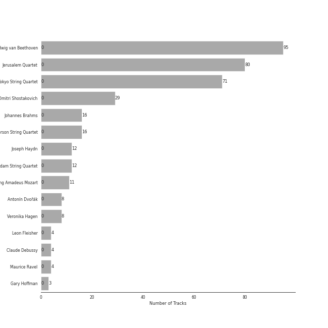

# String Quartets

## Top Artists

See all artists

|   Number of Tracks | Artist                                                                     | 🔗                                                           |
|-------------------:|:---------------------------------------------------------------------------|:------------------------------------------------------------|
|                 95 | [Ludwig van Beethoven](../artists/ludwig_van_beethoven.md)                 | [🔗](https://open.spotify.com/artist/2wOqMjp9TyABvtHdOSOTUS) |
|                 80 | [Jerusalem Quartet](../artists/jerusalem_quartet.md)                       | [🔗](https://open.spotify.com/artist/7AnE8Jpu1vxLeXcs6OKYHE) |
|                 71 | [Tokyo String Quartet](../artists/tokyo_string_quartet.md)                 | [🔗](https://open.spotify.com/artist/15G9RnBNBDCFUMANna2CvO) |
|                 29 | [Dmitri Shostakovich](../artists/dmitri_shostakovich.md)                   | [🔗](https://open.spotify.com/artist/6s1pCNXcbdtQJlsnM1hRIA) |
|                 16 | [Johannes Brahms](../artists/johannes_brahms.md)                           | [🔗](https://open.spotify.com/artist/5wTAi7QkpP6kp8a54lmTOq) |
|                 16 | [Emerson String Quartet](../artists/emerson_string_quartet.md)             | [🔗](https://open.spotify.com/artist/4IBl8k6ZsBagsI5zRjyXH7) |
|                 12 | [Joseph Haydn](../artists/joseph_haydn.md)                                 | [🔗](https://open.spotify.com/artist/656RXuyw7CE0dtjdPgjJV6) |
|                 12 | [The Amsterdam String Quartet](../artists/the_amsterdam_string_quartet.md) | [🔗](https://open.spotify.com/artist/0kbgyaL9g2Eba79p2jiYlN) |
|                 11 | [Wolfgang Amadeus Mozart](../artists/wolfgang_amadeus_mozart.md)           | [🔗](https://open.spotify.com/artist/4NJhFmfw43RLBLjQvxDuRS) |
|                  8 | Antonín Dvořák                                                             | [🔗](https://open.spotify.com/artist/6n7nd5iceYpXVwcx8VPpxF) |
|                  8 | Veronika Hagen                                                             | [🔗](https://open.spotify.com/artist/3ijxXTal6hr7byhqZDdHsP) |
|                  4 | Leon Fleisher                                                              | [🔗](https://open.spotify.com/artist/6ncNdxBc8zVWMOF7nJ5Pgy) |
|                  4 | [Claude Debussy](../artists/claude_debussy.md)                             | [🔗](https://open.spotify.com/artist/1Uff91EOsvd99rtAupatMP) |
|                  4 | Maurice Ravel                                                              | [🔗](https://open.spotify.com/artist/17hR0sYHpx7VYTMRfFUOmY) |
|                  3 | Gary Hoffman                                                               | [🔗](https://open.spotify.com/artist/7qcRbaIYVuOERS3KmB71GH) |

## Tracks

| Track                                                                                                                       | Album                                                  | Artists                                                                                                                         | 💚   | 🔗                                                          |
|:----------------------------------------------------------------------------------------------------------------------------|:-------------------------------------------------------|:--------------------------------------------------------------------------------------------------------------------------------|:----|:-----------------------------------------------------------|
| String Quartet No. 1 in C Major, Op. 49: I. Moderato                                                                        | Shostakovich: String Quartets Nos. 1, 4, 6, 8, 9 & 11  | [Dmitri Shostakovich](../artists/dmitri_shostakovich.md), [Jerusalem Quartet](../artists/jerusalem_quartet.md)                  |     | [🔗](https://open.spotify.com/track/5VQz0yG8Lzvjj4RCbDLMrJ) |
| String Quartet No. 1 in C Major, Op. 49: II. Moderato                                                                       | Shostakovich: String Quartets Nos. 1, 4, 6, 8, 9 & 11  | [Dmitri Shostakovich](../artists/dmitri_shostakovich.md), [Jerusalem Quartet](../artists/jerusalem_quartet.md)                  |     | [🔗](https://open.spotify.com/track/0A5oxICmtISYvCLCKY5BZs) |
| String Quartet No. 1 in C Major, Op. 49: III. Allegro molto                                                                 | Shostakovich: String Quartets Nos. 1, 4, 6, 8, 9 & 11  | [Dmitri Shostakovich](../artists/dmitri_shostakovich.md), [Jerusalem Quartet](../artists/jerusalem_quartet.md)                  |     | [🔗](https://open.spotify.com/track/5O8Iz6Mlz4oS0DP6YYyBQC) |
| String Quartet No. 1 in C Major, Op. 49: IV. Allegro                                                                        | Shostakovich: String Quartets Nos. 1, 4, 6, 8, 9 & 11  | [Dmitri Shostakovich](../artists/dmitri_shostakovich.md), [Jerusalem Quartet](../artists/jerusalem_quartet.md)                  |     | [🔗](https://open.spotify.com/track/0nxe3lOpIX0rt3E9vcrRn5) |
| String Quartet No. 4 in D Major, Op. 83: I. Allegretto                                                                      | Shostakovich: String Quartets Nos. 1, 4, 6, 8, 9 & 11  | [Dmitri Shostakovich](../artists/dmitri_shostakovich.md), [Jerusalem Quartet](../artists/jerusalem_quartet.md)                  |     | [🔗](https://open.spotify.com/track/2ESTZJCtAtRNts4sKVVTsl) |
| String Quartet No. 4 in D Major, Op. 83: II. Andantino                                                                      | Shostakovich: String Quartets Nos. 1, 4, 6, 8, 9 & 11  | [Dmitri Shostakovich](../artists/dmitri_shostakovich.md), [Jerusalem Quartet](../artists/jerusalem_quartet.md)                  |     | [🔗](https://open.spotify.com/track/4Ky633fVEZUBTOcjKbY7yc) |
| String Quartet No. 4 in D Major, Op. 83: III. Allegretto                                                                    | Shostakovich: String Quartets Nos. 1, 4, 6, 8, 9 & 11  | [Dmitri Shostakovich](../artists/dmitri_shostakovich.md), [Jerusalem Quartet](../artists/jerusalem_quartet.md)                  |     | [🔗](https://open.spotify.com/track/2cDsjReMRP1B3dLSH8uBRx) |
| String Quartet No. 4 in D Major, Op. 83: IV. Allegretto                                                                     | Shostakovich: String Quartets Nos. 1, 4, 6, 8, 9 & 11  | [Dmitri Shostakovich](../artists/dmitri_shostakovich.md), [Jerusalem Quartet](../artists/jerusalem_quartet.md)                  |     | [🔗](https://open.spotify.com/track/4qM31gOqZIt7skvz2kgaOC) |
| String Quartet No. 6 in G Major, Op. 101: I. Allegretto                                                                     | Shostakovich: String Quartets Nos. 1, 4, 6, 8, 9 & 11  | [Dmitri Shostakovich](../artists/dmitri_shostakovich.md), [Jerusalem Quartet](../artists/jerusalem_quartet.md)                  |     | [🔗](https://open.spotify.com/track/0k7Zd9zAYnBPuNJPck4UOc) |
| String Quartet No. 6 in G Major, Op. 101: II. Moderato con moto                                                             | Shostakovich: String Quartets Nos. 1, 4, 6, 8, 9 & 11  | [Dmitri Shostakovich](../artists/dmitri_shostakovich.md), [Jerusalem Quartet](../artists/jerusalem_quartet.md)                  |     | [🔗](https://open.spotify.com/track/5BqEbEtqCpIrKRJh5c3Z3u) |
| String Quartet No. 6 in G Major, Op. 101: III. Lento                                                                        | Shostakovich: String Quartets Nos. 1, 4, 6, 8, 9 & 11  | [Dmitri Shostakovich](../artists/dmitri_shostakovich.md), [Jerusalem Quartet](../artists/jerusalem_quartet.md)                  |     | [🔗](https://open.spotify.com/track/01toQ1HaV4k4aUqWqNsdJe) |
| String Quartet No. 6 in G Major, Op. 101: IV. Finale (Lento) - Allegretto                                                   | Shostakovich: String Quartets Nos. 1, 4, 6, 8, 9 & 11  | [Dmitri Shostakovich](../artists/dmitri_shostakovich.md), [Jerusalem Quartet](../artists/jerusalem_quartet.md)                  |     | [🔗](https://open.spotify.com/track/3EcruCCCtRp7fi5K2YfAA5) |
| String Quartet No. 8 in C Minor, Op. 110: I. Largo                                                                          | Shostakovich: String Quartets Nos. 1, 4, 6, 8, 9 & 11  | [Dmitri Shostakovich](../artists/dmitri_shostakovich.md), [Jerusalem Quartet](../artists/jerusalem_quartet.md)                  |     | [🔗](https://open.spotify.com/track/2wtSkXod5g0Ms9h9Amd9FD) |
| String Quartet No. 8 in C Minor, Op. 110: II. Allegro molto                                                                 | Shostakovich: String Quartets Nos. 1, 4, 6, 8, 9 & 11  | [Dmitri Shostakovich](../artists/dmitri_shostakovich.md), [Jerusalem Quartet](../artists/jerusalem_quartet.md)                  |     | [🔗](https://open.spotify.com/track/5EXeMOFxbHkj2lgACzXpzr) |
| String Quartet No. 8 in C Minor, Op. 110: III. Allegretto                                                                   | Shostakovich: String Quartets Nos. 1, 4, 6, 8, 9 & 11  | [Dmitri Shostakovich](../artists/dmitri_shostakovich.md), [Jerusalem Quartet](../artists/jerusalem_quartet.md)                  |     | [🔗](https://open.spotify.com/track/1uQEWRgoZxzAn7OScQl9nV) |
| String Quartet No. 8 in C Minor, Op. 110: IV. Largo                                                                         | Shostakovich: String Quartets Nos. 1, 4, 6, 8, 9 & 11  | [Dmitri Shostakovich](../artists/dmitri_shostakovich.md), [Jerusalem Quartet](../artists/jerusalem_quartet.md)                  |     | [🔗](https://open.spotify.com/track/0axYJ2DSUKXkL67CnUDN3t) |
| String Quartet No. 8 in C Minor, Op. 110: V. Largo                                                                          | Shostakovich: String Quartets Nos. 1, 4, 6, 8, 9 & 11  | [Dmitri Shostakovich](../artists/dmitri_shostakovich.md), [Jerusalem Quartet](../artists/jerusalem_quartet.md)                  |     | [🔗](https://open.spotify.com/track/7I1ePDRDp8RvVv9lPU5wHi) |
| String Quartet No. 9 in E-Flat Major, Op. 117: I. Moderato Con Moto                                                         | Shostakovich: String Quartets Nos. 1, 4, 6, 8, 9 & 11  | [Dmitri Shostakovich](../artists/dmitri_shostakovich.md), [Jerusalem Quartet](../artists/jerusalem_quartet.md)                  |     | [🔗](https://open.spotify.com/track/7c1PZ3jfMdI65Oqn1uI74j) |
| String Quartet No. 9 in E-Flat Major, Op. 117: II. Adagio                                                                   | Shostakovich: String Quartets Nos. 1, 4, 6, 8, 9 & 11  | [Dmitri Shostakovich](../artists/dmitri_shostakovich.md), [Jerusalem Quartet](../artists/jerusalem_quartet.md)                  |     | [🔗](https://open.spotify.com/track/4u51lPm5GBz9CmJxODuV60) |
| String Quartet No. 9 in E-Flat Major, Op. 117: III. Allegretto                                                              | Shostakovich: String Quartets Nos. 1, 4, 6, 8, 9 & 11  | [Dmitri Shostakovich](../artists/dmitri_shostakovich.md), [Jerusalem Quartet](../artists/jerusalem_quartet.md)                  |     | [🔗](https://open.spotify.com/track/57vPVZyYD3Cfxlpmqqdgl5) |
| String Quartet No. 9 in E-Flat Major, Op. 117: IV. Adagio                                                                   | Shostakovich: String Quartets Nos. 1, 4, 6, 8, 9 & 11  | [Dmitri Shostakovich](../artists/dmitri_shostakovich.md), [Jerusalem Quartet](../artists/jerusalem_quartet.md)                  |     | [🔗](https://open.spotify.com/track/0vpGcgNCl9p9UQdtCOajUG) |
| String Quartet No. 9 in E-Flat Major, Op. 117: V. Allegro                                                                   | Shostakovich: String Quartets Nos. 1, 4, 6, 8, 9 & 11  | [Dmitri Shostakovich](../artists/dmitri_shostakovich.md), [Jerusalem Quartet](../artists/jerusalem_quartet.md)                  |     | [🔗](https://open.spotify.com/track/6XOKaXhXamHmqSa38Uwf4A) |
| String Quartet No.11 in F Minor, Op. 122: I. Introduction (Andantino)                                                       | Shostakovich: String Quartets Nos. 1, 4, 6, 8, 9 & 11  | [Dmitri Shostakovich](../artists/dmitri_shostakovich.md), [Jerusalem Quartet](../artists/jerusalem_quartet.md)                  |     | [🔗](https://open.spotify.com/track/4tcinhmPDuyaskdPrqjWB9) |
| String Quartet No.11 in F Minor, Op. 122: II. Scherzo (Allegretto)                                                          | Shostakovich: String Quartets Nos. 1, 4, 6, 8, 9 & 11  | [Dmitri Shostakovich](../artists/dmitri_shostakovich.md), [Jerusalem Quartet](../artists/jerusalem_quartet.md)                  |     | [🔗](https://open.spotify.com/track/5axBmM6eFCRlBCXlBIZGJM) |
| String Quartet No.11 in F Minor, Op. 122: III. Récitatif (Adagio)                                                           | Shostakovich: String Quartets Nos. 1, 4, 6, 8, 9 & 11  | [Dmitri Shostakovich](../artists/dmitri_shostakovich.md), [Jerusalem Quartet](../artists/jerusalem_quartet.md)                  |     | [🔗](https://open.spotify.com/track/02ys9P2W1zcsnWAw9LbaRD) |
| String Quartet No.11 in F Minor, Op. 122: IV. Etude (Allegro)                                                               | Shostakovich: String Quartets Nos. 1, 4, 6, 8, 9 & 11  | [Dmitri Shostakovich](../artists/dmitri_shostakovich.md), [Jerusalem Quartet](../artists/jerusalem_quartet.md)                  |     | [🔗](https://open.spotify.com/track/1jXkZMpNRhBlzleAvtfTop) |
| String Quartet No.11 in F Minor, Op. 122: V. Humoresque (Allegro)                                                           | Shostakovich: String Quartets Nos. 1, 4, 6, 8, 9 & 11  | [Dmitri Shostakovich](../artists/dmitri_shostakovich.md), [Jerusalem Quartet](../artists/jerusalem_quartet.md)                  |     | [🔗](https://open.spotify.com/track/4ikkJi208jmFPkdZGsSe71) |
| String Quartet No.11 in F Minor, Op. 122: VI. Elégie (Adagio)                                                               | Shostakovich: String Quartets Nos. 1, 4, 6, 8, 9 & 11  | [Dmitri Shostakovich](../artists/dmitri_shostakovich.md), [Jerusalem Quartet](../artists/jerusalem_quartet.md)                  |     | [🔗](https://open.spotify.com/track/4oCDQYx2mAoP7cXyGEoVDe) |
| String Quartet No.11 in F Minor, Op. 122: VII. Finale (Moderato)                                                            | Shostakovich: String Quartets Nos. 1, 4, 6, 8, 9 & 11  | [Dmitri Shostakovich](../artists/dmitri_shostakovich.md), [Jerusalem Quartet](../artists/jerusalem_quartet.md)                  |     | [🔗](https://open.spotify.com/track/76ZylpA4UyhA3gQn0INmqF) |
| String Quintet No. 3, Op. 97: I. Allegro non tanto                                                                          | Dvorak: String Quintet, Op. 97 & String Sextet, Op. 48 | [Jerusalem Quartet](../artists/jerusalem_quartet.md), Antonín Dvořák, Veronika Hagen                                            |     | [🔗](https://open.spotify.com/track/3SwpQeSrLjp6mgUee0HYwG) |
| String Quintet No. 3, Op. 97: II. Allegro vivo - Minore. Un poco meno mosso                                                 | Dvorak: String Quintet, Op. 97 & String Sextet, Op. 48 | [Jerusalem Quartet](../artists/jerusalem_quartet.md), Antonín Dvořák, Veronika Hagen                                            |     | [🔗](https://open.spotify.com/track/23gYTbrPlIyLSIxac0PfrM) |
| String Quintet No. 3, Op. 97: III. Larghetto                                                                                | Dvorak: String Quintet, Op. 97 & String Sextet, Op. 48 | [Jerusalem Quartet](../artists/jerusalem_quartet.md), Antonín Dvořák, Veronika Hagen                                            |     | [🔗](https://open.spotify.com/track/4ZdgET0UACAG4mHLd8lZYu) |
| String Quintet No. 3, Op. 97: IV. Finale. Allegro giusto                                                                    | Dvorak: String Quintet, Op. 97 & String Sextet, Op. 48 | [Jerusalem Quartet](../artists/jerusalem_quartet.md), Antonín Dvořák, Veronika Hagen                                            |     | [🔗](https://open.spotify.com/track/6K2rgT3cbyNwMW1V5Hc60i) |
| String Sextet, Op. 48: IV. Finale. Tema con variazioni - Allegretto grazioso, quasi andantino                               | Dvorak: String Quintet, Op. 97 & String Sextet, Op. 48 | [Jerusalem Quartet](../artists/jerusalem_quartet.md), Antonín Dvořák, Veronika Hagen                                            |     | [🔗](https://open.spotify.com/track/1BwgToZUccesFsTGQ8mBdS) |
| String Sextet, Op. 48: I. Allegro moderato                                                                                  | Dvorak: String Quintet, Op. 97 & String Sextet, Op. 48 | [Jerusalem Quartet](../artists/jerusalem_quartet.md), Antonín Dvořák, Veronika Hagen, Gary Hoffman                              |     | [🔗](https://open.spotify.com/track/5Bn7rXQJDCOkR50kqlkkfv) |
| String Sextet, Op. 48: II. Dumka (Elegie). Poco allegretto                                                                  | Dvorak: String Quintet, Op. 97 & String Sextet, Op. 48 | [Jerusalem Quartet](../artists/jerusalem_quartet.md), Antonín Dvořák, Veronika Hagen, Gary Hoffman                              |     | [🔗](https://open.spotify.com/track/2ioJboDNAzvnntmzl0YYnC) |
| String Sextet, Op. 48: III. Furiant. Presto - Trio                                                                          | Dvorak: String Quintet, Op. 97 & String Sextet, Op. 48 | [Jerusalem Quartet](../artists/jerusalem_quartet.md), Antonín Dvořák, Veronika Hagen, Gary Hoffman                              |     | [🔗](https://open.spotify.com/track/0b7X9ecotXBp5yYALXdDua) |
| String Quartet in G Minor, Op. 10: I. Animé et très décidé                                                                  | Debussy & Ravel: String Quartets                       | [Jerusalem Quartet](../artists/jerusalem_quartet.md), [Claude Debussy](../artists/claude_debussy.md)                            |     | [🔗](https://open.spotify.com/track/6VRCCEvDGOsiOe6M6qDsBq) |
| String Quartet in G Minor, Op. 10: II. Assez vif et bien rythmé                                                             | Debussy & Ravel: String Quartets                       | [Jerusalem Quartet](../artists/jerusalem_quartet.md), [Claude Debussy](../artists/claude_debussy.md)                            |     | [🔗](https://open.spotify.com/track/4Az9YkyhksfJpgt00w01dl) |
| String Quartet in G Minor, Op. 10: III. Andantino, doucement expressif                                                      | Debussy & Ravel: String Quartets                       | [Jerusalem Quartet](../artists/jerusalem_quartet.md), [Claude Debussy](../artists/claude_debussy.md)                            |     | [🔗](https://open.spotify.com/track/3ARP0EeVUiwPBc8OLhBCMg) |
| String Quartet in G Minor, Op. 10: IV. Très modéré                                                                          | Debussy & Ravel: String Quartets                       | [Jerusalem Quartet](../artists/jerusalem_quartet.md), [Claude Debussy](../artists/claude_debussy.md)                            |     | [🔗](https://open.spotify.com/track/4RQxDeNkibXjHkIkBXify8) |
| String Quartet No. 1 in F Major, Op. 18 No. 1: I. Allegro con brio                                                          | Beethoven: String Quartets, Op. 18                     | [Jerusalem Quartet](../artists/jerusalem_quartet.md), [Ludwig van Beethoven](../artists/ludwig_van_beethoven.md)                |     | [🔗](https://open.spotify.com/track/0bLf8GdqFZ3rK8GwWhcjH8) |
| String Quartet No. 1 in F Major, Op. 18 No. 1: II. Adagio affettuoso ed appassionato                                        | Beethoven: String Quartets, Op. 18                     | [Jerusalem Quartet](../artists/jerusalem_quartet.md), [Ludwig van Beethoven](../artists/ludwig_van_beethoven.md)                |     | [🔗](https://open.spotify.com/track/74Din3wPGdlksjg6kz68Mw) |
| String Quartet No. 1 in F Major, Op. 18 No. 1: III. Scherzo (Allegro molto) - Trio                                          | Beethoven: String Quartets, Op. 18                     | [Jerusalem Quartet](../artists/jerusalem_quartet.md), [Ludwig van Beethoven](../artists/ludwig_van_beethoven.md)                |     | [🔗](https://open.spotify.com/track/62gkGN2sOcxtVmoDGCeajT) |
| String Quartet No. 1 in F Major, Op. 18 No. 1: IV. Allegro                                                                  | Beethoven: String Quartets, Op. 18                     | [Jerusalem Quartet](../artists/jerusalem_quartet.md), [Ludwig van Beethoven](../artists/ludwig_van_beethoven.md)                |     | [🔗](https://open.spotify.com/track/37ygTHqOZWYgHuBSEZ8M3V) |
| String Quartet No. 2 in G Major, Op. 18, No. 2: I. Allegro                                                                  | Beethoven: String Quartets, Op. 18                     | [Jerusalem Quartet](../artists/jerusalem_quartet.md), [Ludwig van Beethoven](../artists/ludwig_van_beethoven.md)                |     | [🔗](https://open.spotify.com/track/558uK4J0UIghC9WVf1lAuk) |
| String Quartet No. 2 in G Major, Op. 18, No. 2: II. Adagio cantabile - Allegro                                              | Beethoven: String Quartets, Op. 18                     | [Jerusalem Quartet](../artists/jerusalem_quartet.md), [Ludwig van Beethoven](../artists/ludwig_van_beethoven.md)                |     | [🔗](https://open.spotify.com/track/7v0g3biHWMpypyv0hfxroQ) |
| String Quartet No. 2 in G Major, Op. 18, No. 2: III. Scherzo (Allegro) - Trio                                               | Beethoven: String Quartets, Op. 18                     | [Jerusalem Quartet](../artists/jerusalem_quartet.md), [Ludwig van Beethoven](../artists/ludwig_van_beethoven.md)                |     | [🔗](https://open.spotify.com/track/5NFYYgZwkSOTpOZNeqiinF) |
| String Quartet No. 2 in G Major, Op. 18, No. 2: IV. Allegro molto, quasi presto                                             | Beethoven: String Quartets, Op. 18                     | [Jerusalem Quartet](../artists/jerusalem_quartet.md), [Ludwig van Beethoven](../artists/ludwig_van_beethoven.md)                |     | [🔗](https://open.spotify.com/track/2MLKpaXZA1ATmFer81pJ43) |
| String Quartet No. 3 in D Major, Op. 18: I. Allegro                                                                         | Beethoven: String Quartets, Op. 18                     | [Jerusalem Quartet](../artists/jerusalem_quartet.md), [Ludwig van Beethoven](../artists/ludwig_van_beethoven.md)                |     | [🔗](https://open.spotify.com/track/4ZTY5VL2UbVghLuVkhAQdc) |
| String Quartet No. 3 in D Major, Op. 18: II. Andante con moto                                                               | Beethoven: String Quartets, Op. 18                     | [Jerusalem Quartet](../artists/jerusalem_quartet.md), [Ludwig van Beethoven](../artists/ludwig_van_beethoven.md)                |     | [🔗](https://open.spotify.com/track/0o3Mcv1JOPsrnc3wBROq2S) |
| String Quartet No. 3 in D Major, Op. 18: III. Allegro                                                                       | Beethoven: String Quartets, Op. 18                     | [Jerusalem Quartet](../artists/jerusalem_quartet.md), [Ludwig van Beethoven](../artists/ludwig_van_beethoven.md)                |     | [🔗](https://open.spotify.com/track/3YHXYUEz37g5r42bPc73bB) |
| String Quartet No. 3 in D Major, Op. 18: IV. Presto                                                                         | Beethoven: String Quartets, Op. 18                     | [Jerusalem Quartet](../artists/jerusalem_quartet.md), [Ludwig van Beethoven](../artists/ludwig_van_beethoven.md)                |     | [🔗](https://open.spotify.com/track/6c3exNicyaeLcebTT2VaMQ) |
| String Quartet No. 4 in C Minor, Op. 18 No. 4: I. Allegro ma non tanto                                                      | Beethoven: String Quartets, Op. 18                     | [Jerusalem Quartet](../artists/jerusalem_quartet.md), [Ludwig van Beethoven](../artists/ludwig_van_beethoven.md)                |     | [🔗](https://open.spotify.com/track/7yoDNO5NZYx8VwDWkYDLBr) |
| String Quartet No. 4 in C Minor, Op. 18 No. 4: II. Andante scherzoso quasi allegretto                                       | Beethoven: String Quartets, Op. 18                     | [Jerusalem Quartet](../artists/jerusalem_quartet.md), [Ludwig van Beethoven](../artists/ludwig_van_beethoven.md)                |     | [🔗](https://open.spotify.com/track/3utDQmK6hHWqyHGQUJ1mHN) |
| String Quartet No. 4 in C Minor, Op. 18 No. 4: III. Menuetto (Allegro) - Trio                                               | Beethoven: String Quartets, Op. 18                     | [Jerusalem Quartet](../artists/jerusalem_quartet.md), [Ludwig van Beethoven](../artists/ludwig_van_beethoven.md)                |     | [🔗](https://open.spotify.com/track/2dQGXr6v2FXXPeBvqrTZW2) |
| String Quartet No. 4 in C Minor, Op. 18 No. 4: IV. Allegretto – Prestissimo                                                 | Beethoven: String Quartets, Op. 18                     | [Jerusalem Quartet](../artists/jerusalem_quartet.md), [Ludwig van Beethoven](../artists/ludwig_van_beethoven.md)                |     | [🔗](https://open.spotify.com/track/1MvCCoEM4ml6b1F2T8UKey) |
| String Quartet No. 5 in A Major, Op. 18 No. 5: I. Allegro                                                                   | Beethoven: String Quartets, Op. 18                     | [Jerusalem Quartet](../artists/jerusalem_quartet.md), [Ludwig van Beethoven](../artists/ludwig_van_beethoven.md)                |     | [🔗](https://open.spotify.com/track/26rU4aScCfqkgrtNmAAUMW) |
| String Quartet No. 5 in A Major, Op. 18 No. 5: II. Menuetto - Trio                                                          | Beethoven: String Quartets, Op. 18                     | [Jerusalem Quartet](../artists/jerusalem_quartet.md), [Ludwig van Beethoven](../artists/ludwig_van_beethoven.md)                |     | [🔗](https://open.spotify.com/track/0AtBrNtW0crqbSyUtwNykS) |
| String Quartet No. 5 in A Major, Op. 18 No. 5: III. Andante cantabile                                                       | Beethoven: String Quartets, Op. 18                     | [Jerusalem Quartet](../artists/jerusalem_quartet.md), [Ludwig van Beethoven](../artists/ludwig_van_beethoven.md)                |     | [🔗](https://open.spotify.com/track/2jYxlMeQolbjDhOBY4QgYR) |
| String Quartet No. 5 in A Major, Op. 18 No. 5: IV. Allegro                                                                  | Beethoven: String Quartets, Op. 18                     | [Jerusalem Quartet](../artists/jerusalem_quartet.md), [Ludwig van Beethoven](../artists/ludwig_van_beethoven.md)                |     | [🔗](https://open.spotify.com/track/5AByXPX7vW0d89Du16H7U6) |
| String Quartet No. 6 in B-Flat Major, Op. 18 No. 6: I. Allegro con brio                                                     | Beethoven: String Quartets, Op. 18                     | [Jerusalem Quartet](../artists/jerusalem_quartet.md), [Ludwig van Beethoven](../artists/ludwig_van_beethoven.md)                |     | [🔗](https://open.spotify.com/track/7FZJQ7bjH1grTUYdfxfD73) |
| String Quartet No. 6 in B-Flat Major, Op. 18 No. 6: II. Adagio ma non troppo                                                | Beethoven: String Quartets, Op. 18                     | [Jerusalem Quartet](../artists/jerusalem_quartet.md), [Ludwig van Beethoven](../artists/ludwig_van_beethoven.md)                |     | [🔗](https://open.spotify.com/track/5haDu6D9Afpa5GIt5wVWMb) |
| String Quartet No. 6 in B-Flat Major, Op. 18 No. 6: III. Scherzo (Allegro) - Trio                                           | Beethoven: String Quartets, Op. 18                     | [Jerusalem Quartet](../artists/jerusalem_quartet.md), [Ludwig van Beethoven](../artists/ludwig_van_beethoven.md)                |     | [🔗](https://open.spotify.com/track/39AM3Owd4WbyUoTxiGNSyi) |
| String Quartet No. 6 in B-Flat Major, Op. 18 No. 6: IV. Adagio "La Malinconia" - Allegretto quasi allegro                   | Beethoven: String Quartets, Op. 18                     | [Jerusalem Quartet](../artists/jerusalem_quartet.md), [Ludwig van Beethoven](../artists/ludwig_van_beethoven.md)                |     | [🔗](https://open.spotify.com/track/307vQS6VavTKNbzYSnYTt9) |
| Quatuor en Fa Majeur, M. 35: I. Allegro moderato                                                                            | Debussy & Ravel: String Quartets                       | [Jerusalem Quartet](../artists/jerusalem_quartet.md), Maurice Ravel                                                             |     | [🔗](https://open.spotify.com/track/3TCA7n5D7MRG0v4H6BSyjW) |
| Quatuor en Fa Majeur, M. 35: II. Assez vif, très rythmé                                                                     | Debussy & Ravel: String Quartets                       | [Jerusalem Quartet](../artists/jerusalem_quartet.md), Maurice Ravel                                                             |     | [🔗](https://open.spotify.com/track/766aJRX19tPpWsqp4n59xJ) |
| Quatuor en Fa Majeur, M. 35: III. Très lent                                                                                 | Debussy & Ravel: String Quartets                       | [Jerusalem Quartet](../artists/jerusalem_quartet.md), Maurice Ravel                                                             |     | [🔗](https://open.spotify.com/track/5Pa15bTxEBbugS06yIwnAt) |
| Quatuor en Fa Majeur, M. 35: IV. Vif et agité                                                                               | Debussy & Ravel: String Quartets                       | [Jerusalem Quartet](../artists/jerusalem_quartet.md), Maurice Ravel                                                             |     | [🔗](https://open.spotify.com/track/3A49NlRC42aszkRusgYDfq) |
| String Quartet No. 17 in B-Flat Major, K. 458 "The Hunt": I. Allegro vivace assai                                           | Mozart: String Quartets Nos. 4, 17 & 22                | [Jerusalem Quartet](../artists/jerusalem_quartet.md), [Wolfgang Amadeus Mozart](../artists/wolfgang_amadeus_mozart.md)          |     | [🔗](https://open.spotify.com/track/11azjFN3PsLfWtclIaGTPz) |
| String Quartet No. 17 in B-Flat Major, K. 458 "The Hunt": II. Menuetto (Moderato)                                           | Mozart: String Quartets Nos. 4, 17 & 22                | [Jerusalem Quartet](../artists/jerusalem_quartet.md), [Wolfgang Amadeus Mozart](../artists/wolfgang_amadeus_mozart.md)          |     | [🔗](https://open.spotify.com/track/25p4xpZb7TOwGzcjX9OBbc) |
| String Quartet No. 17 in B-Flat Major, K. 458 "The Hunt": III. Adagio                                                       | Mozart: String Quartets Nos. 4, 17 & 22                | [Jerusalem Quartet](../artists/jerusalem_quartet.md), [Wolfgang Amadeus Mozart](../artists/wolfgang_amadeus_mozart.md)          |     | [🔗](https://open.spotify.com/track/74TmNT7ctAj6O6wpDTkb6O) |
| String Quartet No. 17 in B-Flat Major, K. 458 "The Hunt": IV. Allegro assai                                                 | Mozart: String Quartets Nos. 4, 17 & 22                | [Jerusalem Quartet](../artists/jerusalem_quartet.md), [Wolfgang Amadeus Mozart](../artists/wolfgang_amadeus_mozart.md)          |     | [🔗](https://open.spotify.com/track/6AgF5rgvW3hRwe6A8KCcwl) |
| String Quartet No. 22 in B-Flat Major, K. 589, "Prussian": I. Allegro                                                       | Mozart: String Quartets Nos. 4, 17 & 22                | [Jerusalem Quartet](../artists/jerusalem_quartet.md), [Wolfgang Amadeus Mozart](../artists/wolfgang_amadeus_mozart.md)          |     | [🔗](https://open.spotify.com/track/6gN3OwvTCPD9k8tqMxUEJd) |
| String Quartet No. 22 in B-Flat Major, K. 589, "Prussian": II. Larghetto                                                    | Mozart: String Quartets Nos. 4, 17 & 22                | [Jerusalem Quartet](../artists/jerusalem_quartet.md), [Wolfgang Amadeus Mozart](../artists/wolfgang_amadeus_mozart.md)          |     | [🔗](https://open.spotify.com/track/7eaYdLRx1XuHhTpKMYaBU9) |
| String Quartet No. 22 in B-Flat Major, K. 589, "Prussian": III. Menuetto - Moderato                                         | Mozart: String Quartets Nos. 4, 17 & 22                | [Jerusalem Quartet](../artists/jerusalem_quartet.md), [Wolfgang Amadeus Mozart](../artists/wolfgang_amadeus_mozart.md)          |     | [🔗](https://open.spotify.com/track/1LAbFa0OPRS6IuapkOySby) |
| String Quartet No. 22 in B-Flat Major, K. 589, "Prussian": IV. Allegro assai                                                | Mozart: String Quartets Nos. 4, 17 & 22                | [Jerusalem Quartet](../artists/jerusalem_quartet.md), [Wolfgang Amadeus Mozart](../artists/wolfgang_amadeus_mozart.md)          |     | [🔗](https://open.spotify.com/track/6Y8SmRRP56DkQoDt8op0xN) |
| String Quartet No. 4 in C Major, K. 157: I. Allegro                                                                         | Mozart: String Quartets Nos. 4, 17 & 22                | [Jerusalem Quartet](../artists/jerusalem_quartet.md), [Wolfgang Amadeus Mozart](../artists/wolfgang_amadeus_mozart.md)          |     | [🔗](https://open.spotify.com/track/1Yo7X5HowJgPOnisWCexqI) |
| String Quartet No. 4 in C Major, K. 157: II. Andante                                                                        | Mozart: String Quartets Nos. 4, 17 & 22                | [Jerusalem Quartet](../artists/jerusalem_quartet.md), [Wolfgang Amadeus Mozart](../artists/wolfgang_amadeus_mozart.md)          |     | [🔗](https://open.spotify.com/track/4V6p7SY0ALq9I5iuOgkVNK) |
| String Quartet No. 4 in C Major, K. 157: III. Presto                                                                        | Mozart: String Quartets Nos. 4, 17 & 22                | [Jerusalem Quartet](../artists/jerusalem_quartet.md), [Wolfgang Amadeus Mozart](../artists/wolfgang_amadeus_mozart.md)          |     | [🔗](https://open.spotify.com/track/6wZJSUp9ucaVj1C7gQW1Rd) |
| String Quartet No. 1 In C Minor, Op. 51 No. 1: 1. Allegro - 2007 Recording                                                  | Brahms: String Quartets & Piano Quintet                | [Johannes Brahms](../artists/johannes_brahms.md), [Emerson String Quartet](../artists/emerson_string_quartet.md)                |     | [🔗](https://open.spotify.com/track/5LWy0KcUSnOSPXJKLlgfiL) |
| String Quartet No. 1 In C Minor, Op. 51 No. 1: 2. Romanze (Poco adagio) - 2007 Recording                                    | Brahms: String Quartets & Piano Quintet                | [Johannes Brahms](../artists/johannes_brahms.md), [Emerson String Quartet](../artists/emerson_string_quartet.md)                |     | [🔗](https://open.spotify.com/track/1OpzuiZWIrKjNaqQ3efTUL) |
| String Quartet No. 1 In C Minor, Op. 51 No. 1: 3. Allegretto molto moderato e comodo - Un poco più animato - 2007 Recording | Brahms: String Quartets & Piano Quintet                | [Johannes Brahms](../artists/johannes_brahms.md), [Emerson String Quartet](../artists/emerson_string_quartet.md)                |     | [🔗](https://open.spotify.com/track/4qo3CFhFGuAOUbvxk4L9Ou) |
| String Quartet No. 1 In C Minor, Op. 51 No. 1: 4. Allegro - 2007 Recording                                                  | Brahms: String Quartets & Piano Quintet                | [Johannes Brahms](../artists/johannes_brahms.md), [Emerson String Quartet](../artists/emerson_string_quartet.md)                |     | [🔗](https://open.spotify.com/track/3w1g36ou0iVyxgddtFZOuY) |
| String Quartet No. 2 In A Minor, Op. 51 No. 2: 1. Allegro non troppo                                                        | Brahms: String Quartets & Piano Quintet                | [Johannes Brahms](../artists/johannes_brahms.md), [Emerson String Quartet](../artists/emerson_string_quartet.md)                |     | [🔗](https://open.spotify.com/track/0dn5JlmuEtBAEQ79fQUiLK) |
| String Quartet No. 2 In A Minor, Op. 51 No. 2: 2. Andante moderato                                                          | Brahms: String Quartets & Piano Quintet                | [Johannes Brahms](../artists/johannes_brahms.md), [Emerson String Quartet](../artists/emerson_string_quartet.md)                |     | [🔗](https://open.spotify.com/track/1WoXiu07Xzld9f9pz3jb6z) |
| String Quartet No. 2 In A Minor, Op. 51 No. 2: 3. Quasi minuetto, moderato - Allegretto vivace                              | Brahms: String Quartets & Piano Quintet                | [Johannes Brahms](../artists/johannes_brahms.md), [Emerson String Quartet](../artists/emerson_string_quartet.md)                |     | [🔗](https://open.spotify.com/track/2kEmbDBmgjnst4cfA4Ev3e) |
| String Quartet No. 2 In A Minor, Op. 51 No. 2: 4. Finale (Allegro non assai - Più vivace)                                   | Brahms: String Quartets & Piano Quintet                | [Johannes Brahms](../artists/johannes_brahms.md), [Emerson String Quartet](../artists/emerson_string_quartet.md)                |     | [🔗](https://open.spotify.com/track/0vYV5hep1Ybn1fUhFsamys) |
| String Quartet No. 3 In B Flat, Op. 67: 1. Vivace                                                                           | Brahms: String Quartets & Piano Quintet                | [Johannes Brahms](../artists/johannes_brahms.md), [Emerson String Quartet](../artists/emerson_string_quartet.md)                |     | [🔗](https://open.spotify.com/track/6TwpLdRD1SpmO7PhrtPFWI) |
| String Quartet No. 3 In B Flat, Op. 67: 2. Andante                                                                          | Brahms: String Quartets & Piano Quintet                | [Johannes Brahms](../artists/johannes_brahms.md), [Emerson String Quartet](../artists/emerson_string_quartet.md)                |     | [🔗](https://open.spotify.com/track/7xnwMGTClM3uyaUfJBGAH3) |
| String Quartet No. 3 In B Flat, Op. 67: 3. Agitato (Allegretto non troppo)                                                  | Brahms: String Quartets & Piano Quintet                | [Johannes Brahms](../artists/johannes_brahms.md), [Emerson String Quartet](../artists/emerson_string_quartet.md)                |     | [🔗](https://open.spotify.com/track/4yov0qWul11O0z923FhtK5) |
| String Quartet No. 3 In B Flat, Op. 67: 4. Poco allegretto con variazioni - Doppio movimento                                | Brahms: String Quartets & Piano Quintet                | [Johannes Brahms](../artists/johannes_brahms.md), [Emerson String Quartet](../artists/emerson_string_quartet.md)                |     | [🔗](https://open.spotify.com/track/4ez3iXBRQ8NjZThbTmcxHn) |
| Piano Quintet in F minor, Op. 34: 1. Allegro non troppo                                                                     | Brahms: String Quartets & Piano Quintet                | [Johannes Brahms](../artists/johannes_brahms.md), [Emerson String Quartet](../artists/emerson_string_quartet.md), Leon Fleisher |     | [🔗](https://open.spotify.com/track/2x4OmAe9Fx3kHqYxWaQVhB) |
| Piano Quintet in F minor, Op. 34: 2. Andante, un poco adagio                                                                | Brahms: String Quartets & Piano Quintet                | [Johannes Brahms](../artists/johannes_brahms.md), [Emerson String Quartet](../artists/emerson_string_quartet.md), Leon Fleisher |     | [🔗](https://open.spotify.com/track/2g3LioD9kfD4mqBmdfeLQE) |
| Piano Quintet in F minor, Op. 34: 3. Scherzo (Allegro)                                                                      | Brahms: String Quartets & Piano Quintet                | [Johannes Brahms](../artists/johannes_brahms.md), [Emerson String Quartet](../artists/emerson_string_quartet.md), Leon Fleisher |     | [🔗](https://open.spotify.com/track/2MyRikj06G0oWicSQdpEXm) |
| Piano Quintet in F minor, Op. 34: 4. Finale (poco sostenuto - Allegro non troppo)                                           | Brahms: String Quartets & Piano Quintet                | [Johannes Brahms](../artists/johannes_brahms.md), [Emerson String Quartet](../artists/emerson_string_quartet.md), Leon Fleisher |     | [🔗](https://open.spotify.com/track/3dhKbOCzyqYX0K9iJ0Vq5M) |
| String Quartet in C Major, Op. 74, No. 1: I. Allegro Moderato                                                               | Haydn: String Quartets                                 | [Joseph Haydn](../artists/joseph_haydn.md), [The Amsterdam String Quartet](../artists/the_amsterdam_string_quartet.md)          |     | [🔗](https://open.spotify.com/track/5Egl36369QjTDpEgcYjSDS) |
| String Quartet in C Major, Op. 74, No. 1: II. Andantino grazioso                                                            | Haydn: String Quartets                                 | [Joseph Haydn](../artists/joseph_haydn.md), [The Amsterdam String Quartet](../artists/the_amsterdam_string_quartet.md)          |     | [🔗](https://open.spotify.com/track/1gWSpDDfAWSiPDb76OxLSa) |
| String Quartet in C Major, Op. 74, No. 1: III. Menuetto, Allegretto                                                         | Haydn: String Quartets                                 | [Joseph Haydn](../artists/joseph_haydn.md), [The Amsterdam String Quartet](../artists/the_amsterdam_string_quartet.md)          |     | [🔗](https://open.spotify.com/track/0EspVDVsYSaURv8yiilNxJ) |
| String Quartet in C Major, Op. 74, No. 1: IV. Finale, Vivace                                                                | Haydn: String Quartets                                 | [Joseph Haydn](../artists/joseph_haydn.md), [The Amsterdam String Quartet](../artists/the_amsterdam_string_quartet.md)          |     | [🔗](https://open.spotify.com/track/5Ri7Kzxhy2jW6xt73Z0gFx) |
| String Quartet in G Major, Op. 76, No. 1: I. Allegro con spirito                                                            | Haydn: String Quartets                                 | [Joseph Haydn](../artists/joseph_haydn.md), [The Amsterdam String Quartet](../artists/the_amsterdam_string_quartet.md)          |     | [🔗](https://open.spotify.com/track/68FYdALZRL4d7pafnGyL3C) |
| String Quartet in G Major, Op. 76, No. 1: II. Adagio sostenuto                                                              | Haydn: String Quartets                                 | [Joseph Haydn](../artists/joseph_haydn.md), [The Amsterdam String Quartet](../artists/the_amsterdam_string_quartet.md)          |     | [🔗](https://open.spotify.com/track/1h6YkonaCnwFdUV5QgflvF) |
| String Quartet in G Major, Op. 76, No. 1: III. Menuetto, Presto                                                             | Haydn: String Quartets                                 | [Joseph Haydn](../artists/joseph_haydn.md), [The Amsterdam String Quartet](../artists/the_amsterdam_string_quartet.md)          |     | [🔗](https://open.spotify.com/track/6AAur5TYgKbNMv4MnkyG8b) |
| String Quartet in G Major, Op. 76, No. 1: IV. Allegro ma non troppo                                                         | Haydn: String Quartets                                 | [Joseph Haydn](../artists/joseph_haydn.md), [The Amsterdam String Quartet](../artists/the_amsterdam_string_quartet.md)          |     | [🔗](https://open.spotify.com/track/1ry7wBdzduwImFcrHsmkAS) |
| String Quartet in G Minor, Op. 20, No. 3: I. Allegro con spirito                                                            | Haydn: String Quartets                                 | [Joseph Haydn](../artists/joseph_haydn.md), [The Amsterdam String Quartet](../artists/the_amsterdam_string_quartet.md)          |     | [🔗](https://open.spotify.com/track/4Yj05JzIiAV17ExCLpq5tf) |
| String Quartet in G Minor, Op. 20, No. 3: II. Menuetto, Allegretto                                                          | Haydn: String Quartets                                 | [Joseph Haydn](../artists/joseph_haydn.md), [The Amsterdam String Quartet](../artists/the_amsterdam_string_quartet.md)          |     | [🔗](https://open.spotify.com/track/32ACoavut7gU8eXtXcWj9E) |
| String Quartet in G Minor, Op. 20, No. 3: III. Poco Adagio                                                                  | Haydn: String Quartets                                 | [Joseph Haydn](../artists/joseph_haydn.md), [The Amsterdam String Quartet](../artists/the_amsterdam_string_quartet.md)          |     | [🔗](https://open.spotify.com/track/4fslTfB5Sk50kC4YfFcor0) |
| String Quartet in G Minor, Op. 20, No. 3: IV. Finale, Allegro molto                                                         | Haydn: String Quartets                                 | [Joseph Haydn](../artists/joseph_haydn.md), [The Amsterdam String Quartet](../artists/the_amsterdam_string_quartet.md)          |     | [🔗](https://open.spotify.com/track/7KR0NMt4Y4EsGIL168lRFb) |
| Grosse Fuge, Op. 133                                                                                                        | Beethoven: Complete String Quartets                    | [Ludwig van Beethoven](../artists/ludwig_van_beethoven.md), [Tokyo String Quartet](../artists/tokyo_string_quartet.md)          |     | [🔗](https://open.spotify.com/track/70EsjD9Fdes92N5i5qqilV) |
| String Quartet No. 1 in F Major, Op. 18 No. 1: I. Allegro con brio                                                          | Beethoven: Complete String Quartets                    | [Ludwig van Beethoven](../artists/ludwig_van_beethoven.md), [Tokyo String Quartet](../artists/tokyo_string_quartet.md)          |     | [🔗](https://open.spotify.com/track/77ZbS58RGMl0RE3S9TLSXx) |
| String Quartet No. 1 in F Major, Op. 18 No. 1: II. Adagio affettuoso ed appassionato                                        | Beethoven: Complete String Quartets                    | [Ludwig van Beethoven](../artists/ludwig_van_beethoven.md), [Tokyo String Quartet](../artists/tokyo_string_quartet.md)          |     | [🔗](https://open.spotify.com/track/5ayLmD7ge56vYD3vgnfK8J) |
| String Quartet No. 1 in F Major, Op. 18 No. 1: III. Scherzo (Allegro molto) - Trio                                          | Beethoven: Complete String Quartets                    | [Ludwig van Beethoven](../artists/ludwig_van_beethoven.md), [Tokyo String Quartet](../artists/tokyo_string_quartet.md)          |     | [🔗](https://open.spotify.com/track/6Qa7Y6Mv50TeLSRR5YMdfC) |
| String Quartet No. 1 in F Major, Op. 18 No. 1: IV. Allegro                                                                  | Beethoven: Complete String Quartets                    | [Ludwig van Beethoven](../artists/ludwig_van_beethoven.md), [Tokyo String Quartet](../artists/tokyo_string_quartet.md)          |     | [🔗](https://open.spotify.com/track/7BCEcyDpdEs1gbmYIQuo7O) |
| String Quartet No. 10 in E-Flat Major, Op. 74 "Harp": I. Poco Adagio - Allegro                                              | Beethoven: Complete String Quartets                    | [Ludwig van Beethoven](../artists/ludwig_van_beethoven.md), [Tokyo String Quartet](../artists/tokyo_string_quartet.md)          |     | [🔗](https://open.spotify.com/track/4R65AF62OndtREjmSvcfcJ) |
| String Quartet No. 10 in E-Flat Major, Op. 74 "Harp": II. Adagio ma non troppo                                              | Beethoven: Complete String Quartets                    | [Ludwig van Beethoven](../artists/ludwig_van_beethoven.md), [Tokyo String Quartet](../artists/tokyo_string_quartet.md)          |     | [🔗](https://open.spotify.com/track/3wWs6OyC5Sd8WUSL8dx1ls) |
| String Quartet No. 10 in E-Flat Major, Op. 74 "Harp": III. Presto - Più presto quasi prestissimo                            | Beethoven: Complete String Quartets                    | [Ludwig van Beethoven](../artists/ludwig_van_beethoven.md), [Tokyo String Quartet](../artists/tokyo_string_quartet.md)          |     | [🔗](https://open.spotify.com/track/0EJIwpF1aRZ7vW9ihTlb5T) |
| String Quartet No. 10 in E-Flat Major, Op. 74 "Harp": IV. Allegretto con Variazioni                                         | Beethoven: Complete String Quartets                    | [Ludwig van Beethoven](../artists/ludwig_van_beethoven.md), [Tokyo String Quartet](../artists/tokyo_string_quartet.md)          |     | [🔗](https://open.spotify.com/track/40oN50qAShuDPpHz2ECp0f) |
| String Quartet No. 11 in F Minor, Op. 95 "Quartetto serioso": II. Allegretto ma non troppo                                  | Beethoven: Complete String Quartets                    | [Ludwig van Beethoven](../artists/ludwig_van_beethoven.md), [Tokyo String Quartet](../artists/tokyo_string_quartet.md)          |     | [🔗](https://open.spotify.com/track/226cSHopDmYFnLbzeGi5HV) |
| String Quartet No. 11 in F Minor, Op. 95 "Quartetto serioso": III. Allegro assai - Vivace ma serioso                        | Beethoven: Complete String Quartets                    | [Ludwig van Beethoven](../artists/ludwig_van_beethoven.md), [Tokyo String Quartet](../artists/tokyo_string_quartet.md)          |     | [🔗](https://open.spotify.com/track/59PsKABOvB8hAjJp91IsRP) |
| String Quartet No. 11 in F Minor, Op. 95 "Quartetto serioso": IV. Larghetto espressivo – Allegretto agitato – Allegro       | Beethoven: Complete String Quartets                    | [Ludwig van Beethoven](../artists/ludwig_van_beethoven.md), [Tokyo String Quartet](../artists/tokyo_string_quartet.md)          |     | [🔗](https://open.spotify.com/track/51TlHN7aV2jUH1wNIJvgKS) |
| String Quartet No. 11 in F Minor, Op. 95 "Serioso": I. Allegro con brio                                                     | Beethoven: Complete String Quartets                    | [Ludwig van Beethoven](../artists/ludwig_van_beethoven.md), [Tokyo String Quartet](../artists/tokyo_string_quartet.md)          |     | [🔗](https://open.spotify.com/track/74nIfi1gyjTbEzgMLBqrHo) |
| String Quartet No. 12 in E-Flat Major, Op. 127: I. Maestoso - Allegro                                                       | Beethoven: Complete String Quartets                    | [Ludwig van Beethoven](../artists/ludwig_van_beethoven.md), [Tokyo String Quartet](../artists/tokyo_string_quartet.md)          |     | [🔗](https://open.spotify.com/track/1Oj4z7SesvJsdi52adQHkG) |
| String Quartet No. 12 in E-Flat Major, Op. 127: II. Adagio, ma non troppo e molto cantabile                                 | Beethoven: Complete String Quartets                    | [Ludwig van Beethoven](../artists/ludwig_van_beethoven.md), [Tokyo String Quartet](../artists/tokyo_string_quartet.md)          |     | [🔗](https://open.spotify.com/track/5Vu02cyYBIKZo0GpmBKpLq) |
| String Quartet No. 12 in E-Flat Major, Op. 127: III. Scherzando vivace                                                      | Beethoven: Complete String Quartets                    | [Ludwig van Beethoven](../artists/ludwig_van_beethoven.md), [Tokyo String Quartet](../artists/tokyo_string_quartet.md)          |     | [🔗](https://open.spotify.com/track/6KdYWkuYKvlQXUIUVAm791) |
| String Quartet No. 12 in E-Flat Major, Op. 127: IV. Allegro                                                                 | Beethoven: Complete String Quartets                    | [Ludwig van Beethoven](../artists/ludwig_van_beethoven.md), [Tokyo String Quartet](../artists/tokyo_string_quartet.md)          |     | [🔗](https://open.spotify.com/track/4ISm6kQAIhwTC4Otw2G7gQ) |
| String Quartet No. 13 in B-Flat Major, Op. 130: I. Adagio ma non troppo – Allegro                                           | Beethoven: Complete String Quartets                    | [Ludwig van Beethoven](../artists/ludwig_van_beethoven.md), [Tokyo String Quartet](../artists/tokyo_string_quartet.md)          |     | [🔗](https://open.spotify.com/track/19kOcD0qYIPmpcAOeH6vrR) |
| String Quartet No. 13 in B-Flat Major, Op. 130: II. Presto                                                                  | Beethoven: Complete String Quartets                    | [Ludwig van Beethoven](../artists/ludwig_van_beethoven.md), [Tokyo String Quartet](../artists/tokyo_string_quartet.md)          |     | [🔗](https://open.spotify.com/track/0Ls01nfIiOKq7BpUdAHc9k) |
| String Quartet No. 13 in B-Flat Major, Op. 130: III. Andante con moto ma non troppo                                         | Beethoven: Complete String Quartets                    | [Ludwig van Beethoven](../artists/ludwig_van_beethoven.md), [Tokyo String Quartet](../artists/tokyo_string_quartet.md)          |     | [🔗](https://open.spotify.com/track/5ZDsIt23kqzWVzusGej26t) |
| String Quartet No. 13 in B-Flat Major, Op. 130: IV. Alla danza tedesca (allegro assai)                                      | Beethoven: Complete String Quartets                    | [Ludwig van Beethoven](../artists/ludwig_van_beethoven.md), [Tokyo String Quartet](../artists/tokyo_string_quartet.md)          |     | [🔗](https://open.spotify.com/track/1D7rydMjNk6C5UniDzguOR) |
| String Quartet No. 13 in B-Flat Major, Op. 130: V. Cavatina (Adagio molto espressivo)                                       | Beethoven: Complete String Quartets                    | [Ludwig van Beethoven](../artists/ludwig_van_beethoven.md), [Tokyo String Quartet](../artists/tokyo_string_quartet.md)          |     | [🔗](https://open.spotify.com/track/4pA0GR1f9KsRNGX18Va5Qe) |
| String Quartet No. 13 in B-Flat Major, Op. 130: VI. Finale (Allegro)                                                        | Beethoven: Complete String Quartets                    | [Ludwig van Beethoven](../artists/ludwig_van_beethoven.md), [Tokyo String Quartet](../artists/tokyo_string_quartet.md)          |     | [🔗](https://open.spotify.com/track/4NXLgjsrr00FjE44RR7Uhk) |
| String Quartet No. 14 in C-Sharp Minor, Op. 131: I. Adagio ma non troppo e molto espressivo                                 | Beethoven: Complete String Quartets                    | [Ludwig van Beethoven](../artists/ludwig_van_beethoven.md), [Tokyo String Quartet](../artists/tokyo_string_quartet.md)          |     | [🔗](https://open.spotify.com/track/5vyWSi9S7IGHdxBqrEpdGR) |
| String Quartet No. 14 in C-Sharp Minor, Op. 131: II. Allegro molto vivace                                                   | Beethoven: Complete String Quartets                    | [Ludwig van Beethoven](../artists/ludwig_van_beethoven.md), [Tokyo String Quartet](../artists/tokyo_string_quartet.md)          |     | [🔗](https://open.spotify.com/track/5GYnVZiDlQRJKLqUkXE2yR) |
| String Quartet No. 14 in C-Sharp Minor, Op. 131: III. Allegro moderato - Adagio - Piu vivace                                | Beethoven: Complete String Quartets                    | [Ludwig van Beethoven](../artists/ludwig_van_beethoven.md), [Tokyo String Quartet](../artists/tokyo_string_quartet.md)          |     | [🔗](https://open.spotify.com/track/0qAphY2YKqhNBrYaWucjQu) |
| String Quartet No. 14 in C-Sharp Minor, Op. 131: IV. Andante ma non troppo e molto cantabile                                | Beethoven: Complete String Quartets                    | [Ludwig van Beethoven](../artists/ludwig_van_beethoven.md), [Tokyo String Quartet](../artists/tokyo_string_quartet.md)          |     | [🔗](https://open.spotify.com/track/3TDW149x3odZEoqt9cnCMd) |
| String Quartet No. 14 in C-Sharp Minor, Op. 131: V. Presto                                                                  | Beethoven: Complete String Quartets                    | [Ludwig van Beethoven](../artists/ludwig_van_beethoven.md), [Tokyo String Quartet](../artists/tokyo_string_quartet.md)          |     | [🔗](https://open.spotify.com/track/5bMNqPkGepFdZU9WcN3oEk) |
| String Quartet No. 14 in C-Sharp Minor, Op. 131: VI. Adagio quasi un poco andante                                           | Beethoven: Complete String Quartets                    | [Ludwig van Beethoven](../artists/ludwig_van_beethoven.md), [Tokyo String Quartet](../artists/tokyo_string_quartet.md)          |     | [🔗](https://open.spotify.com/track/6AOpSuZq1K7SpUAs0e91PZ) |
| String Quartet No. 14 in C-Sharp Minor, Op. 131: VII. Allegro                                                               | Beethoven: Complete String Quartets                    | [Ludwig van Beethoven](../artists/ludwig_van_beethoven.md), [Tokyo String Quartet](../artists/tokyo_string_quartet.md)          |     | [🔗](https://open.spotify.com/track/78BbLe00QHPhPvMoPgiqu7) |
| String Quartet No. 15 in A minor, Op. 132: I. Assai sostenuto - Allegro                                                     | Beethoven: Complete String Quartets                    | [Ludwig van Beethoven](../artists/ludwig_van_beethoven.md), [Tokyo String Quartet](../artists/tokyo_string_quartet.md)          |     | [🔗](https://open.spotify.com/track/7wEpfZjWkbmhx7OtzL3CKn) |
| String Quartet No. 15 in A minor, Op. 132: II. Allegro ma non tanto                                                         | Beethoven: Complete String Quartets                    | [Ludwig van Beethoven](../artists/ludwig_van_beethoven.md), [Tokyo String Quartet](../artists/tokyo_string_quartet.md)          |     | [🔗](https://open.spotify.com/track/52afsywDcOS3ApCQET7k5J) |
| String Quartet No. 15 in A minor, Op. 132: III. Molto adagio                                                                | Beethoven: Complete String Quartets                    | [Ludwig van Beethoven](../artists/ludwig_van_beethoven.md), [Tokyo String Quartet](../artists/tokyo_string_quartet.md)          |     | [🔗](https://open.spotify.com/track/6z4iTB0VGpBh2kOaqf2Ucv) |
| String Quartet No. 15 in A minor, Op. 132: IV. Alla marcia, assai vivace - Più Allegro                                      | Beethoven: Complete String Quartets                    | [Ludwig van Beethoven](../artists/ludwig_van_beethoven.md), [Tokyo String Quartet](../artists/tokyo_string_quartet.md)          |     | [🔗](https://open.spotify.com/track/4qkbe0akfBLNyR8JwJ9CxL) |
| String Quartet No. 15 in A minor, Op. 132: V. Allegro appassionato - Presto                                                 | Beethoven: Complete String Quartets                    | [Ludwig van Beethoven](../artists/ludwig_van_beethoven.md), [Tokyo String Quartet](../artists/tokyo_string_quartet.md)          |     | [🔗](https://open.spotify.com/track/7oIlqfDug1iDhuWUscjgPy) |
| String Quartet No. 16 in F Major, Op. 135: I. Allegretto                                                                    | Beethoven: Complete String Quartets                    | [Ludwig van Beethoven](../artists/ludwig_van_beethoven.md), [Tokyo String Quartet](../artists/tokyo_string_quartet.md)          |     | [🔗](https://open.spotify.com/track/5c8J8vgTDwNW5reGhKDSwA) |
| String Quartet No. 16 in F Major, Op. 135: II. Vivace                                                                       | Beethoven: Complete String Quartets                    | [Ludwig van Beethoven](../artists/ludwig_van_beethoven.md), [Tokyo String Quartet](../artists/tokyo_string_quartet.md)          |     | [🔗](https://open.spotify.com/track/6MLcMKBVoM7iPeTTkGwWlg) |
| String Quartet No. 16 in F Major, Op. 135: III. Lento assai, cantate e tranquillo - Più lento                               | Beethoven: Complete String Quartets                    | [Ludwig van Beethoven](../artists/ludwig_van_beethoven.md), [Tokyo String Quartet](../artists/tokyo_string_quartet.md)          |     | [🔗](https://open.spotify.com/track/5zCdvDqjolGRBtq3D7HDAg) |
| String Quartet No. 16 in F Major, Op. 135: IV. Grave ma non troppo tratto - Allegro                                         | Beethoven: Complete String Quartets                    | [Ludwig van Beethoven](../artists/ludwig_van_beethoven.md), [Tokyo String Quartet](../artists/tokyo_string_quartet.md)          |     | [🔗](https://open.spotify.com/track/17gcQZt0jMDbuEyOFaSyBI) |
| String Quartet No. 2 in G Major, Op. 18, No. 2: I. Allegro                                                                  | Beethoven: Complete String Quartets                    | [Ludwig van Beethoven](../artists/ludwig_van_beethoven.md), [Tokyo String Quartet](../artists/tokyo_string_quartet.md)          |     | [🔗](https://open.spotify.com/track/20EVddwXhPAFwP4YKRykw2) |
| String Quartet No. 2 in G Major, Op. 18, No. 2: II. Adagio cantabile - Allegro                                              | Beethoven: Complete String Quartets                    | [Ludwig van Beethoven](../artists/ludwig_van_beethoven.md), [Tokyo String Quartet](../artists/tokyo_string_quartet.md)          |     | [🔗](https://open.spotify.com/track/1RZDwDuCrrWhlpviuwVEEO) |
| String Quartet No. 2 in G Major, Op. 18, No. 2: III. Scherzo (Allegro) - Trio                                               | Beethoven: Complete String Quartets                    | [Ludwig van Beethoven](../artists/ludwig_van_beethoven.md), [Tokyo String Quartet](../artists/tokyo_string_quartet.md)          |     | [🔗](https://open.spotify.com/track/6Z5emhluaR5HxVKRjuWIFy) |
| String Quartet No. 2 in G Major, Op. 18, No. 2: IV. Allegro molto, quasi presto                                             | Beethoven: Complete String Quartets                    | [Ludwig van Beethoven](../artists/ludwig_van_beethoven.md), [Tokyo String Quartet](../artists/tokyo_string_quartet.md)          |     | [🔗](https://open.spotify.com/track/1bBEs2AN1gdZA3qoTpFvh9) |
| String Quartet No. 3 in D Major, Op. 18: I. Allegro                                                                         | Beethoven: Complete String Quartets                    | [Ludwig van Beethoven](../artists/ludwig_van_beethoven.md), [Tokyo String Quartet](../artists/tokyo_string_quartet.md)          |     | [🔗](https://open.spotify.com/track/4UbcuUdeuzNJDajkn0ger7) |
| String Quartet No. 3 in D Major, Op. 18: II. Andante con moto                                                               | Beethoven: Complete String Quartets                    | [Ludwig van Beethoven](../artists/ludwig_van_beethoven.md), [Tokyo String Quartet](../artists/tokyo_string_quartet.md)          |     | [🔗](https://open.spotify.com/track/2V5dO6szHHSoAqIRTJViYA) |
| String Quartet No. 3 in D Major, Op. 18: III. Allegro                                                                       | Beethoven: Complete String Quartets                    | [Ludwig van Beethoven](../artists/ludwig_van_beethoven.md), [Tokyo String Quartet](../artists/tokyo_string_quartet.md)          |     | [🔗](https://open.spotify.com/track/5G6akNf0PvWHz7vtgEmPzn) |
| String Quartet No. 3 in D Major, Op. 18: IV. Presto                                                                         | Beethoven: Complete String Quartets                    | [Ludwig van Beethoven](../artists/ludwig_van_beethoven.md), [Tokyo String Quartet](../artists/tokyo_string_quartet.md)          |     | [🔗](https://open.spotify.com/track/4v3aIB4HSAHNBVXlsa1J7l) |
| String Quartet No. 4 in C Minor, Op. 18 No. 4: I. Allegro ma non tanto                                                      | Beethoven: Complete String Quartets                    | [Ludwig van Beethoven](../artists/ludwig_van_beethoven.md), [Tokyo String Quartet](../artists/tokyo_string_quartet.md)          |     | [🔗](https://open.spotify.com/track/1c0mONBrFPz4jknNod5sQ2) |
| String Quartet No. 4 in C Minor, Op. 18 No. 4: III. Menuetto (Allegro) - Trio                                               | Beethoven: Complete String Quartets                    | [Ludwig van Beethoven](../artists/ludwig_van_beethoven.md), [Tokyo String Quartet](../artists/tokyo_string_quartet.md)          |     | [🔗](https://open.spotify.com/track/0FDBvZ6wjjGW15jlH3vVFt) |
| String Quartet No. 4 in C Minor, Op. 18 No. 4: IV. Allegretto – Prestissimo                                                 | Beethoven: Complete String Quartets                    | [Ludwig van Beethoven](../artists/ludwig_van_beethoven.md), [Tokyo String Quartet](../artists/tokyo_string_quartet.md)          |     | [🔗](https://open.spotify.com/track/4CSgXeoeJ4cj3xWqSzDqYM) |
| String Quartet No. 4 in C Minor, Op. 18, No. 4: II. Andante scherzoso quasi allegretto                                      | Beethoven: Complete String Quartets                    | [Ludwig van Beethoven](../artists/ludwig_van_beethoven.md), [Tokyo String Quartet](../artists/tokyo_string_quartet.md)          |     | [🔗](https://open.spotify.com/track/2uWikiA8JLez9gK0yHJ4io) |
| String Quartet No. 5 in A Major, Op. 18 No. 5: I. Allegro                                                                   | Beethoven: Complete String Quartets                    | [Ludwig van Beethoven](../artists/ludwig_van_beethoven.md), [Tokyo String Quartet](../artists/tokyo_string_quartet.md)          |     | [🔗](https://open.spotify.com/track/1JEQuOAmBYecUKo7rnBfs6) |
| String Quartet No. 5 in A Major, Op. 18 No. 5: II. Menuetto - Trio                                                          | Beethoven: Complete String Quartets                    | [Ludwig van Beethoven](../artists/ludwig_van_beethoven.md), [Tokyo String Quartet](../artists/tokyo_string_quartet.md)          |     | [🔗](https://open.spotify.com/track/33qw9cPdfAYL9nYW6Y1ODN) |
| String Quartet No. 5 in A Major, Op. 18 No. 5: III. Andante cantabile                                                       | Beethoven: Complete String Quartets                    | [Ludwig van Beethoven](../artists/ludwig_van_beethoven.md), [Tokyo String Quartet](../artists/tokyo_string_quartet.md)          |     | [🔗](https://open.spotify.com/track/4WOEg6BxJIlMVx3mz8gJSw) |
| String Quartet No. 5 in A Major, Op. 18 No. 5: IV. Allegro                                                                  | Beethoven: Complete String Quartets                    | [Ludwig van Beethoven](../artists/ludwig_van_beethoven.md), [Tokyo String Quartet](../artists/tokyo_string_quartet.md)          |     | [🔗](https://open.spotify.com/track/1xooWRi29x4214VEUWnhlV) |
| String Quartet No. 6 in B-Flat Major, Op. 18 No. 6: I. Allegro con brio                                                     | Beethoven: Complete String Quartets                    | [Ludwig van Beethoven](../artists/ludwig_van_beethoven.md), [Tokyo String Quartet](../artists/tokyo_string_quartet.md)          |     | [🔗](https://open.spotify.com/track/4FPrp3dlfffetVoIXrcSKC) |
| String Quartet No. 6 in B-Flat Major, Op. 18 No. 6: II. Adagio ma non troppo                                                | Beethoven: Complete String Quartets                    | [Ludwig van Beethoven](../artists/ludwig_van_beethoven.md), [Tokyo String Quartet](../artists/tokyo_string_quartet.md)          |     | [🔗](https://open.spotify.com/track/4AD0EywiSZv85tO1Fqe3uM) |
| String Quartet No. 6 in B-Flat Major, Op. 18 No. 6: III. Scherzo (Allegro) - Trio                                           | Beethoven: Complete String Quartets                    | [Ludwig van Beethoven](../artists/ludwig_van_beethoven.md), [Tokyo String Quartet](../artists/tokyo_string_quartet.md)          |     | [🔗](https://open.spotify.com/track/5cCg2WTUTdZzozFKzP3xe1) |
| String Quartet No. 6 in B-Flat Major, Op. 18 No. 6: IV. Adagio "La Malinconia" - Allegretto quasi allegro                   | Beethoven: Complete String Quartets                    | [Ludwig van Beethoven](../artists/ludwig_van_beethoven.md), [Tokyo String Quartet](../artists/tokyo_string_quartet.md)          |     | [🔗](https://open.spotify.com/track/3f7VWJWHJQaxPq1o1Rbwpl) |
| String Quartet No. 7 In F Major, Op. 59 No. 1: I. Allegro                                                                   | Beethoven: Complete String Quartets                    | [Ludwig van Beethoven](../artists/ludwig_van_beethoven.md), [Tokyo String Quartet](../artists/tokyo_string_quartet.md)          |     | [🔗](https://open.spotify.com/track/4ckknlEygDKbsmUxt8CR00) |
| String Quartet No. 7 In F Major, Op. 59 No. 1: II. Allegretto vivace e sempre scherzando                                    | Beethoven: Complete String Quartets                    | [Ludwig van Beethoven](../artists/ludwig_van_beethoven.md), [Tokyo String Quartet](../artists/tokyo_string_quartet.md)          |     | [🔗](https://open.spotify.com/track/2T4zPGpKePodbDlA9LHMDj) |
| String Quartet No. 7 In F Major, Op. 59 No. 1: III. Adagio molto e mesto                                                    | Beethoven: Complete String Quartets                    | [Ludwig van Beethoven](../artists/ludwig_van_beethoven.md), [Tokyo String Quartet](../artists/tokyo_string_quartet.md)          |     | [🔗](https://open.spotify.com/track/1wge9mEvEJs6W5WIFMuMgq) |
| String Quartet No. 7 In F Major, Op. 59 No. 1: IV. Theme russe (Allegro)                                                    | Beethoven: Complete String Quartets                    | [Ludwig van Beethoven](../artists/ludwig_van_beethoven.md), [Tokyo String Quartet](../artists/tokyo_string_quartet.md)          |     | [🔗](https://open.spotify.com/track/7KwB8HVBvCQVRxq88bBFqM) |
| String Quartet No. 8 in E Minor, Op. 59 No. 2: I. Allegro                                                                   | Beethoven: Complete String Quartets                    | [Ludwig van Beethoven](../artists/ludwig_van_beethoven.md), [Tokyo String Quartet](../artists/tokyo_string_quartet.md)          |     | [🔗](https://open.spotify.com/track/0OxAVSIGLWnYcsv7ob6AU1) |
| String Quartet No. 8 in E Minor, Op. 59 No. 2: II. Molto adagio                                                             | Beethoven: Complete String Quartets                    | [Ludwig van Beethoven](../artists/ludwig_van_beethoven.md), [Tokyo String Quartet](../artists/tokyo_string_quartet.md)          |     | [🔗](https://open.spotify.com/track/2IYwrciXeZTxkrO4tusuNL) |
| String Quartet No. 8 in E Minor, Op. 59 No. 2: III. Allegretto                                                              | Beethoven: Complete String Quartets                    | [Ludwig van Beethoven](../artists/ludwig_van_beethoven.md), [Tokyo String Quartet](../artists/tokyo_string_quartet.md)          |     | [🔗](https://open.spotify.com/track/1e0KnK30nx7GxphZVx7DFI) |
| String Quartet No. 8 in E Minor, Op. 59 No. 2: IV. Finale (Presto)                                                          | Beethoven: Complete String Quartets                    | [Ludwig van Beethoven](../artists/ludwig_van_beethoven.md), [Tokyo String Quartet](../artists/tokyo_string_quartet.md)          |     | [🔗](https://open.spotify.com/track/4xgpjUdaUAFydWQDPeFFXY) |
| String Quartet No. 9 in C Major, Op. 59 No. 3: I. Introduzione (Andante con moto - Allegro vivace)                          | Beethoven: Complete String Quartets                    | [Ludwig van Beethoven](../artists/ludwig_van_beethoven.md), [Tokyo String Quartet](../artists/tokyo_string_quartet.md)          |     | [🔗](https://open.spotify.com/track/5bUQPchwRlyhMMNP7OYrcW) |
| String Quartet No. 9 in C Major, Op. 59 No. 3: II. Andante con moto quasi Allegretto                                        | Beethoven: Complete String Quartets                    | [Ludwig van Beethoven](../artists/ludwig_van_beethoven.md), [Tokyo String Quartet](../artists/tokyo_string_quartet.md)          |     | [🔗](https://open.spotify.com/track/5xvIM6UKaNka26RyNahIVi) |
| String Quartet No. 9 in C Major, Op. 59 No. 3: III. Menuetto (Grazioso)                                                     | Beethoven: Complete String Quartets                    | [Ludwig van Beethoven](../artists/ludwig_van_beethoven.md), [Tokyo String Quartet](../artists/tokyo_string_quartet.md)          |     | [🔗](https://open.spotify.com/track/4SZyj0ohsPGbtfTxa7py32) |
| String Quartet No. 9 in C Major, Op. 59 No. 3: IV. Finale (Allegro molto)                                                   | Beethoven: Complete String Quartets                    | [Ludwig van Beethoven](../artists/ludwig_van_beethoven.md), [Tokyo String Quartet](../artists/tokyo_string_quartet.md)          |     | [🔗](https://open.spotify.com/track/1KM3GCkFAaob2g2GRTSeum) |
