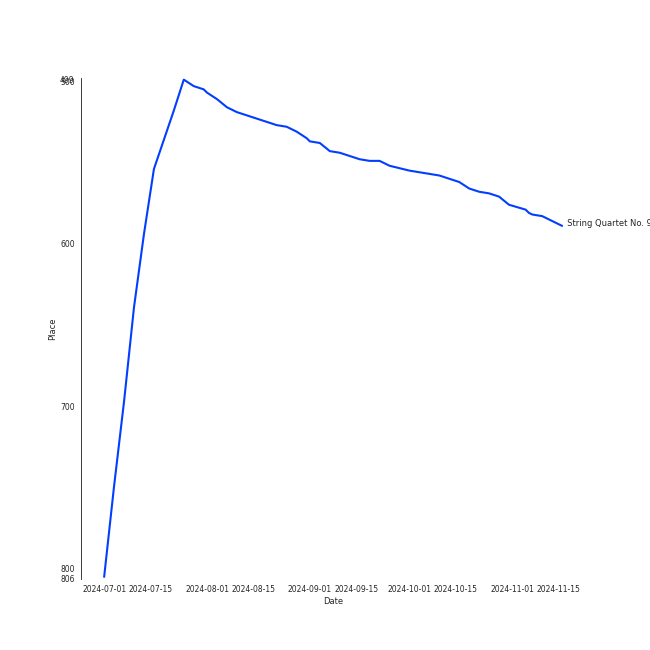

# Tracks in String Quartets from 2005

## Artists

| Art | Rank | Tracks | 💚 | Artist | 🔗 |
|:---|---:|---:|---:|:---|:---|
|  | 142 | 29 | 0 | [Jerusalem Quartet](../../../artists/jerusalem_quartet/overview.md) | [🔗](https://open.spotify.com/artist/7AnE8Jpu1vxLeXcs6OKYHE) |
|  | 300 | 29 | 0 | Dmitri Shostakovich | [🔗](https://open.spotify.com/artist/6s1pCNXcbdtQJlsnM1hRIA) |

## Albums

| Art | Rank | Tracks | 💚 | Album | Release Date | 🔗 |
|:---|---:|---:|---:|:---|---:|:---|
|  | 397 | 29 | 0 | Shostakovich: String Quartets Nos. 1, 4, 6, 8, 9 & 11 | 2005 | [🔗](https://open.spotify.com/album/4V2YVRjysd08RF0GLRDDK7) |

## Tracks

| Art | Track | Album | Artists | Label | Rank | 💚 | 🔗 |
|:---|:---|:---|:---|:---|---:|:---|:---|
|  | String Quartet No. 9 in E-Flat Major, Op. 117: III. Allegretto | Shostakovich: String Quartets Nos. 1, 4, 6, 8, 9 & 11 | Dmitri Shostakovich, [Jerusalem Quartet](../../../artists/jerusalem_quartet/overview.md) | [harmonia mundi](../../../labels/harmonia_mundi) | 584 | | [🔗](https://open.spotify.com/track/57vPVZyYD3Cfxlpmqqdgl5) |
|  | String Quartet No. 1 in C Major, Op. 49: I. Moderato | Shostakovich: String Quartets Nos. 1, 4, 6, 8, 9 & 11 | Dmitri Shostakovich, [Jerusalem Quartet](../../../artists/jerusalem_quartet/overview.md) | [harmonia mundi](../../../labels/harmonia_mundi) | 1015 | | [🔗](https://open.spotify.com/track/5VQz0yG8Lzvjj4RCbDLMrJ) |
|  | String Quartet No. 1 in C Major, Op. 49: II. Moderato | Shostakovich: String Quartets Nos. 1, 4, 6, 8, 9 & 11 | Dmitri Shostakovich, [Jerusalem Quartet](../../../artists/jerusalem_quartet/overview.md) | [harmonia mundi](../../../labels/harmonia_mundi) | 1015 | | [🔗](https://open.spotify.com/track/0A5oxICmtISYvCLCKY5BZs) |
|  | String Quartet No. 1 in C Major, Op. 49: III. Allegro molto | Shostakovich: String Quartets Nos. 1, 4, 6, 8, 9 & 11 | Dmitri Shostakovich, [Jerusalem Quartet](../../../artists/jerusalem_quartet/overview.md) | [harmonia mundi](../../../labels/harmonia_mundi) | 1015 | | [🔗](https://open.spotify.com/track/5O8Iz6Mlz4oS0DP6YYyBQC) |
|  | String Quartet No. 1 in C Major, Op. 49: IV. Allegro | Shostakovich: String Quartets Nos. 1, 4, 6, 8, 9 & 11 | Dmitri Shostakovich, [Jerusalem Quartet](../../../artists/jerusalem_quartet/overview.md) | [harmonia mundi](../../../labels/harmonia_mundi) | 1015 | | [🔗](https://open.spotify.com/track/0nxe3lOpIX0rt3E9vcrRn5) |
|  | String Quartet No. 4 in D Major, Op. 83: I. Allegretto | Shostakovich: String Quartets Nos. 1, 4, 6, 8, 9 & 11 | Dmitri Shostakovich, [Jerusalem Quartet](../../../artists/jerusalem_quartet/overview.md) | [harmonia mundi](../../../labels/harmonia_mundi) | 1015 | | [🔗](https://open.spotify.com/track/2ESTZJCtAtRNts4sKVVTsl) |
|  | String Quartet No. 4 in D Major, Op. 83: II. Andantino | Shostakovich: String Quartets Nos. 1, 4, 6, 8, 9 & 11 | Dmitri Shostakovich, [Jerusalem Quartet](../../../artists/jerusalem_quartet/overview.md) | [harmonia mundi](../../../labels/harmonia_mundi) | 1015 | | [🔗](https://open.spotify.com/track/4Ky633fVEZUBTOcjKbY7yc) |
|  | String Quartet No. 4 in D Major, Op. 83: III. Allegretto | Shostakovich: String Quartets Nos. 1, 4, 6, 8, 9 & 11 | Dmitri Shostakovich, [Jerusalem Quartet](../../../artists/jerusalem_quartet/overview.md) | [harmonia mundi](../../../labels/harmonia_mundi) | 1015 | | [🔗](https://open.spotify.com/track/2cDsjReMRP1B3dLSH8uBRx) |
|  | String Quartet No. 4 in D Major, Op. 83: IV. Allegretto | Shostakovich: String Quartets Nos. 1, 4, 6, 8, 9 & 11 | Dmitri Shostakovich, [Jerusalem Quartet](../../../artists/jerusalem_quartet/overview.md) | [harmonia mundi](../../../labels/harmonia_mundi) | 1015 | | [🔗](https://open.spotify.com/track/4qM31gOqZIt7skvz2kgaOC) |
|  | String Quartet No. 6 in G Major, Op. 101: I. Allegretto | Shostakovich: String Quartets Nos. 1, 4, 6, 8, 9 & 11 | Dmitri Shostakovich, [Jerusalem Quartet](../../../artists/jerusalem_quartet/overview.md) | [harmonia mundi](../../../labels/harmonia_mundi) | 1015 | | [🔗](https://open.spotify.com/track/0k7Zd9zAYnBPuNJPck4UOc) |

View all

| Art | Track | Album | Artists | Label | Rank | 💚 | 🔗 |
|:---|:---|:---|:---|:---|---:|:---|:---|
|  | String Quartet No. 6 in G Major, Op. 101: II. Moderato con moto | Shostakovich: String Quartets Nos. 1, 4, 6, 8, 9 & 11 | Dmitri Shostakovich, [Jerusalem Quartet](../../../artists/jerusalem_quartet/overview.md) | [harmonia mundi](../../../labels/harmonia_mundi) | 1015 | | [🔗](https://open.spotify.com/track/5BqEbEtqCpIrKRJh5c3Z3u) |
|  | String Quartet No. 6 in G Major, Op. 101: III. Lento | Shostakovich: String Quartets Nos. 1, 4, 6, 8, 9 & 11 | Dmitri Shostakovich, [Jerusalem Quartet](../../../artists/jerusalem_quartet/overview.md) | [harmonia mundi](../../../labels/harmonia_mundi) | 1015 | | [🔗](https://open.spotify.com/track/01toQ1HaV4k4aUqWqNsdJe) |
|  | String Quartet No. 6 in G Major, Op. 101: IV. Finale (Lento) - Allegretto | Shostakovich: String Quartets Nos. 1, 4, 6, 8, 9 & 11 | Dmitri Shostakovich, [Jerusalem Quartet](../../../artists/jerusalem_quartet/overview.md) | [harmonia mundi](../../../labels/harmonia_mundi) | 1015 | | [🔗](https://open.spotify.com/track/3EcruCCCtRp7fi5K2YfAA5) |
|  | String Quartet No. 8 in C Minor, Op. 110: I. Largo | Shostakovich: String Quartets Nos. 1, 4, 6, 8, 9 & 11 | Dmitri Shostakovich, [Jerusalem Quartet](../../../artists/jerusalem_quartet/overview.md) | [harmonia mundi](../../../labels/harmonia_mundi) | 1015 | | [🔗](https://open.spotify.com/track/2wtSkXod5g0Ms9h9Amd9FD) |
|  | String Quartet No. 8 in C Minor, Op. 110: II. Allegro molto | Shostakovich: String Quartets Nos. 1, 4, 6, 8, 9 & 11 | Dmitri Shostakovich, [Jerusalem Quartet](../../../artists/jerusalem_quartet/overview.md) | [harmonia mundi](../../../labels/harmonia_mundi) | 1015 | | [🔗](https://open.spotify.com/track/5EXeMOFxbHkj2lgACzXpzr) |
|  | String Quartet No. 8 in C Minor, Op. 110: III. Allegretto | Shostakovich: String Quartets Nos. 1, 4, 6, 8, 9 & 11 | Dmitri Shostakovich, [Jerusalem Quartet](../../../artists/jerusalem_quartet/overview.md) | [harmonia mundi](../../../labels/harmonia_mundi) | 1015 | | [🔗](https://open.spotify.com/track/1uQEWRgoZxzAn7OScQl9nV) |
|  | String Quartet No. 8 in C Minor, Op. 110: IV. Largo | Shostakovich: String Quartets Nos. 1, 4, 6, 8, 9 & 11 | Dmitri Shostakovich, [Jerusalem Quartet](../../../artists/jerusalem_quartet/overview.md) | [harmonia mundi](../../../labels/harmonia_mundi) | 1015 | | [🔗](https://open.spotify.com/track/0axYJ2DSUKXkL67CnUDN3t) |
|  | String Quartet No. 8 in C Minor, Op. 110: V. Largo | Shostakovich: String Quartets Nos. 1, 4, 6, 8, 9 & 11 | Dmitri Shostakovich, [Jerusalem Quartet](../../../artists/jerusalem_quartet/overview.md) | [harmonia mundi](../../../labels/harmonia_mundi) | 1015 | | [🔗](https://open.spotify.com/track/7I1ePDRDp8RvVv9lPU5wHi) |
|  | String Quartet No. 9 in E-Flat Major, Op. 117: I. Moderato Con Moto | Shostakovich: String Quartets Nos. 1, 4, 6, 8, 9 & 11 | Dmitri Shostakovich, [Jerusalem Quartet](../../../artists/jerusalem_quartet/overview.md) | [harmonia mundi](../../../labels/harmonia_mundi) | 1015 | | [🔗](https://open.spotify.com/track/7c1PZ3jfMdI65Oqn1uI74j) |
|  | String Quartet No. 9 in E-Flat Major, Op. 117: II. Adagio | Shostakovich: String Quartets Nos. 1, 4, 6, 8, 9 & 11 | Dmitri Shostakovich, [Jerusalem Quartet](../../../artists/jerusalem_quartet/overview.md) | [harmonia mundi](../../../labels/harmonia_mundi) | 1015 | | [🔗](https://open.spotify.com/track/4u51lPm5GBz9CmJxODuV60) |
|  | String Quartet No. 9 in E-Flat Major, Op. 117: IV. Adagio | Shostakovich: String Quartets Nos. 1, 4, 6, 8, 9 & 11 | Dmitri Shostakovich, [Jerusalem Quartet](../../../artists/jerusalem_quartet/overview.md) | [harmonia mundi](../../../labels/harmonia_mundi) | 1015 | | [🔗](https://open.spotify.com/track/0vpGcgNCl9p9UQdtCOajUG) |
|  | String Quartet No. 9 in E-Flat Major, Op. 117: V. Allegro | Shostakovich: String Quartets Nos. 1, 4, 6, 8, 9 & 11 | Dmitri Shostakovich, [Jerusalem Quartet](../../../artists/jerusalem_quartet/overview.md) | [harmonia mundi](../../../labels/harmonia_mundi) | 1015 | | [🔗](https://open.spotify.com/track/6XOKaXhXamHmqSa38Uwf4A) |
|  | String Quartet No.11 in F Minor, Op. 122: I. Introduction (Andantino) | Shostakovich: String Quartets Nos. 1, 4, 6, 8, 9 & 11 | Dmitri Shostakovich, [Jerusalem Quartet](../../../artists/jerusalem_quartet/overview.md) | [harmonia mundi](../../../labels/harmonia_mundi) | 1015 | | [🔗](https://open.spotify.com/track/4tcinhmPDuyaskdPrqjWB9) |
|  | String Quartet No.11 in F Minor, Op. 122: II. Scherzo (Allegretto) | Shostakovich: String Quartets Nos. 1, 4, 6, 8, 9 & 11 | Dmitri Shostakovich, [Jerusalem Quartet](../../../artists/jerusalem_quartet/overview.md) | [harmonia mundi](../../../labels/harmonia_mundi) | 1015 | | [🔗](https://open.spotify.com/track/5axBmM6eFCRlBCXlBIZGJM) |
|  | String Quartet No.11 in F Minor, Op. 122: III. Récitatif (Adagio) | Shostakovich: String Quartets Nos. 1, 4, 6, 8, 9 & 11 | Dmitri Shostakovich, [Jerusalem Quartet](../../../artists/jerusalem_quartet/overview.md) | [harmonia mundi](../../../labels/harmonia_mundi) | 1015 | | [🔗](https://open.spotify.com/track/02ys9P2W1zcsnWAw9LbaRD) |
|  | String Quartet No.11 in F Minor, Op. 122: IV. Etude (Allegro) | Shostakovich: String Quartets Nos. 1, 4, 6, 8, 9 & 11 | Dmitri Shostakovich, [Jerusalem Quartet](../../../artists/jerusalem_quartet/overview.md) | [harmonia mundi](../../../labels/harmonia_mundi) | 1015 | | [🔗](https://open.spotify.com/track/1jXkZMpNRhBlzleAvtfTop) |
|  | String Quartet No.11 in F Minor, Op. 122: V. Humoresque (Allegro) | Shostakovich: String Quartets Nos. 1, 4, 6, 8, 9 & 11 | Dmitri Shostakovich, [Jerusalem Quartet](../../../artists/jerusalem_quartet/overview.md) | [harmonia mundi](../../../labels/harmonia_mundi) | 1015 | | [🔗](https://open.spotify.com/track/4ikkJi208jmFPkdZGsSe71) |
|  | String Quartet No.11 in F Minor, Op. 122: VI. Elégie (Adagio) | Shostakovich: String Quartets Nos. 1, 4, 6, 8, 9 & 11 | Dmitri Shostakovich, [Jerusalem Quartet](../../../artists/jerusalem_quartet/overview.md) | [harmonia mundi](../../../labels/harmonia_mundi) | 1015 | | [🔗](https://open.spotify.com/track/4oCDQYx2mAoP7cXyGEoVDe) |
|  | String Quartet No.11 in F Minor, Op. 122: VII. Finale (Moderato) | Shostakovich: String Quartets Nos. 1, 4, 6, 8, 9 & 11 | Dmitri Shostakovich, [Jerusalem Quartet](../../../artists/jerusalem_quartet/overview.md) | [harmonia mundi](../../../labels/harmonia_mundi) | 1015 | | [🔗](https://open.spotify.com/track/76ZylpA4UyhA3gQn0INmqF) |

