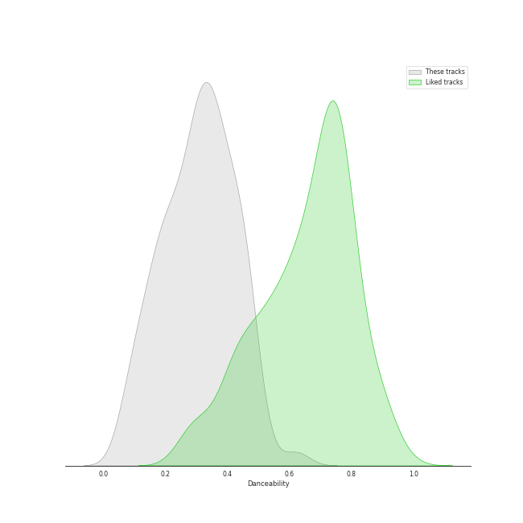
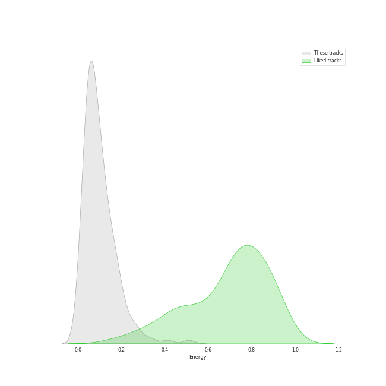
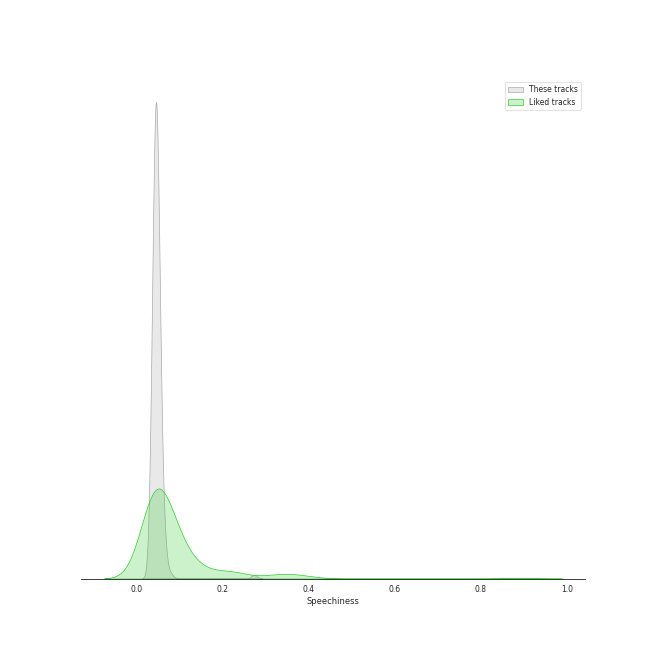
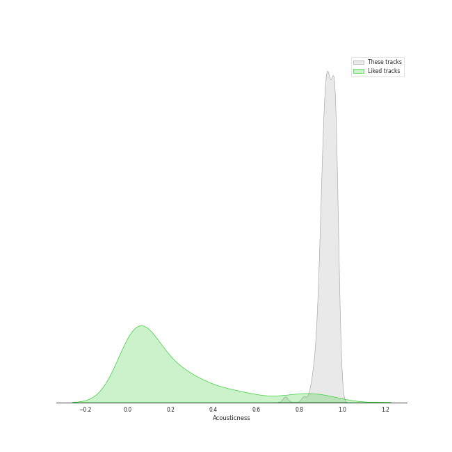
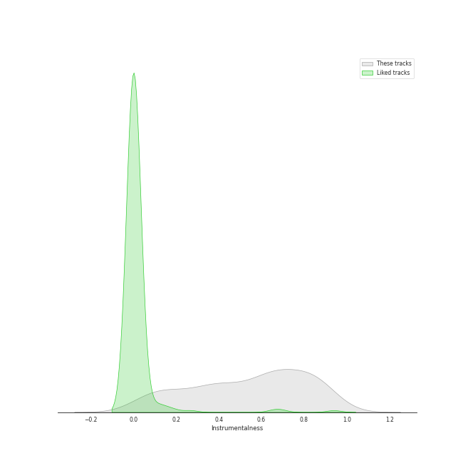
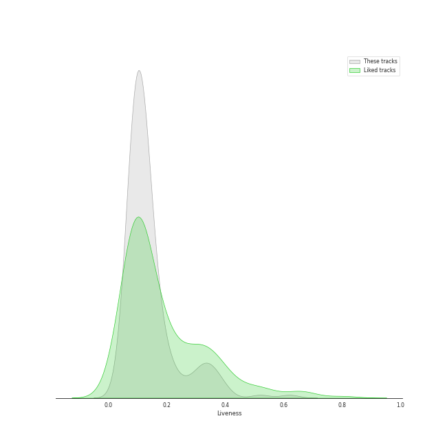
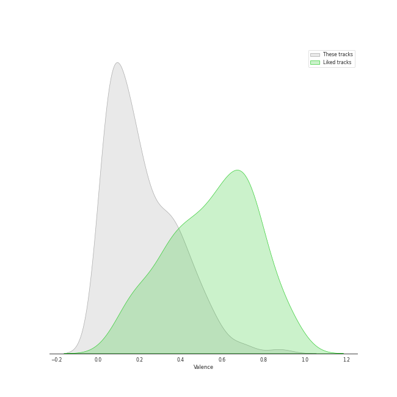
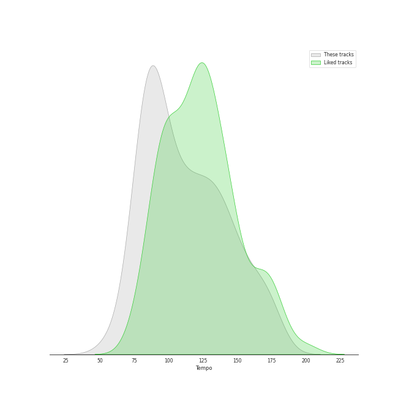

# Track Features for String Quartets

## Danceability

| ​ | 10 most Danceable tracks | ​​ | 10 least Danceable tracks |
|:---|:---|:---|:---|
|  | String Quartet No.11 in F Minor, Op. 122: V. Humoresque (Allegro) (0.63) |  | String Quartet No. 8 in C Minor, Op. 110: V. Largo (0.0592) |
|  | String Quartet No. 4 in C Major, K. 157: III. Presto (0.614) |  | String Quartet in G Minor, Op. 10: III. Andantino, doucement expressif (0.0623) |
|  | String Quartet No. 2 in G Major, Op. 18, No. 2: IV. Allegro molto, quasi presto (0.527) |  | String Quartet No. 8 in C Minor, Op. 110: I. Largo (0.0744) |
|  | String Quartet No. 4 in C Minor, Op. 18, No. 4: II. Andante scherzoso quasi allegretto (0.496) |  | String Quartet No.11 in F Minor, Op. 122: I. Introduction (Andantino) (0.0833) |
|  | String Quartet No. 2 in G Major, Op. 18, No. 2: III. Scherzo (Allegro) - Trio (0.493) |  | String Quartet No. 4 in D Major, Op. 83: II. Andantino (0.089) |
|  | String Quartet No. 8 in C Minor, Op. 110: III. Allegretto (0.489) |  | String Quartet No.11 in F Minor, Op. 122: VI. Elégie (Adagio) (0.0891) |
|  | String Quartet No.11 in F Minor, Op. 122: II. Scherzo (Allegretto) (0.482) |  | String Quartet No. 8 in E Minor, Op. 59 No. 2: II. Molto adagio (0.0914) |
|  | String Quartet No. 4 in C Minor, Op. 18 No. 4: II. Andante scherzoso quasi allegretto (0.48) |  | String Quartet No. 15 in A minor, Op. 132: III. Molto adagio (0.105) |
|  | String Quartet No. 6 in B-Flat Major, Op. 18 No. 6: I. Allegro con brio (0.477) |  | String Quartet No. 8 in C Minor, Op. 110: IV. Largo (0.109) |
|  | String Quartet No. 5 in A Major, Op. 18 No. 5: I. Allegro (0.475) |  | String Quartet No. 16 in F Major, Op. 135: III. Lento assai, cantate e tranquillo - Più lento (0.111) |

## Energy

| ​ | 10 most Energetic tracks | ​​ | 10 least Energetic tracks |
|:---|:---|:---|:---|
|  | String Quartet No. 8 in C Minor, Op. 110: II. Allegro molto (0.511) |  | String Quartet No. 9 in E-Flat Major, Op. 117: IV. Adagio (0.00449) |
|  | String Quartet No.11 in F Minor, Op. 122: V. Humoresque (Allegro) (0.413) |  | String Quartet No. 8 in C Minor, Op. 110: I. Largo (0.0053) |
|  | String Quartet No. 9 in E-Flat Major, Op. 117: V. Allegro (0.34) |  | String Quartet No.11 in F Minor, Op. 122: VII. Finale (Moderato) (0.00842) |
|  | String Quartet No. 1 in C Major, Op. 49: IV. Allegro (0.309) |  | String Quartet No. 14 in C-Sharp Minor, Op. 131: III. Allegro moderato - Adagio - Piu vivace (0.00881) |
|  | String Quartet No. 4 in C Major, K. 157: III. Presto (0.273) |  | String Quartet No. 8 in C Minor, Op. 110: IV. Largo (0.0103) |
|  | String Quartet in C Major, Op. 74, No. 1: IV. Finale, Vivace (0.268) |  | String Quartet No. 6 in G Major, Op. 101: III. Lento (0.0113) |
|  | String Quartet No. 9 in E-Flat Major, Op. 117: III. Allegretto (0.265) |  | String Quartet No. 8 in C Minor, Op. 110: V. Largo (0.013) |
|  | String Quartet No. 16 in F Major, Op. 135: II. Vivace (0.253) |  | String Quartet No. 8 in E Minor, Op. 59 No. 2: II. Molto adagio (0.0142) |
|  | String Quartet No. 9 in C Major, Op. 59 No. 3: IV. Finale (Allegro molto) (0.23) |  | String Quartet in G Major, Op. 76, No. 1: II. Adagio sostenuto (0.0181) |
|  | String Quartet No. 10 in E-Flat Major, Op. 74 "Harp": III. Presto - Più presto quasi prestissimo (0.228) |  | String Quartet No.11 in F Minor, Op. 122: I. Introduction (Andantino) (0.0182) |

## Speechiness

| ​ | 10 most Speechy tracks | ​​ | 10 least Speechy tracks |
|:---|:---|:---|:---|
|  | String Quartet No.11 in F Minor, Op. 122: V. Humoresque (Allegro) (0.274) |  | String Quartet in C Major, Op. 74, No. 1: III. Menuetto, Allegretto (0.0339) |
|  | String Quartet No. 11 in F Minor, Op. 95 "Quartetto serioso": III. Allegro assai - Vivace ma serioso (0.0807) |  | String Quartet No. 10 in E-Flat Major, Op. 74 "Harp": III. Presto - Più presto quasi prestissimo (0.0349) |
|  | String Quartet No. 6 in B-Flat Major, Op. 18 No. 6: III. Scherzo (Allegro) - Trio (0.0689) |  | String Quartet No. 8 in C Minor, Op. 110: II. Allegro molto (0.035) |
|  | String Quartet No. 4 in C Minor, Op. 18, No. 4: II. Andante scherzoso quasi allegretto (0.0682) |  | String Quartet in G Major, Op. 76, No. 1: II. Adagio sostenuto (0.0352) |
|  | String Quartet in G Major, Op. 76, No. 1: III. Menuetto, Presto (0.0679) |  | String Quartet in G Major, Op. 76, No. 1: IV. Allegro ma non troppo (0.0352) |
|  | String Quartet No.11 in F Minor, Op. 122: II. Scherzo (Allegretto) (0.0639) |  | String Quartet No. 9 in E-Flat Major, Op. 117: I. Moderato Con Moto (0.0354) |
|  | String Quartet No. 1 in F Major, Op. 18 No. 1: I. Allegro con brio (0.0636) |  | String Quartet No. 9 in C Major, Op. 59 No. 3: IV. Finale (Allegro molto) (0.0362) |
|  | String Quartet No. 8 in C Minor, Op. 110: V. Largo (0.0615) |  | String Quartet No. 4 in C Major, K. 157: I. Allegro (0.037) |
|  | String Quartet No. 6 in B-Flat Major, Op. 18 No. 6: III. Scherzo (Allegro) - Trio (0.0614) |  | String Quartet in C Major, Op. 74, No. 1: I. Allegro Moderato (0.0377) |
|  | String Quartet No. 5 in A Major, Op. 18 No. 5: I. Allegro (0.0609) |  | String Quartet No. 1 in C Major, Op. 49: IV. Allegro (0.0378) |

## Acousticness

| ​ | 10 most Acoustic tracks | ​​ | 10 least Acoustic tracks |
|:---|:---|:---|:---|
|  | String Quartet in C Major, Op. 74, No. 1: III. Menuetto, Allegretto (0.986) |  | String Sextet, Op. 48: II. Dumka (Elegie). Poco allegretto (0.735) |
|  | String Quartet in G Minor, Op. 20, No. 3: II. Menuetto, Allegretto (0.985) |  | String Sextet, Op. 48: IV. Finale. Tema con variazioni - Allegretto grazioso, quasi andantino (0.821) |
|  | String Quartet in G Minor, Op. 20, No. 3: IV. Finale, Allegro molto (0.983) |  | String Sextet, Op. 48: III. Furiant. Presto - Trio (0.852) |
|  | String Quartet No.11 in F Minor, Op. 122: III. Récitatif (Adagio) (0.983) |  | String Quartet No.11 in F Minor, Op. 122: V. Humoresque (Allegro) (0.861) |
|  | String Quartet No.11 in F Minor, Op. 122: VI. Elégie (Adagio) (0.982) |  | String Quartet No. 15 in A minor, Op. 132: III. Molto adagio (0.865) |
|  | String Quartet in C Major, Op. 74, No. 1: I. Allegro Moderato (0.98) |  | String Quartet No. 16 in F Major, Op. 135: III. Lento assai, cantate e tranquillo - Più lento (0.869) |
|  | String Quartet in G Major, Op. 76, No. 1: IV. Allegro ma non troppo (0.979) |  | String Quartet No. 11 in F Minor, Op. 95 "Serioso": I. Allegro con brio (0.877) |
|  | String Quartet in G Major, Op. 76, No. 1: I. Allegro con spirito (0.978) |  | String Quartet No. 3 In B Flat, Op. 67: 2. Andante (0.877) |
|  | String Quartet No. 22 in B-Flat Major, K. 589, "Prussian": I. Allegro (0.977) |  | String Quartet No. 2 in G Major, Op. 18, No. 2: IV. Allegro molto, quasi presto (0.879) |
|  | String Quartet No. 22 in B-Flat Major, K. 589, "Prussian": III. Menuetto - Moderato (0.977) |  | String Quartet No. 1 in F Major, Op. 18 No. 1: IV. Allegro (0.887) |

## Instrumentalness

| ​ | 10 most Instrumental tracks | ​​ | 10 least Instrumental tracks |
|:---|:---|:---|:---|
|  | String Quartet No. 14 in C-Sharp Minor, Op. 131: VI. Adagio quasi un poco andante (0.97) |  | String Quartet No. 6 in B-Flat Major, Op. 18 No. 6: II. Adagio ma non troppo (0.00346) |
|  | String Quartet No.11 in F Minor, Op. 122: III. Récitatif (Adagio) (0.953) |  | String Quartet No. 2 in G Major, Op. 18, No. 2: I. Allegro (0.0207) |
|  | String Quartet No. 8 in C Minor, Op. 110: II. Allegro molto (0.936) |  | String Quartet No.11 in F Minor, Op. 122: VII. Finale (Moderato) (0.0443) |
|  | String Quartet in G Minor, Op. 10: I. Animé et très décidé (0.932) |  | String Quartet No. 1 in F Major, Op. 18 No. 1: II. Adagio affettuoso ed appassionato (0.0515) |
|  | String Sextet, Op. 48: II. Dumka (Elegie). Poco allegretto (0.924) |  | String Quartet No. 13 in B-Flat Major, Op. 130: IV. Alla danza tedesca (allegro assai) (0.0559) |
|  | String Quartet No. 9 in E-Flat Major, Op. 117: I. Moderato Con Moto (0.897) |  | String Quartet No. 14 in C-Sharp Minor, Op. 131: II. Allegro molto vivace (0.059) |
|  | String Quartet in G Minor, Op. 10: II. Assez vif et bien rythmé (0.893) |  | String Quartet No. 14 in C-Sharp Minor, Op. 131: IV. Andante ma non troppo e molto cantabile (0.0637) |
|  | String Quartet in C Major, Op. 74, No. 1: IV. Finale, Vivace (0.891) |  | String Quartet No. 8 in E Minor, Op. 59 No. 2: IV. Finale (Presto) (0.0647) |
|  | String Quartet No. 9 in C Major, Op. 59 No. 3: IV. Finale (Allegro molto) (0.885) |  | String Quartet No. 1 in F Major, Op. 18 No. 1: IV. Allegro (0.07) |
|  | String Quartet No. 16 in F Major, Op. 135: II. Vivace (0.881) |  | String Quartet No. 5 in A Major, Op. 18 No. 5: II. Menuetto - Trio (0.0749) |

## Liveness

| ​ | 10 most Live tracks | ​​ | 10 least Live tracks |
|:---|:---|:---|:---|
|  | String Quartet No. 2 in G Major, Op. 18, No. 2: III. Scherzo (Allegro) - Trio (0.62) |  | String Quartet No. 2 In A Minor, Op. 51 No. 2: 4. Finale (Allegro non assai - Più vivace) (0.0439) |
|  | String Quartet No. 10 in E-Flat Major, Op. 74 "Harp": III. Presto - Più presto quasi prestissimo (0.52) |  | String Quartet No. 3 in D Major, Op. 18: I. Allegro (0.045) |
|  | String Quartet No. 13 in B-Flat Major, Op. 130: I. Adagio ma non troppo – Allegro (0.402) |  | Piano Quintet in F minor, Op. 34: 4. Finale (poco sostenuto - Allegro non troppo) (0.0572) |
|  | String Quartet No. 3 in D Major, Op. 18: III. Allegro (0.386) |  | String Quartet No. 8 in E Minor, Op. 59 No. 2: I. Allegro (0.0611) |
|  | String Quartet No.11 in F Minor, Op. 122: IV. Etude (Allegro) (0.379) |  | String Quartet No. 5 in A Major, Op. 18 No. 5: II. Menuetto - Trio (0.0625) |
|  | String Quartet No. 5 in A Major, Op. 18 No. 5: IV. Allegro (0.368) |  | String Quartet No. 6 in B-Flat Major, Op. 18 No. 6: III. Scherzo (Allegro) - Trio (0.0631) |
|  | String Quartet No. 3 In B Flat, Op. 67: 3. Agitato (Allegretto non troppo) (0.367) |  | String Quartet in G Major, Op. 76, No. 1: I. Allegro con spirito (0.064) |
|  | String Quartet No. 17 in B-Flat Major, K. 458 "The Hunt": II. Menuetto (Moderato) (0.352) |  | String Quartet No. 8 in C Minor, Op. 110: III. Allegretto (0.0651) |
|  | String Quartet No. 16 in F Major, Op. 135: I. Allegretto (0.35) |  | String Quartet No. 2 in G Major, Op. 18, No. 2: IV. Allegro molto, quasi presto (0.0653) |
|  | String Quartet No. 1 in F Major, Op. 18 No. 1: IV. Allegro (0.34) |  | String Quartet No. 3 in D Major, Op. 18: I. Allegro (0.0669) |

## Valence

| ​ | 10 most Happy tracks | ​​ | 10 least Happy tracks |
|:---|:---|:---|:---|
|  | String Quartet No. 4 in C Major, K. 157: III. Presto (0.878) |  | String Quartet No. 9 in E-Flat Major, Op. 117: II. Adagio (0.0251) |
|  | String Quartet No. 6 in B-Flat Major, Op. 18 No. 6: III. Scherzo (Allegro) - Trio (0.705) |  | String Quartet No.11 in F Minor, Op. 122: VI. Elégie (Adagio) (0.0307) |
|  | String Quartet No. 6 in B-Flat Major, Op. 18 No. 6: III. Scherzo (Allegro) - Trio (0.694) |  | String Quartet in G Minor, Op. 10: III. Andantino, doucement expressif (0.0317) |
|  | String Quartet No. 8 in C Minor, Op. 110: II. Allegro molto (0.599) |  | String Quartet No. 4 in D Major, Op. 83: II. Andantino (0.0317) |
|  | String Quartet No. 16 in F Major, Op. 135: II. Vivace (0.581) |  | String Quartet No. 8 in C Minor, Op. 110: I. Largo (0.0342) |
|  | String Quartet No. 4 in C Major, K. 157: I. Allegro (0.567) |  | String Quartet No. 8 in C Minor, Op. 110: V. Largo (0.0343) |
|  | String Quartet No. 2 in G Major, Op. 18, No. 2: III. Scherzo (Allegro) - Trio (0.558) |  | String Quartet No. 6 in G Major, Op. 101: III. Lento (0.0346) |
|  | String Quartet No. 14 in C-Sharp Minor, Op. 131: V. Presto (0.539) |  | String Quartet No. 8 in C Minor, Op. 110: IV. Largo (0.0346) |
|  | String Quartet No. 2 in G Major, Op. 18, No. 2: III. Scherzo (Allegro) - Trio (0.529) |  | String Quartet No. 16 in F Major, Op. 135: III. Lento assai, cantate e tranquillo - Più lento (0.0347) |
|  | String Quartet No. 17 in B-Flat Major, K. 458 "The Hunt": IV. Allegro assai (0.515) |  | Quatuor en Fa Majeur, M. 35: III. Très lent (0.0349) |

## Tempo

| ​ | 10 most Fast tracks | ​​ | 10 least Fast tracks |
|:---|:---|:---|:---|
|  | String Quartet No. 11 in F Minor, Op. 95 "Quartetto serioso": III. Allegro assai - Vivace ma serioso (179.045) |  | String Quartet in G Minor, Op. 10: III. Andantino, doucement expressif (54.651) |
|  | String Quartet No. 6 in G Major, Op. 101: II. Moderato con moto (177.309) |  | String Quartet in G Minor, Op. 20, No. 3: III. Poco Adagio (60.931) |
|  | String Quartet No. 12 in E-Flat Major, Op. 127: III. Scherzando vivace (174.606) |  | String Quartet No. 8 in C Minor, Op. 110: V. Largo (61.517) |
|  | String Quintet No. 3, Op. 97: IV. Finale. Allegro giusto (173.181) |  | String Quartet No. 1 in C Major, Op. 49: III. Allegro molto (69.005) |
|  | String Quartet No.11 in F Minor, Op. 122: I. Introduction (Andantino) (172.699) |  | String Quartet No. 2 in G Major, Op. 18, No. 2: II. Adagio cantabile - Allegro (73.447) |
|  | String Quartet No. 6 in B-Flat Major, Op. 18 No. 6: III. Scherzo (Allegro) - Trio (172.548) |  | String Quartet in G Minor, Op. 20, No. 3: II. Menuetto, Allegretto (74.109) |
|  | String Quartet No. 3 in D Major, Op. 18: IV. Presto (171.742) |  | Grosse Fuge, Op. 133 (74.161) |
|  | String Quartet No. 6 in B-Flat Major, Op. 18 No. 6: III. Scherzo (Allegro) - Trio (171.063) |  | String Sextet, Op. 48: I. Allegro moderato (75.345) |
|  | String Quartet No. 7 In F Major, Op. 59 No. 1: II. Allegretto vivace e sempre scherzando (168.809) |  | String Quartet No. 16 in F Major, Op. 135: IV. Grave ma non troppo tratto - Allegro (75.432) |
|  | String Quartet No. 15 in A minor, Op. 132: V. Allegro appassionato - Presto (168.282) |  | String Quartet in G Minor, Op. 20, No. 3: IV. Finale, Allegro molto (75.719) |
