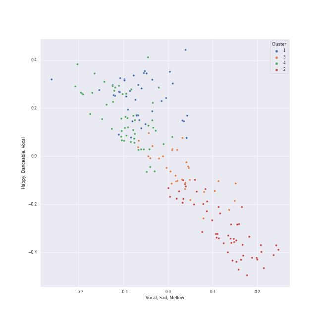

# Clusters in String Quartets

## Cluster #1

40 tracks

| Art | Track | Album | Artists | Label | Rank | 💚 | 🔗 |
|:---|:---|:---|:---|:---|---:|:---|:---|
|  | String Quartet No. 22 in B-Flat Major, K. 589, "Prussian": III. Menuetto - Moderato | Mozart: String Quartets Nos. 4, 17 & 22 | [Wolfgang Amadeus Mozart](../../../../artists/wolfgang_amadeus_mozart/overview.md), [Jerusalem Quartet](../../../../artists/jerusalem_quartet/overview.md) | [harmonia mundi](../../../../labels/harmonia_mundi) | 864 | | [🔗](https://open.spotify.com/track/1LAbFa0OPRS6IuapkOySby) |
|  | String Quartet No. 17 in B-Flat Major, K. 458 "The Hunt": IV. Allegro assai | Mozart: String Quartets Nos. 4, 17 & 22 | [Wolfgang Amadeus Mozart](../../../../artists/wolfgang_amadeus_mozart/overview.md), [Jerusalem Quartet](../../../../artists/jerusalem_quartet/overview.md) | [harmonia mundi](../../../../labels/harmonia_mundi) | 864 | | [🔗](https://open.spotify.com/track/6AgF5rgvW3hRwe6A8KCcwl) |
|  | String Quartet No. 22 in B-Flat Major, K. 589, "Prussian": IV. Allegro assai | Mozart: String Quartets Nos. 4, 17 & 22 | [Wolfgang Amadeus Mozart](../../../../artists/wolfgang_amadeus_mozart/overview.md), [Jerusalem Quartet](../../../../artists/jerusalem_quartet/overview.md) | [harmonia mundi](../../../../labels/harmonia_mundi) | 864 | | [🔗](https://open.spotify.com/track/6Y8SmRRP56DkQoDt8op0xN) |
|  | Piano Quintet in F minor, Op. 34: 3. Scherzo (Allegro) | Brahms: String Quartets & Piano Quintet | Johannes Brahms, Emerson String Quartet, Leon Fleisher | [Deutsche Grammophon (DG)](../../../../labels/deutsche_grammophon_(dg)) | 864 | | [🔗](https://open.spotify.com/track/2MyRikj06G0oWicSQdpEXm) |
|  | String Quartet No. 1 in F Major, Op. 18 No. 1: III. Scherzo (Allegro molto) - Trio | Beethoven: String Quartets, Op. 18 | [Ludwig van Beethoven](../../../../artists/ludwig_van_beethoven/overview.md), [Jerusalem Quartet](../../../../artists/jerusalem_quartet/overview.md) | [harmonia mundi](../../../../labels/harmonia_mundi) | 864 | | [🔗](https://open.spotify.com/track/62gkGN2sOcxtVmoDGCeajT) |
|  | String Quartet No. 6 in B-Flat Major, Op. 18 No. 6: I. Allegro con brio | Beethoven: String Quartets, Op. 18 | [Ludwig van Beethoven](../../../../artists/ludwig_van_beethoven/overview.md), [Jerusalem Quartet](../../../../artists/jerusalem_quartet/overview.md) | [harmonia mundi](../../../../labels/harmonia_mundi) | 864 | | [🔗](https://open.spotify.com/track/7FZJQ7bjH1grTUYdfxfD73) |
|  | String Quartet No. 4 in C Minor, Op. 18 No. 4: I. Allegro ma non tanto | Beethoven: String Quartets, Op. 18 | [Ludwig van Beethoven](../../../../artists/ludwig_van_beethoven/overview.md), [Jerusalem Quartet](../../../../artists/jerusalem_quartet/overview.md) | [harmonia mundi](../../../../labels/harmonia_mundi) | 864 | | [🔗](https://open.spotify.com/track/7yoDNO5NZYx8VwDWkYDLBr) |
|  | String Quartet No. 9 in C Major, Op. 59 No. 3: IV. Finale (Allegro molto) | Beethoven: Complete String Quartets | [Ludwig van Beethoven](../../../../artists/ludwig_van_beethoven/overview.md), [Tokyo String Quartet](../../../../artists/tokyo_string_quartet/overview.md) | [harmonia mundi](../../../../labels/harmonia_mundi) | 864 | | [🔗](https://open.spotify.com/track/1KM3GCkFAaob2g2GRTSeum) |
|  | String Quartet No. 10 in E-Flat Major, Op. 74 "Harp": IV. Allegretto con Variazioni | Beethoven: Complete String Quartets | [Ludwig van Beethoven](../../../../artists/ludwig_van_beethoven/overview.md), [Tokyo String Quartet](../../../../artists/tokyo_string_quartet/overview.md) | [harmonia mundi](../../../../labels/harmonia_mundi) | 864 | | [🔗](https://open.spotify.com/track/40oN50qAShuDPpHz2ECp0f) |
|  | String Quartet in G Major, Op. 76, No. 1: III. Menuetto, Presto | Haydn: String Quartets | Joseph Haydn, The Amsterdam String Quartet | [Channel Classics Records](../../../../labels/channel_classics_records) | 864 | | [🔗](https://open.spotify.com/track/6AAur5TYgKbNMv4MnkyG8b) |
## Cluster #2

53 tracks

| Art | Track | Album | Artists | Label | Rank | 💚 | 🔗 |
|:---|:---|:---|:---|:---|---:|:---|:---|
|  | String Quartet No. 1 in C Major, Op. 49: III. Allegro molto | Shostakovich: String Quartets Nos. 1, 4, 6, 8, 9 & 11 | Dmitri Shostakovich, [Jerusalem Quartet](../../../../artists/jerusalem_quartet/overview.md) | [harmonia mundi](../../../../labels/harmonia_mundi) | 864 | | [🔗](https://open.spotify.com/track/5O8Iz6Mlz4oS0DP6YYyBQC) |
|  | String Quartet No. 6 in B-Flat Major, Op. 18 No. 6: II. Adagio ma non troppo | Beethoven: String Quartets, Op. 18 | [Ludwig van Beethoven](../../../../artists/ludwig_van_beethoven/overview.md), [Jerusalem Quartet](../../../../artists/jerusalem_quartet/overview.md) | [harmonia mundi](../../../../labels/harmonia_mundi) | 864 | | [🔗](https://open.spotify.com/track/5haDu6D9Afpa5GIt5wVWMb) |
|  | String Quartet No. 12 in E-Flat Major, Op. 127: I. Maestoso - Allegro | Beethoven: Complete String Quartets | [Ludwig van Beethoven](../../../../artists/ludwig_van_beethoven/overview.md), [Tokyo String Quartet](../../../../artists/tokyo_string_quartet/overview.md) | [harmonia mundi](../../../../labels/harmonia_mundi) | 864 | | [🔗](https://open.spotify.com/track/1Oj4z7SesvJsdi52adQHkG) |
|  | String Quartet No. 7 In F Major, Op. 59 No. 1: II. Allegretto vivace e sempre scherzando | Beethoven: Complete String Quartets | [Ludwig van Beethoven](../../../../artists/ludwig_van_beethoven/overview.md), [Tokyo String Quartet](../../../../artists/tokyo_string_quartet/overview.md) | [harmonia mundi](../../../../labels/harmonia_mundi) | 864 | | [🔗](https://open.spotify.com/track/2T4zPGpKePodbDlA9LHMDj) |
|  | String Quartet No. 3 in D Major, Op. 18: II. Andante con moto | Beethoven: Complete String Quartets | [Ludwig van Beethoven](../../../../artists/ludwig_van_beethoven/overview.md), [Tokyo String Quartet](../../../../artists/tokyo_string_quartet/overview.md) | [harmonia mundi](../../../../labels/harmonia_mundi) | 864 | | [🔗](https://open.spotify.com/track/2V5dO6szHHSoAqIRTJViYA) |
|  | String Quartet No. 3 in D Major, Op. 18: I. Allegro | Beethoven: Complete String Quartets | [Ludwig van Beethoven](../../../../artists/ludwig_van_beethoven/overview.md), [Tokyo String Quartet](../../../../artists/tokyo_string_quartet/overview.md) | [harmonia mundi](../../../../labels/harmonia_mundi) | 864 | | [🔗](https://open.spotify.com/track/4UbcuUdeuzNJDajkn0ger7) |
|  | String Quartet No. 5 in A Major, Op. 18 No. 5: III. Andante cantabile | Beethoven: Complete String Quartets | [Ludwig van Beethoven](../../../../artists/ludwig_van_beethoven/overview.md), [Tokyo String Quartet](../../../../artists/tokyo_string_quartet/overview.md) | [harmonia mundi](../../../../labels/harmonia_mundi) | 864 | | [🔗](https://open.spotify.com/track/4WOEg6BxJIlMVx3mz8gJSw) |
|  | String Quartet No. 7 In F Major, Op. 59 No. 1: I. Allegro | Beethoven: Complete String Quartets | [Ludwig van Beethoven](../../../../artists/ludwig_van_beethoven/overview.md), [Tokyo String Quartet](../../../../artists/tokyo_string_quartet/overview.md) | [harmonia mundi](../../../../labels/harmonia_mundi) | 864 | | [🔗](https://open.spotify.com/track/4ckknlEygDKbsmUxt8CR00) |
|  | String Quartet No. 11 in F Minor, Op. 95 "Quartetto serioso": III. Allegro assai - Vivace ma serioso | Beethoven: Complete String Quartets | [Ludwig van Beethoven](../../../../artists/ludwig_van_beethoven/overview.md), [Tokyo String Quartet](../../../../artists/tokyo_string_quartet/overview.md) | [harmonia mundi](../../../../labels/harmonia_mundi) | 864 | | [🔗](https://open.spotify.com/track/59PsKABOvB8hAjJp91IsRP) |
|  | String Quartet No. 14 in C-Sharp Minor, Op. 131: VII. Allegro | Beethoven: Complete String Quartets | [Ludwig van Beethoven](../../../../artists/ludwig_van_beethoven/overview.md), [Tokyo String Quartet](../../../../artists/tokyo_string_quartet/overview.md) | [harmonia mundi](../../../../labels/harmonia_mundi) | 864 | | [🔗](https://open.spotify.com/track/78BbLe00QHPhPvMoPgiqu7) |
## Cluster #3

33 tracks

| Art | Track | Album | Artists | Label | Rank | 💚 | 🔗 |
|:---|:---|:---|:---|:---|---:|:---|:---|
|  | String Quartet No. 22 in B-Flat Major, K. 589, "Prussian": I. Allegro | Mozart: String Quartets Nos. 4, 17 & 22 | [Wolfgang Amadeus Mozart](../../../../artists/wolfgang_amadeus_mozart/overview.md), [Jerusalem Quartet](../../../../artists/jerusalem_quartet/overview.md) | [harmonia mundi](../../../../labels/harmonia_mundi) | 864 | | [🔗](https://open.spotify.com/track/6gN3OwvTCPD9k8tqMxUEJd) |
|  | String Quartet No. 5 in A Major, Op. 18 No. 5: II. Menuetto - Trio | Beethoven: String Quartets, Op. 18 | [Ludwig van Beethoven](../../../../artists/ludwig_van_beethoven/overview.md), [Jerusalem Quartet](../../../../artists/jerusalem_quartet/overview.md) | [harmonia mundi](../../../../labels/harmonia_mundi) | 864 | | [🔗](https://open.spotify.com/track/0AtBrNtW0crqbSyUtwNykS) |
|  | String Quartet No. 5 in A Major, Op. 18 No. 5: I. Allegro | Beethoven: String Quartets, Op. 18 | [Ludwig van Beethoven](../../../../artists/ludwig_van_beethoven/overview.md), [Jerusalem Quartet](../../../../artists/jerusalem_quartet/overview.md) | [harmonia mundi](../../../../labels/harmonia_mundi) | 864 | | [🔗](https://open.spotify.com/track/26rU4aScCfqkgrtNmAAUMW) |
|  | String Quartet No. 2 in G Major, Op. 18, No. 2: I. Allegro | Beethoven: String Quartets, Op. 18 | [Ludwig van Beethoven](../../../../artists/ludwig_van_beethoven/overview.md), [Jerusalem Quartet](../../../../artists/jerusalem_quartet/overview.md) | [harmonia mundi](../../../../labels/harmonia_mundi) | 864 | | [🔗](https://open.spotify.com/track/558uK4J0UIghC9WVf1lAuk) |
|  | String Quartet No. 6 in B-Flat Major, Op. 18 No. 6: I. Allegro con brio | Beethoven: Complete String Quartets | [Ludwig van Beethoven](../../../../artists/ludwig_van_beethoven/overview.md), [Tokyo String Quartet](../../../../artists/tokyo_string_quartet/overview.md) | [harmonia mundi](../../../../labels/harmonia_mundi) | 864 | | [🔗](https://open.spotify.com/track/4FPrp3dlfffetVoIXrcSKC) |
|  | String Quartet No. 9 in C Major, Op. 59 No. 3: I. Introduzione (Andante con moto - Allegro vivace) | Beethoven: Complete String Quartets | [Ludwig van Beethoven](../../../../artists/ludwig_van_beethoven/overview.md), [Tokyo String Quartet](../../../../artists/tokyo_string_quartet/overview.md) | [harmonia mundi](../../../../labels/harmonia_mundi) | 864 | | [🔗](https://open.spotify.com/track/5bUQPchwRlyhMMNP7OYrcW) |
|  | String Quartet No. 7 In F Major, Op. 59 No. 1: IV. Theme russe (Allegro) | Beethoven: Complete String Quartets | [Ludwig van Beethoven](../../../../artists/ludwig_van_beethoven/overview.md), [Tokyo String Quartet](../../../../artists/tokyo_string_quartet/overview.md) | [harmonia mundi](../../../../labels/harmonia_mundi) | 864 | | [🔗](https://open.spotify.com/track/7KwB8HVBvCQVRxq88bBFqM) |
|  | String Quartet No. 15 in A minor, Op. 132: V. Allegro appassionato - Presto | Beethoven: Complete String Quartets | [Ludwig van Beethoven](../../../../artists/ludwig_van_beethoven/overview.md), [Tokyo String Quartet](../../../../artists/tokyo_string_quartet/overview.md) | [harmonia mundi](../../../../labels/harmonia_mundi) | 864 | | [🔗](https://open.spotify.com/track/7oIlqfDug1iDhuWUscjgPy) |
|  | String Quartet in G Minor, Op. 20, No. 3: I. Allegro con spirito | Haydn: String Quartets | Joseph Haydn, The Amsterdam String Quartet | [Channel Classics Records](../../../../labels/channel_classics_records) | 864 | | [🔗](https://open.spotify.com/track/4Yj05JzIiAV17ExCLpq5tf) |
|  | String Quartet in G Minor, Op. 20, No. 3: IV. Finale, Allegro molto | Haydn: String Quartets | Joseph Haydn, The Amsterdam String Quartet | [Channel Classics Records](../../../../labels/channel_classics_records) | 864 | | [🔗](https://open.spotify.com/track/7KR0NMt4Y4EsGIL168lRFb) |
## Cluster #4

53 tracks

| Art | Track | Album | Artists | Label | Rank | 💚 | 🔗 |
|:---|:---|:---|:---|:---|---:|:---|:---|
|  | String Quartet No. 6 in G Major, Op. 101: III. Lento | Shostakovich: String Quartets Nos. 1, 4, 6, 8, 9 & 11 | Dmitri Shostakovich, [Jerusalem Quartet](../../../../artists/jerusalem_quartet/overview.md) | [harmonia mundi](../../../../labels/harmonia_mundi) | 864 | | [🔗](https://open.spotify.com/track/01toQ1HaV4k4aUqWqNsdJe) |
|  | String Quartet No. 6 in G Major, Op. 101: IV. Finale (Lento) - Allegretto | Shostakovich: String Quartets Nos. 1, 4, 6, 8, 9 & 11 | Dmitri Shostakovich, [Jerusalem Quartet](../../../../artists/jerusalem_quartet/overview.md) | [harmonia mundi](../../../../labels/harmonia_mundi) | 864 | | [🔗](https://open.spotify.com/track/3EcruCCCtRp7fi5K2YfAA5) |
|  | String Quartet No. 2 In A Minor, Op. 51 No. 2: 1. Allegro non troppo | Brahms: String Quartets & Piano Quintet | Johannes Brahms, Emerson String Quartet | [Deutsche Grammophon (DG)](../../../../labels/deutsche_grammophon_(dg)) | 864 | | [🔗](https://open.spotify.com/track/0dn5JlmuEtBAEQ79fQUiLK) |
|  | String Quartet No. 2 In A Minor, Op. 51 No. 2: 2. Andante moderato | Brahms: String Quartets & Piano Quintet | Johannes Brahms, Emerson String Quartet | [Deutsche Grammophon (DG)](../../../../labels/deutsche_grammophon_(dg)) | 864 | | [🔗](https://open.spotify.com/track/1WoXiu07Xzld9f9pz3jb6z) |
|  | String Quartet No. 3 In B Flat, Op. 67: 2. Andante | Brahms: String Quartets & Piano Quintet | Johannes Brahms, Emerson String Quartet | [Deutsche Grammophon (DG)](../../../../labels/deutsche_grammophon_(dg)) | 864 | | [🔗](https://open.spotify.com/track/7xnwMGTClM3uyaUfJBGAH3) |
|  | String Quartet No. 3 in D Major, Op. 18: II. Andante con moto | Beethoven: String Quartets, Op. 18 | [Ludwig van Beethoven](../../../../artists/ludwig_van_beethoven/overview.md), [Jerusalem Quartet](../../../../artists/jerusalem_quartet/overview.md) | [harmonia mundi](../../../../labels/harmonia_mundi) | 864 | | [🔗](https://open.spotify.com/track/0o3Mcv1JOPsrnc3wBROq2S) |
|  | String Quartet No. 6 in B-Flat Major, Op. 18 No. 6: IV. Adagio "La Malinconia" - Allegretto quasi allegro | Beethoven: String Quartets, Op. 18 | [Ludwig van Beethoven](../../../../artists/ludwig_van_beethoven/overview.md), [Jerusalem Quartet](../../../../artists/jerusalem_quartet/overview.md) | [harmonia mundi](../../../../labels/harmonia_mundi) | 864 | | [🔗](https://open.spotify.com/track/307vQS6VavTKNbzYSnYTt9) |
|  | String Quartet No. 14 in C-Sharp Minor, Op. 131: I. Adagio ma non troppo e molto espressivo | Beethoven: Complete String Quartets | [Ludwig van Beethoven](../../../../artists/ludwig_van_beethoven/overview.md), [Tokyo String Quartet](../../../../artists/tokyo_string_quartet/overview.md) | [harmonia mundi](../../../../labels/harmonia_mundi) | 864 | | [🔗](https://open.spotify.com/track/5vyWSi9S7IGHdxBqrEpdGR) |
|  | String Quartet in G Minor, Op. 20, No. 3: II. Menuetto, Allegretto | Haydn: String Quartets | Joseph Haydn, The Amsterdam String Quartet | [Channel Classics Records](../../../../labels/channel_classics_records) | 864 | | [🔗](https://open.spotify.com/track/32ACoavut7gU8eXtXcWj9E) |
|  | String Quartet in G Minor, Op. 20, No. 3: III. Poco Adagio | Haydn: String Quartets | Joseph Haydn, The Amsterdam String Quartet | [Channel Classics Records](../../../../labels/channel_classics_records) | 864 | | [🔗](https://open.spotify.com/track/4fslTfB5Sk50kC4YfFcor0) |