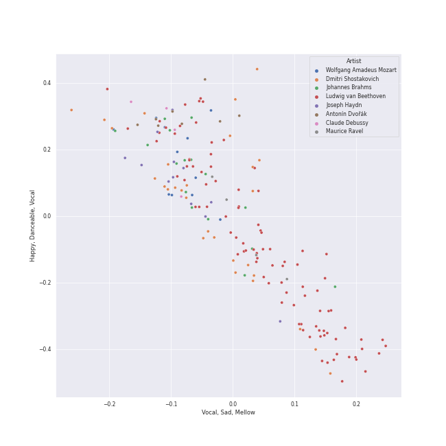
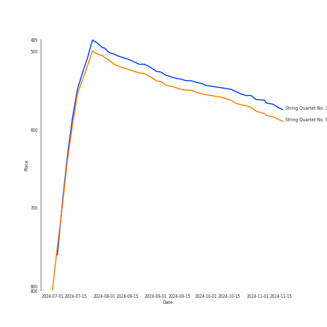
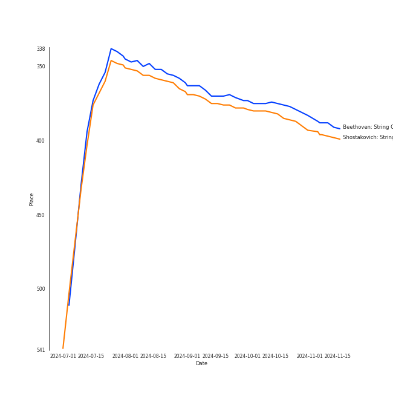

# String Quartets

[179 tracks (0 liked) 🔗](https://open.spotify.com/playlist/6b3mJeJjM9S5XAIS8jcTAt)

[See Track Features](audio_features.md)

[See Clusters](clusters/overview.md)

## Top Artists

| Art | Rank | Tracks | 💚 | Artist | 🔗 |
|:---|---:|---:|---:|:---|:---|
|  | 296 | 95 | 0 | [Ludwig van Beethoven](../../artists/ludwig_van_beethoven/overview.md) | [🔗](https://open.spotify.com/artist/2wOqMjp9TyABvtHdOSOTUS) |
|  | 145 | 80 | 0 | [Jerusalem Quartet](../../artists/jerusalem_quartet/overview.md) | [🔗](https://open.spotify.com/artist/7AnE8Jpu1vxLeXcs6OKYHE) |
|  | 431 | 71 | 0 | [Tokyo String Quartet](../../artists/tokyo_string_quartet/overview.md) | [🔗](https://open.spotify.com/artist/15G9RnBNBDCFUMANna2CvO) |
|  | 299 | 29 | 0 | Dmitri Shostakovich | [🔗](https://open.spotify.com/artist/6s1pCNXcbdtQJlsnM1hRIA) |
|  | 431 | 16 | 0 | Johannes Brahms | [🔗](https://open.spotify.com/artist/5wTAi7QkpP6kp8a54lmTOq) |
|  | 431 | 16 | 0 | Emerson String Quartet | [🔗](https://open.spotify.com/artist/4IBl8k6ZsBagsI5zRjyXH7) |
|  | 431 | 12 | 0 | Joseph Haydn | [🔗](https://open.spotify.com/artist/656RXuyw7CE0dtjdPgjJV6) |
|  | 431 | 12 | 0 | The Amsterdam String Quartet | [🔗](https://open.spotify.com/artist/0kbgyaL9g2Eba79p2jiYlN) |
|  | 431 | 11 | 0 | [Wolfgang Amadeus Mozart](../../artists/wolfgang_amadeus_mozart/overview.md) | [🔗](https://open.spotify.com/artist/4NJhFmfw43RLBLjQvxDuRS) |
|  | 431 | 8 | 0 | Antonín Dvořák | [🔗](https://open.spotify.com/artist/6n7nd5iceYpXVwcx8VPpxF) |

See all 15 artists

| Art | Rank | Tracks | 💚 | Artist | 🔗 |
|:---|---:|---:|---:|:---|:---|
|  | 431 | 8 | 0 | Veronika Hagen | [🔗](https://open.spotify.com/artist/3ijxXTal6hr7byhqZDdHsP) |
|  | 431 | 4 | 0 | Leon Fleisher | [🔗](https://open.spotify.com/artist/6ncNdxBc8zVWMOF7nJ5Pgy) |
|  | 431 | 4 | 0 | Claude Debussy | [🔗](https://open.spotify.com/artist/1Uff91EOsvd99rtAupatMP) |
|  | 431 | 4 | 0 | Maurice Ravel | [🔗](https://open.spotify.com/artist/17hR0sYHpx7VYTMRfFUOmY) |
|  | 431 | 3 | 0 | Gary Hoffman | [🔗](https://open.spotify.com/artist/7qcRbaIYVuOERS3KmB71GH) |

## Top Tracks

Most and least listened tracks

| Rank | ​ | Most listened tracks | Rank | ​​ | Least listened tracks |
|---:|:---|:---|---:|:---|:---|
| 545 |  | [String Quartet No. 3 in D Major, Op. 18: I. Allegro](../../artists/ludwig_van_beethoven/overview.md) | 976 |  | [String Quartet No. 4 in C Minor, Op. 18 No. 4: I. Allegro ma non tanto](../../artists/ludwig_van_beethoven/overview.md) |
| 559 |  | String Quartet No. 9 in E-Flat Major, Op. 117: III. Allegretto | 976 |  | String Quartet No. 3 In B Flat, Op. 67: 2. Andante |
| 976 |  | String Quartet No. 6 in G Major, Op. 101: III. Lento | 976 |  | [String Quartet No. 15 in A minor, Op. 132: I. Assai sostenuto - Allegro](../../artists/ludwig_van_beethoven/overview.md) |
| 976 |  | String Quartet No.11 in F Minor, Op. 122: III. Récitatif (Adagio) | 976 |  | [String Quartet No. 2 in G Major, Op. 18, No. 2: II. Adagio cantabile - Allegro](../../artists/ludwig_van_beethoven/overview.md) |
| 976 |  | String Quartet No. 1 in C Major, Op. 49: II. Moderato | 976 |  | [String Quartet No. 15 in A minor, Op. 132: V. Allegro appassionato - Presto](../../artists/ludwig_van_beethoven/overview.md) |
| 976 |  | [String Quartet No. 5 in A Major, Op. 18 No. 5: II. Menuetto - Trio](../../artists/ludwig_van_beethoven/overview.md) | 976 |  | [String Quartet No. 22 in B-Flat Major, K. 589, "Prussian": II. Larghetto](../../artists/wolfgang_amadeus_mozart/overview.md) |
| 976 |  | [String Quartet No. 10 in E-Flat Major, Op. 74 "Harp": III. Presto - Più presto quasi prestissimo](../../artists/ludwig_van_beethoven/overview.md) | 976 |  | String Quartet No. 9 in E-Flat Major, Op. 117: I. Moderato Con Moto |
| 976 |  | String Quartet in C Major, Op. 74, No. 1: III. Menuetto, Allegretto | 976 |  | [String Quartet No. 7 In F Major, Op. 59 No. 1: IV. Theme russe (Allegro)](../../artists/ludwig_van_beethoven/overview.md) |
| 976 |  | [String Quartet No. 4 in C Minor, Op. 18 No. 4: III. Menuetto (Allegro) - Trio](../../artists/ludwig_van_beethoven/overview.md) | 976 |  | String Quartet in G Minor, Op. 20, No. 3: IV. Finale, Allegro molto |
| 976 |  | [String Quartet No. 13 in B-Flat Major, Op. 130: II. Presto](../../artists/ludwig_van_beethoven/overview.md) | 976 |  | String Quartet No. 8 in C Minor, Op. 110: V. Largo |

## Top Albums

| Art | Rank | Tracks | 💚 | Album | Release Date | 🔗 |
|:---|---:|---:|---:|:---|:---|:---|
|  | 644 | 71 | 0 | Beethoven: Complete String Quartets | 2010-10-12 | [🔗](https://open.spotify.com/album/4JhUG1lr4xztAcqyA0Jm3a) |
|  | 381 | 29 | 0 | Shostakovich: String Quartets Nos. 1, 4, 6, 8, 9 & 11 | 2005 | [🔗](https://open.spotify.com/album/4V2YVRjysd08RF0GLRDDK7) |
|  | 375 | 24 | 0 | Beethoven: String Quartets, Op. 18 | 2015-08-31 | [🔗](https://open.spotify.com/album/37iUq5Dekt8uP5itTiVs2Q) |
|  | 644 | 16 | 0 | Brahms: String Quartets & Piano Quintet | 2007-01-01 | [🔗](https://open.spotify.com/album/5nZ5ePGoQZGt1MbGphwqph) |
|  | 644 | 12 | 0 | Haydn: String Quartets | 2008-01-01 | [🔗](https://open.spotify.com/album/1rNGG2I3AKJy9FWqUiitkc) |
|  | 644 | 11 | 0 | Mozart: String Quartets Nos. 4, 17 & 22 | 2011-02-22 | [🔗](https://open.spotify.com/album/1PxALR0DTaTJPL6ByBK266) |
|  | 644 | 8 | 0 | Dvorak: String Quintet, Op. 97 & String Sextet, Op. 48 | 2018-01-19 | [🔗](https://open.spotify.com/album/02nUFvsdTaekp2QQalnE3N) |
|  | 644 | 8 | 0 | Debussy & Ravel: String Quartets | 2018-05-25 | [🔗](https://open.spotify.com/album/77Eg2dHidrefgsS3GZ88nK) |

## Top Record Labels

| Tracks | 💚 | Label |
|---:|---:|:---|
| 151 | 0 | [harmonia mundi](../../labels/harmonia_mundi/overview.md) |
| 16 | 0 | [Deutsche Grammophon (DG)](../../labels/deutsche_grammophon_(dg)/overview.md) |
| 12 | 0 | [Channel Classics Records](../../labels/channel_classics_records/overview.md) |

## Genres

| Tracks | 💚 | Genre |
|---:|---:|:---|
| 179 | 0 | [classical](../../genres/classical/overview.md) |
| 118 | 0 | [classical era](../../genres/classical_era/overview.md) |
| 111 | 0 | [german romanticism](../../genres/german_romanticism/overview.md) |
| 95 | 0 | [early romantic era](../../genres/early_romantic_era/overview.md) |
| 29 | 0 | [russian modern classical](../../genres/russian_modern_classical/overview.md) |
| 29 | 0 | compositional ambient |
| 24 | 0 | [late romantic era](../../genres/late_romantic_era/overview.md) |
| 8 | 0 | [post-romantic era](../../genres/post-romantic_era/overview.md) |
| 8 | 0 | impressionism |
| 8 | 0 | czech classical |

See all 11 genres

| Tracks | 💚 | Genre |
|---:|---:|:---|
| 4 | 0 | [neoclassicism](../../genres/neoclassicism/overview.md) |

## Years

View all years

| Year | Number of Tracks |
|:---|---:|
| 2018 | 16 |
| [2015](2015/overview.md) | 24 |
| 2011 | 11 |
| [2010](2010/overview.md) | 71 |
| 2008 | 12 |
| 2007 | 16 |
| [2005](2005/overview.md) | 29 |

| ​ | 10 newest albums | ​​ | 10 oldest albums |
|:---|:---|:---|:---|
|  | Debussy & Ravel: String Quartets (2018-05-25) |  | Shostakovich: String Quartets Nos. 1, 4, 6, 8, 9 & 11 (2005) |
|  | Dvorak: String Quintet, Op. 97 & String Sextet, Op. 48 (2018-01-19) |  | Brahms: String Quartets & Piano Quintet (2007-01-01) |
|  | Beethoven: String Quartets, Op. 18 (2015-08-31) |  | Haydn: String Quartets (2008-01-01) |
|  | Mozart: String Quartets Nos. 4, 17 & 22 (2011-02-22) |  | Beethoven: Complete String Quartets (2010-10-12) |
|  | Beethoven: Complete String Quartets (2010-10-12) |  | Mozart: String Quartets Nos. 4, 17 & 22 (2011-02-22) |
|  | Haydn: String Quartets (2008-01-01) |  | Beethoven: String Quartets, Op. 18 (2015-08-31) |
|  | Brahms: String Quartets & Piano Quintet (2007-01-01) |  | Dvorak: String Quintet, Op. 97 & String Sextet, Op. 48 (2018-01-19) |
|  | Shostakovich: String Quartets Nos. 1, 4, 6, 8, 9 & 11 (2005) |  | Debussy & Ravel: String Quartets (2018-05-25) |