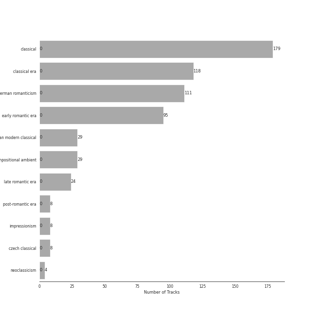

# String Quartets

[179 songs](tracks.md)

## Top Artists

See all 15 artists

|   Number of Tracks | Art                                                                                              | Artist                                                                        | 🔗                                                           |
|-------------------:|:-------------------------------------------------------------------------------------------------|:------------------------------------------------------------------------------|:------------------------------------------------------------|
|                 95 |  | [Ludwig van Beethoven](../../artists/ludwig_van_beethoven.md)                 | [🔗](https://open.spotify.com/artist/2wOqMjp9TyABvtHdOSOTUS) |
|                 80 |  | [Jerusalem Quartet](../../artists/jerusalem_quartet.md)                       | [🔗](https://open.spotify.com/artist/7AnE8Jpu1vxLeXcs6OKYHE) |
|                 71 |  | [Tokyo String Quartet](../../artists/tokyo_string_quartet.md)                 | [🔗](https://open.spotify.com/artist/15G9RnBNBDCFUMANna2CvO) |
|                 29 |  | [Dmitri Shostakovich](../../artists/dmitri_shostakovich.md)                   | [🔗](https://open.spotify.com/artist/6s1pCNXcbdtQJlsnM1hRIA) |
|                 16 |  | [Johannes Brahms](../../artists/johannes_brahms.md)                           | [🔗](https://open.spotify.com/artist/5wTAi7QkpP6kp8a54lmTOq) |
|                 16 |  | [Emerson String Quartet](../../artists/emerson_string_quartet.md)             | [🔗](https://open.spotify.com/artist/4IBl8k6ZsBagsI5zRjyXH7) |
|                 12 |  | [Joseph Haydn](../../artists/joseph_haydn.md)                                 | [🔗](https://open.spotify.com/artist/656RXuyw7CE0dtjdPgjJV6) |
|                 12 |  | [The Amsterdam String Quartet](../../artists/the_amsterdam_string_quartet.md) | [🔗](https://open.spotify.com/artist/0kbgyaL9g2Eba79p2jiYlN) |
|                 11 |  | [Wolfgang Amadeus Mozart](../../artists/wolfgang_amadeus_mozart.md)           | [🔗](https://open.spotify.com/artist/4NJhFmfw43RLBLjQvxDuRS) |
|                  8 |  | Antonín Dvořák                                                                | [🔗](https://open.spotify.com/artist/6n7nd5iceYpXVwcx8VPpxF) |
|                  8 |  | Veronika Hagen                                                                | [🔗](https://open.spotify.com/artist/3ijxXTal6hr7byhqZDdHsP) |
|                  4 |  | Leon Fleisher                                                                 | [🔗](https://open.spotify.com/artist/6ncNdxBc8zVWMOF7nJ5Pgy) |
|                  4 |  | [Claude Debussy](../../artists/claude_debussy.md)                             | [🔗](https://open.spotify.com/artist/1Uff91EOsvd99rtAupatMP) |
|                  4 |  | Maurice Ravel                                                                 | [🔗](https://open.spotify.com/artist/17hR0sYHpx7VYTMRfFUOmY) |
|                  3 |  | Gary Hoffman                                                                  | [🔗](https://open.spotify.com/artist/7qcRbaIYVuOERS3KmB71GH) |

## Top Albums

See all 8 albums

|   Number of Tracks | Art                                                                                              | Album                                                  | 🔗                                                          |
|-------------------:|:-------------------------------------------------------------------------------------------------|:-------------------------------------------------------|:-----------------------------------------------------------|
|                 71 |  | Beethoven: Complete String Quartets                    | [🔗](https://open.spotify.com/album/4JhUG1lr4xztAcqyA0Jm3a) |
|                 29 |  | Shostakovich: String Quartets Nos. 1, 4, 6, 8, 9 & 11  | [🔗](https://open.spotify.com/album/4V2YVRjysd08RF0GLRDDK7) |
|                 24 |  | Beethoven: String Quartets, Op. 18                     | [🔗](https://open.spotify.com/album/37iUq5Dekt8uP5itTiVs2Q) |
|                 16 |  | Brahms: String Quartets & Piano Quintet                | [🔗](https://open.spotify.com/album/5nZ5ePGoQZGt1MbGphwqph) |
|                 12 |  | Haydn: String Quartets                                 | [🔗](https://open.spotify.com/album/1rNGG2I3AKJy9FWqUiitkc) |
|                 11 |  | Mozart: String Quartets Nos. 4, 17 & 22                | [🔗](https://open.spotify.com/album/1PxALR0DTaTJPL6ByBK266) |
|                  8 |  | Dvorak: String Quintet, Op. 97 & String Sextet, Op. 48 | [🔗](https://open.spotify.com/album/02nUFvsdTaekp2QQalnE3N) |
|                  8 |  | Debussy & Ravel: String Quartets                       | [🔗](https://open.spotify.com/album/77Eg2dHidrefgsS3GZ88nK) |

## Top Record Labels

See all 3 labels

|   Number of Tracks | Label                                                                |
|-------------------:|:---------------------------------------------------------------------|
|                151 | [harmonia mundi](../../labels/harmonia_mundi.md)                     |
|                 16 | [Deutsche Grammophon (DG)](../../labels/deutsche_grammophon__dg_.md) |
|                 12 | [Channel Classics Records](../../labels/channel_classics_records.md) |

## Genres

See all 11 genres

|   Number of Tracks | Genre                                                                |
|-------------------:|:---------------------------------------------------------------------|
|                179 | [classical](../../genres/classical.md)                               |
|                118 | [classical era](../../genres/classical_era.md)                       |
|                111 | [german romanticism](../../genres/german_romanticism.md)             |
|                 95 | [early romantic era](../../genres/early_romantic_era.md)             |
|                 29 | [russian modern classical](../../genres/russian_modern_classical.md) |
|                 29 | compositional ambient                                                |
|                 24 | [late romantic era](../../genres/late_romantic_era.md)               |
|                  8 | [post-romantic era](../../genres/post_romantic_era.md)               |
|                  8 | impressionism                                                        |
|                  8 | czech classical                                                      |
|                  4 | [neoclassicism](../../genres/neoclassicism.md)                       |

## Audio Features

| 10 most Danceable tracks                                                               | 10 least Danceable tracks                                                                     |
|:---------------------------------------------------------------------------------------|:----------------------------------------------------------------------------------------------|
| String Quartet No.11 in F Minor, Op. 122: V. Humoresque (Allegro)                      | String Quartet No. 16 in F Major, Op. 135: III. Lento assai, cantate e tranquillo - Più lento |
| String Quartet No. 4 in C Major, K. 157: III. Presto                                   | String Quartet No. 8 in C Minor, Op. 110: IV. Largo                                           |
| String Quartet No. 2 in G Major, Op. 18, No. 2: IV. Allegro molto, quasi presto        | String Quartet No. 15 in A minor, Op. 132: III. Molto adagio                                  |
| String Quartet No. 4 in C Minor, Op. 18, No. 4: II. Andante scherzoso quasi allegretto | String Quartet No. 8 in E Minor, Op. 59 No. 2: II. Molto adagio                               |
| String Quartet No. 2 in G Major, Op. 18, No. 2: III. Scherzo (Allegro) - Trio          | String Quartet No.11 in F Minor, Op. 122: VI. Elégie (Adagio)                                 |
| String Quartet No. 8 in C Minor, Op. 110: III. Allegretto                              | String Quartet No. 4 in D Major, Op. 83: II. Andantino                                        |
| String Quartet No.11 in F Minor, Op. 122: II. Scherzo (Allegretto)                     | String Quartet No.11 in F Minor, Op. 122: I. Introduction (Andantino)                         |
| String Quartet No. 4 in C Minor, Op. 18 No. 4: II. Andante scherzoso quasi allegretto  | String Quartet No. 8 in C Minor, Op. 110: I. Largo                                            |
| String Quartet No. 6 in B-Flat Major, Op. 18 No. 6: I. Allegro con brio                | String Quartet in G Minor, Op. 10: III. Andantino, doucement expressif                        |
| String Quartet No. 5 in A Major, Op. 18 No. 5: I. Allegro                              | String Quartet No. 8 in C Minor, Op. 110: V. Largo                                            |

| 10 most Energetic tracks                                                                         | 10 least Energetic tracks                                                                    |
|:-------------------------------------------------------------------------------------------------|:---------------------------------------------------------------------------------------------|
| String Quartet No. 8 in C Minor, Op. 110: II. Allegro molto                                      | String Quartet No.11 in F Minor, Op. 122: I. Introduction (Andantino)                        |
| String Quartet No.11 in F Minor, Op. 122: V. Humoresque (Allegro)                                | String Quartet in G Major, Op. 76, No. 1: II. Adagio sostenuto                               |
| String Quartet No. 9 in E-Flat Major, Op. 117: V. Allegro                                        | String Quartet No. 8 in E Minor, Op. 59 No. 2: II. Molto adagio                              |
| String Quartet No. 1 in C Major, Op. 49: IV. Allegro                                             | String Quartet No. 8 in C Minor, Op. 110: V. Largo                                           |
| String Quartet No. 4 in C Major, K. 157: III. Presto                                             | String Quartet No. 6 in G Major, Op. 101: III. Lento                                         |
| String Quartet in C Major, Op. 74, No. 1: IV. Finale, Vivace                                     | String Quartet No. 8 in C Minor, Op. 110: IV. Largo                                          |
| String Quartet No. 9 in E-Flat Major, Op. 117: III. Allegretto                                   | String Quartet No. 14 in C-Sharp Minor, Op. 131: III. Allegro moderato - Adagio - Piu vivace |
| String Quartet No. 16 in F Major, Op. 135: II. Vivace                                            | String Quartet No.11 in F Minor, Op. 122: VII. Finale (Moderato)                             |
| String Quartet No. 9 in C Major, Op. 59 No. 3: IV. Finale (Allegro molto)                        | String Quartet No. 8 in C Minor, Op. 110: I. Largo                                           |
| String Quartet No. 10 in E-Flat Major, Op. 74 "Harp": III. Presto - Più presto quasi prestissimo | String Quartet No. 9 in E-Flat Major, Op. 117: IV. Adagio                                    |

| 10 most Speechy tracks                                                                               | 10 least Speechy tracks                                                                          |
|:-----------------------------------------------------------------------------------------------------|:-------------------------------------------------------------------------------------------------|
| String Quartet No.11 in F Minor, Op. 122: V. Humoresque (Allegro)                                    | String Quartet No. 1 in C Major, Op. 49: IV. Allegro                                             |
| String Quartet No. 11 in F Minor, Op. 95 "Quartetto serioso": III. Allegro assai - Vivace ma serioso | String Quartet in C Major, Op. 74, No. 1: I. Allegro Moderato                                    |
| String Quartet No. 6 in B-Flat Major, Op. 18 No. 6: III. Scherzo (Allegro) - Trio                    | String Quartet No. 4 in C Major, K. 157: I. Allegro                                              |
| String Quartet No. 4 in C Minor, Op. 18, No. 4: II. Andante scherzoso quasi allegretto               | String Quartet No. 9 in C Major, Op. 59 No. 3: IV. Finale (Allegro molto)                        |
| String Quartet in G Major, Op. 76, No. 1: III. Menuetto, Presto                                      | String Quartet No. 9 in E-Flat Major, Op. 117: I. Moderato Con Moto                              |
| String Quartet No.11 in F Minor, Op. 122: II. Scherzo (Allegretto)                                   | String Quartet in G Major, Op. 76, No. 1: II. Adagio sostenuto                                   |
| String Quartet No. 1 in F Major, Op. 18 No. 1: I. Allegro con brio                                   | String Quartet in G Major, Op. 76, No. 1: IV. Allegro ma non troppo                              |
| String Quartet No. 8 in C Minor, Op. 110: V. Largo                                                   | String Quartet No. 8 in C Minor, Op. 110: II. Allegro molto                                      |
| String Quartet No. 6 in B-Flat Major, Op. 18 No. 6: III. Scherzo (Allegro) - Trio                    | String Quartet No. 10 in E-Flat Major, Op. 74 "Harp": III. Presto - Più presto quasi prestissimo |
| String Quartet No. 5 in A Major, Op. 18 No. 5: I. Allegro                                            | String Quartet in C Major, Op. 74, No. 1: III. Menuetto, Allegretto                              |

| 10 most Acoustic tracks                                                             | 10 least Acoustic tracks                                                                      |
|:------------------------------------------------------------------------------------|:----------------------------------------------------------------------------------------------|
| String Quartet in C Major, Op. 74, No. 1: III. Menuetto, Allegretto                 | String Quartet No. 14 in C-Sharp Minor, Op. 131: V. Presto                                    |
| String Quartet in G Minor, Op. 20, No. 3: II. Menuetto, Allegretto                  | String Quartet No. 2 in G Major, Op. 18, No. 2: IV. Allegro molto, quasi presto               |
| String Quartet No.11 in F Minor, Op. 122: III. Récitatif (Adagio)                   | String Quartet No. 3 In B Flat, Op. 67: 2. Andante                                            |
| String Quartet in G Minor, Op. 20, No. 3: IV. Finale, Allegro molto                 | String Quartet No. 11 in F Minor, Op. 95 "Serioso": I. Allegro con brio                       |
| String Quartet No.11 in F Minor, Op. 122: VI. Elégie (Adagio)                       | String Quartet No. 16 in F Major, Op. 135: III. Lento assai, cantate e tranquillo - Più lento |
| String Quartet in C Major, Op. 74, No. 1: I. Allegro Moderato                       | String Quartet No. 15 in A minor, Op. 132: III. Molto adagio                                  |
| String Quartet in G Major, Op. 76, No. 1: IV. Allegro ma non troppo                 | String Quartet No.11 in F Minor, Op. 122: V. Humoresque (Allegro)                             |
| String Quartet in G Major, Op. 76, No. 1: I. Allegro con spirito                    | String Sextet, Op. 48: III. Furiant. Presto - Trio                                            |
| String Quartet No. 22 in B-Flat Major, K. 589, "Prussian": I. Allegro               | String Sextet, Op. 48: IV. Finale. Tema con variazioni - Allegretto grazioso, quasi andantino |
| String Quartet No. 22 in B-Flat Major, K. 589, "Prussian": III. Menuetto - Moderato | String Sextet, Op. 48: II. Dumka (Elegie). Poco allegretto                                    |

| 10 most Instrumental tracks                                                       | 10 least Instrumental tracks                                                                 |
|:----------------------------------------------------------------------------------|:---------------------------------------------------------------------------------------------|
| String Quartet No. 14 in C-Sharp Minor, Op. 131: VI. Adagio quasi un poco andante | String Quartet No. 5 in A Major, Op. 18 No. 5: II. Menuetto - Trio                           |
| String Quartet No.11 in F Minor, Op. 122: III. Récitatif (Adagio)                 | String Quartet No. 1 in F Major, Op. 18 No. 1: IV. Allegro                                   |
| String Quartet No. 8 in C Minor, Op. 110: II. Allegro molto                       | String Quartet No. 8 in E Minor, Op. 59 No. 2: IV. Finale (Presto)                           |
| String Quartet in G Minor, Op. 10: I. Animé et très décidé                        | String Quartet No. 14 in C-Sharp Minor, Op. 131: IV. Andante ma non troppo e molto cantabile |
| String Sextet, Op. 48: II. Dumka (Elegie). Poco allegretto                        | String Quartet No. 14 in C-Sharp Minor, Op. 131: II. Allegro molto vivace                    |
| String Quartet No. 9 in E-Flat Major, Op. 117: I. Moderato Con Moto               | String Quartet No. 13 in B-Flat Major, Op. 130: IV. Alla danza tedesca (allegro assai)       |
| String Quartet in G Minor, Op. 10: II. Assez vif et bien rythmé                   | String Quartet No. 1 in F Major, Op. 18 No. 1: II. Adagio affettuoso ed appassionato         |
| String Quartet in C Major, Op. 74, No. 1: IV. Finale, Vivace                      | String Quartet No.11 in F Minor, Op. 122: VII. Finale (Moderato)                             |
| String Quartet No. 9 in C Major, Op. 59 No. 3: IV. Finale (Allegro molto)         | String Quartet No. 2 in G Major, Op. 18, No. 2: I. Allegro                                   |
| String Quartet No. 16 in F Major, Op. 135: II. Vivace                             | String Quartet No. 6 in B-Flat Major, Op. 18 No. 6: II. Adagio ma non troppo                 |

| 10 most Live tracks                                                                              | 10 least Live tracks                                                                      |
|:-------------------------------------------------------------------------------------------------|:------------------------------------------------------------------------------------------|
| String Quartet No. 2 in G Major, Op. 18, No. 2: III. Scherzo (Allegro) - Trio                    | String Quartet No. 3 in D Major, Op. 18: I. Allegro                                       |
| String Quartet No. 10 in E-Flat Major, Op. 74 "Harp": III. Presto - Più presto quasi prestissimo | String Quartet No. 2 in G Major, Op. 18, No. 2: IV. Allegro molto, quasi presto           |
| String Quartet No. 13 in B-Flat Major, Op. 130: I. Adagio ma non troppo – Allegro                | String Quartet No. 8 in C Minor, Op. 110: III. Allegretto                                 |
| String Quartet No. 3 in D Major, Op. 18: III. Allegro                                            | String Quartet in G Major, Op. 76, No. 1: I. Allegro con spirito                          |
| String Quartet No.11 in F Minor, Op. 122: IV. Etude (Allegro)                                    | String Quartet No. 6 in B-Flat Major, Op. 18 No. 6: III. Scherzo (Allegro) - Trio         |
| String Quartet No. 5 in A Major, Op. 18 No. 5: IV. Allegro                                       | String Quartet No. 5 in A Major, Op. 18 No. 5: II. Menuetto - Trio                        |
| String Quartet No. 3 In B Flat, Op. 67: 3. Agitato (Allegretto non troppo)                       | String Quartet No. 8 in E Minor, Op. 59 No. 2: I. Allegro                                 |
| String Quartet No. 17 in B-Flat Major, K. 458 "The Hunt": II. Menuetto (Moderato)                | Piano Quintet in F minor, Op. 34: 4. Finale (poco sostenuto - Allegro non troppo)         |
| String Quartet No. 16 in F Major, Op. 135: I. Allegretto                                         | String Quartet No. 3 in D Major, Op. 18: I. Allegro                                       |
| String Quartet No. 1 in F Major, Op. 18 No. 1: IV. Allegro                                       | String Quartet No. 2 In A Minor, Op. 51 No. 2: 4. Finale (Allegro non assai - Più vivace) |

| 10 most Happy tracks                                                              | 10 least Happy tracks                                                                         |
|:----------------------------------------------------------------------------------|:----------------------------------------------------------------------------------------------|
| String Quartet No. 4 in C Major, K. 157: III. Presto                              | Quatuor en Fa Majeur, M. 35: III. Très lent                                                   |
| String Quartet No. 6 in B-Flat Major, Op. 18 No. 6: III. Scherzo (Allegro) - Trio | String Quartet No. 16 in F Major, Op. 135: III. Lento assai, cantate e tranquillo - Più lento |
| String Quartet No. 6 in B-Flat Major, Op. 18 No. 6: III. Scherzo (Allegro) - Trio | String Quartet No. 8 in C Minor, Op. 110: IV. Largo                                           |
| String Quartet No. 8 in C Minor, Op. 110: II. Allegro molto                       | String Quartet No. 6 in G Major, Op. 101: III. Lento                                          |
| String Quartet No. 16 in F Major, Op. 135: II. Vivace                             | String Quartet No. 8 in C Minor, Op. 110: V. Largo                                            |
| String Quartet No. 4 in C Major, K. 157: I. Allegro                               | String Quartet No. 8 in C Minor, Op. 110: I. Largo                                            |
| String Quartet No. 2 in G Major, Op. 18, No. 2: III. Scherzo (Allegro) - Trio     | String Quartet No. 4 in D Major, Op. 83: II. Andantino                                        |
| String Quartet No. 14 in C-Sharp Minor, Op. 131: V. Presto                        | String Quartet in G Minor, Op. 10: III. Andantino, doucement expressif                        |
| String Quartet No. 2 in G Major, Op. 18, No. 2: III. Scherzo (Allegro) - Trio     | String Quartet No.11 in F Minor, Op. 122: VI. Elégie (Adagio)                                 |
| String Quartet No. 17 in B-Flat Major, K. 458 "The Hunt": IV. Allegro assai       | String Quartet No. 9 in E-Flat Major, Op. 117: II. Adagio                                     |
