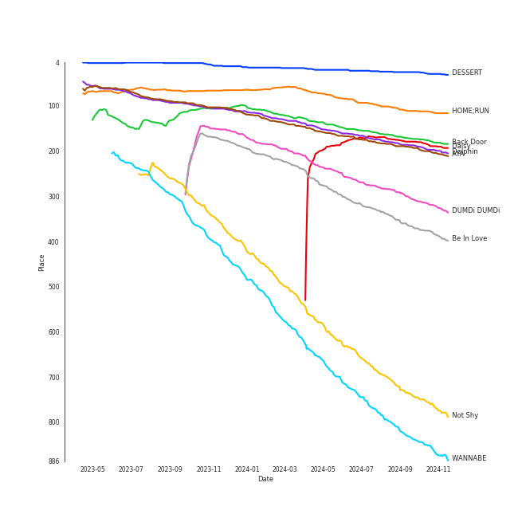

# Tracks in Summer from 2020

## Artists

| Art | Tracks | 💚 | Artist | 🔗 |
|:---|---:|---:|:---|:---|
|  | 3 | 3 | [Dua Lipa](../../../artists/dua_lipa/overview.md) | [🔗](https://open.spotify.com/artist/6M2wZ9GZgrQXHCFfjv46we) |
|  | 3 | 3 | IZ*ONE | [🔗](https://open.spotify.com/artist/5r1tUTxVSgvBHnoDuDODPH) |
|  | 3 | 3 | [ITZY](../../../artists/itzy/overview.md) | [🔗](https://open.spotify.com/artist/2KC9Qb60EaY0kW4eH68vr3) |
|  | 2 | 2 | [Stray Kids](../../../artists/stray_kids/overview.md) | [🔗](https://open.spotify.com/artist/2dIgFjalVxs4ThymZ67YCE) |
|  | 2 | 2 | [MAMAMOO](../../../artists/mamamoo/overview.md) | [🔗](https://open.spotify.com/artist/0XATRDCYuuGhk0oE7C0o5G) |
|  | 2 | 2 | [Taylor Swift](../../../artists/taylor_swift/overview.md) | [🔗](https://open.spotify.com/artist/06HL4z0CvFAxyc27GXpf02) |
|  | 2 | 1 | [BLACKPINK](../../../artists/blackpink/overview.md) | [🔗](https://open.spotify.com/artist/41MozSoPIsD1dJM0CLPjZF) |
|  | 1 | 1 | [SEVENTEEN](../../../artists/seventeen/overview.md) | [🔗](https://open.spotify.com/artist/7nqOGRxlXj7N2JYbgNEjYH) |
|  | 1 | 1 | [JEON SOYEON](../../../artists/jeon_soyeon/overview.md) | [🔗](https://open.spotify.com/artist/6Xg22wJOAcnvPUfk5WvODH) |
|  | 1 | 1 | [Doja Cat](../../../artists/doja_cat/overview.md) | [🔗](https://open.spotify.com/artist/5cj0lLjcoR7YOSnhnX0Po5) |

View all

| Art | Tracks | 💚 | Artist | 🔗 |
|:---|---:|---:|:---|:---|
|  | 1 | 1 | DaBaby | [🔗](https://open.spotify.com/artist/4r63FhuTkUYltbVAg5TQnk) |
|  | 1 | 1 | Cardi B | [🔗](https://open.spotify.com/artist/4kYSro6naA4h99UJvo89HB) |
|  | 1 | 1 | Loopy | [🔗](https://open.spotify.com/artist/3l9s67pOK4Stw9yW1wr0Bg) |
|  | 1 | 1 | HYO | [🔗](https://open.spotify.com/artist/3U7bOaJLuFkrmDQ1C1OqKl) |
|  | 1 | 1 | [(G)I-DLE](../../../artists/(g)i-dle/overview.md) | [🔗](https://open.spotify.com/artist/2AfmfGFbe0A0WsTYm0SDTx) |
|  | 1 | 1 | [OH MY GIRL](../../../artists/oh_my_girl/overview.md) | [🔗](https://open.spotify.com/artist/2019zR22qK2RBvCqtudBaI) |
|  | 1 | 1 | [PENTAGON](../../../artists/pentagon/overview.md) | [🔗](https://open.spotify.com/artist/1wKpMkucynaTfG8lyPprYV) |
|  | 1 | 1 | Megan Thee Stallion | [🔗](https://open.spotify.com/artist/181bsRPaVXVlUKXrxwZfHK) |
|  | 1 | 0 | Selena Gomez | [🔗](https://open.spotify.com/artist/0C8ZW7ezQVs4URX5aX7Kqx) |

## Albums

| Art | Tracks | 💚 | Album | Release Date | 🔗 |
|:---|---:|---:|:---|:---|:---|
|  | 3 | 3 | Future Nostalgia | 2020-03-27 | [🔗](https://open.spotify.com/album/5lKlFlReHOLShQKyRv6AL9) |
|  | 2 | 2 | folklore | 2020-07-24 | [🔗](https://open.spotify.com/album/2fenSS68JI1h4Fo296JfGr) |
|  | 2 | 2 | One-reeler / Act IV | 2020-12-07 | [🔗](https://open.spotify.com/album/3gfl9D7cMW3K87YiMbqsWK) |
|  | 2 | 2 | Not Shy | 2020-08-17 | [🔗](https://open.spotify.com/album/5NN55LKbjzX16a7Uf8u7Os) |
|  | 2 | 2 | IN LIFE | 2020-09-14 | [🔗](https://open.spotify.com/album/0aERWcI2KYSCM4biUihB9X) |
|  | 2 | 1 | THE ALBUM | 2020-10-02 | [🔗](https://open.spotify.com/album/71O60S5gIJSIAhdnrDIh3N) |
|  | 1 | 1 | WE:TH | 2020-10-12 | [🔗](https://open.spotify.com/album/1ASYbBYBwV6Rcfc2ycqmlK) |
|  | 1 | 1 | WAP (feat. Megan Thee Stallion) | 2020-08-07 | [🔗](https://open.spotify.com/album/2ogiazbrNEx0kQHGl5ZBTQ) |
|  | 1 | 1 | TRAVEL | 2020-11-03 | [🔗](https://open.spotify.com/album/3xje7wSW2xwQx2GNJ5cfNu) |
|  | 1 | 1 | NONSTOP | 2020-04-27 | [🔗](https://open.spotify.com/album/7J8Kp48L7RdLkpjSVrO5PY) |

View all

| Art | Tracks | 💚 | Album | Release Date | 🔗 |
|:---|---:|---:|:---|:---|:---|
|  | 1 | 1 | IT'z ME | 2020-03-09 | [🔗](https://open.spotify.com/album/7ynKAohxfwPUZzvU8f1p1U) |
|  | 1 | 1 | Dingga | 2020-10-20 | [🔗](https://open.spotify.com/album/4xzsBcZaK04c8IE5iVyMNK) |
|  | 1 | 1 | DUMDi DUMDi | 2020-08-03 | [🔗](https://open.spotify.com/album/0NC6QFvAc9H9r5iov9QwjK) |
|  | 1 | 1 | DESSERT | 2020-07-22 | [🔗](https://open.spotify.com/album/5brSFD1knAOSM7j6083naD) |
|  | 1 | 1 | Boss Bitch | 2020-01-23 | [🔗](https://open.spotify.com/album/4pmyFpGicLLIgNPc1TQXKc) |
|  | 1 | 1 | BLOOM*IZ | 2020-02-17 | [🔗](https://open.spotify.com/album/5dm3PMCHxTSOdDFZ1hlfMm) |
|  | 1 | 1 | ; [Semicolon] | 2020-10-19 | [🔗](https://open.spotify.com/album/1EMYSiKKTSKLZrOC2nTStL) |

## Tracks

| Art | Track | Album | Artists | Label | Rank | 💚 | 🔗 |
|:---|:---|:---|:---|:---|---:|:---|:---|
|  | DESSERT | DESSERT | HYO, Loopy, [JEON SOYEON](../../../artists/jeon_soyeon/overview.md) | [SM Entertainment](../../../labels/sm_entertainment) | 17 | 💚 | [🔗](https://open.spotify.com/track/6u0pZe0Uv7GBR0iKptfWRf) |
|  | HOME;RUN | ; [Semicolon] | [SEVENTEEN](../../../artists/seventeen/overview.md) | [PLEDIS Entertainment](../../../labels/pledis_entertainment) | 65 | 💚 | [🔗](https://open.spotify.com/track/2iW0q5jJJT5HKlIs25AAgv) |
|  | Back Door | IN LIFE | [Stray Kids](../../../artists/stray_kids/overview.md) | [Republic Records](../../../labels/republic_records) | 130 | 💚 | [🔗](https://open.spotify.com/track/0XuepwFJUcKN8T5zTqoP0F) |
|  | Dolphin | NONSTOP | [OH MY GIRL](../../../artists/oh_my_girl/overview.md) | [WM Entertainment](../../../labels/wm_entertainment) | 141 | 💚 | [🔗](https://open.spotify.com/track/3NfgdU9mbIVhcJF3XvC0c9) |
|  | AYA | TRAVEL | [MAMAMOO](../../../artists/mamamoo/overview.md) | [RBW Inc.](../../../labels/rbw_inc_) | 148 | 💚 | [🔗](https://open.spotify.com/track/4BZXVFYCb76Q0Klojq4piV) |
|  | DUMDi DUMDi | DUMDi DUMDi | [(G)I-DLE](../../../artists/(g)i-dle/overview.md) | [Universal Music LLC](../../../labels/universal_music_llc) | 220 | 💚 | [🔗](https://open.spotify.com/track/2fJ70dRX7J4jiVxKUQQp7C) |
|  | Be In Love | Not Shy | [ITZY](../../../artists/itzy/overview.md) | [Republic Records](../../../labels/republic_records) | 252 | 💚 | [🔗](https://open.spotify.com/track/0FGeJSm4Iix7OdvjvENrwx) |
|  | Daisy | WE:TH | [PENTAGON](../../../artists/pentagon/overview.md) | [Universal Music LLC](../../../labels/universal_music_llc) | 373 | 💚 | [🔗](https://open.spotify.com/track/14pjnaIqkpReO5D0tHofAS) |
|  | Not Shy | Not Shy | [ITZY](../../../artists/itzy/overview.md) | [Republic Records](../../../labels/republic_records) | 553 | 💚 | [🔗](https://open.spotify.com/track/1ehags7lQMM1qX94VJkoaf) |
|  | WANNABE | IT'z ME | [ITZY](../../../artists/itzy/overview.md) | [Republic Records](../../../labels/republic_records) | 642 | 💚 | [🔗](https://open.spotify.com/track/4pspYVQGFHLPEFgQPD1J7e) |

View all

| Art | Track | Album | Artists | Label | Rank | 💚 | 🔗 |
|:---|:---|:---|:---|:---|---:|:---|:---|
|  | Boss Bitch | Boss Bitch | [Doja Cat](../../../artists/doja_cat/overview.md) | [Atlantic Records](../../../labels/atlantic_records) | nan | 💚 | [🔗](https://open.spotify.com/track/78qd8dvwea0Gosb6Fe6j3k) |
|  | FIESTA | BLOOM*IZ | IZ*ONE | [Genie Music Corporation](../../../labels/genie_music_corporation), [Stone Music Entertainment](../../../labels/stone_music_entertainment) | nan | 💚 | [🔗](https://open.spotify.com/track/6Ihdn6wW2UBhfTKWbP29KA) |
|  | Break My Heart | Future Nostalgia | [Dua Lipa](../../../artists/dua_lipa/overview.md) | [Warner Records](../../../labels/warner_records) | nan | 💚 | [🔗](https://open.spotify.com/track/59CrwNtNqzOmODXRxwaknc) |
|  | Don't Start Now | Future Nostalgia | [Dua Lipa](../../../artists/dua_lipa/overview.md) | [Warner Records](../../../labels/warner_records) | nan | 💚 | [🔗](https://open.spotify.com/track/1AVtceapuF36oZqI9gzp0o) |
|  | Levitating (feat. DaBaby) | Future Nostalgia | [Dua Lipa](../../../artists/dua_lipa/overview.md), DaBaby | [Warner Records](../../../labels/warner_records) | nan | 💚 | [🔗](https://open.spotify.com/track/5nujrmhLynf4yMoMtj8AQF) |
|  | august | folklore | [Taylor Swift](../../../artists/taylor_swift/overview.md) | [Taylor Swift](../../../labels/taylor_swift) | nan | 💚 | [🔗](https://open.spotify.com/track/3hUxzQpSfdDqwM3ZTFQY0K) |
|  | invisible string | folklore | [Taylor Swift](../../../artists/taylor_swift/overview.md) | [Taylor Swift](../../../labels/taylor_swift) | nan | 💚 | [🔗](https://open.spotify.com/track/6VsvKPJ4xjVNKpI8VVZ3SV) |
|  | WAP (feat. Megan Thee Stallion) | WAP (feat. Megan Thee Stallion) | Cardi B, Megan Thee Stallion | [Atlantic/KSR](../../../labels/atlantic_records) | nan | 💚 | [🔗](https://open.spotify.com/track/4Oun2ylbjFKMPTiaSbbCih) |
|  | Any | IN LIFE | [Stray Kids](../../../artists/stray_kids/overview.md) | [Republic Records](../../../labels/republic_records) | nan | 💚 | [🔗](https://open.spotify.com/track/5S7kMbtEikXwCAHMu3R3jw) |
|  | Ice Cream (with Selena Gomez) | THE ALBUM | [BLACKPINK](../../../artists/blackpink/overview.md), Selena Gomez | [Interscope Records](../../../labels/interscope_records), [YG Entertainment](../../../labels/yg_entertainment) | nan | | [🔗](https://open.spotify.com/track/4JUPEh2DVSXFGExu4Uxevz) |
|  | Lovesick Girls | THE ALBUM | [BLACKPINK](../../../artists/blackpink/overview.md) | [Interscope Records](../../../labels/interscope_records), [YG Entertainment](../../../labels/yg_entertainment) | nan | 💚 | [🔗](https://open.spotify.com/track/4Ws314Ylb27BVsvlZOy30C) |
|  | Dingga | Dingga | [MAMAMOO](../../../artists/mamamoo/overview.md) | [RBW, Inc](../../../labels/rbw_inc_) | nan | 💚 | [🔗](https://open.spotify.com/track/0bDYceyQd1jnJO4sK47YxU) |
|  | Panorama | One-reeler / Act IV | IZ*ONE | OFF THE RECORD Entertainment, SWING Entertainment | nan | 💚 | [🔗](https://open.spotify.com/track/0CnpSTdL9l5vQM4YnzXtyo) |
|  | Sequence | One-reeler / Act IV | IZ*ONE | OFF THE RECORD Entertainment, SWING Entertainment | nan | 💚 | [🔗](https://open.spotify.com/track/4Wa3kUtGTeuPuC9qF9wF0g) |

