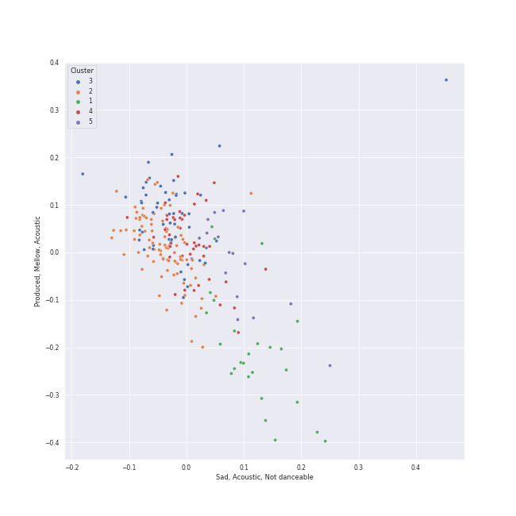

# Clusters in Summer

## Cluster #1

19 tracks

| Art | Track | Album | Artists | Label | Rank | 💚 | 🔗 |
|:---|:---|:---|:---|:---|---:|:---|:---|
|  | Little Black Dress | The Blessed Unrest | [Sara Bareilles](../../../../artists/sara_bareilles/overview.md) | [Epic](../../../../labels/epic) | 864 | 💚 | [🔗](https://open.spotify.com/track/3MOUUE92JOO8UdVTszYaJ0) |
|  | Don't Know What To Do | KILL THIS LOVE | [BLACKPINK](../../../../artists/blackpink/overview.md) | [Interscope Records](../../../../labels/interscope_records), [YG Entertainment](../../../../labels/yg_entertainment) | 864 | 💚 | [🔗](https://open.spotify.com/track/38SKB7UfhL6Sd6Joxex5yK) |
|  | Change | I love | [(G)I-DLE](../../../../artists/(g)i-dle/overview.md) | [Cube Entertainment](../../../../labels/cube_entertainment) | 159 | 💚 | [🔗](https://open.spotify.com/track/6wXYyw7TBQlJ0qh3RNP8MD) |
|  | POP! | IM NAYEON | NAYEON | Republic Records – NAYEON (TWICE) | 864 | 💚 | [🔗](https://open.spotify.com/track/3lOMJTQTd6J34faYwASc33) |
|  | Who Are You | Who Are You | [The Who](../../../../artists/the_who/overview.md) | [Geffen](../../../../labels/geffen) | 573 | 💚 | [🔗](https://open.spotify.com/track/23IJ5wLRhEZ9DOuia5mPiZ) |
|  | Dog Days Are Over | Lungs (Deluxe Edition) | [Florence + The Machine](../../../../artists/florence_+_the_machine/overview.md) | [Universal-Island Records Ltd.](../../../../labels/universal-island_records_ltd_) | 864 | 💚 | [🔗](https://open.spotify.com/track/1YLJVmuzeM2YSUkCCaTNUB) |
|  | ASAP | STAYDOM | [STAYC](../../../../artists/stayc/overview.md) | [High Up Entertainment](../../../../labels/high_up_entertainment) | 864 | 💚 | [🔗](https://open.spotify.com/track/5BXr7hYZQOeRttkeWYTq5S) |
|  | Somebody To Love | A Day At The Races | [Queen](../../../../artists/queen/overview.md) | [Hollywood Records](../../../../labels/hollywood_records) | 864 | 💚 | [🔗](https://open.spotify.com/track/79M91zIoaIrm073sACpOtr) |
|  | Havana (feat. Young Thug) | Camila | [Camila Cabello](../../../../artists/camila_cabello/overview.md), Young Thug | [Epic](../../../../labels/epic), [Syco Music](../../../../labels/syco_music) | 864 | 💚 | [🔗](https://open.spotify.com/track/1rfofaqEpACxVEHIZBJe6W) |
|  | Mr. Rover | Mr. Rover | DARA | Virginia Records | 864 | 💚 | [🔗](https://open.spotify.com/track/2fV8wXxMmdeulUgAarbWJU) |
## Cluster #2

70 tracks

| Art | Track | Album | Artists | Label | Rank | 💚 | 🔗 |
|:---|:---|:---|:---|:---|---:|:---|:---|
|  | Gonna Get Over You | Kaleidoscope Heart | [Sara Bareilles](../../../../artists/sara_bareilles/overview.md) | [Epic](../../../../labels/epic) | 864 | 💚 | [🔗](https://open.spotify.com/track/45ou2UBThJA4WtFGIiYLI3) |
|  | Surfin’ (Lee Know, Changbin, Felix) | NOEASY | [Stray Kids](../../../../artists/stray_kids/overview.md) | [Republic Records](../../../../labels/republic_records) | 864 | | [🔗](https://open.spotify.com/track/1FdnsU6An1Ye3uBJe8j23c) |
|  | WANNABE | IT'z ME | [ITZY](../../../../artists/itzy/overview.md) | [Republic Records](../../../../labels/republic_records) | 741 | 💚 | [🔗](https://open.spotify.com/track/4pspYVQGFHLPEFgQPD1J7e) |
|  | BAMBOLEO | ‘The ReVe Festival 2022 - Feel My Rhythm’ | [Red Velvet](../../../../artists/red_velvet/overview.md) | [SM Entertainment](../../../../labels/sm_entertainment) | 390 | 💚 | [🔗](https://open.spotify.com/track/0jXneVxiitQZsbtftH7HHJ) |
|  | Long Chat (#♥) | Armageddon - The 1st Album | [aespa](../../../../artists/aespa/overview.md) | [SM Entertainment](../../../../labels/sm_entertainment) | 231 | 💚 | [🔗](https://open.spotify.com/track/1l4aQeJKuPVUVtMVZw1fTf) |
|  | Teenage Dream | Teenage Dream | Katy Perry | [Capitol Records](../../../../labels/capitol_records) | 864 | 💚 | [🔗](https://open.spotify.com/track/6AOdKVvWB8Ulb3lGCnyPBY) |
|  | Daisy | WE:TH | [PENTAGON](../../../../artists/pentagon/overview.md) | [Universal Music LLC](../../../../labels/universal_music_llc) | 179 | 💚 | [🔗](https://open.spotify.com/track/14pjnaIqkpReO5D0tHofAS) |
|  | DO or NOT | LOVE or TAKE | [PENTAGON](../../../../artists/pentagon/overview.md) | [Universal Music LLC](../../../../labels/universal_music_llc) | 864 | 💚 | [🔗](https://open.spotify.com/track/6AE0npeqcZIebU2EN7jMtL) |
|  | Rover | Rover - The 3rd Mini Album | KAI | [SM Entertainment](../../../../labels/sm_entertainment) | 248 | 💚 | [🔗](https://open.spotify.com/track/3WUyu94psXrYV6HZbXgcFA) |
|  | Touch my body | TOUCH N MOVE | SISTAR | [Starship Entertainment](../../../../labels/starship_entertainment) | 864 | 💚 | [🔗](https://open.spotify.com/track/5crARIrvoMiMf2AdlD78WN) |
## Cluster #3

69 tracks

| Art | Track | Album | Artists | Label | Rank | 💚 | 🔗 |
|:---|:---|:---|:---|:---|---:|:---|:---|
|  | Good Thing | Why - The 2nd Mini Album | [TAEYEON](../../../../artists/taeyeon/overview.md) | [SM Entertainment](../../../../labels/sm_entertainment) | 864 | | [🔗](https://open.spotify.com/track/30CAqzLOdc8LbPRzchYaAt) |
|  | After LIKE | After LIKE | [IVE](../../../../artists/ive/overview.md) | [Starship Entertainment](../../../../labels/starship_entertainment) | 193 | 💚 | [🔗](https://open.spotify.com/track/2gYj9lubBorOPIVWsTXugG) |
|  | Dance The Night Away | Summer Nights | [TWICE](../../../../artists/twice/overview.md) | [Republic Records](../../../../labels/republic_records) | 686 | 💚 | [🔗](https://open.spotify.com/track/4DYIDSMIB5y2UmZFv9fxeX) |
|  | ANTIFRAGILE | ANTIFRAGILE | [LE SSERAFIM](../../../../artists/le_sserafim/overview.md) | [SOURCE MUSIC](../../../../labels/source_music) | 132 | 💚 | [🔗](https://open.spotify.com/track/4fsQ0K37TOXa3hEQfjEic1) |
|  | Get Lucky (feat. Pharrell Williams and Nile Rodgers) | Random Access Memories | [Daft Punk](../../../../artists/daft_punk/overview.md), Pharrell Williams, Nile Rodgers | [Columbia](../../../../labels/columbia) | 397 | 💚 | [🔗](https://open.spotify.com/track/69kOkLUCkxIZYexIgSG8rq) |
|  | Doom Du Doom | HARMONY : ZERO IN | [P1Harmony](../../../../artists/p1harmony/overview.md) | [FNC ENTERTAINMENT](../../../../labels/fnc_entertainment) | 864 | 💚 | [🔗](https://open.spotify.com/track/41tvdK0UNp3oNKWDPkg7FO) |
|  | Spicy | MY WORLD - The 3rd Mini Album | [aespa](../../../../artists/aespa/overview.md) | [SM Entertainment](../../../../labels/sm_entertainment), [Warner Records](../../../../labels/warner_records) | 27 | 💚 | [🔗](https://open.spotify.com/track/1ULdASrNy5rurl1TZfFaMP) |
|  | Where Is The Love? | Elephunk | Black Eyed Peas | A&M | 864 | 💚 | [🔗](https://open.spotify.com/track/0xmjwnQ3FNE6HuWCt2nHdZ) |
|  | VERY NICE | Love&Letter repackage album | [SEVENTEEN](../../../../artists/seventeen/overview.md) | [PLEDIS ENTERTAINMENT](../../../../labels/pledis_entertainment) | 621 | | [🔗](https://open.spotify.com/track/1Rrj7KyS2R6SP9CQMDJW1w) |
|  | Sunshower | EPEX 5th EP Album Prelude of Love Chapter 2. 'Growing Pains' | EPEX | C9 Entertainment | 220 | 💚 | [🔗](https://open.spotify.com/track/3fcDHjyxOQoGV4UuMdagu0) |
## Cluster #4

34 tracks

| Art | Track | Album | Artists | Label | Rank | 💚 | 🔗 |
|:---|:---|:---|:---|:---|---:|:---|:---|
|  | Like Ooh-Ahh | The Story Begins | [TWICE](../../../../artists/twice/overview.md) | [Republic Records](../../../../labels/republic_records) | 559 | 💚 | [🔗](https://open.spotify.com/track/3c0CJ0DBgsGZ7I79lyx02Z) |
|  | Sparkling | Bare&Rare, Pt. 1 | [CHUNG HA](../../../../artists/chung_ha/overview.md) | [MNH ENTERTAINMENT](../../../../labels/mnh_entertainment) | 864 | 💚 | [🔗](https://open.spotify.com/track/6TzU11huC8Hz4FVEsvCeE7) |
|  | FIESTA | BLOOM*IZ | IZ*ONE | [Genie Music Corporation](../../../../labels/genie_music_corporation), [Stone Music Entertainment](../../../../labels/stone_music_entertainment) | 864 | 💚 | [🔗](https://open.spotify.com/track/6Ihdn6wW2UBhfTKWbP29KA) |
|  | Upper Side Dreamin’ | DIMENSION : DILEMMA | [ENHYPEN](../../../../artists/enhypen/overview.md) | [BELIFT LAB](../../../../labels/belift_lab) | 376 | 💚 | [🔗](https://open.spotify.com/track/6oSCR9n71tmwWL3GFb65Ec) |
|  | ParadoXXX Invasion | MANIFESTO : DAY 1 | [ENHYPEN](../../../../artists/enhypen/overview.md) | [BELIFT LAB](../../../../labels/belift_lab) | 18 | 💚 | [🔗](https://open.spotify.com/track/3OC2C8IpFhbUJTeMe55QYn) |
|  | 소방차 Fire Truck | NCT #127 - The 1st Mini Album | [NCT 127](../../../../artists/nct_127/overview.md) | [SM Entertainment](../../../../labels/sm_entertainment) | 620 | 💚 | [🔗](https://open.spotify.com/track/5hHlmrSV6d9LFMsDA1lamE) |
|  | Better Things | Better Things | [aespa](../../../../artists/aespa/overview.md) | [SM Entertainment](../../../../labels/sm_entertainment), [Warner Records](../../../../labels/warner_records) | 31 | 💚 | [🔗](https://open.spotify.com/track/6zZWoHlF2zNSLUNLvx4GUl) |
|  | Grace Kelly | Life in Cartoon Motion | MIKA | Casablanca Records/Island UK | 864 | 💚 | [🔗](https://open.spotify.com/track/7dzUZec5MnWMyQnk5klnKR) |
|  | DESSERT | DESSERT | HYO, Loopy, [JEON SOYEON](../../../../artists/jeon_soyeon/overview.md) | [SM Entertainment](../../../../labels/sm_entertainment) | 22 | 💚 | [🔗](https://open.spotify.com/track/6u0pZe0Uv7GBR0iKptfWRf) |
|  | Yummy Yummy Love | Yummy Yummy Love | [MOMOLAND](../../../../artists/momoland/overview.md), NATTI NATASHA | MLD entertainment | 864 | 💚 | [🔗](https://open.spotify.com/track/4yTvTZ68CSpqV1T6AuGikB) |
## Cluster #5

23 tracks

| Art | Track | Album | Artists | Label | Rank | 💚 | 🔗 |
|:---|:---|:---|:---|:---|---:|:---|:---|
|  | King of Anything | Kaleidoscope Heart | [Sara Bareilles](../../../../artists/sara_bareilles/overview.md) | [Epic](../../../../labels/epic) | 864 | 💚 | [🔗](https://open.spotify.com/track/3VA8T3rNy5V24AXxNK5u9E) |
|  | Big Booty | 容 : FACE | [Solar](../../../../artists/solar/overview.md) | [RBW Inc.](../../../../labels/rbw_inc_) | 864 | 💚 | [🔗](https://open.spotify.com/track/5bwzsMhJZHSHM6M6qslOgd) |
|  | dlwlrma | Palette | [IU](../../../../artists/iu/overview.md) | Fave Entertainment | 731 | 💚 | [🔗](https://open.spotify.com/track/4NPARrLIbtMl29ZJv8ESr2) |
|  | Gee | Gee - The First Mini Album | [Girls' Generation](../../../../artists/girls__generation/overview.md) | [SM Entertainment](../../../../labels/sm_entertainment) | 864 | 💚 | [🔗](https://open.spotify.com/track/2BQIMF7CyLe2xAKzh74A4C) |
|  | Kiss Me More (feat. SZA) | Kiss Me More (feat. SZA) | [Doja Cat](../../../../artists/doja_cat/overview.md), SZA | [Kemosabe Records/RCA Records](../../../../labels/rca_records_label) | 864 | 💚 | [🔗](https://open.spotify.com/track/748mdHapucXQri7IAO8yFK) |
|  | UNNATURAL | UNNATURAL | [WJSN](../../../../artists/wjsn/overview.md) | [STARSHIP ENTERTAINMENT](../../../../labels/starship_entertainment) | 864 | 💚 | [🔗](https://open.spotify.com/track/1eykKBqxHgasGHwjOQIvbt) |
|  | Shine | Positive | [PENTAGON](../../../../artists/pentagon/overview.md) | [CUBE ENTERTAINMENT](../../../../labels/cube_entertainment) | 864 | 💚 | [🔗](https://open.spotify.com/track/7nkp1uuSbKkoxMvEs8cSw0) |
|  | POPPY - Japanese Ver. | POPPY (Japanese Ver.) | [STAYC](../../../../artists/stayc/overview.md) | [Universal Music LLC](../../../../labels/universal_music_llc) | 142 | 💚 | [🔗](https://open.spotify.com/track/2gpwaAJnSDTevgZa4uyM0H) |
|  | Trumpets | Talk Dirty | [Jason Derulo](../../../../artists/jason_derulo/overview.md) | [Beluga Heights/Warner Records](../../../../labels/warner_records) | 864 | 💚 | [🔗](https://open.spotify.com/track/5KONnBIQ9LqCxyeSPin26k) |
|  | Low Key (feat. Tyga) | Low Key (feat. Tyga) | Ally Brooke, Tyga | [Latium/Atlantic](../../../../labels/atlantic_records) | 864 | 💚 | [🔗](https://open.spotify.com/track/7xhvCzIguRfyfQyGrnWuVn) |