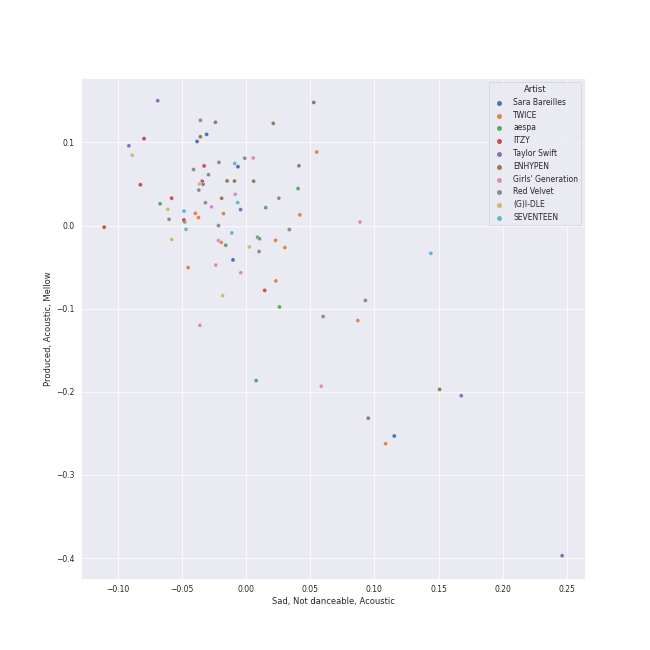
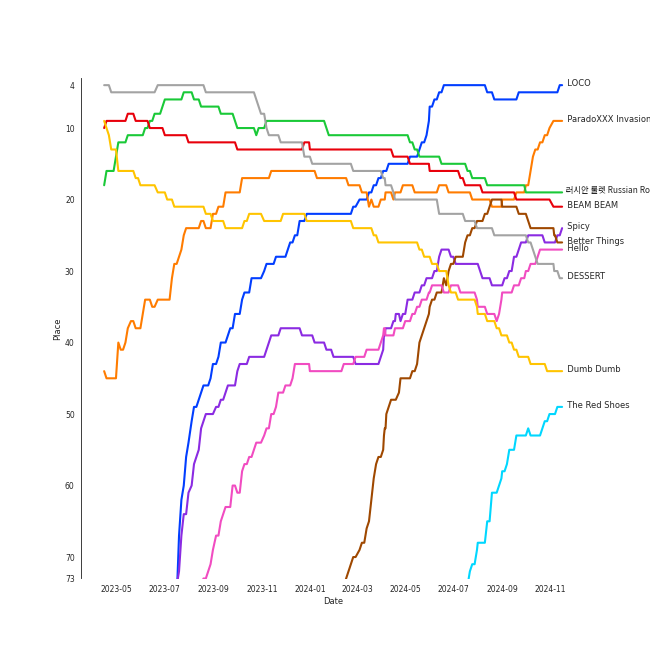
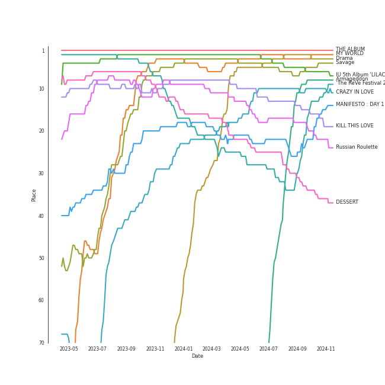
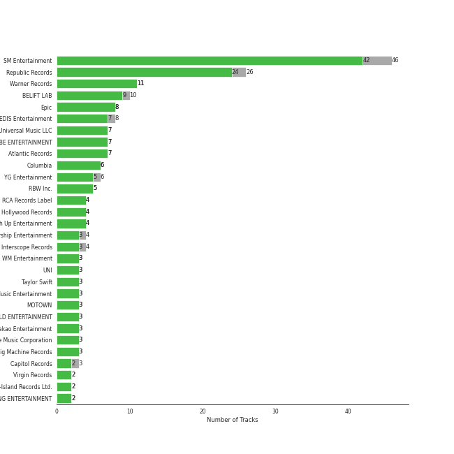
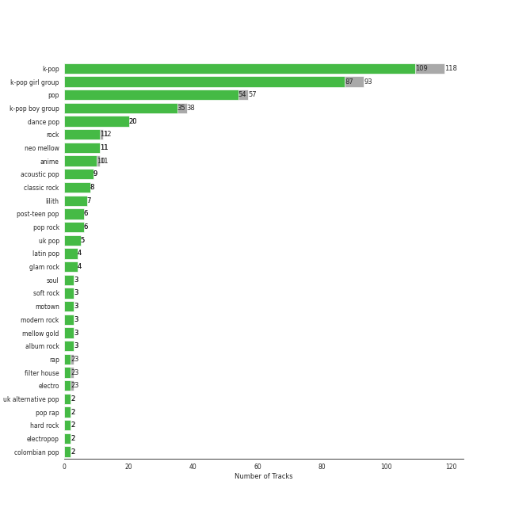
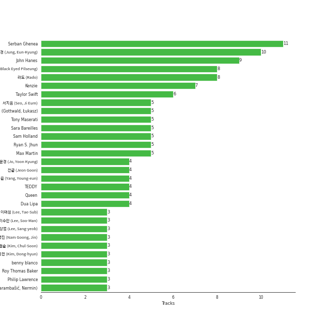
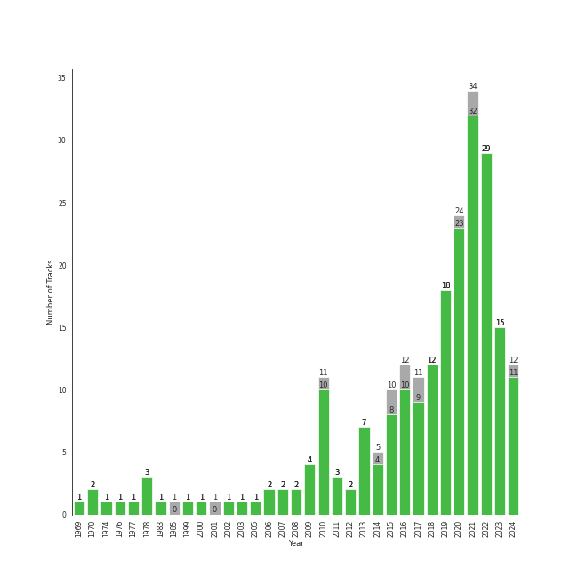

# Summer

[231 tracks (218 liked) 🔗](https://open.spotify.com/playlist/0Xy9zMj8Yow1mGIrqd8nON)

[See Track Features](audio_features.md)

[See Clusters](clusters/overview.md)

## Top Artists

| Art | Rank | Tracks | 💚 | Artist | 🔗 |
|:---|---:|---:|---:|:---|:---|
|  | 2 | 15 | 15 | [Red Velvet](../../artists/red_velvet/overview.md) | [🔗](https://open.spotify.com/artist/1z4g3DjTBBZKhvAroFlhOM) |
|  | 9 | 12 | 12 | [TWICE](../../artists/twice/overview.md) | [🔗](https://open.spotify.com/artist/7n2Ycct7Beij7Dj7meI4X0) |
|  | 7 | 12 | 12 | [ENHYPEN](../../artists/enhypen/overview.md) | [🔗](https://open.spotify.com/artist/5t5FqBwTcgKTaWmfEbwQY9) |
|  | 1 | 8 | 8 | [aespa](../../artists/aespa/overview.md) | [🔗](https://open.spotify.com/artist/6YVMFz59CuY7ngCxTxjpxE) |
|  | 5 | 8 | 7 | [ITZY](../../artists/itzy/overview.md) | [🔗](https://open.spotify.com/artist/2KC9Qb60EaY0kW4eH68vr3) |
|  | 20 | 9 | 6 | [Girls' Generation](../../artists/girls__generation/overview.md) | [🔗](https://open.spotify.com/artist/0Sadg1vgvaPqGTOjxu0N6c) |
|  | 6 | 6 | 6 | [(G)I-DLE](../../artists/(g)i-dle/overview.md) | [🔗](https://open.spotify.com/artist/2AfmfGFbe0A0WsTYm0SDTx) |
|  | 19 | 6 | 6 | [Taylor Swift](../../artists/taylor_swift/overview.md) | [🔗](https://open.spotify.com/artist/06HL4z0CvFAxyc27GXpf02) |
|  | 12 | 6 | 5 | [SEVENTEEN](../../artists/seventeen/overview.md) | [🔗](https://open.spotify.com/artist/7nqOGRxlXj7N2JYbgNEjYH) |
|  | 87 | 5 | 5 | [Dua Lipa](../../artists/dua_lipa/overview.md) | [🔗](https://open.spotify.com/artist/6M2wZ9GZgrQXHCFfjv46we) |

See top 100 artists

| Art | Rank | Tracks | 💚 | Artist | 🔗 |
|:---|---:|---:|---:|:---|:---|
|  | 24 | 5 | 5 | [Sara Bareilles](../../artists/sara_bareilles/overview.md) | [🔗](https://open.spotify.com/artist/2Sqr0DXoaYABbjBo9HaMkM) |
|  | 16 | 5 | 5 | [STAYC](../../artists/stayc/overview.md) | [🔗](https://open.spotify.com/artist/01XYiBYaoMJcNhPokrg0l0) |
|  | 4 | 5 | 4 | [BLACKPINK](../../artists/blackpink/overview.md) | [🔗](https://open.spotify.com/artist/41MozSoPIsD1dJM0CLPjZF) |
|  | 284 | 4 | 4 | [MOMOLAND](../../artists/momoland/overview.md) | [🔗](https://open.spotify.com/artist/5RR0MLwcjc87wjSw2JYdwx) |
|  | 67 | 4 | 4 | [PENTAGON](../../artists/pentagon/overview.md) | [🔗](https://open.spotify.com/artist/1wKpMkucynaTfG8lyPprYV) |
|  | 48 | 4 | 4 | [Queen](../../artists/queen/overview.md) | [🔗](https://open.spotify.com/artist/1dfeR4HaWDbWqFHLkxsg1d) |
|  | 15 | 4 | 4 | [MAMAMOO](../../artists/mamamoo/overview.md) | [🔗](https://open.spotify.com/artist/0XATRDCYuuGhk0oE7C0o5G) |
|  | 10 | 4 | 3 | [Stray Kids](../../artists/stray_kids/overview.md) | [🔗](https://open.spotify.com/artist/2dIgFjalVxs4ThymZ67YCE) |
|  | 368 | 3 | 3 | IZ*ONE | [🔗](https://open.spotify.com/artist/5r1tUTxVSgvBHnoDuDODPH) |
|  | 188 | 3 | 3 | [Doja Cat](../../artists/doja_cat/overview.md) | [🔗](https://open.spotify.com/artist/5cj0lLjcoR7YOSnhnX0Po5) |
|  | 3 | 3 | 3 | [IU](../../artists/iu/overview.md) | [🔗](https://open.spotify.com/artist/3HqSLMAZ3g3d5poNaI7GOU) |
|  | 91 | 3 | 3 | [OH MY GIRL](../../artists/oh_my_girl/overview.md) | [🔗](https://open.spotify.com/artist/2019zR22qK2RBvCqtudBaI) |
|  | 261 | 3 | 2 | [Daft Punk](../../artists/daft_punk/overview.md) | [🔗](https://open.spotify.com/artist/4tZwfgrHOc3mvqYlEYSvVi) |
|  | 68 | 2 | 2 | JEON SOMI | [🔗](https://open.spotify.com/artist/7zYj9S9SdIunYCfSm7vzAR) |
|  | 152 | 2 | 2 | Stevie Wonder | [🔗](https://open.spotify.com/artist/7guDJrEfX3qb6FEbdPA5qi) |
|  | 30 | 2 | 2 | [NCT 127](../../artists/nct_127/overview.md) | [🔗](https://open.spotify.com/artist/7f4ignuCJhLXfZ9giKT7rH) |
|  | 429 | 2 | 2 | Katy Perry | [🔗](https://open.spotify.com/artist/6jJ0s89eD6GaHleKKya26X) |
|  | 26 | 2 | 2 | [JEON SOYEON](../../artists/jeon_soyeon/overview.md) | [🔗](https://open.spotify.com/artist/6Xg22wJOAcnvPUfk5WvODH) |
|  | 73 | 2 | 2 | [BIBI](../../artists/bibi/overview.md) | [🔗](https://open.spotify.com/artist/6UbmqUEgjLA6jAcXwbM1Z9) |
|  | 309 | 2 | 2 | A Fine Frenzy | [🔗](https://open.spotify.com/artist/5dTYaRzOn4rXGBLH052EeQ) |
|  | 429 | 2 | 2 | MIKA | [🔗](https://open.spotify.com/artist/5MmVJVhhYKQ86izuGHzJYA) |
|  | 429 | 2 | 2 | Tyga | [🔗](https://open.spotify.com/artist/5LHRHt1k9lMyONurDHEdrp) |
|  | 377 | 2 | 2 | Jason Mraz | [🔗](https://open.spotify.com/artist/4phGZZrJZRo4ElhRtViYdl) |
|  | 13 | 2 | 2 | [LE SSERAFIM](../../artists/le_sserafim/overview.md) | [🔗](https://open.spotify.com/artist/4SpbR6yFEvexJuaBpgAU5p) |
|  | 23 | 2 | 2 | [EXO](../../artists/exo/overview.md) | [🔗](https://open.spotify.com/artist/3cjEqqelV9zb4BYE3qDQ4O) |
|  | 79 | 2 | 2 | [Florence + The Machine](../../artists/florence_+_the_machine/overview.md) | [🔗](https://open.spotify.com/artist/1moxjboGR7GNWYIMWsRjgG) |
|  | 25 | 2 | 2 | [NCT DREAM](../../artists/nct_dream/overview.md) | [🔗](https://open.spotify.com/artist/1gBUSTR3TyDdTVFIaQnc02) |
|  | 51 | 2 | 2 | JOY | [🔗](https://open.spotify.com/artist/0sYpJ0nCC8AlDrZFeAA7ub) |
|  | 92 | 2 | 2 | [Bruno Mars](../../artists/bruno_mars/overview.md) | [🔗](https://open.spotify.com/artist/0du5cEVh5yTK9QJze8zA0C) |
|  | 157 | 2 | 2 | Shakira | [🔗](https://open.spotify.com/artist/0EmeFodog0BfCgMzAIvKQp) |
|  | 125 | 2 | 2 | [THE BOYZ](../../artists/the_boyz/overview.md) | [🔗](https://open.spotify.com/artist/0CmvFWTX9zmMNCUi6fHtAx) |
|  | 283 | 2 | 2 | [Jason Derulo](../../artists/jason_derulo/overview.md) | [🔗](https://open.spotify.com/artist/07YZf4WDAMNwqr4jfgOZ8y) |
|  | 8 | 2 | 1 | [TAEYEON](../../artists/taeyeon/overview.md) | [🔗](https://open.spotify.com/artist/3qNVuliS40BLgXGxhdBdqu) |
|  | 269 | 2 | 1 | SISTAR | [🔗](https://open.spotify.com/artist/2wTLheTmMcFCA4hdY8hZJP) |
|  | 429 | 2 | 1 | Nicki Minaj | [🔗](https://open.spotify.com/artist/0hCNtLu0JehylgoiP8L4Gh) |
|  | 201 | 1 | 1 | SZA | [🔗](https://open.spotify.com/artist/7tYKF4w9nC0nq9CsPZTHyP) |
|  | 429 | 1 | 1 | Snoop Dogg | [🔗](https://open.spotify.com/artist/7hJcb9fa4alzcOq3EaNPoG) |
|  | 429 | 1 | 1 | Jonas Brothers | [🔗](https://open.spotify.com/artist/7gOdHgIoIKoe4i9Tta6qdD) |
|  | 11 | 1 | 1 | [LeeHi](../../artists/leehi/overview.md) | [🔗](https://open.spotify.com/artist/7cVZApDoQZpS447nHTsNqu) |
|  | 429 | 1 | 1 | Wyclef Jean | [🔗](https://open.spotify.com/artist/7aBzpmFXB4WWpPl2F7RjBe) |
|  | 429 | 1 | 1 | Freshlyground | [🔗](https://open.spotify.com/artist/7AcV1lk8Zrgo1691PDWEle) |
| | 429 | 1 | 1 | CHUNG HA | [🔗](https://open.spotify.com/artist/73tdwqQJWnBdf1jyUeMwyu) |
|  | 429 | 1 | 1 | Weeekly | [🔗](https://open.spotify.com/artist/73B9bjqS2Z5KLXNGqXf64m) |
|  | 429 | 1 | 1 | [Simon & Garfunkel](../../artists/simon___garfunkel/overview.md) | [🔗](https://open.spotify.com/artist/70cRZdQywnSFp9pnc2WTCE) |
|  | 52 | 1 | 1 | [Billy Joel](../../artists/billy_joel/overview.md) | [🔗](https://open.spotify.com/artist/6zFYqv1mOsgBRQbae3JJ9e) |
|  | 132 | 1 | 1 | [Beyoncé](../../artists/beyoncé/overview.md) | [🔗](https://open.spotify.com/artist/6vWDO969PvNqNYHIOW5v0m) |
|  | 109 | 1 | 1 | KAI | [🔗](https://open.spotify.com/artist/6iVo62B0bdTknRcrktCmak) |
|  | 252 | 1 | 1 | [WJSN](../../artists/wjsn/overview.md) | [🔗](https://open.spotify.com/artist/6hhqsQZhtp9hfaZhSd0VSD) |
|  | 376 | 1 | 1 | Colbie Caillat | [🔗](https://open.spotify.com/artist/6aZyMrc4doVtZyKNilOmwu) |
|  | 429 | 1 | 1 | DARA | [🔗](https://open.spotify.com/artist/6WRl7KUrzOq7GpY97KrYxi) |
|  | 429 | 1 | 1 | Ally Brooke | [🔗](https://open.spotify.com/artist/6TXM1kV4L8DsDAkAfbOPYk) |
|  | 17 | 1 | 1 | [IVE](../../artists/ive/overview.md) | [🔗](https://open.spotify.com/artist/6RHTUrRF63xao58xh9FXYJ) |
|  | 70 | 1 | 1 | [AKMU](../../artists/akmu/overview.md) | [🔗](https://open.spotify.com/artist/6OwKE9Ez6ALxpTaKcT5ayv) |
|  | 429 | 1 | 1 | [Clean Bandit](../../artists/clean_bandit/overview.md) | [🔗](https://open.spotify.com/artist/6MDME20pz9RveH9rEXvrOM) |
|  | 429 | 1 | 1 | Kesha | [🔗](https://open.spotify.com/artist/6LqNN22kT3074XbTVUrhzX) |
|  | 429 | 1 | 1 | Foreigner | [🔗](https://open.spotify.com/artist/6IRouO5mvvfcyxtPDKMYFN) |
|  | 21 | 1 | 1 | [NewJeans](../../artists/newjeans/overview.md) | [🔗](https://open.spotify.com/artist/6HvZYsbFfjnjFrWF950C9d) |
|  | 429 | 1 | 1 | *NSYNC | [🔗](https://open.spotify.com/artist/6Ff53KvcvAj5U7Z1vojB5o) |
|  | 337 | 1 | 1 | [The Who](../../artists/the_who/overview.md) | [🔗](https://open.spotify.com/artist/67ea9eGLXYMsO2eYQRui3w) |
|  | 429 | 1 | 1 | CeeLo Green | [🔗](https://open.spotify.com/artist/5nLYd9ST4Cnwy6NHaCxbj8) |
|  | 65 | 1 | 1 | [Solar](../../artists/solar/overview.md) | [🔗](https://open.spotify.com/artist/5cYcI546S8Lf97m4mNdYLD) |
|  | 409 | 1 | 1 | AOA | [🔗](https://open.spotify.com/artist/54gWVQFHf8IIqbjxAoOarN) |
|  | 429 | 1 | 1 | Young Thug | [🔗](https://open.spotify.com/artist/50co4Is1HCEo8bhOyUWKpn) |
|  | 93 | 1 | 1 | WayV-TEN&YANGYANG | [🔗](https://open.spotify.com/artist/4wOAdZOMOVSwrZQxDYrUx3) |
|  | 270 | 1 | 1 | DaBaby | [🔗](https://open.spotify.com/artist/4r63FhuTkUYltbVAg5TQnk) |
|  | 259 | 1 | 1 | [Camila Cabello](../../artists/camila_cabello/overview.md) | [🔗](https://open.spotify.com/artist/4nDoRrQiYLoBzwC5BhVJzF) |
|  | 429 | 1 | 1 | Cardi B | [🔗](https://open.spotify.com/artist/4kYSro6naA4h99UJvo89HB) |
|  | 134 | 1 | 1 | EPEX | [🔗](https://open.spotify.com/artist/4e2umhzNHTSeQnSCWPN0uT) |
|  | 248 | 1 | 1 | Lee Mujin | [🔗](https://open.spotify.com/artist/4Xj0peBt3EZHbdF20JmdWC) |
|  | 429 | 1 | 1 | Daddy Yankee | [🔗](https://open.spotify.com/artist/4VMYDCV2IEDYJArk749S6m) |
|  | 429 | 1 | 1 | Luis Fonsi | [🔗](https://open.spotify.com/artist/4V8Sr092TqfHkfAA5fXXqG) |
|  | 39 | 1 | 1 | [KISS OF LIFE](../../artists/kiss_of_life/overview.md) | [🔗](https://open.spotify.com/artist/4TEK9tIkcoxib4GxT3O4ky) |
|  | 429 | 1 | 1 | Jess Glynne | [🔗](https://open.spotify.com/artist/4ScCswdRlyA23odg9thgIO) |
|  | 239 | 1 | 1 | FIFTY FIFTY | [🔗](https://open.spotify.com/artist/4GJ6xDCF5jaUqD6avOuQT6) |
|  | 429 | 1 | 1 | Fitz and The Tantrums | [🔗](https://open.spotify.com/artist/4AcHt3JxKy59IX7JNNlZn4) |
|  | 161 | 1 | 1 | [YENA](../../artists/yena/overview.md) | [🔗](https://open.spotify.com/artist/49muoiIu4uea4PO8vueUNN) |
|  | 429 | 1 | 1 | Lou Bega | [🔗](https://open.spotify.com/artist/46lnlnlU0dXTDpoAUmH6Qx) |
|  | 99 | 1 | 1 | Nile Rodgers | [🔗](https://open.spotify.com/artist/3yDIp0kaq9EFKe07X1X2rz) |
|  | 147 | 1 | 1 | Sammy Rae & The Friends | [🔗](https://open.spotify.com/artist/3lFDsTyYNPQc8WzJExnQWn) |
|  | 56 | 1 | 1 | Loopy | [🔗](https://open.spotify.com/artist/3l9s67pOK4Stw9yW1wr0Bg) |
|  | 429 | 1 | 1 | Mark Ronson | [🔗](https://open.spotify.com/artist/3hv9jJF3adDNsBSIQDqcjp) |
|  | 285 | 1 | 1 | KATSEYE | [🔗](https://open.spotify.com/artist/3c0gDdb9lhnHGFtP4prQpn) |
|  | 57 | 1 | 1 | HYO | [🔗](https://open.spotify.com/artist/3U7bOaJLuFkrmDQ1C1OqKl) |
|  | 36 | 1 | 1 | [TEN](../../artists/ten/overview.md) | [🔗](https://open.spotify.com/artist/3Q5Qep7ytrjVleNnMnntgQ) |
|  | 76 | 1 | 1 | [TREASURE](../../artists/treasure/overview.md) | [🔗](https://open.spotify.com/artist/3KonOYiLsU53m4yT7gNotP) |
|  | 114 | 1 | 1 | [P1Harmony](../../artists/p1harmony/overview.md) | [🔗](https://open.spotify.com/artist/3JjvsPeGMbDJqsphe2z8xU) |
|  | 154 | 1 | 1 | BLITZERS | [🔗](https://open.spotify.com/artist/3Exoh42YMeqnUvYahAGgUE) |
|  | 370 | 1 | 1 | pH-1 | [🔗](https://open.spotify.com/artist/2u7CP5T30c8ctenzXgEV1W) |
|  | 116 | 1 | 1 | YOUHA | [🔗](https://open.spotify.com/artist/2lZFlNiQMLa2fuX3pkXcan) |
|  | 179 | 1 | 1 | The Jackson 5 | [🔗](https://open.spotify.com/artist/2iE18Oxc8YSumAU232n4rW) |

## Top Tracks

Most and least listened tracks

| Rank | ​ | Most listened tracks | Rank | ​​ | Least listened tracks |
|---:|:---|:---|---:|:---|:---|
| 5 |  | [LOCO](../../artists/itzy/overview.md) | 971 |  | Low Key (feat. Tyga) |
| 18 |  | [러시안 룰렛 Russian Roulette](../../artists/red_velvet/overview.md) | 971 |  | Cold as Ice |
| 19 |  | [ParadoXXX Invasion](../../artists/enhypen/overview.md) | 971 |  | [Shine](../../artists/pentagon/overview.md) |
| 20 |  | [BEAM BEAM](../../artists/jeon_soyeon/overview.md) | 971 |  | [CHEER UP](../../artists/twice/overview.md) |
| 23 |  | [Better Things](../../artists/aespa/overview.md) | 971 |  | [Kiss and Make Up](../../artists/dua_lipa/overview.md) |
| 25 |  | DESSERT | 971 |  | [Don't Stop Me Now - Remastered 2011](../../artists/queen/overview.md) |
| 28 |  | [Spicy](../../artists/aespa/overview.md) | 971 |  | Grace Kelly |
| 32 |  | Hello | 971 |  | [Hit That Drum](../../artists/red_velvet/overview.md) |
| 40 |  | [Dumb Dumb](../../artists/red_velvet/overview.md) | 971 |  | 青春修炼手册 |
| 50 |  | Fighting (Feat. Lee Young Ji) | 971 |  | [Somebody To Love](../../artists/queen/overview.md) |

## Top Albums

| Art | Rank | Tracks | 💚 | Album | Release Date | 🔗 |
|:---|---:|---:|---:|:---|:---|:---|
|  | 117 | 4 | 4 | DIMENSION : DILEMMA | 2021-10-12 | [🔗](https://open.spotify.com/album/5jGRqioNCSWZGBl3QmyuFI) |
|  | 42 | 3 | 3 | The Red - The 1st Album | 2015-09-09 | [🔗](https://open.spotify.com/album/6YL9J0E6PGtYzkhyMxnmXd) |
|  | 20 | 3 | 3 | Russian Roulette - The 3rd Mini Album | 2016-09-07 | [🔗](https://open.spotify.com/album/6MNlcai3skKLKv5syzFwC3) |
|  | 149 | 3 | 3 | ROMANCE : UNTOLD | 2024-07-12 | [🔗](https://open.spotify.com/album/05I8FltCMnGa3kE38mpOkL) |
|  | 21 | 3 | 3 | MANIFESTO : DAY 1 | 2022-07-04 | [🔗](https://open.spotify.com/album/5J8MNLLViH5zqM6VoGErz8) |
|  | 190 | 3 | 3 | Kaleidoscope Heart | 2010-09-07 | [🔗](https://open.spotify.com/album/627ukPRwYxyBREHxBq0vGJ) |
|  | 642 | 3 | 3 | Future Nostalgia | 2020-03-27 | [🔗](https://open.spotify.com/album/5lKlFlReHOLShQKyRv6AL9) |
|  | 11 | 3 | 3 | Armageddon - The 1st Album | 2024-05-27 | [🔗](https://open.spotify.com/album/058hCti9Bupb5CJc6bd3VB) |
|  | 9 | 3 | 2 | CRAZY IN LOVE | 2021-09-24 | [🔗](https://open.spotify.com/album/4U7rGOkJgtxs27H9L93Xli) |
|  | 127 | 2 | 2 | ‘The ReVe Festival’ Day 1 | 2019-06-19 | [🔗](https://open.spotify.com/album/2nLEiP268mSFZHW5dajM4R) |

See top 100 albums

| Art | Rank | Tracks | 💚 | Album | Release Date | 🔗 |
|:---|---:|---:|---:|:---|:---|:---|
|  | 584 | 2 | 2 | folklore | 2020-07-24 | [🔗](https://open.spotify.com/album/2fenSS68JI1h4Fo296JfGr) |
|  | 551 | 2 | 2 | We Sing. We Dance. We Steal Things. | 2008-05-12 | [🔗](https://open.spotify.com/album/04G0YylSjvDQZrjOfE5jA5) |
|  | 262 | 2 | 2 | The Blessed Unrest | 2013-07-16 | [🔗](https://open.spotify.com/album/7lpbyGc4fHsQkBTsfWVBhp) |
|  | 642 | 2 | 2 | Teenage Dream | 2010-01-01 | [🔗](https://open.spotify.com/album/3BoUxfC7YhxNq3TpOfnRif) |
|  | 132 | 2 | 2 | Summer Nights | 2018-07-09 | [🔗](https://open.spotify.com/album/2GKTroaa4ysyhEdvzpvUoM) |
|  | 642 | 2 | 2 | Summer Magic - Summer Mini Album | 2018-08-06 | [🔗](https://open.spotify.com/album/5zWa1ZEUBctbKqvwXbFawo) |
|  | 565 | 2 | 2 | SEVENTEEN 4th Album 'Face the Sun' | 2022-05-27 | [🔗](https://open.spotify.com/album/4lfFgz2rD1irxf7dZhNJht) |
|  | 325 | 2 | 2 | Random Access Memories | 2013-05-20 | [🔗](https://open.spotify.com/album/4m2880jivSbbyEGAKfITCa) |
|  | 642 | 2 | 2 | One-reeler / Act IV | 2020-12-07 | [🔗](https://open.spotify.com/album/3gfl9D7cMW3K87YiMbqsWK) |
|  | 247 | 2 | 2 | Not Shy | 2020-08-17 | [🔗](https://open.spotify.com/album/5NN55LKbjzX16a7Uf8u7Os) |
|  | 642 | 2 | 2 | Life in Cartoon Motion | 2007-02-05 | [🔗](https://open.spotify.com/album/4wKkXYJXQWDa9sndBSx0gI) |
|  | 560 | 2 | 2 | Jazz (Deluxe Remastered Version) | 1978-11-10 | [🔗](https://open.spotify.com/album/21HMAUrbbYSj9NiPPlGumy) |
|  | 134 | 2 | 2 | IN LIFE | 2020-09-14 | [🔗](https://open.spotify.com/album/0aERWcI2KYSCM4biUihB9X) |
|  | 92 | 2 | 2 | I feel | 2023-05-15 | [🔗](https://open.spotify.com/album/3PQZnr5gf699uYEaGH93uG) |
|  | 38 | 2 | 2 | Hello - Special Album | 2021-05-31 | [🔗](https://open.spotify.com/album/37mRfTDwQzVbHihypYY8oE) |
|  | 642 | 2 | 2 | Dua Lipa (Complete Edition) | 2018-10-19 | [🔗](https://open.spotify.com/album/0obMz8EHnr3dg6NCUK4xWp) |
|  | 403 | 2 | 2 | Bomb In A Birdcage | 2009-01-01 | [🔗](https://open.spotify.com/album/07IV5RxLvAUeZbcPm4zOzn) |
|  | 642 | 2 | 1 | Why - The 2nd Mini Album | 2016-06-28 | [🔗](https://open.spotify.com/album/1ukBQWhQwWKqTGgs0YzRzU) |
|  | 1 | 2 | 1 | THE ALBUM | 2020-10-02 | [🔗](https://open.spotify.com/album/71O60S5gIJSIAhdnrDIh3N) |
|  | 642 | 2 | 1 | Oh! - The Second Album | 2010-01-28 | [🔗](https://open.spotify.com/album/4e841RxorIoZIufX8v7p7E) |
|  | 85 | 2 | 1 | Lion Heart - The 5th Album | 2015-08-19 | [🔗](https://open.spotify.com/album/4eKdn0skJCidO2wqIJyCgB) |
|  | 642 | 1 | 1 | 容 : FACE | 2022-03-16 | [🔗](https://open.spotify.com/album/6eSFX12WIqUtmGsD8UO3FT) |
|  | 642 | 1 | 1 | ‘The ReVe Festival’ Day 2 | 2019-08-20 | [🔗](https://open.spotify.com/album/3DXz6ItR9DzIw9S0h3Cxfc) |
|  | 81 | 1 | 1 | ‘The ReVe Festival 2022 - Feel My Rhythm’ | 2022-03-21 | [🔗](https://open.spotify.com/album/3HgoCO9wWuPcNhz8Ip4C46) |
|  | 17 | 1 | 1 | ‘The ReVe Festival 2022 - Birthday’ | 2022-11-28 | [🔗](https://open.spotify.com/album/58OR7UoaJkJzqeQGClHzh1) |
|  | 436 | 1 | 1 | ˣ‿ˣ (SMiLEY) | 2022-01-17 | [🔗](https://open.spotify.com/album/7qldKtsOWklzmwgll5NjCw) |
|  | 323 | 1 | 1 | reputation | 2017-11-10 | [🔗](https://open.spotify.com/album/6DEjYFkNZh67HP7R9PSZvv) |
|  | 109 | 1 | 1 | expérgo | 2023-03-20 | [🔗](https://open.spotify.com/album/6GbCvETnCVvkpvK6qCqTYS) |
|  | 398 | 1 | 1 | abouTZU | 2024-09-06 | [🔗](https://open.spotify.com/album/0Xj4fXPKV0h6KhGQbUkDvy) |
|  | 642 | 1 | 1 | Yummy Yummy Love | 2022-01-14 | [🔗](https://open.spotify.com/album/2r35RHvEtBjgKiONdItRR5) |
|  | 642 | 1 | 1 | YES or YES | 2018-11-05 | [🔗](https://open.spotify.com/album/25VunQEW0x2W6ALND2Mh4g) |
|  | 642 | 1 | 1 | XOXO | 2021-10-29 | [🔗](https://open.spotify.com/album/63pvOn2B5pUUcUKUwIEg9m) |
|  | 22 | 1 | 1 | Windy | 2021-07-05 | [🔗](https://open.spotify.com/album/1lv92CIVZbB2BsHmIx7qJf) |
|  | 446 | 1 | 1 | Who Are You | 1978-08-18 | [🔗](https://open.spotify.com/album/7at3CV9Y9P57wsEXkfU0q8) |
|  | 372 | 1 | 1 | White Wind | 2019-03-14 | [🔗](https://open.spotify.com/album/60m09rutmwj5ewOJoFIAVY) |
|  | 642 | 1 | 1 | Waka Waka (This Time for Africa) [The Official 2010 FIFA World Cup (TM) Song] (feat. Freshlyground) | 2010-05-07 | [🔗](https://open.spotify.com/album/3pzQF7YgU1f66pBayA8uHv) |
|  | 143 | 1 | 1 | WE:TH | 2020-10-12 | [🔗](https://open.spotify.com/album/1ASYbBYBwV6Rcfc2ycqmlK) |
|  | 642 | 1 | 1 | WE NEED LOVE | 2022-07-19 | [🔗](https://open.spotify.com/album/04EniWu488MF6louRYafKJ) |
|  | 642 | 1 | 1 | WAP (feat. Megan Thee Stallion) | 2020-08-07 | [🔗](https://open.spotify.com/album/2ogiazbrNEx0kQHGl5ZBTQ) |
|  | 642 | 1 | 1 | VIDA | 2019-02-01 | [🔗](https://open.spotify.com/album/5C0YLr4OoRGFDaqdMQmkeH) |
|  | 642 | 1 | 1 | Uptown Special | 2015-01-12 | [🔗](https://open.spotify.com/album/3vLaOYCNCzngDf8QdBg2V1) |
|  | 642 | 1 | 1 | UNNATURAL | 2021-03-31 | [🔗](https://open.spotify.com/album/0uD1Chx5ZsnZM4kS8yK0S8) |
|  | 113 | 1 | 1 | UNFORGIVEN | 2023-05-01 | [🔗](https://open.spotify.com/album/4Oz7K9DRwwGMN49i4NbVDT) |
|  | 625 | 1 | 1 | Twicetagram | 2017-10-30 | [🔗](https://open.spotify.com/album/3hJXmK5gWN9P6jtZL0Lr2y) |
|  | 305 | 1 | 1 | Traffic light | 2021-05-14 | [🔗](https://open.spotify.com/album/4lHGpxL8peLQSZRgl1Lssm) |
|  | 355 | 1 | 1 | Touch | 2024-07-26 | [🔗](https://open.spotify.com/album/1hjqg3TuQ2YqooaPhxHwdv) |
|  | 433 | 1 | 1 | The Story Begins | 2015-10-20 | [🔗](https://open.spotify.com/album/72WWZVAx6GtSbEeGESwDLo) |
|  | 430 | 1 | 1 | The Red Summer - Summer Mini Album | 2017-07-09 | [🔗](https://open.spotify.com/album/6OXg149IkmbgW7zfzbwgS2) |
|  | 642 | 1 | 1 | The Lady Killer | 2010-11-09 | [🔗](https://open.spotify.com/album/3MXU6UoWrf4w4bOvjZTlvY) |
|  | 231 | 1 | 1 | The Good Life | 2018-07-10 | [🔗](https://open.spotify.com/album/4s1igjt5YJe7s7BdCeX3DX) |
|  | 531 | 1 | 1 | The Definitive Collection | 2002-10-29 | [🔗](https://open.spotify.com/album/4E1itnJOhTMRSATNaxh0Sq) |
|  | 58 | 1 | 1 | The Boys - The 3rd Album | 2011-10-19 | [🔗](https://open.spotify.com/album/4vGkZl9P0sKxupLdJE7ndS) |
|  | 291 | 1 | 1 | The Beginning: Cupid | 2023-02-24 | [🔗](https://open.spotify.com/album/5letLUZIFsQikJYShfGNs4) |
|  | 642 | 1 | 1 | Tattoos (Deluxe Edition) | 2013-09-10 | [🔗](https://open.spotify.com/album/3wDeTllVvayYsWTHsFNWZQ) |
|  | 312 | 1 | 1 | Taste of Love | 2021-06-11 | [🔗](https://open.spotify.com/album/00vb6sViDbJLmLLchfbRh4) |
|  | 642 | 1 | 1 | Talk Dirty | 2013-09-10 | [🔗](https://open.spotify.com/album/4PeZu0It7qVrTG40t3HM9A) |
|  | 141 | 1 | 1 | TRAVEL | 2020-11-03 | [🔗](https://open.spotify.com/album/3xje7wSW2xwQx2GNJ5cfNu) |
|  | 642 | 1 | 1 | TOUCH N MOVE | 2014-07-21 | [🔗](https://open.spotify.com/album/0SeSM1CAqu7QUkive4jCKl) |
|  | 122 | 1 | 1 | THE WAR - The 4th Album | 2017-07-18 | [🔗](https://open.spotify.com/album/53pJcIJBdlm5rhVhjSnvHn) |
|  | 118 | 1 | 1 | THE SECOND STEP : CHAPTER TWO | 2022-10-04 | [🔗](https://open.spotify.com/album/4l5YvRcmno5RMKZCZp1j0g) |
|  | 642 | 1 | 1 | THE FIFTH SEASON | 2019-05-08 | [🔗](https://open.spotify.com/album/7nRRZFQgQKQsXG7mQIuQPA) |
|  | 552 | 1 | 1 | THE BOYZ 6TH MINI ALBUM [THRILL-ING] | 2021-08-09 | [🔗](https://open.spotify.com/album/0lh0pZ8GjZGrAhzIG4Jn0E) |
|  | 263 | 1 | 1 | THE BOYZ 2ND ALBUM [PHANTASY] Pt.1 Christmas In August | 2023-08-07 | [🔗](https://open.spotify.com/album/6j0bF8s6Kptbr4y8tuIhOY) |
|  | 72 | 1 | 1 | TEENFRESH | 2023-08-16 | [🔗](https://open.spotify.com/album/4P5wnRQTBnnjNbjt7A6S6x) |
|  | 192 | 1 | 1 | Sticky | 2024-07-01 | [🔗](https://open.spotify.com/album/3p68B7ZhETVmNbOov8JcF5) |
|  | 642 | 1 | 1 | Stadium Arcadium | 2006-05-09 | [🔗](https://open.spotify.com/album/7xl50xr9NDkd3i2kBbzsNZ) |
|  | 642 | 1 | 1 | Signed, Sealed And Delivered | 1970-08-07 | [🔗](https://open.spotify.com/album/54ootLtDyMZFr9obtWQvvO) |
|  | 642 | 1 | 1 | Show Me | 2019-03-20 | [🔗](https://open.spotify.com/album/2olU5yGGjXxgOt9GrFEtLo) |
|  | 642 | 1 | 1 | Sheer Heart Attack | 1974-11-08 | [🔗](https://open.spotify.com/album/4yO8TpSaJtUKkkjmsA4VXf) |
|  | 5 | 1 | 1 | Savage - The 1st Mini Album | 2021-10-05 | [🔗](https://open.spotify.com/album/3vyyDkvYWC36DwgZCYd3Wu) |
|  | 470 | 1 | 1 | STEREOTYPE | 2021-09-06 | [🔗](https://open.spotify.com/album/7HGjNJBj1NQGNwCzFD2LHj) |
|  | 642 | 1 | 1 | STAYDOM | 2021-04-08 | [🔗](https://open.spotify.com/album/71hjsg660uio3Z8bnbB6fS) |
|  | 384 | 1 | 1 | SPRING | 2016-05-04 | [🔗](https://open.spotify.com/album/0HtbFp1B1WrbUr9mcBrAhN) |
|  | 642 | 1 | 1 | SEVENTEEN 9th Mini Album 'Attacca' | 2021-10-22 | [🔗](https://open.spotify.com/album/2PIReru2w5i4JXOzeZnamd) |
|  | 172 | 1 | 1 | SEVENTEEN 1ST ALBUM [FIRST ‘LOVE&LETTER’] | 2016-04-25 | [🔗](https://open.spotify.com/album/50BrkBakrLWufmTLjCVBwn) |
|  | 210 | 1 | 1 | Rover - The 3rd Mini Album | 2023-03-13 | [🔗](https://open.spotify.com/album/5gzd4IZ9KTwW6Hhgll1K7U) |
|  | 606 | 1 | 1 | Red | 2012-10-22 | [🔗](https://open.spotify.com/album/1EoDsNmgTLtmwe1BDAVxV5) |
|  | 642 | 1 | 1 | Positive | 2018-04-02 | [🔗](https://open.spotify.com/album/1ZRmLzZWvOkSqWePzFeekO) |
|  | 642 | 1 | 1 | Play Game : Holiday | 2021-08-04 | [🔗](https://open.spotify.com/album/1FDlvA1PdZujiEhbXihIPJ) |
|  | 642 | 1 | 1 | Pink Friday | 2010-01-01 | [🔗](https://open.spotify.com/album/5jem47f4IRH6UaxNAWO6vD) |
|  | 62 | 1 | 1 | Palette | 2017-04-21 | [🔗](https://open.spotify.com/album/5V8n6fqyAPxvFTibPhQVcp) |
|  | 207 | 1 | 1 | Paint Me Naked - SM STATION | 2021-08-10 | [🔗](https://open.spotify.com/album/4oj5R0SVazc5Eq3WnIC0e6) |
|  | 642 | 1 | 1 | Page Two | 2016-04-25 | [🔗](https://open.spotify.com/album/6q2oUEqL9uzVXHCeKoA8JV) |
|  | 120 | 1 | 1 | POPPY (Japanese Ver.) | 2022-11-16 | [🔗](https://open.spotify.com/album/2nei1QXcpDotdoMz3IQxr4) |
|  | 642 | 1 | 1 | Oral Fixation, Vol. 2 (Expanded Edition) | 2005-11-28 | [🔗](https://open.spotify.com/album/5ppnlEoj4HdRRdRihnY3jU) |
|  | 281 | 1 | 1 | One and Only | 2023-07-11 | [🔗](https://open.spotify.com/album/5LGe47qZJTNwtM8gUfT7Mx) |
|  | 642 | 1 | 1 | No Strings Attached | 2000-03-21 | [🔗](https://open.spotify.com/album/20RMokVwJ2wjQ0s8FOdOFC) |
|  | 106 | 1 | 1 | NewJeans 1st EP 'New Jeans' | 2022-08-01 | [🔗](https://open.spotify.com/album/1HMLpmZAnNyl9pxvOnTovV) |
|  | 642 | 1 | 1 | New Eyes | 2014-06-02 | [🔗](https://open.spotify.com/album/4a6DxkhmMvvEdPXxm4ergN) |
|  | 139 | 1 | 1 | NONSTOP | 2020-04-27 | [🔗](https://open.spotify.com/album/7J8Kp48L7RdLkpjSVrO5PY) |

## Top Record Labels

| Tracks | 💚 | Label |
|---:|---:|:---|
| 45 | 41 | [SM Entertainment](../../labels/sm_entertainment/overview.md) |
| 26 | 24 | [Republic Records](../../labels/republic_records/overview.md) |
| 11 | 11 | [Warner Records](../../labels/warner_records/overview.md) |
| 11 | 11 | [BELIFT LAB](../../labels/belift_lab/overview.md) |
| 8 | 8 | [Epic](../../labels/epic/overview.md) |
| 7 | 7 | [Universal Music LLC](../../labels/universal_music_llc/overview.md) |
| 7 | 7 | [CUBE ENTERTAINMENT](../../labels/cube_entertainment/overview.md) |
| 7 | 7 | [Atlantic Records](../../labels/atlantic_records/overview.md) |
| 7 | 6 | [PLEDIS Entertainment](../../labels/pledis_entertainment/overview.md) |
| 6 | 6 | [Columbia](../../labels/columbia/overview.md) |

See all 85 labels

| Tracks | 💚 | Label |
|---:|---:|:---|
| 6 | 5 | [YG Entertainment](../../labels/yg_entertainment/overview.md) |
| 5 | 5 | [RBW Inc.](../../labels/rbw_inc_/overview.md) |
| 4 | 4 | [RCA Records Label](../../labels/rca_records_label/overview.md) |
| 4 | 4 | [Hollywood Records](../../labels/hollywood_records/overview.md) |
| 4 | 4 | [High Up Entertainment](../../labels/high_up_entertainment/overview.md) |
| 4 | 3 | [Starship Entertainment](../../labels/starship_entertainment/overview.md) |
| 4 | 3 | [Interscope Records](../../labels/interscope_records/overview.md) |
| 3 | 3 | [WM Entertainment](../../labels/wm_entertainment/overview.md) |
| 3 | 3 | [UNI](../../labels/uni/overview.md) |
| 3 | 3 | [Taylor Swift](../../labels/taylor_swift/overview.md) |
| 3 | 3 | [Stone Music Entertainment](../../labels/stone_music_entertainment/overview.md) |
| 3 | 3 | [MOTOWN](../../labels/motown/overview.md) |
| 3 | 3 | MLD ENTERTAINMENT |
| 3 | 3 | [Kakao Entertainment](../../labels/kakao_entertainment/overview.md) |
| 3 | 3 | [Genie Music Corporation](../../labels/genie_music_corporation/overview.md) |
| 3 | 3 | [Big Machine Records](../../labels/big_machine_records/overview.md) |
| 3 | 2 | [Capitol Records](../../labels/capitol_records/overview.md) |
| 2 | 2 | [Virgin Records](../../labels/virgin_records/overview.md) |
| 2 | 2 | [Universal-Island Records Ltd.](../../labels/universal-island_records_ltd_/overview.md) |
| 2 | 2 | SWING ENTERTAINMENT |
| 2 | 2 | [SOURCE MUSIC](../../labels/source_music/overview.md) |
| 2 | 2 | OFF THE RECORD Entertainment |
| 2 | 2 | [MNH ENTERTAINMENT](../../labels/mnh_entertainment/overview.md) |
| 2 | 2 | Kemosabe Records |
| 2 | 2 | Island UK |
| 2 | 2 | [Geffen](../../labels/geffen/overview.md) |
| 2 | 2 | [FNC ENTERTAINMENT](../../labels/fnc_entertainment/overview.md) |
| 2 | 2 | Casablanca Records |
| 2 | 2 | Beluga Heights |
| 2 | 2 | ATG |
| 2 | 1 | Nicki Minaj |
| 2 | 1 | Cash Money |
| 1 | 1 | 우조엔터테인먼트 |
| 1 | 1 | [WM Korea](../../labels/wm_korea/overview.md) |
| 1 | 1 | Vorsicht Musik |
| 1 | 1 | Virginia Records |
| 1 | 1 | Universal Republic Records |
| 1 | 1 | UMLE - Latino |
| 1 | 1 | THEBLACKLABEL |
| 1 | 1 | THE BLACK LABEL |
| 1 | 1 | [Syco Music](../../labels/syco_music/overview.md) |
| 1 | 1 | [Sony Music Labels Inc.](../../labels/sony_music_labels_inc_/overview.md) |
| 1 | 1 | Silent Records |
| 1 | 1 | ShowPLAY ENTERTAINMENT |
| 1 | 1 | [S2 ENTERTAINMENT INC.](../../labels/s2_entertainment_inc_/overview.md) |
| 1 | 1 | Rhino Atlantic |
| 1 | 1 | Republic Records – TZUYU (TWICE) |
| 1 | 1 | Republic Records – NAYEON (TWICE) |
| 1 | 1 | Radiculture |
| 1 | 1 | [Parkwood Entertainment](../../labels/parkwood_entertainment/overview.md) |
| 1 | 1 | PLAY M ENTERTAINMENT CORP. |
| 1 | 1 | [Nettwerk Music Group](../../labels/nettwerk_music_group/overview.md) |
| 1 | 1 | Latium |
| 1 | 1 | LABEL V |
| 1 | 1 | Kakao M Corp. |
| 1 | 1 | KSR |
| 1 | 1 | Jonas Brothers Recording |
| 1 | 1 | [Jive](../../labels/jive/overview.md) |
| 1 | 1 | IST Entertainment |
| 1 | 1 | HYBE |
| 1 | 1 | Fave Entertainment |
| 1 | 1 | Epidemic Sound |
| 1 | 1 | Elektra (NEK) |
| 1 | 1 | Elektra |
| 1 | 1 | [EDAM Entertainment](../../labels/edam_entertainment/overview.md) |
| 1 | 1 | DUBLEKICK COMPANY |
| 1 | 1 | Cre.ker Entertainment |
| 1 | 1 | CJ E&M MUSIC |
| 1 | 1 | C9 Entertainment |
| 1 | 1 | Big Beat Records |
| 1 | 1 | [ADOR](../../labels/ador/overview.md) |
| 1 | 1 | A&M |
| 1 | 0 | WM Taiwan |
| 1 | 0 | Daft Life Ltd. |
| 1 | 0 | ADA France |

## Genres

| Tracks | 💚 | Genre |
|---:|---:|:---|
| 116 | 107 | [k-pop](../../genres/k-pop/overview.md) |
| 92 | 86 | [k-pop girl group](../../genres/k-pop_girl_group/overview.md) |
| 57 | 54 | [pop](../../genres/pop/overview.md) |
| 39 | 37 | [k-pop boy group](../../genres/k-pop_boy_group/overview.md) |
| 20 | 20 | [dance pop](../../genres/dance_pop/overview.md) |
| 12 | 12 | [anime](../../genres/anime/overview.md) |
| 12 | 11 | [rock](../../genres/rock/overview.md) |
| 11 | 11 | [neo mellow](../../genres/neo_mellow/overview.md) |
| 9 | 9 | [acoustic pop](../../genres/acoustic_pop/overview.md) |
| 8 | 8 | [classic rock](../../genres/classic_rock/overview.md) |

See all 66 genres

| Tracks | 💚 | Genre |
|---:|---:|:---|
| 7 | 7 | [lilith](../../genres/lilith/overview.md) |
| 6 | 6 | [post-teen pop](../../genres/post-teen_pop/overview.md) |
| 6 | 6 | [pop rock](../../genres/pop_rock/overview.md) |
| 5 | 5 | [uk pop](../../genres/uk_pop/overview.md) |
| 4 | 4 | latin pop |
| 4 | 4 | glam rock |
| 3 | 3 | [soul](../../genres/soul/overview.md) |
| 3 | 3 | [soft rock](../../genres/soft_rock/overview.md) |
| 3 | 3 | motown |
| 3 | 3 | [modern rock](../../genres/modern_rock/overview.md) |
| 3 | 3 | [mellow gold](../../genres/mellow_gold/overview.md) |
| 3 | 3 | [album rock](../../genres/album_rock/overview.md) |
| 3 | 2 | [rap](../../genres/rap/overview.md) |
| 3 | 2 | filter house |
| 3 | 2 | electro |
| 2 | 2 | [uk alternative pop](../../genres/uk_alternative_pop/overview.md) |
| 2 | 2 | pop rap |
| 2 | 2 | [hard rock](../../genres/hard_rock/overview.md) |
| 2 | 2 | electropop |
| 2 | 2 | colombian pop |
| 2 | 2 | boy band |
| 2 | 2 | baroque pop |
| 2 | 2 | [5th gen k-pop](../../genres/5th_gen_k-pop/overview.md) |
| 2 | 1 | queens hip hop |
| 2 | 1 | hip pop |
| 1 | 1 | uk funky |
| 1 | 1 | uk dance |
| 1 | 1 | [singer-songwriter](../../genres/singer-songwriter/overview.md) |
| 1 | 1 | [r&b](../../genres/r_b/overview.md) |
| 1 | 1 | puerto rican pop |
| 1 | 1 | pov: indie |
| 1 | 1 | pop soul |
| 1 | 1 | [piano rock](../../genres/piano_rock/overview.md) |
| 1 | 1 | [permanent wave](../../genres/permanent_wave/overview.md) |
| 1 | 1 | nyc pop |
| 1 | 1 | modern alternative rock |
| 1 | 1 | melancholia |
| 1 | 1 | la indie |
| 1 | 1 | korean old school hip hop |
| 1 | 1 | [k-rap](../../genres/k-rap/overview.md) |
| 1 | 1 | k-indie |
| 1 | 1 | glam metal |
| 1 | 1 | funk rock |
| 1 | 1 | funk metal |
| 1 | 1 | folk rock |
| 1 | 1 | [folk](../../genres/folk/overview.md) |
| 1 | 1 | classic k-pop |
| 1 | 1 | bulgarian pop |
| 1 | 1 | bulgarian hip hop |
| 1 | 1 | [british invasion](../../genres/british_invasion/overview.md) |
| 1 | 1 | atl hip hop |
| 1 | 1 | [alternative rock](../../genres/alternative_rock/overview.md) |
| 1 | 0 | new wave pop |
| 1 | 0 | mandopop |
| 1 | 0 | mainland chinese pop |
| 1 | 0 | chinese idol pop |

## Top Producers

| Art | Producer | Tracks | Credit Types |
|:---|:---|---:|:---|
| | [Serban Ghenea](../../producers/serban_ghenea/overview.md) | 11 | Producer |
| | [정은경 (Jung, Eun-Kyung)](../../producers/정은경_(jung,_eun-kyung)/overview.md) | 10 | Producer |
| | [John Hanes](../../producers/john_hanes/overview.md) | 9 | Producer |
| | [라도 (Rado)](../../producers/라도_(rado)/overview.md) | 8 | Arranger, Lyricist, Songwriter, Producer |
| | [블랙아이드필승 (Black Eyed Pilseung)](../../producers/블랙아이드필승_(black_eyed_pilseung)/overview.md) | 8 | Lyricist, Songwriter, Arranger, Producer |
| | [Kenzie](../../producers/kenzie/overview.md) | 6 | Arranger, Lyricist, Songwriter, Producer |
|  | [Taylor Swift](../../artists/taylor_swift/overview.md) | 6 | Songwriter, Lyricist, Producer |
| | [Sam Holland](../../producers/sam_holland/overview.md) | 5 | Producer |
| | [Tony Maserati](../../producers/tony_maserati/overview.md) | 5 | Producer |
|  | [Sara Bareilles](../../artists/sara_bareilles/overview.md) | 5 | Songwriter, Lyricist, Producer |

View all

| Art | Producer | Tracks | Credit Types |
|:---|:---|---:|:---|
| | [서지음 (Seo, Ji Eum)](../../producers/서지음_(seo,_ji_eum)/overview.md) | 5 | Lyricist |
| | [Max Martin](../../producers/max_martin/overview.md) | 5 | Producer, Songwriter |
| | [Łukasz Gottwald (Gottwald, Łukasz)](../../producers/łukasz_gottwald_(gottwald,_łukasz)/overview.md) | 5 | Songwriter |
| | [조윤경 (Jo, Yoon Kyung)](../../producers/조윤경_(jo,_yoon_kyung)/overview.md) | 4 | Lyricist |
| | [Ryan S. Jhun](../../producers/ryan_s__jhun/overview.md) | 4 | Arranger, Lyricist, Songwriter |
|  | [Queen](../../artists/queen/overview.md) | 4 | Arranger, Producer |
|  | [Dua Lipa](../../artists/dua_lipa/overview.md) | 4 | Songwriter |
| | [양영은 (Yang, Young-eun)](../../producers/양영은_(yang,_young-eun)/overview.md) | 4 | Producer |
| | [전군 (Jeon Goon)](../../producers/전군_(jeon_goon)/overview.md) | 4 | Lyricist, Songwriter, Producer |
| | [TEDDY](../../producers/teddy/overview.md) | 4 | Lyricist, Producer, Songwriter, Arranger |
|  | [Doja Cat](../../artists/doja_cat/overview.md) | 3 | Songwriter |
| | Dr. Luke | 3 | Producer |
|  | [Bruno Mars](../../artists/bruno_mars/overview.md) | 3 | Songwriter, Producer |
| | [LDN Noise](../../producers/ldn_noise/overview.md) | 3 | Arranger, Producer, Songwriter |
| | [이태섭 (Lee, Tae-Sub)](../../producers/이태섭_(lee,_tae-sub)/overview.md) | 3 | Producer |
|  | benny blanco | 3 | Producer, Songwriter |
| | Ian Kirkpatrick | 3 | Producer, Songwriter |
| | Brian Lee | 3 | Songwriter |
| | [FLYT](../../producers/flyt/overview.md) | 3 | Arranger, Songwriter, Producer |
| | [Freddie Mercury](../../producers/freddie_mercury/overview.md) | 3 | Lyricist, Songwriter |
| | Roy Thomas Baker | 3 | Producer |
| | DRK | 3 | Producer |
| | [Josh Gudwin](../../producers/josh_gudwin/overview.md) | 3 | Producer |
| | [이수만 (Lee, Soo-Man)](../../producers/이수만_(lee,_soo-man)/overview.md) | 3 | Producer |
| | [이상엽 (Lee, Sang-yeob)](../../producers/이상엽_(lee,_sang-yeob)/overview.md) | 3 | Producer |
| | Philip Lawrence | 3 | Songwriter |
| | 김철순 (Kim, Chul-Soon) | 3 | Producer |
| | 남궁진 (Nam Goong, Jin) | 3 | Producer |
| | Emily Wright | 3 | Producer |
| | [Manny Marroquin](../../producers/manny_marroquin/overview.md) | 3 | Producer |
| | Lauren Dyson | 2 | Songwriter, Arranger |
| | 웅킴 (Woong, Kim) | 2 | Arranger, Songwriter |
| | Geoff Workman | 2 | Producer |
| | Greg Wells | 2 | Producer |
| | Chris Galland | 2 | Producer |
| | Yeti Beats | 2 | Producer, Songwriter |
| | Michael Ilbert | 2 | Producer |
| | John Etchells | 2 | Producer |
| | [Brian May](../../producers/brian_may/overview.md) | 2 | Lyricist, Songwriter, Arranger, Producer |
| | [R.Tee](../../producers/r_tee/overview.md) | 2 | Arranger, Producer, Songwriter |
| | [김병석 (Kim, Byung-seok)](../../producers/김병석_(kim,_byung-seok)/overview.md) | 2 | Arranger, Lyricist, Producer, Songwriter |
| | [danke](../../producers/danke/overview.md) | 2 | Lyricist, Songwriter |
| | [방시혁 (Bang, Si-Hyuk)](../../producers/방시혁_(bang,_si-hyuk)/overview.md) | 2 | Lyricist, Songwriter |
| | Charles Moniz | 2 | Producer |
| | Caroline Ailin | 2 | Producer, Songwriter |
| | Andrew Watt | 2 | Producer, Songwriter |
| | 김동현 (Kim, Dong-hyun) | 2 | Lyricist |
| | BXN | 2 | Arranger, Lyricist, Songwriter |
| | Ellen Berg Tollbom | 2 | Songwriter |
| | 최혜진 (Cho, Hye-jin) | 2 | Producer |
| | Frank Dukes | 2 | Producer, Songwriter |
| | Hayley Aitken | 2 | Arranger, Songwriter |
| | 이우민 (Yiwoomin) | 2 | Arranger, Lyricist, Producer, Songwriter |
| | [Shellback](../../producers/shellback/overview.md) | 2 | Producer, Songwriter |
| | 고현정 (Go, Hyeon-Jeong) | 2 | Producer |
| | Celine Svanbäck (Svanbäck, Celine) | 2 | Arranger, Songwriter |
| | Nermin Harambašić (Harambašić, Nermin) | 2 | Songwriter, Lyricist |
| | Sam Lewis | 2 | Lyricist, Songwriter |
| | 김영현 (Kim, Young-hyun) | 2 | Producer |
| | Mike Stone | 2 | Producer |
| | 김용운 (Gim, Yong-un) | 2 | Producer |
| | 13 | 2 | Producer |
| | Jonathan Low | 2 | Producer |
| | Louis Bell | 2 | Songwriter |
| | [Supreme Boi](../../producers/supreme_boi/overview.md) | 2 | Lyricist, Songwriter |
|  | Shakira | 2 | Songwriter |
| | Kyler Niko | 2 | Lyricist, Songwriter |
| | [SCORE](../../producers/score/overview.md) | 2 | Arranger, Lyricist, Producer, Songwriter |
| | 이성호 (Lee, Sung-ho) | 2 | Producer |
| | [24](../../producers/24/overview.md) | 2 | Arranger, Producer, Songwriter |
| | Martin Terefe | 2 | Producer |
| | [Fuxxy](../../producers/fuxxy/overview.md) | 2 | Arranger |
|  | MIKA | 2 | Producer, Songwriter |
| | [Florence Welch](../../producers/florence_welch/overview.md) | 2 | Lyricist, Songwriter |
| | [구혜진 (Gu, Hye-jin)](../../producers/구혜진_(gu,_hye-jin)/overview.md) | 2 | Producer |
| | [유영진 (Yoo, Young-jin)](../../producers/유영진_(yoo,_young-jin)/overview.md) | 2 | Arranger, Lyricist, Producer, Songwriter |
| | Guy-Manuel de Homem-Christo | 2 | Producer, Songwriter |
| | [Laura Sisk](../../producers/laura_sisk/overview.md) | 2 | Producer |
|  | Jason Mraz | 2 | Lyricist, Songwriter, Producer |
| | Anna Timgren | 2 | Lyricist, Songwriter |
| | Paulina Cerrilla | 2 | Lyricist, Songwriter |
| | Alawn | 2 | Producer |
|  | Nicki Minaj | 2 | Songwriter |
|  | Pharrell Williams | 2 | Songwriter |
| | [Mark "Spike" Stent](../../producers/mark__spike__stent/overview.md) | 2 | Producer |
| | [엄세희 (Um, Se-Hee)](../../producers/엄세희_(um,_se-hee)/overview.md) | 2 | Producer |
| | Thomas Bangalter | 2 | Producer, Songwriter |
|  | [CHUNG HA](../../artists/chung_ha/overview.md) | 2 | Lyricist |
| | 황민희 (Hwang, Min-hee) | 2 | Producer |
| | Ali Tamposi | 2 | Songwriter |

## Years

View all years

| Year | Number of Tracks |
|:---|---:|
| 2024 | 11 |
| 2023 | 15 |
| [2022](2022/overview.md) | 29 |
| [2021](2021/overview.md) | 34 |
| [2020](2020/overview.md) | 24 |
| 2019 | 18 |
| 2018 | 12 |
| 2017 | 11 |
| 2016 | 12 |
| 2015 | 10 |
| 2014 | 5 |
| 2013 | 7 |
| 2012 | 2 |
| 2011 | 3 |
| 2010 | 11 |
| 2009 | 4 |
| 2008 | 2 |
| 2007 | 2 |
| 2006 | 2 |
| 2005 | 1 |
| 2003 | 1 |
| 2002 | 1 |
| 2001 | 1 |
| 2000 | 1 |
| 1999 | 1 |
| 1985 | 1 |
| 1983 | 1 |
| 1978 | 3 |
| 1977 | 1 |
| 1976 | 1 |
| 1974 | 1 |
| 1970 | 2 |
| 1969 | 1 |

| ​ | 10 newest albums | ​​ | 10 oldest albums |
|:---|:---|:---|:---|
|  | abouTZU (2024-09-06) |  | Diana Ross Presents The Jackson 5 (1969-12-18) |
|  | Ice Cream (2024-08-02) |  | Bridge Over Troubled Water (1970-01-26) |
|  | Touch (2024-07-26) |  | Signed, Sealed And Delivered (1970-08-07) |
|  | ROMANCE : UNTOLD (2024-07-12) |  | Sheer Heart Attack (1974-11-08) |
|  | I SWAY (2024-07-08) |  | A Day At The Races (1976-12-10) |
|  | Sticky (2024-07-01) |  | Foreigner (Expanded) (1977-03-08) |
|  | Armageddon - The 1st Album (2024-05-27) |  | Who Are You (1978-08-18) |
|  | Drama - The 4th Mini Album (2023-11-10) |  | Jazz (Deluxe Remastered Version) (1978-11-10) |
|  | Better Things (2023-08-18) |  | An Innocent Man (1983-08-08) |
|  | TEENFRESH (2023-08-16) |  | Katrina & The Waves (1985) |