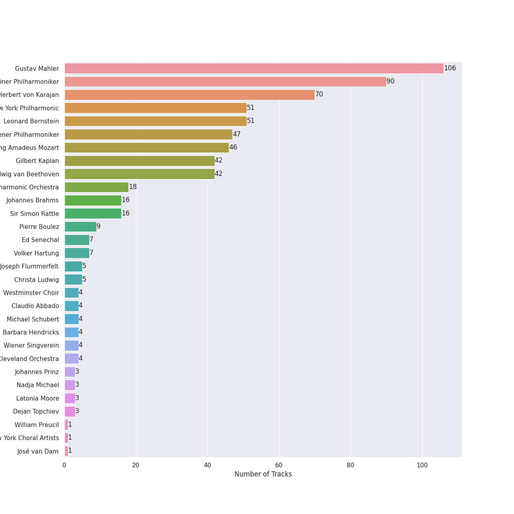

# Symphonies

## Top Artists

See all artists

|   Number of Tracks | Artist                             |
|-------------------:|:-----------------------------------|
|                106 | Gustav Mahler                      |
|                 90 | Berliner Philharmoniker            |
|                 70 | Herbert von Karajan                |
|                 51 | New York Philharmonic              |
|                 51 | Leonard Bernstein                  |
|                 47 | Wiener Philharmoniker              |
|                 46 | Wolfgang Amadeus Mozart            |
|                 42 | Gilbert Kaplan                     |
|                 42 | Ludwig van Beethoven               |
|                 18 | Cologne New Philharmonic Orchestra |
|                 16 | Johannes Brahms                    |
|                 16 | Sir Simon Rattle                   |
|                  9 | Pierre Boulez                      |
|                  7 | Ed Senechal                        |
|                  7 | Volker Hartung                     |
|                  5 | Joseph Flummerfelt                 |
|                  5 | Christa Ludwig                     |
|                  4 | Westminster Choir                  |
|                  4 | Claudio Abbado                     |
|                  4 | Michael Schubert                   |
|                  4 | Barbara Hendricks                  |
|                  4 | Wiener Singverein                  |
|                  4 | Cleveland Orchestra                |
|                  3 | Johannes Prinz                     |
|                  3 | Nadja Michael                      |
|                  3 | Latonia Moore                      |
|                  3 | Dejan Topchiev                     |
|                  1 | William Preucil                    |
|                  1 | New York Choral Artists            |
|                  1 | José van Dam                       |
|                  1 | Brooklyn Boys Chorus               |
|                  1 | Juliane Banse                      |
|                  1 | Vinson Cole                        |
|                  1 | Agnes Baltsa                       |
|                  1 | James McCarthy                     |
|                  1 | Janet Perry                        |
|                  1 | Helmut Froschauer                  |

## Tracks

| Track                                                                                                                                           | Album                                                                             | Artists                                                                                                                                                                                                                                                                                                                                                                           | Liked   |
|:------------------------------------------------------------------------------------------------------------------------------------------------|:----------------------------------------------------------------------------------|:----------------------------------------------------------------------------------------------------------------------------------------------------------------------------------------------------------------------------------------------------------------------------------------------------------------------------------------------------------------------------------|:--------|
| Symphony No. 1 in D Major: 1. Langsam. Schleppend - Live                                                                                        | Mahler: Symphony No.1                                                             | [Gustav Mahler](../artists/gustav_mahler.md), [Berliner Philharmoniker](../artists/berliner_philharmoniker.md), Claudio Abbado                                                                                                                                                                                                                                                    |         |
| Symphony No. 1 in D Major: 2. Kräftig bewegt - Live                                                                                             | Mahler: Symphony No.1                                                             | [Gustav Mahler](../artists/gustav_mahler.md), [Berliner Philharmoniker](../artists/berliner_philharmoniker.md), Claudio Abbado                                                                                                                                                                                                                                                    |         |
| Symphony No. 1 in D Major: 3. Feierlich und gemessen, ohne zu schleppen - Live                                                                  | Mahler: Symphony No.1                                                             | [Gustav Mahler](../artists/gustav_mahler.md), [Berliner Philharmoniker](../artists/berliner_philharmoniker.md), Claudio Abbado                                                                                                                                                                                                                                                    |         |
| Symphony No. 1 in D Major: 4. Stürmisch bewegt - Live                                                                                           | Mahler: Symphony No.1                                                             | [Gustav Mahler](../artists/gustav_mahler.md), [Berliner Philharmoniker](../artists/berliner_philharmoniker.md), Claudio Abbado                                                                                                                                                                                                                                                    |         |
| Symphony No. 4 in G Major: I. Bedächtig. Nicht eilen                                                                                            | Mahler: Symphony No.4                                                             | [Gustav Mahler](../artists/gustav_mahler.md), Cleveland Orchestra, Pierre Boulez                                                                                                                                                                                                                                                                                                  |         |
| Symphony No. 4 in G Major: III. Ruhevoll (Poco adagio)                                                                                          | Mahler: Symphony No.4                                                             | [Gustav Mahler](../artists/gustav_mahler.md), Cleveland Orchestra, Pierre Boulez                                                                                                                                                                                                                                                                                                  |         |
| Symphony No. 4 in G Major: IV. Sehr behaglich: "Wir genießen die himmlischen Freuden"                                                           | Mahler: Symphony No.4                                                             | [Gustav Mahler](../artists/gustav_mahler.md), Cleveland Orchestra, Pierre Boulez, Juliane Banse                                                                                                                                                                                                                                                                                   |         |
| Symphony No. 4 in G Major: II. In gemächlicher Bewegung. Ohne Hast                                                                              | Mahler: Symphony No.4                                                             | [Gustav Mahler](../artists/gustav_mahler.md), Cleveland Orchestra, Pierre Boulez, William Preucil                                                                                                                                                                                                                                                                                 |         |
| Symphony No. 2 In C Minor - "Resurrection" / 1st Movement - Allegro maestoso (Totenfeier): Mit durchaus ernstem und feierlichem Ausdruck - Live | Mahler: Symphony No.2 "Resurrection"                                              | [Gustav Mahler](../artists/gustav_mahler.md), [New York Philharmonic](../artists/new_york_philharmonic.md), [Leonard Bernstein](../artists/leonard_bernstein.md)                                                                                                                                                                                                                  |         |
| Symphony No. 2 In C Minor - "Resurrection" / 1st Movement - Allegro maestoso (Totenfeier): Schnell - Live                                       | Mahler: Symphony No.2 "Resurrection"                                              | [Gustav Mahler](../artists/gustav_mahler.md), [New York Philharmonic](../artists/new_york_philharmonic.md), [Leonard Bernstein](../artists/leonard_bernstein.md)                                                                                                                                                                                                                  |         |
| Symphony No. 2 In C Minor - "Resurrection" / 1st Movement - Allegro maestoso (Totenfeier): Sehr mäßig und zurückhaltend - Live                  | Mahler: Symphony No.2 "Resurrection"                                              | [Gustav Mahler](../artists/gustav_mahler.md), [New York Philharmonic](../artists/new_york_philharmonic.md), [Leonard Bernstein](../artists/leonard_bernstein.md)                                                                                                                                                                                                                  |         |
| Symphony No. 2 In C Minor - "Resurrection" / 1st Movement - Allegro maestoso (Totenfeier): Tempo I - Live                                       | Mahler: Symphony No.2 "Resurrection"                                              | [Gustav Mahler](../artists/gustav_mahler.md), [New York Philharmonic](../artists/new_york_philharmonic.md), [Leonard Bernstein](../artists/leonard_bernstein.md)                                                                                                                                                                                                                  |         |
| Symphony No. 2 In C Minor - "Resurrection" / 1st Movement - Allegro maestoso (Totenfeier): Tempo sostenuto - Live                               | Mahler: Symphony No.2 "Resurrection"                                              | [Gustav Mahler](../artists/gustav_mahler.md), [New York Philharmonic](../artists/new_york_philharmonic.md), [Leonard Bernstein](../artists/leonard_bernstein.md)                                                                                                                                                                                                                  |         |
| Symphony No. 2 In C Minor - "Resurrection" / 2nd Movement - Andante moderato: Energisch bewegt - Live                                           | Mahler: Symphony No.2 "Resurrection"                                              | [Gustav Mahler](../artists/gustav_mahler.md), [New York Philharmonic](../artists/new_york_philharmonic.md), [Leonard Bernstein](../artists/leonard_bernstein.md)                                                                                                                                                                                                                  |         |
| Symphony No. 2 In C Minor - "Resurrection" / 2nd Movement - Andante moderato: In Tempo I zurückkehren - Live                                    | Mahler: Symphony No.2 "Resurrection"                                              | [Gustav Mahler](../artists/gustav_mahler.md), [New York Philharmonic](../artists/new_york_philharmonic.md), [Leonard Bernstein](../artists/leonard_bernstein.md)                                                                                                                                                                                                                  |         |
| Symphony No. 2 In C Minor - "Resurrection" / 2nd Movement - Andante moderato: Nicht eilen. Sehr gemächlich - Live                               | Mahler: Symphony No.2 "Resurrection"                                              | [Gustav Mahler](../artists/gustav_mahler.md), [New York Philharmonic](../artists/new_york_philharmonic.md), [Leonard Bernstein](../artists/leonard_bernstein.md)                                                                                                                                                                                                                  |         |
| Symphony No. 2 In C Minor - "Resurrection" / 2nd Movement - Andante moderato: Sehr gemächlich - Live                                            | Mahler: Symphony No.2 "Resurrection"                                              | [Gustav Mahler](../artists/gustav_mahler.md), [New York Philharmonic](../artists/new_york_philharmonic.md), [Leonard Bernstein](../artists/leonard_bernstein.md)                                                                                                                                                                                                                  |         |
| Symphony No. 2 In C Minor - "Resurrection" / 2nd Movement - Andante moderato: Wieder ins Tempo zurückgehen. TempoI - Live                       | Mahler: Symphony No.2 "Resurrection"                                              | [Gustav Mahler](../artists/gustav_mahler.md), [New York Philharmonic](../artists/new_york_philharmonic.md), [Leonard Bernstein](../artists/leonard_bernstein.md)                                                                                                                                                                                                                  |         |
| Symphony No. 2 In C Minor - "Resurrection" / 3: (Scherzo): In ruhiger fließender Bewegung - Live                                                | Mahler: Symphony No.2 "Resurrection"                                              | [Gustav Mahler](../artists/gustav_mahler.md), [New York Philharmonic](../artists/new_york_philharmonic.md), [Leonard Bernstein](../artists/leonard_bernstein.md)                                                                                                                                                                                                                  |         |
| Symphony No. 2 In C Minor - "Resurrection" / 3: (Scherzo): Sehr getragen und gesangvoll - Live                                                  | Mahler: Symphony No.2 "Resurrection"                                              | [Gustav Mahler](../artists/gustav_mahler.md), [New York Philharmonic](../artists/new_york_philharmonic.md), [Leonard Bernstein](../artists/leonard_bernstein.md)                                                                                                                                                                                                                  |         |
| Symphony No. 2 In C Minor - "Resurrection" / 3: (Scherzo): Zum Tempo I zurückkehren - Live                                                      | Mahler: Symphony No.2 "Resurrection"                                              | [Gustav Mahler](../artists/gustav_mahler.md), [New York Philharmonic](../artists/new_york_philharmonic.md), [Leonard Bernstein](../artists/leonard_bernstein.md)                                                                                                                                                                                                                  |         |
| Symphony No. 2 In C Minor - "Resurrection" / 5: Im Tempo des Scherzo: Am Anfang sehr zurückgehalten - Live                                      | Mahler: Symphony No.2 "Resurrection"                                              | [Gustav Mahler](../artists/gustav_mahler.md), [New York Philharmonic](../artists/new_york_philharmonic.md), [Leonard Bernstein](../artists/leonard_bernstein.md)                                                                                                                                                                                                                  |         |
| Symphony No. 2 In C Minor - "Resurrection" / 5: Im Tempo des Scherzo: Im Tempo des Scherzos - Live                                              | Mahler: Symphony No.2 "Resurrection"                                              | [Gustav Mahler](../artists/gustav_mahler.md), [New York Philharmonic](../artists/new_york_philharmonic.md), [Leonard Bernstein](../artists/leonard_bernstein.md)                                                                                                                                                                                                                  |         |
| Symphony No. 2 In C Minor - "Resurrection" / 5: Im Tempo des Scherzo: Langsam - Live                                                            | Mahler: Symphony No.2 "Resurrection"                                              | [Gustav Mahler](../artists/gustav_mahler.md), [New York Philharmonic](../artists/new_york_philharmonic.md), [Leonard Bernstein](../artists/leonard_bernstein.md)                                                                                                                                                                                                                  |         |
| Symphony No. 2 In C Minor - "Resurrection" / 5: Im Tempo des Scherzo: Molto ritenuto. Maestoso - Live                                           | Mahler: Symphony No.2 "Resurrection"                                              | [Gustav Mahler](../artists/gustav_mahler.md), [New York Philharmonic](../artists/new_york_philharmonic.md), [Leonard Bernstein](../artists/leonard_bernstein.md)                                                                                                                                                                                                                  |         |
| Symphony No. 2 In C Minor - "Resurrection" / 5: Im Tempo des Scherzo: Sehr langsam und gedehnt - Live                                           | Mahler: Symphony No.2 "Resurrection"                                              | [Gustav Mahler](../artists/gustav_mahler.md), [New York Philharmonic](../artists/new_york_philharmonic.md), [Leonard Bernstein](../artists/leonard_bernstein.md)                                                                                                                                                                                                                  |         |
| Symphony No. 2 In C Minor - "Resurrection" / 5: Im Tempo des Scherzo: Wieder sehr breit - Live                                                  | Mahler: Symphony No.2 "Resurrection"                                              | [Gustav Mahler](../artists/gustav_mahler.md), [New York Philharmonic](../artists/new_york_philharmonic.md), [Leonard Bernstein](../artists/leonard_bernstein.md)                                                                                                                                                                                                                  |         |
| Symphony No. 2 In C Minor - "Resurrection" / 5: Im Tempo des Scherzo: Wieder zurückhaltend - Live                                               | Mahler: Symphony No.2 "Resurrection"                                              | [Gustav Mahler](../artists/gustav_mahler.md), [New York Philharmonic](../artists/new_york_philharmonic.md), [Leonard Bernstein](../artists/leonard_bernstein.md)                                                                                                                                                                                                                  |         |
| Symphony No. 3 In D Minor / Part 1: 1. - Im alten Marschtempo (Allegro Moderato) - Live                                                         | Mahler: Symphony No.3                                                             | [Gustav Mahler](../artists/gustav_mahler.md), [New York Philharmonic](../artists/new_york_philharmonic.md), [Leonard Bernstein](../artists/leonard_bernstein.md)                                                                                                                                                                                                                  |         |
| Symphony No. 3 In D Minor / Part 1: 1. - Immer das gleiche Tempo - Live                                                                         | Mahler: Symphony No.3                                                             | [Gustav Mahler](../artists/gustav_mahler.md), [New York Philharmonic](../artists/new_york_philharmonic.md), [Leonard Bernstein](../artists/leonard_bernstein.md)                                                                                                                                                                                                                  |         |
| Symphony No. 3 In D Minor / Part 1: 1. - Immer dasselbe Tempo. (Marsch.) Nicht eilen - Live                                                     | Mahler: Symphony No.3                                                             | [Gustav Mahler](../artists/gustav_mahler.md), [New York Philharmonic](../artists/new_york_philharmonic.md), [Leonard Bernstein](../artists/leonard_bernstein.md)                                                                                                                                                                                                                  |         |
| Symphony No. 3 In D Minor / Part 1: 1. - Tempo I - Live                                                                                         | Mahler: Symphony No.3                                                             | [Gustav Mahler](../artists/gustav_mahler.md), [New York Philharmonic](../artists/new_york_philharmonic.md), [Leonard Bernstein](../artists/leonard_bernstein.md)                                                                                                                                                                                                                  |         |
| Symphony No. 3 In D Minor / Part 1: 1. - Tempo I - Live                                                                                         | Mahler: Symphony No.3                                                             | [Gustav Mahler](../artists/gustav_mahler.md), [New York Philharmonic](../artists/new_york_philharmonic.md), [Leonard Bernstein](../artists/leonard_bernstein.md)                                                                                                                                                                                                                  |         |
| Symphony No. 3 In D Minor / Part 1: 1. - Zeit lassen - Live                                                                                     | Mahler: Symphony No.3                                                             | [Gustav Mahler](../artists/gustav_mahler.md), [New York Philharmonic](../artists/new_york_philharmonic.md), [Leonard Bernstein](../artists/leonard_bernstein.md)                                                                                                                                                                                                                  |         |
| Symphony No. 3 In D Minor / Part 1: 1. - Zeit lassen - Live                                                                                     | Mahler: Symphony No.3                                                             | [Gustav Mahler](../artists/gustav_mahler.md), [New York Philharmonic](../artists/new_york_philharmonic.md), [Leonard Bernstein](../artists/leonard_bernstein.md)                                                                                                                                                                                                                  |         |
| Symphony No. 3 In D Minor / Part 1: 1. Kräftig. Entschieden - Live                                                                              | Mahler: Symphony No.3                                                             | [Gustav Mahler](../artists/gustav_mahler.md), [New York Philharmonic](../artists/new_york_philharmonic.md), [Leonard Bernstein](../artists/leonard_bernstein.md)                                                                                                                                                                                                                  |         |
| Symphony No. 3 In D Minor / Part 2: 2. - A tempo. (Wie im Anfang) - Live                                                                        | Mahler: Symphony No.3                                                             | [Gustav Mahler](../artists/gustav_mahler.md), [New York Philharmonic](../artists/new_york_philharmonic.md), [Leonard Bernstein](../artists/leonard_bernstein.md)                                                                                                                                                                                                                  |         |
| Symphony No. 3 In D Minor / Part 2: 2. - Ganz ploetzlich gemaechlich. Tempo di Menuetto - Live                                                  | Mahler: Symphony No.3                                                             | [Gustav Mahler](../artists/gustav_mahler.md), [New York Philharmonic](../artists/new_york_philharmonic.md), [Leonard Bernstein](../artists/leonard_bernstein.md)                                                                                                                                                                                                                  |         |
| Symphony No. 3 In D Minor / Part 2: 2. - L'istesso tempo - Live                                                                                 | Mahler: Symphony No.3                                                             | [Gustav Mahler](../artists/gustav_mahler.md), [New York Philharmonic](../artists/new_york_philharmonic.md), [Leonard Bernstein](../artists/leonard_bernstein.md)                                                                                                                                                                                                                  |         |
| Symphony No. 3 In D Minor / Part 2: 3. Comodo. Scherzando. Ohne Hast - Live                                                                     | Mahler: Symphony No.3                                                             | [Gustav Mahler](../artists/gustav_mahler.md), [New York Philharmonic](../artists/new_york_philharmonic.md), [Leonard Bernstein](../artists/leonard_bernstein.md)                                                                                                                                                                                                                  |         |
| Symphony No. 3 In D Minor / Part 2: 3.- Etwas zurueckhaltend - Live                                                                             | Mahler: Symphony No.3                                                             | [Gustav Mahler](../artists/gustav_mahler.md), [New York Philharmonic](../artists/new_york_philharmonic.md), [Leonard Bernstein](../artists/leonard_bernstein.md)                                                                                                                                                                                                                  |         |
| Symphony No. 3 In D Minor / Part 2: 3.- Schnell und schmetternd wie eine Fanfare - Tempo I. Mit geheimnisvoller Hast - Live                     | Mahler: Symphony No.3                                                             | [Gustav Mahler](../artists/gustav_mahler.md), [New York Philharmonic](../artists/new_york_philharmonic.md), [Leonard Bernstein](../artists/leonard_bernstein.md)                                                                                                                                                                                                                  |         |
| Symphony No. 3 In D Minor / Part 2: 3.- Wieder sehr gemaechlich, beinahe langsam                                                                | Mahler: Symphony No.3                                                             | [Gustav Mahler](../artists/gustav_mahler.md), [New York Philharmonic](../artists/new_york_philharmonic.md), [Leonard Bernstein](../artists/leonard_bernstein.md)                                                                                                                                                                                                                  |         |
| Symphony No. 3 In D Minor / Part 2: 3.- Wieder sehr gemaechlich, wie zu Anfang - Live                                                           | Mahler: Symphony No.3                                                             | [Gustav Mahler](../artists/gustav_mahler.md), [New York Philharmonic](../artists/new_york_philharmonic.md), [Leonard Bernstein](../artists/leonard_bernstein.md)                                                                                                                                                                                                                  |         |
| Symphony No. 3 In D Minor / Part 2: 4.- Più mosso subito - Live                                                                                 | Mahler: Symphony No.3                                                             | [Gustav Mahler](../artists/gustav_mahler.md), [New York Philharmonic](../artists/new_york_philharmonic.md), [Leonard Bernstein](../artists/leonard_bernstein.md)                                                                                                                                                                                                                  |         |
| Symphony No. 3 In D Minor / Part 2: 6. Langsam. Ruhevoll. Empfunden - Live                                                                      | Mahler: Symphony No.3                                                             | [Gustav Mahler](../artists/gustav_mahler.md), [New York Philharmonic](../artists/new_york_philharmonic.md), [Leonard Bernstein](../artists/leonard_bernstein.md)                                                                                                                                                                                                                  |         |
| Symphony No. 3 In D Minor / Part 2: 6.- Langsam. Tempo I - Live                                                                                 | Mahler: Symphony No.3                                                             | [Gustav Mahler](../artists/gustav_mahler.md), [New York Philharmonic](../artists/new_york_philharmonic.md), [Leonard Bernstein](../artists/leonard_bernstein.md)                                                                                                                                                                                                                  |         |
| Symphony No. 3 In D Minor / Part 2: 6.- Nicht mehr so breit - Live                                                                              | Mahler: Symphony No.3                                                             | [Gustav Mahler](../artists/gustav_mahler.md), [New York Philharmonic](../artists/new_york_philharmonic.md), [Leonard Bernstein](../artists/leonard_bernstein.md)                                                                                                                                                                                                                  |         |
| Symphony No. 3 In D Minor / Part 2: 6.- Nicht mehr so breit - Live                                                                              | Mahler: Symphony No.3                                                             | [Gustav Mahler](../artists/gustav_mahler.md), [New York Philharmonic](../artists/new_york_philharmonic.md), [Leonard Bernstein](../artists/leonard_bernstein.md)                                                                                                                                                                                                                  |         |
| Symphony No. 3 In D Minor / Part 2: 6.- Tempo I - Live                                                                                          | Mahler: Symphony No.3                                                             | [Gustav Mahler](../artists/gustav_mahler.md), [New York Philharmonic](../artists/new_york_philharmonic.md), [Leonard Bernstein](../artists/leonard_bernstein.md)                                                                                                                                                                                                                  |         |
| Symphony No. 3 In D Minor / Part 2: 6.- Tempo I. Ruhevoll - Live                                                                                | Mahler: Symphony No.3                                                             | [Gustav Mahler](../artists/gustav_mahler.md), [New York Philharmonic](../artists/new_york_philharmonic.md), [Leonard Bernstein](../artists/leonard_bernstein.md)                                                                                                                                                                                                                  |         |
| Symphony No.3 In D Minor / Part 2: 2. Tempo di minuetto. Sehr mäßig - Live                                                                      | Mahler: Symphony No.3                                                             | [Gustav Mahler](../artists/gustav_mahler.md), [New York Philharmonic](../artists/new_york_philharmonic.md), [Leonard Bernstein](../artists/leonard_bernstein.md)                                                                                                                                                                                                                  |         |
| Symphony No. 2 in C Minor - "Resurrection" / 4: "Urlicht": Sehr feierlich, aber schlicht - Live                                                 | Mahler: Symphony No.2 "Resurrection"                                              | [Gustav Mahler](../artists/gustav_mahler.md), [New York Philharmonic](../artists/new_york_philharmonic.md), [Leonard Bernstein](../artists/leonard_bernstein.md), Christa Ludwig                                                                                                                                                                                                  |         |
| Symphony No. 3 In D Minor / Part 2: 4. Sehr langsam. Misterioso ppp - "O Mensch! Gib acht" - Live                                               | Mahler: Symphony No.3                                                             | [Gustav Mahler](../artists/gustav_mahler.md), [New York Philharmonic](../artists/new_york_philharmonic.md), [Leonard Bernstein](../artists/leonard_bernstein.md), Christa Ludwig                                                                                                                                                                                                  |         |
| Symphony No. 2 In C Minor - "Resurrection" / 5: Im Tempo des Scherzo: Etwas bewegter - "O glaube, mein Herz, o glaube" - Live                   | Mahler: Symphony No.2 "Resurrection"                                              | [Gustav Mahler](../artists/gustav_mahler.md), [New York Philharmonic](../artists/new_york_philharmonic.md), [Leonard Bernstein](../artists/leonard_bernstein.md), Christa Ludwig, Joseph Flummerfelt, Barbara Hendricks, Westminster Choir                                                                                                                                        |         |
| Symphony No. 2 In C Minor - "Resurrection" / 5: Im Tempo des Scherzo: Mit Aufschwung, aber nicht eilen - "O Schmerz, du Alldurchdringer" - Live | Mahler: Symphony No.2 "Resurrection"                                              | [Gustav Mahler](../artists/gustav_mahler.md), [New York Philharmonic](../artists/new_york_philharmonic.md), [Leonard Bernstein](../artists/leonard_bernstein.md), Christa Ludwig, Joseph Flummerfelt, Barbara Hendricks, Westminster Choir                                                                                                                                        |         |
| Symphony No. 3 In D Minor / Part 2: 5. Lustig im Tempo und keck im Ausdruck: "Bimm Bamm. Es sungen drei Engel" - Live                           | Mahler: Symphony No.3                                                             | [Gustav Mahler](../artists/gustav_mahler.md), [New York Philharmonic](../artists/new_york_philharmonic.md), [Leonard Bernstein](../artists/leonard_bernstein.md), Christa Ludwig, New York Choral Artists, Brooklyn Boys Chorus, Joseph Flummerfelt, James McCarthy                                                                                                               |         |
| Symphony No. 2 In C Minor - "Resurrection" / 5: Im Tempo des Scherzo: Langsam ppp. Nicht schleppen - "Wieder aufzublühn wirst du gesät" - Live  | Mahler: Symphony No.2 "Resurrection"                                              | [Gustav Mahler](../artists/gustav_mahler.md), [New York Philharmonic](../artists/new_york_philharmonic.md), [Leonard Bernstein](../artists/leonard_bernstein.md), Joseph Flummerfelt, Barbara Hendricks, Westminster Choir                                                                                                                                                        |         |
| Symphony No. 2 In C Minor - "Resurrection" / 5: Im Tempo des Scherzo: Langsam. Misterioso - "Auferstehen, ja auferstehen wirst du gesät" - Live | Mahler: Symphony No.2 "Resurrection"                                              | [Gustav Mahler](../artists/gustav_mahler.md), [New York Philharmonic](../artists/new_york_philharmonic.md), [Leonard Bernstein](../artists/leonard_bernstein.md), Joseph Flummerfelt, Barbara Hendricks, Westminster Choir                                                                                                                                                        |         |
| Symphony No. 5 In C Sharp Minor: 1. Trauermarsch (In gemessenem Schritt. Streng. Wie ein Kondukt) [Symphony No.5 in C sharp minor / Part 1]     | Mahler: Symphony No.5                                                             | [Gustav Mahler](../artists/gustav_mahler.md), Pierre Boulez, [Wiener Philharmoniker](../artists/wiener_philharmoniker.md)                                                                                                                                                                                                                                                         |         |
| Symphony No. 5 In C Sharp Minor: II. Stürmisch bewegt. Mit größter Vehemenz                                                                     | Mahler: Symphony No.5                                                             | [Gustav Mahler](../artists/gustav_mahler.md), Pierre Boulez, [Wiener Philharmoniker](../artists/wiener_philharmoniker.md)                                                                                                                                                                                                                                                         |         |
| Symphony No. 5 In C Sharp Minor: III. Scherzo. Kräftig, nicht zu schnell                                                                        | Mahler: Symphony No.5                                                             | [Gustav Mahler](../artists/gustav_mahler.md), Pierre Boulez, [Wiener Philharmoniker](../artists/wiener_philharmoniker.md)                                                                                                                                                                                                                                                         |         |
| Symphony No. 5 In C Sharp Minor: IV. Adagietto. Sehr langsam                                                                                    | Mahler: Symphony No.5                                                             | [Gustav Mahler](../artists/gustav_mahler.md), Pierre Boulez, [Wiener Philharmoniker](../artists/wiener_philharmoniker.md)                                                                                                                                                                                                                                                         |         |
| Symphony No. 5 In C Sharp Minor: V. Rondo-Finale. Allegro - Allegro giocoso. Frisch                                                             | Mahler: Symphony No.5                                                             | [Gustav Mahler](../artists/gustav_mahler.md), Pierre Boulez, [Wiener Philharmoniker](../artists/wiener_philharmoniker.md)                                                                                                                                                                                                                                                         |         |
| Symphony No. 2 In C Minor - "Resurrection" / 1st Movement - Allegro maestoso (Totenfeier): (English horn)                                       | Mahler: Symphony No. 2                                                            | [Gustav Mahler](../artists/gustav_mahler.md), [Wiener Philharmoniker](../artists/wiener_philharmoniker.md), [Gilbert Kaplan](../artists/gilbert_kaplan.md)                                                                                                                                                                                                                        |         |
| Symphony No. 2 In C Minor - "Resurrection" / 1st Movement - Allegro maestoso (Totenfeier): Allegro maestoso                                     | Mahler: Symphony No. 2                                                            | [Gustav Mahler](../artists/gustav_mahler.md), [Wiener Philharmoniker](../artists/wiener_philharmoniker.md), [Gilbert Kaplan](../artists/gilbert_kaplan.md)                                                                                                                                                                                                                        |         |
| Symphony No. 2 In C Minor - "Resurrection" / 1st Movement - Allegro maestoso (Totenfeier): Ausdrucksvoll (English horn & bass clarinet)         | Mahler: Symphony No. 2                                                            | [Gustav Mahler](../artists/gustav_mahler.md), [Wiener Philharmoniker](../artists/wiener_philharmoniker.md), [Gilbert Kaplan](../artists/gilbert_kaplan.md)                                                                                                                                                                                                                        |         |
| Symphony No. 2 In C Minor - "Resurrection" / 1st Movement - Allegro maestoso (Totenfeier): Etwas drängend                                       | Mahler: Symphony No. 2                                                            | [Gustav Mahler](../artists/gustav_mahler.md), [Wiener Philharmoniker](../artists/wiener_philharmoniker.md), [Gilbert Kaplan](../artists/gilbert_kaplan.md)                                                                                                                                                                                                                        |         |
| Symphony No. 2 In C Minor - "Resurrection" / 1st Movement - Allegro maestoso (Totenfeier): Im Tempo nachgeben                                   | Mahler: Symphony No. 2                                                            | [Gustav Mahler](../artists/gustav_mahler.md), [Wiener Philharmoniker](../artists/wiener_philharmoniker.md), [Gilbert Kaplan](../artists/gilbert_kaplan.md)                                                                                                                                                                                                                        |         |
| Symphony No. 2 In C Minor - "Resurrection" / 1st Movement - Allegro maestoso (Totenfeier): Molto pesante                                        | Mahler: Symphony No. 2                                                            | [Gustav Mahler](../artists/gustav_mahler.md), [Wiener Philharmoniker](../artists/wiener_philharmoniker.md), [Gilbert Kaplan](../artists/gilbert_kaplan.md)                                                                                                                                                                                                                        |         |
| Symphony No. 2 In C Minor - "Resurrection" / 1st Movement - Allegro maestoso (Totenfeier): Schnell                                              | Mahler: Symphony No. 2                                                            | [Gustav Mahler](../artists/gustav_mahler.md), [Wiener Philharmoniker](../artists/wiener_philharmoniker.md), [Gilbert Kaplan](../artists/gilbert_kaplan.md)                                                                                                                                                                                                                        |         |
| Symphony No. 2 In C Minor - "Resurrection" / 1st Movement - Allegro maestoso (Totenfeier): Sehr getragen (Trumpet & trombone)                   | Mahler: Symphony No. 2                                                            | [Gustav Mahler](../artists/gustav_mahler.md), [Wiener Philharmoniker](../artists/wiener_philharmoniker.md), [Gilbert Kaplan](../artists/gilbert_kaplan.md)                                                                                                                                                                                                                        |         |
| Symphony No. 2 In C Minor - "Resurrection" / 1st Movement - Allegro maestoso (Totenfeier): Sehr langsam beginnend                               | Mahler: Symphony No. 2                                                            | [Gustav Mahler](../artists/gustav_mahler.md), [Wiener Philharmoniker](../artists/wiener_philharmoniker.md), [Gilbert Kaplan](../artists/gilbert_kaplan.md)                                                                                                                                                                                                                        |         |
| Symphony No. 2 In C Minor - "Resurrection" / 1st Movement - Allegro maestoso (Totenfeier): Sehr mässig und zurückhaltend                        | Mahler: Symphony No. 2                                                            | [Gustav Mahler](../artists/gustav_mahler.md), [Wiener Philharmoniker](../artists/wiener_philharmoniker.md), [Gilbert Kaplan](../artists/gilbert_kaplan.md)                                                                                                                                                                                                                        |         |
| Symphony No. 2 In C Minor - "Resurrection" / 1st Movement - Allegro maestoso (Totenfeier): Tempo I                                              | Mahler: Symphony No. 2                                                            | [Gustav Mahler](../artists/gustav_mahler.md), [Wiener Philharmoniker](../artists/wiener_philharmoniker.md), [Gilbert Kaplan](../artists/gilbert_kaplan.md)                                                                                                                                                                                                                        |         |
| Symphony No. 2 In C Minor - "Resurrection" / 1st Movement - Allegro maestoso (Totenfeier): Tempo sostenuto                                      | Mahler: Symphony No. 2                                                            | [Gustav Mahler](../artists/gustav_mahler.md), [Wiener Philharmoniker](../artists/wiener_philharmoniker.md), [Gilbert Kaplan](../artists/gilbert_kaplan.md)                                                                                                                                                                                                                        |         |
| Symphony No. 2 In C Minor - "Resurrection" / 1st Movement - Allegro maestoso (Totenfeier): Wie zu Anfang                                        | Mahler: Symphony No. 2                                                            | [Gustav Mahler](../artists/gustav_mahler.md), [Wiener Philharmoniker](../artists/wiener_philharmoniker.md), [Gilbert Kaplan](../artists/gilbert_kaplan.md)                                                                                                                                                                                                                        |         |
| Symphony No. 2 In C Minor - "Resurrection" / 1st Movement - Allegro maestoso (Totenfeier): Zurückhalten                                         | Mahler: Symphony No. 2                                                            | [Gustav Mahler](../artists/gustav_mahler.md), [Wiener Philharmoniker](../artists/wiener_philharmoniker.md), [Gilbert Kaplan](../artists/gilbert_kaplan.md)                                                                                                                                                                                                                        |         |
| Symphony No. 2 In C Minor - "Resurrection" / 2nd Movement - Andante moderato: 3 bars before Wieder ins Tempo zurückgehen. Tempo I               | Mahler: Symphony No. 2                                                            | [Gustav Mahler](../artists/gustav_mahler.md), [Wiener Philharmoniker](../artists/wiener_philharmoniker.md), [Gilbert Kaplan](../artists/gilbert_kaplan.md)                                                                                                                                                                                                                        |         |
| Symphony No. 2 In C Minor - "Resurrection" / 2nd Movement - Andante moderato: Andante moderato                                                  | Mahler: Symphony No. 2                                                            | [Gustav Mahler](../artists/gustav_mahler.md), [Wiener Philharmoniker](../artists/wiener_philharmoniker.md), [Gilbert Kaplan](../artists/gilbert_kaplan.md)                                                                                                                                                                                                                        |         |
| Symphony No. 2 In C Minor - "Resurrection" / 2nd Movement - Andante moderato: In Tempo I zurückkehren                                           | Mahler: Symphony No. 2                                                            | [Gustav Mahler](../artists/gustav_mahler.md), [Wiener Philharmoniker](../artists/wiener_philharmoniker.md), [Gilbert Kaplan](../artists/gilbert_kaplan.md)                                                                                                                                                                                                                        |         |
| Symphony No. 2 In C Minor - "Resurrection" / 2nd Movement - Andante moderato: Nicht eilen. Sehr gemächlich                                      | Mahler: Symphony No. 2                                                            | [Gustav Mahler](../artists/gustav_mahler.md), [Wiener Philharmoniker](../artists/wiener_philharmoniker.md), [Gilbert Kaplan](../artists/gilbert_kaplan.md)                                                                                                                                                                                                                        |         |
| Symphony No. 2 In C Minor - "Resurrection" / 2nd Movement - Andante moderato: Tempo I. Energisch bewegt                                         | Mahler: Symphony No. 2                                                            | [Gustav Mahler](../artists/gustav_mahler.md), [Wiener Philharmoniker](../artists/wiener_philharmoniker.md), [Gilbert Kaplan](../artists/gilbert_kaplan.md)                                                                                                                                                                                                                        |         |
| Symphony No. 2 in C minor - "Resurrection" / 3rd Movement - (Scherzo): (Bassoon & violas)                                                       | Mahler: Symphony No. 2                                                            | [Gustav Mahler](../artists/gustav_mahler.md), [Wiener Philharmoniker](../artists/wiener_philharmoniker.md), [Gilbert Kaplan](../artists/gilbert_kaplan.md)                                                                                                                                                                                                                        |         |
| Symphony No. 2 in C minor - "Resurrection" / 3rd Movement - (Scherzo): (Cellos & Basses)                                                        | Mahler: Symphony No. 2                                                            | [Gustav Mahler](../artists/gustav_mahler.md), [Wiener Philharmoniker](../artists/wiener_philharmoniker.md), [Gilbert Kaplan](../artists/gilbert_kaplan.md)                                                                                                                                                                                                                        |         |
| Symphony No. 2 in C minor - "Resurrection" / 3rd Movement - (Scherzo): (Piccolo)                                                                | Mahler: Symphony No. 2                                                            | [Gustav Mahler](../artists/gustav_mahler.md), [Wiener Philharmoniker](../artists/wiener_philharmoniker.md), [Gilbert Kaplan](../artists/gilbert_kaplan.md)                                                                                                                                                                                                                        |         |
| Symphony No. 2 in C minor - "Resurrection" / 3rd Movement - (Scherzo): (Trumpets & trombones)                                                   | Mahler: Symphony No. 2                                                            | [Gustav Mahler](../artists/gustav_mahler.md), [Wiener Philharmoniker](../artists/wiener_philharmoniker.md), [Gilbert Kaplan](../artists/gilbert_kaplan.md)                                                                                                                                                                                                                        |         |
| Symphony No. 2 in C minor - "Resurrection" / 3rd Movement - (Scherzo): (Violas, cellos & basses)                                                | Mahler: Symphony No. 2                                                            | [Gustav Mahler](../artists/gustav_mahler.md), [Wiener Philharmoniker](../artists/wiener_philharmoniker.md), [Gilbert Kaplan](../artists/gilbert_kaplan.md)                                                                                                                                                                                                                        |         |
| Symphony No. 2 in C minor - "Resurrection" / 3rd Movement - (Scherzo): In ruhig fliessender Bewegung                                            | Mahler: Symphony No. 2                                                            | [Gustav Mahler](../artists/gustav_mahler.md), [Wiener Philharmoniker](../artists/wiener_philharmoniker.md), [Gilbert Kaplan](../artists/gilbert_kaplan.md)                                                                                                                                                                                                                        |         |
| Symphony No. 2 in C minor - "Resurrection" / 3rd Movement - (Scherzo): Sehr getragen und gesangvoll                                             | Mahler: Symphony No. 2                                                            | [Gustav Mahler](../artists/gustav_mahler.md), [Wiener Philharmoniker](../artists/wiener_philharmoniker.md), [Gilbert Kaplan](../artists/gilbert_kaplan.md)                                                                                                                                                                                                                        |         |
| Symphony No. 2 in C minor - "Resurrection" / 3rd Movement - (Scherzo): Vorwärts                                                                 | Mahler: Symphony No. 2                                                            | [Gustav Mahler](../artists/gustav_mahler.md), [Wiener Philharmoniker](../artists/wiener_philharmoniker.md), [Gilbert Kaplan](../artists/gilbert_kaplan.md)                                                                                                                                                                                                                        |         |
| Symphony No. 2 in C minor - "Resurrection" / 3rd Movement - (Scherzo): Zum Tempo I. zurückkehren                                                | Mahler: Symphony No. 2                                                            | [Gustav Mahler](../artists/gustav_mahler.md), [Wiener Philharmoniker](../artists/wiener_philharmoniker.md), [Gilbert Kaplan](../artists/gilbert_kaplan.md)                                                                                                                                                                                                                        |         |
| Symphony No. 2 in C minor - "Resurrection" / 5th Movement: (Trombone)                                                                           | Mahler: Symphony No. 2                                                            | [Gustav Mahler](../artists/gustav_mahler.md), [Wiener Philharmoniker](../artists/wiener_philharmoniker.md), [Gilbert Kaplan](../artists/gilbert_kaplan.md)                                                                                                                                                                                                                        |         |
| Symphony No. 2 in C minor - "Resurrection" / 5th Movement: Im Anfang sehr zurückgehalten                                                        | Mahler: Symphony No. 2                                                            | [Gustav Mahler](../artists/gustav_mahler.md), [Wiener Philharmoniker](../artists/wiener_philharmoniker.md), [Gilbert Kaplan](../artists/gilbert_kaplan.md)                                                                                                                                                                                                                        |         |
| Symphony No. 2 in C minor - "Resurrection" / 5th Movement: Im Tempo des Scherzos. Wild herausfahrend                                            | Mahler: Symphony No. 2                                                            | [Gustav Mahler](../artists/gustav_mahler.md), [Wiener Philharmoniker](../artists/wiener_philharmoniker.md), [Gilbert Kaplan](../artists/gilbert_kaplan.md)                                                                                                                                                                                                                        |         |
| Symphony No. 2 in C minor - "Resurrection" / 5th Movement: Langsam                                                                              | Mahler: Symphony No. 2                                                            | [Gustav Mahler](../artists/gustav_mahler.md), [Wiener Philharmoniker](../artists/wiener_philharmoniker.md), [Gilbert Kaplan](../artists/gilbert_kaplan.md)                                                                                                                                                                                                                        |         |
| Symphony No. 2 in C minor - "Resurrection" / 5th Movement: Langsam                                                                              | Mahler: Symphony No. 2                                                            | [Gustav Mahler](../artists/gustav_mahler.md), [Wiener Philharmoniker](../artists/wiener_philharmoniker.md), [Gilbert Kaplan](../artists/gilbert_kaplan.md)                                                                                                                                                                                                                        |         |
| Symphony No. 2 in C minor - "Resurrection" / 5th Movement: Pesante                                                                              | Mahler: Symphony No. 2                                                            | [Gustav Mahler](../artists/gustav_mahler.md), [Wiener Philharmoniker](../artists/wiener_philharmoniker.md), [Gilbert Kaplan](../artists/gilbert_kaplan.md)                                                                                                                                                                                                                        |         |
| Symphony No. 2 in C minor - "Resurrection" / 5th Movement: Ritenuto                                                                             | Mahler: Symphony No. 2                                                            | [Gustav Mahler](../artists/gustav_mahler.md), [Wiener Philharmoniker](../artists/wiener_philharmoniker.md), [Gilbert Kaplan](../artists/gilbert_kaplan.md)                                                                                                                                                                                                                        |         |
| Symphony No. 2 in C minor - "Resurrection" / 5th Movement: Sehr langsam und gedehnt ("der grosse Appell")                                       | Mahler: Symphony No. 2                                                            | [Gustav Mahler](../artists/gustav_mahler.md), [Wiener Philharmoniker](../artists/wiener_philharmoniker.md), [Gilbert Kaplan](../artists/gilbert_kaplan.md)                                                                                                                                                                                                                        |         |
| Symphony No. 2 in C minor - "Resurrection" / 5th Movement: Wieder sehr breit                                                                    | Mahler: Symphony No. 2                                                            | [Gustav Mahler](../artists/gustav_mahler.md), [Wiener Philharmoniker](../artists/wiener_philharmoniker.md), [Gilbert Kaplan](../artists/gilbert_kaplan.md)                                                                                                                                                                                                                        |         |
| Symphony No. 2 in C minor - "Resurrection" / 5th Movement: Wieder zurückhaltend                                                                 | Mahler: Symphony No. 2                                                            | [Gustav Mahler](../artists/gustav_mahler.md), [Wiener Philharmoniker](../artists/wiener_philharmoniker.md), [Gilbert Kaplan](../artists/gilbert_kaplan.md)                                                                                                                                                                                                                        |         |
| Symphony No. 2 in C minor - "Resurrection" / 5th Movement: Langsam. Misterioso (Chorus: "Aufersteh'n")                                          | Mahler: Symphony No. 2                                                            | [Gustav Mahler](../artists/gustav_mahler.md), [Wiener Philharmoniker](../artists/wiener_philharmoniker.md), [Gilbert Kaplan](../artists/gilbert_kaplan.md), Latonia Moore, [Wiener Singverein](../artists/wiener_singverein.md), Johannes Prinz                                                                                                                                   |         |
| Symphony No. 2 in C minor - "Resurrection" / 4th Movement - "Urlicht": Sehr feierlich, aber schlicht (Choralmässig)                             | Mahler: Symphony No. 2                                                            | [Gustav Mahler](../artists/gustav_mahler.md), [Wiener Philharmoniker](../artists/wiener_philharmoniker.md), [Gilbert Kaplan](../artists/gilbert_kaplan.md), Nadja Michael                                                                                                                                                                                                         |         |
| Symphony No. 2 in C minor - "Resurrection" / 5th Movement: Etwas bewegter (Solo: "O Glaube")                                                    | Mahler: Symphony No. 2                                                            | [Gustav Mahler](../artists/gustav_mahler.md), [Wiener Philharmoniker](../artists/wiener_philharmoniker.md), [Gilbert Kaplan](../artists/gilbert_kaplan.md), Nadja Michael, Latonia Moore, [Wiener Singverein](../artists/wiener_singverein.md), Johannes Prinz                                                                                                                    |         |
| Symphony No. 2 in C minor - "Resurrection" / 5th Movement: Mit Aufschwung, aber nicht eilen (Duet: "O Schmerz")                                 | Mahler: Symphony No. 2                                                            | [Gustav Mahler](../artists/gustav_mahler.md), [Wiener Philharmoniker](../artists/wiener_philharmoniker.md), [Gilbert Kaplan](../artists/gilbert_kaplan.md), Nadja Michael, Latonia Moore, [Wiener Singverein](../artists/wiener_singverein.md), Johannes Prinz                                                                                                                    |         |
| Brahms: Symphony No. 1 in C Minor, Op. 68: I. Un poco sostenuto - Allegro                                                                       | Brahms: The Symphonies                                                            | [Johannes Brahms](../artists/johannes_brahms.md), [Berliner Philharmoniker](../artists/berliner_philharmoniker.md), [Sir Simon Rattle](../artists/sir_simon_rattle.md)                                                                                                                                                                                                            |         |
| Brahms: Symphony No. 1 in C Minor, Op. 68: II. Andante sostenuto                                                                                | Brahms: The Symphonies                                                            | [Johannes Brahms](../artists/johannes_brahms.md), [Berliner Philharmoniker](../artists/berliner_philharmoniker.md), [Sir Simon Rattle](../artists/sir_simon_rattle.md)                                                                                                                                                                                                            |         |
| Brahms: Symphony No. 1 in C Minor, Op. 68: III. Un poco allegretto e grazioso                                                                   | Brahms: The Symphonies                                                            | [Johannes Brahms](../artists/johannes_brahms.md), [Berliner Philharmoniker](../artists/berliner_philharmoniker.md), [Sir Simon Rattle](../artists/sir_simon_rattle.md)                                                                                                                                                                                                            |         |
| Brahms: Symphony No. 1 in C Minor, Op. 68: IV. Finale. Adagio                                                                                   | Brahms: The Symphonies                                                            | [Johannes Brahms](../artists/johannes_brahms.md), [Berliner Philharmoniker](../artists/berliner_philharmoniker.md), [Sir Simon Rattle](../artists/sir_simon_rattle.md)                                                                                                                                                                                                            |         |
| Brahms: Symphony No. 2 in D Major, Op. 73: I. Allegro non troppo                                                                                | Brahms: The Symphonies                                                            | [Johannes Brahms](../artists/johannes_brahms.md), [Berliner Philharmoniker](../artists/berliner_philharmoniker.md), [Sir Simon Rattle](../artists/sir_simon_rattle.md)                                                                                                                                                                                                            |         |
| Brahms: Symphony No. 2 in D Major, Op. 73: II. Adagio non troppo                                                                                | Brahms: The Symphonies                                                            | [Johannes Brahms](../artists/johannes_brahms.md), [Berliner Philharmoniker](../artists/berliner_philharmoniker.md), [Sir Simon Rattle](../artists/sir_simon_rattle.md)                                                                                                                                                                                                            |         |
| Brahms: Symphony No. 2 in D Major, Op. 73: III. Allegretto grazioso. Quasi andantino                                                            | Brahms: The Symphonies                                                            | [Johannes Brahms](../artists/johannes_brahms.md), [Berliner Philharmoniker](../artists/berliner_philharmoniker.md), [Sir Simon Rattle](../artists/sir_simon_rattle.md)                                                                                                                                                                                                            |         |
| Brahms: Symphony No. 2 in D Major, Op. 73: IV. Allegro con spirito                                                                              | Brahms: The Symphonies                                                            | [Johannes Brahms](../artists/johannes_brahms.md), [Berliner Philharmoniker](../artists/berliner_philharmoniker.md), [Sir Simon Rattle](../artists/sir_simon_rattle.md)                                                                                                                                                                                                            |         |
| Brahms: Symphony No. 3 in F Major, Op. 90: I. Allegro con brio                                                                                  | Brahms: The Symphonies                                                            | [Johannes Brahms](../artists/johannes_brahms.md), [Berliner Philharmoniker](../artists/berliner_philharmoniker.md), [Sir Simon Rattle](../artists/sir_simon_rattle.md)                                                                                                                                                                                                            |         |
| Brahms: Symphony No. 3 in F Major, Op. 90: II. Andante                                                                                          | Brahms: The Symphonies                                                            | [Johannes Brahms](../artists/johannes_brahms.md), [Berliner Philharmoniker](../artists/berliner_philharmoniker.md), [Sir Simon Rattle](../artists/sir_simon_rattle.md)                                                                                                                                                                                                            |         |
| Brahms: Symphony No. 3 in F Major, Op. 90: III. Poco allegretto                                                                                 | Brahms: The Symphonies                                                            | [Johannes Brahms](../artists/johannes_brahms.md), [Berliner Philharmoniker](../artists/berliner_philharmoniker.md), [Sir Simon Rattle](../artists/sir_simon_rattle.md)                                                                                                                                                                                                            |         |
| Brahms: Symphony No. 3 in F Major, Op. 90: IV. Allegro                                                                                          | Brahms: The Symphonies                                                            | [Johannes Brahms](../artists/johannes_brahms.md), [Berliner Philharmoniker](../artists/berliner_philharmoniker.md), [Sir Simon Rattle](../artists/sir_simon_rattle.md)                                                                                                                                                                                                            |         |
| Brahms: Symphony No. 4 in E Minor, Op. 98: I. Allegro non troppo                                                                                | Brahms: The Symphonies                                                            | [Johannes Brahms](../artists/johannes_brahms.md), [Berliner Philharmoniker](../artists/berliner_philharmoniker.md), [Sir Simon Rattle](../artists/sir_simon_rattle.md)                                                                                                                                                                                                            |         |
| Brahms: Symphony No. 4 in E Minor, Op. 98: II. Andante moderato                                                                                 | Brahms: The Symphonies                                                            | [Johannes Brahms](../artists/johannes_brahms.md), [Berliner Philharmoniker](../artists/berliner_philharmoniker.md), [Sir Simon Rattle](../artists/sir_simon_rattle.md)                                                                                                                                                                                                            |         |
| Brahms: Symphony No. 4 in E Minor, Op. 98: III. Allegro giocoso                                                                                 | Brahms: The Symphonies                                                            | [Johannes Brahms](../artists/johannes_brahms.md), [Berliner Philharmoniker](../artists/berliner_philharmoniker.md), [Sir Simon Rattle](../artists/sir_simon_rattle.md)                                                                                                                                                                                                            |         |
| Brahms: Symphony No. 4 in E Minor, Op. 98: IV. Allegro energico e passionato                                                                    | Brahms: The Symphonies                                                            | [Johannes Brahms](../artists/johannes_brahms.md), [Berliner Philharmoniker](../artists/berliner_philharmoniker.md), [Sir Simon Rattle](../artists/sir_simon_rattle.md)                                                                                                                                                                                                            |         |
| Fidelio Op. 72: Overture                                                                                                                        | Beethoven: 9 Symphonies; Overtures                                                | [Ludwig van Beethoven](../artists/ludwig_van_beethoven.md), [Berliner Philharmoniker](../artists/berliner_philharmoniker.md), [Herbert von Karajan](../artists/herbert_von_karajan.md)                                                                                                                                                                                            |         |
| Music To Goethe's Tragedy "Egmont" Op. 84: Ouverture - Sostenuto, ma non troppo - Allegro                                                       | Beethoven: 9 Symphonies; Overtures                                                | [Ludwig van Beethoven](../artists/ludwig_van_beethoven.md), [Berliner Philharmoniker](../artists/berliner_philharmoniker.md), [Herbert von Karajan](../artists/herbert_von_karajan.md)                                                                                                                                                                                            |         |
| Overture "Coriolan", Op. 62                                                                                                                     | Beethoven: 9 Symphonies; Overtures                                                | [Ludwig van Beethoven](../artists/ludwig_van_beethoven.md), [Berliner Philharmoniker](../artists/berliner_philharmoniker.md), [Herbert von Karajan](../artists/herbert_von_karajan.md)                                                                                                                                                                                            |         |
| Overture "Leonore No. 3", Op. 72b                                                                                                               | Beethoven: 9 Symphonies; Overtures                                                | [Ludwig van Beethoven](../artists/ludwig_van_beethoven.md), [Berliner Philharmoniker](../artists/berliner_philharmoniker.md), [Herbert von Karajan](../artists/herbert_von_karajan.md)                                                                                                                                                                                            |         |
| Symphony No. 5 in C Minor, Op. 67: 1. Allegro con brio                                                                                          | Beethoven: 9 Symphonies; Overtures                                                | [Ludwig van Beethoven](../artists/ludwig_van_beethoven.md), [Berliner Philharmoniker](../artists/berliner_philharmoniker.md), [Herbert von Karajan](../artists/herbert_von_karajan.md)                                                                                                                                                                                            |         |
| Symphony No. 8 in F Major, Op. 93: I. Allegro vivace e con brio                                                                                 | Beethoven: 9 Symphonies; Overtures                                                | [Ludwig van Beethoven](../artists/ludwig_van_beethoven.md), [Berliner Philharmoniker](../artists/berliner_philharmoniker.md), [Herbert von Karajan](../artists/herbert_von_karajan.md)                                                                                                                                                                                            |         |
| Symphony No. 8 in F Major, Op. 93: II. Allegretto scherzando                                                                                    | Beethoven: 9 Symphonies; Overtures                                                | [Ludwig van Beethoven](../artists/ludwig_van_beethoven.md), [Berliner Philharmoniker](../artists/berliner_philharmoniker.md), [Herbert von Karajan](../artists/herbert_von_karajan.md)                                                                                                                                                                                            |         |
| Symphony No. 8 in F Major, Op. 93: III. Tempo di menuetto                                                                                       | Beethoven: 9 Symphonies; Overtures                                                | [Ludwig van Beethoven](../artists/ludwig_van_beethoven.md), [Berliner Philharmoniker](../artists/berliner_philharmoniker.md), [Herbert von Karajan](../artists/herbert_von_karajan.md)                                                                                                                                                                                            |         |
| Symphony No. 8 in F Major, Op. 93: IV. Allegro vivace                                                                                           | Beethoven: 9 Symphonies; Overtures                                                | [Ludwig van Beethoven](../artists/ludwig_van_beethoven.md), [Berliner Philharmoniker](../artists/berliner_philharmoniker.md), [Herbert von Karajan](../artists/herbert_von_karajan.md)                                                                                                                                                                                            |         |
| Symphony No.1 In C, Op.21: 1. Adagio molto - Allegro con brio                                                                                   | Beethoven: 9 Symphonies; Overtures                                                | [Ludwig van Beethoven](../artists/ludwig_van_beethoven.md), [Berliner Philharmoniker](../artists/berliner_philharmoniker.md), [Herbert von Karajan](../artists/herbert_von_karajan.md)                                                                                                                                                                                            |         |
| Symphony No.1 In C, Op.21: 2. Andante cantabile con moto                                                                                        | Beethoven: 9 Symphonies; Overtures                                                | [Ludwig van Beethoven](../artists/ludwig_van_beethoven.md), [Berliner Philharmoniker](../artists/berliner_philharmoniker.md), [Herbert von Karajan](../artists/herbert_von_karajan.md)                                                                                                                                                                                            |         |
| Symphony No.1 In C, Op.21: 3. Menuetto (Allegro molto e vivace)                                                                                 | Beethoven: 9 Symphonies; Overtures                                                | [Ludwig van Beethoven](../artists/ludwig_van_beethoven.md), [Berliner Philharmoniker](../artists/berliner_philharmoniker.md), [Herbert von Karajan](../artists/herbert_von_karajan.md)                                                                                                                                                                                            |         |
| Symphony No.1 In C, Op.21: 4. Finale (Adagio - Allegro molto e vivace)                                                                          | Beethoven: 9 Symphonies; Overtures                                                | [Ludwig van Beethoven](../artists/ludwig_van_beethoven.md), [Berliner Philharmoniker](../artists/berliner_philharmoniker.md), [Herbert von Karajan](../artists/herbert_von_karajan.md)                                                                                                                                                                                            |         |
| Symphony No.2 In D, Op.36: 1. Adagio molto - Allegro con brio                                                                                   | Beethoven: 9 Symphonies; Overtures                                                | [Ludwig van Beethoven](../artists/ludwig_van_beethoven.md), [Berliner Philharmoniker](../artists/berliner_philharmoniker.md), [Herbert von Karajan](../artists/herbert_von_karajan.md)                                                                                                                                                                                            |         |
| Symphony No.2 In D, Op.36: 2. Larghetto                                                                                                         | Beethoven: 9 Symphonies; Overtures                                                | [Ludwig van Beethoven](../artists/ludwig_van_beethoven.md), [Berliner Philharmoniker](../artists/berliner_philharmoniker.md), [Herbert von Karajan](../artists/herbert_von_karajan.md)                                                                                                                                                                                            |         |
| Symphony No.2 In D, Op.36: 3. Scherzo (Allegro)                                                                                                 | Beethoven: 9 Symphonies; Overtures                                                | [Ludwig van Beethoven](../artists/ludwig_van_beethoven.md), [Berliner Philharmoniker](../artists/berliner_philharmoniker.md), [Herbert von Karajan](../artists/herbert_von_karajan.md)                                                                                                                                                                                            |         |
| Symphony No.2 In D, Op.36: 4. Allegro molto                                                                                                     | Beethoven: 9 Symphonies; Overtures                                                | [Ludwig van Beethoven](../artists/ludwig_van_beethoven.md), [Berliner Philharmoniker](../artists/berliner_philharmoniker.md), [Herbert von Karajan](../artists/herbert_von_karajan.md)                                                                                                                                                                                            |         |
| Symphony No.3 In E Flat, Op.55 -"Eroica": 1. Allegro con brio                                                                                   | Beethoven: 9 Symphonies; Overtures                                                | [Ludwig van Beethoven](../artists/ludwig_van_beethoven.md), [Berliner Philharmoniker](../artists/berliner_philharmoniker.md), [Herbert von Karajan](../artists/herbert_von_karajan.md)                                                                                                                                                                                            |         |
| Symphony No.3 In E Flat, Op.55 -"Eroica": 2. Marcia funebre (Adagio assai)                                                                      | Beethoven: 9 Symphonies; Overtures                                                | [Ludwig van Beethoven](../artists/ludwig_van_beethoven.md), [Berliner Philharmoniker](../artists/berliner_philharmoniker.md), [Herbert von Karajan](../artists/herbert_von_karajan.md)                                                                                                                                                                                            |         |
| Symphony No.3 In E Flat, Op.55 -"Eroica": 3. Scherzo (Allegro vivace)                                                                           | Beethoven: 9 Symphonies; Overtures                                                | [Ludwig van Beethoven](../artists/ludwig_van_beethoven.md), [Berliner Philharmoniker](../artists/berliner_philharmoniker.md), [Herbert von Karajan](../artists/herbert_von_karajan.md)                                                                                                                                                                                            |         |
| Symphony No.3 In E Flat, Op.55 -"Eroica": 4. Finale (Allegro molto)                                                                             | Beethoven: 9 Symphonies; Overtures                                                | [Ludwig van Beethoven](../artists/ludwig_van_beethoven.md), [Berliner Philharmoniker](../artists/berliner_philharmoniker.md), [Herbert von Karajan](../artists/herbert_von_karajan.md)                                                                                                                                                                                            |         |
| Symphony No.4 In B Flat, Op.60: 1. Adagio - Allegro vivace                                                                                      | Beethoven: 9 Symphonies; Overtures                                                | [Ludwig van Beethoven](../artists/ludwig_van_beethoven.md), [Berliner Philharmoniker](../artists/berliner_philharmoniker.md), [Herbert von Karajan](../artists/herbert_von_karajan.md)                                                                                                                                                                                            |         |
| Symphony No.4 In B Flat, Op.60: 2. Adagio                                                                                                       | Beethoven: 9 Symphonies; Overtures                                                | [Ludwig van Beethoven](../artists/ludwig_van_beethoven.md), [Berliner Philharmoniker](../artists/berliner_philharmoniker.md), [Herbert von Karajan](../artists/herbert_von_karajan.md)                                                                                                                                                                                            |         |
| Symphony No.4 In B Flat, Op.60: 3. Allegro vivace                                                                                               | Beethoven: 9 Symphonies; Overtures                                                | [Ludwig van Beethoven](../artists/ludwig_van_beethoven.md), [Berliner Philharmoniker](../artists/berliner_philharmoniker.md), [Herbert von Karajan](../artists/herbert_von_karajan.md)                                                                                                                                                                                            |         |
| Symphony No.4 In B Flat, Op.60: 4. Allegro ma non troppo                                                                                        | Beethoven: 9 Symphonies; Overtures                                                | [Ludwig van Beethoven](../artists/ludwig_van_beethoven.md), [Berliner Philharmoniker](../artists/berliner_philharmoniker.md), [Herbert von Karajan](../artists/herbert_von_karajan.md)                                                                                                                                                                                            |         |
| Symphony No.5 In C Minor, Op.67: 2. Andante con moto                                                                                            | Beethoven: 9 Symphonies; Overtures                                                | [Ludwig van Beethoven](../artists/ludwig_van_beethoven.md), [Berliner Philharmoniker](../artists/berliner_philharmoniker.md), [Herbert von Karajan](../artists/herbert_von_karajan.md)                                                                                                                                                                                            |         |
| Symphony No.5 In C Minor, Op.67: 3. Allegro                                                                                                     | Beethoven: 9 Symphonies; Overtures                                                | [Ludwig van Beethoven](../artists/ludwig_van_beethoven.md), [Berliner Philharmoniker](../artists/berliner_philharmoniker.md), [Herbert von Karajan](../artists/herbert_von_karajan.md)                                                                                                                                                                                            |         |
| Symphony No.5 In C Minor, Op.67: 4. Allegro                                                                                                     | Beethoven: 9 Symphonies; Overtures                                                | [Ludwig van Beethoven](../artists/ludwig_van_beethoven.md), [Berliner Philharmoniker](../artists/berliner_philharmoniker.md), [Herbert von Karajan](../artists/herbert_von_karajan.md)                                                                                                                                                                                            |         |
| Symphony No.6 In F, Op.68 -"Pastoral": 1. Erwachen heiterer Empfindungen bei der Ankunft auf dem Lande: Allegro ma non troppo                   | Beethoven: 9 Symphonies; Overtures                                                | [Ludwig van Beethoven](../artists/ludwig_van_beethoven.md), [Berliner Philharmoniker](../artists/berliner_philharmoniker.md), [Herbert von Karajan](../artists/herbert_von_karajan.md)                                                                                                                                                                                            |         |
| Symphony No.6 In F, Op.68 -"Pastoral": 2. Szene am Bach: (Andante molto mosso)                                                                  | Beethoven: 9 Symphonies; Overtures                                                | [Ludwig van Beethoven](../artists/ludwig_van_beethoven.md), [Berliner Philharmoniker](../artists/berliner_philharmoniker.md), [Herbert von Karajan](../artists/herbert_von_karajan.md)                                                                                                                                                                                            |         |
| Symphony No.6 In F, Op.68 -"Pastoral": 3. Lustiges Zusammensein der Landleute (Allegro)                                                         | Beethoven: 9 Symphonies; Overtures                                                | [Ludwig van Beethoven](../artists/ludwig_van_beethoven.md), [Berliner Philharmoniker](../artists/berliner_philharmoniker.md), [Herbert von Karajan](../artists/herbert_von_karajan.md)                                                                                                                                                                                            |         |
| Symphony No.6 In F, Op.68 -"Pastoral": 4. Gewitter, Sturm (Allegro)                                                                             | Beethoven: 9 Symphonies; Overtures                                                | [Ludwig van Beethoven](../artists/ludwig_van_beethoven.md), [Berliner Philharmoniker](../artists/berliner_philharmoniker.md), [Herbert von Karajan](../artists/herbert_von_karajan.md)                                                                                                                                                                                            |         |
| Symphony No.6 In F, Op.68 -"Pastoral": 5. Hirtengesang. Frohe und dankbare Gefühle nach dem Sturm: Allegretto                                   | Beethoven: 9 Symphonies; Overtures                                                | [Ludwig van Beethoven](../artists/ludwig_van_beethoven.md), [Berliner Philharmoniker](../artists/berliner_philharmoniker.md), [Herbert von Karajan](../artists/herbert_von_karajan.md)                                                                                                                                                                                            |         |
| Symphony No.7 In A, Op.92: 1. Poco sostenuto - Vivace                                                                                           | Beethoven: 9 Symphonies; Overtures                                                | [Ludwig van Beethoven](../artists/ludwig_van_beethoven.md), [Berliner Philharmoniker](../artists/berliner_philharmoniker.md), [Herbert von Karajan](../artists/herbert_von_karajan.md)                                                                                                                                                                                            |         |
| Symphony No.7 In A, Op.92: 2. Allegretto                                                                                                        | Beethoven: 9 Symphonies; Overtures                                                | [Ludwig van Beethoven](../artists/ludwig_van_beethoven.md), [Berliner Philharmoniker](../artists/berliner_philharmoniker.md), [Herbert von Karajan](../artists/herbert_von_karajan.md)                                                                                                                                                                                            |         |
| Symphony No.7 In A, Op.92: 3. Presto - Assai meno presto                                                                                        | Beethoven: 9 Symphonies; Overtures                                                | [Ludwig van Beethoven](../artists/ludwig_van_beethoven.md), [Berliner Philharmoniker](../artists/berliner_philharmoniker.md), [Herbert von Karajan](../artists/herbert_von_karajan.md)                                                                                                                                                                                            |         |
| Symphony No.7 In A, Op.92: 4. Allegro con brio                                                                                                  | Beethoven: 9 Symphonies; Overtures                                                | [Ludwig van Beethoven](../artists/ludwig_van_beethoven.md), [Berliner Philharmoniker](../artists/berliner_philharmoniker.md), [Herbert von Karajan](../artists/herbert_von_karajan.md)                                                                                                                                                                                            |         |
| Symphony No.9 In D Minor, Op.125 - "Choral" - Excerpt From 4th Movement: 4. Presto                                                              | Beethoven: 9 Symphonies; Overtures                                                | [Ludwig van Beethoven](../artists/ludwig_van_beethoven.md), [Berliner Philharmoniker](../artists/berliner_philharmoniker.md), [Herbert von Karajan](../artists/herbert_von_karajan.md)                                                                                                                                                                                            |         |
| Symphony No.9 In D Minor, Op.125 - "Choral": 1. Allegro ma non troppo, un poco maestoso                                                         | Beethoven: 9 Symphonies; Overtures                                                | [Ludwig van Beethoven](../artists/ludwig_van_beethoven.md), [Berliner Philharmoniker](../artists/berliner_philharmoniker.md), [Herbert von Karajan](../artists/herbert_von_karajan.md)                                                                                                                                                                                            |         |
| Symphony No.9 In D Minor, Op.125 - "Choral": 2. Molto vivace                                                                                    | Beethoven: 9 Symphonies; Overtures                                                | [Ludwig van Beethoven](../artists/ludwig_van_beethoven.md), [Berliner Philharmoniker](../artists/berliner_philharmoniker.md), [Herbert von Karajan](../artists/herbert_von_karajan.md)                                                                                                                                                                                            |         |
| Symphony No.9 In D Minor, Op.125 - "Choral": 3. Adagio molto e cantabile                                                                        | Beethoven: 9 Symphonies; Overtures                                                | [Ludwig van Beethoven](../artists/ludwig_van_beethoven.md), [Berliner Philharmoniker](../artists/berliner_philharmoniker.md), [Herbert von Karajan](../artists/herbert_von_karajan.md)                                                                                                                                                                                            |         |
| Symphony No.9 In D Minor, Op.125 - "Choral" / 4.: "O Freunde nicht diese Töne" -                                                                | Beethoven: 9 Symphonies; Overtures                                                | [Ludwig van Beethoven](../artists/ludwig_van_beethoven.md), [Wiener Singverein](../artists/wiener_singverein.md), [Berliner Philharmoniker](../artists/berliner_philharmoniker.md), [Herbert von Karajan](../artists/herbert_von_karajan.md), Janet Perry, [Agnes Baltsa](../artists/agnes_baltsa.md), Vinson Cole, [José van Dam](../artists/jos__van_dam.md), Helmut Froschauer |         |
| Symphony No. 32 in G Major, K. 318: 1. Allegro - 2. Andante - 3. Tempo I                                                                        | Karajan - Mozart                                                                  | [Wolfgang Amadeus Mozart](../artists/wolfgang_amadeus_mozart.md), [Berliner Philharmoniker](../artists/berliner_philharmoniker.md), [Herbert von Karajan](../artists/herbert_von_karajan.md)                                                                                                                                                                                      |         |
| Symphony No. 33 in B flat, K.319: 1. Allegro assai                                                                                              | Karajan - Mozart                                                                  | [Wolfgang Amadeus Mozart](../artists/wolfgang_amadeus_mozart.md), [Berliner Philharmoniker](../artists/berliner_philharmoniker.md), [Herbert von Karajan](../artists/herbert_von_karajan.md)                                                                                                                                                                                      |         |
| Symphony No. 33 in B flat, K.319: 2. Andante moderato                                                                                           | Karajan - Mozart                                                                  | [Wolfgang Amadeus Mozart](../artists/wolfgang_amadeus_mozart.md), [Berliner Philharmoniker](../artists/berliner_philharmoniker.md), [Herbert von Karajan](../artists/herbert_von_karajan.md)                                                                                                                                                                                      |         |
| Symphony No. 33 in B flat, K.319: 3. Menuetto                                                                                                   | Karajan - Mozart                                                                  | [Wolfgang Amadeus Mozart](../artists/wolfgang_amadeus_mozart.md), [Berliner Philharmoniker](../artists/berliner_philharmoniker.md), [Herbert von Karajan](../artists/herbert_von_karajan.md)                                                                                                                                                                                      |         |
| Symphony No. 33 in B flat, K.319: 4. Finale (Allegro assai)                                                                                     | Karajan - Mozart                                                                  | [Wolfgang Amadeus Mozart](../artists/wolfgang_amadeus_mozart.md), [Berliner Philharmoniker](../artists/berliner_philharmoniker.md), [Herbert von Karajan](../artists/herbert_von_karajan.md)                                                                                                                                                                                      |         |
| Symphony No. 35 in D Major, K. 385 "Haffner": 1. Allegro con spirito                                                                            | Karajan - Mozart                                                                  | [Wolfgang Amadeus Mozart](../artists/wolfgang_amadeus_mozart.md), [Berliner Philharmoniker](../artists/berliner_philharmoniker.md), [Herbert von Karajan](../artists/herbert_von_karajan.md)                                                                                                                                                                                      |         |
| Symphony No. 35 in D Major, K. 385 "Haffner": 2. Andante                                                                                        | Karajan - Mozart                                                                  | [Wolfgang Amadeus Mozart](../artists/wolfgang_amadeus_mozart.md), [Berliner Philharmoniker](../artists/berliner_philharmoniker.md), [Herbert von Karajan](../artists/herbert_von_karajan.md)                                                                                                                                                                                      |         |
| Symphony No. 35 in D Major, K. 385 "Haffner": 3. Menuetto                                                                                       | Karajan - Mozart                                                                  | [Wolfgang Amadeus Mozart](../artists/wolfgang_amadeus_mozart.md), [Berliner Philharmoniker](../artists/berliner_philharmoniker.md), [Herbert von Karajan](../artists/herbert_von_karajan.md)                                                                                                                                                                                      |         |
| Symphony No. 35 in D Major, K. 385 "Haffner": 4. Finale (Presto)                                                                                | Karajan - Mozart                                                                  | [Wolfgang Amadeus Mozart](../artists/wolfgang_amadeus_mozart.md), [Berliner Philharmoniker](../artists/berliner_philharmoniker.md), [Herbert von Karajan](../artists/herbert_von_karajan.md)                                                                                                                                                                                      |         |
| Symphony No. 36 in C Major, K. 425 "Linz": 1. Adagio - Allegro spiritoso                                                                        | Karajan - Mozart                                                                  | [Wolfgang Amadeus Mozart](../artists/wolfgang_amadeus_mozart.md), [Berliner Philharmoniker](../artists/berliner_philharmoniker.md), [Herbert von Karajan](../artists/herbert_von_karajan.md)                                                                                                                                                                                      |         |
| Symphony No. 36 in C Major, K. 425 "Linz": 2. Andante                                                                                           | Karajan - Mozart                                                                  | [Wolfgang Amadeus Mozart](../artists/wolfgang_amadeus_mozart.md), [Berliner Philharmoniker](../artists/berliner_philharmoniker.md), [Herbert von Karajan](../artists/herbert_von_karajan.md)                                                                                                                                                                                      |         |
| Symphony No. 36 in C Major, K. 425 "Linz": 3. Menuetto                                                                                          | Karajan - Mozart                                                                  | [Wolfgang Amadeus Mozart](../artists/wolfgang_amadeus_mozart.md), [Berliner Philharmoniker](../artists/berliner_philharmoniker.md), [Herbert von Karajan](../artists/herbert_von_karajan.md)                                                                                                                                                                                      |         |
| Symphony No. 36 in C Major, K. 425 "Linz": 4. Finale (Presto)                                                                                   | Karajan - Mozart                                                                  | [Wolfgang Amadeus Mozart](../artists/wolfgang_amadeus_mozart.md), [Berliner Philharmoniker](../artists/berliner_philharmoniker.md), [Herbert von Karajan](../artists/herbert_von_karajan.md)                                                                                                                                                                                      |         |
| Symphony No. 38 In D, K.504 "Prague": 1. Adagio - Allegro                                                                                       | Karajan - Mozart                                                                  | [Wolfgang Amadeus Mozart](../artists/wolfgang_amadeus_mozart.md), [Berliner Philharmoniker](../artists/berliner_philharmoniker.md), [Herbert von Karajan](../artists/herbert_von_karajan.md)                                                                                                                                                                                      |         |
| Symphony No. 38 In D, K.504 "Prague": 2. Andante                                                                                                | Karajan - Mozart                                                                  | [Wolfgang Amadeus Mozart](../artists/wolfgang_amadeus_mozart.md), [Berliner Philharmoniker](../artists/berliner_philharmoniker.md), [Herbert von Karajan](../artists/herbert_von_karajan.md)                                                                                                                                                                                      |         |
| Symphony No. 38 In D, K.504 "Prague": 3. Finale (Presto)                                                                                        | Karajan - Mozart                                                                  | [Wolfgang Amadeus Mozart](../artists/wolfgang_amadeus_mozart.md), [Berliner Philharmoniker](../artists/berliner_philharmoniker.md), [Herbert von Karajan](../artists/herbert_von_karajan.md)                                                                                                                                                                                      |         |
| Symphony No. 39 in E flat, K.543: 1. Adagio - Allegro                                                                                           | Karajan - Mozart                                                                  | [Wolfgang Amadeus Mozart](../artists/wolfgang_amadeus_mozart.md), [Berliner Philharmoniker](../artists/berliner_philharmoniker.md), [Herbert von Karajan](../artists/herbert_von_karajan.md)                                                                                                                                                                                      |         |
| Symphony No. 39 in E flat, K.543: 2. Andante con moto                                                                                           | Karajan - Mozart                                                                  | [Wolfgang Amadeus Mozart](../artists/wolfgang_amadeus_mozart.md), [Berliner Philharmoniker](../artists/berliner_philharmoniker.md), [Herbert von Karajan](../artists/herbert_von_karajan.md)                                                                                                                                                                                      |         |
| Symphony No. 39 in E flat, K.543: 3. Menuetto (Allegretto)                                                                                      | Karajan - Mozart                                                                  | [Wolfgang Amadeus Mozart](../artists/wolfgang_amadeus_mozart.md), [Berliner Philharmoniker](../artists/berliner_philharmoniker.md), [Herbert von Karajan](../artists/herbert_von_karajan.md)                                                                                                                                                                                      |         |
| Symphony No. 39 in E flat, K.543: 4. Finale (Allegro)                                                                                           | Karajan - Mozart                                                                  | [Wolfgang Amadeus Mozart](../artists/wolfgang_amadeus_mozart.md), [Berliner Philharmoniker](../artists/berliner_philharmoniker.md), [Herbert von Karajan](../artists/herbert_von_karajan.md)                                                                                                                                                                                      |         |
| Symphony No. 40 In G Minor, K.550: 1. Molto allegro                                                                                             | Karajan - Mozart                                                                  | [Wolfgang Amadeus Mozart](../artists/wolfgang_amadeus_mozart.md), [Berliner Philharmoniker](../artists/berliner_philharmoniker.md), [Herbert von Karajan](../artists/herbert_von_karajan.md)                                                                                                                                                                                      |         |
| Symphony No. 40 In G Minor, K.550: 2. Andante                                                                                                   | Karajan - Mozart                                                                  | [Wolfgang Amadeus Mozart](../artists/wolfgang_amadeus_mozart.md), [Berliner Philharmoniker](../artists/berliner_philharmoniker.md), [Herbert von Karajan](../artists/herbert_von_karajan.md)                                                                                                                                                                                      |         |
| Symphony No. 40 In G Minor, K.550: 3. Menuetto (Allegretto) - Trio                                                                              | Karajan - Mozart                                                                  | [Wolfgang Amadeus Mozart](../artists/wolfgang_amadeus_mozart.md), [Berliner Philharmoniker](../artists/berliner_philharmoniker.md), [Herbert von Karajan](../artists/herbert_von_karajan.md)                                                                                                                                                                                      |         |
| Symphony No. 40 In G Minor, K.550: 4. Finale (Allegro assai)                                                                                    | Karajan - Mozart                                                                  | [Wolfgang Amadeus Mozart](../artists/wolfgang_amadeus_mozart.md), [Berliner Philharmoniker](../artists/berliner_philharmoniker.md), [Herbert von Karajan](../artists/herbert_von_karajan.md)                                                                                                                                                                                      |         |
| Symphony No. 41 In C, K.551 - "Jupiter": 1. Allegro vivace                                                                                      | Karajan - Mozart                                                                  | [Wolfgang Amadeus Mozart](../artists/wolfgang_amadeus_mozart.md), [Berliner Philharmoniker](../artists/berliner_philharmoniker.md), [Herbert von Karajan](../artists/herbert_von_karajan.md)                                                                                                                                                                                      |         |
| Symphony No. 41 In C, K.551 - "Jupiter": 2. Andante cantabile                                                                                   | Karajan - Mozart                                                                  | [Wolfgang Amadeus Mozart](../artists/wolfgang_amadeus_mozart.md), [Berliner Philharmoniker](../artists/berliner_philharmoniker.md), [Herbert von Karajan](../artists/herbert_von_karajan.md)                                                                                                                                                                                      |         |
| Symphony No. 41 In C, K.551 - "Jupiter": 3. Menuetto (Allegretto)                                                                               | Karajan - Mozart                                                                  | [Wolfgang Amadeus Mozart](../artists/wolfgang_amadeus_mozart.md), [Berliner Philharmoniker](../artists/berliner_philharmoniker.md), [Herbert von Karajan](../artists/herbert_von_karajan.md)                                                                                                                                                                                      |         |
| Symphony No. 41 In C, K.551 - "Jupiter": 4. Molto allegro                                                                                       | Karajan - Mozart                                                                  | [Wolfgang Amadeus Mozart](../artists/wolfgang_amadeus_mozart.md), [Berliner Philharmoniker](../artists/berliner_philharmoniker.md), [Herbert von Karajan](../artists/herbert_von_karajan.md)                                                                                                                                                                                      |         |
| Flute Quartet No. 3 in C Major, K. Anh. 171: I. Allegro                                                                                         | Mozart: Symphony No. 40 in G Minor, Bassoon Concerto & Flute Serenades Nos. 1 & 3 | [Wolfgang Amadeus Mozart](../artists/wolfgang_amadeus_mozart.md), [Cologne New Philharmonic Orchestra](../artists/cologne_new_philharmonic_orchestra.md), Ed Senechal                                                                                                                                                                                                             |         |
| Flute Quartet No. 3 in C Major, K. Anh. 171: II. Thema. Andantino - Var. 1                                                                      | Mozart: Symphony No. 40 in G Minor, Bassoon Concerto & Flute Serenades Nos. 1 & 3 | [Wolfgang Amadeus Mozart](../artists/wolfgang_amadeus_mozart.md), [Cologne New Philharmonic Orchestra](../artists/cologne_new_philharmonic_orchestra.md), Ed Senechal                                                                                                                                                                                                             |         |
| Flute Quartet No. 3 in C Major, K. Anh. 171: III. Var. 2                                                                                        | Mozart: Symphony No. 40 in G Minor, Bassoon Concerto & Flute Serenades Nos. 1 & 3 | [Wolfgang Amadeus Mozart](../artists/wolfgang_amadeus_mozart.md), [Cologne New Philharmonic Orchestra](../artists/cologne_new_philharmonic_orchestra.md), Ed Senechal                                                                                                                                                                                                             |         |
| Flute Quartet No. 3 in C Major, K. Anh. 171: IV. Var. 3                                                                                         | Mozart: Symphony No. 40 in G Minor, Bassoon Concerto & Flute Serenades Nos. 1 & 3 | [Wolfgang Amadeus Mozart](../artists/wolfgang_amadeus_mozart.md), [Cologne New Philharmonic Orchestra](../artists/cologne_new_philharmonic_orchestra.md), Ed Senechal                                                                                                                                                                                                             |         |
| Flute Quartet No. 3 in C Major, K. Anh. 171: V. Var. 4                                                                                          | Mozart: Symphony No. 40 in G Minor, Bassoon Concerto & Flute Serenades Nos. 1 & 3 | [Wolfgang Amadeus Mozart](../artists/wolfgang_amadeus_mozart.md), [Cologne New Philharmonic Orchestra](../artists/cologne_new_philharmonic_orchestra.md), Ed Senechal                                                                                                                                                                                                             |         |
| Flute Quartet No. 3 in C Major, K. Anh. 171: VI. Var. 5                                                                                         | Mozart: Symphony No. 40 in G Minor, Bassoon Concerto & Flute Serenades Nos. 1 & 3 | [Wolfgang Amadeus Mozart](../artists/wolfgang_amadeus_mozart.md), [Cologne New Philharmonic Orchestra](../artists/cologne_new_philharmonic_orchestra.md), Ed Senechal                                                                                                                                                                                                             |         |
| Flute Quartet No. 3 in C Major, K. Anh. 171: VII. Var. 6                                                                                        | Mozart: Symphony No. 40 in G Minor, Bassoon Concerto & Flute Serenades Nos. 1 & 3 | [Wolfgang Amadeus Mozart](../artists/wolfgang_amadeus_mozart.md), [Cologne New Philharmonic Orchestra](../artists/cologne_new_philharmonic_orchestra.md), Ed Senechal                                                                                                                                                                                                             |         |
| Flute Quartet No. 1 in D Major, K. 285: I. Allegro                                                                                              | Mozart: Symphony No. 40 in G Minor, Bassoon Concerto & Flute Serenades Nos. 1 & 3 | [Wolfgang Amadeus Mozart](../artists/wolfgang_amadeus_mozart.md), [Cologne New Philharmonic Orchestra](../artists/cologne_new_philharmonic_orchestra.md), Michael Schubert                                                                                                                                                                                                        |         |
| Flute Quartet No. 1 in D Major, K. 285: II. Adagio                                                                                              | Mozart: Symphony No. 40 in G Minor, Bassoon Concerto & Flute Serenades Nos. 1 & 3 | [Wolfgang Amadeus Mozart](../artists/wolfgang_amadeus_mozart.md), [Cologne New Philharmonic Orchestra](../artists/cologne_new_philharmonic_orchestra.md), Michael Schubert                                                                                                                                                                                                        |         |
| Flute Quartet No. 1 in D Major, K. 285: II. Adagio                                                                                              | Mozart: Symphony No. 40 in G Minor, Bassoon Concerto & Flute Serenades Nos. 1 & 3 | [Wolfgang Amadeus Mozart](../artists/wolfgang_amadeus_mozart.md), [Cologne New Philharmonic Orchestra](../artists/cologne_new_philharmonic_orchestra.md), Michael Schubert                                                                                                                                                                                                        |         |
| Flute Quartet No. 1 in D Major, K. 285: III. Rondeau. Allegro                                                                                   | Mozart: Symphony No. 40 in G Minor, Bassoon Concerto & Flute Serenades Nos. 1 & 3 | [Wolfgang Amadeus Mozart](../artists/wolfgang_amadeus_mozart.md), [Cologne New Philharmonic Orchestra](../artists/cologne_new_philharmonic_orchestra.md), Michael Schubert                                                                                                                                                                                                        |         |
| Symphony No. 40 in G Minor, K. 550: I. Molto allegro                                                                                            | Mozart: Symphony No. 40 in G Minor, Bassoon Concerto & Flute Serenades Nos. 1 & 3 | [Wolfgang Amadeus Mozart](../artists/wolfgang_amadeus_mozart.md), [Cologne New Philharmonic Orchestra](../artists/cologne_new_philharmonic_orchestra.md), Volker Hartung                                                                                                                                                                                                          |         |
| Symphony No. 40 in G Minor, K. 550: II. Andante                                                                                                 | Mozart: Symphony No. 40 in G Minor, Bassoon Concerto & Flute Serenades Nos. 1 & 3 | [Wolfgang Amadeus Mozart](../artists/wolfgang_amadeus_mozart.md), [Cologne New Philharmonic Orchestra](../artists/cologne_new_philharmonic_orchestra.md), Volker Hartung                                                                                                                                                                                                          |         |
| Symphony No. 40 in G Minor, K. 550: III. Menuetto. Allegretto                                                                                   | Mozart: Symphony No. 40 in G Minor, Bassoon Concerto & Flute Serenades Nos. 1 & 3 | [Wolfgang Amadeus Mozart](../artists/wolfgang_amadeus_mozart.md), [Cologne New Philharmonic Orchestra](../artists/cologne_new_philharmonic_orchestra.md), Volker Hartung                                                                                                                                                                                                          |         |
| Symphony No. 40 in G Minor, K. 550: IV. Allegro assai                                                                                           | Mozart: Symphony No. 40 in G Minor, Bassoon Concerto & Flute Serenades Nos. 1 & 3 | [Wolfgang Amadeus Mozart](../artists/wolfgang_amadeus_mozart.md), [Cologne New Philharmonic Orchestra](../artists/cologne_new_philharmonic_orchestra.md), Volker Hartung                                                                                                                                                                                                          |         |
| Bassoon Concerto in B-Flat Major, K. 191: I. Allegro                                                                                            | Mozart: Symphony No. 40 in G Minor, Bassoon Concerto & Flute Serenades Nos. 1 & 3 | [Wolfgang Amadeus Mozart](../artists/wolfgang_amadeus_mozart.md), [Cologne New Philharmonic Orchestra](../artists/cologne_new_philharmonic_orchestra.md), Volker Hartung, Dejan Topchiev                                                                                                                                                                                          |         |
| Bassoon Concerto in B-Flat Major, K. 191: II. Andante ma adagio                                                                                 | Mozart: Symphony No. 40 in G Minor, Bassoon Concerto & Flute Serenades Nos. 1 & 3 | [Wolfgang Amadeus Mozart](../artists/wolfgang_amadeus_mozart.md), [Cologne New Philharmonic Orchestra](../artists/cologne_new_philharmonic_orchestra.md), Volker Hartung, Dejan Topchiev                                                                                                                                                                                          |         |
| Bassoon Concerto in B-Flat Major, K. 191: III. Rondo. Tempo di menuetto                                                                         | Mozart: Symphony No. 40 in G Minor, Bassoon Concerto & Flute Serenades Nos. 1 & 3 | [Wolfgang Amadeus Mozart](../artists/wolfgang_amadeus_mozart.md), [Cologne New Philharmonic Orchestra](../artists/cologne_new_philharmonic_orchestra.md), Volker Hartung, Dejan Topchiev                                                                                                                                                                                          |         |
