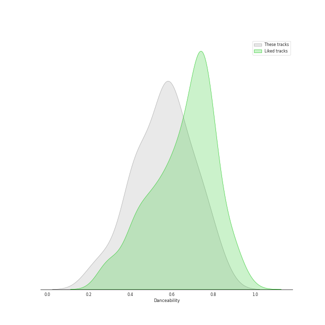
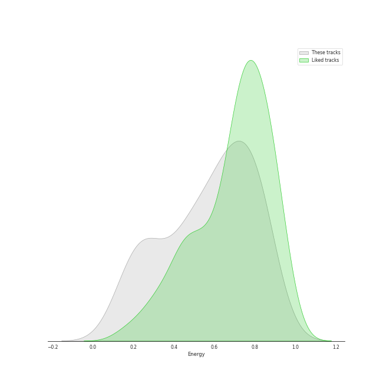
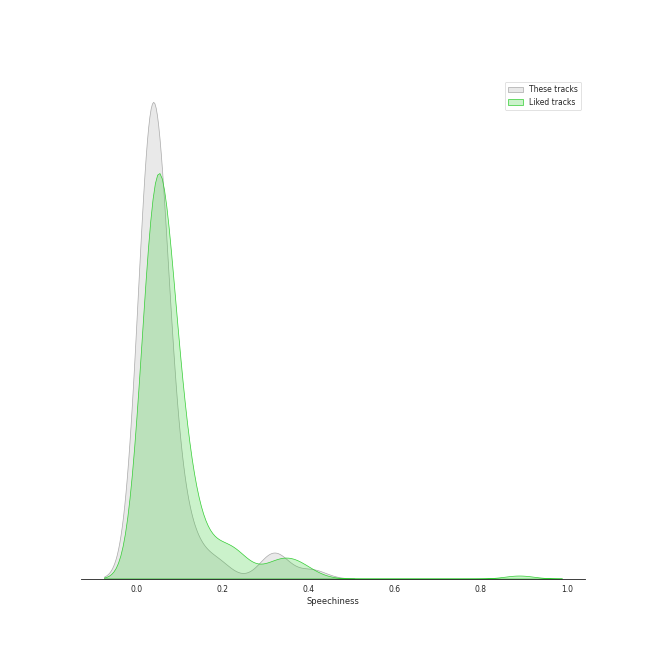
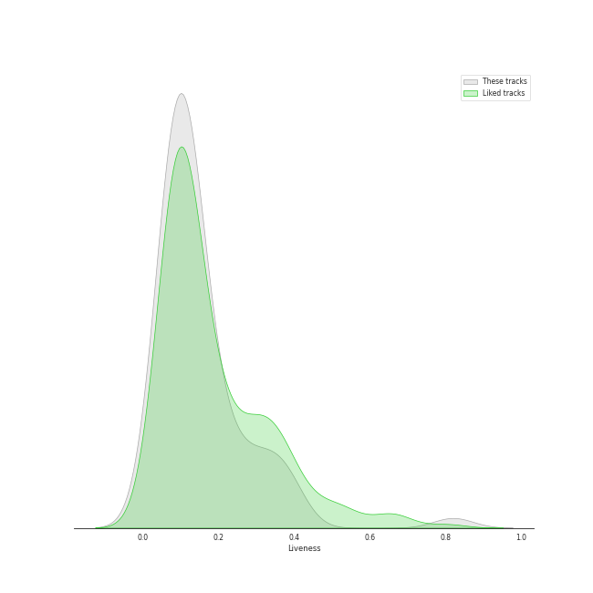

# Audio Features for Tarps

## Danceability

| 10 most Danceable tracks | 10 least Danceable tracks |
|:---|:---|
| Crazy (0.835) | Already Gone (0.209) |
| Where Is The Love? (0.834) | Desperado - 2013 Remaster (0.228) |
| Dreamer (0.802) | Chariot (0.281) |
| One Step At a Time (0.766) | Poison & Wine (0.285) |
| Settle Down (0.763) | Yesterday - Remastered 2009 (0.332) |
| Blank Space (0.753) | Something - Remastered 2009 (0.396) |
| No Scrubs (0.743) | Can't Help Falling in Love (0.396) |
| Rolling in the Deep (0.73) | I Thought She Knew (0.397) |
| This Love (0.712) | Chandelier (0.399) |
| Disturbia (0.707) | Take It All (0.415) |

## Energy

| 10 most Energetic tracks | 10 least Energetic tracks |
|:---|:---|
| Green Light (feat. André 3000) (0.882) | Blackbird - Remastered 2009 (0.127) |
| Already Gone (0.872) | Lullabye (Goodnight, My Angel) (0.157) |
| This Love (0.862) | Yesterday - Remastered 2009 (0.179) |
| Jesus Walks (0.834) | Poison & Wine (0.186) |
| Umbrella (0.829) | Dreamer (0.223) |
| Cowboy Casanova (0.82) | Desperado - 2013 Remaster (0.224) |
| Disturbia (0.813) | Crazy Love (0.236) |
| Mambo No. 5 (a Little Bit of...) (0.807) | The Way You Look Tonight (0.24) |
| Home (0.804) | Take It All (0.266) |
| Gonna Get Over You (0.799) | I Thought She Knew (0.272) |

## Speechiness

| 10 most Speechy tracks | 10 least Speechy tracks |
|:---|:---|
| Mambo No. 5 (a Little Bit of...) (0.408) | The Scientist (0.0243) |
| Jesus Walks (0.323) | Old Fashioned (0.0246) |
| So Sick (0.31) | Take A Chance On Me (0.0257) |
| Where Is The Love? (0.178) | Chasing Cars (0.0274) |
| Umbrella (0.134) | Can't Help Falling in Love (0.0275) |
| Home (0.128) | Poison & Wine (0.0288) |
| Green Light (feat. André 3000) (0.119) | You Lie (0.0289) |
| Carolina State of Mind (0.101) | One Step At a Time (0.0289) |
| No Scrubs (0.0953) | Rolling in the Deep (0.0298) |
| Crazy Love (0.0819) | Gonna Get Over You (0.0301) |

## Acousticness

| 10 most Acoustic tracks | 10 least Acoustic tracks |
|:---|:---|
| Take It All (0.957) | Save Tonight (9.24e-05) |
| Lullabye (Goodnight, My Angel) (0.948) | I Knew You Were Trouble. (0.00454) |
| Desperado - 2013 Remaster (0.946) | Umbrella (0.00864) |
| Can't Help Falling in Love (0.941) | I Will Wait (0.00974) |
| I Thought She Knew (0.915) | Can't Tell Me Nothing (0.0122) |
| Yesterday - Remastered 2009 (0.879) | Crazy (0.0172) |
| Crazy Love (0.85) | Chandelier (0.0197) |
| The Way You Look Tonight (0.798) | Gonna Get Over You (0.0199) |
| That Wasn't Me (0.785) | No Scrubs (0.0251) |
| Poison & Wine (0.756) | Cowboy Casanova (0.0328) |

## Instrumentalness

| 10 most Instrumental tracks | 10 least Instrumental tracks |
|:---|:---|
| Crazy (0.0577) | The Lighthouse's Tale (0.0) |
| I Will Wait (0.00717) | Chariot (0.0) |
| No Scrubs (0.000717) | I Thought She Knew (0.0) |
| The Boxer (0.000339) | The Way You Look Tonight (0.0) |
| Desperado - 2013 Remaster (0.000222) | Can't Tell Me Nothing (0.0) |
| Can't Help Falling in Love (0.000196) | Where Is The Love? (0.0) |
| Crazy Love (8.92e-05) | I'm Yours (0.0) |
| Poison & Wine (6.71e-05) | Rolling in the Deep (0.0) |
| Chasing Cars (6.47e-05) | Disturbia (0.0) |
| Chandelier (6.07e-05) | Wrecking Ball (0.0) |

## Liveness

| 10 most Live tracks | 10 least Live tracks |
|:---|:---|
| Can't Tell Me Nothing (0.82) | One Step At a Time (0.0384) |
| Home (0.393) | I Knew You Were Trouble. (0.0398) |
| Never Let Me Go (0.383) | Umbrella (0.0426) |
| Chariot (0.37) | Rolling in the Deep (0.0473) |
| F**kin' Perfect (0.362) | Blackbird - Remastered 2009 (0.0573) |
| Old Fashioned (0.36) | The Lighthouse's Tale (0.0601) |
| Jesus Walks (0.317) | No Scrubs (0.0685) |
| I Will Wait (0.312) | Chandelier (0.0685) |
| Mambo No. 5 (a Little Bit of...) (0.306) | Settle Down (0.0733) |
| Desperado - 2013 Remaster (0.273) | Already Gone (0.0768) |

## Valence

| 10 most Happy tracks | 10 least Happy tracks |
|:---|:---|
| Take A Chance On Me (0.924) | Can't Tell Me Nothing (0.102) |
| My Guy (0.91) | Chasing Cars (0.144) |
| Mambo No. 5 (a Little Bit of...) (0.892) | Desperado - 2013 Remaster (0.18) |
| This Love (0.809) | I Thought She Knew (0.198) |
| Where Is The Love? (0.809) | Poison & Wine (0.203) |
| Home (0.795) | The Scientist (0.213) |
| Mean (0.789) | Lullabye (Goodnight, My Angel) (0.22) |
| Green Light (feat. André 3000) (0.762) | That Wasn't Me (0.249) |
| Disturbia (0.722) | Dreamer (0.252) |
| Jesus Walks (0.715) | Never Let Me Go (0.253) |

## Tempo

| 10 most Fast tracks | 10 least Fast tracks |
|:---|:---|
| Carolina State of Mind (180.209) | Desperado - 2013 Remaster (60.3) |
| Mambo No. 5 (a Little Bit of...) (174.06) | Lullabye (Goodnight, My Angel) (76.48) |
| Umbrella (174.028) | I Knew You Were Trouble. (77.019) |
| You Lie (170.939) | Green Light (feat. André 3000) (77.506) |
| Chariot (167.172) | Crazy Love (77.539) |
| Mean (163.974) | Already Gone (78.139) |
| Poison & Wine (153.85) | I Thought She Knew (79.416) |
| I'm Yours (150.96) | Can't Tell Me Nothing (80.029) |
| The Scientist (146.277) | Home (82.288) |
| Never Let Me Go (145.197) | Old Fashioned (85.043) |
