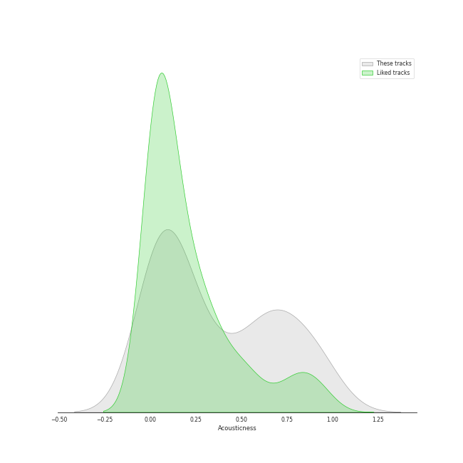
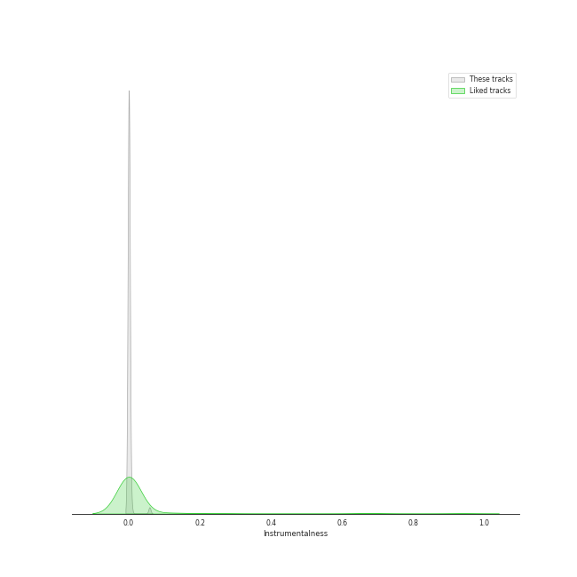
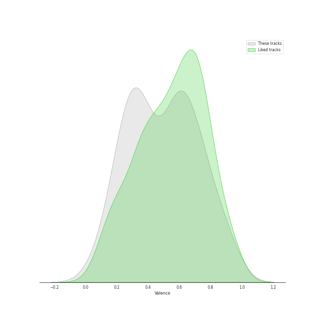
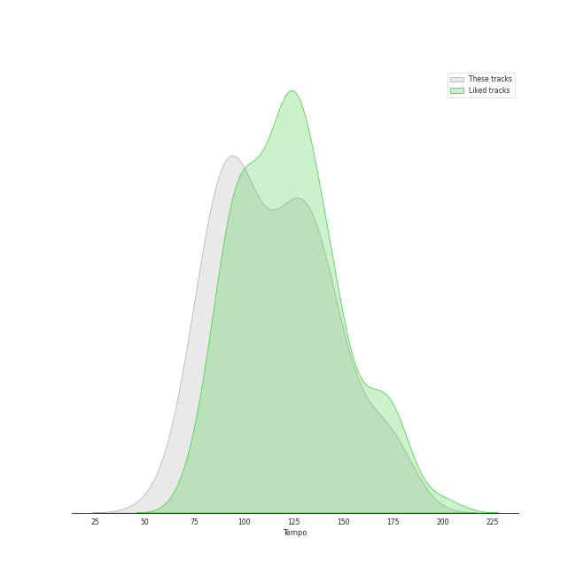

# Track Features for Tarps

## Danceability

| ​ | 10 most Danceable tracks | ​​ | 10 least Danceable tracks |
|:---|:---|:---|:---|
|  | Crazy (0.835) |  | Already Gone (0.209) |
|  | Where Is The Love? (0.834) |  | Desperado - 2013 Remaster (0.228) |
|  | Dreamer (0.802) |  | Chariot (0.281) |
|  | One Step At a Time (0.766) |  | Poison & Wine (0.285) |
|  | Settle Down (0.763) |  | Yesterday - Remastered 2009 (0.332) |
|  | Blank Space (0.753) |  | Something - Remastered 2009 (0.396) |
|  | No Scrubs (0.743) |  | Can't Help Falling in Love (0.396) |
|  | Rolling in the Deep (0.73) |  | I Thought She Knew (0.397) |
|  | This Love (0.712) |  | Chandelier (0.399) |
|  | Disturbia (0.707) |  | Take It All (0.415) |

## Energy

| ​ | 10 most Energetic tracks | ​​ | 10 least Energetic tracks |
|:---|:---|:---|:---|
|  | Green Light (feat. André 3000) (0.882) |  | Blackbird - Remastered 2009 (0.127) |
|  | Already Gone (0.872) |  | Lullabye (Goodnight, My Angel) (0.157) |
|  | This Love (0.862) |  | Yesterday - Remastered 2009 (0.179) |
|  | Jesus Walks (0.834) |  | Poison & Wine (0.186) |
|  | Umbrella (0.829) |  | Dreamer (0.223) |
|  | Cowboy Casanova (0.82) |  | Desperado - 2013 Remaster (0.224) |
|  | Disturbia (0.813) |  | Crazy Love (0.236) |
|  | Mambo No. 5 (a Little Bit of...) (0.807) |  | The Way You Look Tonight (0.24) |
|  | Home (0.804) |  | Take It All (0.266) |
|  | Gonna Get Over You (0.799) |  | I Thought She Knew (0.272) |

## Speechiness

| ​ | 10 most Speechy tracks | ​​ | 10 least Speechy tracks |
|:---|:---|:---|:---|
|  | Mambo No. 5 (a Little Bit of...) (0.408) |  | The Scientist (0.0243) |
|  | Jesus Walks (0.323) |  | Old Fashioned (0.0246) |
|  | So Sick (0.31) |  | Take A Chance On Me (0.0257) |
|  | Where Is The Love? (0.178) |  | Chasing Cars (0.0274) |
|  | Umbrella (0.134) |  | Can't Help Falling in Love (0.0275) |
|  | Home (0.128) |  | Poison & Wine (0.0288) |
|  | Green Light (feat. André 3000) (0.119) |  | You Lie (0.0289) |
|  | Carolina State of Mind (0.101) |  | One Step At a Time (0.0289) |
|  | No Scrubs (0.0953) |  | Rolling in the Deep (0.0298) |
|  | Crazy Love (0.0819) |  | Gonna Get Over You (0.0301) |

## Acousticness

| ​ | 10 most Acoustic tracks | ​​ | 10 least Acoustic tracks |
|:---|:---|:---|:---|
|  | Take It All (0.957) |  | Save Tonight (9.24e-05) |
|  | Lullabye (Goodnight, My Angel) (0.948) |  | I Knew You Were Trouble. (0.00454) |
|  | Desperado - 2013 Remaster (0.946) |  | Umbrella (0.00864) |
|  | Can't Help Falling in Love (0.941) |  | I Will Wait (0.00974) |
|  | I Thought She Knew (0.915) |  | Can't Tell Me Nothing (0.0122) |
|  | Yesterday - Remastered 2009 (0.879) |  | Crazy (0.0172) |
|  | Crazy Love (0.85) |  | Chandelier (0.0197) |
|  | The Way You Look Tonight (0.798) |  | Gonna Get Over You (0.0199) |
|  | That Wasn't Me (0.785) |  | No Scrubs (0.0251) |
|  | Poison & Wine (0.756) |  | Cowboy Casanova (0.0328) |

## Instrumentalness

| ​ | 10 most Instrumental tracks | ​​ | 10 least Instrumental tracks |
|:---|:---|:---|:---|
|  | Crazy (0.0577) |  | The Lighthouse's Tale (0.0) |
|  | I Will Wait (0.00717) |  | Chariot (0.0) |
|  | No Scrubs (0.000717) |  | I Thought She Knew (0.0) |
|  | The Boxer (0.000339) |  | The Way You Look Tonight (0.0) |
|  | Desperado - 2013 Remaster (0.000222) |  | Can't Tell Me Nothing (0.0) |
|  | Can't Help Falling in Love (0.000196) |  | Where Is The Love? (0.0) |
|  | Crazy Love (8.92e-05) |  | I'm Yours (0.0) |
|  | Poison & Wine (6.71e-05) |  | Rolling in the Deep (0.0) |
|  | Chasing Cars (6.47e-05) |  | Disturbia (0.0) |
|  | Chandelier (6.07e-05) |  | Wrecking Ball (0.0) |

## Liveness

| ​ | 10 most Live tracks | ​​ | 10 least Live tracks |
|:---|:---|:---|:---|
|  | Can't Tell Me Nothing (0.82) |  | One Step At a Time (0.0384) |
|  | Home (0.393) |  | I Knew You Were Trouble. (0.0398) |
|  | Never Let Me Go (0.383) |  | Umbrella (0.0426) |
|  | Chariot (0.37) |  | Rolling in the Deep (0.0473) |
|  | F**kin' Perfect (0.362) |  | Blackbird - Remastered 2009 (0.0573) |
|  | Old Fashioned (0.36) |  | The Lighthouse's Tale (0.0601) |
|  | Jesus Walks (0.317) |  | No Scrubs (0.0685) |
|  | I Will Wait (0.312) |  | Chandelier (0.0685) |
|  | Mambo No. 5 (a Little Bit of...) (0.306) |  | Settle Down (0.0733) |
|  | Desperado - 2013 Remaster (0.273) |  | Already Gone (0.0768) |

## Valence

| ​ | 10 most Happy tracks | ​​ | 10 least Happy tracks |
|:---|:---|:---|:---|
|  | Take A Chance On Me (0.924) |  | Can't Tell Me Nothing (0.102) |
|  | My Guy (0.91) |  | Chasing Cars (0.144) |
|  | Mambo No. 5 (a Little Bit of...) (0.892) |  | Desperado - 2013 Remaster (0.18) |
|  | This Love (0.809) |  | I Thought She Knew (0.198) |
|  | Where Is The Love? (0.809) |  | Poison & Wine (0.203) |
|  | Home (0.795) |  | The Scientist (0.213) |
|  | Mean (0.789) |  | Lullabye (Goodnight, My Angel) (0.22) |
|  | Green Light (feat. André 3000) (0.762) |  | That Wasn't Me (0.249) |
|  | Disturbia (0.722) |  | Dreamer (0.252) |
|  | Jesus Walks (0.715) |  | Never Let Me Go (0.253) |

## Tempo

| ​ | 10 most Fast tracks | ​​ | 10 least Fast tracks |
|:---|:---|:---|:---|
|  | Carolina State of Mind (180.209) |  | Desperado - 2013 Remaster (60.3) |
|  | Mambo No. 5 (a Little Bit of...) (174.06) |  | Lullabye (Goodnight, My Angel) (76.48) |
|  | Umbrella (174.028) |  | I Knew You Were Trouble. (77.019) |
|  | You Lie (170.939) |  | Green Light (feat. André 3000) (77.506) |
|  | Chariot (167.172) |  | Crazy Love (77.539) |
|  | Mean (163.974) |  | Already Gone (78.139) |
|  | Poison & Wine (153.85) |  | I Thought She Knew (79.416) |
|  | I'm Yours (150.96) |  | Can't Tell Me Nothing (80.029) |
|  | The Scientist (146.277) |  | Home (82.288) |
|  | Never Let Me Go (145.197) |  | Old Fashioned (85.043) |
