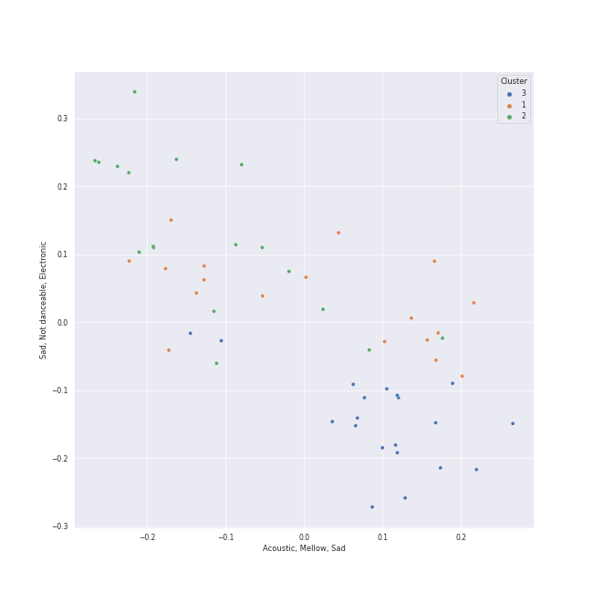

# Clusters in Tarps

## Cluster #1

20 tracks

| Art | Track | Album | Artists | Label | Rank | 💚 | 🔗 |
|:---|:---|:---|:---|:---|---:|:---|:---|
|  | Yesterday - Remastered 2009 | Help! (Remastered) | [The Beatles](../../../../artists/the_beatles/overview.md) | [EMI Catalogue](../../../../labels/emi_catalogue) | nan | 💚 | [🔗](https://open.spotify.com/track/3BQHpFgAp4l80e1XslIjNI) |
|  | Crazy Love | The Essential Van Morrison | Van Morrison | Legacy Recordings | nan | | [🔗](https://open.spotify.com/track/04glHdRn4SgTADxKoKzOoO) |
|  | The Lighthouse's Tale | Nickel Creek | Nickel Creek | Sugar Hill Records | nan | 💚 | [🔗](https://open.spotify.com/track/05HjafWVI238CLw5RDNkas) |
|  | Lullabye (Goodnight, My Angel) | River Of Dreams | [Billy Joel](../../../../artists/billy_joel/overview.md) | [Columbia](../../../../labels/columbia) | nan | 💚 | [🔗](https://open.spotify.com/track/4cURHmiuYii52BVbhrGbv0) |
|  | Take It All | 21 | [Adele](../../../../artists/adele/overview.md) | [XL Recordings](../../../../labels/xl_recordings) | 254 | 💚 | [🔗](https://open.spotify.com/track/08YJEcxGtYXwCGqXMZDiyQ) |
|  | The Scientist | A Rush of Blood to the Head | [Coldplay](../../../../artists/coldplay/overview.md) | Parlophone Records Limited | nan | 💚 | [🔗](https://open.spotify.com/track/75JFxkI2RXiU7L9VXzMkle) |
|  | That Wasn't Me | Bear Creek | Brandi Carlile | [Columbia](../../../../labels/columbia) | nan | 💚 | [🔗](https://open.spotify.com/track/6iqAJh3X8bf94eo4reme5L) |
|  | I Thought She Knew | No Strings Attached | *NSYNC | [Jive](../../../../labels/jive) | nan | 💚 | [🔗](https://open.spotify.com/track/0b4u7IhBY61kSmS8wVIPYg) |
|  | Stone Cold | Confident | Demi Lovato | [Hollywood Records](../../../../labels/hollywood_records) | nan | 💚 | [🔗](https://open.spotify.com/track/3by8IfnW9dZ2t4pZw1WVxz) |
|  | Can't Help Falling in Love | Blue Hawaii | Elvis Presley | [Legacy](../../../../labels/legacy), [RCA Records Label](../../../../labels/rca_records_label) | nan | | [🔗](https://open.spotify.com/track/44AyOl4qVkzS48vBsbNXaC) |
## Cluster #2

33 tracks

| Art | Track | Album | Artists | Label | Rank | 💚 | 🔗 |
|:---|:---|:---|:---|:---|---:|:---|:---|
|  | Gonna Get Over You | Kaleidoscope Heart | [Sara Bareilles](../../../../artists/sara_bareilles/overview.md) | [Epic](../../../../labels/epic) | nan | 💚 | [🔗](https://open.spotify.com/track/45ou2UBThJA4WtFGIiYLI3) |
|  | Blank Space | 1989 | [Taylor Swift](../../../../artists/taylor_swift/overview.md) | [Big Machine Records, LLC](../../../../labels/big_machine_records) | nan | 💚 | [🔗](https://open.spotify.com/track/1p80LdxRV74UKvL8gnD7ky) |
|  | I Knew You Were Trouble. | Red | [Taylor Swift](../../../../artists/taylor_swift/overview.md) | [Big Machine Records, LLC](../../../../labels/big_machine_records) | nan | | [🔗](https://open.spotify.com/track/72jCZdH0Lhg93z6Z4hBjgj) |
|  | Disturbia | Good Girl Gone Bad: Reloaded | [Rihanna](../../../../artists/rihanna/overview.md) | [Def Jam Recordings](../../../../labels/def_jam_recordings) | nan | 💚 | [🔗](https://open.spotify.com/track/2VOomzT6VavJOGBeySqaMc) |
|  | Jesus Walks | The College Dropout | Kanye West | Roc-A-Fella | nan | | [🔗](https://open.spotify.com/track/5g1vtHqi9uV7xtYeCcFOBx) |
|  | No Scrubs | Fanmail | TLC | Arista/LaFace Records | nan | | [🔗](https://open.spotify.com/track/1KGi9sZVMeszgZOWivFpxs) |
|  | This Love | Songs About Jane | [Maroon 5](../../../../artists/maroon_5/overview.md) | [Interscope Records*](../../../../labels/interscope_records) | nan | 💚 | [🔗](https://open.spotify.com/track/6YgV0EF8xJMZz0Zm6BTaT4) |
|  | Save Tonight | Desireless | Eagle-Eye Cherry | Work | nan | | [🔗](https://open.spotify.com/track/1t2Hq2WIBcZINOEnK6mdJG) |
|  | HandClap | Fitz and The Tantrums (Deluxe Edition) | Fitz and The Tantrums | Elektra (NEK) | nan | 💚 | [🔗](https://open.spotify.com/track/4qRaZYiaOsSvWC7VgcxrI0) |
|  | One Step At a Time | Jordin Sparks | Jordin Sparks | 19 Recordings | nan | | [🔗](https://open.spotify.com/track/5o4W6yWSJD9e9Ea8YC9WjF) |
## Cluster #3

13 tracks

| Art | Track | Album | Artists | Label | Rank | 💚 | 🔗 |
|:---|:---|:---|:---|:---|---:|:---|:---|
|  | Something - Remastered 2009 | Abbey Road (Remastered) | [The Beatles](../../../../artists/the_beatles/overview.md) | [EMI Catalogue](../../../../labels/emi_catalogue) | nan | 💚 | [🔗](https://open.spotify.com/track/0pNeVovbiZHkulpGeOx1Gj) |
|  | Chariot | Chariot - Stripped | Gavin DeGraw | J Records | nan | | [🔗](https://open.spotify.com/track/08kTO4EW0jb07zNsCNM83w) |
|  | F**kin' Perfect | Greatest Hits...So Far!!! | P!nk | LaFace Records | nan | 💚 | [🔗](https://open.spotify.com/track/3MGJF1CDFGfjXESL2Heva0) |
|  | Never Let Me Go | Ceremonials (Deluxe Edition) | [Florence + The Machine](../../../../artists/florence_+_the_machine/overview.md) | [Universal-Island Records Ltd.](../../../../labels/universal-island_records_ltd_) | 479 | 💚 | [🔗](https://open.spotify.com/track/6cC9RY7MoUx5z3aHjDTNI6) |
|  | Back To Black | Back To Black | Amy Winehouse | [Universal-Island Records Ltd.](../../../../labels/universal-island_records_ltd_) | 688 | 💚 | [🔗](https://open.spotify.com/track/30FURVTCpbKyykjSEQzGkH) |
|  | I Will Wait | Babel (Deluxe Version) | Mumford & Sons | Glassnote Entertainment Group LLC | nan | 💚 | [🔗](https://open.spotify.com/track/1fXiYSWmkKJfRKMegCkI11) |
|  | Old Fashioned | The Lady Killer | CeeLo Green | Radiculture/Elektra | nan | 💚 | [🔗](https://open.spotify.com/track/3lVoGZoKXQUElnJbU668Jf) |
|  | Light On | Heard It In A Past Life | Maggie Rogers | [Capitol Records](../../../../labels/capitol_records) | nan | 💚 | [🔗](https://open.spotify.com/track/6UnCGAEmrbGIOSmGRZQ1M2) |
|  | Barton Hollow | Barton Hollow | The Civil Wars | sensibility recordings | nan | 💚 | [🔗](https://open.spotify.com/track/6ZOBY9RG2tcxXX0ohKtfRc) |
|  | Chasing Cars | Eyes Open | Snow Patrol | [Polydor Records](../../../../labels/polydor_records) | nan | | [🔗](https://open.spotify.com/track/5hnyJvgoWiQUYZttV4wXy6) |