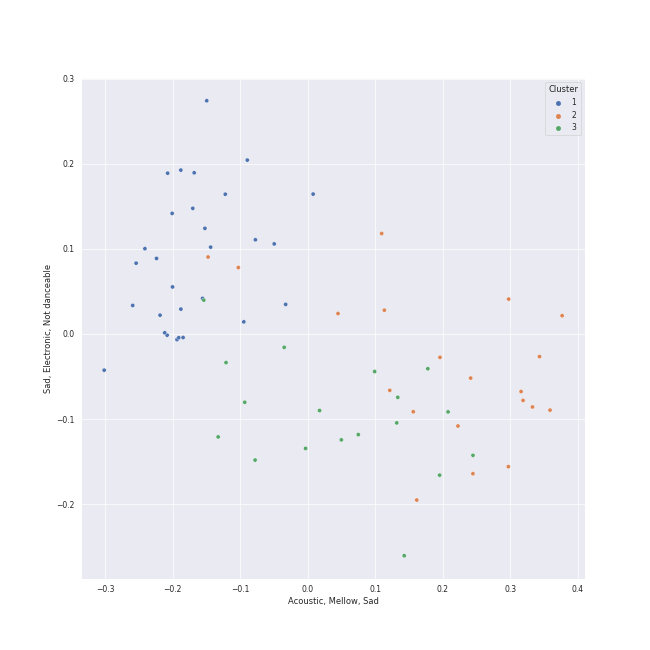

# Clusters in Tarps

## Cluster #1

27 tracks

| Art | Track | Album | Artists | Label | Rank | 💚 | 🔗 |
|:---|:---|:---|:---|:---|---:|:---|:---|
|  | Gonna Get Over You | Kaleidoscope Heart | [Sara Bareilles](../../../../artists/sara_bareilles/overview.md) | [Epic](../../../../labels/epic) | nan | 💚 | [🔗](https://open.spotify.com/track/45ou2UBThJA4WtFGIiYLI3) |
|  | Blank Space | 1989 | [Taylor Swift](../../../../artists/taylor_swift/overview.md) | [Big Machine Records, LLC](../../../../labels/big_machine_records) | nan | 💚 | [🔗](https://open.spotify.com/track/1p80LdxRV74UKvL8gnD7ky) |
|  | I Knew You Were Trouble. | Red | [Taylor Swift](../../../../artists/taylor_swift/overview.md) | [Big Machine Records, LLC](../../../../labels/big_machine_records) | nan | | [🔗](https://open.spotify.com/track/72jCZdH0Lhg93z6Z4hBjgj) |
|  | Disturbia | Good Girl Gone Bad: Reloaded | [Rihanna](../../../../artists/rihanna/overview.md) | [Def Jam Recordings](../../../../labels/def_jam_recordings) | nan | 💚 | [🔗](https://open.spotify.com/track/2VOomzT6VavJOGBeySqaMc) |
|  | Umbrella | Good Girl Gone Bad: Reloaded | [Rihanna](../../../../artists/rihanna/overview.md), JAY-Z | [Def Jam Recordings](../../../../labels/def_jam_recordings) | nan | | [🔗](https://open.spotify.com/track/49FYlytm3dAAraYgpoJZux) |
|  | Rolling in the Deep | 21 | [Adele](../../../../artists/adele/overview.md) | [XL Recordings](../../../../labels/xl_recordings) | nan | | [🔗](https://open.spotify.com/track/1c8gk2PeTE04A1pIDH9YMk) |
|  | Cowboy Casanova | Play On | Carrie Underwood | 19 Recordings Limited / Arista Nashville | nan | 💚 | [🔗](https://open.spotify.com/track/6OqdF0vHI9xkqswI7EK0cD) |
|  | No Scrubs | Fanmail | TLC | Arista/LaFace Records | nan | | [🔗](https://open.spotify.com/track/1KGi9sZVMeszgZOWivFpxs) |
|  | Save Tonight | Desireless | Eagle-Eye Cherry | Work | nan | | [🔗](https://open.spotify.com/track/1t2Hq2WIBcZINOEnK6mdJG) |
|  | HandClap | Fitz and The Tantrums (Deluxe Edition) | Fitz and The Tantrums | Elektra (NEK) | nan | 💚 | [🔗](https://open.spotify.com/track/4qRaZYiaOsSvWC7VgcxrI0) |
## Cluster #2

26 tracks

| Art | Track | Album | Artists | Label | Rank | 💚 | 🔗 |
|:---|:---|:---|:---|:---|---:|:---|:---|
|  | Golden Slumbers - Remastered 2009 | Abbey Road (Remastered) | [The Beatles](../../../../artists/the_beatles/overview.md) | [EMI Catalogue](../../../../labels/emi_catalogue) | nan | 💚 | [🔗](https://open.spotify.com/track/01SfTM5nfCou5gQL70r6gs) |
|  | The Lighthouse's Tale | Nickel Creek | Nickel Creek | Sugar Hill Records | nan | 💚 | [🔗](https://open.spotify.com/track/05HjafWVI238CLw5RDNkas) |
|  | Vienna | The Stranger (Legacy Edition) | [Billy Joel](../../../../artists/billy_joel/overview.md) | [Columbia](../../../../labels/columbia), [Legacy](../../../../labels/legacy) | nan | 💚 | [🔗](https://open.spotify.com/track/4U45aEWtQhrm8A5mxPaFZ7) |
|  | The Scientist | A Rush of Blood to the Head | [Coldplay](../../../../artists/coldplay/overview.md) | Parlophone Records Limited | nan | 💚 | [🔗](https://open.spotify.com/track/75JFxkI2RXiU7L9VXzMkle) |
|  | That Wasn't Me | Bear Creek | Brandi Carlile | [Columbia](../../../../labels/columbia) | nan | 💚 | [🔗](https://open.spotify.com/track/6iqAJh3X8bf94eo4reme5L) |
|  | I Thought She Knew | No Strings Attached | *NSYNC | [Jive](../../../../labels/jive) | nan | 💚 | [🔗](https://open.spotify.com/track/0b4u7IhBY61kSmS8wVIPYg) |
|  | Stone Cold | Confident | Demi Lovato | [Hollywood Records](../../../../labels/hollywood_records) | nan | 💚 | [🔗](https://open.spotify.com/track/3by8IfnW9dZ2t4pZw1WVxz) |
|  | Wrecking Ball | Bangerz (Deluxe Version) | Miley Cyrus | [RCA Records Label](../../../../labels/rca_records_label) | 350 | 💚 | [🔗](https://open.spotify.com/track/2vwlzO0Qp8kfEtzTsCXfyE) |
|  | Poison & Wine | Barton Hollow | The Civil Wars | sensibility recordings | 431 | 💚 | [🔗](https://open.spotify.com/track/4BFudy2Zbryi9a1KFad66B) |
|  | Unknown (To You) | Village | Jacob Banks | UMGRI Interscope | nan | 💚 | [🔗](https://open.spotify.com/track/4jDDaKTqcZQWvgubuW6N7l) |
## Cluster #3

14 tracks

| Art | Track | Album | Artists | Label | Rank | 💚 | 🔗 |
|:---|:---|:---|:---|:---|---:|:---|:---|
|  | Mean | Speak Now | [Taylor Swift](../../../../artists/taylor_swift/overview.md) | [Big Machine Records, LLC](../../../../labels/big_machine_records) | nan | | [🔗](https://open.spotify.com/track/5yEPktRqvIhko5QFF3aBhQ) |
|  | I'm Yours | We Sing. We Dance. We Steal Things. | Jason Mraz | [Atlantic Records/ATG](../../../../labels/atlantic_records) | nan | 💚 | [🔗](https://open.spotify.com/track/1EzrEOXmMH3G43AXT1y7pA) |
|  | The Boxer | Bridge Over Troubled Water | [Simon & Garfunkel](../../../../artists/simon___garfunkel/overview.md) | [Columbia](../../../../labels/columbia) | nan | 💚 | [🔗](https://open.spotify.com/track/76TZCvJ8GitQ2FA1q5dKu0) |
|  | G Train | Searching | Thirdstory | Verve | nan | 💚 | [🔗](https://open.spotify.com/track/0vYIpioP94c4gwxOyopklE) |
|  | My Girl | The Temptations Sing Smokey | The Temptations | [MOTOWN](../../../../labels/motown), [UNI](../../../../labels/uni) | nan | 💚 | [🔗](https://open.spotify.com/track/745H5CctFr12Mo7cqa1BMH) |
|  | My Guy | Mary Wells Sings My Guy | Mary Wells | [MOTOWN](../../../../labels/motown), [UNI](../../../../labels/uni) | nan | 💚 | [🔗](https://open.spotify.com/track/4591VqUIXysNlmI5NcAIUd) |
|  | Come Go With Me | Come Go With Me: The Best Of The Del-Vikings | The Del-Vikings | [Geffen](../../../../labels/geffen) | nan | | [🔗](https://open.spotify.com/track/4IYyGIbMS5ZkxDXGfPIrXr) |
|  | So Sick | In My Own Words | Ne-Yo | Def Soul | nan | | [🔗](https://open.spotify.com/track/6brl7bwOHmGFkNw3MBqssT) |
|  | Can't Take My Eyes off You | The Very Best of Frankie Valli & The 4 Seasons | Frankie Valli | [Rhino](../../../../labels/rhino) | nan | 💚 | [🔗](https://open.spotify.com/track/6ft9PAgNOjmZ2kFVP7LGqb) |
|  | Title of the Song | The Life and Times of Mike Fanning | Da Vinci's Notebook | Uncle Buford Records | nan | | [🔗](https://open.spotify.com/track/7gy5okcNSFHjSDv4b6jt5g) |