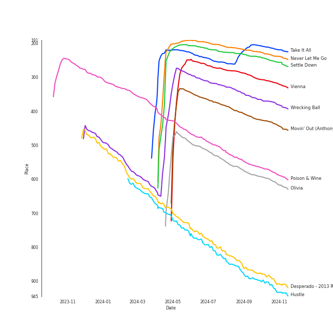
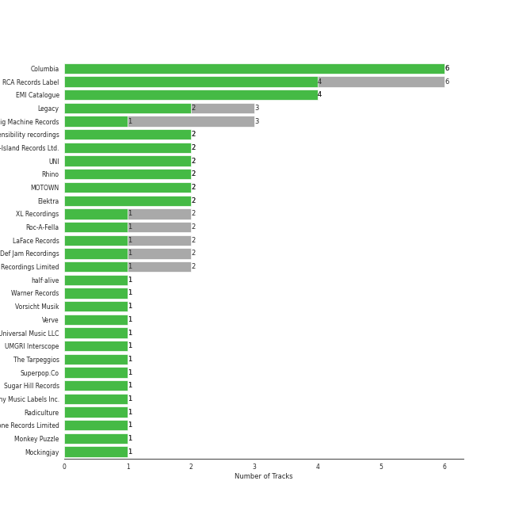
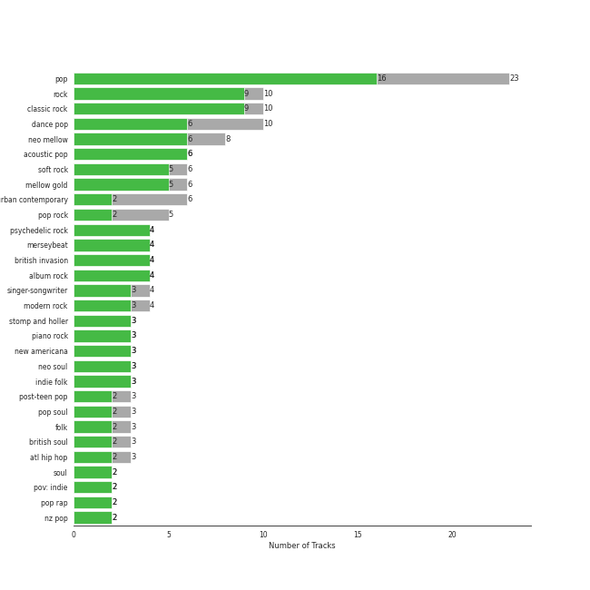
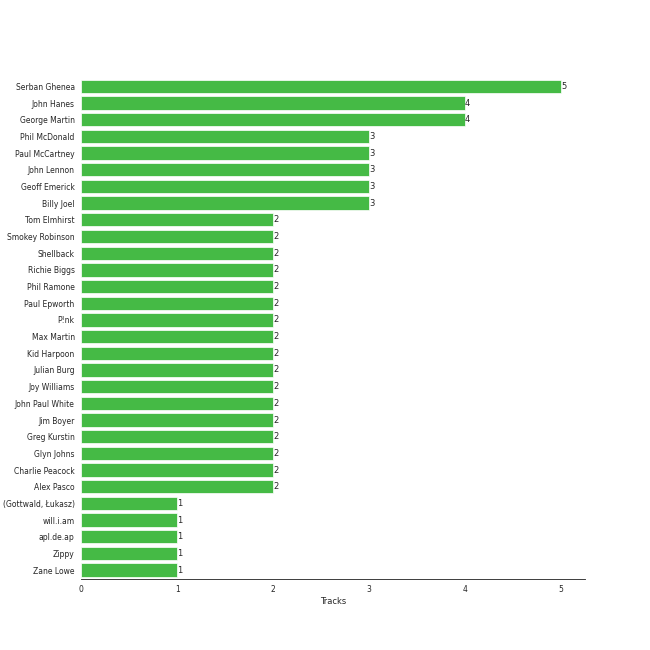
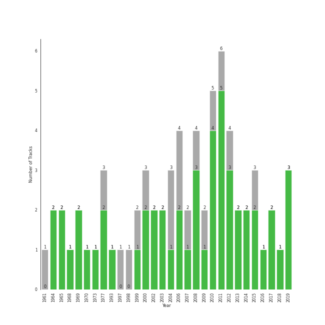

# Tarps

[69 tracks (52 liked) 🔗](https://open.spotify.com/playlist/7i18RgdYPOv5E01eGmtRCo)

[See Track Features](audio_features.md)

[See Clusters](clusters/overview.md)

## Top Artists

| Art | Tracks | 💚 | Artist | 🔗 |
|:---|---:|---:|:---|:---|
|  | 4 | 4 | [The Beatles](../../artists/the_beatles/overview.md) | [🔗](https://open.spotify.com/artist/3WrFJ7ztbogyGnTHbHJFl2) |
|  | 3 | 3 | [Billy Joel](../../artists/billy_joel/overview.md) | [🔗](https://open.spotify.com/artist/6zFYqv1mOsgBRQbae3JJ9e) |
|  | 2 | 2 | The Civil Wars | [🔗](https://open.spotify.com/artist/6J7rw7NELJUCThPbAfyLIE) |
|  | 2 | 2 | P!nk | [🔗](https://open.spotify.com/artist/1KCSPY1glIKqW2TotWuXOR) |
|  | 3 | 1 | [Taylor Swift](../../artists/taylor_swift/overview.md) | [🔗](https://open.spotify.com/artist/06HL4z0CvFAxyc27GXpf02) |
|  | 2 | 1 | [Rihanna](../../artists/rihanna/overview.md) | [🔗](https://open.spotify.com/artist/5pKCCKE2ajJHZ9KAiaK11H) |
|  | 2 | 1 | Kanye West | [🔗](https://open.spotify.com/artist/5K4W6rqBFWDnAN6FQUkS6x) |
|  | 2 | 1 | [Adele](../../artists/adele/overview.md) | [🔗](https://open.spotify.com/artist/4dpARuHxo51G3z768sgnrY) |
|  | 1 | 1 | half•alive | [🔗](https://open.spotify.com/artist/7sOR7gk6XUlGnxj3p9F54k) |
|  | 1 | 1 | Thirdstory | [🔗](https://open.spotify.com/artist/7GJbWH8vhhuW22707B8HsW) |

See all 59 artists

| Art | Tracks | 💚 | Artist | 🔗 |
|:---|---:|---:|:---|:---|
|  | 1 | 1 | The Band Perry | [🔗](https://open.spotify.com/artist/75FnCoo4FBxH5K1Rrx0k5A) |
|  | 1 | 1 | André 3000 | [🔗](https://open.spotify.com/artist/74V3dE1a51skRkdII8y2C6) |
|  | 1 | 1 | [Simon & Garfunkel](../../artists/simon___garfunkel/overview.md) | [🔗](https://open.spotify.com/artist/70cRZdQywnSFp9pnc2WTCE) |
|  | 1 | 1 | [Kimbra](../../artists/kimbra/overview.md) | [🔗](https://open.spotify.com/artist/6hk7Yq1DU9QcCCrz9uc0Ti) |
|  | 1 | 1 | Demi Lovato | [🔗](https://open.spotify.com/artist/6S2OmqARrzebs0tKUEyXyp) |
|  | 1 | 1 | Amy Winehouse | [🔗](https://open.spotify.com/artist/6Q192DXotxtaysaqNPy5yR) |
|  | 1 | 1 | *NSYNC | [🔗](https://open.spotify.com/artist/6Ff53KvcvAj5U7Z1vojB5o) |
|  | 1 | 1 | John Legend | [🔗](https://open.spotify.com/artist/5y2Xq6xcjJb2jVM54GHK3t) |
|  | 1 | 1 | CeeLo Green | [🔗](https://open.spotify.com/artist/5nLYd9ST4Cnwy6NHaCxbj8) |
|  | 1 | 1 | Miley Cyrus | [🔗](https://open.spotify.com/artist/5YGY8feqx7naU7z4HrwZM6) |
|  | 1 | 1 | [Sia](../../artists/sia/overview.md) | [🔗](https://open.spotify.com/artist/5WUlDfRSoLAfcVSX1WnrxN) |
|  | 1 | 1 | Gnarls Barkley | [🔗](https://open.spotify.com/artist/5SbkVQYYzlw1kte75QIabH) |
|  | 1 | 1 | Carrie Underwood | [🔗](https://open.spotify.com/artist/4xFUf1FHVy696Q1JQZMTRj) |
|  | 1 | 1 | Jason Mraz | [🔗](https://open.spotify.com/artist/4phGZZrJZRo4ElhRtViYdl) |
|  | 1 | 1 | [Coldplay](../../artists/coldplay/overview.md) | [🔗](https://open.spotify.com/artist/4gzpq5DPGxSnKTe4SA8HAU) |
|  | 1 | 1 | Marc Broussard | [🔗](https://open.spotify.com/artist/4cEwEednPwWCdYT7ZhROZe) |
|  | 1 | 1 | Maggie Rogers | [🔗](https://open.spotify.com/artist/4NZvixzsSefsNiIqXn0NDe) |
|  | 1 | 1 | Fitz and The Tantrums | [🔗](https://open.spotify.com/artist/4AcHt3JxKy59IX7JNNlZn4) |
|  | 1 | 1 | Lou Bega | [🔗](https://open.spotify.com/artist/46lnlnlU0dXTDpoAUmH6Qx) |
|  | 1 | 1 | Huxlee | [🔗](https://open.spotify.com/artist/3yb7HrGPG0WpWgdO4XFwBf) |
|  | 1 | 1 | Mumford & Sons | [🔗](https://open.spotify.com/artist/3gd8FJtBJtkRxdfbTu19U2) |
|  | 1 | 1 | Nickel Creek | [🔗](https://open.spotify.com/artist/3bcLBxvaI7GsBzGp3WHnwQ) |
|  | 1 | 1 | The Temptations | [🔗](https://open.spotify.com/artist/3RwQ26hR2tJtA8F9p2n7jG) |
|  | 1 | 1 | Frankie Valli | [🔗](https://open.spotify.com/artist/3CDKmzJu6uwEGnPLLZffpD) |
|  | 1 | 1 | Brandi Carlile | [🔗](https://open.spotify.com/artist/2sG4zTOLvjKG1PSoOyf5Ej) |
|  | 1 | 1 | Elizaveta | [🔗](https://open.spotify.com/artist/2a9bCkqCkLvXM0s3uPvR7M) |
|  | 1 | 1 | [Sara Bareilles](../../artists/sara_bareilles/overview.md) | [🔗](https://open.spotify.com/artist/2Sqr0DXoaYABbjBo9HaMkM) |
|  | 1 | 1 | [The Tarpeggios](../../artists/the_tarpeggios/overview.md) | [🔗](https://open.spotify.com/artist/2HXd5pFHJyaQJr5aXfErrE) |
|  | 1 | 1 | Black Eyed Peas | [🔗](https://open.spotify.com/artist/1yxSLGMDHlW21z4YXirZDS) |
|  | 1 | 1 | [Florence + The Machine](../../artists/florence_+_the_machine/overview.md) | [🔗](https://open.spotify.com/artist/1moxjboGR7GNWYIMWsRjgG) |
|  | 1 | 1 | Mary Wells | [🔗](https://open.spotify.com/artist/1cjZk1xXn3YCToNg3uJpA7) |
|  | 1 | 1 | [Frank Sinatra](../../artists/frank_sinatra/overview.md) | [🔗](https://open.spotify.com/artist/1Mxqyy3pSjf8kZZL4QVxS0) |
|  | 1 | 1 | Lorde | [🔗](https://open.spotify.com/artist/163tK9Wjr9P9DmM0AVK7lm) |
|  | 1 | 1 | Eagles | [🔗](https://open.spotify.com/artist/0ECwFtbIWEVNwjlrfc6xoL) |
|  | 1 | 1 | Jacob Banks | [🔗](https://open.spotify.com/artist/0AepkoQhYvkjEzzwIcGxdV) |
|  | 1 | 1 | [Maroon 5](../../artists/maroon_5/overview.md) | [🔗](https://open.spotify.com/artist/04gDigrS5kc9YWfZHwBETP) |
|  | 1 | 0 | Gavin DeGraw | [🔗](https://open.spotify.com/artist/5DYAABs8rkY9VhwtENoQCz) |
|  | 1 | 0 | Da Vinci's Notebook | [🔗](https://open.spotify.com/artist/4rIDY3ojaWd7Z9ky9SFc1g) |
|  | 1 | 0 | Van Morrison | [🔗](https://open.spotify.com/artist/44NX2ffIYHr6D4n7RaZF7A) |
|  | 1 | 0 | Elvis Presley | [🔗](https://open.spotify.com/artist/43ZHCT0cAZBISjO8DG9PnE) |
|  | 1 | 0 | Snow Patrol | [🔗](https://open.spotify.com/artist/3rIZMv9rysU7JkLzEaC5Jp) |
|  | 1 | 0 | Eagle-Eye Cherry | [🔗](https://open.spotify.com/artist/3ngKsDXZAssmljeXCvEgOe) |
|  | 1 | 0 | JAY-Z | [🔗](https://open.spotify.com/artist/3nFkdlSjzX9mRTtwJOzDYB) |
|  | 1 | 0 | Kelly Clarkson | [🔗](https://open.spotify.com/artist/3BmGtnKgCSGYIUhmivXKWX) |
|  | 1 | 0 | Jordin Sparks | [🔗](https://open.spotify.com/artist/2AQjGvtT0pFYfxR3neFcvz) |
|  | 1 | 0 | Ne-Yo | [🔗](https://open.spotify.com/artist/21E3waRsmPlU7jZsS13rcj) |
|  | 1 | 0 | The Del-Vikings | [🔗](https://open.spotify.com/artist/10xLCBOlt2NhclsRmrOvX5) |
|  | 1 | 0 | TLC | [🔗](https://open.spotify.com/artist/0TImkz4nPqjegtVSMZnMRq) |
|  | 1 | 0 | ABBA | [🔗](https://open.spotify.com/artist/0LcJLqbBmaGUft1e9Mm8HV) |

## Top Tracks

Most and least listened tracks

| ​ | Most listened tracks | Rank | ​​ | Least listened tracks | Rank |
|:---|:---|---:|:---|:---|---:|
|  | [Never Let Me Go](../../artists/florence_+_the_machine/overview.md) | 207 |  | Title of the Song | 847 |
|  | [Settle Down](../../artists/kimbra/overview.md) | 221 |  | [The Boxer](../../artists/simon___garfunkel/overview.md) | 847 |
|  | [Take It All](../../artists/adele/overview.md) | 247 |  | [The Scientist](../../artists/coldplay/overview.md) | 847 |
|  | [Vienna](../../artists/billy_joel/overview.md) | 262 |  | My Girl | 847 |
|  | Wrecking Ball | 305 |  | [I Knew You Were Trouble.](../../artists/taylor_swift/overview.md) | 847 |
|  | [Movin' Out (Anthony's Song)](../../artists/billy_joel/overview.md) | 361 |  | Green Light (feat. André 3000) | 847 |
|  | Poison & Wine | 481 |  | Mambo No. 5 (a Little Bit of...) | 847 |
|  | Olivia | 505 |  | That Wasn't Me | 847 |
|  | Desperado - 2013 Remaster | 759 |  | Can't Take My Eyes off You | 847 |
|  | Back To Black | 774 |  | So Sick | 847 |

## Top Albums

| Art | Tracks | 💚 | Album | Release Date | 🔗 |
|:---|---:|---:|:---|:---|:---|
|  | 2 | 2 | The Stranger (Legacy Edition) | 1977 | [🔗](https://open.spotify.com/album/1Mhn9VosyjtWn4dMPFlna6) |
|  | 2 | 2 | Barton Hollow | 2011-02-01 | [🔗](https://open.spotify.com/album/4uWgDFxGAp7XlVSHuVBv4E) |
|  | 2 | 2 | Abbey Road (Remastered) | 1969-09-26 | [🔗](https://open.spotify.com/album/0ETFjACtuP2ADo6LFhL6HN) |
|  | 2 | 1 | Good Girl Gone Bad: Reloaded | 2008-06-02 | [🔗](https://open.spotify.com/album/3JSWZWeTHF4HDGt5Eozdy7) |
|  | 2 | 1 | 21 | 2011-01-24 | [🔗](https://open.spotify.com/album/0Lg1uZvI312TPqxNWShFXL) |
|  | 1 | 1 | Yellow Flicker Beat (From The Hunger Games: Mockingjay Part 1) | 2014-09-30 | [🔗](https://open.spotify.com/album/7sg5iqMiDrM2aJqLAmv83V) |
|  | 1 | 1 | We Sing. We Dance. We Steal Things. | 2008-05-12 | [🔗](https://open.spotify.com/album/04G0YylSjvDQZrjOfE5jA5) |
|  | 1 | 1 | Vows (Deluxe Version) | 2011 | [🔗](https://open.spotify.com/album/6V9rvW05Um5bIHePPfeI8p) |
|  | 1 | 1 | Village | 2018-11-02 | [🔗](https://open.spotify.com/album/2KxC2M0bVm5hrK3GgGMuV9) |
|  | 1 | 1 | The Very Best of Frankie Valli & The 4 Seasons | 2003-01-14 | [🔗](https://open.spotify.com/album/0NUEQILaBzavnzcMEs4buZ) |

See all 64 albums

| Art | Tracks | 💚 | Album | Release Date | 🔗 |
|:---|---:|---:|:---|:---|:---|
|  | 1 | 1 | The Temptations Sing Smokey | 1965-03-22 | [🔗](https://open.spotify.com/album/45tweuKI0zdh8zgKo05cTw) |
|  | 1 | 1 | The Lady Killer | 2010-11-09 | [🔗](https://open.spotify.com/album/3MXU6UoWrf4w4bOvjZTlvY) |
|  | 1 | 1 | The Beatles (Remastered) | 1968-11-22 | [🔗](https://open.spotify.com/album/1klALx0u4AavZNEvC4LrTL) |
|  | 1 | 1 | The Band Perry | 2010-01-01 | [🔗](https://open.spotify.com/album/3dASAcs9QOsmoSLhHjEhCu) |
|  | 1 | 1 | SuperRock (All Folked Up) | 2017-07-19 | [🔗](https://open.spotify.com/album/4PEc1CBBlhpGzswmWjLyFK) |
|  | 1 | 1 | St. Elsewhere | 2006-05-02 | [🔗](https://open.spotify.com/album/7p2aWivr9OLXocSTTKtG9B) |
|  | 1 | 1 | Songs About Jane | 2002-06-25 | [🔗](https://open.spotify.com/album/1Rv9WRKyYhFaGbuYDaQunN) |
|  | 1 | 1 | Searching | 2016-05-06 | [🔗](https://open.spotify.com/album/7pjWbCevZabqDKwm26ggKd) |
|  | 1 | 1 | River Of Dreams | 1993-08-10 | [🔗](https://open.spotify.com/album/4HPnwQJAEvTY910q4RNeOu) |
|  | 1 | 1 | Play On | 2009 | [🔗](https://open.spotify.com/album/3iLrVuA1k7onNmZTuUQH4u) |
|  | 1 | 1 | Now, Not Yet | 2019-08-09 | [🔗](https://open.spotify.com/album/2KSWrd22LGc0Hmqs2Z5i7z) |
|  | 1 | 1 | No Strings Attached | 2000-03-21 | [🔗](https://open.spotify.com/album/20RMokVwJ2wjQ0s8FOdOFC) |
|  | 1 | 1 | Nickel Creek | 2000 | [🔗](https://open.spotify.com/album/5SGG7graQOU3OnK3cZZCNd) |
|  | 1 | 1 | Mary Wells Sings My Guy | 1964 | [🔗](https://open.spotify.com/album/6pUoPt9A6P1G8YJ5vw6GBP) |
|  | 1 | 1 | Kaleidoscope Heart | 2010-09-07 | [🔗](https://open.spotify.com/album/627ukPRwYxyBREHxBq0vGJ) |
|  | 1 | 1 | Hurts 2B Human | 2019-04-26 | [🔗](https://open.spotify.com/album/6JKkXVEljQJ1wKbRG5MywC) |
|  | 1 | 1 | Help! (Remastered) | 1965-08-06 | [🔗](https://open.spotify.com/album/0PT5m6hwPRrpBwIHVnvbFX) |
|  | 1 | 1 | Heard It In A Past Life | 2019-01-18 | [🔗](https://open.spotify.com/album/5AHWNPo3gllDmixgAoFru4) |
|  | 1 | 1 | Greatest Hits...So Far!!! | 2010-11-12 | [🔗](https://open.spotify.com/album/2dpS2uYlkzDsPjl3IZbNjD) |
|  | 1 | 1 | Graduation | 2007-09-11 | [🔗](https://open.spotify.com/album/4SZko61aMnmgvNhfhgTuD3) |
|  | 1 | 1 | Fitz and The Tantrums (Deluxe Edition) | 2017-07-24 | [🔗](https://open.spotify.com/album/4eoIRaV8z8v2LaXQSWy2LC) |
|  | 1 | 1 | Evolver | 2008-10-27 | [🔗](https://open.spotify.com/album/11sKu4dBGvmEZTuVw9EC9A) |
|  | 1 | 1 | Elephunk | 2003-06-24 | [🔗](https://open.spotify.com/album/3eqkfT9f1XyM8GME1gVDrD) |
|  | 1 | 1 | Desperado (2013 Remaster) | 1973-04-17 | [🔗](https://open.spotify.com/album/09WBxbis5Sixt01FVMs8UM) |
|  | 1 | 1 | Days Of Wine And Roses, Moon River And Other Academy Award Winners | 1964 | [🔗](https://open.spotify.com/album/7FAo3wmrJNNzz2W5Z5ZG80) |
|  | 1 | 1 | Confident | 2015-01-01 | [🔗](https://open.spotify.com/album/56yYgfX6M5FlpETfyZSHkn) |
|  | 1 | 1 | Ceremonials (Deluxe Edition) | 2011-01-01 | [🔗](https://open.spotify.com/album/5SxudoALxEAVh9l83kSebx) |
|  | 1 | 1 | Carolina State of Mind | 2013-11-15 | [🔗](https://open.spotify.com/album/3zKusinRVxdC5s2wOPYBgX) |
|  | 1 | 1 | Carencro | 2004-08-03 | [🔗](https://open.spotify.com/album/15dP7BadtY55t9VvFlVrBA) |
|  | 1 | 1 | Bridge Over Troubled Water | 1970-01-26 | [🔗](https://open.spotify.com/album/0JwHz5SSvpYWuuCNbtYZoV) |
|  | 1 | 1 | Beatrix Runs | 2012 | [🔗](https://open.spotify.com/album/7HsPaYQbCYnxosF5WiSlEA) |
|  | 1 | 1 | Bear Creek | 2012-06-04 | [🔗](https://open.spotify.com/album/5b8YTIrc88vdnfRguZqvVE) |
|  | 1 | 1 | Bangerz (Deluxe Version) | 2013-10-04 | [🔗](https://open.spotify.com/album/3RDqXDc1bAETps54MSSOW0) |
|  | 1 | 1 | Back To Black | 2006-10-27 | [🔗](https://open.spotify.com/album/097eYvf9NKjFnv4xA9s2oV) |
|  | 1 | 1 | Babel (Deluxe Version) | 2012-09-25 | [🔗](https://open.spotify.com/album/3FfuUD3Je9t9tQq80Zq41y) |
|  | 1 | 1 | A Rush of Blood to the Head | 2002-08-27 | [🔗](https://open.spotify.com/album/0RHX9XECH8IVI3LNgWDpmQ) |
|  | 1 | 1 | A Little Bit of Mambo | 1999-07-19 | [🔗](https://open.spotify.com/album/13BmLGhVCLBn3XzKB8HIai) |
|  | 1 | 1 | 1989 | 2014-10-27 | [🔗](https://open.spotify.com/album/2QJmrSgbdM35R67eoGQo4j) |
|  | 1 | 1 | 1000 Forms Of Fear (Deluxe Version) | 2015-05-04 | [🔗](https://open.spotify.com/album/6FdNvoO5sF4EKwCX9je1MH) |
|  | 1 | 0 | The Life and Times of Mike Fanning | 2000 | [🔗](https://open.spotify.com/album/7FNdaE5nvtVmhPlc9wjQrx) |
|  | 1 | 0 | The Essential Van Morrison | 2015-12-04 | [🔗](https://open.spotify.com/album/0RXzDyBEGd2EGQTmv8cxQa) |
|  | 1 | 0 | The College Dropout | 2004-02-10 | [🔗](https://open.spotify.com/album/4Uv86qWpGTxf7fU7lG5X6F) |
|  | 1 | 0 | The Album | 1977 | [🔗](https://open.spotify.com/album/5fLOHW1UXr1cJrnXiU3FBt) |
|  | 1 | 0 | Speak Now | 2010-10-25 | [🔗](https://open.spotify.com/album/5MfAxS5zz8MlfROjGQVXhy) |
|  | 1 | 0 | Red | 2012-10-22 | [🔗](https://open.spotify.com/album/1EoDsNmgTLtmwe1BDAVxV5) |
|  | 1 | 0 | Jordin Sparks | 2007-11-20 | [🔗](https://open.spotify.com/album/6JCNOvp9UeMrFuXwNW0JW6) |
|  | 1 | 0 | In My Own Words | 2006-01-01 | [🔗](https://open.spotify.com/album/6gkwOLmk0ALMOjWs5WhAEr) |
|  | 1 | 0 | Fanmail | 1999-02-23 | [🔗](https://open.spotify.com/album/1CvjjpvqVMoyprsf74bpYW) |
|  | 1 | 0 | Eyes Open | 2006-01-01 | [🔗](https://open.spotify.com/album/3k7bXPw2u0C0SBKPMsgMS3) |
|  | 1 | 0 | Desireless | 1998-07-13 | [🔗](https://open.spotify.com/album/3P2WRy9eBoBbSTCZWGQOoO) |
|  | 1 | 0 | Come Go With Me: The Best Of The Del-Vikings | 1997-01-01 | [🔗](https://open.spotify.com/album/35hzrbmJqylZoIRcatUfYx) |
|  | 1 | 0 | Chariot - Stripped | 2004-07-26 | [🔗](https://open.spotify.com/album/0Fm4Qx8IVHEEBYPeRzNUGI) |
|  | 1 | 0 | Blue Hawaii | 1961-10-20 | [🔗](https://open.spotify.com/album/7xe8VI48TxUpU1IIo0RfGi) |
|  | 1 | 0 | All I Ever Wanted | 2009-03-06 | [🔗](https://open.spotify.com/album/4h8seeFAi6iYhslcWIxTSG) |

## Top Record Labels

| Tracks | 💚 | Label |
|---:|---:|:---|
| 6 | 6 | [Columbia](../../labels/columbia/overview.md) |
| 6 | 4 | [RCA Records Label](../../labels/rca_records_label/overview.md) |
| 4 | 4 | [EMI Catalogue](../../labels/emi_catalogue/overview.md) |
| 3 | 2 | [Legacy](../../labels/legacy/overview.md) |
| 2 | 2 | sensibility recordings |
| 2 | 2 | [Universal-Island Records Ltd.](../../labels/universal-island_records_ltd_/overview.md) |
| 2 | 2 | [UNI](../../labels/uni/overview.md) |
| 2 | 2 | [Rhino](../../labels/rhino/overview.md) |
| 2 | 2 | [MOTOWN](../../labels/motown/overview.md) |
| 2 | 2 | Elektra |

See all 57 labels

| Tracks | 💚 | Label |
|---:|---:|:---|
| 3 | 1 | [Big Machine Records](../../labels/big_machine_records/overview.md) |
| 2 | 1 | [XL Recordings](../../labels/xl_recordings/overview.md) |
| 2 | 1 | Roc-A-Fella |
| 2 | 1 | LaFace Records |
| 2 | 1 | [Def Jam Recordings](../../labels/def_jam_recordings/overview.md) |
| 2 | 1 | 19 Recordings Limited |
| 1 | 1 | half·alive |
| 1 | 1 | [Warner Records](../../labels/warner_records/overview.md) |
| 1 | 1 | Vorsicht Musik |
| 1 | 1 | Verve |
| 1 | 1 | [Universal Music LLC](../../labels/universal_music_llc/overview.md) |
| 1 | 1 | UMGRI Interscope |
| 1 | 1 | [The Tarpeggios](../../labels/the_tarpeggios/overview.md) |
| 1 | 1 | Superpop.Co |
| 1 | 1 | Sugar Hill Records |
| 1 | 1 | [Sony Music Labels Inc.](../../labels/sony_music_labels_inc_/overview.md) |
| 1 | 1 | Radiculture |
| 1 | 1 | Parlophone Records Limited |
| 1 | 1 | [Monkey Puzzle](../../labels/monkey_puzzle/overview.md) |
| 1 | 1 | Mockingjay |
| 1 | 1 | [Jive](../../labels/jive/overview.md) |
| 1 | 1 | [Island Records](../../labels/island_records/overview.md) |
| 1 | 1 | [Interscope Records](../../labels/interscope_records/overview.md) |
| 1 | 1 | Hunger Games 3 |
| 1 | 1 | [Hollywood Records](../../labels/hollywood_records/overview.md) |
| 1 | 1 | Glassnote Entertainment Group LLC |
| 1 | 1 | G.O.O.D. Music |
| 1 | 1 | FRANK SINATRA DIGITAL REPRISE |
| 1 | 1 | [Epic](../../labels/epic/overview.md) |
| 1 | 1 | Elektra (NEK) |
| 1 | 1 | Downtown Recordings |
| 1 | 1 | [Capitol Records](../../labels/capitol_records/overview.md) |
| 1 | 1 | Big Machine Label Group |
| 1 | 1 | [Atlantic Records](../../labels/atlantic_records/overview.md) |
| 1 | 1 | Arista Nashville |
| 1 | 1 | ATL |
| 1 | 1 | ATG |
| 1 | 1 | A&M |
| 1 | 0 | Work |
| 1 | 0 | Uncle Buford Records |
| 1 | 0 | [Polydor Records](../../labels/polydor_records/overview.md) |
| 1 | 0 | Polar Music International AB |
| 1 | 0 | Legacy Recordings |
| 1 | 0 | J Records |
| 1 | 0 | [Geffen](../../labels/geffen/overview.md) |
| 1 | 0 | Def Soul |
| 1 | 0 | Arista |

## Genres

| Tracks | 💚 | Genre |
|---:|---:|:---|
| 23 | 16 | [pop](../../genres/pop/overview.md) |
| 10 | 9 | [rock](../../genres/rock/overview.md) |
| 10 | 9 | [classic rock](../../genres/classic_rock/overview.md) |
| 10 | 6 | [dance pop](../../genres/dance_pop/overview.md) |
| 8 | 6 | [neo mellow](../../genres/neo_mellow/overview.md) |
| 6 | 6 | [acoustic pop](../../genres/acoustic_pop/overview.md) |
| 6 | 5 | [soft rock](../../genres/soft_rock/overview.md) |
| 6 | 5 | [mellow gold](../../genres/mellow_gold/overview.md) |
| 4 | 4 | [psychedelic rock](../../genres/psychedelic_rock/overview.md) |
| 4 | 4 | merseybeat |

See all 93 genres

| Tracks | 💚 | Genre |
|---:|---:|:---|
| 4 | 4 | [british invasion](../../genres/british_invasion/overview.md) |
| 4 | 4 | [album rock](../../genres/album_rock/overview.md) |
| 4 | 3 | [singer-songwriter](../../genres/singer-songwriter/overview.md) |
| 4 | 3 | [modern rock](../../genres/modern_rock/overview.md) |
| 3 | 3 | stomp and holler |
| 3 | 3 | [piano rock](../../genres/piano_rock/overview.md) |
| 3 | 3 | new americana |
| 3 | 3 | neo soul |
| 3 | 3 | indie folk |
| 6 | 2 | [urban contemporary](../../genres/urban_contemporary/overview.md) |
| 5 | 2 | [pop rock](../../genres/pop_rock/overview.md) |
| 3 | 2 | [post-teen pop](../../genres/post-teen_pop/overview.md) |
| 3 | 2 | pop soul |
| 3 | 2 | [folk](../../genres/folk/overview.md) |
| 3 | 2 | british soul |
| 3 | 2 | atl hip hop |
| 2 | 2 | [soul](../../genres/soul/overview.md) |
| 2 | 2 | pov: indie |
| 2 | 2 | pop rap |
| 2 | 2 | nz pop |
| 2 | 2 | motown |
| 2 | 2 | modern folk rock |
| 2 | 2 | [lounge](../../genres/lounge/overview.md) |
| 2 | 2 | [lilith](../../genres/lilith/overview.md) |
| 2 | 2 | [ectofolk](../../genres/ectofolk/overview.md) |
| 2 | 2 | country dawn |
| 2 | 2 | country |
| 2 | 2 | contemporary country |
| 2 | 2 | classic soul |
| 2 | 2 | [adult standards](../../genres/adult_standards/overview.md) |
| 3 | 1 | rock-and-roll |
| 2 | 1 | [uk pop](../../genres/uk_pop/overview.md) |
| 2 | 1 | [rap](../../genres/rap/overview.md) |
| 2 | 1 | [permanent wave](../../genres/permanent_wave/overview.md) |
| 2 | 1 | [hip hop](../../genres/hip_hop/overview.md) |
| 2 | 1 | folk rock |
| 2 | 1 | chicago rap |
| 2 | 1 | barbadian pop |
| 1 | 1 | yacht rock |
| 1 | 1 | uk contemporary r&b |
| 1 | 1 | uk americana |
| 1 | 1 | [uk alternative pop](../../genres/uk_alternative_pop/overview.md) |
| 1 | 1 | southern soul |
| 1 | 1 | progressive bluegrass |
| 1 | 1 | nyc pop |
| 1 | 1 | modern alternative rock |
| 1 | 1 | metropopolis |
| 1 | 1 | memphis soul |
| 1 | 1 | melancholia |
| 1 | 1 | mandolin |
| 1 | 1 | latin pop |
| 1 | 1 | lafayette indie |
| 1 | 1 | la indie |
| 1 | 1 | instrumental bluegrass |
| 1 | 1 | indie pop |
| 1 | 1 | heartland rock |
| 1 | 1 | electropop |
| 1 | 1 | easy listening |
| 1 | 1 | deep indie singer-songwriter |
| 1 | 1 | country road |
| 1 | 1 | classic oklahoma country |
| 1 | 1 | bubblegum pop |
| 1 | 1 | boy band |
| 1 | 1 | bluegrass |
| 1 | 1 | bergen indie |
| 1 | 1 | baroque pop |
| 1 | 1 | australian pop |
| 1 | 1 | australian dance |
| 1 | 1 | [art pop](../../genres/art_pop/overview.md) |
| 1 | 1 | alt z |
| 2 | 0 | [r&b](../../genres/r_b/overview.md) |
| 1 | 0 | talent show |
| 1 | 0 | swedish pop |
| 1 | 0 | rockabilly |
| 1 | 0 | rhythm and blues |
| 1 | 0 | irish rock |
| 1 | 0 | hip pop |
| 1 | 0 | girl group |
| 1 | 0 | europop |
| 1 | 0 | doo-wop |
| 1 | 0 | contemporary r&b |
| 1 | 0 | comic |
| 1 | 0 | barbershop |

## Top Producers

| Art | Producer | Tracks | Credit Types |
|:---|:---|---:|:---|
| | [Serban Ghenea](../../producers/serban_ghenea/overview.md) | 5 | Producer |
| | [John Hanes](../../producers/john_hanes/overview.md) | 4 | Producer |
| | [George Martin](../../producers/george_martin/overview.md) | 4 | Producer, Arranger |
| | [Paul McCartney](../../producers/paul_mccartney/overview.md) | 3 | Songwriter |
| | [John Lennon](../../producers/john_lennon/overview.md) | 3 | Songwriter |
| | Geoff Emerick | 3 | Producer |
|  | [Billy Joel](../../artists/billy_joel/overview.md) | 3 | Lyricist, Songwriter |
| | Phil McDonald | 3 | Producer |
| | Julian Burg | 2 | Producer |
| | Tom Elmhirst | 2 | Producer |

View all

| Art | Producer | Tracks | Credit Types |
|:---|:---|---:|:---|
| | Glyn Johns | 2 | Producer |
|  | P!nk | 2 | Songwriter, Lyricist |
| | [Phil Ramone](../../producers/phil_ramone/overview.md) | 2 | Producer |
| | Alex Pasco | 2 | Producer |
| | [Kid Harpoon](../../producers/kid_harpoon/overview.md) | 2 | Producer, Songwriter |
| | [Max Martin](../../producers/max_martin/overview.md) | 2 | Lyricist, Producer, Songwriter |
| | [Jim Boyer](../../producers/jim_boyer/overview.md) | 2 | Producer |
| | [Shellback](../../producers/shellback/overview.md) | 2 | Lyricist, Producer, Songwriter |
| | [Greg Kurstin](../../producers/greg_kurstin/overview.md) | 2 | Producer |
| | Smokey Robinson | 2 | Lyricist, Songwriter |
| | [Paul Epworth](../../producers/paul_epworth/overview.md) | 2 | Lyricist, Producer, Songwriter |
| | D. Fact | 1 | Producer |
| | Ryan Dusick | 1 | Lyricist, Songwriter |
| | Taboo | 1 | Songwriter |
| | Phil Hanseroth | 1 | Producer |
| | Anthony Kilhoffer | 1 | Producer |
| | James Krausse | 1 | Producer, Songwriter |
| | Glenn Frey | 1 | Songwriter |
| | Jeff Jarratt | 1 | Producer |
| | Emiko Bankson | 1 | Songwriter |
| | [Łukasz Gottwald (Gottwald, Łukasz)](../../producers/łukasz_gottwald_(gottwald,_łukasz)/overview.md) | 1 | Songwriter |
| | Don Henley | 1 | Songwriter |
| | Robert Allen | 1 | Songwriter |
| | Zippy | 1 | Lyricist, Producer |
| | [Ricky Reed](../../producers/ricky_reed/overview.md) | 1 | Producer, Songwriter |
| | Sam Hollander | 1 | Songwriter |
| | Jim Ed Norman | 1 | Arranger |
| | Martin Terefe | 1 | Producer |
| | Jesse Shatkin | 1 | Producer, Songwriter |
| | Laleh | 1 | Arranger, Producer |
| | Matt Wiggins | 1 | Producer |
| | Jesse Carmichael | 1 | Lyricist, Songwriter |
|  | Chris Martin | 1 | Songwriter |
| | Adam McKenzie | 1 | Songwriter |
| | Bullion | 1 | Producer |
| | Pérez Prado (Pérez Prado) | 1 | Songwriter |
| | Andre Merritt | 1 | Songwriter |
| | Joe Zook | 1 | Producer |
| | Ron Fair | 1 | Arranger, Producer |
| | Robin Wiley | 1 | Arranger, Lyricist, Producer, Songwriter |
| | Adam Levine | 1 | Lyricist, Songwriter |
| | J. Tyler Johnson | 1 | Songwriter |
|  | Brandi Carlile | 1 | Lyricist, Producer, Songwriter |
| | Robin Baynton | 1 | Producer |
| | Ben Lovett | 1 | Songwriter |
|  | Amy Winehouse | 1 | Songwriter |
| | Brady Barnett | 1 | Producer |
| | Kiyanu Kim | 1 | Songwriter |
| | Pat McMakin | 1 | Producer |
|  | [Sara Bareilles](../../artists/sara_bareilles/overview.md) | 1 | Songwriter |
| | Joel Little | 1 | Producer, Songwriter |
| | Henrik Janson | 1 | Arranger |
| | Neal Avron | 1 | Producer |
| | Brian Burton | 1 | Songwriter |
| | Rik Simpson | 1 | Producer |
| | Gabe Burch | 1 | Producer |
| | [Sam Holland](../../producers/sam_holland/overview.md) | 1 | Producer |
| | Tony Rey | 1 | Producer |
| | James Valentine | 1 | Lyricist, Songwriter |
|  | [Kimbra](../../artists/kimbra/overview.md) | 1 | Lyricist, Songwriter |
| | Art Garfunkel | 1 | Producer |
|  | Maggie Rogers | 1 | Producer, Songwriter |
| | Stephan Moccio | 1 | Songwriter |
| | Francis White | 1 | Songwriter |
| | Jason Hall | 1 | Producer |
| | Josh Taylor | 1 | Songwriter |
|  | Lorde | 1 | Songwriter |
|  | Chris Brown | 1 | Songwriter |
| | Tal Herzberg | 1 | Producer |
|  | Mark Ronson | 1 | Songwriter |
|  | Mumford & Sons | 1 | Arranger |
| | Mark Phythian | 1 | Producer |
|  | Chris Thile | 1 | Songwriter |
| | will.i.am | 1 | Producer, Songwriter |
|  | Jacob Banks | 1 | Songwriter |
|  | [Coldplay](../../artists/coldplay/overview.md) | 1 | Producer |
|  | [Adele](../../artists/adele/overview.md) | 1 | Songwriter |
| | Markus Dravs | 1 | Producer |
| | Jonny Buckland | 1 | Songwriter |
| | Bob Crewe | 1 | Songwriter |
| | Dan Reynolds | 1 | Producer, Songwriter |
| | Andrew Dawson | 1 | Producer |
| | Eric Palmquist | 1 | Producer |
| | Ronald White | 1 | Songwriter |
| | [Florence Welch](../../producers/florence_welch/overview.md) | 1 | Lyricist, Songwriter |
| | Chris Thomas | 1 | Producer |
| | DJ Toomp | 1 | Producer |
|  | CeeLo Green | 1 | Lyricist |
| | Mark Bright | 1 | Producer |
|  | [Sia](../../artists/sia/overview.md) | 1 | Producer, Songwriter |

## Years

| ​ | 10 newest albums | ​​ | 10 oldest albums |
|:---|:---|:---|:---|
|  | Now, Not Yet (2019-08-09) |  | Blue Hawaii (1961-10-20) |
|  | Hurts 2B Human (2019-04-26) |  | Days Of Wine And Roses, Moon River And Other Academy Award Winners (1964) |
|  | Heard It In A Past Life (2019-01-18) |  | Mary Wells Sings My Guy (1964) |
|  | Village (2018-11-02) |  | The Temptations Sing Smokey (1965-03-22) |
|  | Fitz and The Tantrums (Deluxe Edition) (2017-07-24) |  | Help! (Remastered) (1965-08-06) |
|  | SuperRock (All Folked Up) (2017-07-19) |  | The Beatles (Remastered) (1968-11-22) |
|  | Searching (2016-05-06) |  | Abbey Road (Remastered) (1969-09-26) |
|  | The Essential Van Morrison (2015-12-04) |  | Bridge Over Troubled Water (1970-01-26) |
|  | 1000 Forms Of Fear (Deluxe Version) (2015-05-04) |  | Desperado (2013 Remaster) (1973-04-17) |
|  | Confident (2015-01-01) |  | The Stranger (Legacy Edition) (1977) |