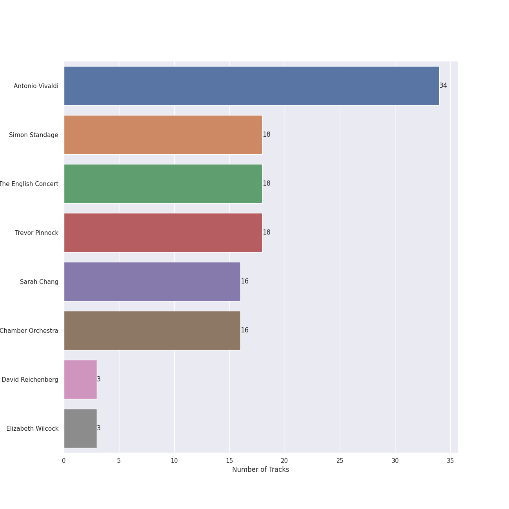

# Vivaldi

## Top Artists

See all artists

|   Number of Tracks | Artist                    |
|-------------------:|:--------------------------|
|                 34 | Antonio Vivaldi           |
|                 18 | Simon Standage            |
|                 18 | The English Concert       |
|                 18 | Trevor Pinnock            |
|                 16 | Sarah Chang               |
|                 16 | Orpheus Chamber Orchestra |
|                  3 | David Reichenberg         |
|                  3 | Elizabeth Wilcock         |

## Tracks

| Track                                                                                                               | Album                      | Artists                                                                                                                                                                                                                       | Liked   |
|:--------------------------------------------------------------------------------------------------------------------|:---------------------------|:------------------------------------------------------------------------------------------------------------------------------------------------------------------------------------------------------------------------------|:--------|
| Vivaldi: L'estro armonico, Violin Concerto in A Minor, Op. 3 No. 6, RV 356: I. Allegro                              | Vivaldi: The Four Seasons. | [Antonio Vivaldi](../artists/antonio_vivaldi.md), [Sarah Chang](../artists/sarah_chang.md), [Orpheus Chamber Orchestra](../artists/orpheus_chamber_orchestra.md)                                                              |         |
| Vivaldi: The Four Seasons, Violin Concerto in E Major, Op. 8 No. 1, RV 269 "Spring": I. Allegro                     | Vivaldi: The Four Seasons. | [Antonio Vivaldi](../artists/antonio_vivaldi.md), [Sarah Chang](../artists/sarah_chang.md), [Orpheus Chamber Orchestra](../artists/orpheus_chamber_orchestra.md)                                                              |         |
| Vivaldi: The Four Seasons, Violin Concerto in E Major, Op. 8 No. 1, RV 269 "Spring": II. Largo e pianissimo sempre  | Vivaldi: The Four Seasons. | [Antonio Vivaldi](../artists/antonio_vivaldi.md), [Sarah Chang](../artists/sarah_chang.md), [Orpheus Chamber Orchestra](../artists/orpheus_chamber_orchestra.md)                                                              |         |
| Vivaldi: The Four Seasons, Violin Concerto in E Major, Op. 8 No. 1, RV 269 "Spring": III. Allegro                   | Vivaldi: The Four Seasons. | [Antonio Vivaldi](../artists/antonio_vivaldi.md), [Sarah Chang](../artists/sarah_chang.md), [Orpheus Chamber Orchestra](../artists/orpheus_chamber_orchestra.md)                                                              |         |
| Vivaldi: The Four Seasons, Violin Concerto in F Major, Op. 8 No. 3, RV 293 "Autumn": I. Allegro                     | Vivaldi: The Four Seasons. | [Antonio Vivaldi](../artists/antonio_vivaldi.md), [Sarah Chang](../artists/sarah_chang.md), [Orpheus Chamber Orchestra](../artists/orpheus_chamber_orchestra.md)                                                              |         |
| Vivaldi: The Four Seasons, Violin Concerto in F Major, Op. 8 No. 3, RV 293 "Autumn": II. Adagio molto               | Vivaldi: The Four Seasons. | [Antonio Vivaldi](../artists/antonio_vivaldi.md), [Sarah Chang](../artists/sarah_chang.md), [Orpheus Chamber Orchestra](../artists/orpheus_chamber_orchestra.md)                                                              |         |
| Vivaldi: The Four Seasons, Violin Concerto in F Major, Op. 8 No. 3, RV 293 "Autumn": III. Allegro "La caccia"       | Vivaldi: The Four Seasons. | [Antonio Vivaldi](../artists/antonio_vivaldi.md), [Sarah Chang](../artists/sarah_chang.md), [Orpheus Chamber Orchestra](../artists/orpheus_chamber_orchestra.md)                                                              |         |
| Vivaldi: The Four Seasons, Violin Concerto in F Minor, Op. 8 No. 4, RV 297 "Winter": I. Allegro non molto           | Vivaldi: The Four Seasons. | [Antonio Vivaldi](../artists/antonio_vivaldi.md), [Sarah Chang](../artists/sarah_chang.md), [Orpheus Chamber Orchestra](../artists/orpheus_chamber_orchestra.md)                                                              |         |
| Vivaldi: The Four Seasons, Violin Concerto in F Minor, Op. 8 No. 4, RV 297 "Winter": II. Largo                      | Vivaldi: The Four Seasons. | [Antonio Vivaldi](../artists/antonio_vivaldi.md), [Sarah Chang](../artists/sarah_chang.md), [Orpheus Chamber Orchestra](../artists/orpheus_chamber_orchestra.md)                                                              |         |
| Vivaldi: The Four Seasons, Violin Concerto in F Minor, Op. 8 No. 4, RV 297 "Winter": III. Allegro                   | Vivaldi: The Four Seasons. | [Antonio Vivaldi](../artists/antonio_vivaldi.md), [Sarah Chang](../artists/sarah_chang.md), [Orpheus Chamber Orchestra](../artists/orpheus_chamber_orchestra.md)                                                              |         |
| Vivaldi: The Four Seasons, Violin Concerto in G Minor, Op. 8 No. 2, RV 315 "Summer": I. Allegro non molto           | Vivaldi: The Four Seasons. | [Antonio Vivaldi](../artists/antonio_vivaldi.md), [Sarah Chang](../artists/sarah_chang.md), [Orpheus Chamber Orchestra](../artists/orpheus_chamber_orchestra.md)                                                              |         |
| Vivaldi: The Four Seasons, Violin Concerto in G Minor, Op. 8 No. 2, RV 315 "Summer": II. Adagio                     | Vivaldi: The Four Seasons. | [Antonio Vivaldi](../artists/antonio_vivaldi.md), [Sarah Chang](../artists/sarah_chang.md), [Orpheus Chamber Orchestra](../artists/orpheus_chamber_orchestra.md)                                                              |         |
| Vivaldi: The Four Seasons, Violin Concerto in G Minor, Op. 8 No. 2, RV 315 "Summer": III. Presto                    | Vivaldi: The Four Seasons. | [Antonio Vivaldi](../artists/antonio_vivaldi.md), [Sarah Chang](../artists/sarah_chang.md), [Orpheus Chamber Orchestra](../artists/orpheus_chamber_orchestra.md)                                                              |         |
| Vivaldi: Violin Concerto in G Minor, Op. 12 No. 1, RV 317: I. Allegro aperto                                        | Vivaldi: The Four Seasons. | [Antonio Vivaldi](../artists/antonio_vivaldi.md), [Sarah Chang](../artists/sarah_chang.md), [Orpheus Chamber Orchestra](../artists/orpheus_chamber_orchestra.md)                                                              |         |
| Vivaldi: Violin Concerto in G Minor, Op. 12 No. 1, RV 317: II. Largo                                                | Vivaldi: The Four Seasons. | [Antonio Vivaldi](../artists/antonio_vivaldi.md), [Sarah Chang](../artists/sarah_chang.md), [Orpheus Chamber Orchestra](../artists/orpheus_chamber_orchestra.md)                                                              |         |
| Vivaldi: Violin Concerto in G Minor, Op. 12 No. 1, RV 317: III. Allegro                                             | Vivaldi: The Four Seasons. | [Antonio Vivaldi](../artists/antonio_vivaldi.md), [Sarah Chang](../artists/sarah_chang.md), [Orpheus Chamber Orchestra](../artists/orpheus_chamber_orchestra.md)                                                              |         |
| Concerto for Violin and Strings in E Major, Op. 8, No. 1, RV 269 "La Primavera": II. Largo                          | Vivaldi: Four Seasons      | [Antonio Vivaldi](../artists/antonio_vivaldi.md), [Simon Standage](../artists/simon_standage.md), [The English Concert](../artists/the_english_concert.md), [Trevor Pinnock](../artists/trevor_pinnock.md)                    |         |
| Concerto for Violin and Strings in E Major, Op. 8, No. 1, RV 269 "La Primavera": III. Allegro (Danza pastorale)     | Vivaldi: Four Seasons      | [Antonio Vivaldi](../artists/antonio_vivaldi.md), [Simon Standage](../artists/simon_standage.md), [The English Concert](../artists/the_english_concert.md), [Trevor Pinnock](../artists/trevor_pinnock.md)                    |         |
| Concerto for Violin and Strings in F Major, Op. 8, No. 3, RV 293 "L'autunno": II. Adagio molto (Ubriachi dormienti) | Vivaldi: Four Seasons      | [Antonio Vivaldi](../artists/antonio_vivaldi.md), [Simon Standage](../artists/simon_standage.md), [The English Concert](../artists/the_english_concert.md), [Trevor Pinnock](../artists/trevor_pinnock.md)                    |         |
| Concerto for Violin and Strings in G Minor, Op. 8, No. 2, RV 315 "L'estate": I. Allegro non molto - Allegro         | Vivaldi: Four Seasons      | [Antonio Vivaldi](../artists/antonio_vivaldi.md), [Simon Standage](../artists/simon_standage.md), [The English Concert](../artists/the_english_concert.md), [Trevor Pinnock](../artists/trevor_pinnock.md)                    |         |
| Concerto for Violin and Strings in G Minor, Op. 8, No. 2, RV 315 "L'estate": II. Adagio - Presto - Adagio           | Vivaldi: Four Seasons      | [Antonio Vivaldi](../artists/antonio_vivaldi.md), [Simon Standage](../artists/simon_standage.md), [The English Concert](../artists/the_english_concert.md), [Trevor Pinnock](../artists/trevor_pinnock.md)                    |         |
| Violin Concerto in E Major, Op. 8, No. 1, RV 269 "La Primavera": I. Allegro                                         | Vivaldi: Four Seasons      | [Antonio Vivaldi](../artists/antonio_vivaldi.md), [Simon Standage](../artists/simon_standage.md), [The English Concert](../artists/the_english_concert.md), [Trevor Pinnock](../artists/trevor_pinnock.md)                    |         |
| Violin Concerto in F Major, Op. 8, No. 3, RV 293 "L'autunno": I. Allegro (Ballo, e canto de' villanelli)            | Vivaldi: Four Seasons      | [Antonio Vivaldi](../artists/antonio_vivaldi.md), [Simon Standage](../artists/simon_standage.md), [The English Concert](../artists/the_english_concert.md), [Trevor Pinnock](../artists/trevor_pinnock.md)                    |         |
| Violin Concerto in F Major, Op. 8, No. 3, RV 293 "L'autunno": III. Allegro (La caccia)                              | Vivaldi: Four Seasons      | [Antonio Vivaldi](../artists/antonio_vivaldi.md), [Simon Standage](../artists/simon_standage.md), [The English Concert](../artists/the_english_concert.md), [Trevor Pinnock](../artists/trevor_pinnock.md)                    |         |
| Violin Concerto in F Minor, Op. 8, No. 4, RV 297 "L'inverno": I. Allegro non molto                                  | Vivaldi: Four Seasons      | [Antonio Vivaldi](../artists/antonio_vivaldi.md), [Simon Standage](../artists/simon_standage.md), [The English Concert](../artists/the_english_concert.md), [Trevor Pinnock](../artists/trevor_pinnock.md)                    |         |
| Violin Concerto in F Minor, Op. 8, No. 4, RV 297 "L'inverno": II. Largo                                             | Vivaldi: Four Seasons      | [Antonio Vivaldi](../artists/antonio_vivaldi.md), [Simon Standage](../artists/simon_standage.md), [The English Concert](../artists/the_english_concert.md), [Trevor Pinnock](../artists/trevor_pinnock.md)                    |         |
| Violin Concerto in F Minor, Op. 8, No. 4, RV 297 "L'inverno": III. Allegro                                          | Vivaldi: Four Seasons      | [Antonio Vivaldi](../artists/antonio_vivaldi.md), [Simon Standage](../artists/simon_standage.md), [The English Concert](../artists/the_english_concert.md), [Trevor Pinnock](../artists/trevor_pinnock.md)                    |         |
| Violin Concerto in G Minor, Op. 8, No. 2, RV 315 "L'estate": III. Presto (Tempo impetuoso d'estate)                 | Vivaldi: Four Seasons      | [Antonio Vivaldi](../artists/antonio_vivaldi.md), [Simon Standage](../artists/simon_standage.md), [The English Concert](../artists/the_english_concert.md), [Trevor Pinnock](../artists/trevor_pinnock.md)                    |         |
| Concerto for Oboe, Violin, Strings and Continuo in B Flat Major, RV 548: I. (Allegro)                               | Vivaldi: Four Seasons      | [Antonio Vivaldi](../artists/antonio_vivaldi.md), [Simon Standage](../artists/simon_standage.md), [The English Concert](../artists/the_english_concert.md), [Trevor Pinnock](../artists/trevor_pinnock.md), David Reichenberg |         |
| Concerto for Oboe, Violin, Strings and Continuo in B Flat Major, RV 548: II. Largo                                  | Vivaldi: Four Seasons      | [Antonio Vivaldi](../artists/antonio_vivaldi.md), [Simon Standage](../artists/simon_standage.md), [The English Concert](../artists/the_english_concert.md), [Trevor Pinnock](../artists/trevor_pinnock.md), David Reichenberg |         |
| Concerto for Oboe, Violin, Strings and Continuo in B Flat Major, RV 548: III. Allegro                               | Vivaldi: Four Seasons      | [Antonio Vivaldi](../artists/antonio_vivaldi.md), [Simon Standage](../artists/simon_standage.md), [The English Concert](../artists/the_english_concert.md), [Trevor Pinnock](../artists/trevor_pinnock.md), David Reichenberg |         |
| Concerto for 2 Violins, Strings and Continuo in G Major, RV 516: I. Allegro molto                                   | Vivaldi: Four Seasons      | [Antonio Vivaldi](../artists/antonio_vivaldi.md), [Simon Standage](../artists/simon_standage.md), [The English Concert](../artists/the_english_concert.md), [Trevor Pinnock](../artists/trevor_pinnock.md), Elizabeth Wilcock |         |
| Concerto for 2 Violins, Strings and Continuo in G Major, RV 516: II. Andante (molto)                                | Vivaldi: Four Seasons      | [Antonio Vivaldi](../artists/antonio_vivaldi.md), [Simon Standage](../artists/simon_standage.md), [The English Concert](../artists/the_english_concert.md), [Trevor Pinnock](../artists/trevor_pinnock.md), Elizabeth Wilcock |         |
| Concerto for 2 Violins, Strings and Continuo in G Major, RV 516: III. Allegro                                       | Vivaldi: Four Seasons      | [Antonio Vivaldi](../artists/antonio_vivaldi.md), [Simon Standage](../artists/simon_standage.md), [The English Concert](../artists/the_english_concert.md), [Trevor Pinnock](../artists/trevor_pinnock.md), Elizabeth Wilcock |         |
