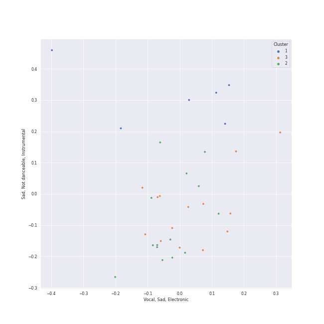

# Clusters in Vivaldi

## Cluster #1

6 tracks

| Art | Track | Album | Artists | Label | 💚 | 🔗 |
|:---|:---|:---|:---|:---|:---|:---|
|  | Vivaldi: The Four Seasons, Violin Concerto in E Major, Op. 8 No. 1, RV 269 "Spring": I. Allegro | Vivaldi: The Four Seasons. | Antonio Vivaldi, Sarah Chang, Orpheus Chamber Orchestra | [Warner Classics](../../../../labels/warner_classics) | | [🔗](https://open.spotify.com/track/1NMgzkX89QZ2TuMSiJoILl) |
|  | Vivaldi: The Four Seasons, Violin Concerto in E Major, Op. 8 No. 1, RV 269 "Spring": III. Allegro | Vivaldi: The Four Seasons. | Antonio Vivaldi, Sarah Chang, Orpheus Chamber Orchestra | [Warner Classics](../../../../labels/warner_classics) | | [🔗](https://open.spotify.com/track/3k6tQABkAsr1Mq7eDRJwk1) |
|  | Vivaldi: The Four Seasons, Violin Concerto in F Major, Op. 8 No. 3, RV 293 "Autumn": II. Adagio molto | Vivaldi: The Four Seasons. | Antonio Vivaldi, Sarah Chang, Orpheus Chamber Orchestra | [Warner Classics](../../../../labels/warner_classics) | | [🔗](https://open.spotify.com/track/0CmKuDto0oNAYzBOzjDjqV) |
|  | Vivaldi: The Four Seasons, Violin Concerto in F Minor, Op. 8 No. 4, RV 297 "Winter": I. Allegro non molto | Vivaldi: The Four Seasons. | Antonio Vivaldi, Sarah Chang, Orpheus Chamber Orchestra | [Warner Classics](../../../../labels/warner_classics) | | [🔗](https://open.spotify.com/track/5llR5SF5ojZV4oSvIFlGUL) |
|  | Vivaldi: The Four Seasons, Violin Concerto in G Minor, Op. 8 No. 2, RV 315 "Summer": III. Presto | Vivaldi: The Four Seasons. | Antonio Vivaldi, Sarah Chang, Orpheus Chamber Orchestra | [Warner Classics](../../../../labels/warner_classics) | | [🔗](https://open.spotify.com/track/1gewYqj350HHu63L8iwMbV) |
|  | Concerto for Violin and Strings in F Major, Op. 8, No. 3, RV 293 "L'autunno": II. Adagio molto (Ubriachi dormienti) | Vivaldi: Four Seasons | Antonio Vivaldi, Simon Standage, The English Concert, Trevor Pinnock | [Decca (UMO)](../../../../labels/decca__umo_) | | [🔗](https://open.spotify.com/track/00rr9bcpswlDp38RmgNWws) |
## Cluster #2

14 tracks

| Art | Track | Album | Artists | Label | 💚 | 🔗 |
|:---|:---|:---|:---|:---|:---|:---|
|  | Vivaldi: L'estro armonico, Violin Concerto in A Minor, Op. 3 No. 6, RV 356: I. Allegro | Vivaldi: The Four Seasons. | Antonio Vivaldi, Sarah Chang, Orpheus Chamber Orchestra | [Warner Classics](../../../../labels/warner_classics) | | [🔗](https://open.spotify.com/track/6EDoOwFAXcyDQ1bhYtO9yb) |
|  | Vivaldi: Violin Concerto in G Minor, Op. 12 No. 1, RV 317: I. Allegro aperto | Vivaldi: The Four Seasons. | Antonio Vivaldi, Sarah Chang, Orpheus Chamber Orchestra | [Warner Classics](../../../../labels/warner_classics) | | [🔗](https://open.spotify.com/track/27FVkepjzJBhU40KS1xSzp) |
|  | Vivaldi: Violin Concerto in G Minor, Op. 12 No. 1, RV 317: III. Allegro | Vivaldi: The Four Seasons. | Antonio Vivaldi, Sarah Chang, Orpheus Chamber Orchestra | [Warner Classics](../../../../labels/warner_classics) | | [🔗](https://open.spotify.com/track/0IqtbGczjbFsMoCgS90Rux) |
|  | Concerto for 2 Violins, Strings and Continuo in G Major, RV 516: I. Allegro molto | Vivaldi: Four Seasons | Antonio Vivaldi, Simon Standage, Elizabeth Wilcock, The English Concert, Trevor Pinnock | [Decca (UMO)](../../../../labels/decca__umo_) | | [🔗](https://open.spotify.com/track/6y3VNh7JmGHIlk2zDXX6Wr) |
|  | Concerto for 2 Violins, Strings and Continuo in G Major, RV 516: III. Allegro | Vivaldi: Four Seasons | Antonio Vivaldi, Simon Standage, Elizabeth Wilcock, The English Concert, Trevor Pinnock | [Decca (UMO)](../../../../labels/decca__umo_) | | [🔗](https://open.spotify.com/track/2R1otrP1Kuu2LY3ho9127T) |
|  | Concerto for Violin and Strings in E Major, Op. 8, No. 1, RV 269 "La Primavera": III. Allegro (Danza pastorale) | Vivaldi: Four Seasons | Antonio Vivaldi, Simon Standage, The English Concert, Trevor Pinnock | [Decca (UMO)](../../../../labels/decca__umo_) | | [🔗](https://open.spotify.com/track/25WOKott6eYT4t9WesF3F7) |
|  | Violin Concerto in F Major, Op. 8, No. 3, RV 293 "L'autunno": I. Allegro (Ballo, e canto de' villanelli) | Vivaldi: Four Seasons | Antonio Vivaldi, Simon Standage, The English Concert, Trevor Pinnock | [Decca (UMO)](../../../../labels/decca__umo_) | | [🔗](https://open.spotify.com/track/5or01FkVmY6aAg0YEIySg8) |
|  | Violin Concerto in F Major, Op. 8, No. 3, RV 293 "L'autunno": III. Allegro (La caccia) | Vivaldi: Four Seasons | Antonio Vivaldi, Simon Standage, The English Concert, Trevor Pinnock | [Decca (UMO)](../../../../labels/decca__umo_) | | [🔗](https://open.spotify.com/track/6KqX73AWh9AFbPQsNvrAnL) |
|  | Violin Concerto in F Minor, Op. 8, No. 4, RV 297 "L'inverno": I. Allegro non molto | Vivaldi: Four Seasons | Antonio Vivaldi, Simon Standage, The English Concert, Trevor Pinnock | [Decca (UMO)](../../../../labels/decca__umo_) | | [🔗](https://open.spotify.com/track/1jkMzOnb3APNXYKJ1Uzijb) |
|  | Violin Concerto in F Minor, Op. 8, No. 4, RV 297 "L'inverno": III. Allegro | Vivaldi: Four Seasons | Antonio Vivaldi, Simon Standage, The English Concert, Trevor Pinnock | [Decca (UMO)](../../../../labels/decca__umo_) | | [🔗](https://open.spotify.com/track/1s6z69thm3lJw9DHmTGmjc) |
## Cluster #3

14 tracks

| Art | Track | Album | Artists | Label | 💚 | 🔗 |
|:---|:---|:---|:---|:---|:---|:---|
|  | Vivaldi: The Four Seasons, Violin Concerto in F Minor, Op. 8 No. 4, RV 297 "Winter": II. Largo | Vivaldi: The Four Seasons. | Antonio Vivaldi, Sarah Chang, Orpheus Chamber Orchestra | [Warner Classics](../../../../labels/warner_classics) | | [🔗](https://open.spotify.com/track/3zWIb6UTHGfWkjimJ6wIJG) |
|  | Vivaldi: The Four Seasons, Violin Concerto in F Minor, Op. 8 No. 4, RV 297 "Winter": III. Allegro | Vivaldi: The Four Seasons. | Antonio Vivaldi, Sarah Chang, Orpheus Chamber Orchestra | [Warner Classics](../../../../labels/warner_classics) | | [🔗](https://open.spotify.com/track/3NssaIXNMQJHoCYXvxExET) |
|  | Vivaldi: The Four Seasons, Violin Concerto in G Minor, Op. 8 No. 2, RV 315 "Summer": I. Allegro non molto | Vivaldi: The Four Seasons. | Antonio Vivaldi, Sarah Chang, Orpheus Chamber Orchestra | [Warner Classics](../../../../labels/warner_classics) | | [🔗](https://open.spotify.com/track/0kQuEbV8Zckr9tBgM8U7Xs) |
|  | Vivaldi: The Four Seasons, Violin Concerto in G Minor, Op. 8 No. 2, RV 315 "Summer": II. Adagio | Vivaldi: The Four Seasons. | Antonio Vivaldi, Sarah Chang, Orpheus Chamber Orchestra | [Warner Classics](../../../../labels/warner_classics) | | [🔗](https://open.spotify.com/track/3bvUD0brjrqPYapZxGBsu3) |
|  | Vivaldi: Violin Concerto in G Minor, Op. 12 No. 1, RV 317: II. Largo | Vivaldi: The Four Seasons. | Antonio Vivaldi, Sarah Chang, Orpheus Chamber Orchestra | [Warner Classics](../../../../labels/warner_classics) | | [🔗](https://open.spotify.com/track/3A5AucW2JWRYhjPAu13jiw) |
|  | Concerto for 2 Violins, Strings and Continuo in G Major, RV 516: II. Andante (molto) | Vivaldi: Four Seasons | Antonio Vivaldi, Simon Standage, Elizabeth Wilcock, The English Concert, Trevor Pinnock | [Decca (UMO)](../../../../labels/decca__umo_) | | [🔗](https://open.spotify.com/track/4QlEleNkTjc5gQ91bp36zu) |
|  | Concerto for Oboe, Violin, Strings and Continuo in B Flat Major, RV 548: II. Largo | Vivaldi: Four Seasons | Antonio Vivaldi, David Reichenberg, Simon Standage, The English Concert, Trevor Pinnock | [Decca (UMO)](../../../../labels/decca__umo_) | | [🔗](https://open.spotify.com/track/3B3QTyekgd312pKThlsJFz) |
|  | Concerto for Violin and Strings in G Minor, Op. 8, No. 2, RV 315 "L'estate": I. Allegro non molto - Allegro | Vivaldi: Four Seasons | Antonio Vivaldi, Simon Standage, The English Concert, Trevor Pinnock | [Decca (UMO)](../../../../labels/decca__umo_) | | [🔗](https://open.spotify.com/track/2l4thc8hzFRHlFPZgvAXeF) |
|  | Concerto for Violin and Strings in G Minor, Op. 8, No. 2, RV 315 "L'estate": II. Adagio - Presto - Adagio | Vivaldi: Four Seasons | Antonio Vivaldi, Simon Standage, The English Concert, Trevor Pinnock | [Decca (UMO)](../../../../labels/decca__umo_) | | [🔗](https://open.spotify.com/track/2tpUWGibf9sV6OZy6XNvBf) |
|  | Violin Concerto in F Minor, Op. 8, No. 4, RV 297 "L'inverno": II. Largo | Vivaldi: Four Seasons | Antonio Vivaldi, Simon Standage, The English Concert, Trevor Pinnock | [Decca (UMO)](../../../../labels/decca__umo_) | | [🔗](https://open.spotify.com/track/0UjUHRGw8V3nNRZT0wO4DE) |