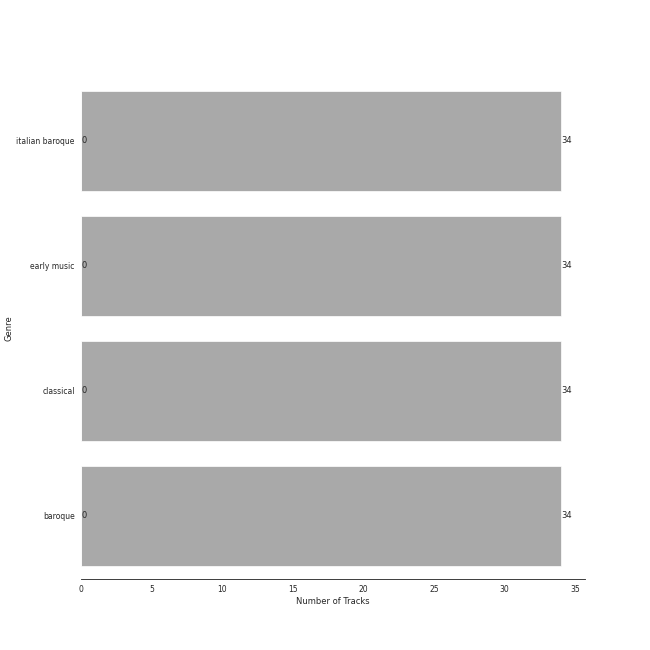

# Vivaldi

[34 tracks (0 liked) 🔗](https://open.spotify.com/playlist/39dOiLs9ZbssQvs9xLBRzw)

[See Track Features](audio_features.md)

[See Clusters](clusters/overview.md)

## Top Artists

| Art | Tracks | 💚 | Artist | 🔗 |
|:---|---:|---:|:---|:---|
|  | 34 | 0 | Antonio Vivaldi | [🔗](https://open.spotify.com/artist/2QOIawHpSlOwXDvSqQ9YJR) |
|  | 18 | 0 | Simon Standage | [🔗](https://open.spotify.com/artist/2jIBkRzVUboTbp05rJnKeT) |
|  | 18 | 0 | The English Concert | [🔗](https://open.spotify.com/artist/2Oz3z7PPQUMU2KNYgcO1sA) |
|  | 18 | 0 | Trevor Pinnock | [🔗](https://open.spotify.com/artist/25mbgceDJKxXGP8c5FmC83) |
|  | 16 | 0 | Sarah Chang | [🔗](https://open.spotify.com/artist/5duxfFAQVkDT9g261fKlMP) |
|  | 16 | 0 | Orpheus Chamber Orchestra | [🔗](https://open.spotify.com/artist/35pZsti1RSA5Zv98jAm8kX) |
|  | 3 | 0 | David Reichenberg | [🔗](https://open.spotify.com/artist/5xA5sW0D3BUAyL02XcDkYv) |
|  | 3 | 0 | Elizabeth Wilcock | [🔗](https://open.spotify.com/artist/1OfYCRcS14pyRVrO0qTCbs) |

## Top Albums

| Art | Tracks | 💚 | Album | Release Date | 🔗 |
|:---|---:|---:|:---|:---|:---|
|  | 18 | 0 | Vivaldi: Four Seasons | 2008-01-01 | [🔗](https://open.spotify.com/album/4Uc1Cus3I9LjkI2XwtQnfc) |
|  | 16 | 0 | Vivaldi: The Four Seasons. | 2007-10-01 | [🔗](https://open.spotify.com/album/4YpaKMCcb65yOoee75UUOh) |

## Top Record Labels

| Tracks | 💚 | Label |
|---:|---:|:---|
| 18 | 0 | [Decca (UMO)](../../labels/decca__umo_/overview.md) |
| 16 | 0 | [Warner Classics](../../labels/warner_classics/overview.md) |

## Genres

| Tracks | 💚 | Genre |
|---:|---:|:---|
| 34 | 0 | italian baroque |
| 34 | 0 | early music |
| 34 | 0 | classical |
| 34 | 0 | baroque |

## Years

| ​ | 5 newest albums | ​​ | 5 oldest albums |
|:---|:---|:---|:---|
|  | Vivaldi: Four Seasons (2008-01-01) |  | Vivaldi: The Four Seasons. (2007-10-01) |
|  | Vivaldi: The Four Seasons. (2007-10-01) |  | Vivaldi: Four Seasons (2008-01-01) |