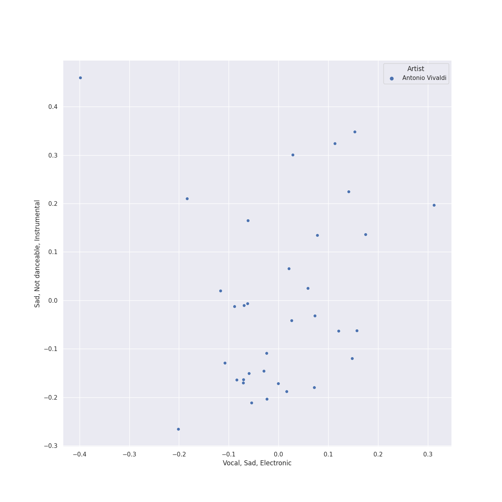

# Vivaldi

[34 songs](tracks.md)

## Top Artists

See all 8 artists

|   Number of Tracks | Art                                                                                              | Artist                                                                  | 🔗                                                           |
|-------------------:|:-------------------------------------------------------------------------------------------------|:------------------------------------------------------------------------|:------------------------------------------------------------|
|                 34 |  | [Antonio Vivaldi](../../artists/antonio_vivaldi.md)                     | [🔗](https://open.spotify.com/artist/2QOIawHpSlOwXDvSqQ9YJR) |
|                 18 |  | [Simon Standage](../../artists/simon_standage.md)                       | [🔗](https://open.spotify.com/artist/2jIBkRzVUboTbp05rJnKeT) |
|                 18 |  | [The English Concert](../../artists/the_english_concert.md)             | [🔗](https://open.spotify.com/artist/2Oz3z7PPQUMU2KNYgcO1sA) |
|                 18 |  | [Trevor Pinnock](../../artists/trevor_pinnock.md)                       | [🔗](https://open.spotify.com/artist/25mbgceDJKxXGP8c5FmC83) |
|                 16 |  | [Sarah Chang](../../artists/sarah_chang.md)                             | [🔗](https://open.spotify.com/artist/5duxfFAQVkDT9g261fKlMP) |
|                 16 |  | [Orpheus Chamber Orchestra](../../artists/orpheus_chamber_orchestra.md) | [🔗](https://open.spotify.com/artist/35pZsti1RSA5Zv98jAm8kX) |
|                  3 |  | David Reichenberg                                                       | [🔗](https://open.spotify.com/artist/5xA5sW0D3BUAyL02XcDkYv) |
|                  3 |  | Elizabeth Wilcock                                                       | [🔗](https://open.spotify.com/artist/1OfYCRcS14pyRVrO0qTCbs) |

## Top Albums

See all 2 albums

|   Number of Tracks | Art                                                                                              | Album                      | 🔗                                                          |
|-------------------:|:-------------------------------------------------------------------------------------------------|:---------------------------|:-----------------------------------------------------------|
|                 18 |  | Vivaldi: Four Seasons      | [🔗](https://open.spotify.com/album/4Uc1Cus3I9LjkI2XwtQnfc) |
|                 16 |  | Vivaldi: The Four Seasons. | [🔗](https://open.spotify.com/album/4YpaKMCcb65yOoee75UUOh) |

## Top Record Labels

See all 2 labels

|   Number of Tracks | Label                                              |
|-------------------:|:---------------------------------------------------|
|                 18 | [Decca (UMO)](../../labels/decca__umo_.md)         |
|                 16 | [Warner Classics](../../labels/warner_classics.md) |

## Genres

See all 4 genres

|   Number of Tracks | Genre                                      |
|-------------------:|:-------------------------------------------|
|                 34 | italian baroque                            |
|                 34 | [early music](../../genres/early_music.md) |
|                 34 | [classical](../../genres/classical.md)     |
|                 34 | [baroque](../../genres/baroque.md)         |

## Audio Features

| 10 most Danceable tracks                                                                                 | 10 least Danceable tracks                                                                                           |
|:---------------------------------------------------------------------------------------------------------|:--------------------------------------------------------------------------------------------------------------------|
| Concerto for Oboe, Violin, Strings and Continuo in B Flat Major, RV 548: I. (Allegro)                    | Vivaldi: The Four Seasons, Violin Concerto in F Minor, Op. 8 No. 4, RV 297 "Winter": II. Largo                      |
| Concerto for Oboe, Violin, Strings and Continuo in B Flat Major, RV 548: III. Allegro                    | Concerto for 2 Violins, Strings and Continuo in G Major, RV 516: II. Andante (molto)                                |
| Vivaldi: L'estro armonico, Violin Concerto in A Minor, Op. 3 No. 6, RV 356: I. Allegro                   | Vivaldi: The Four Seasons, Violin Concerto in E Major, Op. 8 No. 1, RV 269 "Spring": II. Largo e pianissimo sempre  |
| Violin Concerto in E Major, Op. 8, No. 1, RV 269 "La Primavera": I. Allegro                              | Vivaldi: Violin Concerto in G Minor, Op. 12 No. 1, RV 317: II. Largo                                                |
| Vivaldi: Violin Concerto in G Minor, Op. 12 No. 1, RV 317: I. Allegro aperto                             | Concerto for Violin and Strings in F Major, Op. 8, No. 3, RV 293 "L'autunno": II. Adagio molto (Ubriachi dormienti) |
| Vivaldi: Violin Concerto in G Minor, Op. 12 No. 1, RV 317: III. Allegro                                  | Vivaldi: The Four Seasons, Violin Concerto in F Major, Op. 8 No. 3, RV 293 "Autumn": II. Adagio molto               |
| Concerto for 2 Violins, Strings and Continuo in G Major, RV 516: III. Allegro                            | Concerto for Oboe, Violin, Strings and Continuo in B Flat Major, RV 548: II. Largo                                  |
| Violin Concerto in F Major, Op. 8, No. 3, RV 293 "L'autunno": I. Allegro (Ballo, e canto de' villanelli) | Concerto for Violin and Strings in G Minor, Op. 8, No. 2, RV 315 "L'estate": II. Adagio - Presto - Adagio           |
| Concerto for 2 Violins, Strings and Continuo in G Major, RV 516: I. Allegro molto                        | Vivaldi: The Four Seasons, Violin Concerto in G Minor, Op. 8 No. 2, RV 315 "Summer": II. Adagio                     |
| Violin Concerto in F Major, Op. 8, No. 3, RV 293 "L'autunno": III. Allegro (La caccia)                   | Concerto for Violin and Strings in E Major, Op. 8, No. 1, RV 269 "La Primavera": II. Largo                          |

| 10 most Energetic tracks                                                                                    | 10 least Energetic tracks                                                                                           |
|:------------------------------------------------------------------------------------------------------------|:--------------------------------------------------------------------------------------------------------------------|
| Violin Concerto in G Minor, Op. 8, No. 2, RV 315 "L'estate": III. Presto (Tempo impetuoso d'estate)         | Concerto for Violin and Strings in G Minor, Op. 8, No. 2, RV 315 "L'estate": II. Adagio - Presto - Adagio           |
| Vivaldi: The Four Seasons, Violin Concerto in G Minor, Op. 8 No. 2, RV 315 "Summer": III. Presto            | Violin Concerto in F Minor, Op. 8, No. 4, RV 297 "L'inverno": II. Largo                                             |
| Violin Concerto in F Minor, Op. 8, No. 4, RV 297 "L'inverno": I. Allegro non molto                          | Vivaldi: The Four Seasons, Violin Concerto in F Minor, Op. 8 No. 4, RV 297 "Winter": II. Largo                      |
| Concerto for Violin and Strings in G Minor, Op. 8, No. 2, RV 315 "L'estate": I. Allegro non molto - Allegro | Concerto for 2 Violins, Strings and Continuo in G Major, RV 516: II. Andante (molto)                                |
| Violin Concerto in F Minor, Op. 8, No. 4, RV 297 "L'inverno": III. Allegro                                  | Vivaldi: The Four Seasons, Violin Concerto in E Major, Op. 8 No. 1, RV 269 "Spring": II. Largo e pianissimo sempre  |
| Vivaldi: The Four Seasons, Violin Concerto in F Minor, Op. 8 No. 4, RV 297 "Winter": I. Allegro non molto   | Vivaldi: Violin Concerto in G Minor, Op. 12 No. 1, RV 317: II. Largo                                                |
| Violin Concerto in F Major, Op. 8, No. 3, RV 293 "L'autunno": III. Allegro (La caccia)                      | Concerto for Oboe, Violin, Strings and Continuo in B Flat Major, RV 548: II. Largo                                  |
| Concerto for 2 Violins, Strings and Continuo in G Major, RV 516: III. Allegro                               | Vivaldi: The Four Seasons, Violin Concerto in G Minor, Op. 8 No. 2, RV 315 "Summer": II. Adagio                     |
| Concerto for 2 Violins, Strings and Continuo in G Major, RV 516: I. Allegro molto                           | Concerto for Violin and Strings in F Major, Op. 8, No. 3, RV 293 "L'autunno": II. Adagio molto (Ubriachi dormienti) |
| Vivaldi: The Four Seasons, Violin Concerto in G Minor, Op. 8 No. 2, RV 315 "Summer": I. Allegro non molto   | Vivaldi: The Four Seasons, Violin Concerto in F Major, Op. 8 No. 3, RV 293 "Autumn": II. Adagio molto               |

| 10 most Speechy tracks                                                                                        | 10 least Speechy tracks                                                                                             |
|:--------------------------------------------------------------------------------------------------------------|:--------------------------------------------------------------------------------------------------------------------|
| Vivaldi: The Four Seasons, Violin Concerto in F Minor, Op. 8 No. 4, RV 297 "Winter": III. Allegro             | Violin Concerto in F Minor, Op. 8, No. 4, RV 297 "L'inverno": I. Allegro non molto                                  |
| Concerto for 2 Violins, Strings and Continuo in G Major, RV 516: I. Allegro molto                             | Vivaldi: Violin Concerto in G Minor, Op. 12 No. 1, RV 317: I. Allegro aperto                                        |
| Vivaldi: The Four Seasons, Violin Concerto in F Minor, Op. 8 No. 4, RV 297 "Winter": I. Allegro non molto     | Vivaldi: The Four Seasons, Violin Concerto in G Minor, Op. 8 No. 2, RV 315 "Summer": III. Presto                    |
| Vivaldi: The Four Seasons, Violin Concerto in F Major, Op. 8 No. 3, RV 293 "Autumn": III. Allegro "La caccia" | Concerto for 2 Violins, Strings and Continuo in G Major, RV 516: III. Allegro                                       |
| Vivaldi: The Four Seasons, Violin Concerto in G Minor, Op. 8 No. 2, RV 315 "Summer": I. Allegro non molto     | Concerto for Oboe, Violin, Strings and Continuo in B Flat Major, RV 548: I. (Allegro)                               |
| Violin Concerto in F Minor, Op. 8, No. 4, RV 297 "L'inverno": III. Allegro                                    | Concerto for Violin and Strings in E Major, Op. 8, No. 1, RV 269 "La Primavera": III. Allegro (Danza pastorale)     |
| Vivaldi: The Four Seasons, Violin Concerto in E Major, Op. 8 No. 1, RV 269 "Spring": III. Allegro             | Concerto for Violin and Strings in F Major, Op. 8, No. 3, RV 293 "L'autunno": II. Adagio molto (Ubriachi dormienti) |
| Vivaldi: The Four Seasons, Violin Concerto in G Minor, Op. 8 No. 2, RV 315 "Summer": II. Adagio               | Violin Concerto in E Major, Op. 8, No. 1, RV 269 "La Primavera": I. Allegro                                         |
| Violin Concerto in F Minor, Op. 8, No. 4, RV 297 "L'inverno": II. Largo                                       | Concerto for Oboe, Violin, Strings and Continuo in B Flat Major, RV 548: III. Allegro                               |
| Vivaldi: The Four Seasons, Violin Concerto in F Major, Op. 8 No. 3, RV 293 "Autumn": I. Allegro               | Violin Concerto in G Minor, Op. 8, No. 2, RV 315 "L'estate": III. Presto (Tempo impetuoso d'estate)                 |

| 10 most Acoustic tracks                                                                                            | 10 least Acoustic tracks                                                                                            |
|:-------------------------------------------------------------------------------------------------------------------|:--------------------------------------------------------------------------------------------------------------------|
| Vivaldi: The Four Seasons, Violin Concerto in E Major, Op. 8 No. 1, RV 269 "Spring": II. Largo e pianissimo sempre | Concerto for Violin and Strings in G Minor, Op. 8, No. 2, RV 315 "L'estate": II. Adagio - Presto - Adagio           |
| Vivaldi: Violin Concerto in G Minor, Op. 12 No. 1, RV 317: I. Allegro aperto                                       | Concerto for Oboe, Violin, Strings and Continuo in B Flat Major, RV 548: II. Largo                                  |
| Vivaldi: L'estro armonico, Violin Concerto in A Minor, Op. 3 No. 6, RV 356: I. Allegro                             | Concerto for Violin and Strings in G Minor, Op. 8, No. 2, RV 315 "L'estate": I. Allegro non molto - Allegro         |
| Vivaldi: The Four Seasons, Violin Concerto in F Major, Op. 8 No. 3, RV 293 "Autumn": I. Allegro                    | Vivaldi: The Four Seasons, Violin Concerto in E Major, Op. 8 No. 1, RV 269 "Spring": III. Allegro                   |
| Vivaldi: Violin Concerto in G Minor, Op. 12 No. 1, RV 317: II. Largo                                               | Vivaldi: The Four Seasons, Violin Concerto in G Minor, Op. 8 No. 2, RV 315 "Summer": I. Allegro non molto           |
| Concerto for Violin and Strings in E Major, Op. 8, No. 1, RV 269 "La Primavera": II. Largo                         | Violin Concerto in F Minor, Op. 8, No. 4, RV 297 "L'inverno": II. Largo                                             |
| Concerto for 2 Violins, Strings and Continuo in G Major, RV 516: II. Andante (molto)                               | Concerto for Violin and Strings in E Major, Op. 8, No. 1, RV 269 "La Primavera": III. Allegro (Danza pastorale)     |
| Vivaldi: Violin Concerto in G Minor, Op. 12 No. 1, RV 317: III. Allegro                                            | Vivaldi: The Four Seasons, Violin Concerto in F Minor, Op. 8 No. 4, RV 297 "Winter": II. Largo                      |
| Violin Concerto in G Minor, Op. 8, No. 2, RV 315 "L'estate": III. Presto (Tempo impetuoso d'estate)                | Concerto for Violin and Strings in F Major, Op. 8, No. 3, RV 293 "L'autunno": II. Adagio molto (Ubriachi dormienti) |
| Vivaldi: The Four Seasons, Violin Concerto in G Minor, Op. 8 No. 2, RV 315 "Summer": II. Adagio                    | Vivaldi: The Four Seasons, Violin Concerto in F Major, Op. 8 No. 3, RV 293 "Autumn": II. Adagio molto               |

| 10 most Instrumental tracks                                                                                        | 10 least Instrumental tracks                                                                                        |
|:-------------------------------------------------------------------------------------------------------------------|:--------------------------------------------------------------------------------------------------------------------|
| Vivaldi: The Four Seasons, Violin Concerto in F Minor, Op. 8 No. 4, RV 297 "Winter": I. Allegro non molto          | Concerto for Violin and Strings in G Minor, Op. 8, No. 2, RV 315 "L'estate": II. Adagio - Presto - Adagio           |
| Vivaldi: The Four Seasons, Violin Concerto in G Minor, Op. 8 No. 2, RV 315 "Summer": III. Presto                   | Concerto for Violin and Strings in G Minor, Op. 8, No. 2, RV 315 "L'estate": I. Allegro non molto - Allegro         |
| Violin Concerto in G Minor, Op. 8, No. 2, RV 315 "L'estate": III. Presto (Tempo impetuoso d'estate)                | Violin Concerto in F Minor, Op. 8, No. 4, RV 297 "L'inverno": III. Allegro                                          |
| Vivaldi: The Four Seasons, Violin Concerto in E Major, Op. 8 No. 1, RV 269 "Spring": III. Allegro                  | Vivaldi: The Four Seasons, Violin Concerto in F Minor, Op. 8 No. 4, RV 297 "Winter": II. Largo                      |
| Vivaldi: The Four Seasons, Violin Concerto in E Major, Op. 8 No. 1, RV 269 "Spring": I. Allegro                    | Concerto for 2 Violins, Strings and Continuo in G Major, RV 516: III. Allegro                                       |
| Vivaldi: The Four Seasons, Violin Concerto in E Major, Op. 8 No. 1, RV 269 "Spring": II. Largo e pianissimo sempre | Concerto for 2 Violins, Strings and Continuo in G Major, RV 516: I. Allegro molto                                   |
| Vivaldi: The Four Seasons, Violin Concerto in F Major, Op. 8 No. 3, RV 293 "Autumn": I. Allegro                    | Concerto for Violin and Strings in E Major, Op. 8, No. 1, RV 269 "La Primavera": III. Allegro (Danza pastorale)     |
| Vivaldi: The Four Seasons, Violin Concerto in F Major, Op. 8 No. 3, RV 293 "Autumn": III. Allegro "La caccia"      | Concerto for 2 Violins, Strings and Continuo in G Major, RV 516: II. Andante (molto)                                |
| Vivaldi: Violin Concerto in G Minor, Op. 12 No. 1, RV 317: III. Allegro                                            | Concerto for Violin and Strings in F Major, Op. 8, No. 3, RV 293 "L'autunno": II. Adagio molto (Ubriachi dormienti) |
| Violin Concerto in F Major, Op. 8, No. 3, RV 293 "L'autunno": III. Allegro (La caccia)                             | Violin Concerto in F Minor, Op. 8, No. 4, RV 297 "L'inverno": II. Largo                                             |

| 10 most Live tracks                                                                                       | 10 least Live tracks                                                                                                |
|:----------------------------------------------------------------------------------------------------------|:--------------------------------------------------------------------------------------------------------------------|
| Concerto for Oboe, Violin, Strings and Continuo in B Flat Major, RV 548: I. (Allegro)                     | Vivaldi: The Four Seasons, Violin Concerto in F Major, Op. 8 No. 3, RV 293 "Autumn": II. Adagio molto               |
| Vivaldi: The Four Seasons, Violin Concerto in G Minor, Op. 8 No. 2, RV 315 "Summer": II. Adagio           | Concerto for 2 Violins, Strings and Continuo in G Major, RV 516: I. Allegro molto                                   |
| Violin Concerto in G Minor, Op. 8, No. 2, RV 315 "L'estate": III. Presto (Tempo impetuoso d'estate)       | Violin Concerto in F Minor, Op. 8, No. 4, RV 297 "L'inverno": I. Allegro non molto                                  |
| Concerto for Violin and Strings in G Minor, Op. 8, No. 2, RV 315 "L'estate": II. Adagio - Presto - Adagio | Concerto for 2 Violins, Strings and Continuo in G Major, RV 516: III. Allegro                                       |
| Concerto for 2 Violins, Strings and Continuo in G Major, RV 516: II. Andante (molto)                      | Violin Concerto in F Major, Op. 8, No. 3, RV 293 "L'autunno": I. Allegro (Ballo, e canto de' villanelli)            |
| Vivaldi: The Four Seasons, Violin Concerto in F Minor, Op. 8 No. 4, RV 297 "Winter": II. Largo            | Concerto for Violin and Strings in E Major, Op. 8, No. 1, RV 269 "La Primavera": II. Largo                          |
| Concerto for Oboe, Violin, Strings and Continuo in B Flat Major, RV 548: II. Largo                        | Vivaldi: The Four Seasons, Violin Concerto in E Major, Op. 8 No. 1, RV 269 "Spring": II. Largo e pianissimo sempre  |
| Vivaldi: L'estro armonico, Violin Concerto in A Minor, Op. 3 No. 6, RV 356: I. Allegro                    | Vivaldi: The Four Seasons, Violin Concerto in F Minor, Op. 8 No. 4, RV 297 "Winter": I. Allegro non molto           |
| Violin Concerto in F Minor, Op. 8, No. 4, RV 297 "L'inverno": III. Allegro                                | Concerto for Violin and Strings in E Major, Op. 8, No. 1, RV 269 "La Primavera": III. Allegro (Danza pastorale)     |
| Vivaldi: Violin Concerto in G Minor, Op. 12 No. 1, RV 317: III. Allegro                                   | Concerto for Violin and Strings in F Major, Op. 8, No. 3, RV 293 "L'autunno": II. Adagio molto (Ubriachi dormienti) |

| 10 most Happy tracks                                                                                | 10 least Happy tracks                                                                                               |
|:----------------------------------------------------------------------------------------------------|:--------------------------------------------------------------------------------------------------------------------|
| Violin Concerto in G Minor, Op. 8, No. 2, RV 315 "L'estate": III. Presto (Tempo impetuoso d'estate) | Vivaldi: The Four Seasons, Violin Concerto in F Major, Op. 8 No. 3, RV 293 "Autumn": I. Allegro                     |
| Concerto for Oboe, Violin, Strings and Continuo in B Flat Major, RV 548: III. Allegro               | Concerto for Violin and Strings in G Minor, Op. 8, No. 2, RV 315 "L'estate": II. Adagio - Presto - Adagio           |
| Concerto for 2 Violins, Strings and Continuo in G Major, RV 516: III. Allegro                       | Vivaldi: The Four Seasons, Violin Concerto in G Minor, Op. 8 No. 2, RV 315 "Summer": I. Allegro non molto           |
| Concerto for Oboe, Violin, Strings and Continuo in B Flat Major, RV 548: I. (Allegro)               | Concerto for 2 Violins, Strings and Continuo in G Major, RV 516: II. Andante (molto)                                |
| Vivaldi: Violin Concerto in G Minor, Op. 12 No. 1, RV 317: I. Allegro aperto                        | Concerto for Violin and Strings in E Major, Op. 8, No. 1, RV 269 "La Primavera": II. Largo                          |
| Violin Concerto in F Major, Op. 8, No. 3, RV 293 "L'autunno": III. Allegro (La caccia)              | Vivaldi: The Four Seasons, Violin Concerto in E Major, Op. 8 No. 1, RV 269 "Spring": II. Largo e pianissimo sempre  |
| Vivaldi: Violin Concerto in G Minor, Op. 12 No. 1, RV 317: III. Allegro                             | Vivaldi: Violin Concerto in G Minor, Op. 12 No. 1, RV 317: II. Largo                                                |
| Violin Concerto in F Minor, Op. 8, No. 4, RV 297 "L'inverno": I. Allegro non molto                  | Vivaldi: The Four Seasons, Violin Concerto in G Minor, Op. 8 No. 2, RV 315 "Summer": II. Adagio                     |
| Concerto for 2 Violins, Strings and Continuo in G Major, RV 516: I. Allegro molto                   | Concerto for Violin and Strings in F Major, Op. 8, No. 3, RV 293 "L'autunno": II. Adagio molto (Ubriachi dormienti) |
| Vivaldi: The Four Seasons, Violin Concerto in G Minor, Op. 8 No. 2, RV 315 "Summer": III. Presto    | Vivaldi: The Four Seasons, Violin Concerto in F Major, Op. 8 No. 3, RV 293 "Autumn": II. Adagio molto               |
