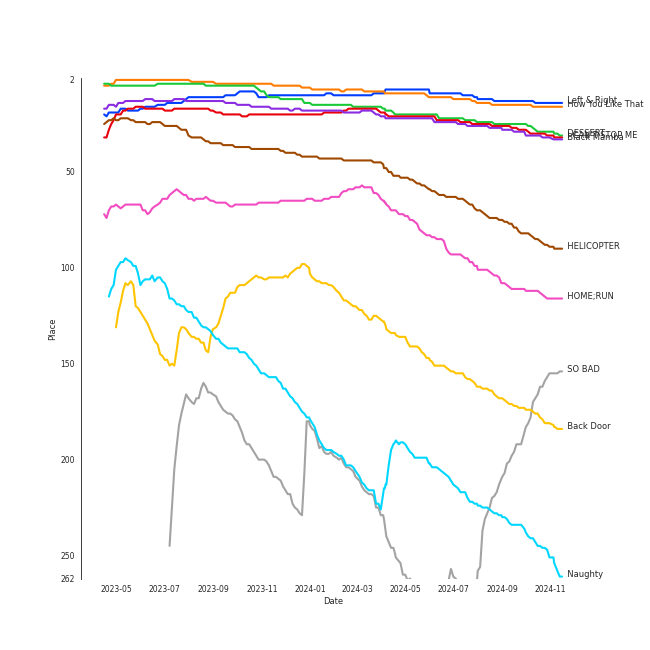

# Tracks in Workout from 2020

## Artists

| Art | Tracks | 💚 | Artist | 🔗 |
|:---|---:|---:|:---|:---|
|  | 3 | 3 | [Stray Kids](../../../artists/stray_kids/overview.md) | [🔗](https://open.spotify.com/artist/2dIgFjalVxs4ThymZ67YCE) |
|  | 2 | 2 | [SEVENTEEN](../../../artists/seventeen/overview.md) | [🔗](https://open.spotify.com/artist/7nqOGRxlXj7N2JYbgNEjYH) |
|  | 2 | 2 | [LOONA](../../../artists/loona/overview.md) | [🔗](https://open.spotify.com/artist/52zMTJCKluDlFwMQWmccY7) |
|  | 2 | 2 | [EVERGLOW](../../../artists/everglow/overview.md) | [🔗](https://open.spotify.com/artist/3ZZzT0naD25RhY2uZvIKkJ) |
|  | 2 | 2 | [BTS](../../../artists/bts/overview.md) | [🔗](https://open.spotify.com/artist/3Nrfpe0tUJi4K4DXYWgMUX) |
|  | 2 | 2 | [ITZY](../../../artists/itzy/overview.md) | [🔗](https://open.spotify.com/artist/2KC9Qb60EaY0kW4eH68vr3) |
|  | 1 | 1 | [TWICE](../../../artists/twice/overview.md) | [🔗](https://open.spotify.com/artist/7n2Ycct7Beij7Dj7meI4X0) |
|  | 1 | 1 | [NCT 127](../../../artists/nct_127/overview.md) | [🔗](https://open.spotify.com/artist/7f4ignuCJhLXfZ9giKT7rH) |
|  | 1 | 1 | ANNA | [🔗](https://open.spotify.com/artist/7K80yOTC0Id95gRaOxDG5u) |
|  | 1 | 1 | Red Velvet - IRENE & SEULGI | [🔗](https://open.spotify.com/artist/6bwp9ObI8FWvMPCIWVBmhl) |

View all

| Art | Tracks | 💚 | Artist | 🔗 |
|:---|---:|---:|:---|:---|
|  | 1 | 1 | [aespa](../../../artists/aespa/overview.md) | [🔗](https://open.spotify.com/artist/6YVMFz59CuY7ngCxTxjpxE) |
|  | 1 | 1 | [JEON SOYEON](../../../artists/jeon_soyeon/overview.md) | [🔗](https://open.spotify.com/artist/6Xg22wJOAcnvPUfk5WvODH) |
|  | 1 | 1 | [CLC](../../../artists/clc/overview.md) | [🔗](https://open.spotify.com/artist/6QyO41KctzGc70mVaVnXQO) |
|  | 1 | 1 | [Dua Lipa](../../../artists/dua_lipa/overview.md) | [🔗](https://open.spotify.com/artist/6M2wZ9GZgrQXHCFfjv46we) |
|  | 1 | 1 | Jessi | [🔗](https://open.spotify.com/artist/64k5e9kV9MdukXjFrR5R37) |
|  | 1 | 1 | [Doja Cat](../../../artists/doja_cat/overview.md) | [🔗](https://open.spotify.com/artist/5cj0lLjcoR7YOSnhnX0Po5) |
|  | 1 | 1 | [Agust D](../../../artists/agust_d/overview.md) | [🔗](https://open.spotify.com/artist/5RmQ8k4l3HZ8JoPb4mNsML) |
|  | 1 | 1 | SuperM | [🔗](https://open.spotify.com/artist/5BHFSMEjfLVx1JwRWjAOsE) |
|  | 1 | 1 | DaBaby | [🔗](https://open.spotify.com/artist/4r63FhuTkUYltbVAg5TQnk) |
|  | 1 | 1 | Cardi B | [🔗](https://open.spotify.com/artist/4kYSro6naA4h99UJvo89HB) |
|  | 1 | 1 | [BLACKPINK](../../../artists/blackpink/overview.md) | [🔗](https://open.spotify.com/artist/41MozSoPIsD1dJM0CLPjZF) |
|  | 1 | 1 | [NCT U](../../../artists/nct_u/overview.md) | [🔗](https://open.spotify.com/artist/3paGCCtX1Xr4Gx53mSeZuQ) |
|  | 1 | 1 | Loopy | [🔗](https://open.spotify.com/artist/3l9s67pOK4Stw9yW1wr0Bg) |
|  | 1 | 1 | Jhorrmountain | [🔗](https://open.spotify.com/artist/3aAX2y0amckZ7WcWoz2f2o) |
|  | 1 | 1 | HYO | [🔗](https://open.spotify.com/artist/3U7bOaJLuFkrmDQ1C1OqKl) |
|  | 1 | 1 | Daði Freyr | [🔗](https://open.spotify.com/artist/3Hb64DQZIhDCgyHKrzBXOL) |
|  | 1 | 1 | Puri | [🔗](https://open.spotify.com/artist/3ADyFy1orEwODaiHmRRMQp) |
|  | 1 | 1 | Megan Thee Stallion | [🔗](https://open.spotify.com/artist/181bsRPaVXVlUKXrxwZfHK) |
|  | 1 | 1 | [Jason Derulo](../../../artists/jason_derulo/overview.md) | [🔗](https://open.spotify.com/artist/07YZf4WDAMNwqr4jfgOZ8y) |
|  | 1 | 1 | [STAYC](../../../artists/stayc/overview.md) | [🔗](https://open.spotify.com/artist/01XYiBYaoMJcNhPokrg0l0) |

## Albums

| Art | Tracks | 💚 | Album | Release Date | 🔗 |
|:---|---:|---:|:---|:---|:---|
|  | 2 | 2 | IN LIFE | 2020-09-14 | [🔗](https://open.spotify.com/album/0aERWcI2KYSCM4biUihB9X) |
|  | 1 | 1 | reminiscence | 2020-02-03 | [🔗](https://open.spotify.com/album/0zH0C0fkzAjhSnGKLOuxwX) |
|  | 1 | 1 | [12:00] | 2020-10-19 | [🔗](https://open.spotify.com/album/3obToaukLcPbCLPPmWFzQi) |
|  | 1 | 1 | [#] | 2020-02-05 | [🔗](https://open.spotify.com/album/3OOqAsk58Xv8DHu1gRGtaC) |
|  | 1 | 1 | WAP (feat. Megan Thee Stallion) | 2020-08-07 | [🔗](https://open.spotify.com/album/2ogiazbrNEx0kQHGl5ZBTQ) |
|  | 1 | 1 | Think About Things | 2020-04-09 | [🔗](https://open.spotify.com/album/5gEUjiNfaVse6oloI0c6Vt) |
|  | 1 | 1 | THE ALBUM | 2020-10-02 | [🔗](https://open.spotify.com/album/71O60S5gIJSIAhdnrDIh3N) |
|  | 1 | 1 | Super One -The 1st Album | 2020-09-25 | [🔗](https://open.spotify.com/album/10fdwvVIpa0raPkZUTILAt) |
|  | 1 | 1 | Star To A Young Culture | 2020-11-12 | [🔗](https://open.spotify.com/album/4PrRd0lIunUEiiE5rbZklR) |
|  | 1 | 1 | Not Shy | 2020-08-17 | [🔗](https://open.spotify.com/album/5NN55LKbjzX16a7Uf8u7Os) |

View all

| Art | Tracks | 💚 | Album | Release Date | 🔗 |
|:---|---:|---:|:---|:---|:---|
|  | 1 | 1 | Naughty | 2020-07-20 | [🔗](https://open.spotify.com/album/2lkUE2gkw5sX0fGzZZCs0N) |
|  | 1 | 1 | NUNA | 2020-07-30 | [🔗](https://open.spotify.com/album/6XBIkDFhDgc3PQOUEcO2fd) |
|  | 1 | 1 | NCT RESONANCE Pt. 1 - The 2nd Album | 2020-10-12 | [🔗](https://open.spotify.com/album/6kudlOyCqSQfsBVSdPZEu4) |
|  | 1 | 1 | NCT #127 Neo Zone - The 2nd Album | 2020-03-06 | [🔗](https://open.spotify.com/album/5YOvg682zFOleCiSndLnZr) |
|  | 1 | 1 | MAP OF THE SOUL : 7 | 2020-02-21 | [🔗](https://open.spotify.com/album/5W1XY5ucNATjTULERvXx9j) |
|  | 1 | 1 | IT'z ME | 2020-03-09 | [🔗](https://open.spotify.com/album/7ynKAohxfwPUZzvU8f1p1U) |
|  | 1 | 1 | Heng:garæ | 2020-06-22 | [🔗](https://open.spotify.com/album/3q6lN3kfsDgGaQUC7kVASH) |
|  | 1 | 1 | HELICOPTER | 2020-09-02 | [🔗](https://open.spotify.com/album/1uwfxRAhW1hxclCVkzku8d) |
|  | 1 | 1 | GO LIVE | 2020-06-17 | [🔗](https://open.spotify.com/album/6DWLIzvmiLPAuDWYZqrLQo) |
|  | 1 | 1 | Future Nostalgia | 2020-03-27 | [🔗](https://open.spotify.com/album/5lKlFlReHOLShQKyRv6AL9) |
|  | 1 | 1 | Eyes Wide Open | 2020-10-26 | [🔗](https://open.spotify.com/album/33jypnU7WULxPaVrjj4RXH) |
|  | 1 | 1 | DESSERT | 2020-07-22 | [🔗](https://open.spotify.com/album/5brSFD1knAOSM7j6083naD) |
|  | 1 | 1 | D-2 | 2020-05-22 | [🔗](https://open.spotify.com/album/1Pp8t7yn2E3rz3R7ZqPn1O) |
|  | 1 | 1 | Coño | 2020-07-03 | [🔗](https://open.spotify.com/album/1h3x5tLWXhf438Y5AK60Ml) |
|  | 1 | 1 | Boss Bitch | 2020-01-23 | [🔗](https://open.spotify.com/album/4pmyFpGicLLIgNPc1TQXKc) |
|  | 1 | 1 | Black Mamba | 2020-11-17 | [🔗](https://open.spotify.com/album/3syEYrKIsgxaZMB5t1dVG7) |
|  | 1 | 1 | Bando | 2020-01-31 | [🔗](https://open.spotify.com/album/3UtdQcbHhNlEi79pS3282l) |
|  | 1 | 1 | BE | 2020-11-20 | [🔗](https://open.spotify.com/album/6nYfHQnvkvOTNHnOhDT3sr) |
|  | 1 | 1 | ; [Semicolon] | 2020-10-19 | [🔗](https://open.spotify.com/album/1EMYSiKKTSKLZrOC2nTStL) |
|  | 1 | 1 | -77.82x-78.29 | 2020-09-21 | [🔗](https://open.spotify.com/album/4kMID9cggWEko9mOb1zisI) |

## Tracks

| Art | Track | Album | Artists | Label | Rank | 💚 | 🔗 |
|:---|:---|:---|:---|:---|---:|:---|:---|
|  | How You Like That | THE ALBUM | [BLACKPINK](../../../artists/blackpink/overview.md) | [Interscope Records](../../../labels/interscope_records), [YG Entertainment](../../../labels/yg_entertainment) | 8 | 💚 | [🔗](https://open.spotify.com/track/4SFknyjLcyTLJFPKD2m96o) |
|  | Left & Right | Heng:garæ | [SEVENTEEN](../../../artists/seventeen/overview.md) | [PLEDIS Entertainment](../../../labels/pledis_entertainment) | 9 | 💚 | [🔗](https://open.spotify.com/track/5QGooKayQPVZMUDc8Qt3Dm) |
|  | DESSERT | DESSERT | HYO, Loopy, [JEON SOYEON](../../../artists/jeon_soyeon/overview.md) | [SM Entertainment](../../../labels/sm_entertainment) | 17 | 💚 | [🔗](https://open.spotify.com/track/6u0pZe0Uv7GBR0iKptfWRf) |
|  | I CAN'T STOP ME | Eyes Wide Open | [TWICE](../../../artists/twice/overview.md) | [Republic Records](../../../labels/republic_records) | 19 | 💚 | [🔗](https://open.spotify.com/track/37ZtpRBkHcaq6hHy0X98zn) |
|  | Black Mamba | Black Mamba | [aespa](../../../artists/aespa/overview.md) | [SM Entertainment](../../../labels/sm_entertainment) | 21 | 💚 | [🔗](https://open.spotify.com/track/1t2qYCAjUAoGfeFeoBlK51) |
|  | HELICOPTER | HELICOPTER | [CLC](../../../artists/clc/overview.md) | [Universal Music LLC](../../../labels/universal_music_llc) | 46 | 💚 | [🔗](https://open.spotify.com/track/2hJS7BdEaH9Jo8MeJujsHT) |
|  | HOME;RUN | ; [Semicolon] | [SEVENTEEN](../../../artists/seventeen/overview.md) | [PLEDIS Entertainment](../../../labels/pledis_entertainment) | 65 | 💚 | [🔗](https://open.spotify.com/track/2iW0q5jJJT5HKlIs25AAgv) |
|  | Back Door | IN LIFE | [Stray Kids](../../../artists/stray_kids/overview.md) | [Republic Records](../../../labels/republic_records) | 130 | 💚 | [🔗](https://open.spotify.com/track/0XuepwFJUcKN8T5zTqoP0F) |
|  | So What | [#] | [LOONA](../../../artists/loona/overview.md) | BlockBerryCreative | 207 | 💚 | [🔗](https://open.spotify.com/track/1ry2mTVmAJHbNLzl5qww5v) |
|  | Naughty | Naughty | Red Velvet - IRENE & SEULGI | [SM Entertainment](../../../labels/sm_entertainment) | 223 | 💚 | [🔗](https://open.spotify.com/track/0P8lbWigAHXPKxUG60xh79) |

View all

| Art | Track | Album | Artists | Label | Rank | 💚 | 🔗 |
|:---|:---|:---|:---|:---|---:|:---|:---|
|  | SO BAD | Star To A Young Culture | [STAYC](../../../artists/stayc/overview.md) | [High Up Entertainment](../../../labels/high_up_entertainment) | 224 | 💚 | [🔗](https://open.spotify.com/track/13KR2yNRDrbKwR3dOKCDl4) |
|  | Make A Wish (Birthday Song) | NCT RESONANCE Pt. 1 - The 2nd Album | [NCT U](../../../artists/nct_u/overview.md) | [SM Entertainment](../../../labels/sm_entertainment) | 362 | 💚 | [🔗](https://open.spotify.com/track/6FdShjf7nA2cqEnpv1tIia) |
|  | Not Shy | Not Shy | [ITZY](../../../artists/itzy/overview.md) | [Republic Records](../../../labels/republic_records) | 550 | 💚 | [🔗](https://open.spotify.com/track/1ehags7lQMM1qX94VJkoaf) |
|  | Bando | Bando | ANNA | Universal Music Italia srL. | 605 | 💚 | [🔗](https://open.spotify.com/track/0kzGjSRHGVcaWxagzQwAyD) |
|  | WANNABE | IT'z ME | [ITZY](../../../artists/itzy/overview.md) | [Republic Records](../../../labels/republic_records) | 634 | 💚 | [🔗](https://open.spotify.com/track/4pspYVQGFHLPEFgQPD1J7e) |
|  | LA DI DA | -77.82x-78.29 | [EVERGLOW](../../../artists/everglow/overview.md) | YUEHUA ENTERTAINMENT KOREA | 644 | 💚 | [🔗](https://open.spotify.com/track/6mIjJONoUMvGPT9Kzrab3L) |
|  | DUN DUN | reminiscence | [EVERGLOW](../../../artists/everglow/overview.md) | [Genie Music Corporation](../../../labels/genie_music_corporation), [Stone Music Entertainment](../../../labels/stone_music_entertainment) | 672 | 💚 | [🔗](https://open.spotify.com/track/3ejAkJLWQSEJDqDXxK3efB) |
|  | Boss Bitch | Boss Bitch | [Doja Cat](../../../artists/doja_cat/overview.md) | [Atlantic Records](../../../labels/atlantic_records) | nan | 💚 | [🔗](https://open.spotify.com/track/78qd8dvwea0Gosb6Fe6j3k) |
|  | ON | MAP OF THE SOUL : 7 | [BTS](../../../artists/bts/overview.md) | [BIGHIT MUSIC](../../../labels/bighit_music) | nan | 💚 | [🔗](https://open.spotify.com/track/0fZRNhPJ4AGmwY7rkpdbqK) |
|  | Kick It | NCT #127 Neo Zone - The 2nd Album | [NCT 127](../../../artists/nct_127/overview.md) | [SM Entertainment](../../../labels/sm_entertainment) | nan | 💚 | [🔗](https://open.spotify.com/track/1ayaOin9hxCtyhg4UsBTpg) |
|  | Levitating (feat. DaBaby) | Future Nostalgia | [Dua Lipa](../../../artists/dua_lipa/overview.md), DaBaby | [Warner Records](../../../labels/warner_records) | nan | 💚 | [🔗](https://open.spotify.com/track/5nujrmhLynf4yMoMtj8AQF) |
|  | Think About Things | Think About Things | Daði Freyr | Samlist | nan | 💚 | [🔗](https://open.spotify.com/track/2iRniYXjMHKmwXqA2jYXP7) |
|  | Daechwita | D-2 | [Agust D](../../../artists/agust_d/overview.md) | [BIGHIT MUSIC](../../../labels/bighit_music) | nan | 💚 | [🔗](https://open.spotify.com/track/1Y7AZ3akqDipAyo6mmOQTy) |
|  | God’s Menu | GO LIVE | [Stray Kids](../../../artists/stray_kids/overview.md) | [Republic Records](../../../labels/republic_records) | nan | 💚 | [🔗](https://open.spotify.com/track/4XPXrcpyNr30Km6aPiflJy) |
|  | Coño | Coño | [Jason Derulo](../../../artists/jason_derulo/overview.md), Puri, Jhorrmountain | Spinnin' Records | nan | 💚 | [🔗](https://open.spotify.com/track/5DV4ZSCqbFv74ui3ZhimXo) |
|  | NUNU NANA | NUNA | Jessi | P NATION | nan | 💚 | [🔗](https://open.spotify.com/track/2cUzIBGMvx2BZ2Q1fzjdl1) |
|  | WAP (feat. Megan Thee Stallion) | WAP (feat. Megan Thee Stallion) | Cardi B, Megan Thee Stallion | [Atlantic/KSR](../../../labels/atlantic_records) | nan | 💚 | [🔗](https://open.spotify.com/track/4Oun2ylbjFKMPTiaSbbCih) |
|  | Any | IN LIFE | [Stray Kids](../../../artists/stray_kids/overview.md) | [Republic Records](../../../labels/republic_records) | nan | 💚 | [🔗](https://open.spotify.com/track/5S7kMbtEikXwCAHMu3R3jw) |
|  | Tiger Inside | Super One -The 1st Album | SuperM | [Capitol Records](../../../labels/capitol_records), [SM Entertainment](../../../labels/sm_entertainment) | nan | 💚 | [🔗](https://open.spotify.com/track/1ADlTU9mFc3oDdD9Vla2Yw) |
|  | Why Not? | [12:00] | [LOONA](../../../artists/loona/overview.md) | BlockBerryCreative | nan | 💚 | [🔗](https://open.spotify.com/track/6yGQ86UppYULzTCxAWgwVN) |
|  | Telepathy | BE | [BTS](../../../artists/bts/overview.md) | [BIGHIT MUSIC](../../../labels/bighit_music) | nan | 💚 | [🔗](https://open.spotify.com/track/6Fnvi5QnVkTskSzeRvvQds) |

