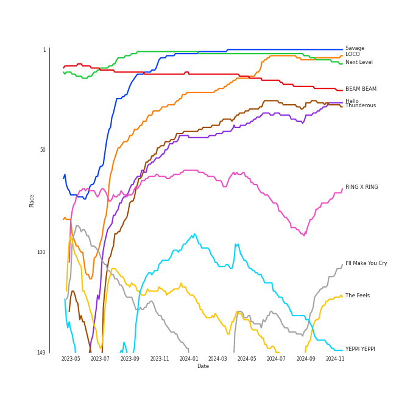

# Tracks in Workout from 2021

## Artists

| Art | Rank | Tracks | 💚 | Artist | 🔗 |
|:---|---:|---:|---:|:---|:---|
|  | 1 | 5 | 5 | [aespa](../../../artists/aespa/overview.md) | [🔗](https://open.spotify.com/artist/6YVMFz59CuY7ngCxTxjpxE) |
|  | 7 | 4 | 4 | [ENHYPEN](../../../artists/enhypen/overview.md) | [🔗](https://open.spotify.com/artist/5t5FqBwTcgKTaWmfEbwQY9) |
|  | 10 | 3 | 3 | [Stray Kids](../../../artists/stray_kids/overview.md) | [🔗](https://open.spotify.com/artist/2dIgFjalVxs4ThymZ67YCE) |
|  | 37 | 2 | 2 | [EVERGLOW](../../../artists/everglow/overview.md) | [🔗](https://open.spotify.com/artist/3ZZzT0naD25RhY2uZvIKkJ) |
|  | 5 | 2 | 2 | [ITZY](../../../artists/itzy/overview.md) | [🔗](https://open.spotify.com/artist/2KC9Qb60EaY0kW4eH68vr3) |
|  | 12 | 1 | 1 | [SEVENTEEN](../../../artists/seventeen/overview.md) | [🔗](https://open.spotify.com/artist/7nqOGRxlXj7N2JYbgNEjYH) |
|  | 9 | 1 | 1 | [TWICE](../../../artists/twice/overview.md) | [🔗](https://open.spotify.com/artist/7n2Ycct7Beij7Dj7meI4X0) |
|  | 413 | 1 | 1 | Lil Nas X | [🔗](https://open.spotify.com/artist/7jVv8c5Fj3E9VhNjxT4snq) |
|  | 26 | 1 | 1 | [JEON SOYEON](../../../artists/jeon_soyeon/overview.md) | [🔗](https://open.spotify.com/artist/6Xg22wJOAcnvPUfk5WvODH) |
|  | 413 | 1 | 1 | HyunA&DAWN | [🔗](https://open.spotify.com/artist/6JTCN21ovvrR3iPViZTXz4) |

View all

| Art | Rank | Tracks | 💚 | Artist | 🔗 |
|:---|---:|---:|---:|:---|:---|
|  | 42 | 1 | 1 | [ATEEZ](../../../artists/ateez/overview.md) | [🔗](https://open.spotify.com/artist/68KmkJeZGfwe1OUaivBa2L) |
|  | 413 | 1 | 1 | Jessi | [🔗](https://open.spotify.com/artist/64k5e9kV9MdukXjFrR5R37) |
|  | 29 | 1 | 1 | [Dreamcatcher](../../../artists/dreamcatcher/overview.md) | [🔗](https://open.spotify.com/artist/5V1qsQHdXNm4ZEZHWvFnqQ) |
|  | 96 | 1 | 1 | [LOONA](../../../artists/loona/overview.md) | [🔗](https://open.spotify.com/artist/52zMTJCKluDlFwMQWmccY7) |
|  | 14 | 1 | 1 | [CHUNG HA](../../../artists/chung_ha/overview.md) | [🔗](https://open.spotify.com/artist/2PSJ6YriU7JsFucxACpU7Y) |
|  | 21 | 1 | 1 | [Billlie](../../../artists/billlie/overview.md) | [🔗](https://open.spotify.com/artist/2GQxKDojobwBjZMPf7aoh0) |
|  | 24 | 1 | 1 | [NCT DREAM](../../../artists/nct_dream/overview.md) | [🔗](https://open.spotify.com/artist/1gBUSTR3TyDdTVFIaQnc02) |
|  | 50 | 1 | 1 | JOY | [🔗](https://open.spotify.com/artist/0sYpJ0nCC8AlDrZFeAA7ub) |
|  | 16 | 1 | 1 | [STAYC](../../../artists/stayc/overview.md) | [🔗](https://open.spotify.com/artist/01XYiBYaoMJcNhPokrg0l0) |
|  | 413 | 1 | 0 | HyunA | [🔗](https://open.spotify.com/artist/3UwlejyX2b458azZ7eCnHb) |

## Albums

| Art | Rank | Tracks | 💚 | Album | Release Date | 🔗 |
|:---|---:|---:|---:|:---|:---|:---|
|  | 6 | 4 | 4 | Savage - The 1st Mini Album | 2021-10-05 | [🔗](https://open.spotify.com/album/3vyyDkvYWC36DwgZCYd3Wu) |
|  | 31 | 3 | 3 | NOEASY | 2021-08-23 | [🔗](https://open.spotify.com/album/558tpdCejjVQNFAumRAeQj) |
|  | 113 | 3 | 3 | DIMENSION : DILEMMA | 2021-10-12 | [🔗](https://open.spotify.com/album/5jGRqioNCSWZGBl3QmyuFI) |
|  | 10 | 2 | 2 | CRAZY IN LOVE | 2021-09-24 | [🔗](https://open.spotify.com/album/4U7rGOkJgtxs27H9L93Xli) |
|  | 81 | 1 | 1 | the Billage of perception : chapter one | 2021-11-10 | [🔗](https://open.spotify.com/album/1kp4txZsSpDNR4EoDFi2LD) |
|  | 362 | 1 | 1 | [Summer Holiday] | 2021-07-30 | [🔗](https://open.spotify.com/album/3dD0qCBPe7eYeaftyIKwa5) |
|  | 611 | 1 | 1 | [&] | 2021-06-28 | [🔗](https://open.spotify.com/album/747FhjbZXy5H8frCZ90eDv) |
|  | 19 | 1 | 1 | Windy | 2021-07-05 | [🔗](https://open.spotify.com/album/1lv92CIVZbB2BsHmIx7qJf) |
|  | 611 | 1 | 1 | STAYDOM | 2021-04-08 | [🔗](https://open.spotify.com/album/71hjsg660uio3Z8bnbB6fS) |
|  | 611 | 1 | 1 | SEVENTEEN 9th Mini Album 'Attacca' | 2021-10-22 | [🔗](https://open.spotify.com/album/2PIReru2w5i4JXOzeZnamd) |

View all

| Art | Rank | Tracks | 💚 | Album | Release Date | 🔗 |
|:---|---:|---:|---:|:---|:---|:---|
|  | 611 | 1 | 1 | Return of The Girl | 2021-12-01 | [🔗](https://open.spotify.com/album/28p4jKCNlbLUXaZ24iYLuD) |
|  | 171 | 1 | 1 | Querencia | 2021-02-15 | [🔗](https://open.spotify.com/album/1p2OBhqq0d1N8awjHV9xA3) |
|  | 9 | 1 | 1 | Next Level | 2021-05-17 | [🔗](https://open.spotify.com/album/2CzbrboOLzeRoaaH1N5K0N) |
|  | 611 | 1 | 1 | MONTERO (Call Me By Your Name) | 2021-03-31 | [🔗](https://open.spotify.com/album/2Hjcfw8zHN4dJDZJGOzLd6) |
|  | 499 | 1 | 1 | Last Melody | 2021-05-25 | [🔗](https://open.spotify.com/album/4ZDUTnUO9CDFmwdCUCQ6dG) |
|  | 462 | 1 | 1 | KINGDOM <FINAL : WHO IS THE KING?> | 2021-05-28 | [🔗](https://open.spotify.com/album/3n1NaviPQXfiVQ0TarnAf4) |
|  | 243 | 1 | 1 | Hot Sauce - The 1st Album | 2021-05-10 | [🔗](https://open.spotify.com/album/1miTgxRTUje9Jqml1aOSUi) |
|  | 38 | 1 | 1 | Hello - Special Album | 2021-05-31 | [🔗](https://open.spotify.com/album/37mRfTDwQzVbHihypYY8oE) |
|  | 123 | 1 | 1 | Formula of Love: O+T=<3 | 2021-11-12 | [🔗](https://open.spotify.com/album/5052Ip89wdW8EGdpjEpNeq) |
|  | 611 | 1 | 1 | Cold Blooded | 2021-10-12 | [🔗](https://open.spotify.com/album/4CTDrZw6m0dTJX17OCEbfZ) |
|  | 160 | 1 | 1 | BORDER : CARNIVAL | 2021-04-26 | [🔗](https://open.spotify.com/album/4LGYBcRsteiXjcPD4QQvxv) |
|  | 611 | 1 | 1 | 1+1=1 | 2021-09-09 | [🔗](https://open.spotify.com/album/3LmraKOB9oNrXrifwrYePf) |
|  | 611 | 1 | 0 | I'm Not Cool | 2021-01-28 | [🔗](https://open.spotify.com/album/6DRfmdNDiTsTVACn9gavR0) |

## Tracks

| Art | Track | Album | Artists | Label | Rank | 💚 | 🔗 |
|:---|:---|:---|:---|:---|---:|:---|:---|
|  | Savage | Savage - The 1st Mini Album | [aespa](../../../artists/aespa/overview.md) | [SM Entertainment](../../../labels/sm_entertainment) | 1 | 💚 | [🔗](https://open.spotify.com/track/3dbLT62Cvs46Ju7a8gpr36) |
|  | Next Level | Next Level | [aespa](../../../artists/aespa/overview.md) | [SM Entertainment](../../../labels/sm_entertainment) | 3 | 💚 | [🔗](https://open.spotify.com/track/2zrhoHlFKxFTRF5aMyxMoQ) |
|  | LOCO | CRAZY IN LOVE | [ITZY](../../../artists/itzy/overview.md) | [Republic Records](../../../labels/republic_records) | 4 | 💚 | [🔗](https://open.spotify.com/track/56Yxkm62GtEpnPyG7TvwLY) |
|  | BEAM BEAM | Windy | [JEON SOYEON](../../../artists/jeon_soyeon/overview.md) | [Universal Music LLC](../../../labels/universal_music_llc) | 18 | 💚 | [🔗](https://open.spotify.com/track/1VjIS4qoyD6JS2rNZQgE00) |
|  | Thunderous | NOEASY | [Stray Kids](../../../artists/stray_kids/overview.md) | [Republic Records](../../../labels/republic_records) | 28 | 💚 | [🔗](https://open.spotify.com/track/0nwTMzpatarzvLvtwwzdCt) |
|  | Hello | Hello - Special Album | JOY | [SM Entertainment](../../../labels/sm_entertainment) | 36 | 💚 | [🔗](https://open.spotify.com/track/3cGp1jXxLReLKz7QgVbWZR) |
|  | RING X RING | the Billage of perception : chapter one | [Billlie](../../../artists/billlie/overview.md) | [MYSTIC STORY](../../../labels/mystic_story) | 90 | 💚 | [🔗](https://open.spotify.com/track/4hfF0FOFcaiOtwY3NP5hnv) |
|  | YEPPI YEPPI | Savage - The 1st Mini Album | [aespa](../../../artists/aespa/overview.md) | [SM Entertainment](../../../labels/sm_entertainment) | 127 | 💚 | [🔗](https://open.spotify.com/track/3UKKwGrpWWamc0XNSKXjmz) |
|  | I'll Make You Cry | Savage - The 1st Mini Album | [aespa](../../../artists/aespa/overview.md) | [SM Entertainment](../../../labels/sm_entertainment) | 139 | 💚 | [🔗](https://open.spotify.com/track/6l1dTAhX7P6EKvA11NLNuW) |
|  | The Feels | Formula of Love: O+T=<3 | [TWICE](../../../artists/twice/overview.md) | [Republic Records](../../../labels/republic_records) | 155 | 💚 | [🔗](https://open.spotify.com/track/308Ir17KlNdlrbVLHWhlLe) |

View all

| Art | Track | Album | Artists | Label | Rank | 💚 | 🔗 |
|:---|:---|:---|:---|:---|---:|:---|:---|
|  | Hot Sauce | Hot Sauce - The 1st Album | [NCT DREAM](../../../artists/nct_dream/overview.md) | [SM Entertainment](../../../labels/sm_entertainment) | 337 | 💚 | [🔗](https://open.spotify.com/track/6B8MM3PVQtUbZLay7tP7er) |
|  | Go Big or Go Home | DIMENSION : DILEMMA | [ENHYPEN](../../../artists/enhypen/overview.md) | [BELIFT LAB](../../../labels/belift_lab) | 383 | 💚 | [🔗](https://open.spotify.com/track/6IqKFke4ZhKbGYULllEezY) |
|  | BEcause | [Summer Holiday] | [Dreamcatcher](../../../artists/dreamcatcher/overview.md) | [DREAMCATCHER COMPANY](../../../labels/dreamcatcher_company) | 527 | 💚 | [🔗](https://open.spotify.com/track/0ufYP4HLjzVSLUsGKCIQJH) |
|  | Bicycle | Querencia | [CHUNG HA](../../../artists/chung_ha/overview.md) | [MNH ENTERTAINMENT](../../../labels/mnh_entertainment) | 559 | 💚 | [🔗](https://open.spotify.com/track/7wDVvxMUdW5MtJUqFtuXUz) |
|  | Drunk-Dazed | BORDER : CARNIVAL | [ENHYPEN](../../../artists/enhypen/overview.md) | [BELIFT LAB](../../../labels/belift_lab) | 607 | 💚 | [🔗](https://open.spotify.com/track/1wcr8DjnN59Awev8nnKpQ4) |
|  | Tamed-Dashed | DIMENSION : DILEMMA | [ENHYPEN](../../../artists/enhypen/overview.md) | [BELIFT LAB](../../../labels/belift_lab) | 688 | 💚 | [🔗](https://open.spotify.com/track/1zoyteFQmeUUqyOl2Xznpy) |
|  | The Real | KINGDOM <FINAL : WHO IS THE KING?> | [ATEEZ](../../../artists/ateez/overview.md) | [Genie Music Corporation](../../../labels/genie_music_corporation), [Stone Music Entertainment](../../../labels/stone_music_entertainment) | 690 | 💚 | [🔗](https://open.spotify.com/track/1uk5fYLx1f88DLte84Hl5j) |
|  | FIRST | Last Melody | [EVERGLOW](../../../artists/everglow/overview.md) | [Genie Music Corporation](../../../labels/genie_music_corporation), [Stone Music Entertainment](../../../labels/stone_music_entertainment) | 749 | 💚 | [🔗](https://open.spotify.com/track/021L6LlBBtr34BmFRHd9Ic) |
|  | I'm Not Cool | I'm Not Cool | HyunA | P NATION | 920 | | [🔗](https://open.spotify.com/track/5iIpbD34k4wnuRMZDNnuWf) |
|  | MONTERO (Call Me By Your Name) | MONTERO (Call Me By Your Name) | Lil Nas X | [Columbia](../../../labels/columbia) | 920 | 💚 | [🔗](https://open.spotify.com/track/67BtfxlNbhBmCDR2L2l8qd) |
|  | ASAP | STAYDOM | [STAYC](../../../artists/stayc/overview.md) | [High Up Entertainment](../../../labels/high_up_entertainment) | 920 | 💚 | [🔗](https://open.spotify.com/track/5BXr7hYZQOeRttkeWYTq5S) |
|  | PTT (Paint The Town) | [&] | [LOONA](../../../artists/loona/overview.md) | BlockBerry Creative | 920 | 💚 | [🔗](https://open.spotify.com/track/5awNIWVrh2ISfvPd5IUZNh) |
|  | CHEESE | NOEASY | [Stray Kids](../../../artists/stray_kids/overview.md) | [Republic Records](../../../labels/republic_records) | 920 | 💚 | [🔗](https://open.spotify.com/track/7qpSatdWQcRHA3hpedL2u4) |
|  | DOMINO | NOEASY | [Stray Kids](../../../artists/stray_kids/overview.md) | [Republic Records](../../../labels/republic_records) | 920 | 💚 | [🔗](https://open.spotify.com/track/6Ib6RkvLBMD85bov85apSL) |
|  | PING PONG | 1+1=1 | HyunA&DAWN | P NATION | 920 | 💚 | [🔗](https://open.spotify.com/track/0Z99Xe1lGBmq60RwJ5YU18) |
|  | Gas Me Up | CRAZY IN LOVE | [ITZY](../../../artists/itzy/overview.md) | [Republic Records](../../../labels/republic_records) | 920 | 💚 | [🔗](https://open.spotify.com/track/3RCMSJIlIZkvJP4LFGtOtu) |
|  | ICONIC | Savage - The 1st Mini Album | [aespa](../../../artists/aespa/overview.md) | [SM Entertainment](../../../labels/sm_entertainment) | 920 | 💚 | [🔗](https://open.spotify.com/track/5bMHrigI1EAmZdiyRzKoQi) |
|  | Cold Blooded | Cold Blooded | Jessi | [Genie Music Corporation](../../../labels/genie_music_corporation), [Stone Music Entertainment](../../../labels/stone_music_entertainment) | 920 | 💚 | [🔗](https://open.spotify.com/track/34JfHOd0fcefm4FSPSrIhF) |
|  | Attention, please! | DIMENSION : DILEMMA | [ENHYPEN](../../../artists/enhypen/overview.md) | [BELIFT LAB](../../../labels/belift_lab) | 920 | 💚 | [🔗](https://open.spotify.com/track/59qDYPZPkMPl8qSYRig1xn) |
|  | Rock with you | SEVENTEEN 9th Mini Album 'Attacca' | [SEVENTEEN](../../../artists/seventeen/overview.md) | [PLEDIS Entertainment](../../../labels/pledis_entertainment) | 920 | 💚 | [🔗](https://open.spotify.com/track/6LnEoRQKMcaFTR5UvaKuBy) |
|  | Pirate | Return of The Girl | [EVERGLOW](../../../artists/everglow/overview.md) | [Genie Music Corporation](../../../labels/genie_music_corporation), [Stone Music Entertainment](../../../labels/stone_music_entertainment) | 920 | 💚 | [🔗](https://open.spotify.com/track/0Vu5tjvXZX3qtzRiezxLi1) |

