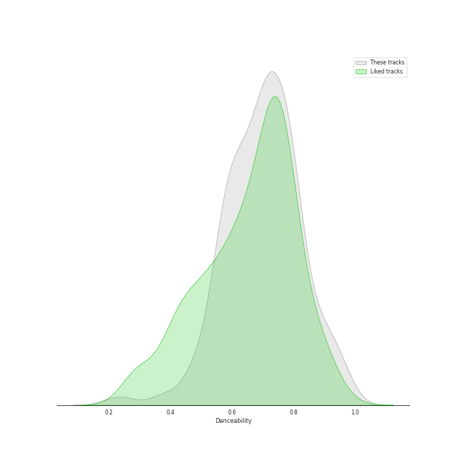
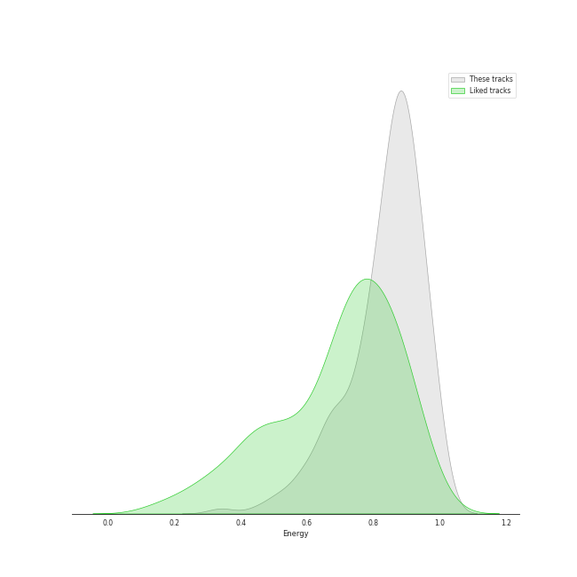
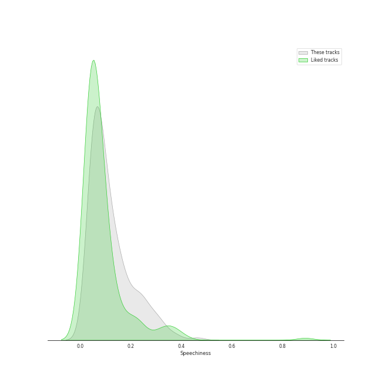
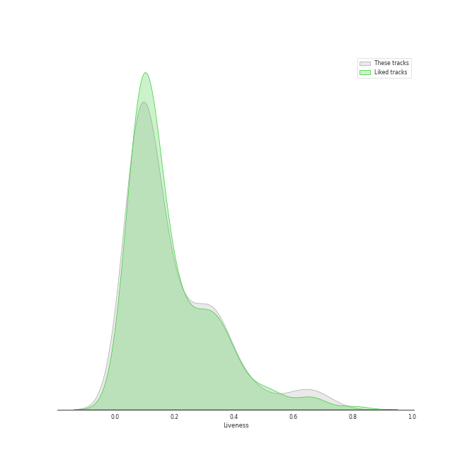
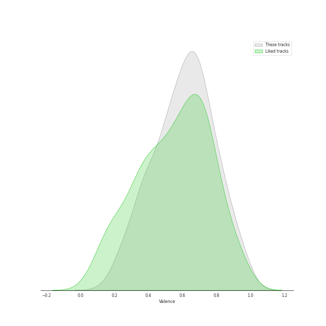
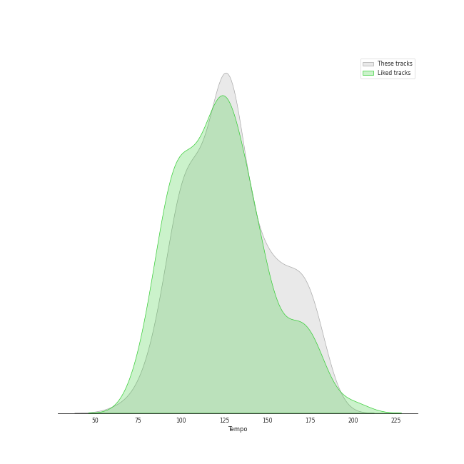

# Audio Features for Workout

## Danceability

| 10 most Danceable tracks | 10 least Danceable tracks |
|:---|:---|
| SexyBack (feat. Timbaland) (0.967) | Awadama Fever (0.211) |
| Anaconda (0.964) | Rondo of Nightmare (0.258) |
| Cold Blooded (0.961) | Headbangeeeeerrrrr!!!!! (0.371) |
| #Twenty (0.956) | CHEESE (0.376) |
| WAP (feat. Megan Thee Stallion) (0.935) | KARATE (0.381) |
| RUN (HAN) (0.929) | Hello (0.392) |
| Baby Got Back (0.926) | Radioactive (0.448) |
| Typa Girl (0.915) | Everybody Talks (0.471) |
| BOOM (0.914) | LA DI DA (0.477) |
| Mr. Simple (0.913) | Shatter Me Featuring Lzzy Hale (0.483) |

## Energy

| 10 most Energetic tracks | 10 least Energetic tracks |
|:---|:---|
| War of Hormone (0.993) | Think About Things (0.341) |
| チョコレイト・ディスコ (0.99) | WAP (feat. Megan Thee Stallion) (0.454) |
| Shanti Shanti Shanti (0.988) | Sally Walker (0.492) |
| Rondo of Nightmare (0.987) | MONTERO (Call Me By Your Name) (0.508) |
| RING X RING (0.987) | BOOM (0.516) |
| Headbangeeeeerrrrr!!!!! (0.985) | Coño (0.528) |
| Gimme Chocolate!! (0.985) | HELLO (0.575) |
| Boys & Girls (0.985) | SexyBack (feat. Timbaland) (0.583) |
| Hit That Drum (0.984) | Dance Monkey (0.588) |
| KARATE (0.982) | One Last Time (0.593) |

## Speechiness

| 10 most Speechy tracks | 10 least Speechy tracks |
|:---|:---|
| Youngblood (0.463) | NUNU NANA (0.0289) |
| MANIAC (0.411) | The Other Side (feat. CeeLo Green and B.o.B) (0.0303) |
| WAP (feat. Megan Thee Stallion) (0.375) | RBB (Really Bad Boy) (0.0317) |
| Girls (0.325) | One Last Time (0.0323) |
| Rondo of Nightmare (0.303) | Likey (0.033) |
| Baby Got Back (0.301) | The Real (0.0349) |
| Gas Me Up (0.286) | チョコレイト・ディスコ (0.0351) |
| Crazy (0.279) | ASAP (0.0351) |
| Back Door (0.272) | Up & Down (0.0351) |
| KARATE (0.271) | 러시안 룰렛 Russian Roulette (0.0357) |

## Acousticness

| 10 most Acoustic tracks | 10 least Acoustic tracks |
|:---|:---|
| RUN (HAN) (0.703) | Headbangeeeeerrrrr!!!!! (7.67e-05) |
| Dance Monkey (0.692) | Mr. Simple (0.000219) |
| ICONIC (0.509) | Tamed-Dashed (0.000253) |
| Next Level (0.488) | Gimme Chocolate!! (0.000282) |
| Break Ya Neck (0.443) | Boys & Girls (0.000388) |
| Likey (0.413) | Awadama Fever (0.000405) |
| Hello (0.351) | Attention, please! (0.000483) |
| Cheshire (0.332) | Coño (0.000554) |
| 행복 (Happiness) (0.323) | Drunk-Dazed (0.000707) |
| Kill This Love (0.323) | KARATE (0.00071) |

## Instrumentalness

| 10 most Instrumental tracks | 10 least Instrumental tracks |
|:---|:---|
| だいじょばない (0.844) | TOMBOY (0.0) |
| Awadama Fever (0.555) | Typa Girl (0.0) |
| Shanti Shanti Shanti (0.318) | SexyBack (feat. Timbaland) (0.0) |
| KARATE (0.172) | Pirate (0.0) |
| Headbangeeeeerrrrr!!!!! (0.0611) | Back Door (0.0) |
| Boys & Girls (0.0145) | Hype Boy (0.0) |
| Coño (0.0101) | How People Move (0.0) |
| チョコレイト・ディスコ (0.0079) | #Twenty (0.0) |
| Power Up (0.00745) | ON (0.0) |
| Supermassive Black Hole (0.00517) | Thunderous (0.0) |

## Liveness

| 10 most Live tracks | 10 least Live tracks |
|:---|:---|
| 행복 (Happiness) (0.725) | PING PONG (0.0202) |
| NUNU NANA (0.708) | Uptown Funk (feat. Bruno Mars) (0.0344) |
| Hello Good Morning (0.669) | Run BTS (0.0358) |
| Radioactive (0.668) | Cold Blooded (0.0372) |
| Typa Girl (0.628) | BOOM (0.0441) |
| FANCY (0.627) | Birthday (0.0491) |
| Super Bass (0.601) | SET ME FREE (0.0499) |
| Step Back (0.596) | Guerrilla (0.0506) |
| Give it to me (0.576) | How People Move (0.0511) |
| God’s Menu (0.521) | SexyBack (feat. Timbaland) (0.0519) |

## Valence

| 10 most Happy tracks | 10 least Happy tracks |
|:---|:---|
| Devil (0.968) | One Last Time (0.104) |
| SexyBack (feat. Timbaland) (0.964) | Youngblood (0.152) |
| チョコレイト・ディスコ (0.963) | Outlaw (0.218) |
| Give it to me (0.961) | Daechwita (0.223) |
| 러시안 룰렛 Russian Roulette (0.958) | KARATE (0.23) |
| Left & Right (0.95) | Don't Call Me Up (0.234) |
| Uptown Funk (feat. Bruno Mars) (0.928) | Radioactive (0.236) |
| The Feels (0.922) | Alter Ego (0.26) |
| Levitating (feat. DaBaby) (0.915) | Rondo of Nightmare (0.264) |
| Power Up (0.898) | Headbangeeeeerrrrr!!!!! (0.275) |

## Tempo

| 10 most Fast tracks | 10 least Fast tracks |
|:---|:---|
| Hello (185.869) | Run Devil Run (64.927) |
| Headbangeeeeerrrrr!!!!! (185.009) | Run BTS (77.004) |
| Guerrilla (181.963) | Green Light (feat. André 3000) (77.506) |
| Pink Venom (180.169) | Goddess Level (82.953) |
| KARATE (179.924) | I Did Something Bad (82.989) |
| TANK (179.905) | Break Ya Neck (83.011) |
| MONTERO (Call Me By Your Name) (178.818) | Take on Me (84.412) |
| BLAME IT ON ME (177.713) | CHEESE (89.657) |
| Gas Me Up (177.17) | Alter Ego (89.951) |
| Crazy (176.019) | Illusion (90.027) |
