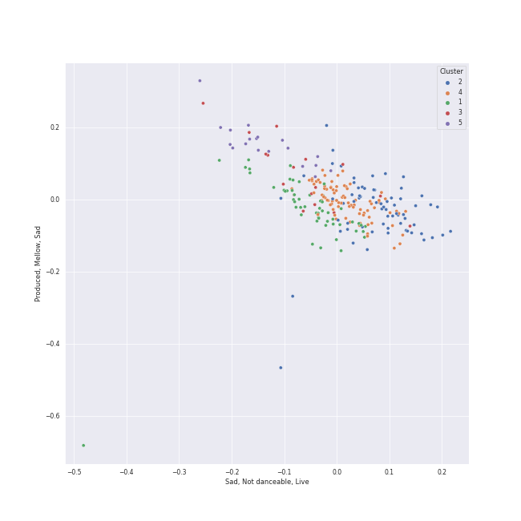

# Clusters in Workout

## Cluster #1

60 tracks

| Art | Track | Album | Artists | Label | Rank | 💚 | 🔗 |
|:---|:---|:---|:---|:---|---:|:---|:---|
|  | ANTIFRAGILE | ANTIFRAGILE | [LE SSERAFIM](../../../../artists/le_sserafim/overview.md) | [SOURCE MUSIC](../../../../labels/source_music) | 146 | 💚 | [🔗](https://open.spotify.com/track/4fsQ0K37TOXa3hEQfjEic1) |
|  | Rude Boy | Rated R | [Rihanna](../../../../artists/rihanna/overview.md) | [Def Jam Recordings](../../../../labels/def_jam_recordings) | 966 | 💚 | [🔗](https://open.spotify.com/track/60jzFy6Nn4M0iD1d94oteF) |
|  | Run Devil Run | Run Devil Run - The 2nd Album Repackage | [Girls' Generation](../../../../artists/girls__generation/overview.md) | [SM Entertainment](../../../../labels/sm_entertainment) | 68 | 💚 | [🔗](https://open.spotify.com/track/0U9jNoTJeTxXToakhsb7pV) |
|  | Impossible | RIIZING | RIIZE | [RCA Records Label](../../../../labels/rca_records_label), [SM Entertainment](../../../../labels/sm_entertainment) | 553 | | [🔗](https://open.spotify.com/track/0GIzsyWjS0wb15Q7zB5L7b) |
|  | DASH | Fe3O4: BREAK | [NMIXX](../../../../artists/nmixx/overview.md) | [Republic Records](../../../../labels/republic_records) | 69 | 💚 | [🔗](https://open.spotify.com/track/2RoYgkPzUY0vY7lhUuyus1) |
|  | Mr. Simple | Mr. Simple - The 5th Album | [SUPER JUNIOR](../../../../artists/super_junior/overview.md) | [SM Entertainment](../../../../labels/sm_entertainment) | 966 | 💚 | [🔗](https://open.spotify.com/track/6QTBYKLlV2PQniwAWrBV2z) |
|  | Spicy | MY WORLD - The 3rd Mini Album | [aespa](../../../../artists/aespa/overview.md) | [SM Entertainment](../../../../labels/sm_entertainment), [Warner Records](../../../../labels/warner_records) | 30 | 💚 | [🔗](https://open.spotify.com/track/1ULdASrNy5rurl1TZfFaMP) |
|  | VERY NICE | Love&Letter repackage album | [SEVENTEEN](../../../../artists/seventeen/overview.md) | [PLEDIS ENTERTAINMENT](../../../../labels/pledis_entertainment) | 707 | | [🔗](https://open.spotify.com/track/1Rrj7KyS2R6SP9CQMDJW1w) |
|  | Bubble | TEENFRESH | [STAYC](../../../../artists/stayc/overview.md) | [High Up Entertainment](../../../../labels/high_up_entertainment) | 80 | 💚 | [🔗](https://open.spotify.com/track/4P5ozkI1bxiGxA5rZ27jlO) |
|  | Waka Waka (This Time for Africa) [The Official 2010 FIFA World Cup (TM) Song] (feat. Freshlyground) | Waka Waka (This Time for Africa) [The Official 2010 FIFA World Cup (TM) Song] (feat. Freshlyground) | Shakira, Freshlyground | [Epic](../../../../labels/epic) | 966 | 💚 | [🔗](https://open.spotify.com/track/2Cd9iWfcOpGDHLz6tVA3G4) |
## Cluster #2

16 tracks

| Art | Track | Album | Artists | Label | Rank | 💚 | 🔗 |
|:---|:---|:---|:---|:---|---:|:---|:---|
|  | LALALALA | ROCK-STAR | [Stray Kids](../../../../artists/stray_kids/overview.md) | [Republic Records](../../../../labels/republic_records) | 298 | 💚 | [🔗](https://open.spotify.com/track/1OG1NoKpZZLrMqMYCk9m84) |
|  | God’s Menu | GO LIVE | [Stray Kids](../../../../artists/stray_kids/overview.md) | [Republic Records](../../../../labels/republic_records) | 966 | 💚 | [🔗](https://open.spotify.com/track/4XPXrcpyNr30Km6aPiflJy) |
|  | Step Back | Step Back | [GOT the beat](../../../../artists/got_the_beat/overview.md) | [SM Entertainment](../../../../labels/sm_entertainment) | 712 | 💚 | [🔗](https://open.spotify.com/track/3LCwQoTrdQgHsGJE5gGVqx) |
|  | Typa Girl | BORN PINK | [BLACKPINK](../../../../artists/blackpink/overview.md) | [Interscope Records](../../../../labels/interscope_records), [YG Entertainment](../../../../labels/yg_entertainment) | 732 | 💚 | [🔗](https://open.spotify.com/track/0L8LOav65XwLjCLS11gNPD) |
|  | BOOMBAYAH | SQUARE ONE | [BLACKPINK](../../../../artists/blackpink/overview.md) | [YG Entertainment](../../../../labels/yg_entertainment) | 132 | 💚 | [🔗](https://open.spotify.com/track/13MF2TYuyfITClL1R2ei6e) |
|  | Hit That Drum | Summer Magic - Summer Mini Album | [Red Velvet](../../../../artists/red_velvet/overview.md) | [SM Entertainment](../../../../labels/sm_entertainment) | 966 | 💚 | [🔗](https://open.spotify.com/track/7dafpAJczCDB1Pzz7bRSCh) |
|  | NUNU NANA | NUNA | Jessi | P NATION | 966 | 💚 | [🔗](https://open.spotify.com/track/2cUzIBGMvx2BZ2Q1fzjdl1) |
|  | Hobgoblin | CRYSTYLE | [CLC](../../../../artists/clc/overview.md) | [CUBE ENTERTAINMENT](../../../../labels/cube_entertainment) | 549 | 💚 | [🔗](https://open.spotify.com/track/2pSOUHBQXkN3fS2TAJHhfR) |
|  | Hello Bitches | Hello Bitches | CL | [YG Entertainment](../../../../labels/yg_entertainment) | 966 | 💚 | [🔗](https://open.spotify.com/track/72ysGFB4mZTgQsPqN9PzPS) |
|  | Hello Good Morning | Last Train To Paris | Diddy - Dirty Money, T.I. | [Bad Boy](../../../../labels/bad_boy), [Interscope Records](../../../../labels/interscope_records) | 966 | 💚 | [🔗](https://open.spotify.com/track/7yzSijmAyOMBcHrK6Tfsoe) |
## Cluster #3

55 tracks

| Art | Track | Album | Artists | Label | Rank | 💚 | 🔗 |
|:---|:---|:---|:---|:---|---:|:---|:---|
|  | UNFORGIVEN (feat. Nile Rodgers) | UNFORGIVEN | [LE SSERAFIM](../../../../artists/le_sserafim/overview.md), Nile Rodgers | [SOURCE MUSIC](../../../../labels/source_music) | 145 | 💚 | [🔗](https://open.spotify.com/track/51vRumtqbkNW9wrKfESwfu) |
|  | ...Ready For It? | reputation | [Taylor Swift](../../../../artists/taylor_swift/overview.md) | [Big Machine Records, LLC](../../../../labels/big_machine_records) | 473 | 💚 | [🔗](https://open.spotify.com/track/2yLa0QULdQr0qAIvVwN6B5) |
|  | Social Path (Feat. LiSA) (Korean Ver.) | ROCK-STAR | [Stray Kids](../../../../artists/stray_kids/overview.md), LiSA | [Republic Records](../../../../labels/republic_records) | 203 | 💚 | [🔗](https://open.spotify.com/track/5w6HF09YaD6wWlC90NaeVP) |
|  | Stamp On It | Stamp On It - The 1st Mini Album | [GOT the beat](../../../../artists/got_the_beat/overview.md) | [SM Entertainment](../../../../labels/sm_entertainment) | 35 | 💚 | [🔗](https://open.spotify.com/track/0mlxHb4jbPr1PUBUv0WHRS) |
|  | DDU-DU DDU-DU | SQUARE UP | [BLACKPINK](../../../../artists/blackpink/overview.md) | [Interscope Records](../../../../labels/interscope_records), [YG Entertainment](../../../../labels/yg_entertainment) | 73 | 💚 | [🔗](https://open.spotify.com/track/4lQsB3ERTWSNaAN1IkuNRl) |
|  | Voltage | Voltage | [ITZY](../../../../artists/itzy/overview.md) | [WM Japan](../../../../labels/wm_japan) | 493 | 💚 | [🔗](https://open.spotify.com/track/7e65OAe9L0xWPSHDiahjQe) |
|  | RBB (Really Bad Boy) | RBB - The 5th Mini Album | [Red Velvet](../../../../artists/red_velvet/overview.md) | [SM Entertainment](../../../../labels/sm_entertainment) | 107 | 💚 | [🔗](https://open.spotify.com/track/4xjVP2Vogo0C72o6Nevq0W) |
|  | BONA BONA | 2ND FULL ALBUM 'REBOOT' | [TREASURE](../../../../artists/treasure/overview.md) | [Columbia](../../../../labels/columbia), [YG Entertainment](../../../../labels/yg_entertainment) | 696 | 💚 | [🔗](https://open.spotify.com/track/0IkWksfw3Qxob96bjFKhyF) |
|  | Up & Down | AH YEAH | EXID | Yedang Entertainment | 574 | 💚 | [🔗](https://open.spotify.com/track/6BKOhvRPY54uvfqWwg7MKi) |
|  | ASAP | STAYDOM | [STAYC](../../../../artists/stayc/overview.md) | [High Up Entertainment](../../../../labels/high_up_entertainment) | 966 | 💚 | [🔗](https://open.spotify.com/track/5BXr7hYZQOeRttkeWYTq5S) |
## Cluster #4

44 tracks

| Art | Track | Album | Artists | Label | Rank | 💚 | 🔗 |
|:---|:---|:---|:---|:---|---:|:---|:---|
|  | Dope | The Most Beautiful Moment in Life: Young Forever | [BTS](../../../../artists/bts/overview.md) | [BIGHIT MUSIC](../../../../labels/bighit_music) | 966 | 💚 | [🔗](https://open.spotify.com/track/4o3Ao6wY5fbJR32fQKabfQ) |
|  | ParadoXXX Invasion | MANIFESTO : DAY 1 | [ENHYPEN](../../../../artists/enhypen/overview.md) | [BELIFT LAB](../../../../labels/belift_lab) | 20 | 💚 | [🔗](https://open.spotify.com/track/3OC2C8IpFhbUJTeMe55QYn) |
|  | DALLA DALLA | IT'z Different | [ITZY](../../../../artists/itzy/overview.md) | [Republic Records](../../../../labels/republic_records) | 710 | 💚 | [🔗](https://open.spotify.com/track/38rUIlTX93Aoif3WcY1wv6) |
|  | Peek-A-Boo | Perfect Velvet - The 2nd Album | [Red Velvet](../../../../artists/red_velvet/overview.md) | [SM Entertainment](../../../../labels/sm_entertainment) | 264 | 💚 | [🔗](https://open.spotify.com/track/42tFTth2jcF7iSo0RBjfJF) |
|  | 소방차 Fire Truck | NCT #127 - The 1st Mini Album | [NCT 127](../../../../artists/nct_127/overview.md) | [SM Entertainment](../../../../labels/sm_entertainment) | 633 | 💚 | [🔗](https://open.spotify.com/track/5hHlmrSV6d9LFMsDA1lamE) |
|  | Savage | Savage - The 1st Mini Album | [aespa](../../../../artists/aespa/overview.md) | [SM Entertainment](../../../../labels/sm_entertainment) | 1 | 💚 | [🔗](https://open.spotify.com/track/3dbLT62Cvs46Ju7a8gpr36) |
|  | HOT | SEVENTEEN 4th Album 'Face the Sun' | [SEVENTEEN](../../../../artists/seventeen/overview.md) | [PLEDIS Entertainment](../../../../labels/pledis_entertainment) | 966 | 💚 | [🔗](https://open.spotify.com/track/6I2tqFhk8tq69iursYxuxd) |
|  | DESSERT | DESSERT | HYO, Loopy, [JEON SOYEON](../../../../artists/jeon_soyeon/overview.md) | [SM Entertainment](../../../../labels/sm_entertainment) | 25 | 💚 | [🔗](https://open.spotify.com/track/6u0pZe0Uv7GBR0iKptfWRf) |
|  | HELICOPTER | HELICOPTER | [CLC](../../../../artists/clc/overview.md) | [Universal Music LLC](../../../../labels/universal_music_llc) | 78 | 💚 | [🔗](https://open.spotify.com/track/2hJS7BdEaH9Jo8MeJujsHT) |
|  | I'm Not Cool | I'm Not Cool | HyunA | P NATION | 966 | | [🔗](https://open.spotify.com/track/5iIpbD34k4wnuRMZDNnuWf) |
## Cluster #5

61 tracks

| Art | Track | Album | Artists | Label | Rank | 💚 | 🔗 |
|:---|:---|:---|:---|:---|---:|:---|:---|
|  | Telepathy | BE | [BTS](../../../../artists/bts/overview.md) | [BIGHIT MUSIC](../../../../labels/bighit_music) | 966 | 💚 | [🔗](https://open.spotify.com/track/6Fnvi5QnVkTskSzeRvvQds) |
|  | Smart | EASY | [LE SSERAFIM](../../../../artists/le_sserafim/overview.md) | [SOURCE MUSIC](../../../../labels/source_music) | 557 | 💚 | [🔗](https://open.spotify.com/track/4lR8sYGMGZPvthF2yUfo7T) |
|  | Don't Stop The Music | Good Girl Gone Bad: Reloaded | [Rihanna](../../../../artists/rihanna/overview.md) | [Def Jam Recordings](../../../../labels/def_jam_recordings) | 966 | 💚 | [🔗](https://open.spotify.com/track/0ByMNEPAPpOR5H69DVrTNy) |
|  | Talk Saxy | Talk Saxy | RIIZE | [RCA Records Label](../../../../labels/rca_records_label), [SM Entertainment](../../../../labels/sm_entertainment) | 966 | 💚 | [🔗](https://open.spotify.com/track/2cEwQnP4284g37N6D7ETND) |
|  | 2 Baddies | 2 Baddies - The 4th Album | [NCT 127](../../../../artists/nct_127/overview.md) | [SM Entertainment](../../../../labels/sm_entertainment) | 173 | 💚 | [🔗](https://open.spotify.com/track/1WKLxJpDqkQ9x1qEDNutoX) |
|  | Naughty | Naughty | Red Velvet - IRENE & SEULGI | [SM Entertainment](../../../../labels/sm_entertainment) | 237 | 💚 | [🔗](https://open.spotify.com/track/0P8lbWigAHXPKxUG60xh79) |
|  | JUMP | HARMONY : ALL IN | [P1Harmony](../../../../artists/p1harmony/overview.md) | [FNC ENTERTAINMENT](../../../../labels/fnc_entertainment) | 435 | 💚 | [🔗](https://open.spotify.com/track/4vTXBC7QOjEbi8DcJvCNE2) |
|  | Girls | Girls - The 2nd Mini Album | [aespa](../../../../artists/aespa/overview.md) | [SM Entertainment](../../../../labels/sm_entertainment), [Warner Records](../../../../labels/warner_records) | 229 | 💚 | [🔗](https://open.spotify.com/track/2WTHLEVjfefbGoW7F3dXIg) |
|  | Salty & Sweet | MY WORLD - The 3rd Mini Album | [aespa](../../../../artists/aespa/overview.md) | [SM Entertainment](../../../../labels/sm_entertainment), [Warner Records](../../../../labels/warner_records) | 135 | 💚 | [🔗](https://open.spotify.com/track/4wQDjZtXjsFtU3BLSiIH4t) |
|  | PTT (Paint The Town) | [&] | [LOONA](../../../../artists/loona/overview.md) | BlockBerry Creative | 966 | 💚 | [🔗](https://open.spotify.com/track/5awNIWVrh2ISfvPd5IUZNh) |