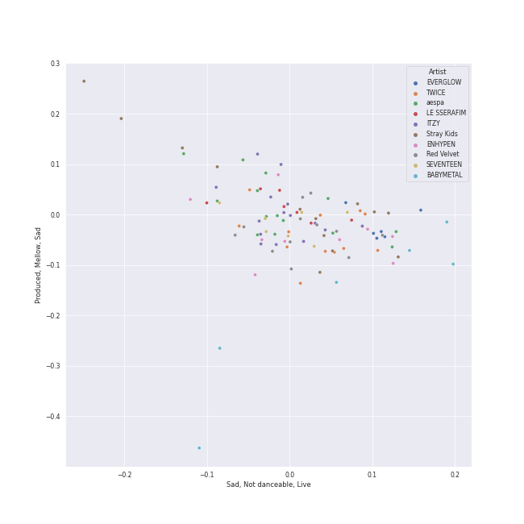
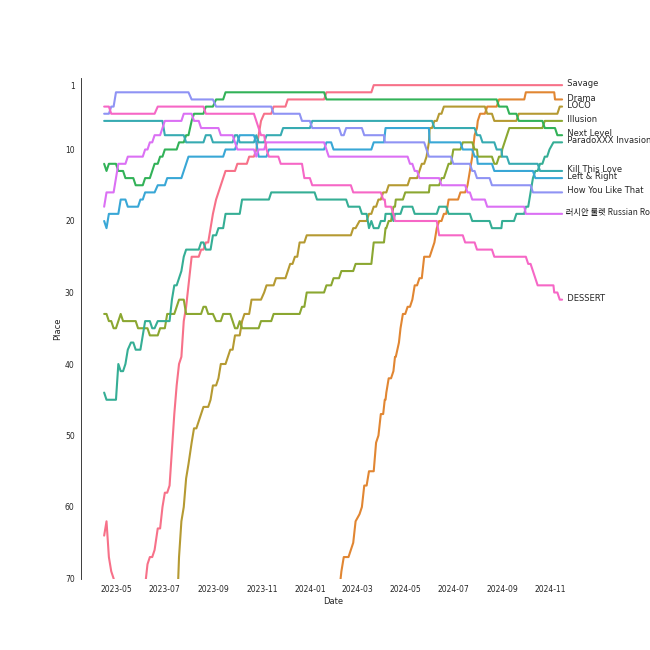
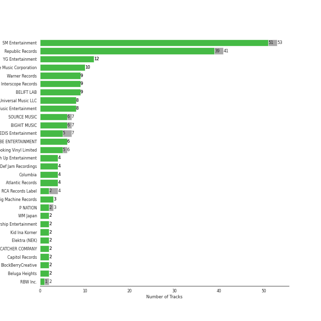
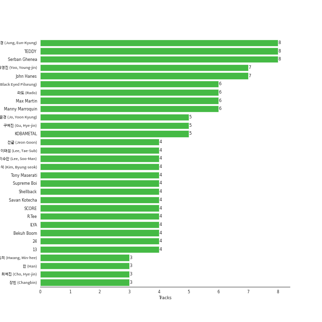

# Workout

[227 tracks (215 liked) 🔗](https://open.spotify.com/playlist/3NYClOhoC6ZSipLJBTsZfO)

[See Track Features](audio_features.md)

[See Clusters](clusters/overview.md)

## Top Artists

| Art | Tracks | 💚 | Artist | 🔗 |
|:---|---:|---:|:---|:---|
|  | 15 | 15 | [ITZY](../../artists/itzy/overview.md) | [🔗](https://open.spotify.com/artist/2KC9Qb60EaY0kW4eH68vr3) |
|  | 12 | 12 | [TWICE](../../artists/twice/overview.md) | [🔗](https://open.spotify.com/artist/7n2Ycct7Beij7Dj7meI4X0) |
|  | 12 | 12 | [Red Velvet](../../artists/red_velvet/overview.md) | [🔗](https://open.spotify.com/artist/1z4g3DjTBBZKhvAroFlhOM) |
|  | 13 | 11 | [Stray Kids](../../artists/stray_kids/overview.md) | [🔗](https://open.spotify.com/artist/2dIgFjalVxs4ThymZ67YCE) |
|  | 11 | 11 | [aespa](../../artists/aespa/overview.md) | [🔗](https://open.spotify.com/artist/6YVMFz59CuY7ngCxTxjpxE) |
|  | 8 | 8 | [ENHYPEN](../../artists/enhypen/overview.md) | [🔗](https://open.spotify.com/artist/5t5FqBwTcgKTaWmfEbwQY9) |
|  | 6 | 6 | [BLACKPINK](../../artists/blackpink/overview.md) | [🔗](https://open.spotify.com/artist/41MozSoPIsD1dJM0CLPjZF) |
|  | 7 | 5 | [SEVENTEEN](../../artists/seventeen/overview.md) | [🔗](https://open.spotify.com/artist/7nqOGRxlXj7N2JYbgNEjYH) |
|  | 6 | 5 | [BABYMETAL](../../artists/babymetal/overview.md) | [🔗](https://open.spotify.com/artist/630wzNP2OL7fl4Xl0GnMWq) |
|  | 6 | 5 | [BTS](../../artists/bts/overview.md) | [🔗](https://open.spotify.com/artist/3Nrfpe0tUJi4K4DXYWgMUX) |

See top 100 artists

| Art | Tracks | 💚 | Artist | 🔗 |
|:---|---:|---:|:---|:---|
|  | 5 | 5 | [GOT the beat](../../artists/got_the_beat/overview.md) | [🔗](https://open.spotify.com/artist/6uNxlIP5lzPFf0BHuELOuX) |
|  | 5 | 4 | [LE SSERAFIM](../../artists/le_sserafim/overview.md) | [🔗](https://open.spotify.com/artist/4SpbR6yFEvexJuaBpgAU5p) |
|  | 4 | 4 | [Ariana Grande](../../artists/ariana_grande/overview.md) | [🔗](https://open.spotify.com/artist/66CXWjxzNUsdJxJ2JdwvnR) |
|  | 4 | 4 | [Rihanna](../../artists/rihanna/overview.md) | [🔗](https://open.spotify.com/artist/5pKCCKE2ajJHZ9KAiaK11H) |
|  | 4 | 4 | [EVERGLOW](../../artists/everglow/overview.md) | [🔗](https://open.spotify.com/artist/3ZZzT0naD25RhY2uZvIKkJ) |
|  | 4 | 4 | [(G)I-DLE](../../artists/(g)i-dle/overview.md) | [🔗](https://open.spotify.com/artist/2AfmfGFbe0A0WsTYm0SDTx) |
|  | 4 | 4 | [STAYC](../../artists/stayc/overview.md) | [🔗](https://open.spotify.com/artist/01XYiBYaoMJcNhPokrg0l0) |
|  | 3 | 3 | [NCT 127](../../artists/nct_127/overview.md) | [🔗](https://open.spotify.com/artist/7f4ignuCJhLXfZ9giKT7rH) |
|  | 3 | 3 | [LOONA](../../artists/loona/overview.md) | [🔗](https://open.spotify.com/artist/52zMTJCKluDlFwMQWmccY7) |
|  | 3 | 3 | [Bruno Mars](../../artists/bruno_mars/overview.md) | [🔗](https://open.spotify.com/artist/0du5cEVh5yTK9QJze8zA0C) |
|  | 3 | 3 | [Jason Derulo](../../artists/jason_derulo/overview.md) | [🔗](https://open.spotify.com/artist/07YZf4WDAMNwqr4jfgOZ8y) |
|  | 3 | 3 | [Taylor Swift](../../artists/taylor_swift/overview.md) | [🔗](https://open.spotify.com/artist/06HL4z0CvFAxyc27GXpf02) |
|  | 3 | 2 | Nicki Minaj | [🔗](https://open.spotify.com/artist/0hCNtLu0JehylgoiP8L4Gh) |
|  | 2 | 2 | [SUPER JUNIOR](../../artists/super_junior/overview.md) | [🔗](https://open.spotify.com/artist/6gzXCdfYfFe5XKhPKkYqxV) |
|  | 2 | 2 | [JEON SOYEON](../../artists/jeon_soyeon/overview.md) | [🔗](https://open.spotify.com/artist/6Xg22wJOAcnvPUfk5WvODH) |
|  | 2 | 2 | [CLC](../../artists/clc/overview.md) | [🔗](https://open.spotify.com/artist/6QyO41KctzGc70mVaVnXQO) |
|  | 2 | 2 | [ATEEZ](../../artists/ateez/overview.md) | [🔗](https://open.spotify.com/artist/68KmkJeZGfwe1OUaivBa2L) |
|  | 2 | 2 | Jessi | [🔗](https://open.spotify.com/artist/64k5e9kV9MdukXjFrR5R37) |
|  | 2 | 2 | Iggy Azalea | [🔗](https://open.spotify.com/artist/5yG7ZAZafVaAlMTeBybKAL) |
|  | 2 | 2 | Imagine Dragons | [🔗](https://open.spotify.com/artist/53XhwfbYqKCa1cC15pYq2q) |
|  | 2 | 2 | [NCT U](../../artists/nct_u/overview.md) | [🔗](https://open.spotify.com/artist/3paGCCtX1Xr4Gx53mSeZuQ) |
|  | 2 | 2 | HYO | [🔗](https://open.spotify.com/artist/3U7bOaJLuFkrmDQ1C1OqKl) |
|  | 2 | 2 | [TREASURE](../../artists/treasure/overview.md) | [🔗](https://open.spotify.com/artist/3KonOYiLsU53m4yT7gNotP) |
|  | 2 | 2 | RIIZE | [🔗](https://open.spotify.com/artist/2jOm3cYujQx6o1dxuiuqaX) |
|  | 2 | 2 | Perfume | [🔗](https://open.spotify.com/artist/2XMxWKPKCxoLkSdpCViCnr) |
|  | 2 | 2 | [NCT DREAM](../../artists/nct_dream/overview.md) | [🔗](https://open.spotify.com/artist/1gBUSTR3TyDdTVFIaQnc02) |
|  | 2 | 2 | [Girls' Generation](../../artists/girls__generation/overview.md) | [🔗](https://open.spotify.com/artist/0Sadg1vgvaPqGTOjxu0N6c) |
|  | 2 | 1 | [CHUNG HA](../../artists/chung_ha/overview.md) | [🔗](https://open.spotify.com/artist/2PSJ6YriU7JsFucxACpU7Y) |
|  | 1 | 1 | Reol | [🔗](https://open.spotify.com/artist/7rpKUJ0AnklJ8q9nIPVSpZ) |
|  | 1 | 1 | Lil Nas X | [🔗](https://open.spotify.com/artist/7jVv8c5Fj3E9VhNjxT4snq) |
|  | 1 | 1 | [HWASA](../../artists/hwasa/overview.md) | [🔗](https://open.spotify.com/artist/7bmYpVgQub656uNTu6qGNQ) |
|  | 1 | 1 | ANNA | [🔗](https://open.spotify.com/artist/7K80yOTC0Id95gRaOxDG5u) |
|  | 1 | 1 | JIHYO | [🔗](https://open.spotify.com/artist/7F1iAHRYxR3MY7yAEuFqgL) |
|  | 1 | 1 | Calvin Harris | [🔗](https://open.spotify.com/artist/7CajNmpbOovFoOoasH2HaY) |
|  | 1 | 1 | Freshlyground | [🔗](https://open.spotify.com/artist/7AcV1lk8Zrgo1691PDWEle) |
|  | 1 | 1 | André 3000 | [🔗](https://open.spotify.com/artist/74V3dE1a51skRkdII8y2C6) |
|  | 1 | 1 | 4Minute | [🔗](https://open.spotify.com/artist/6cdC1cwqh3eJAXaxXJt2jv) |
|  | 1 | 1 | Red Velvet - IRENE & SEULGI | [🔗](https://open.spotify.com/artist/6bwp9ObI8FWvMPCIWVBmhl) |
|  | 1 | 1 | DARA | [🔗](https://open.spotify.com/artist/6WRl7KUrzOq7GpY97KrYxi) |
|  | 1 | 1 | [BIBI](../../artists/bibi/overview.md) | [🔗](https://open.spotify.com/artist/6UbmqUEgjLA6jAcXwbM1Z9) |
|  | 1 | 1 | [AKMU](../../artists/akmu/overview.md) | [🔗](https://open.spotify.com/artist/6OwKE9Ez6ALxpTaKcT5ayv) |
|  | 1 | 1 | [Dua Lipa](../../artists/dua_lipa/overview.md) | [🔗](https://open.spotify.com/artist/6M2wZ9GZgrQXHCFfjv46we) |
|  | 1 | 1 | HyunA&DAWN | [🔗](https://open.spotify.com/artist/6JTCN21ovvrR3iPViZTXz4) |
|  | 1 | 1 | [NewJeans](../../artists/newjeans/overview.md) | [🔗](https://open.spotify.com/artist/6HvZYsbFfjnjFrWF950C9d) |
|  | 1 | 1 | John Legend | [🔗](https://open.spotify.com/artist/5y2Xq6xcjJb2jVM54GHK3t) |
|  | 1 | 1 | B.o.B | [🔗](https://open.spotify.com/artist/5ndkK3dpZLKtBklKjxNQwT) |
|  | 1 | 1 | CeeLo Green | [🔗](https://open.spotify.com/artist/5nLYd9ST4Cnwy6NHaCxbj8) |
|  | 1 | 1 | [Doja Cat](../../artists/doja_cat/overview.md) | [🔗](https://open.spotify.com/artist/5cj0lLjcoR7YOSnhnX0Po5) |
|  | 1 | 1 | Timbaland | [🔗](https://open.spotify.com/artist/5Y5TRrQiqgUO4S36tzjIRZ) |
|  | 1 | 1 | [Dreamcatcher](../../artists/dreamcatcher/overview.md) | [🔗](https://open.spotify.com/artist/5V1qsQHdXNm4ZEZHWvFnqQ) |
|  | 1 | 1 | [Agust D](../../artists/agust_d/overview.md) | [🔗](https://open.spotify.com/artist/5RmQ8k4l3HZ8JoPb4mNsML) |
|  | 1 | 1 | 5 Seconds of Summer | [🔗](https://open.spotify.com/artist/5Rl15oVamLq7FbSb0NNBNy) |
|  | 1 | 1 | SuperM | [🔗](https://open.spotify.com/artist/5BHFSMEjfLVx1JwRWjAOsE) |
|  | 1 | 1 | DaBaby | [🔗](https://open.spotify.com/artist/4r63FhuTkUYltbVAg5TQnk) |
|  | 1 | 1 | Cardi B | [🔗](https://open.spotify.com/artist/4kYSro6naA4h99UJvo89HB) |
|  | 1 | 1 | Netta | [🔗](https://open.spotify.com/artist/4Z4afeDmHFxPmJorIwupbZ) |
|  | 1 | 1 | MONSTA X | [🔗](https://open.spotify.com/artist/4TnGh5PKbSjpYqpIdlW5nz) |
|  | 1 | 1 | T.I. | [🔗](https://open.spotify.com/artist/4OBJLual30L7gRl5UkeRcT) |
|  | 1 | 1 | BIGBANG | [🔗](https://open.spotify.com/artist/4Kxlr1PRlDKEB0ekOCyHgX) |
|  | 1 | 1 | Fitz and The Tantrums | [🔗](https://open.spotify.com/artist/4AcHt3JxKy59IX7JNNlZn4) |
|  | 1 | 1 | [YENA](../../artists/yena/overview.md) | [🔗](https://open.spotify.com/artist/49muoiIu4uea4PO8vueUNN) |
|  | 1 | 1 | Nile Rodgers | [🔗](https://open.spotify.com/artist/3yDIp0kaq9EFKe07X1X2rz) |
|  | 1 | 1 | [TAEYEON](../../artists/taeyeon/overview.md) | [🔗](https://open.spotify.com/artist/3qNVuliS40BLgXGxhdBdqu) |
|  | 1 | 1 | Loopy | [🔗](https://open.spotify.com/artist/3l9s67pOK4Stw9yW1wr0Bg) |
|  | 1 | 1 | Mark Ronson | [🔗](https://open.spotify.com/artist/3hv9jJF3adDNsBSIQDqcjp) |
|  | 1 | 1 | [EXO](../../artists/exo/overview.md) | [🔗](https://open.spotify.com/artist/3cjEqqelV9zb4BYE3qDQ4O) |
|  | 1 | 1 | Jhorrmountain | [🔗](https://open.spotify.com/artist/3aAX2y0amckZ7WcWoz2f2o) |
|  | 1 | 1 | alt-J | [🔗](https://open.spotify.com/artist/3XHO7cRUPCLOr6jwp8vsx5) |
| | 1 | 1 | En Butter | [🔗](https://open.spotify.com/artist/3X6XIt8zNXvrNzxb1R8TW5) |
|  | 1 | 1 | Sir Mix-A-Lot | [🔗](https://open.spotify.com/artist/3TQ9JTBI2n2hfo7aRONEYV) |
|  | 1 | 1 | [P1Harmony](../../artists/p1harmony/overview.md) | [🔗](https://open.spotify.com/artist/3JjvsPeGMbDJqsphe2z8xU) |
|  | 1 | 1 | Daði Freyr | [🔗](https://open.spotify.com/artist/3Hb64DQZIhDCgyHKrzBXOL) |
|  | 1 | 1 | BLITZERS | [🔗](https://open.spotify.com/artist/3Exoh42YMeqnUvYahAGgUE) |
|  | 1 | 1 | Puri | [🔗](https://open.spotify.com/artist/3ADyFy1orEwODaiHmRRMQp) |
|  | 1 | 1 | [Lindsey Stirling](../../artists/lindsey_stirling/overview.md) | [🔗](https://open.spotify.com/artist/378dH6EszOLFShpRzAQkVM) |
|  | 1 | 1 | Justin Timberlake | [🔗](https://open.spotify.com/artist/31TPClRtHm23RisEBtV3X7) |
|  | 1 | 1 | SISTAR | [🔗](https://open.spotify.com/artist/2wTLheTmMcFCA4hdY8hZJP) |
|  | 1 | 1 | a-ha | [🔗](https://open.spotify.com/artist/2jzc5TC5TVFLXQlBNiIUzE) |
|  | 1 | 1 | [SHINee](../../artists/shinee/overview.md) | [🔗](https://open.spotify.com/artist/2hRQKC0gqlZGPrmUKbcchR) |
|  | 1 | 1 | Jessie J | [🔗](https://open.spotify.com/artist/2gsggkzM5R49q6jpPvazou) |
|  | 1 | 1 | Diddy - Dirty Money | [🔗](https://open.spotify.com/artist/2QYEvpsWUOjqaYuxDPTCmV) |
|  | 1 | 1 | Tones And I | [🔗](https://open.spotify.com/artist/2NjfBq1NflQcKSeiDooVjY) |
|  | 1 | 1 | [Billlie](../../artists/billlie/overview.md) | [🔗](https://open.spotify.com/artist/2GQxKDojobwBjZMPf7aoh0) |
|  | 1 | 1 | [NMIXX](../../artists/nmixx/overview.md) | [🔗](https://open.spotify.com/artist/28ot3wh4oNmoFOdVajibBl) |
|  | 1 | 1 | EXID | [🔗](https://open.spotify.com/artist/1xs6WFotNQSXweo0GXrS0O) |
|  | 1 | 1 | 2NE1 | [🔗](https://open.spotify.com/artist/1l0mKo96Jh9HVYONcRl3Yp) |
|  | 1 | 1 | BABYMONSTER | [🔗](https://open.spotify.com/artist/1SIocsqdEefUTE6XKGUiVS) |
|  | 1 | 1 | Mabel | [🔗](https://open.spotify.com/artist/1MIVXf74SZHmTIp4V4paH4) |
|  | 1 | 1 | P!nk | [🔗](https://open.spotify.com/artist/1KCSPY1glIKqW2TotWuXOR) |
|  | 1 | 1 | [Lady Gaga](../../artists/lady_gaga/overview.md) | [🔗](https://open.spotify.com/artist/1HY2Jd0NmPuamShAr6KMms) |

## Top Tracks

Most and least listened tracks

| ​ | Most listened tracks | Rank | ​​ | Least listened tracks | Rank |
|:---|:---|---:|:---|:---|---:|
|  | [Savage](../../artists/aespa/overview.md) | 1 |  | [Don't Stop The Music](../../artists/rihanna/overview.md) | nan |
|  | [Next Level](../../artists/aespa/overview.md) | 3 |  | [The Other Side (feat. CeeLo Green and B.o.B)](../../artists/bruno_mars/overview.md) | nan |
|  | [Kill This Love](../../artists/blackpink/overview.md) | 6 |  | Boys & Girls | nan |
|  | [Left & Right](../../artists/seventeen/overview.md) | 7 |  | [Bad Romance](../../artists/lady_gaga/overview.md) | nan |
|  | [How You Like That](../../artists/blackpink/overview.md) | 9 |  | [We Found Love](../../artists/rihanna/overview.md) | nan |
|  | [러시안 룰렛 Russian Roulette](../../artists/red_velvet/overview.md) | 11 |  | [Pirate](../../artists/everglow/overview.md) | nan |
|  | [BEAM BEAM](../../artists/jeon_soyeon/overview.md) | 14 |  | PING PONG | nan |
|  | [LOCO](../../artists/itzy/overview.md) | 15 |  | [ON](../../artists/bts/overview.md) | nan |
|  | [Illusion](../../artists/aespa/overview.md) | 17 |  | Believer | nan |
|  | [ParadoXXX Invasion](../../artists/enhypen/overview.md) | 19 |  | [Guerrilla](../../artists/ateez/overview.md) | nan |

## Top Albums

| Art | Tracks | 💚 | Album | Release Date | 🔗 |
|:---|---:|---:|:---|:---|:---|
|  | 4 | 4 | Stamp On It - The 1st Mini Album | 2023-01-16 | [🔗](https://open.spotify.com/album/2Gxd1fr4RFHVNx6IxGr9I7) |
|  | 4 | 4 | Savage - The 1st Mini Album | 2021-10-05 | [🔗](https://open.spotify.com/album/3vyyDkvYWC36DwgZCYd3Wu) |
|  | 4 | 4 | BORN TO BE | 2024-01-08 | [🔗](https://open.spotify.com/album/3cm3EkNQLpKu58btSJT7fz) |
|  | 4 | 3 | ROCK-STAR | 2023-11-10 | [🔗](https://open.spotify.com/album/0aJnGEZWIc1VCYlZOXv05a) |
|  | 3 | 3 | reputation | 2017-11-10 | [🔗](https://open.spotify.com/album/6DEjYFkNZh67HP7R9PSZvv) |
|  | 3 | 3 | NOEASY | 2021-08-23 | [🔗](https://open.spotify.com/album/558tpdCejjVQNFAumRAeQj) |
|  | 3 | 3 | My Everything (Deluxe) | 2014-08-22 | [🔗](https://open.spotify.com/album/6EVYTRG1drKdO8OnIQBeEj) |
|  | 3 | 3 | DIMENSION : DILEMMA | 2021-10-12 | [🔗](https://open.spotify.com/album/5jGRqioNCSWZGBl3QmyuFI) |
|  | 3 | 3 | BABYMETAL | 2015-05-11 | [🔗](https://open.spotify.com/album/6Eepi724OOt38pTaUrZErI) |
|  | 2 | 2 | UNFORGIVEN | 2023-05-01 | [🔗](https://open.spotify.com/album/4Oz7K9DRwwGMN49i4NbVDT) |

See top 100 albums

| Art | Tracks | 💚 | Album | Release Date | 🔗 |
|:---|---:|---:|:---|:---|:---|
|  | 2 | 2 | Summer Magic - Summer Mini Album | 2018-08-06 | [🔗](https://open.spotify.com/album/5zWa1ZEUBctbKqvwXbFawo) |
|  | 2 | 2 | Russian Roulette - The 3rd Mini Album | 2016-09-07 | [🔗](https://open.spotify.com/album/6MNlcai3skKLKv5syzFwC3) |
|  | 2 | 2 | READY TO BE | 2023-03-10 | [🔗](https://open.spotify.com/album/7hzP5i7StxYG4StECA0rrJ) |
|  | 2 | 2 | MY WORLD - The 3rd Mini Album | 2023-05-08 | [🔗](https://open.spotify.com/album/69xF8jTd0c4Zoo7DT3Rwrn) |
|  | 2 | 2 | MANIFESTO : DAY 1 | 2022-07-04 | [🔗](https://open.spotify.com/album/5J8MNLLViH5zqM6VoGErz8) |
|  | 2 | 2 | IN LIFE | 2020-09-14 | [🔗](https://open.spotify.com/album/0aERWcI2KYSCM4biUihB9X) |
|  | 2 | 2 | Good Girl Gone Bad: Reloaded | 2008-06-02 | [🔗](https://open.spotify.com/album/3JSWZWeTHF4HDGt5Eozdy7) |
|  | 2 | 2 | Girls - The 2nd Mini Album | 2022-07-08 | [🔗](https://open.spotify.com/album/4w1dbvUy1crv0knXQvcSeY) |
|  | 2 | 2 | CRAZY IN LOVE | 2021-09-24 | [🔗](https://open.spotify.com/album/4U7rGOkJgtxs27H9L93Xli) |
|  | 2 | 2 | BORN PINK | 2022-09-16 | [🔗](https://open.spotify.com/album/7jaSNQUBJbvfbZHLNFrV7P) |
|  | 2 | 2 | ANTIFRAGILE | 2022-10-17 | [🔗](https://open.spotify.com/album/3u0ggfmK0vjuHMNdUbtaa9) |
|  | 2 | 1 | METAL RESISTANCE | 2016-04-01 | [🔗](https://open.spotify.com/album/2vIRdYffs93ca7L0Eh4mTm) |
|  | 1 | 1 | 행복(Happiness) | 2014-08-01 | [🔗](https://open.spotify.com/album/6MMkaYzyM0aLZmDBce3nL6) |
|  | 1 | 1 | ‘The ReVe Festival’ Finale | 2019-12-23 | [🔗](https://open.spotify.com/album/3rVtm00UfbuzWOewdm4iYM) |
|  | 1 | 1 | ‘The ReVe Festival’ Day 2 | 2019-08-20 | [🔗](https://open.spotify.com/album/3DXz6ItR9DzIw9S0h3Cxfc) |
|  | 1 | 1 | ‘The ReVe Festival’ Day 1 | 2019-06-19 | [🔗](https://open.spotify.com/album/2nLEiP268mSFZHW5dajM4R) |
|  | 1 | 1 | ‘The ReVe Festival 2022 - Birthday’ | 2022-11-28 | [🔗](https://open.spotify.com/album/58OR7UoaJkJzqeQGClHzh1) |
|  | 1 | 1 | Σ | 2016-10-19 | [🔗](https://open.spotify.com/album/5MruJPW5X4cal6bpN7llrF) |
|  | 1 | 1 | ˣ‿ˣ (SMiLEY) | 2022-01-17 | [🔗](https://open.spotify.com/album/7qldKtsOWklzmwgll5NjCw) |
|  | 1 | 1 | the Billage of perception : chapter one | 2021-11-10 | [🔗](https://open.spotify.com/album/1kp4txZsSpDNR4EoDFi2LD) |
|  | 1 | 1 | reminiscence | 2020-02-03 | [🔗](https://open.spotify.com/album/0zH0C0fkzAjhSnGKLOuxwX) |
|  | 1 | 1 | [Summer Holiday] | 2021-07-30 | [🔗](https://open.spotify.com/album/3dD0qCBPe7eYeaftyIKwa5) |
|  | 1 | 1 | [12:00] | 2020-10-19 | [🔗](https://open.spotify.com/album/3obToaukLcPbCLPPmWFzQi) |
|  | 1 | 1 | [&] | 2021-06-28 | [🔗](https://open.spotify.com/album/747FhjbZXy5H8frCZ90eDv) |
|  | 1 | 1 | [#] | 2020-02-05 | [🔗](https://open.spotify.com/album/3OOqAsk58Xv8DHu1gRGtaC) |
|  | 1 | 1 | ZONE | 2023-08-18 | [🔗](https://open.spotify.com/album/1GIkapvyAw5lwdNw66hI44) |
|  | 1 | 1 | Youngblood (Deluxe) | 2018-06-15 | [🔗](https://open.spotify.com/album/2D0Hi3Jj6RFnpWDcSa0Otu) |
|  | 1 | 1 | YOUNG-LUV.COM | 2022-02-21 | [🔗](https://open.spotify.com/album/2xPdgNkM4yIQmP7axJ1T1o) |
|  | 1 | 1 | YES or YES | 2018-11-05 | [🔗](https://open.spotify.com/album/25VunQEW0x2W6ALND2Mh4g) |
|  | 1 | 1 | Windy | 2021-07-05 | [🔗](https://open.spotify.com/album/1lv92CIVZbB2BsHmIx7qJf) |
|  | 1 | 1 | Why - The 2nd Mini Album | 2016-06-28 | [🔗](https://open.spotify.com/album/1ukBQWhQwWKqTGgs0YzRzU) |
|  | 1 | 1 | White Wind | 2019-03-14 | [🔗](https://open.spotify.com/album/60m09rutmwj5ewOJoFIAVY) |
|  | 1 | 1 | We Boom - The 3rd Mini Album | 2019-07-26 | [🔗](https://open.spotify.com/album/31ln9LpD1WyhFlOvDp9YJc) |
|  | 1 | 1 | Waka Waka (This Time for Africa) [The Official 2010 FIFA World Cup (TM) Song] (feat. Freshlyground) | 2010-05-07 | [🔗](https://open.spotify.com/album/3pzQF7YgU1f66pBayA8uHv) |
|  | 1 | 1 | WAP (feat. Megan Thee Stallion) | 2020-08-07 | [🔗](https://open.spotify.com/album/2ogiazbrNEx0kQHGl5ZBTQ) |
|  | 1 | 1 | Voltage | 2022-03-23 | [🔗](https://open.spotify.com/album/3MXVqfk9VG3B757nLlow0D) |
|  | 1 | 1 | Uptown Special | 2015-01-12 | [🔗](https://open.spotify.com/album/3vLaOYCNCzngDf8QdBg2V1) |
|  | 1 | 1 | Unorthodox Jukebox | 2012-12-07 | [🔗](https://open.spotify.com/album/58ufpQsJ1DS5kq4hhzQDiI) |
|  | 1 | 1 | Twicetagram | 2017-10-30 | [🔗](https://open.spotify.com/album/3hJXmK5gWN9P6jtZL0Lr2y) |
|  | 1 | 1 | Toy | 2018-05-23 | [🔗](https://open.spotify.com/album/21YEfZ84TzdjNvOWEdwjeF) |
|  | 1 | 1 | Think About Things | 2020-04-09 | [🔗](https://open.spotify.com/album/5gEUjiNfaVse6oloI0c6Vt) |
|  | 1 | 1 | The Story Begins | 2015-10-20 | [🔗](https://open.spotify.com/album/72WWZVAx6GtSbEeGESwDLo) |
|  | 1 | 1 | The Red Summer - Summer Mini Album | 2017-07-09 | [🔗](https://open.spotify.com/album/6OXg149IkmbgW7zfzbwgS2) |
|  | 1 | 1 | The Most Beautiful Moment in Life: Young Forever | 2016-05-02 | [🔗](https://open.spotify.com/album/1k5bJ8l5oL5xxVBVHjil09) |
|  | 1 | 1 | The Fame Monster (Deluxe Edition) | 2009-11-05 | [🔗](https://open.spotify.com/album/6rePArBMb5nLWEaY9aQqL4) |
|  | 1 | 1 | The Boys - The 3rd Album | 2011-10-19 | [🔗](https://open.spotify.com/album/4vGkZl9P0sKxupLdJE7ndS) |
|  | 1 | 1 | Talk That Talk | 2011-11-19 | [🔗](https://open.spotify.com/album/1Kw1bVd07oRqcjrcjQKC8T) |
|  | 1 | 1 | Talk Saxy | 2023-10-27 | [🔗](https://open.spotify.com/album/0XDt5xgg2nI1Gqmf6isfm0) |
|  | 1 | 1 | Talk Dirty | 2013-09-10 | [🔗](https://open.spotify.com/album/4PeZu0It7qVrTG40t3HM9A) |
|  | 1 | 1 | THE WORLD EP.1 : MOVEMENT | 2022-07-29 | [🔗](https://open.spotify.com/album/3fgDrbflffzvV3H3plG9e6) |
|  | 1 | 1 | THE SECOND STEP : CHAPTER TWO | 2022-10-04 | [🔗](https://open.spotify.com/album/4l5YvRcmno5RMKZCZp1j0g) |
|  | 1 | 1 | THE ALBUM | 2020-10-02 | [🔗](https://open.spotify.com/album/71O60S5gIJSIAhdnrDIh3N) |
|  | 1 | 1 | TEENFRESH | 2023-08-16 | [🔗](https://open.spotify.com/album/4P5wnRQTBnnjNbjt7A6S6x) |
|  | 1 | 1 | Super One -The 1st Album | 2020-09-25 | [🔗](https://open.spotify.com/album/10fdwvVIpa0raPkZUTILAt) |
|  | 1 | 1 | Summer Nights | 2018-07-09 | [🔗](https://open.spotify.com/album/2GKTroaa4ysyhEdvzpvUoM) |
|  | 1 | 1 | Step Back | 2022-01-03 | [🔗](https://open.spotify.com/album/3gwL04bGAX4Kc2D5Wd7NMk) |
|  | 1 | 1 | Star To A Young Culture | 2020-11-12 | [🔗](https://open.spotify.com/album/4PrRd0lIunUEiiE5rbZklR) |
|  | 1 | 1 | Shatter Me | 2014-04-29 | [🔗](https://open.spotify.com/album/2spbck4ETZz1aLq5Fi5phC) |
|  | 1 | 1 | STAYDOM | 2021-04-08 | [🔗](https://open.spotify.com/album/71hjsg660uio3Z8bnbB6fS) |
|  | 1 | 1 | SQUARE UP | 2018-06-15 | [🔗](https://open.spotify.com/album/0wOiWrujRbxlKEGWRQpKYc) |
|  | 1 | 1 | SQUARE ONE | 2016-08-08 | [🔗](https://open.spotify.com/album/0FOOodYRlj7gzh7q7IjmNZ) |
|  | 1 | 1 | SPRING | 2016-05-04 | [🔗](https://open.spotify.com/album/0HtbFp1B1WrbUr9mcBrAhN) |
|  | 1 | 1 | SEVENTEEN 9th Mini Album 'Attacca' | 2021-10-22 | [🔗](https://open.spotify.com/album/2PIReru2w5i4JXOzeZnamd) |
|  | 1 | 1 | SEVENTEEN 4th Album 'Face the Sun' | 2022-05-27 | [🔗](https://open.spotify.com/album/4lfFgz2rD1irxf7dZhNJht) |
|  | 1 | 1 | SEVENTEEN 1ST ALBUM [FIRST ‘LOVE&LETTER’] | 2016-04-25 | [🔗](https://open.spotify.com/album/50BrkBakrLWufmTLjCVBwn) |
|  | 1 | 1 | Run Devil Run - The 2nd Album Repackage | 2010-03-22 | [🔗](https://open.spotify.com/album/2b4JQKXl0gwf3bnAfhZwLA) |
|  | 1 | 1 | Return of The Girl | 2021-12-01 | [🔗](https://open.spotify.com/album/28p4jKCNlbLUXaZ24iYLuD) |
|  | 1 | 1 | Rated R | 2009-11-20 | [🔗](https://open.spotify.com/album/7uGmyYwDFJbSc1xs4hkEs2) |
|  | 1 | 1 | RINGO | 2023-10-18 | [🔗](https://open.spotify.com/album/1kRAzoCTDLqwU6nX2I2Nmc) |
|  | 1 | 1 | REASON | 2023-01-09 | [🔗](https://open.spotify.com/album/5evr2BAxQmxyF8dZyaezzS) |
|  | 1 | 1 | RBB - The 5th Mini Album | 2018-11-30 | [🔗](https://open.spotify.com/album/7rNIvLwIpB2mwOzk20iqIl) |
|  | 1 | 1 | Querencia | 2021-02-15 | [🔗](https://open.spotify.com/album/1p2OBhqq0d1N8awjHV9xA3) |
|  | 1 | 1 | Proof | 2022-06-10 | [🔗](https://open.spotify.com/album/6al2VdKbb6FIz9d7lU7WRB) |
|  | 1 | 1 | Pink Friday | 2010-01-01 | [🔗](https://open.spotify.com/album/5jem47f4IRH6UaxNAWO6vD) |
|  | 1 | 1 | Picture Show | 2012-01-01 | [🔗](https://open.spotify.com/album/0uRFz92JmjwDbZbB7hEBIr) |
|  | 1 | 1 | Perfect Velvet - The 2nd Album | 2017-11-17 | [🔗](https://open.spotify.com/album/0rvrbZvaDX5S9ZBhwOwFfH) |
|  | 1 | 1 | Page Two | 2016-04-25 | [🔗](https://open.spotify.com/album/6q2oUEqL9uzVXHCeKoA8JV) |
|  | 1 | 1 | One In A Billion | 2022-09-06 | [🔗](https://open.spotify.com/album/19Jm8Jk0zQYs6zMaxhYJFd) |
|  | 1 | 1 | ORANGE BLOOD | 2023-11-17 | [🔗](https://open.spotify.com/album/7dsAlxH9cMgyREm8OLdWWT) |
|  | 1 | 1 | Not Shy | 2020-08-17 | [🔗](https://open.spotify.com/album/5NN55LKbjzX16a7Uf8u7Os) |
|  | 1 | 1 | Night Visions | 2012-09-04 | [🔗](https://open.spotify.com/album/6htgf3qv7vGcsdxLCDxKp8) |
|  | 1 | 1 | Next Level | 2021-05-17 | [🔗](https://open.spotify.com/album/2CzbrboOLzeRoaaH1N5K0N) |
|  | 1 | 1 | NewJeans 1st EP 'New Jeans' | 2022-08-01 | [🔗](https://open.spotify.com/album/1HMLpmZAnNyl9pxvOnTovV) |
|  | 1 | 1 | Naughty | 2020-07-20 | [🔗](https://open.spotify.com/album/2lkUE2gkw5sX0fGzZZCs0N) |
|  | 1 | 1 | NUNA | 2020-07-30 | [🔗](https://open.spotify.com/album/6XBIkDFhDgc3PQOUEcO2fd) |
|  | 1 | 1 | NCT RESONANCE Pt. 1 - The 2nd Album | 2020-10-12 | [🔗](https://open.spotify.com/album/6kudlOyCqSQfsBVSdPZEu4) |
|  | 1 | 1 | NCT #127 Neo Zone - The 2nd Album | 2020-03-06 | [🔗](https://open.spotify.com/album/5YOvg682zFOleCiSndLnZr) |
|  | 1 | 1 | NCT #127 - The 1st Mini Album | 2016-07-10 | [🔗](https://open.spotify.com/album/7xmqXxPAmkgn5HK9FcyBxR) |
|  | 1 | 1 | Mr. Simple - The 5th Album | 2011-08-02 | [🔗](https://open.spotify.com/album/0eouyQPmljivHfUuG5nYBa) |
|  | 1 | 1 | Mr. Rover | 2022-07-15 | [🔗](https://open.spotify.com/album/0mkxSResK0c4KS5VFcQPhH) |

## Top Record Labels

| Tracks | 💚 | Label |
|---:|---:|:---|
| 49 | 49 | [SM Entertainment](../../labels/sm_entertainment/overview.md) |
| 39 | 37 | [Republic Records](../../labels/republic_records/overview.md) |
| 12 | 12 | [YG Entertainment](../../labels/yg_entertainment/overview.md) |
| 9 | 9 | [Warner Records](../../labels/warner_records/overview.md) |
| 9 | 9 | [Interscope Records](../../labels/interscope_records/overview.md) |
| 8 | 8 | [Universal Music LLC](../../labels/universal_music_llc/overview.md) |
| 8 | 8 | [Genie Music Corporation](../../labels/genie_music_corporation/overview.md) |
| 8 | 8 | [BELIFT LAB](../../labels/belift_lab/overview.md) |
| 7 | 6 | [BIGHIT MUSIC](../../labels/bighit_music/overview.md) |
| 6 | 6 | [Stone Music Entertainment](../../labels/stone_music_entertainment/overview.md) |

See all 68 labels

| Tracks | 💚 | Label |
|---:|---:|:---|
| 6 | 6 | [CUBE ENTERTAINMENT](../../labels/cube_entertainment/overview.md) |
| 7 | 5 | [PLEDIS Entertainment](../../labels/pledis_entertainment/overview.md) |
| 6 | 5 | Cooking Vinyl Limited |
| 5 | 4 | [SOURCE MUSIC](../../labels/source_music/overview.md) |
| 4 | 4 | [High Up Entertainment](../../labels/high_up_entertainment/overview.md) |
| 4 | 4 | [Def Jam Recordings](../../labels/def_jam_recordings/overview.md) |
| 4 | 4 | [Columbia](../../labels/columbia/overview.md) |
| 4 | 4 | [Atlantic Records](../../labels/atlantic_records/overview.md) |
| 3 | 3 | [Big Machine Records](../../labels/big_machine_records/overview.md) |
| 3 | 2 | P NATION |
| 2 | 2 | [WM Japan](../../labels/wm_japan/overview.md) |
| 2 | 2 | [Starship Entertainment](../../labels/starship_entertainment/overview.md) |
| 2 | 2 | [RCA Records Label](../../labels/rca_records_label/overview.md) |
| 2 | 2 | Kid Ina Korner |
| 2 | 2 | Elektra (NEK) |
| 2 | 2 | [Capitol Records](../../labels/capitol_records/overview.md) |
| 2 | 2 | BlockBerryCreative |
| 2 | 2 | Beluga Heights |
| 2 | 1 | Nicki Minaj |
| 2 | 1 | Cash Money |
| 1 | 1 | 우조엔터테인먼트 |
| 1 | 1 | Yedang Entertainment |
| 1 | 1 | YUEHUA ENTERTAINMENT KOREA |
| 1 | 1 | Virginia Records |
| 1 | 1 | Universal Music Italia srL. |
| 1 | 1 | TOY'S FACTORY |
| 1 | 1 | Spinnin' Records |
| 1 | 1 | Samlist |
| 1 | 1 | S-Curve Records |
| 1 | 1 | [Rhino](../../labels/rhino/overview.md) |
| 1 | 1 | Republic Records – JIHYO (TWICE) |
| 1 | 1 | [RBW Inc.](../../labels/rbw_inc_/overview.md) |
| 1 | 1 | [Polydor Records](../../labels/polydor_records/overview.md) |
| 1 | 1 | Mercury Records |
| 1 | 1 | [MYSTIC STORY](../../labels/mystic_story/overview.md) |
| 1 | 1 | [MNH ENTERTAINMENT](../../labels/mnh_entertainment/overview.md) |
| 1 | 1 | Lindseystomp Records |
| 1 | 1 | KSR |
| 1 | 1 | [KQ Entertainment](../../labels/kq_entertainment/overview.md) |
| 1 | 1 | [Jive](../../labels/jive/overview.md) |
| 1 | 1 | G.O.O.D. Music |
| 1 | 1 | [FNC ENTERTAINMENT](../../labels/fnc_entertainment/overview.md) |
| 1 | 1 | [Epic](../../labels/epic/overview.md) |
| 1 | 1 | EMPIRE |
| 1 | 1 | [DREAMCATCHER COMPANY](../../labels/dreamcatcher_company/overview.md) |
| 1 | 1 | Capitol Records (CAP) |
| 1 | 1 | Canvasback |
| 1 | 1 | BlockBerry Creative |
| 1 | 1 | Bad Dreams Records |
| 1 | 1 | [Bad Boy](../../labels/bad_boy/overview.md) |
| 1 | 1 | American Recordings Catalog P&D |
| 1 | 1 | ATL |
| 1 | 1 | [ADOR](../../labels/ador/overview.md) |
| 1 | 1 | [88rising Music](../../labels/88rising_music/overview.md) |
| 1 | 0 | [avex trax](../../labels/avex_trax/overview.md) |
| 1 | 0 | MORE VISION |
| 1 | 0 | [Legacy](../../labels/legacy/overview.md) |
| 1 | 0 | J Records |

## Genres

| Tracks | 💚 | Genre |
|---:|---:|:---|
| 130 | 123 | [k-pop](../../genres/k-pop/overview.md) |
| 88 | 87 | [k-pop girl group](../../genres/k-pop_girl_group/overview.md) |
| 68 | 64 | [pop](../../genres/pop/overview.md) |
| 54 | 49 | [k-pop boy group](../../genres/k-pop_boy_group/overview.md) |
| 14 | 14 | [dance pop](../../genres/dance_pop/overview.md) |
| 8 | 8 | [anime](../../genres/anime/overview.md) |
| 6 | 6 | [modern rock](../../genres/modern_rock/overview.md) |
| 6 | 5 | kawaii metal |
| 6 | 5 | j-metal |
| 6 | 5 | idol rock |

See all 65 genres

| Tracks | 💚 | Genre |
|---:|---:|:---|
| 5 | 5 | [urban contemporary](../../genres/urban_contemporary/overview.md) |
| 4 | 4 | [rock](../../genres/rock/overview.md) |
| 4 | 4 | barbadian pop |
| 3 | 3 | japanese electropop |
| 4 | 2 | [rap](../../genres/rap/overview.md) |
| 3 | 2 | [j-pop](../../genres/j-pop/overview.md) |
| 2 | 2 | [uk pop](../../genres/uk_pop/overview.md) |
| 2 | 2 | pov: indie |
| 2 | 2 | pop soul |
| 2 | 2 | [pop rock](../../genres/pop_rock/overview.md) |
| 2 | 2 | picopop |
| 2 | 2 | [permanent wave](../../genres/permanent_wave/overview.md) |
| 2 | 2 | modern alternative rock |
| 2 | 2 | korean city pop |
| 2 | 2 | j-pop girl group |
| 2 | 2 | j-idol |
| 2 | 2 | bitpop |
| 2 | 1 | queens hip hop |
| 2 | 1 | pop rap |
| 2 | 1 | hip pop |
| 1 | 1 | synthpop |
| 1 | 1 | sunnlensk tonlist |
| 1 | 1 | pop violin |
| 1 | 1 | old school hip hop |
| 1 | 1 | new wave pop |
| 1 | 1 | new wave |
| 1 | 1 | new romantic |
| 1 | 1 | neo soul |
| 1 | 1 | [neo mellow](../../genres/neo_mellow/overview.md) |
| 1 | 1 | lgbtq+ hip hop |
| 1 | 1 | latin pop |
| 1 | 1 | la indie |
| 1 | 1 | korean talent show |
| 1 | 1 | [k-rap](../../genres/k-rap/overview.md) |
| 1 | 1 | italian pop |
| 1 | 1 | italian hip hop |
| 1 | 1 | israeli pop |
| 1 | 1 | indietronica |
| 1 | 1 | indie rock |
| 1 | 1 | icelandic pop |
| 1 | 1 | colombian pop |
| 1 | 1 | bulgarian pop |
| 1 | 1 | bulgarian hip hop |
| 1 | 1 | boy band |
| 1 | 1 | bow pop |
| 1 | 1 | australian pop |
| 1 | 1 | australian hip hop |
| 1 | 1 | [art pop](../../genres/art_pop/overview.md) |
| 1 | 1 | anime rock |
| 1 | 1 | [alternative rock](../../genres/alternative_rock/overview.md) |
| 1 | 0 | [hip hop](../../genres/hip_hop/overview.md) |
| 1 | 0 | hardcore hip hop |
| 1 | 0 | eurobeat |
| 1 | 0 | east coast hip hop |
| 1 | 0 | classic j-pop |

## Top Producers

| Art | Producer | Tracks | Credit Types |
|:---|:---|---:|:---|
| | [Serban Ghenea](../../producers/serban_ghenea/overview.md) | 8 | Producer |
| | [TEDDY](../../producers/teddy/overview.md) | 8 | Arranger, Lyricist, Producer, Songwriter |
| | [John Hanes](../../producers/john_hanes/overview.md) | 7 | Producer |
| | [유영진 (Yoo, Young-jin)](../../producers/유영진_(yoo,_young-jin)/overview.md) | 7 | Arranger, Lyricist, Producer, Songwriter |
| | [정은경 (Jung, Eun-Kyung)](../../producers/정은경_(jung,_eun-kyung)/overview.md) | 7 | Producer |
| | [Max Martin](../../producers/max_martin/overview.md) | 6 | Producer, Songwriter, Lyricist |
| | [라도 (Rado)](../../producers/라도_(rado)/overview.md) | 6 | Lyricist, Songwriter, Arranger, Producer |
| | [블랙아이드필승 (Black Eyed Pilseung)](../../producers/블랙아이드필승_(black_eyed_pilseung)/overview.md) | 6 | Arranger, Lyricist, Songwriter |
| | [Manny Marroquin](../../producers/manny_marroquin/overview.md) | 5 | Producer |
| | KOBAMETAL | 5 | Producer |

View all

| Art | Producer | Tracks | Credit Types |
|:---|:---|---:|:---|
| | [24](../../producers/24/overview.md) | 4 | Arranger, Songwriter, Producer |
| | [조윤경 (Jo, Yoon Kyung)](../../producers/조윤경_(jo,_yoon_kyung)/overview.md) | 4 | Lyricist |
| | [이수만 (Lee, Soo-Man)](../../producers/이수만_(lee,_soo-man)/overview.md) | 4 | Producer |
| | [Tony Maserati](../../producers/tony_maserati/overview.md) | 4 | Producer |
| | [구혜진 (Gu, Hye-jin)](../../producers/구혜진_(gu,_hye-jin)/overview.md) | 4 | Producer |
| | [이태섭 (Lee, Tae-Sub)](../../producers/이태섭_(lee,_tae-sub)/overview.md) | 4 | Producer |
| | [전군 (Jeon Goon)](../../producers/전군_(jeon_goon)/overview.md) | 4 | Lyricist, Songwriter |
|  | Bekuh Boom | 4 | Lyricist, Songwriter |
| | 13 | 4 | Producer |
| | [ILYA](../../producers/ilya/overview.md) | 4 | Producer, Songwriter |
| | [Shellback](../../producers/shellback/overview.md) | 4 | Lyricist, Producer, Songwriter |
| | [SCORE](../../producers/score/overview.md) | 4 | Arranger, Lyricist, Producer, Songwriter |
| | [김병석 (Kim, Byung-seok)](../../producers/김병석_(kim,_byung-seok)/overview.md) | 4 | Arranger, Lyricist, Producer, Songwriter |
| | [R.Tee](../../producers/r_tee/overview.md) | 4 | Arranger, Songwriter, Producer |
| | [Savan Kotecha](../../producers/savan_kotecha/overview.md) | 4 | Songwriter, Producer |
| | [Ricky Reed](../../producers/ricky_reed/overview.md) | 3 | Producer, Songwriter |
| | Nermin Harambašić (Harambašić, Nermin) | 3 | Lyricist, Songwriter |
| | Jason Robert | 3 | Producer |
| | 빅싼초 (Bicksancho) | 3 | Arranger, Lyricist, Songwriter |
| | Peter Carlsson | 3 | Producer |
| | Dan Reynolds | 3 | Producer, Songwriter |
| | 이연수 (Lee, Yeon-soo) | 3 | Producer |
| | [Josh Gudwin](../../producers/josh_gudwin/overview.md) | 3 | Producer |
| | [Supreme Boi](../../producers/supreme_boi/overview.md) | 3 | Lyricist, Songwriter |
| | 이상엽 (Lee, Sang-yeob) | 3 | Producer |
|  | [Taylor Swift](../../artists/taylor_swift/overview.md) | 3 | Lyricist, Songwriter, Producer |
| | [danke](../../producers/danke/overview.md) | 3 | Lyricist, Songwriter |
| | [Phil Tan](../../producers/phil_tan/overview.md) | 3 | Producer |
| | [엄세희 (Um, Se-Hee)](../../producers/엄세희_(um,_se-hee)/overview.md) | 3 | Producer |
| | Philip Lawrence | 3 | Songwriter |
| | 최혜진 (Cho, Hye-jin) | 3 | Producer |
|  | Nicki Minaj | 3 | Songwriter |
| | 노민지 (Noh, Min-ji) | 3 | Producer |
| | [Sam Holland](../../producers/sam_holland/overview.md) | 3 | Producer |
|  | [Bruno Mars](../../artists/bruno_mars/overview.md) | 3 | Songwriter, Producer |
| | 황민희 (Hwang, Min-hee) | 3 | Producer |
| | [Marcos Tovar](../../producers/marcos_tovar/overview.md) | 2 | Producer |
| | Melanie Joy Fontana | 2 | Songwriter |
| | Ben McKee | 2 | Songwriter |
| | [방시혁 (Bang, Si-Hyuk)](../../producers/방시혁_(bang,_si-hyuk)/overview.md) | 2 | Lyricist, Songwriter |
| | 방혜현 (Bang, Hye Hyun) | 2 | Lyricist |
| | Anna Timgren | 2 | Lyricist, Songwriter |
| | Jonatan Gusmark | 2 | Lyricist, Songwriter |
|  | Mark Ronson | 2 | Producer, Songwriter |
| | Ludvig Carl Evers | 2 | Lyricist, Songwriter |
| | [Arschtritt Lindgren](../../producers/arschtritt_lindgren/overview.md) | 2 | Songwriter, Producer |
|  | [JEON SOYEON](../../artists/jeon_soyeon/overview.md) | 2 | Arranger, Lyricist, Songwriter |
| | Ellen Berg Tollbom | 2 | Songwriter, Lyricist |
|  | [Jason Derulo](../../artists/jason_derulo/overview.md) | 2 | Songwriter |
|  | HUH YUNJIN | 2 | Lyricist, Songwriter |
| | 이지홍 (Lee, Ji-hong) | 2 | Producer |
| | Sam Lewis | 2 | Lyricist, Songwriter |
| | [Ollounder](../../producers/ollounder/overview.md) | 2 | Arranger, Lyricist, Songwriter |
| | Jason Evigan | 2 | Songwriter |
| | 김용운 (Gim, Yong-un) | 2 | Producer |
| | [Mikkel Storleer Eriksen](../../producers/mikkel_storleer_eriksen/overview.md) | 2 | Songwriter, Producer |
| | 김영현 (Kim, Young-hyun) | 2 | Producer |
|  | HyunA | 2 | Lyricist |
| | Young Chance | 2 | Lyricist, Songwriter |
| | Chris Galland | 2 | Producer |
| | Sean Douglas | 2 | Songwriter |
| | Anne Judith Wik | 2 | Arranger, Songwriter, Lyricist |
| | 강은지 (Kang, Eun-ji) | 2 | Producer |
| | 창빈 (Changbin) | 2 | Songwriter, Lyricist |
| | Makeba | 2 | Producer, Songwriter |
| | Jeff Bhasker | 2 | Producer, Songwriter |
| | Ronnie Icon | 2 | Lyricist, Songwriter |
| | Sophie Curtis | 2 | Songwriter |
| | Bang Chan | 2 | Arranger, Songwriter, Lyricist |
| | 이스란 (Lee, Seran) | 2 | Lyricist |
| | Kuk Harrell | 2 | Producer |
| | Ester Dean | 2 | Songwriter |
| | Gusten Dahlqvist | 2 | Arranger, Producer, Songwriter, Lyricist |
|  | [Ariana Grande](../../artists/ariana_grande/overview.md) | 2 | Songwriter |
| | 윤원권 (Yoon, Won-kwon) | 2 | Producer |
| | YOUNGJU BANG | 2 | Producer |
| | WATAMETAL | 2 | Producer |
| | 한 (Han) | 2 | Songwriter, Lyricist |
| | Danny Chung | 2 | Lyricist |
|  | Sir Mix-A-Lot | 2 | Songwriter, Arranger, Lyricist, Producer |
| | Kyler Niko | 2 | Lyricist, Songwriter |
| | 최용인 (Choi, Yon-gin) | 2 | Producer |
| | [LEEZ](../../producers/leez/overview.md) | 2 | Arranger, Lyricist, Songwriter |
| | Tor Erik Hermansen | 2 | Songwriter |
| | ゆよゆっぺ (Yuyoyuppe) | 2 | Arranger, Lyricist, Producer, Songwriter |
|  | J.Y. Park | 2 | Lyricist, Arranger, Songwriter |
| | Wayne Sermon | 2 | Songwriter |
| | Wayne Gordon | 2 | Producer |
| | 손영진 (Son, Young-jin) | 2 | Arranger, Lyricist, Songwriter |
| | 김준혁 (Kim Joonhyuk) | 2 | Producer |

## Years

View all years

| Year | Number of Tracks |
|:---|---:|
| 2024 | 6 |
| [2023](2023/overview.md) | 36 |
| [2022](2022/overview.md) | 26 |
| [2021](2021/overview.md) | 31 |
| [2020](2020/overview.md) | 31 |
| 2019 | 16 |
| 2018 | 9 |
| 2017 | 11 |
| 2016 | 15 |
| 2015 | 11 |
| 2014 | 8 |
| 2013 | 3 |
| 2012 | 4 |
| 2011 | 3 |
| 2010 | 5 |
| 2009 | 2 |
| 2008 | 4 |
| 2006 | 2 |
| 2001 | 2 |
| 1992 | 1 |
| 1985 | 1 |

| ​ | 10 newest albums | ​​ | 10 oldest albums |
|:---|:---|:---|:---|
|  | EENIE MEENIE (2024-03-11) |  | Hunting High and Low (1985-06-01) |
|  | Fe3O4: BREAK (2024-01-15) |  | Mack Daddy (1992-01-01) |
|  | BORN TO BE (2024-01-08) |  | A BEST (2001-03-28) |
|  | BATTER UP (2023-11-27) |  | Genesis (2001-11-07) |
|  | ORANGE BLOOD (2023-11-17) |  | Black Holes and Revelations (2006-06-19) |
|  | Drama - The 4th Mini Album (2023-11-10) |  | FutureSex/LoveSounds (2006-09-12) |
|  | ROCK-STAR (2023-11-10) |  | GAME (2008) |
|  | Talk Saxy (2023-10-27) |  | Good Girl Gone Bad: Reloaded (2008-06-02) |
|  | RINGO (2023-10-18) |  | Evolver (2008-10-27) |
|  | HEAT (2023-10-04) |  | The Fame Monster (Deluxe Edition) (2009-11-05) |